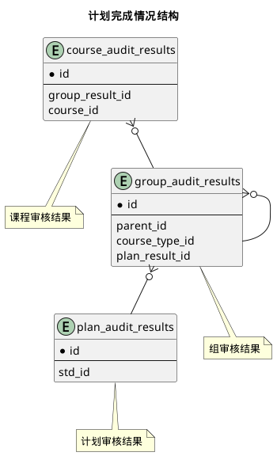

 
### 关系图 1. 计划完成情况结构
  * 关系图

### 表格 course_audit_results 课程审核结果

  
<h5 id="table_edu.course_audit_results">表格edu.course_audit_results</h5>

  

<ul>
  <li>表格说明</li>
</ul>

<table class="table table-bordered table-striped table-condensed ">
<tr><th class="info_header">表名</th><th class="info_header">主键</th><th class="info_header" style="width:40%">注释</th>  </tr>
<tr><td>edu.course_audit_results</td><td>id</td><td>课程审核结果</td>  </tr>
</table>
<ul>
  <li>表格中的列</li>
</ul>
<table class="table table-bordered table-striped table-condensed">
<tr><th class="info_header text-center">序号</th><th class="info_header">字段名</th><th class="info_header">字段类型</th><th class="info_header text-center">是否可空</th><th class="info_header">描述</th><th class="info_header">引用表</th>  </tr>
<tr><td class="text-center">1</td><td>id</td><td>bigint</td><td class="text-center">否</td><td>非业务主键:datetime</td><td></td>  </tr>
<tr><td class="text-center">2</td><td>compulsory</td><td>boolean</td><td class="text-center">否</td><td>是否必修</td><td></td>  </tr>
<tr><td class="text-center">3</td><td>course_id</td><td>bigint</td><td class="text-center">否</td><td>课程基本信息ID</td><td>            <a href="/docs/model/base/edu/core.html#表格-courses-课程基本信息">base.courses</a>
</td>  </tr>
<tr><td class="text-center">4</td><td>group_result_id</td><td>bigint</td><td class="text-center">否</td><td>组审核结果ID</td><td>            <a href="/docs/model/edu/grade/plan.html#表格-group_audit_results-组审核结果">edu.group_audit_results</a>
</td>  </tr>
<tr><td class="text-center">5</td><td>passed</td><td>boolean</td><td class="text-center">否</td><td>是否通过</td><td></td>  </tr>
<tr><td class="text-center">6</td><td>remark</td><td>varchar(150)</td><td class="text-center">是</td><td>备注</td><td></td>  </tr>
<tr><td class="text-center">7</td><td>scores</td><td>varchar(50)</td><td class="text-center">否</td><td>分数</td><td></td>  </tr>
<tr><td class="text-center">8</td><td>terms</td><td>integer</td><td class="text-center">否</td><td>开课学期</td><td></td>  </tr>
</table>

<ul>
  <li>表格中唯一约束</li>
</ul>
<table class="table table-bordered table-striped table-condensed">
  <tr>
<th class="info_header">序号</th><th class="info_header">约束名</th><th class="info_header">约束字段</th>  </tr>
<tr><td>1</td><td>uk_f9jth1bg1w3pq7io6y2wtmw7a</td><td>group_result_id,course_id</td>  </tr>
</table>

<ul>
  <li>表格的索引</li>
</ul>
<table class="table table-bordered table-striped table-condensed">
  <tr>
<th class="info_header">索引名</th><th class="info_header">索引字段</th><th class="info_header">是否唯一</th>  </tr>
<tr><td>idx_n27g9imaanyl2kggxag56rvhs</td><td>group_result_id</td><td>否</td>  </tr>
</table>
  

### 表格 group_audit_results 组审核结果

  
<h5 id="table_edu.group_audit_results">表格edu.group_audit_results</h5>

  

<ul>
  <li>表格说明</li>
</ul>

<table class="table table-bordered table-striped table-condensed ">
<tr><th class="info_header">表名</th><th class="info_header">主键</th><th class="info_header" style="width:40%">注释</th>  </tr>
<tr><td>edu.group_audit_results</td><td>id</td><td>组审核结果</td>  </tr>
</table>
<ul>
  <li>表格中的列</li>
</ul>
<table class="table table-bordered table-striped table-condensed">
<tr><th class="info_header text-center">序号</th><th class="info_header">字段名</th><th class="info_header">字段类型</th><th class="info_header text-center">是否可空</th><th class="info_header">描述</th><th class="info_header">引用表</th>  </tr>
<tr><td class="text-center">1</td><td>id</td><td>bigint</td><td class="text-center">否</td><td>非业务主键:datetime</td><td></td>  </tr>
<tr><td class="text-center">2</td><td>converted_credits</td><td>float4</td><td class="text-center">否</td><td>转换学分</td><td></td>  </tr>
<tr><td class="text-center">3</td><td>course_type_id</td><td>integer</td><td class="text-center">否</td><td>课程类别ID</td><td>            <a href="/docs/model/base/edu/misc.html#表格-c_course_types-课程类别">base.c_course_types</a>
</td>  </tr>
<tr><td class="text-center">4</td><td>indexno</td><td>varchar(255)</td><td class="text-center">否</td><td>顺序号</td><td></td>  </tr>
<tr><td class="text-center">5</td><td>name</td><td>varchar(100)</td><td class="text-center">否</td><td>名称</td><td></td>  </tr>
<tr><td class="text-center">6</td><td>parent_id</td><td>bigint</td><td class="text-center">是</td><td>组审核结果ID</td><td>            <a href="/docs/model/edu/grade/plan.html#表格-group_audit_results-组审核结果">edu.group_audit_results</a>
</td>  </tr>
<tr><td class="text-center">7</td><td>passed</td><td>boolean</td><td class="text-center">否</td><td>是否通过</td><td></td>  </tr>
<tr><td class="text-center">8</td><td>passed_count</td><td>integer</td><td class="text-center">否</td><td>完成门数</td><td></td>  </tr>
<tr><td class="text-center">9</td><td>passed_credits</td><td>float4</td><td class="text-center">否</td><td>完成学分</td><td></td>  </tr>
<tr><td class="text-center">10</td><td>plan_result_id</td><td>bigint</td><td class="text-center">否</td><td>计划审核结果ID</td><td>            <a href="/docs/model/edu/grade/plan.html#表格-plan_audit_results-计划审核结果">edu.plan_audit_results</a>
</td>  </tr>
<tr><td class="text-center">11</td><td>remark</td><td>varchar(255)</td><td class="text-center">是</td><td>备注</td><td></td>  </tr>
<tr><td class="text-center">12</td><td>required_count</td><td>integer</td><td class="text-center">否</td><td>要求门数</td><td></td>  </tr>
<tr><td class="text-center">13</td><td>required_credits</td><td>float4</td><td class="text-center">否</td><td>要求学分</td><td></td>  </tr>
<tr><td class="text-center">14</td><td>sub_count</td><td>smallint</td><td class="text-center">否</td><td>要求完成子组数量</td><td></td>  </tr>
</table>
<ul>
  <li>表格的索引</li>
</ul>
<table class="table table-bordered table-striped table-condensed">
  <tr>
<th class="info_header">索引名</th><th class="info_header">索引字段</th><th class="info_header">是否唯一</th>  </tr>
<tr><td>idx_a2dxk9q7074dj9m1085a82me7</td><td>parent_id</td><td>否</td>  </tr>
<tr><td>idx_9xfmxfqyoevwocv474u0tq2m3</td><td>plan_result_id</td><td>否</td>  </tr>
</table>
  

### 表格 plan_audit_results 计划审核结果

  
<h5 id="table_edu.plan_audit_results">表格edu.plan_audit_results</h5>

  

<ul>
  <li>表格说明</li>
</ul>

<table class="table table-bordered table-striped table-condensed ">
<tr><th class="info_header">表名</th><th class="info_header">主键</th><th class="info_header" style="width:40%">注释</th>  </tr>
<tr><td>edu.plan_audit_results</td><td>id</td><td>计划审核结果</td>  </tr>
</table>
<ul>
  <li>表格中的列</li>
</ul>
<table class="table table-bordered table-striped table-condensed">
<tr><th class="info_header text-center">序号</th><th class="info_header">字段名</th><th class="info_header">字段类型</th><th class="info_header text-center">是否可空</th><th class="info_header">描述</th><th class="info_header">引用表</th>  </tr>
<tr><td class="text-center">1</td><td>id</td><td>bigint</td><td class="text-center">否</td><td>非业务主键:datetime</td><td></td>  </tr>
<tr><td class="text-center">2</td><td>archived</td><td>boolean</td><td class="text-center">否</td><td>是否归档</td><td></td>  </tr>
<tr><td class="text-center">3</td><td>converted_credits</td><td>float4</td><td class="text-center">否</td><td>转换学分</td><td></td>  </tr>
<tr><td class="text-center">4</td><td>passed</td><td>boolean</td><td class="text-center">否</td><td>是否通过</td><td></td>  </tr>
<tr><td class="text-center">5</td><td>passed_count</td><td>integer</td><td class="text-center">否</td><td>完成门数</td><td></td>  </tr>
<tr><td class="text-center">6</td><td>passed_credits</td><td>float4</td><td class="text-center">否</td><td>完成学分</td><td></td>  </tr>
<tr><td class="text-center">7</td><td>remark</td><td>varchar(100)</td><td class="text-center">是</td><td>备注</td><td></td>  </tr>
<tr><td class="text-center">8</td><td>required_count</td><td>integer</td><td class="text-center">否</td><td>要求门数</td><td></td>  </tr>
<tr><td class="text-center">9</td><td>required_credits</td><td>float4</td><td class="text-center">否</td><td>要求学分</td><td></td>  </tr>
<tr><td class="text-center">10</td><td>std_id</td><td>bigint</td><td class="text-center">否</td><td>学籍信息实现ID</td><td>            <a href="/docs/model/base/std/core.html#表格-students-学籍信息实现">base.students</a>
</td>  </tr>
<tr><td class="text-center">11</td><td>updated_at</td><td>timestamptz</td><td class="text-center">否</td><td>更新时间</td><td></td>  </tr>
<tr><td class="text-center">12</td><td>updates</td><td>varchar(500)</td><td class="text-center">是</td><td>更新内容</td><td></td>  </tr>
</table>

<ul>
  <li>表格中唯一约束</li>
</ul>
<table class="table table-bordered table-striped table-condensed">
  <tr>
<th class="info_header">序号</th><th class="info_header">约束名</th><th class="info_header">约束字段</th>  </tr>
<tr><td>1</td><td>uk_f6f86yl0ja9p2dveh9syviq2x</td><td>std_id</td>  </tr>
</table>

  

