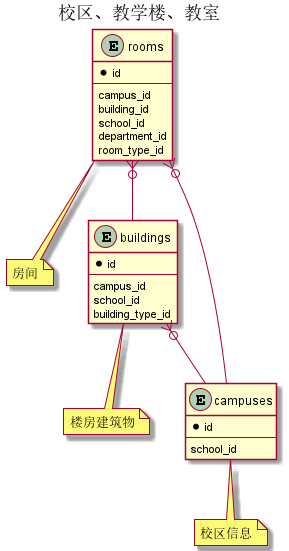


 目  录

* toc
{:toc}

### 关系图 1. 校区、教学楼、教室
  * 关系图

### 表格 buildings 楼房建筑物

  * 表格说明

<table class="table table-bordered table-striped table-condensed">
<tr><th style="background-color:#D0D3FF">表名</th><th style="background-color:#D0D3FF">主键</th><th style="background-color:#D0D3FF">注释</th>  </tr>
<tr><td>buildings</td><td>id</td><td>楼房建筑物</td>  </tr>
</table>

  * 表格中的列

<table class="table table-bordered table-striped table-condensed">
<tr><th style="background-color:#D0D3FF" class="text-center">序号</th><th style="background-color:#D0D3FF">字段名</th><th style="background-color:#D0D3FF">字段类型</th><th style="background-color:#D0D3FF" class="text-center">是否可空</th><th style="background-color:#D0D3FF">描述</th><th style="background-color:#D0D3FF">引用表</th>  </tr>
<tr><td class="text-center">1</td><td>id</td><td>integer</td><td class="text-center">否</td><td>非业务主键:auto_increment</td><td></td>  </tr>
<tr><td class="text-center">2</td><td>begin_on</td><td>date</td><td class="text-center">否</td><td>生效日期</td><td></td>  </tr>
<tr><td class="text-center">3</td><td>building_type_id</td><td>integer</td><td class="text-center">是</td><td>建筑物类型ID</td><td>           <a href="/model/code/asset.html#表格-building_types-建筑物用途类型">code.building_types</a>
</td>  </tr>
<tr><td class="text-center">4</td><td>campus_id</td><td>integer</td><td class="text-center">否</td><td>所在校区ID</td><td>           <a href="/model/base/common/space.html#表格-campuses-校区信息">base.campuses</a>
</td>  </tr>
<tr><td class="text-center">5</td><td>code</td><td>varchar(10)</td><td class="text-center">否</td><td>代码</td><td></td>  </tr>
<tr><td class="text-center">6</td><td>en_name</td><td>varchar(100)</td><td class="text-center">是</td><td>英文名称</td><td></td>  </tr>
<tr><td class="text-center">7</td><td>end_on</td><td>date</td><td class="text-center">是</td><td>失效日期</td><td></td>  </tr>
<tr><td class="text-center">8</td><td>name</td><td>varchar(80)</td><td class="text-center">否</td><td>名称</td><td></td>  </tr>
<tr><td class="text-center">9</td><td>remark</td><td>varchar(200)</td><td class="text-center">是</td><td>备注</td><td></td>  </tr>
<tr><td class="text-center">10</td><td>school_id</td><td>integer</td><td class="text-center">否</td><td>学校ID</td><td>           <a href="/model/base/common/space.html#表格-schools-学校信息">base.schools</a>
</td>  </tr>
<tr><td class="text-center">11</td><td>short_name</td><td>varchar(100)</td><td class="text-center">是</td><td>简称</td><td></td>  </tr>
<tr><td class="text-center">12</td><td>updated_at</td><td>timestamp</td><td class="text-center">否</td><td>更新时间</td><td></td>  </tr>
</table>

  * 表格中唯一约束

<table class="table table-bordered table-striped table-condensed">
  <tr>
<th style="background-color:#D0D3FF">序号</th><th style="background-color:#D0D3FF">约束名</th><th style="background-color:#D0D3FF">约束字段</th>  </tr>
<tr><td>1</td><td>uk_57bnctn8fdawxdyp9lpaxbgjt</td><td>school_id,code</td>  </tr>
</table>

### 表格 campuses 校区信息

  * 表格说明

<table class="table table-bordered table-striped table-condensed">
<tr><th style="background-color:#D0D3FF">表名</th><th style="background-color:#D0D3FF">主键</th><th style="background-color:#D0D3FF">注释</th>  </tr>
<tr><td>campuses</td><td>id</td><td>校区信息</td>  </tr>
</table>

  * 表格中的列

<table class="table table-bordered table-striped table-condensed">
<tr><th style="background-color:#D0D3FF" class="text-center">序号</th><th style="background-color:#D0D3FF">字段名</th><th style="background-color:#D0D3FF">字段类型</th><th style="background-color:#D0D3FF" class="text-center">是否可空</th><th style="background-color:#D0D3FF">描述</th><th style="background-color:#D0D3FF">引用表</th>  </tr>
<tr><td class="text-center">1</td><td>id</td><td>integer</td><td class="text-center">否</td><td>非业务主键:auto_increment</td><td></td>  </tr>
<tr><td class="text-center">2</td><td>begin_on</td><td>date</td><td class="text-center">否</td><td>生效日期</td><td></td>  </tr>
<tr><td class="text-center">3</td><td>code</td><td>varchar(10)</td><td class="text-center">否</td><td>代码</td><td></td>  </tr>
<tr><td class="text-center">4</td><td>en_name</td><td>varchar(100)</td><td class="text-center">是</td><td>英文名称</td><td></td>  </tr>
<tr><td class="text-center">5</td><td>end_on</td><td>date</td><td class="text-center">是</td><td>失效日期</td><td></td>  </tr>
<tr><td class="text-center">6</td><td>name</td><td>varchar(80)</td><td class="text-center">否</td><td>名称</td><td></td>  </tr>
<tr><td class="text-center">7</td><td>remark</td><td>varchar(200)</td><td class="text-center">是</td><td>备注</td><td></td>  </tr>
<tr><td class="text-center">8</td><td>school_id</td><td>integer</td><td class="text-center">否</td><td>学校ID</td><td>           <a href="/model/base/common/space.html#表格-schools-学校信息">base.schools</a>
</td>  </tr>
<tr><td class="text-center">9</td><td>short_name</td><td>varchar(100)</td><td class="text-center">是</td><td>简称</td><td></td>  </tr>
<tr><td class="text-center">10</td><td>updated_at</td><td>timestamp</td><td class="text-center">否</td><td>更新时间</td><td></td>  </tr>
</table>

  * 表格中唯一约束

<table class="table table-bordered table-striped table-condensed">
  <tr>
<th style="background-color:#D0D3FF">序号</th><th style="background-color:#D0D3FF">约束名</th><th style="background-color:#D0D3FF">约束字段</th>  </tr>
<tr><td>1</td><td>uk_iyq5494wgreojxq596lo7iijs</td><td>school_id,code</td>  </tr>
</table>

### 表格 rooms 房间

  * 表格说明

<table class="table table-bordered table-striped table-condensed">
<tr><th style="background-color:#D0D3FF">表名</th><th style="background-color:#D0D3FF">主键</th><th style="background-color:#D0D3FF">注释</th>  </tr>
<tr><td>rooms</td><td>id</td><td>房间</td>  </tr>
</table>

  * 表格中的列

<table class="table table-bordered table-striped table-condensed">
<tr><th style="background-color:#D0D3FF" class="text-center">序号</th><th style="background-color:#D0D3FF">字段名</th><th style="background-color:#D0D3FF">字段类型</th><th style="background-color:#D0D3FF" class="text-center">是否可空</th><th style="background-color:#D0D3FF">描述</th><th style="background-color:#D0D3FF">引用表</th>  </tr>
<tr><td class="text-center">1</td><td>id</td><td>integer</td><td class="text-center">否</td><td>非业务主键:auto_increment</td><td></td>  </tr>
<tr><td class="text-center">2</td><td>begin_on</td><td>date</td><td class="text-center">否</td><td>生效日期</td><td></td>  </tr>
<tr><td class="text-center">3</td><td>building_id</td><td>integer</td><td class="text-center">是</td><td>所在教学楼ID</td><td>           <a href="/model/base/common/space.html#表格-buildings-楼房建筑物">base.buildings</a>
</td>  </tr>
<tr><td class="text-center">4</td><td>campus_id</td><td>integer</td><td class="text-center">否</td><td>所在校区ID</td><td>           <a href="/model/base/common/space.html#表格-campuses-校区信息">base.campuses</a>
</td>  </tr>
<tr><td class="text-center">5</td><td>code</td><td>varchar(10)</td><td class="text-center">否</td><td>代码</td><td></td>  </tr>
<tr><td class="text-center">6</td><td>department_id</td><td>integer</td><td class="text-center">是</td><td>管理部门ID</td><td>           <a href="/model/base/common/user.html#表格-departments-部门组织机构信息">base.departments</a>
</td>  </tr>
<tr><td class="text-center">7</td><td>end_on</td><td>date</td><td class="text-center">是</td><td>失效日期</td><td></td>  </tr>
<tr><td class="text-center">8</td><td>floor_no</td><td>integer</td><td class="text-center">否</td><td>教室所处楼层</td><td></td>  </tr>
<tr><td class="text-center">9</td><td>name</td><td>varchar(80)</td><td class="text-center">否</td><td>名称</td><td></td>  </tr>
<tr><td class="text-center">10</td><td>remark</td><td>varchar(200)</td><td class="text-center">是</td><td>备注</td><td></td>  </tr>
<tr><td class="text-center">11</td><td>room_type_id</td><td>integer</td><td class="text-center">否</td><td>房间类型ID</td><td>           <a href="/model/code/asset.html#表格-room_types-房间用途类型">code.room_types</a>
</td>  </tr>
<tr><td class="text-center">12</td><td>school_id</td><td>integer</td><td class="text-center">否</td><td>学校ID</td><td>           <a href="/model/base/common/space.html#表格-schools-学校信息">base.schools</a>
</td>  </tr>
<tr><td class="text-center">13</td><td>updated_at</td><td>timestamp</td><td class="text-center">否</td><td>更新时间</td><td></td>  </tr>
</table>

  * 表格中唯一约束

<table class="table table-bordered table-striped table-condensed">
  <tr>
<th style="background-color:#D0D3FF">序号</th><th style="background-color:#D0D3FF">约束名</th><th style="background-color:#D0D3FF">约束字段</th>  </tr>
<tr><td>1</td><td>uk_b5l9ebt0gr0vn3qv9qtl0ii71</td><td>school_id,code</td>  </tr>
</table>

### 表格 schools 学校信息

  * 表格说明

<table class="table table-bordered table-striped table-condensed">
<tr><th style="background-color:#D0D3FF">表名</th><th style="background-color:#D0D3FF">主键</th><th style="background-color:#D0D3FF">注释</th>  </tr>
<tr><td>schools</td><td>id</td><td>学校信息</td>  </tr>
</table>

  * 表格中的列

<table class="table table-bordered table-striped table-condensed">
<tr><th style="background-color:#D0D3FF" class="text-center">序号</th><th style="background-color:#D0D3FF">字段名</th><th style="background-color:#D0D3FF">字段类型</th><th style="background-color:#D0D3FF" class="text-center">是否可空</th><th style="background-color:#D0D3FF">描述</th><th style="background-color:#D0D3FF">引用表</th>  </tr>
<tr><td class="text-center">1</td><td>id</td><td>integer</td><td class="text-center">否</td><td>非业务主键:auto_increment</td><td></td>  </tr>
<tr><td class="text-center">2</td><td>begin_on</td><td>date</td><td class="text-center">否</td><td>生效日期</td><td></td>  </tr>
<tr><td class="text-center">3</td><td>code</td><td>varchar(10)</td><td class="text-center">否</td><td>代码</td><td></td>  </tr>
<tr><td class="text-center">4</td><td>end_on</td><td>date</td><td class="text-center">是</td><td>失效日期</td><td></td>  </tr>
<tr><td class="text-center">5</td><td>institution_id</td><td>integer</td><td class="text-center">否</td><td>研究机构ID</td><td>           <a href="/model/code/edu.html#表格-institutions-科研机构">code.institutions</a>
</td>  </tr>
<tr><td class="text-center">6</td><td>logo_url</td><td>varchar(255)</td><td class="text-center">否</td><td>Logo URL</td><td></td>  </tr>
<tr><td class="text-center">7</td><td>name</td><td>varchar(50)</td><td class="text-center">否</td><td>名称</td><td></td>  </tr>
<tr><td class="text-center">8</td><td>short_name</td><td>varchar(255)</td><td class="text-center">是</td><td>简称</td><td></td>  </tr>
</table>

