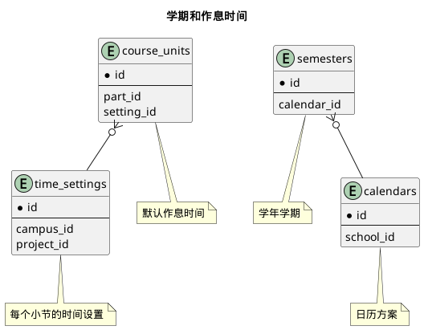


 目  录

* toc
{:toc}

### 关系图 1. 学期和作息时间
  * 关系图

### 表格 calendar_stages 日历阶段

  
<h5 id="table_base.calendar_stages">表格base.calendar_stages</h5>

  

<ul>
  <li>表格说明</li>
</ul>

<table class="table table-bordered table-striped table-condensed ">
<tr><th class="info_header">表名</th><th class="info_header">主键</th><th class="info_header" style="width:40%">注释</th>  </tr>
<tr><td>base.calendar_stages</td><td>id</td><td>日历阶段</td>  </tr>
</table>
<ul>
  <li>表格中的列</li>
</ul>
<table class="table table-bordered table-striped table-condensed">
<tr><th class="info_header text-center">序号</th><th class="info_header">字段名</th><th class="info_header">字段类型</th><th class="info_header text-center">是否可空</th><th class="info_header">描述</th><th class="info_header">引用表</th>  </tr>
<tr><td class="text-center">1</td><td>id</td><td>integer</td><td class="text-center">否</td><td>非业务主键:auto_increment</td><td></td>  </tr>
<tr><td class="text-center">2</td><td>name</td><td>varchar(100)</td><td class="text-center">否</td><td>名称</td><td></td>  </tr>
<tr><td class="text-center">3</td><td>school_id</td><td>integer</td><td class="text-center">否</td><td>学校信息ID</td><td>            <a href="/model/base/common/misc.html#表格-schools-学校信息">base.schools</a>
</td>  </tr>
<tr><td class="text-center">4</td><td>vacation</td><td>boolean</td><td class="text-center">否</td><td>是否假期</td><td></td>  </tr>
</table>

  

### 表格 calendars 日历方案

  
<h5 id="table_base.calendars">表格base.calendars</h5>

  

<ul>
  <li>表格说明</li>
</ul>

<table class="table table-bordered table-striped table-condensed ">
<tr><th class="info_header">表名</th><th class="info_header">主键</th><th class="info_header" style="width:40%">注释</th>  </tr>
<tr><td>base.calendars</td><td>id</td><td>日历方案</td>  </tr>
</table>
<ul>
  <li>表格中的列</li>
</ul>
<table class="table table-bordered table-striped table-condensed">
<tr><th class="info_header text-center">序号</th><th class="info_header">字段名</th><th class="info_header">字段类型</th><th class="info_header text-center">是否可空</th><th class="info_header">描述</th><th class="info_header">引用表</th>  </tr>
<tr><td class="text-center">1</td><td>id</td><td>integer</td><td class="text-center">否</td><td>非业务主键:auto_increment</td><td></td>  </tr>
<tr><td class="text-center">2</td><td>begin_on</td><td>date</td><td class="text-center">否</td><td>生效日期</td><td></td>  </tr>
<tr><td class="text-center">3</td><td>code</td><td>varchar(10)</td><td class="text-center">否</td><td>代码</td><td></td>  </tr>
<tr><td class="text-center">4</td><td>end_on</td><td>date</td><td class="text-center">是</td><td>失效日期</td><td></td>  </tr>
<tr><td class="text-center">5</td><td>first_weekday</td><td>integer</td><td class="text-center">否</td><td>每周开始时间</td><td></td>  </tr>
<tr><td class="text-center">6</td><td>name</td><td>varchar(80)</td><td class="text-center">否</td><td>名称</td><td></td>  </tr>
<tr><td class="text-center">7</td><td>school_id</td><td>integer</td><td class="text-center">否</td><td>学校ID</td><td>            <a href="/model/base/common/misc.html#表格-schools-学校信息">base.schools</a>
</td>  </tr>
<tr><td class="text-center">8</td><td>updated_at</td><td>timestamptz</td><td class="text-center">否</td><td>更新时间</td><td></td>  </tr>
</table>

<ul>
  <li>表格中唯一约束</li>
</ul>
<table class="table table-bordered table-striped table-condensed">
  <tr>
<th class="info_header">序号</th><th class="info_header">约束名</th><th class="info_header">约束字段</th>  </tr>
<tr><td>1</td><td>uk_9k89gny3vqpqyk7mkhuxg16fi</td><td>school_id,code</td>  </tr>
</table>

  

### 表格 semester_stages 学期阶段

  
<h5 id="table_base.semester_stages">表格base.semester_stages</h5>

  

<ul>
  <li>表格说明</li>
</ul>

<table class="table table-bordered table-striped table-condensed ">
<tr><th class="info_header">表名</th><th class="info_header">主键</th><th class="info_header" style="width:40%">注释</th>  </tr>
<tr><td>base.semester_stages</td><td>id</td><td>学期阶段</td>  </tr>
</table>
<ul>
  <li>表格中的列</li>
</ul>
<table class="table table-bordered table-striped table-condensed">
<tr><th class="info_header text-center">序号</th><th class="info_header">字段名</th><th class="info_header">字段类型</th><th class="info_header text-center">是否可空</th><th class="info_header">描述</th><th class="info_header">引用表</th>  </tr>
<tr><td class="text-center">1</td><td>id</td><td>integer</td><td class="text-center">否</td><td>非业务主键:auto_increment</td><td></td>  </tr>
<tr><td class="text-center">2</td><td>begin_on</td><td>date</td><td class="text-center">否</td><td>开始日期</td><td></td>  </tr>
<tr><td class="text-center">3</td><td>end_on</td><td>date</td><td class="text-center">否</td><td>结束日期</td><td></td>  </tr>
<tr><td class="text-center">4</td><td>remark</td><td>varchar(500)</td><td class="text-center">是</td><td>备注</td><td></td>  </tr>
<tr><td class="text-center">5</td><td>semester_id</td><td>integer</td><td class="text-center">否</td><td>学年学期ID</td><td>            <a href="/model/base/common/time.html#表格-semesters-学年学期">base.semesters</a>
</td>  </tr>
<tr><td class="text-center">6</td><td>stage_id</td><td>integer</td><td class="text-center">否</td><td>日历阶段ID</td><td>            <a href="/model/base/common/time.html#表格-calendar_stages-日历阶段">base.calendar_stages</a>
</td>  </tr>
</table>

<ul>
  <li>表格的索引</li>
</ul>
<table class="table table-bordered table-striped table-condensed">
  <tr>
<th class="info_header">索引名</th><th class="info_header">索引字段</th><th class="info_header">是否唯一</th>  </tr>
<tr><td>idx_oaj7k1ifx24c5uno3e8xhi4c7</td><td>semester_id</td><td>否</td>  </tr>
</table>
  

### 表格 semesters 学年学期

  
<h5 id="table_base.semesters">表格base.semesters</h5>

  

<ul>
  <li>表格说明</li>
</ul>

<table class="table table-bordered table-striped table-condensed ">
<tr><th class="info_header">表名</th><th class="info_header">主键</th><th class="info_header" style="width:40%">注释</th>  </tr>
<tr><td>base.semesters</td><td>id</td><td>学年学期</td>  </tr>
</table>
<ul>
  <li>表格中的列</li>
</ul>
<table class="table table-bordered table-striped table-condensed">
<tr><th class="info_header text-center">序号</th><th class="info_header">字段名</th><th class="info_header">字段类型</th><th class="info_header text-center">是否可空</th><th class="info_header">描述</th><th class="info_header">引用表</th>  </tr>
<tr><td class="text-center">1</td><td>id</td><td>integer</td><td class="text-center">否</td><td>非业务主键:code</td><td></td>  </tr>
<tr><td class="text-center">2</td><td>archived</td><td>boolean</td><td class="text-center">否</td><td>是否归档</td><td></td>  </tr>
<tr><td class="text-center">3</td><td>begin_on</td><td>date</td><td class="text-center">否</td><td>开始日期</td><td></td>  </tr>
<tr><td class="text-center">4</td><td>calendar_id</td><td>integer</td><td class="text-center">否</td><td>教学日历方案类别ID</td><td>            <a href="/model/base/common/time.html#表格-calendars-日历方案">base.calendars</a>
</td>  </tr>
<tr><td class="text-center">5</td><td>code</td><td>varchar(15)</td><td class="text-center">否</td><td>代码</td><td></td>  </tr>
<tr><td class="text-center">6</td><td>end_on</td><td>date</td><td class="text-center">否</td><td>结束日期</td><td></td>  </tr>
<tr><td class="text-center">7</td><td>name</td><td>varchar(10)</td><td class="text-center">否</td><td>名称</td><td></td>  </tr>
<tr><td class="text-center">8</td><td>remark</td><td>varchar(255)</td><td class="text-center">是</td><td>备注</td><td></td>  </tr>
<tr><td class="text-center">9</td><td>school_year</td><td>varchar(10)</td><td class="text-center">否</td><td>学年度,格式2005-2006</td><td></td>  </tr>
</table>

<ul>
  <li>表格中唯一约束</li>
</ul>
<table class="table table-bordered table-striped table-condensed">
  <tr>
<th class="info_header">序号</th><th class="info_header">约束名</th><th class="info_header">约束字段</th>  </tr>
<tr><td>1</td><td>uk_kd2xc25i3147f18f3i02rkisg</td><td>calendar_id,code</td>  </tr>
</table>

<ul>
  <li>表格的索引</li>
</ul>
<table class="table table-bordered table-striped table-condensed">
  <tr>
<th class="info_header">索引名</th><th class="info_header">索引字段</th><th class="info_header">是否唯一</th>  </tr>
<tr><td>idx_o7lu6fw6qehpr050je6d9rsa4</td><td>calendar_id</td><td>否</td>  </tr>
</table>
  

