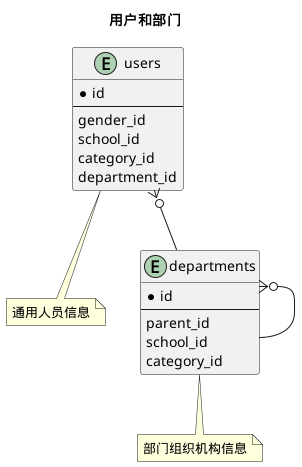


 目  录

* toc
{:toc}

### 关系图 1. 用户和部门
  * 关系图

### 表格 department_categories 部门分类

  * 表格说明

<table class="table table-bordered table-striped table-condensed">
<tr><th style="background-color:#D0D3FF">表名</th><th style="background-color:#D0D3FF">主键</th><th style="background-color:#D0D3FF">注释</th>  </tr>
<tr><td>department_categories</td><td>id</td><td>部门分类</td>  </tr>
</table>

  * 表格中的列

<table class="table table-bordered table-striped table-condensed">
<tr><th style="background-color:#D0D3FF" class="text-center">序号</th><th style="background-color:#D0D3FF">字段名</th><th style="background-color:#D0D3FF">字段类型</th><th style="background-color:#D0D3FF" class="text-center">是否可空</th><th style="background-color:#D0D3FF">描述</th><th style="background-color:#D0D3FF">引用表</th>  </tr>
<tr><td class="text-center">1</td><td>id</td><td>integer</td><td class="text-center">否</td><td>非业务主键:auto_increment</td><td></td>  </tr>
<tr><td class="text-center">2</td><td>begin_on</td><td>date</td><td class="text-center">否</td><td>生效日期</td><td></td>  </tr>
<tr><td class="text-center">3</td><td>code</td><td>varchar(20)</td><td class="text-center">否</td><td>代码</td><td></td>  </tr>
<tr><td class="text-center">4</td><td>en_name</td><td>varchar(300)</td><td class="text-center">是</td><td>英文名称</td><td></td>  </tr>
<tr><td class="text-center">5</td><td>end_on</td><td>date</td><td class="text-center">是</td><td>失效日期</td><td></td>  </tr>
<tr><td class="text-center">6</td><td>indexno</td><td>varchar(255)</td><td class="text-center">否</td><td>顺序号</td><td></td>  </tr>
<tr><td class="text-center">7</td><td>name</td><td>varchar(100)</td><td class="text-center">否</td><td>名称</td><td></td>  </tr>
<tr><td class="text-center">8</td><td>parent_id</td><td>integer</td><td class="text-center">是</td><td>上级分类ID</td><td>           <a href="/base/common/user.html#表格-department_categories-部门分类">base.department_categories</a>
</td>  </tr>
<tr><td class="text-center">9</td><td>remark</td><td>varchar(200)</td><td class="text-center">是</td><td>备注</td><td></td>  </tr>
<tr><td class="text-center">10</td><td>updated_at</td><td>timestamp</td><td class="text-center">否</td><td>修改时间</td><td></td>  </tr>
</table>

  * 表格的索引

<table class="table table-bordered table-striped table-condensed">
  <tr>
<th style="background-color:#D0D3FF">索引名</th><th style="background-color:#D0D3FF">索引字段</th><th style="background-color:#D0D3FF">是否唯一</th>  </tr>
<tr><td>idx_rjl6jeb6fw4xp9247gv68vw64</td><td>parent_id</td><td>否</td>  </tr>
</table>

### 表格 departments 部门组织机构信息

  * 表格说明

<table class="table table-bordered table-striped table-condensed">
<tr><th style="background-color:#D0D3FF">表名</th><th style="background-color:#D0D3FF">主键</th><th style="background-color:#D0D3FF">注释</th>  </tr>
<tr><td>departments</td><td>id</td><td>部门组织机构信息</td>  </tr>
</table>

  * 表格中的列

<table class="table table-bordered table-striped table-condensed">
<tr><th style="background-color:#D0D3FF" class="text-center">序号</th><th style="background-color:#D0D3FF">字段名</th><th style="background-color:#D0D3FF">字段类型</th><th style="background-color:#D0D3FF" class="text-center">是否可空</th><th style="background-color:#D0D3FF">描述</th><th style="background-color:#D0D3FF">引用表</th>  </tr>
<tr><td class="text-center">1</td><td>id</td><td>integer</td><td class="text-center">否</td><td>非业务主键:auto_increment</td><td></td>  </tr>
<tr><td class="text-center">2</td><td>begin_on</td><td>date</td><td class="text-center">否</td><td>生效日期</td><td></td>  </tr>
<tr><td class="text-center">3</td><td>category_id</td><td>integer</td><td class="text-center">是</td><td>部门分类ID</td><td>           <a href="/base/common/user.html#表格-department_categories-部门分类">base.department_categories</a>
</td>  </tr>
<tr><td class="text-center">4</td><td>code</td><td>varchar(10)</td><td class="text-center">否</td><td>代码</td><td></td>  </tr>
<tr><td class="text-center">5</td><td>en_name</td><td>varchar(100)</td><td class="text-center">是</td><td>英文名称</td><td></td>  </tr>
<tr><td class="text-center">6</td><td>end_on</td><td>date</td><td class="text-center">是</td><td>失效日期</td><td></td>  </tr>
<tr><td class="text-center">7</td><td>indexno</td><td>varchar(20)</td><td class="text-center">否</td><td>顺序号</td><td></td>  </tr>
<tr><td class="text-center">8</td><td>name</td><td>varchar(80)</td><td class="text-center">否</td><td>名称</td><td></td>  </tr>
<tr><td class="text-center">9</td><td>parent_id</td><td>integer</td><td class="text-center">是</td><td>上级单位ID</td><td>           <a href="/base/common/user.html#表格-departments-部门组织机构信息">base.departments</a>
</td>  </tr>
<tr><td class="text-center">10</td><td>remark</td><td>varchar(200)</td><td class="text-center">是</td><td>备注</td><td></td>  </tr>
<tr><td class="text-center">11</td><td>research</td><td>boolean</td><td class="text-center">否</td><td>是否科研部门</td><td></td>  </tr>
<tr><td class="text-center">12</td><td>school_id</td><td>integer</td><td class="text-center">否</td><td>学校ID</td><td>           <a href="/base/common/space.html#表格-schools-学校信息">base.schools</a>
</td>  </tr>
<tr><td class="text-center">13</td><td>short_name</td><td>varchar(100)</td><td class="text-center">是</td><td>简称</td><td></td>  </tr>
<tr><td class="text-center">14</td><td>teaching</td><td>boolean</td><td class="text-center">否</td><td>是否教学部门</td><td></td>  </tr>
<tr><td class="text-center">15</td><td>updated_at</td><td>timestamp</td><td class="text-center">否</td><td>更新时间</td><td></td>  </tr>
</table>

  * 表格中唯一约束

<table class="table table-bordered table-striped table-condensed">
  <tr>
<th style="background-color:#D0D3FF">序号</th><th style="background-color:#D0D3FF">约束名</th><th style="background-color:#D0D3FF">约束字段</th>  </tr>
<tr><td>1</td><td>uk_blem78dvbmeuekoy0jg6px6j7</td><td>school_id,code</td>  </tr>
</table>

  * 表格的索引

<table class="table table-bordered table-striped table-condensed">
  <tr>
<th style="background-color:#D0D3FF">索引名</th><th style="background-color:#D0D3FF">索引字段</th><th style="background-color:#D0D3FF">是否唯一</th>  </tr>
<tr><td>idx_lloboi12ir2a1q541ntsr7kao</td><td>parent_id</td><td>否</td>  </tr>
</table>

### 表格 departments_campuses 部门对应校区

  * 表格说明

<table class="table table-bordered table-striped table-condensed">
<tr><th style="background-color:#D0D3FF">表名</th><th style="background-color:#D0D3FF">主键</th><th style="background-color:#D0D3FF">注释</th>  </tr>
<tr><td>departments_campuses</td><td>department_id,campus_id</td><td>部门对应校区</td>  </tr>
</table>

  * 表格中的列

<table class="table table-bordered table-striped table-condensed">
<tr><th style="background-color:#D0D3FF" class="text-center">序号</th><th style="background-color:#D0D3FF">字段名</th><th style="background-color:#D0D3FF">字段类型</th><th style="background-color:#D0D3FF" class="text-center">是否可空</th><th style="background-color:#D0D3FF">描述</th><th style="background-color:#D0D3FF">引用表</th>  </tr>
<tr><td class="text-center">1</td><td>campus_id</td><td>integer</td><td class="text-center">否</td><td>校区信息ID</td><td>           <a href="/base/common/space.html#表格-campuses-校区信息">base.campuses</a>
</td>  </tr>
<tr><td class="text-center">2</td><td>department_id</td><td>integer</td><td class="text-center">否</td><td>部门组织机构信息ID</td><td>           <a href="/base/common/user.html#表格-departments-部门组织机构信息">base.departments</a>
</td>  </tr>
</table>

  * 表格的索引

<table class="table table-bordered table-striped table-condensed">
  <tr>
<th style="background-color:#D0D3FF">索引名</th><th style="background-color:#D0D3FF">索引字段</th><th style="background-color:#D0D3FF">是否唯一</th>  </tr>
<tr><td>idx_4tia0kw51tgg3ruidjnm1q02k</td><td>department_id</td><td>否</td>  </tr>
</table>

### 表格 people 人员信息

  * 表格说明

<table class="table table-bordered table-striped table-condensed">
<tr><th style="background-color:#D0D3FF">表名</th><th style="background-color:#D0D3FF">主键</th><th style="background-color:#D0D3FF">注释</th>  </tr>
<tr><td>people</td><td>id</td><td>人员信息</td>  </tr>
</table>

  * 表格中的列

<table class="table table-bordered table-striped table-condensed">
<tr><th style="background-color:#D0D3FF" class="text-center">序号</th><th style="background-color:#D0D3FF">字段名</th><th style="background-color:#D0D3FF">字段类型</th><th style="background-color:#D0D3FF" class="text-center">是否可空</th><th style="background-color:#D0D3FF">描述</th><th style="background-color:#D0D3FF">引用表</th>  </tr>
<tr><td class="text-center">1</td><td>id</td><td>bigint</td><td class="text-center">否</td><td>非业务主键:datetime</td><td></td>  </tr>
<tr><td class="text-center">2</td><td>birthday</td><td>date</td><td class="text-center">否</td><td>出生日期</td><td></td>  </tr>
<tr><td class="text-center">3</td><td>birthplace</td><td>varchar(255)</td><td class="text-center">是</td><td>出生地</td><td></td>  </tr>
<tr><td class="text-center">4</td><td>code</td><td>varchar(30)</td><td class="text-center">否</td><td>证件号码</td><td></td>  </tr>
<tr><td class="text-center">5</td><td>compatriot_type_id</td><td>integer</td><td class="text-center">是</td><td>港澳台侨ID</td><td>           <a href="/code/person.html#表格-compatriot_types-港澳台侨类型">code.compatriot_types</a>
</td>  </tr>
<tr><td class="text-center">6</td><td>country_id</td><td>integer</td><td class="text-center">是</td><td>国籍/地区ID</td><td>           <a href="/code/geo.html#表格-countries-国家地区">code.countries</a>
</td>  </tr>
<tr><td class="text-center">7</td><td>family_name</td><td>varchar(80)</td><td class="text-center">是</td><td>姓</td><td></td>  </tr>
<tr><td class="text-center">8</td><td>formated_name</td><td>varchar(100)</td><td class="text-center">否</td><td>姓名</td><td></td>  </tr>
<tr><td class="text-center">9</td><td>former_name</td><td>varchar(100)</td><td class="text-center">是</td><td>曾用名</td><td></td>  </tr>
<tr><td class="text-center">10</td><td>gender_id</td><td>integer</td><td class="text-center">否</td><td>性别ID</td><td>           <a href="/code/person.html#表格-genders-性别">code.genders</a>
</td>  </tr>
<tr><td class="text-center">11</td><td>given_name</td><td>varchar(80)</td><td class="text-center">是</td><td>名</td><td></td>  </tr>
<tr><td class="text-center">12</td><td>home_town</td><td>varchar(255)</td><td class="text-center">是</td><td>籍贯</td><td></td>  </tr>
<tr><td class="text-center">13</td><td>id_type_id</td><td>integer</td><td class="text-center">否</td><td>身份证件类型ID</td><td>           <a href="/code/person.html#表格-id_types-证件类型">code.id_types</a>
</td>  </tr>
<tr><td class="text-center">14</td><td>language_id</td><td>integer</td><td class="text-center">是</td><td>首要使用语言ID</td><td>           <a href="/code/edu.html#表格-languages-语种">code.languages</a>
</td>  </tr>
<tr><td class="text-center">15</td><td>middle_name</td><td>varchar(50)</td><td class="text-center">是</td><td>中间名</td><td></td>  </tr>
<tr><td class="text-center">16</td><td>nation_id</td><td>integer</td><td class="text-center">是</td><td>民族ID</td><td>           <a href="/code/person.html#表格-nations-民族">code.nations</a>
</td>  </tr>
<tr><td class="text-center">17</td><td>phonetic_name</td><td>varchar(100)</td><td class="text-center">是</td><td>姓名拼音</td><td></td>  </tr>
<tr><td class="text-center">18</td><td>political_status_id</td><td>integer</td><td class="text-center">是</td><td>政治面貌ID</td><td>           <a href="/code/person.html#表格-political_statuses-政治面貌">code.political_statuses</a>
</td>  </tr>
<tr><td class="text-center">19</td><td>religion_id</td><td>integer</td><td class="text-center">是</td><td>宗教信仰ID</td><td>           <a href="/code/person.html#表格-religions-宗教信仰">code.religions</a>
</td>  </tr>
<tr><td class="text-center">20</td><td>updated_at</td><td>timestamp</td><td class="text-center">否</td><td>更新时间</td><td></td>  </tr>
</table>

### 表格 user_categories 人员分类

  * 表格说明

<table class="table table-bordered table-striped table-condensed">
<tr><th style="background-color:#D0D3FF">表名</th><th style="background-color:#D0D3FF">主键</th><th style="background-color:#D0D3FF">注释</th>  </tr>
<tr><td>user_categories</td><td>id</td><td>人员分类</td>  </tr>
</table>

  * 表格中的列

<table class="table table-bordered table-striped table-condensed">
<tr><th style="background-color:#D0D3FF" class="text-center">序号</th><th style="background-color:#D0D3FF">字段名</th><th style="background-color:#D0D3FF">字段类型</th><th style="background-color:#D0D3FF" class="text-center">是否可空</th><th style="background-color:#D0D3FF">描述</th><th style="background-color:#D0D3FF">引用表</th>  </tr>
<tr><td class="text-center">1</td><td>id</td><td>integer</td><td class="text-center">否</td><td>非业务主键:auto_increment</td><td></td>  </tr>
<tr><td class="text-center">2</td><td>begin_on</td><td>date</td><td class="text-center">否</td><td>生效日期</td><td></td>  </tr>
<tr><td class="text-center">3</td><td>code</td><td>varchar(20)</td><td class="text-center">否</td><td>代码</td><td></td>  </tr>
<tr><td class="text-center">4</td><td>en_name</td><td>varchar(300)</td><td class="text-center">是</td><td>英文名称</td><td></td>  </tr>
<tr><td class="text-center">5</td><td>end_on</td><td>date</td><td class="text-center">是</td><td>失效日期</td><td></td>  </tr>
<tr><td class="text-center">6</td><td>name</td><td>varchar(100)</td><td class="text-center">否</td><td>名称</td><td></td>  </tr>
<tr><td class="text-center">7</td><td>remark</td><td>varchar(200)</td><td class="text-center">是</td><td>备注</td><td></td>  </tr>
<tr><td class="text-center">8</td><td>updated_at</td><td>timestamp</td><td class="text-center">否</td><td>修改时间</td><td></td>  </tr>
</table>

### 表格 users 通用人员信息

  * 表格说明

<table class="table table-bordered table-striped table-condensed">
<tr><th style="background-color:#D0D3FF">表名</th><th style="background-color:#D0D3FF">主键</th><th style="background-color:#D0D3FF">注释</th>  </tr>
<tr><td>users</td><td>id</td><td>通用人员信息</td>  </tr>
</table>

  * 表格中的列

<table class="table table-bordered table-striped table-condensed">
<tr><th style="background-color:#D0D3FF" class="text-center">序号</th><th style="background-color:#D0D3FF">字段名</th><th style="background-color:#D0D3FF">字段类型</th><th style="background-color:#D0D3FF" class="text-center">是否可空</th><th style="background-color:#D0D3FF">描述</th><th style="background-color:#D0D3FF">引用表</th>  </tr>
<tr><td class="text-center">1</td><td>id</td><td>bigint</td><td class="text-center">否</td><td>非业务主键:datetime</td><td></td>  </tr>
<tr><td class="text-center">2</td><td>begin_on</td><td>date</td><td class="text-center">否</td><td>生效日期</td><td></td>  </tr>
<tr><td class="text-center">3</td><td>category_id</td><td>integer</td><td class="text-center">否</td><td>人员分类ID</td><td>           <a href="/base/common/user.html#表格-user_categories-人员分类">base.user_categories</a>
</td>  </tr>
<tr><td class="text-center">4</td><td>code</td><td>varchar(30)</td><td class="text-center">否</td><td>人员帐号</td><td></td>  </tr>
<tr><td class="text-center">5</td><td>department_id</td><td>integer</td><td class="text-center">否</td><td>所在部门ID</td><td>           <a href="/base/common/user.html#表格-departments-部门组织机构信息">base.departments</a>
</td>  </tr>
<tr><td class="text-center">6</td><td>email</td><td>varchar(80)</td><td class="text-center">是</td><td>邮箱</td><td></td>  </tr>
<tr><td class="text-center">7</td><td>en_name</td><td>varchar(255)</td><td class="text-center">是</td><td>英文名</td><td></td>  </tr>
<tr><td class="text-center">8</td><td>end_on</td><td>date</td><td class="text-center">是</td><td>失效日期</td><td></td>  </tr>
<tr><td class="text-center">9</td><td>gender_id</td><td>integer</td><td class="text-center">否</td><td>性别ID</td><td>           <a href="/code/person.html#表格-genders-性别">code.genders</a>
</td>  </tr>
<tr><td class="text-center">10</td><td>mobile</td><td>varchar(15)</td><td class="text-center">是</td><td>电话</td><td></td>  </tr>
<tr><td class="text-center">11</td><td>name</td><td>varchar(80)</td><td class="text-center">否</td><td>姓名</td><td></td>  </tr>
<tr><td class="text-center">12</td><td>remark</td><td>varchar(200)</td><td class="text-center">是</td><td>备注</td><td></td>  </tr>
<tr><td class="text-center">13</td><td>school_id</td><td>integer</td><td class="text-center">否</td><td>学校ID</td><td>           <a href="/base/common/space.html#表格-schools-学校信息">base.schools</a>
</td>  </tr>
<tr><td class="text-center">14</td><td>updated_at</td><td>timestamp</td><td class="text-center">否</td><td>更新时间</td><td></td>  </tr>
</table>

  * 表格中唯一约束

<table class="table table-bordered table-striped table-condensed">
  <tr>
<th style="background-color:#D0D3FF">序号</th><th style="background-color:#D0D3FF">约束名</th><th style="background-color:#D0D3FF">约束字段</th>  </tr>
<tr><td>1</td><td>uk_rtwk6iqyuv8d7se1gkkumd948</td><td>school_id,code</td>  </tr>
</table>

