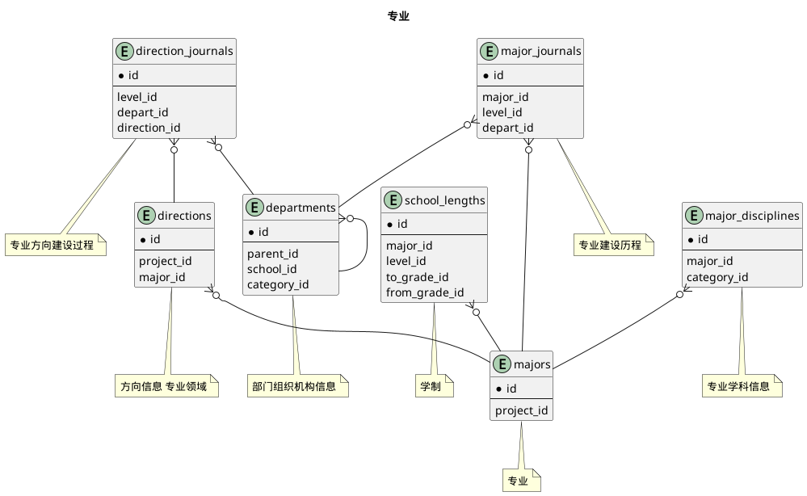
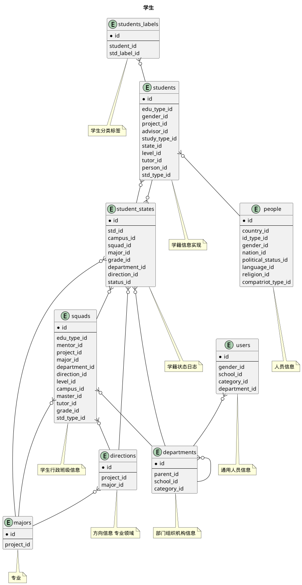


 目  录

* toc
{:toc}

### 关系图 1. 行政班级
  * 关系图

### 关系图 2. 专业
  * 关系图

### 关系图 3. 学生
  * 关系图

### 表格 course_hours 课程分类课时信息

  * 表格说明

<table class="table table-bordered table-striped table-condensed">
<tr><th style="background-color:#D0D3FF">表名</th><th style="background-color:#D0D3FF">主键</th><th style="background-color:#D0D3FF">注释</th>  </tr>
<tr><td>course_hours</td><td>id</td><td>课程分类课时信息</td>  </tr>
</table>

  * 表格中的列

<table class="table table-bordered table-striped table-condensed">
<tr><th style="background-color:#D0D3FF" class="text-center">序号</th><th style="background-color:#D0D3FF">字段名</th><th style="background-color:#D0D3FF">字段类型</th><th style="background-color:#D0D3FF" class="text-center">是否可空</th><th style="background-color:#D0D3FF">描述</th><th style="background-color:#D0D3FF">引用表</th>  </tr>
<tr><td class="text-center">1</td><td>id</td><td>bigint</td><td class="text-center">否</td><td>非业务主键:datetime</td><td></td>  </tr>
<tr><td class="text-center">2</td><td>course_id</td><td>bigint</td><td class="text-center">否</td><td>课程ID</td><td>base.courses</td>  </tr>
<tr><td class="text-center">3</td><td>credit_hours</td><td>integer</td><td class="text-center">否</td><td>学时/总课时</td><td></td>  </tr>
<tr><td class="text-center">4</td><td>teaching_nature_id</td><td>integer</td><td class="text-center">否</td><td>授课性质ID</td><td>code.teaching_natures</td>  </tr>
<tr><td class="text-center">5</td><td>weeks</td><td>integer</td><td class="text-center">否</td><td>周数</td><td></td>  </tr>
</table>

  * 表格的索引

<table class="table table-bordered table-striped table-condensed">
  <tr>
<th style="background-color:#D0D3FF">索引名</th><th style="background-color:#D0D3FF">索引字段</th><th style="background-color:#D0D3FF">是否唯一</th>  </tr>
<tr><td>idx_cio9wl9gex7fo85575w4112c4</td><td>course_id&nbsp;</td><td>否</td>  </tr>
</table>

### 表格 courses 课程基本信息

  * 表格说明

<table class="table table-bordered table-striped table-condensed">
<tr><th style="background-color:#D0D3FF">表名</th><th style="background-color:#D0D3FF">主键</th><th style="background-color:#D0D3FF">注释</th>  </tr>
<tr><td>courses</td><td>id</td><td>课程基本信息</td>  </tr>
</table>

  * 表格中的列

<table class="table table-bordered table-striped table-condensed">
<tr><th style="background-color:#D0D3FF" class="text-center">序号</th><th style="background-color:#D0D3FF">字段名</th><th style="background-color:#D0D3FF">字段类型</th><th style="background-color:#D0D3FF" class="text-center">是否可空</th><th style="background-color:#D0D3FF">描述</th><th style="background-color:#D0D3FF">引用表</th>  </tr>
<tr><td class="text-center">1</td><td>id</td><td>bigint</td><td class="text-center">否</td><td>非业务主键:datetime</td><td></td>  </tr>
<tr><td class="text-center">2</td><td>begin_on</td><td>date</td><td class="text-center">否</td><td>设立日期</td><td></td>  </tr>
<tr><td class="text-center">3</td><td>calgp</td><td>boolean</td><td class="text-center">否</td><td>是否计算绩点</td><td></td>  </tr>
<tr><td class="text-center">4</td><td>category_id</td><td>integer</td><td class="text-center">是</td><td>课程种类代码ID</td><td>base.course_assess_categories</td>  </tr>
<tr><td class="text-center">5</td><td>code</td><td>varchar(32)</td><td class="text-center">否</td><td>课程代码</td><td></td>  </tr>
<tr><td class="text-center">6</td><td>course_type_id</td><td>integer</td><td class="text-center">否</td><td>建议课程类别ID</td><td>base.course_types</td>  </tr>
<tr><td class="text-center">7</td><td>credit_hours</td><td>integer</td><td class="text-center">否</td><td>学时/总课时</td><td></td>  </tr>
<tr><td class="text-center">8</td><td>credits</td><td>float4</td><td class="text-center">否</td><td>学分</td><td></td>  </tr>
<tr><td class="text-center">9</td><td>department_id</td><td>integer</td><td class="text-center">否</td><td>院系ID</td><td>base.departments</td>  </tr>
<tr><td class="text-center">10</td><td>en_name</td><td>varchar(300)</td><td class="text-center">是</td><td>课程英文名</td><td></td>  </tr>
<tr><td class="text-center">11</td><td>end_on</td><td>date</td><td class="text-center">是</td><td>失效日期</td><td></td>  </tr>
<tr><td class="text-center">12</td><td>exam_mode_id</td><td>integer</td><td class="text-center">否</td><td>考试方式ID</td><td>code.exam_modes</td>  </tr>
<tr><td class="text-center">13</td><td>has_makeup</td><td>boolean</td><td class="text-center">否</td><td>是否有补考</td><td></td>  </tr>
<tr><td class="text-center">14</td><td>name</td><td>varchar(222)</td><td class="text-center">否</td><td>课程名称</td><td></td>  </tr>
<tr><td class="text-center">15</td><td>nature_id</td><td>integer</td><td class="text-center">否</td><td>课程性质ID</td><td>code.course_natures</td>  </tr>
<tr><td class="text-center">16</td><td>project_id</td><td>integer</td><td class="text-center">否</td><td>项目ID</td><td>base.projects</td>  </tr>
<tr><td class="text-center">17</td><td>remark</td><td>varchar(500)</td><td class="text-center">是</td><td>课程备注</td><td></td>  </tr>
<tr><td class="text-center">18</td><td>teaching_group_id</td><td>bigint</td><td class="text-center">是</td><td>教研室ID</td><td>base.teaching_groups</td>  </tr>
<tr><td class="text-center">19</td><td>updated_at</td><td>timestamp</td><td class="text-center">否</td><td>更新时间</td><td></td>  </tr>
<tr><td class="text-center">20</td><td>week_hours</td><td>integer</td><td class="text-center">否</td><td>周课时</td><td></td>  </tr>
<tr><td class="text-center">21</td><td>weeks</td><td>integer</td><td class="text-center">否</td><td>周数</td><td></td>  </tr>
</table>

  * 表格中唯一约束

<table class="table table-bordered table-striped table-condensed">
  <tr>
<th style="background-color:#D0D3FF">序号</th><th style="background-color:#D0D3FF">约束名</th><th style="background-color:#D0D3FF">约束字段</th>  </tr>
<tr><td>1</td><td>uk_thp7tiw1cr1mvm9uy21fqflch</td><td>project_id&nbsp;code&nbsp;</td>  </tr>
</table>

  * 表格的索引

<table class="table table-bordered table-striped table-condensed">
  <tr>
<th style="background-color:#D0D3FF">索引名</th><th style="background-color:#D0D3FF">索引字段</th><th style="background-color:#D0D3FF">是否唯一</th>  </tr>
<tr><td>idx_61og8rbqdd2y28rx2et5fdnxd</td><td>code&nbsp;</td><td>否</td>  </tr>
</table>

### 表格 courses_ability_rates 能力等级

  * 表格说明

<table class="table table-bordered table-striped table-condensed">
<tr><th style="background-color:#D0D3FF">表名</th><th style="background-color:#D0D3FF">主键</th><th style="background-color:#D0D3FF">注释</th>  </tr>
<tr><td>courses_ability_rates</td><td>course_id,course_ability_rate_id</td><td>能力等级</td>  </tr>
</table>

  * 表格中的列

<table class="table table-bordered table-striped table-condensed">
<tr><th style="background-color:#D0D3FF" class="text-center">序号</th><th style="background-color:#D0D3FF">字段名</th><th style="background-color:#D0D3FF">字段类型</th><th style="background-color:#D0D3FF" class="text-center">是否可空</th><th style="background-color:#D0D3FF">描述</th><th style="background-color:#D0D3FF">引用表</th>  </tr>
<tr><td class="text-center">1</td><td>course_ability_rate_id</td><td>integer</td><td class="text-center">否</td><td>课程能力等级ID</td><td>base.course_ability_rates</td>  </tr>
<tr><td class="text-center">2</td><td>course_id</td><td>bigint</td><td class="text-center">否</td><td>课程基本信息ID</td><td>base.courses</td>  </tr>
</table>

  * 表格的索引

<table class="table table-bordered table-striped table-condensed">
  <tr>
<th style="background-color:#D0D3FF">索引名</th><th style="background-color:#D0D3FF">索引字段</th><th style="background-color:#D0D3FF">是否唯一</th>  </tr>
<tr><td>idx_1frqftcod45ghtxsmgci3x40s</td><td>course_id&nbsp;</td><td>否</td>  </tr>
</table>

### 表格 courses_grading_modes 成绩记录方式

  * 表格说明

<table class="table table-bordered table-striped table-condensed">
<tr><th style="background-color:#D0D3FF">表名</th><th style="background-color:#D0D3FF">主键</th><th style="background-color:#D0D3FF">注释</th>  </tr>
<tr><td>courses_grading_modes</td><td>course_id,grading_mode_id</td><td>成绩记录方式</td>  </tr>
</table>

  * 表格中的列

<table class="table table-bordered table-striped table-condensed">
<tr><th style="background-color:#D0D3FF" class="text-center">序号</th><th style="background-color:#D0D3FF">字段名</th><th style="background-color:#D0D3FF">字段类型</th><th style="background-color:#D0D3FF" class="text-center">是否可空</th><th style="background-color:#D0D3FF">描述</th><th style="background-color:#D0D3FF">引用表</th>  </tr>
<tr><td class="text-center">1</td><td>course_id</td><td>bigint</td><td class="text-center">否</td><td>课程基本信息ID</td><td>base.courses</td>  </tr>
<tr><td class="text-center">2</td><td>grading_mode_id</td><td>integer</td><td class="text-center">否</td><td>成绩记录方式ID</td><td>code.grading_modes</td>  </tr>
</table>

  * 表格的索引

<table class="table table-bordered table-striped table-condensed">
  <tr>
<th style="background-color:#D0D3FF">索引名</th><th style="background-color:#D0D3FF">索引字段</th><th style="background-color:#D0D3FF">是否唯一</th>  </tr>
<tr><td>idx_stfe4bsgtttmfke9q01mcn86k</td><td>course_id&nbsp;</td><td>否</td>  </tr>
</table>

### 表格 courses_levels 学历层次列表

  * 表格说明

<table class="table table-bordered table-striped table-condensed">
<tr><th style="background-color:#D0D3FF">表名</th><th style="background-color:#D0D3FF">主键</th><th style="background-color:#D0D3FF">注释</th>  </tr>
<tr><td>courses_levels</td><td>course_id,academic_level_id</td><td>学历层次列表</td>  </tr>
</table>

  * 表格中的列

<table class="table table-bordered table-striped table-condensed">
<tr><th style="background-color:#D0D3FF" class="text-center">序号</th><th style="background-color:#D0D3FF">字段名</th><th style="background-color:#D0D3FF">字段类型</th><th style="background-color:#D0D3FF" class="text-center">是否可空</th><th style="background-color:#D0D3FF">描述</th><th style="background-color:#D0D3FF">引用表</th>  </tr>
<tr><td class="text-center">1</td><td>academic_level_id</td><td>integer</td><td class="text-center">否</td><td>学历层次ID</td><td>code.academic_levels</td>  </tr>
<tr><td class="text-center">2</td><td>course_id</td><td>bigint</td><td class="text-center">否</td><td>课程基本信息ID</td><td>base.courses</td>  </tr>
</table>

  * 表格的索引

<table class="table table-bordered table-striped table-condensed">
  <tr>
<th style="background-color:#D0D3FF">索引名</th><th style="background-color:#D0D3FF">索引字段</th><th style="background-color:#D0D3FF">是否唯一</th>  </tr>
<tr><td>idx_a28ih2a6htcdlct7gyr69oulb</td><td>course_id&nbsp;</td><td>否</td>  </tr>
</table>

### 表格 courses_majors 针对专业

  * 表格说明

<table class="table table-bordered table-striped table-condensed">
<tr><th style="background-color:#D0D3FF">表名</th><th style="background-color:#D0D3FF">主键</th><th style="background-color:#D0D3FF">注释</th>  </tr>
<tr><td>courses_majors</td><td>course_id,major_id</td><td>针对专业</td>  </tr>
</table>

  * 表格中的列

<table class="table table-bordered table-striped table-condensed">
<tr><th style="background-color:#D0D3FF" class="text-center">序号</th><th style="background-color:#D0D3FF">字段名</th><th style="background-color:#D0D3FF">字段类型</th><th style="background-color:#D0D3FF" class="text-center">是否可空</th><th style="background-color:#D0D3FF">描述</th><th style="background-color:#D0D3FF">引用表</th>  </tr>
<tr><td class="text-center">1</td><td>course_id</td><td>bigint</td><td class="text-center">否</td><td>课程基本信息ID</td><td>base.courses</td>  </tr>
<tr><td class="text-center">2</td><td>major_id</td><td>bigint</td><td class="text-center">否</td><td>专业ID</td><td>base.majors</td>  </tr>
</table>

  * 表格的索引

<table class="table table-bordered table-striped table-condensed">
  <tr>
<th style="background-color:#D0D3FF">索引名</th><th style="background-color:#D0D3FF">索引字段</th><th style="background-color:#D0D3FF">是否唯一</th>  </tr>
<tr><td>idx_nrw3kp2mrqymirhyhhbciyjhe</td><td>course_id&nbsp;</td><td>否</td>  </tr>
</table>

### 表格 courses_teachers 上课教师

  * 表格说明

<table class="table table-bordered table-striped table-condensed">
<tr><th style="background-color:#D0D3FF">表名</th><th style="background-color:#D0D3FF">主键</th><th style="background-color:#D0D3FF">注释</th>  </tr>
<tr><td>courses_teachers</td><td>course_id,teacher_id</td><td>上课教师</td>  </tr>
</table>

  * 表格中的列

<table class="table table-bordered table-striped table-condensed">
<tr><th style="background-color:#D0D3FF" class="text-center">序号</th><th style="background-color:#D0D3FF">字段名</th><th style="background-color:#D0D3FF">字段类型</th><th style="background-color:#D0D3FF" class="text-center">是否可空</th><th style="background-color:#D0D3FF">描述</th><th style="background-color:#D0D3FF">引用表</th>  </tr>
<tr><td class="text-center">1</td><td>course_id</td><td>bigint</td><td class="text-center">否</td><td>课程基本信息ID</td><td>base.courses</td>  </tr>
<tr><td class="text-center">2</td><td>teacher_id</td><td>bigint</td><td class="text-center">否</td><td>教师信息ID</td><td>base.teachers</td>  </tr>
</table>

  * 表格的索引

<table class="table table-bordered table-striped table-condensed">
  <tr>
<th style="background-color:#D0D3FF">索引名</th><th style="background-color:#D0D3FF">索引字段</th><th style="background-color:#D0D3FF">是否唯一</th>  </tr>
<tr><td>idx_9p2rpmgl437gq3r5n1cwsjyo9</td><td>course_id&nbsp;</td><td>否</td>  </tr>
</table>

### 表格 courses_textbooks 常用教材

  * 表格说明

<table class="table table-bordered table-striped table-condensed">
<tr><th style="background-color:#D0D3FF">表名</th><th style="background-color:#D0D3FF">主键</th><th style="background-color:#D0D3FF">注释</th>  </tr>
<tr><td>courses_textbooks</td><td>course_id,textbook_id</td><td>常用教材</td>  </tr>
</table>

  * 表格中的列

<table class="table table-bordered table-striped table-condensed">
<tr><th style="background-color:#D0D3FF" class="text-center">序号</th><th style="background-color:#D0D3FF">字段名</th><th style="background-color:#D0D3FF">字段类型</th><th style="background-color:#D0D3FF" class="text-center">是否可空</th><th style="background-color:#D0D3FF">描述</th><th style="background-color:#D0D3FF">引用表</th>  </tr>
<tr><td class="text-center">1</td><td>course_id</td><td>bigint</td><td class="text-center">否</td><td>课程基本信息ID</td><td>base.courses</td>  </tr>
<tr><td class="text-center">2</td><td>textbook_id</td><td>bigint</td><td class="text-center">否</td><td>教材ID</td><td>base.textbooks</td>  </tr>
</table>

  * 表格的索引

<table class="table table-bordered table-striped table-condensed">
  <tr>
<th style="background-color:#D0D3FF">索引名</th><th style="background-color:#D0D3FF">索引字段</th><th style="background-color:#D0D3FF">是否唯一</th>  </tr>
<tr><td>idx_cwi8j5mcog4kvgv6keicpliwn</td><td>course_id&nbsp;</td><td>否</td>  </tr>
</table>

### 表格 courses_xmajors 排除专业

  * 表格说明

<table class="table table-bordered table-striped table-condensed">
<tr><th style="background-color:#D0D3FF">表名</th><th style="background-color:#D0D3FF">主键</th><th style="background-color:#D0D3FF">注释</th>  </tr>
<tr><td>courses_xmajors</td><td>course_id,major_id</td><td>排除专业</td>  </tr>
</table>

  * 表格中的列

<table class="table table-bordered table-striped table-condensed">
<tr><th style="background-color:#D0D3FF" class="text-center">序号</th><th style="background-color:#D0D3FF">字段名</th><th style="background-color:#D0D3FF">字段类型</th><th style="background-color:#D0D3FF" class="text-center">是否可空</th><th style="background-color:#D0D3FF">描述</th><th style="background-color:#D0D3FF">引用表</th>  </tr>
<tr><td class="text-center">1</td><td>course_id</td><td>bigint</td><td class="text-center">否</td><td>课程基本信息ID</td><td>base.courses</td>  </tr>
<tr><td class="text-center">2</td><td>major_id</td><td>bigint</td><td class="text-center">否</td><td>专业ID</td><td>base.majors</td>  </tr>
</table>

  * 表格的索引

<table class="table table-bordered table-striped table-condensed">
  <tr>
<th style="background-color:#D0D3FF">索引名</th><th style="background-color:#D0D3FF">索引字段</th><th style="background-color:#D0D3FF">是否唯一</th>  </tr>
<tr><td>idx_2cpvhk7d040sh5temf5afvht8</td><td>course_id&nbsp;</td><td>否</td>  </tr>
</table>

### 表格 direction_journals 专业方向建设过程

  * 表格说明

<table class="table table-bordered table-striped table-condensed">
<tr><th style="background-color:#D0D3FF">表名</th><th style="background-color:#D0D3FF">主键</th><th style="background-color:#D0D3FF">注释</th>  </tr>
<tr><td>direction_journals</td><td>id</td><td>专业方向建设过程</td>  </tr>
</table>

  * 表格中的列

<table class="table table-bordered table-striped table-condensed">
<tr><th style="background-color:#D0D3FF" class="text-center">序号</th><th style="background-color:#D0D3FF">字段名</th><th style="background-color:#D0D3FF">字段类型</th><th style="background-color:#D0D3FF" class="text-center">是否可空</th><th style="background-color:#D0D3FF">描述</th><th style="background-color:#D0D3FF">引用表</th>  </tr>
<tr><td class="text-center">1</td><td>id</td><td>bigint</td><td class="text-center">否</td><td>非业务主键:datetime</td><td></td>  </tr>
<tr><td class="text-center">2</td><td>begin_on</td><td>date</td><td class="text-center">否</td><td>生效日期</td><td></td>  </tr>
<tr><td class="text-center">3</td><td>depart_id</td><td>integer</td><td class="text-center">否</td><td>部门ID</td><td>base.departments</td>  </tr>
<tr><td class="text-center">4</td><td>direction_id</td><td>bigint</td><td class="text-center">否</td><td>专业方向ID</td><td>base.directions</td>  </tr>
<tr><td class="text-center">5</td><td>end_on</td><td>date</td><td class="text-center">是</td><td>失效日期</td><td></td>  </tr>
<tr><td class="text-center">6</td><td>level_id</td><td>integer</td><td class="text-center">否</td><td>培养层次ID</td><td>code.education_levels</td>  </tr>
<tr><td class="text-center">7</td><td>remark</td><td>varchar(200)</td><td class="text-center">是</td><td>备注</td><td></td>  </tr>
</table>

  * 表格的索引

<table class="table table-bordered table-striped table-condensed">
  <tr>
<th style="background-color:#D0D3FF">索引名</th><th style="background-color:#D0D3FF">索引字段</th><th style="background-color:#D0D3FF">是否唯一</th>  </tr>
<tr><td>idx_1r68feb85enylfu5hhehp92vj</td><td>direction_id&nbsp;</td><td>否</td>  </tr>
</table>

### 表格 directions 方向信息 专业领域

  * 表格说明

<table class="table table-bordered table-striped table-condensed">
<tr><th style="background-color:#D0D3FF">表名</th><th style="background-color:#D0D3FF">主键</th><th style="background-color:#D0D3FF">注释</th>  </tr>
<tr><td>directions</td><td>id</td><td>方向信息 专业领域</td>  </tr>
</table>

  * 表格中的列

<table class="table table-bordered table-striped table-condensed">
<tr><th style="background-color:#D0D3FF" class="text-center">序号</th><th style="background-color:#D0D3FF">字段名</th><th style="background-color:#D0D3FF">字段类型</th><th style="background-color:#D0D3FF" class="text-center">是否可空</th><th style="background-color:#D0D3FF">描述</th><th style="background-color:#D0D3FF">引用表</th>  </tr>
<tr><td class="text-center">1</td><td>id</td><td>bigint</td><td class="text-center">否</td><td>非业务主键:datetime</td><td></td>  </tr>
<tr><td class="text-center">2</td><td>begin_on</td><td>date</td><td class="text-center">否</td><td>生效日期</td><td></td>  </tr>
<tr><td class="text-center">3</td><td>code</td><td>varchar(32)</td><td class="text-center">否</td><td>专业方向编码</td><td></td>  </tr>
<tr><td class="text-center">4</td><td>en_name</td><td>varchar(255)</td><td class="text-center">是</td><td>专业方向英文名</td><td></td>  </tr>
<tr><td class="text-center">5</td><td>end_on</td><td>date</td><td class="text-center">是</td><td>失效日期</td><td></td>  </tr>
<tr><td class="text-center">6</td><td>major_id</td><td>bigint</td><td class="text-center">否</td><td>所属专业ID</td><td>base.majors</td>  </tr>
<tr><td class="text-center">7</td><td>name</td><td>varchar(100)</td><td class="text-center">否</td><td>专业方向名称</td><td></td>  </tr>
<tr><td class="text-center">8</td><td>project_id</td><td>integer</td><td class="text-center">否</td><td>项目ID</td><td>base.projects</td>  </tr>
<tr><td class="text-center">9</td><td>remark</td><td>varchar(200)</td><td class="text-center">是</td><td>备注</td><td></td>  </tr>
<tr><td class="text-center">10</td><td>updated_at</td><td>timestamp</td><td class="text-center">否</td><td>更新时间</td><td></td>  </tr>
</table>

  * 表格中唯一约束

<table class="table table-bordered table-striped table-condensed">
  <tr>
<th style="background-color:#D0D3FF">序号</th><th style="background-color:#D0D3FF">约束名</th><th style="background-color:#D0D3FF">约束字段</th>  </tr>
<tr><td>1</td><td>uk_ry4fda3w2fdnnsfl7yrnpha1</td><td>project_id&nbsp;code&nbsp;</td>  </tr>
</table>

  * 表格的索引

<table class="table table-bordered table-striped table-condensed">
  <tr>
<th style="background-color:#D0D3FF">索引名</th><th style="background-color:#D0D3FF">索引字段</th><th style="background-color:#D0D3FF">是否唯一</th>  </tr>
<tr><td>idx_7389oy88qypl4v9gudyudoi07</td><td>major_id&nbsp;</td><td>否</td>  </tr>
</table>

### 表格 major_journals 专业建设历程

  * 表格说明

<table class="table table-bordered table-striped table-condensed">
<tr><th style="background-color:#D0D3FF">表名</th><th style="background-color:#D0D3FF">主键</th><th style="background-color:#D0D3FF">注释</th>  </tr>
<tr><td>major_journals</td><td>id</td><td>专业建设历程</td>  </tr>
</table>

  * 表格中的列

<table class="table table-bordered table-striped table-condensed">
<tr><th style="background-color:#D0D3FF" class="text-center">序号</th><th style="background-color:#D0D3FF">字段名</th><th style="background-color:#D0D3FF">字段类型</th><th style="background-color:#D0D3FF" class="text-center">是否可空</th><th style="background-color:#D0D3FF">描述</th><th style="background-color:#D0D3FF">引用表</th>  </tr>
<tr><td class="text-center">1</td><td>id</td><td>bigint</td><td class="text-center">否</td><td>非业务主键:datetime</td><td></td>  </tr>
<tr><td class="text-center">2</td><td>begin_on</td><td>date</td><td class="text-center">否</td><td>生效日期</td><td></td>  </tr>
<tr><td class="text-center">3</td><td>depart_id</td><td>integer</td><td class="text-center">否</td><td>部门ID</td><td>base.departments</td>  </tr>
<tr><td class="text-center">4</td><td>end_on</td><td>date</td><td class="text-center">是</td><td>失效日期</td><td></td>  </tr>
<tr><td class="text-center">5</td><td>level_id</td><td>integer</td><td class="text-center">否</td><td>培养层次ID</td><td>code.education_levels</td>  </tr>
<tr><td class="text-center">6</td><td>major_id</td><td>bigint</td><td class="text-center">否</td><td>专业ID</td><td>base.majors</td>  </tr>
<tr><td class="text-center">7</td><td>remark</td><td>varchar(200)</td><td class="text-center">是</td><td>备注</td><td></td>  </tr>
</table>

  * 表格的索引

<table class="table table-bordered table-striped table-condensed">
  <tr>
<th style="background-color:#D0D3FF">索引名</th><th style="background-color:#D0D3FF">索引字段</th><th style="background-color:#D0D3FF">是否唯一</th>  </tr>
<tr><td>idx_9tpxhrx7soog576asswjsm796</td><td>major_id&nbsp;</td><td>否</td>  </tr>
</table>

### 表格 majors 专业

  * 表格说明

<table class="table table-bordered table-striped table-condensed">
<tr><th style="background-color:#D0D3FF">表名</th><th style="background-color:#D0D3FF">主键</th><th style="background-color:#D0D3FF">注释</th>  </tr>
<tr><td>majors</td><td>id</td><td>专业</td>  </tr>
</table>

  * 表格中的列

<table class="table table-bordered table-striped table-condensed">
<tr><th style="background-color:#D0D3FF" class="text-center">序号</th><th style="background-color:#D0D3FF">字段名</th><th style="background-color:#D0D3FF">字段类型</th><th style="background-color:#D0D3FF" class="text-center">是否可空</th><th style="background-color:#D0D3FF">描述</th><th style="background-color:#D0D3FF">引用表</th>  </tr>
<tr><td class="text-center">1</td><td>id</td><td>bigint</td><td class="text-center">否</td><td>非业务主键:datetime</td><td></td>  </tr>
<tr><td class="text-center">2</td><td>begin_on</td><td>date</td><td class="text-center">否</td><td>生效日期</td><td></td>  </tr>
<tr><td class="text-center">3</td><td>code</td><td>varchar(20)</td><td class="text-center">否</td><td>专业编码</td><td></td>  </tr>
<tr><td class="text-center">4</td><td>en_name</td><td>varchar(150)</td><td class="text-center">是</td><td>专业英文名</td><td></td>  </tr>
<tr><td class="text-center">5</td><td>end_on</td><td>date</td><td class="text-center">是</td><td>失效日期</td><td></td>  </tr>
<tr><td class="text-center">6</td><td>name</td><td>varchar(50)</td><td class="text-center">否</td><td>专业名称</td><td></td>  </tr>
<tr><td class="text-center">7</td><td>project_id</td><td>integer</td><td class="text-center">否</td><td>项目ID</td><td>base.projects</td>  </tr>
<tr><td class="text-center">8</td><td>remark</td><td>varchar(100)</td><td class="text-center">是</td><td>备注</td><td></td>  </tr>
<tr><td class="text-center">9</td><td>short_name</td><td>varchar(255)</td><td class="text-center">是</td><td>简称</td><td></td>  </tr>
<tr><td class="text-center">10</td><td>updated_at</td><td>timestamp</td><td class="text-center">否</td><td>更新时间</td><td></td>  </tr>
</table>

  * 表格中唯一约束

<table class="table table-bordered table-striped table-condensed">
  <tr>
<th style="background-color:#D0D3FF">序号</th><th style="background-color:#D0D3FF">约束名</th><th style="background-color:#D0D3FF">约束字段</th>  </tr>
<tr><td>1</td><td>uk_8vnop0jo5r3n5lvausdjy13aj</td><td>project_id&nbsp;code&nbsp;</td>  </tr>
</table>

### 表格 project_codes 项目基础代码配置

  * 表格说明

<table class="table table-bordered table-striped table-condensed">
<tr><th style="background-color:#D0D3FF">表名</th><th style="background-color:#D0D3FF">主键</th><th style="background-color:#D0D3FF">注释</th>  </tr>
<tr><td>project_codes</td><td>id</td><td>项目基础代码配置</td>  </tr>
</table>

  * 表格中的列

<table class="table table-bordered table-striped table-condensed">
<tr><th style="background-color:#D0D3FF" class="text-center">序号</th><th style="background-color:#D0D3FF">字段名</th><th style="background-color:#D0D3FF">字段类型</th><th style="background-color:#D0D3FF" class="text-center">是否可空</th><th style="background-color:#D0D3FF">描述</th><th style="background-color:#D0D3FF">引用表</th>  </tr>
<tr><td class="text-center">1</td><td>id</td><td>bigint</td><td class="text-center">否</td><td>非业务主键:datetime</td><td></td>  </tr>
<tr><td class="text-center">2</td><td>class_name</td><td>varchar(100)</td><td class="text-center">否</td><td>代码元</td><td></td>  </tr>
<tr><td class="text-center">3</td><td>code_ids</td><td>varchar(2000)</td><td class="text-center">否</td><td>代码ID</td><td></td>  </tr>
<tr><td class="text-center">4</td><td>project_id</td><td>integer</td><td class="text-center">否</td><td>项目ID</td><td>base.projects</td>  </tr>
</table>

### 表格 projects 项目

  * 表格说明

<table class="table table-bordered table-striped table-condensed">
<tr><th style="background-color:#D0D3FF">表名</th><th style="background-color:#D0D3FF">主键</th><th style="background-color:#D0D3FF">注释</th>  </tr>
<tr><td>projects</td><td>id</td><td>项目</td>  </tr>
</table>

  * 表格中的列

<table class="table table-bordered table-striped table-condensed">
<tr><th style="background-color:#D0D3FF" class="text-center">序号</th><th style="background-color:#D0D3FF">字段名</th><th style="background-color:#D0D3FF">字段类型</th><th style="background-color:#D0D3FF" class="text-center">是否可空</th><th style="background-color:#D0D3FF">描述</th><th style="background-color:#D0D3FF">引用表</th>  </tr>
<tr><td class="text-center">1</td><td>id</td><td>integer</td><td class="text-center">否</td><td>非业务主键:auto_increment</td><td></td>  </tr>
<tr><td class="text-center">2</td><td>begin_on</td><td>date</td><td class="text-center">否</td><td>生效日期</td><td></td>  </tr>
<tr><td class="text-center">3</td><td>category_id</td><td>integer</td><td class="text-center">否</td><td>教学类型ID</td><td>code.edu_categories</td>  </tr>
<tr><td class="text-center">4</td><td>code</td><td>varchar(10)</td><td class="text-center">否</td><td>代码</td><td></td>  </tr>
<tr><td class="text-center">5</td><td>description</td><td>varchar(500)</td><td class="text-center">否</td><td>描述</td><td></td>  </tr>
<tr><td class="text-center">6</td><td>end_on</td><td>date</td><td class="text-center">是</td><td>失效日期</td><td></td>  </tr>
<tr><td class="text-center">7</td><td>minor</td><td>boolean</td><td class="text-center">否</td><td>是否辅修</td><td></td>  </tr>
<tr><td class="text-center">8</td><td>name</td><td>varchar(100)</td><td class="text-center">否</td><td>名称</td><td></td>  </tr>
<tr><td class="text-center">9</td><td>school_id</td><td>integer</td><td class="text-center">否</td><td>适用学校ID</td><td>base.schools</td>  </tr>
<tr><td class="text-center">10</td><td>updated_at</td><td>timestamp</td><td class="text-center">否</td><td>更新时间</td><td></td>  </tr>
</table>

### 表格 projects_calendars 使用校历

  * 表格说明

<table class="table table-bordered table-striped table-condensed">
<tr><th style="background-color:#D0D3FF">表名</th><th style="background-color:#D0D3FF">主键</th><th style="background-color:#D0D3FF">注释</th>  </tr>
<tr><td>projects_calendars</td><td>project_id,calendar_id</td><td>使用校历</td>  </tr>
</table>

  * 表格中的列

<table class="table table-bordered table-striped table-condensed">
<tr><th style="background-color:#D0D3FF" class="text-center">序号</th><th style="background-color:#D0D3FF">字段名</th><th style="background-color:#D0D3FF">字段类型</th><th style="background-color:#D0D3FF" class="text-center">是否可空</th><th style="background-color:#D0D3FF">描述</th><th style="background-color:#D0D3FF">引用表</th>  </tr>
<tr><td class="text-center">1</td><td>calendar_id</td><td>integer</td><td class="text-center">否</td><td>日历方案ID</td><td>base.calendars</td>  </tr>
<tr><td class="text-center">2</td><td>project_id</td><td>integer</td><td class="text-center">否</td><td>项目ID</td><td>base.projects</td>  </tr>
</table>

  * 表格的索引

<table class="table table-bordered table-striped table-condensed">
  <tr>
<th style="background-color:#D0D3FF">索引名</th><th style="background-color:#D0D3FF">索引字段</th><th style="background-color:#D0D3FF">是否唯一</th>  </tr>
<tr><td>idx_p5a5db2pkgadejhaaf505vryn</td><td>project_id&nbsp;</td><td>否</td>  </tr>
</table>

### 表格 projects_campuses 校区列表

  * 表格说明

<table class="table table-bordered table-striped table-condensed">
<tr><th style="background-color:#D0D3FF">表名</th><th style="background-color:#D0D3FF">主键</th><th style="background-color:#D0D3FF">注释</th>  </tr>
<tr><td>projects_campuses</td><td>project_id,campus_id</td><td>校区列表</td>  </tr>
</table>

  * 表格中的列

<table class="table table-bordered table-striped table-condensed">
<tr><th style="background-color:#D0D3FF" class="text-center">序号</th><th style="background-color:#D0D3FF">字段名</th><th style="background-color:#D0D3FF">字段类型</th><th style="background-color:#D0D3FF" class="text-center">是否可空</th><th style="background-color:#D0D3FF">描述</th><th style="background-color:#D0D3FF">引用表</th>  </tr>
<tr><td class="text-center">1</td><td>campus_id</td><td>integer</td><td class="text-center">否</td><td>校区信息ID</td><td>base.campuses</td>  </tr>
<tr><td class="text-center">2</td><td>project_id</td><td>integer</td><td class="text-center">否</td><td>项目ID</td><td>base.projects</td>  </tr>
</table>

  * 表格的索引

<table class="table table-bordered table-striped table-condensed">
  <tr>
<th style="background-color:#D0D3FF">索引名</th><th style="background-color:#D0D3FF">索引字段</th><th style="background-color:#D0D3FF">是否唯一</th>  </tr>
<tr><td>idx_ars8ki40prfrp0dh90qqcsrxu</td><td>project_id&nbsp;</td><td>否</td>  </tr>
</table>

### 表格 projects_departments 部门列表

  * 表格说明

<table class="table table-bordered table-striped table-condensed">
<tr><th style="background-color:#D0D3FF">表名</th><th style="background-color:#D0D3FF">主键</th><th style="background-color:#D0D3FF">注释</th>  </tr>
<tr><td>projects_departments</td><td>project_id,department_id,idx</td><td>部门列表</td>  </tr>
</table>

  * 表格中的列

<table class="table table-bordered table-striped table-condensed">
<tr><th style="background-color:#D0D3FF" class="text-center">序号</th><th style="background-color:#D0D3FF">字段名</th><th style="background-color:#D0D3FF">字段类型</th><th style="background-color:#D0D3FF" class="text-center">是否可空</th><th style="background-color:#D0D3FF">描述</th><th style="background-color:#D0D3FF">引用表</th>  </tr>
<tr><td class="text-center">1</td><td>department_id</td><td>integer</td><td class="text-center">否</td><td>部门组织机构信息ID</td><td>base.departments</td>  </tr>
<tr><td class="text-center">2</td><td>idx</td><td>integer</td><td class="text-center">否</td><td>index no</td><td></td>  </tr>
<tr><td class="text-center">3</td><td>project_id</td><td>integer</td><td class="text-center">否</td><td>项目ID</td><td>base.projects</td>  </tr>
</table>

  * 表格的索引

<table class="table table-bordered table-striped table-condensed">
  <tr>
<th style="background-color:#D0D3FF">索引名</th><th style="background-color:#D0D3FF">索引字段</th><th style="background-color:#D0D3FF">是否唯一</th>  </tr>
<tr><td>idx_sy5ms6fqa1if8ox26dljlhk0v</td><td>project_id&nbsp;</td><td>否</td>  </tr>
</table>

### 表格 projects_levels 培养层次列表

  * 表格说明

<table class="table table-bordered table-striped table-condensed">
<tr><th style="background-color:#D0D3FF">表名</th><th style="background-color:#D0D3FF">主键</th><th style="background-color:#D0D3FF">注释</th>  </tr>
<tr><td>projects_levels</td><td>project_id,education_level_id</td><td>培养层次列表</td>  </tr>
</table>

  * 表格中的列

<table class="table table-bordered table-striped table-condensed">
<tr><th style="background-color:#D0D3FF" class="text-center">序号</th><th style="background-color:#D0D3FF">字段名</th><th style="background-color:#D0D3FF">字段类型</th><th style="background-color:#D0D3FF" class="text-center">是否可空</th><th style="background-color:#D0D3FF">描述</th><th style="background-color:#D0D3FF">引用表</th>  </tr>
<tr><td class="text-center">1</td><td>education_level_id</td><td>integer</td><td class="text-center">否</td><td>培养层次ID</td><td>code.education_levels</td>  </tr>
<tr><td class="text-center">2</td><td>project_id</td><td>integer</td><td class="text-center">否</td><td>项目ID</td><td>base.projects</td>  </tr>
</table>

  * 表格的索引

<table class="table table-bordered table-striped table-condensed">
  <tr>
<th style="background-color:#D0D3FF">索引名</th><th style="background-color:#D0D3FF">索引字段</th><th style="background-color:#D0D3FF">是否唯一</th>  </tr>
<tr><td>idx_4ipswvqq8c1i50hh9cr762l61</td><td>project_id&nbsp;</td><td>否</td>  </tr>
</table>

### 表格 projects_properties 项目属性/项目参数

  * 表格说明

<table class="table table-bordered table-striped table-condensed">
<tr><th style="background-color:#D0D3FF">表名</th><th style="background-color:#D0D3FF">主键</th><th style="background-color:#D0D3FF">注释</th>  </tr>
<tr><td>projects_properties</td><td>project_id,value_,name</td><td>项目属性/项目参数</td>  </tr>
</table>

  * 表格中的列

<table class="table table-bordered table-striped table-condensed">
<tr><th style="background-color:#D0D3FF" class="text-center">序号</th><th style="background-color:#D0D3FF">字段名</th><th style="background-color:#D0D3FF">字段类型</th><th style="background-color:#D0D3FF" class="text-center">是否可空</th><th style="background-color:#D0D3FF">描述</th><th style="background-color:#D0D3FF">引用表</th>  </tr>
<tr><td class="text-center">1</td><td>name</td><td>varchar(255)</td><td class="text-center">否</td><td>name</td><td></td>  </tr>
<tr><td class="text-center">2</td><td>project_id</td><td>integer</td><td class="text-center">否</td><td>项目ID</td><td>base.projects</td>  </tr>
<tr><td class="text-center">3</td><td>value_</td><td>varchar(255)</td><td class="text-center">否</td><td>项目属性/项目参数</td><td></td>  </tr>
</table>

  * 表格的索引

<table class="table table-bordered table-striped table-condensed">
  <tr>
<th style="background-color:#D0D3FF">索引名</th><th style="background-color:#D0D3FF">索引字段</th><th style="background-color:#D0D3FF">是否唯一</th>  </tr>
<tr><td>idx_jx3emdr0cnf0yfq5111tyd1c5</td><td>project_id&nbsp;</td><td>否</td>  </tr>
</table>

### 表格 projects_std_labels 学生分类列表

  * 表格说明

<table class="table table-bordered table-striped table-condensed">
<tr><th style="background-color:#D0D3FF">表名</th><th style="background-color:#D0D3FF">主键</th><th style="background-color:#D0D3FF">注释</th>  </tr>
<tr><td>projects_std_labels</td><td>project_id,std_label_id</td><td>学生分类列表</td>  </tr>
</table>

  * 表格中的列

<table class="table table-bordered table-striped table-condensed">
<tr><th style="background-color:#D0D3FF" class="text-center">序号</th><th style="background-color:#D0D3FF">字段名</th><th style="background-color:#D0D3FF">字段类型</th><th style="background-color:#D0D3FF" class="text-center">是否可空</th><th style="background-color:#D0D3FF">描述</th><th style="background-color:#D0D3FF">引用表</th>  </tr>
<tr><td class="text-center">1</td><td>project_id</td><td>integer</td><td class="text-center">否</td><td>项目ID</td><td>base.projects</td>  </tr>
<tr><td class="text-center">2</td><td>std_label_id</td><td>integer</td><td class="text-center">否</td><td>学生分类标签ID</td><td>base.std_labels</td>  </tr>
</table>

  * 表格的索引

<table class="table table-bordered table-striped table-condensed">
  <tr>
<th style="background-color:#D0D3FF">索引名</th><th style="background-color:#D0D3FF">索引字段</th><th style="background-color:#D0D3FF">是否唯一</th>  </tr>
<tr><td>idx_9xea4f7jxyx6oo4ghwyr4ygfp</td><td>project_id&nbsp;</td><td>否</td>  </tr>
</table>

### 表格 projects_std_types 学生类别

  * 表格说明

<table class="table table-bordered table-striped table-condensed">
<tr><th style="background-color:#D0D3FF">表名</th><th style="background-color:#D0D3FF">主键</th><th style="background-color:#D0D3FF">注释</th>  </tr>
<tr><td>projects_std_types</td><td>project_id,std_type_id</td><td>学生类别</td>  </tr>
</table>

  * 表格中的列

<table class="table table-bordered table-striped table-condensed">
<tr><th style="background-color:#D0D3FF" class="text-center">序号</th><th style="background-color:#D0D3FF">字段名</th><th style="background-color:#D0D3FF">字段类型</th><th style="background-color:#D0D3FF" class="text-center">是否可空</th><th style="background-color:#D0D3FF">描述</th><th style="background-color:#D0D3FF">引用表</th>  </tr>
<tr><td class="text-center">1</td><td>project_id</td><td>integer</td><td class="text-center">否</td><td>项目ID</td><td>base.projects</td>  </tr>
<tr><td class="text-center">2</td><td>std_type_id</td><td>integer</td><td class="text-center">否</td><td>学生类别ID</td><td>base.std_types</td>  </tr>
</table>

  * 表格的索引

<table class="table table-bordered table-striped table-condensed">
  <tr>
<th style="background-color:#D0D3FF">索引名</th><th style="background-color:#D0D3FF">索引字段</th><th style="background-color:#D0D3FF">是否唯一</th>  </tr>
<tr><td>idx_pj8pjvjbvsbx8mbrg5enx6c31</td><td>project_id&nbsp;</td><td>否</td>  </tr>
</table>

### 表格 squads 学生行政班级信息

  * 表格说明

<table class="table table-bordered table-striped table-condensed">
<tr><th style="background-color:#D0D3FF">表名</th><th style="background-color:#D0D3FF">主键</th><th style="background-color:#D0D3FF">注释</th>  </tr>
<tr><td>squads</td><td>id</td><td>学生行政班级信息</td>  </tr>
</table>

  * 表格中的列

<table class="table table-bordered table-striped table-condensed">
<tr><th style="background-color:#D0D3FF" class="text-center">序号</th><th style="background-color:#D0D3FF">字段名</th><th style="background-color:#D0D3FF">字段类型</th><th style="background-color:#D0D3FF" class="text-center">是否可空</th><th style="background-color:#D0D3FF">描述</th><th style="background-color:#D0D3FF">引用表</th>  </tr>
<tr><td class="text-center">1</td><td>id</td><td>bigint</td><td class="text-center">否</td><td>非业务主键:datetime</td><td></td>  </tr>
<tr><td class="text-center">2</td><td>begin_on</td><td>date</td><td class="text-center">否</td><td>开始日期</td><td></td>  </tr>
<tr><td class="text-center">3</td><td>campus_id</td><td>integer</td><td class="text-center">否</td><td>校区ID</td><td>base.campuses</td>  </tr>
<tr><td class="text-center">4</td><td>code</td><td>varchar(20)</td><td class="text-center">否</td><td>编码代码</td><td></td>  </tr>
<tr><td class="text-center">5</td><td>department_id</td><td>integer</td><td class="text-center">否</td><td>院系ID</td><td>base.departments</td>  </tr>
<tr><td class="text-center">6</td><td>direction_id</td><td>bigint</td><td class="text-center">是</td><td>方向ID</td><td>base.directions</td>  </tr>
<tr><td class="text-center">7</td><td>en_name</td><td>varchar(255)</td><td class="text-center">是</td><td>英文名</td><td></td>  </tr>
<tr><td class="text-center">8</td><td>end_on</td><td>date</td><td class="text-center">否</td><td>结束日期</td><td></td>  </tr>
<tr><td class="text-center">9</td><td>grade</td><td>varchar(10)</td><td class="text-center">否</td><td>年级</td><td></td>  </tr>
<tr><td class="text-center">10</td><td>instructor_id</td><td>bigint</td><td class="text-center">是</td><td>辅导员ID</td><td>base.instructors</td>  </tr>
<tr><td class="text-center">11</td><td>level_id</td><td>integer</td><td class="text-center">否</td><td>培养层次ID</td><td>code.education_levels</td>  </tr>
<tr><td class="text-center">12</td><td>major_id</td><td>bigint</td><td class="text-center">是</td><td>专业ID</td><td>base.majors</td>  </tr>
<tr><td class="text-center">13</td><td>name</td><td>varchar(100)</td><td class="text-center">否</td><td>名称</td><td></td>  </tr>
<tr><td class="text-center">14</td><td>plan_count</td><td>integer</td><td class="text-center">否</td><td>计划人数</td><td></td>  </tr>
<tr><td class="text-center">15</td><td>project_id</td><td>integer</td><td class="text-center">否</td><td>项目ID</td><td>base.projects</td>  </tr>
<tr><td class="text-center">16</td><td>remark</td><td>varchar(100)</td><td class="text-center">是</td><td>备注</td><td></td>  </tr>
<tr><td class="text-center">17</td><td>short_name</td><td>varchar(255)</td><td class="text-center">是</td><td>简称</td><td></td>  </tr>
<tr><td class="text-center">18</td><td>std_count</td><td>integer</td><td class="text-center">否</td><td>学籍有效人数</td><td></td>  </tr>
<tr><td class="text-center">19</td><td>std_type_id</td><td>integer</td><td class="text-center">否</td><td>学生类别ID</td><td>base.std_types</td>  </tr>
<tr><td class="text-center">20</td><td>tutor_id</td><td>bigint</td><td class="text-center">是</td><td>班导师ID</td><td>base.teachers</td>  </tr>
<tr><td class="text-center">21</td><td>updated_at</td><td>timestamp</td><td class="text-center">否</td><td>更新时间</td><td></td>  </tr>
</table>

  * 表格中唯一约束

<table class="table table-bordered table-striped table-condensed">
  <tr>
<th style="background-color:#D0D3FF">序号</th><th style="background-color:#D0D3FF">约束名</th><th style="background-color:#D0D3FF">约束字段</th>  </tr>
<tr><td>1</td><td>uk_6pm1jee6jdt4ynlnllhpj59f2</td><td>project_id&nbsp;code&nbsp;</td>  </tr>
</table>

  * 表格的索引

<table class="table table-bordered table-striped table-condensed">
  <tr>
<th style="background-color:#D0D3FF">索引名</th><th style="background-color:#D0D3FF">索引字段</th><th style="background-color:#D0D3FF">是否唯一</th>  </tr>
<tr><td>idx_qv6ypfolegfolbywfx7d0gtlm</td><td>code&nbsp;</td><td>否</td>  </tr>
</table>

### 表格 student_states 学籍状态日志

  * 表格说明

<table class="table table-bordered table-striped table-condensed">
<tr><th style="background-color:#D0D3FF">表名</th><th style="background-color:#D0D3FF">主键</th><th style="background-color:#D0D3FF">注释</th>  </tr>
<tr><td>student_states</td><td>id</td><td>学籍状态日志</td>  </tr>
</table>

  * 表格中的列

<table class="table table-bordered table-striped table-condensed">
<tr><th style="background-color:#D0D3FF" class="text-center">序号</th><th style="background-color:#D0D3FF">字段名</th><th style="background-color:#D0D3FF">字段类型</th><th style="background-color:#D0D3FF" class="text-center">是否可空</th><th style="background-color:#D0D3FF">描述</th><th style="background-color:#D0D3FF">引用表</th>  </tr>
<tr><td class="text-center">1</td><td>id</td><td>bigint</td><td class="text-center">否</td><td>非业务主键:datetime</td><td></td>  </tr>
<tr><td class="text-center">2</td><td>begin_on</td><td>date</td><td class="text-center">否</td><td>起始日期</td><td></td>  </tr>
<tr><td class="text-center">3</td><td>campus_id</td><td>integer</td><td class="text-center">否</td><td>校区ID</td><td>base.campuses</td>  </tr>
<tr><td class="text-center">4</td><td>department_id</td><td>integer</td><td class="text-center">否</td><td>管理院系ID</td><td>base.departments</td>  </tr>
<tr><td class="text-center">5</td><td>direction_id</td><td>bigint</td><td class="text-center">是</td><td>方向ID</td><td>base.directions</td>  </tr>
<tr><td class="text-center">6</td><td>end_on</td><td>date</td><td class="text-center">是</td><td>结束日期</td><td></td>  </tr>
<tr><td class="text-center">7</td><td>grade</td><td>varchar(255)</td><td class="text-center">否</td><td>年级</td><td></td>  </tr>
<tr><td class="text-center">8</td><td>inschool</td><td>boolean</td><td class="text-center">否</td><td>是否在校</td><td></td>  </tr>
<tr><td class="text-center">9</td><td>major_id</td><td>bigint</td><td class="text-center">否</td><td>专业ID</td><td>base.majors</td>  </tr>
<tr><td class="text-center">10</td><td>remark</td><td>varchar(200)</td><td class="text-center">是</td><td>备注</td><td></td>  </tr>
<tr><td class="text-center">11</td><td>squad_id</td><td>bigint</td><td class="text-center">是</td><td>行政班级ID</td><td>base.squads</td>  </tr>
<tr><td class="text-center">12</td><td>status_id</td><td>integer</td><td class="text-center">否</td><td>学籍状态ID</td><td>code.student_statuses</td>  </tr>
<tr><td class="text-center">13</td><td>std_id</td><td>bigint</td><td class="text-center">否</td><td>学生ID</td><td>base.students</td>  </tr>
</table>

  * 表格的索引

<table class="table table-bordered table-striped table-condensed">
  <tr>
<th style="background-color:#D0D3FF">索引名</th><th style="background-color:#D0D3FF">索引字段</th><th style="background-color:#D0D3FF">是否唯一</th>  </tr>
<tr><td>idx_qwnmnr5yx5gquk3kon03wmevm</td><td>std_id&nbsp;</td><td>否</td>  </tr>
<tr><td>idx_cefnmy5upxnnsata9x559sf6a</td><td>department_id&nbsp;</td><td>否</td>  </tr>
<tr><td>idx_lcxttegmywvdx7t18fp94onnp</td><td>major_id&nbsp;</td><td>否</td>  </tr>
<tr><td>idx_5i9qeuhvlwhad4vd9bqi64gqg</td><td>squad_id&nbsp;</td><td>否</td>  </tr>
</table>

### 表格 students 学籍信息实现

  * 表格说明

<table class="table table-bordered table-striped table-condensed">
<tr><th style="background-color:#D0D3FF">表名</th><th style="background-color:#D0D3FF">主键</th><th style="background-color:#D0D3FF">注释</th>  </tr>
<tr><td>students</td><td>id</td><td>学籍信息实现</td>  </tr>
</table>

  * 表格中的列

<table class="table table-bordered table-striped table-condensed">
<tr><th style="background-color:#D0D3FF" class="text-center">序号</th><th style="background-color:#D0D3FF">字段名</th><th style="background-color:#D0D3FF">字段类型</th><th style="background-color:#D0D3FF" class="text-center">是否可空</th><th style="background-color:#D0D3FF">描述</th><th style="background-color:#D0D3FF">引用表</th>  </tr>
<tr><td class="text-center">1</td><td>id</td><td>bigint</td><td class="text-center">否</td><td>非业务主键:datetime</td><td></td>  </tr>
<tr><td class="text-center">2</td><td>begin_on</td><td>date</td><td class="text-center">否</td><td>学籍生效日期</td><td></td>  </tr>
<tr><td class="text-center">3</td><td>duration</td><td>float4</td><td class="text-center">否</td><td>学制/学习年限</td><td></td>  </tr>
<tr><td class="text-center">4</td><td>end_on</td><td>date</td><td class="text-center">否</td><td>学籍截止日期</td><td></td>  </tr>
<tr><td class="text-center">5</td><td>graduate_on</td><td>date</td><td class="text-center">否</td><td>应毕业日期</td><td></td>  </tr>
<tr><td class="text-center">6</td><td>level_id</td><td>integer</td><td class="text-center">否</td><td>培养层次ID</td><td>code.education_levels</td>  </tr>
<tr><td class="text-center">7</td><td>person_id</td><td>bigint</td><td class="text-center">否</td><td>基本信息ID</td><td>base.people</td>  </tr>
<tr><td class="text-center">8</td><td>project_id</td><td>integer</td><td class="text-center">否</td><td>项目ID</td><td>base.projects</td>  </tr>
<tr><td class="text-center">9</td><td>registed</td><td>boolean</td><td class="text-center">否</td><td>是否有学籍</td><td></td>  </tr>
<tr><td class="text-center">10</td><td>remark</td><td>varchar(200)</td><td class="text-center">是</td><td>备注</td><td></td>  </tr>
<tr><td class="text-center">11</td><td>state_id</td><td>bigint</td><td class="text-center">是</td><td>学籍状态ID</td><td>base.student_states</td>  </tr>
<tr><td class="text-center">12</td><td>std_type_id</td><td>integer</td><td class="text-center">否</td><td>学生类别ID</td><td>base.std_types</td>  </tr>
<tr><td class="text-center">13</td><td>study_on</td><td>date</td><td class="text-center">否</td><td>入学日期</td><td></td>  </tr>
<tr><td class="text-center">14</td><td>study_type_id</td><td>integer</td><td class="text-center">否</td><td>学习形式ID</td><td>code.study_types</td>  </tr>
<tr><td class="text-center">15</td><td>tutor_id</td><td>bigint</td><td class="text-center">是</td><td>导师ID</td><td>base.teachers</td>  </tr>
<tr><td class="text-center">16</td><td>updated_at</td><td>timestamp</td><td class="text-center">否</td><td>更新时间</td><td></td>  </tr>
<tr><td class="text-center">17</td><td>user_id</td><td>bigint</td><td class="text-center">否</td><td>账户信息ID</td><td>base.users</td>  </tr>
</table>

  * 表格中唯一约束

<table class="table table-bordered table-striped table-condensed">
  <tr>
<th style="background-color:#D0D3FF">序号</th><th style="background-color:#D0D3FF">约束名</th><th style="background-color:#D0D3FF">约束字段</th>  </tr>
<tr><td>1</td><td>uk_7olmoqml89w2merfrxmturwa5</td><td>user_id&nbsp;project_id&nbsp;</td>  </tr>
</table>

  * 表格的索引

<table class="table table-bordered table-striped table-condensed">
  <tr>
<th style="background-color:#D0D3FF">索引名</th><th style="background-color:#D0D3FF">索引字段</th><th style="background-color:#D0D3FF">是否唯一</th>  </tr>
<tr><td>idx_g4fwvutq09fjdlb4bb0byp7t</td><td>user_id&nbsp;</td><td>否</td>  </tr>
<tr><td>idx_ov10ar0rv4dr3yywq2uct6kgj</td><td>state_id&nbsp;</td><td>否</td>  </tr>
<tr><td>idx_7fh2oh8g5uif40be11jf9ohfm</td><td>project_id&nbsp;</td><td>否</td>  </tr>
</table>

### 表格 students_labels 学生分类标签

  * 表格说明

<table class="table table-bordered table-striped table-condensed">
<tr><th style="background-color:#D0D3FF">表名</th><th style="background-color:#D0D3FF">主键</th><th style="background-color:#D0D3FF">注释</th>  </tr>
<tr><td>students_labels</td><td>student_id,std_label_id,std_label_type_id</td><td>学生分类标签</td>  </tr>
</table>

  * 表格中的列

<table class="table table-bordered table-striped table-condensed">
<tr><th style="background-color:#D0D3FF" class="text-center">序号</th><th style="background-color:#D0D3FF">字段名</th><th style="background-color:#D0D3FF">字段类型</th><th style="background-color:#D0D3FF" class="text-center">是否可空</th><th style="background-color:#D0D3FF">描述</th><th style="background-color:#D0D3FF">引用表</th>  </tr>
<tr><td class="text-center">1</td><td>std_label_id</td><td>integer</td><td class="text-center">否</td><td>学生分类标签ID</td><td>base.std_labels</td>  </tr>
<tr><td class="text-center">2</td><td>std_label_type_id</td><td>integer</td><td class="text-center">否</td><td>学生分类标签类型ID</td><td></td>  </tr>
<tr><td class="text-center">3</td><td>student_id</td><td>bigint</td><td class="text-center">否</td><td>学籍信息实现ID</td><td>base.students</td>  </tr>
</table>

  * 表格的索引

<table class="table table-bordered table-striped table-condensed">
  <tr>
<th style="background-color:#D0D3FF">索引名</th><th style="background-color:#D0D3FF">索引字段</th><th style="background-color:#D0D3FF">是否唯一</th>  </tr>
<tr><td>idx_6p2ajoj9er8ayk42gcgammih3</td><td>student_id&nbsp;</td><td>否</td>  </tr>
</table>
