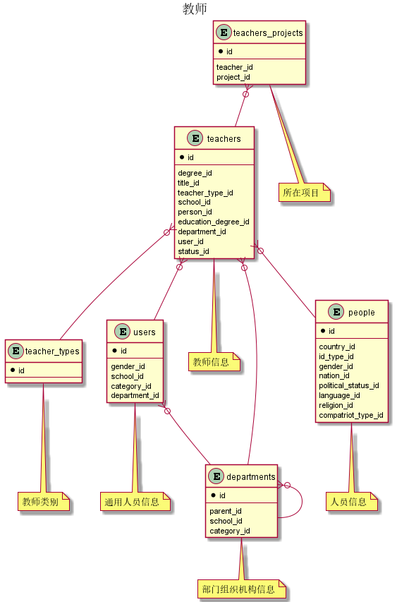



#### 目 录

##### 1. 数据库对象列表
  * [1.1 表格一览](index.html#表格一览)
  * [1.2 模块关系图](index.html#模块关系图)

##### 2. 具体模块明细
* [2.1 核心部分](/model/base/edu/core.html)
* [2.2 其他](/model/base/edu/misc.html)

### 表格一览
Schema base.edu下共计34个表，分别如下:

<table class="table table-bordered table-striped table-condensed">
  <tr>
    <th class="info_header text-center">序号</th>
    <th class="info_header">表名/描述</th>
    <th class="info_header text-center">序号</th>
    <th class="info_header">表名/描述</th>
  </tr>
  <tr>
    <td>1</td>
    <td><a href="/model/base/edu/misc.html#表格-c_book_award_types-教材获奖类型">c_book_award_types</a> 教材获奖类型</td>
    <td>18</td>
    <td><a href="/model/base/edu/core.html#表格-courses_prerequisites-先修课程">courses_prerequisites</a> 先修课程</td>
  </tr>
  <tr>
    <td>2</td>
    <td><a href="/model/base/edu/misc.html#表格-c_book_types-教材类型">c_book_types</a> 教材类型</td>
    <td>19</td>
    <td><a href="/model/base/edu/core.html#表格-courses_teachers-上课教师">courses_teachers</a> 上课教师</td>
  </tr>
  <tr>
    <td>3</td>
    <td><a href="/model/base/edu/misc.html#表格-c_course_ability_rates-课程能力等级">c_course_ability_rates</a> 课程能力等级</td>
    <td>20</td>
    <td><a href="/model/base/edu/core.html#表格-courses_textbooks-常用教材">courses_textbooks</a> 常用教材</td>
  </tr>
  <tr>
    <td>4</td>
    <td><a href="/model/base/edu/misc.html#表格-c_course_categories-课程评教分类">c_course_categories</a> 课程评教分类</td>
    <td>21</td>
    <td><a href="/model/base/edu/core.html#表格-courses_xmajors-排除专业">courses_xmajors</a> 排除专业</td>
  </tr>
  <tr>
    <td>5</td>
    <td><a href="/model/base/edu/misc.html#表格-c_course_types-课程类别">c_course_types</a> 课程类别</td>
    <td>22</td>
    <td><a href="/model/base/edu/core.html#表格-direction_journals-专业方向建设过程">direction_journals</a> 专业方向建设过程</td>
  </tr>
  <tr>
    <td>6</td>
    <td><a href="/model/base/edu/misc.html#表格-c_education_types-培养类型">c_education_types</a> 培养类型</td>
    <td>23</td>
    <td><a href="/model/base/edu/core.html#表格-directions-方向信息 专业领域">directions</a> 方向信息 专业领域</td>
  </tr>
  <tr>
    <td>7</td>
    <td><a href="/model/base/edu/misc.html#表格-classrooms-教室">classrooms</a> 教室</td>
    <td>24</td>
    <td><a href="/model/base/edu/misc.html#表格-holidays-假期">holidays</a> 假期</td>
  </tr>
  <tr>
    <td>8</td>
    <td><a href="/model/base/edu/misc.html#表格-classrooms_departs-使用部门">classrooms_departs</a> 使用部门</td>
    <td>25</td>
    <td><a href="/model/base/edu/misc.html#表格-major_disciplines-专业学科信息">major_disciplines</a> 专业学科信息</td>
  </tr>
  <tr>
    <td>9</td>
    <td><a href="/model/base/edu/misc.html#表格-classrooms_projects-使用项目">classrooms_projects</a> 使用项目</td>
    <td>26</td>
    <td><a href="/model/base/edu/core.html#表格-major_journals-专业建设历程">major_journals</a> 专业建设历程</td>
  </tr>
  <tr>
    <td>10</td>
    <td><a href="/model/base/edu/misc.html#表格-course_clusters-课程群组">course_clusters</a> 课程群组</td>
    <td>27</td>
    <td><a href="/model/base/edu/core.html#表格-majors-专业">majors</a> 专业</td>
  </tr>
  <tr>
    <td>11</td>
    <td><a href="/model/base/edu/core.html#表格-course_hours-课程分类课时信息">course_hours</a> 课程分类课时信息</td>
    <td>28</td>
    <td><a href="/model/base/edu/misc.html#表格-school_lengths-学制">school_lengths</a> 学制</td>
  </tr>
  <tr>
    <td>12</td>
    <td><a href="/model/base/edu/misc.html#表格-course_levels-课程分层次要求">course_levels</a> 课程分层次要求</td>
    <td>29</td>
    <td><a href="/model/base/edu/core.html#表格-teachers-教师信息">teachers</a> 教师信息</td>
  </tr>
  <tr>
    <td>13</td>
    <td><a href="/model/base/edu/misc.html#表格-course_units-默认作息时间">course_units</a> 默认作息时间</td>
    <td>30</td>
    <td><a href="/model/base/edu/core.html#表格-teachers_campuses-任教校区">teachers_campuses</a> 任教校区</td>
  </tr>
  <tr>
    <td>14</td>
    <td><a href="/model/base/edu/core.html#表格-courses-课程基本信息">courses</a> 课程基本信息</td>
    <td>31</td>
    <td><a href="/model/base/edu/core.html#表格-teachers_projects-所在项目">teachers_projects</a> 所在项目</td>
  </tr>
  <tr>
    <td>15</td>
    <td><a href="/model/base/edu/core.html#表格-courses_ability_rates-能力等级">courses_ability_rates</a> 能力等级</td>
    <td>32</td>
    <td><a href="/model/base/edu/misc.html#表格-teaching_offices-教研室">teaching_offices</a> 教研室</td>
  </tr>
  <tr>
    <td>16</td>
    <td><a href="/model/base/edu/core.html#表格-courses_grading_modes-成绩记录方式">courses_grading_modes</a> 成绩记录方式</td>
    <td>33</td>
    <td><a href="/model/base/edu/misc.html#表格-textbooks-教材">textbooks</a> 教材</td>
  </tr>
  <tr>
    <td>17</td>
    <td><a href="/model/base/edu/core.html#表格-courses_majors-针对专业">courses_majors</a> 针对专业</td>
    <td>34</td>
    <td><a href="/model/base/edu/misc.html#表格-time_settings-每个小节的时间设置">time_settings</a> 每个小节的时间设置</td>
  </tr>
</table>

### 模块关系图

#### 1. 行政班级
  * 关系图

#### 2. 专业
  * 关系图

#### 3. 学生
  * 关系图

#### 4. 教师
  * 关系图

