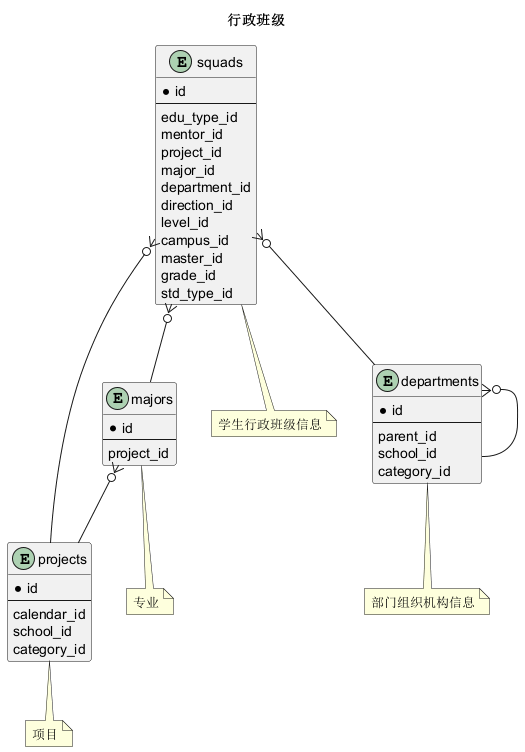
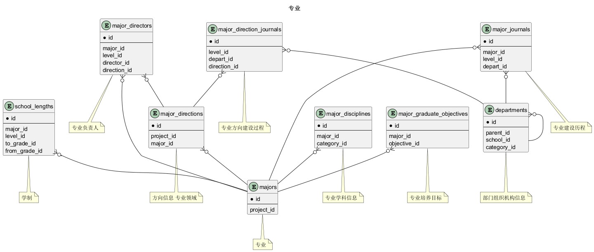
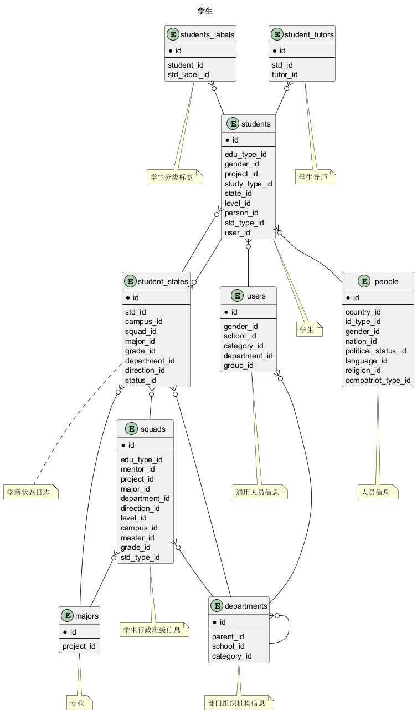

# 基础信息 教学 表结构

## 表格一览

<table class="table-mini">
  <thead>
    <tr>
      <th class="info_header text-center" width="7%">序号</th>
      <th class="info_header" width="43%">表名/描述</th>
      <th class="info_header text-center" width="7%">序号</th>
      <th class="info_header" width="43%">表名/描述</th>
    </tr>
  </thead>
  <tbody>
    <tr>
      <td class="text-center">1</td>
      <td><a href="/model/base/edu.html#course-awards">course_awards</a> 课程获奖</td>
      <td class="text-center">25</td>
      <td><a href="/model/base/edu.html#major-disciplines">major_disciplines</a> 专业学科信息</td>
    </tr>
    <tr>
      <td class="text-center">2</td>
      <td><a href="/model/base/edu.html#course-clusters">course_clusters</a> 课程群组</td>
      <td class="text-center">26</td>
      <td><a href="/model/base/edu.html#major-graduate-objectives">major_graduate_objectives</a> 专业培养目标</td>
    </tr>
    <tr>
      <td class="text-center">3</td>
      <td><a href="/model/base/edu.html#course-directors">course_directors</a> 课程负责人</td>
      <td class="text-center">27</td>
      <td><a href="/model/base/edu.html#major-journals">major_journals</a> 专业建设历程</td>
    </tr>
    <tr>
      <td class="text-center">4</td>
      <td><a href="/model/base/edu.html#course-hours">course_hours</a> 课程分类课时信息</td>
      <td class="text-center">28</td>
      <td><a href="/model/base/edu.html#majors">majors</a> 专业</td>
    </tr>
    <tr>
      <td class="text-center">5</td>
      <td><a href="/model/base/edu.html#course-journal-hours">course_journal_hours</a> 课程记录-学时</td>
      <td class="text-center">29</td>
      <td><a href="/model/base/edu.html#minor-majors">minor_majors</a> 辅修专业</td>
    </tr>
    <tr>
      <td class="text-center">6</td>
      <td><a href="/model/base/edu.html#course-journals">course_journals</a> 课程记录</td>
      <td class="text-center">30</td>
      <td><a href="/model/base/edu.html#project-codes">project_codes</a> 项目基础代码配置</td>
    </tr>
    <tr>
      <td class="text-center">7</td>
      <td><a href="/model/base/edu.html#course-journals-tags">course_journals_tags</a> 课程标签</td>
      <td class="text-center">31</td>
      <td><a href="/model/base/edu.html#project-properties">project_properties</a> 项目属性</td>
    </tr>
    <tr>
      <td class="text-center">8</td>
      <td><a href="/model/base/edu.html#course-levels">course_levels</a> 课程分层次要求</td>
      <td class="text-center">32</td>
      <td><a href="/model/base/edu.html#projects">projects</a> 项目</td>
    </tr>
    <tr>
      <td class="text-center">9</td>
      <td><a href="/model/base/edu.html#course-majors">course_majors</a> 课程面向专业</td>
      <td class="text-center">33</td>
      <td><a href="/model/base/edu.html#projects-campuses">projects_campuses</a> 项目-校区列表</td>
    </tr>
    <tr>
      <td class="text-center">10</td>
      <td><a href="/model/base/edu.html#course-profiles">course_profiles</a> 课程简介</td>
      <td class="text-center">34</td>
      <td><a href="/model/base/edu.html#projects-departments">projects_departments</a> 项目-部门列表</td>
    </tr>
    <tr>
      <td class="text-center">11</td>
      <td><a href="/model/base/edu.html#course-profiles-books">course_profiles_books</a> 课程简介-教材列表</td>
      <td class="text-center">35</td>
      <td><a href="/model/base/edu.html#projects-edu-types">projects_edu_types</a> 项目-培养类型</td>
    </tr>
    <tr>
      <td class="text-center">12</td>
      <td><a href="/model/base/edu.html#course-textbooks">course_textbooks</a> 课程教材</td>
      <td class="text-center">36</td>
      <td><a href="/model/base/edu.html#projects-levels">projects_levels</a> 项目-培养层次列表</td>
    </tr>
    <tr>
      <td class="text-center">13</td>
      <td><a href="/model/base/edu.html#courses">courses</a> 课程基本信息</td>
      <td class="text-center">37</td>
      <td><a href="/model/base/edu.html#projects-std-labels">projects_std_labels</a> 项目-学生分类列表</td>
    </tr>
    <tr>
      <td class="text-center">14</td>
      <td><a href="/model/base/edu.html#courses-categories">courses_categories</a> 课程分类</td>
      <td class="text-center">38</td>
      <td><a href="/model/base/edu.html#projects-std-types">projects_std_types</a> 项目-学生类别</td>
    </tr>
    <tr>
      <td class="text-center">15</td>
      <td><a href="/model/base/edu.html#courses-tags">courses_tags</a> 课程标签</td>
      <td class="text-center">39</td>
      <td><a href="/model/base/edu.html#school-lengths">school_lengths</a> 学制</td>
    </tr>
    <tr>
      <td class="text-center">16</td>
      <td><a href="/model/base/edu.html#experiments">experiments</a> 实验项目</td>
      <td class="text-center">40</td>
      <td><a href="/model/base/edu.html#squads">squads</a> 学生行政班级信息</td>
    </tr>
    <tr>
      <td class="text-center">17</td>
      <td><a href="/model/base/edu.html#extern-schools">extern_schools</a> 校外教育机构</td>
      <td class="text-center">41</td>
      <td><a href="/model/base/edu.html#student-states">student_states</a> 学籍状态日志</td>
    </tr>
    <tr>
      <td class="text-center">18</td>
      <td><a href="/model/base/edu.html#extern-students">extern_students</a> 外校学习经历</td>
      <td class="text-center">42</td>
      <td><a href="/model/base/edu.html#student-tutors">student_tutors</a> 学生导师</td>
    </tr>
    <tr>
      <td class="text-center">19</td>
      <td><a href="/model/base/edu.html#grades">grades</a> 年级</td>
      <td class="text-center">43</td>
      <td><a href="/model/base/edu.html#students">students</a> 学生</td>
    </tr>
    <tr>
      <td class="text-center">20</td>
      <td><a href="/model/base/edu.html#graduate-seasons">graduate_seasons</a> 毕业界别</td>
      <td class="text-center">44</td>
      <td><a href="/model/base/edu.html#students-labels">students_labels</a> 学生分类标签</td>
    </tr>
    <tr>
      <td class="text-center">21</td>
      <td><a href="/model/base/edu.html#graduates">graduates</a> 毕业信息</td>
      <td class="text-center">45</td>
      <td><a href="/model/base/edu.html#textbooks">textbooks</a> 教材</td>
    </tr>
    <tr>
      <td class="text-center">22</td>
      <td><a href="/model/base/edu.html#major-direction-journals">major_direction_journals</a> 专业方向建设过程</td>
      <td class="text-center">46</td>
      <td><a href="/model/base/edu.html#theses">theses</a> 学生论文信息</td>
    </tr>
    <tr>
      <td class="text-center">23</td>
      <td><a href="/model/base/edu.html#major-directions">major_directions</a> 方向信息 专业领域</td>
      <td class="text-center">47</td>
      <td><a href="/model/base/edu.html#versions">versions</a> 版本迁移日志</td>
    </tr>
    <tr>
      <td class="text-center">24</td>
      <td><a href="/model/base/edu.html#major-directors">major_directors</a> 专业负责人</td>
      <td></td>
      <td></td>
    </tr>
  </tbody>
</table>

## 关键关系图

### 关系图 1. 行政班级
  * 关系图

### 关系图 2. 专业
  * 关系图

### 关系图 3. 学生
  * 关系图

## 表格明细

## course_awards

<table class="table-entity">
  <tbody>
    <tr>
      <td class="table-entity-title" width="15%">表名:&nbsp;</td>
      <td>base.course_awards 课程获奖</td>
    </tr>
    <tr>
      <td class="table-entity-title">唯一约束:&nbsp;</td>
      <td>主键🔑(id) </td>
    </tr>
  </tbody>
</table>

<table class="table-entity">
  <thead>
    <tr>
<th class="info_header text-center" width="7%">序号</th><th class="info_header" width="20%">字段名</th><th class="info_header" width="20%">字段类型</th><th class="info_header text-center" width="8%">是否可空</th><th class="info_header" width="25%">描述</th><th class="info_header" width="20%">引用表</th>    </tr>
  </thead>
  <tbody>
    <tr>
      <td class="text-center">1</td>
      <td>id</td>
      <td>bigint</td>
      <td class="text-center">否</td>
      <td>非业务主键:datetime</td>
      <td>      </td>
    </tr>
    <tr>
      <td class="text-center">2</td>
      <td>award_type_id</td>
      <td>integer</td>
      <td class="text-center">否</td>
      <td>课程获奖类型ID</td>
      <td><a href="/model/code/all.html#course-award-types">code.course_award_types</a>      </td>
    </tr>
    <tr>
      <td class="text-center">3</td>
      <td>course_id</td>
      <td>bigint</td>
      <td class="text-center">否</td>
      <td>课程基本信息ID</td>
      <td><a href="/model/base/edu.html#courses">base.courses</a>      </td>
    </tr>
    <tr>
      <td class="text-center">4</td>
      <td>school_year</td>
      <td>integer</td>
      <td class="text-center">否</td>
      <td>获奖年度</td>
      <td>      </td>
    </tr>
  </tbody>
</table>

## course_clusters

<table class="table-entity">
  <tbody>
    <tr>
      <td class="table-entity-title" width="15%">表名:&nbsp;</td>
      <td>base.course_clusters 课程群组</td>
    </tr>
    <tr>
      <td class="table-entity-title">唯一约束:&nbsp;</td>
      <td>主键🔑(id) </td>
    </tr>
  </tbody>
</table>

<table class="table-entity">
  <thead>
    <tr>
<th class="info_header text-center" width="7%">序号</th><th class="info_header" width="20%">字段名</th><th class="info_header" width="20%">字段类型</th><th class="info_header text-center" width="8%">是否可空</th><th class="info_header" width="25%">描述</th><th class="info_header" width="20%">引用表</th>    </tr>
  </thead>
  <tbody>
    <tr>
      <td class="text-center">1</td>
      <td>id</td>
      <td>bigint</td>
      <td class="text-center">否</td>
      <td>非业务主键:datetime</td>
      <td>      </td>
    </tr>
    <tr>
      <td class="text-center">2</td>
      <td>en_name</td>
      <td>varchar(255)</td>
      <td class="text-center">是</td>
      <td>英文名</td>
      <td>      </td>
    </tr>
    <tr>
      <td class="text-center">3</td>
      <td>name</td>
      <td>varchar(255)</td>
      <td class="text-center">否</td>
      <td>名称</td>
      <td>      </td>
    </tr>
    <tr>
      <td class="text-center">4</td>
      <td>project_id</td>
      <td>integer</td>
      <td class="text-center">否</td>
      <td>项目ID</td>
      <td><a href="/model/base/edu.html#projects">base.projects</a>      </td>
    </tr>
  </tbody>
</table>

## course_directors

<table class="table-entity">
  <tbody>
    <tr>
      <td class="table-entity-title" width="15%">表名:&nbsp;</td>
      <td>base.course_directors 课程负责人</td>
    </tr>
    <tr>
      <td class="table-entity-title">唯一约束:&nbsp;</td>
      <td>主键🔑(id) uk_e3nnjcbf3esj437l6tj2tqt5r(course_id)</td>
    </tr>
  </tbody>
</table>

<table class="table-entity">
  <thead>
    <tr>
<th class="info_header text-center" width="7%">序号</th><th class="info_header" width="20%">字段名</th><th class="info_header" width="20%">字段类型</th><th class="info_header text-center" width="8%">是否可空</th><th class="info_header" width="25%">描述</th><th class="info_header" width="20%">引用表</th>    </tr>
  </thead>
  <tbody>
    <tr>
      <td class="text-center">1</td>
      <td>id</td>
      <td>bigint</td>
      <td class="text-center">否</td>
      <td>非业务主键:datetime</td>
      <td>      </td>
    </tr>
    <tr>
      <td class="text-center">2</td>
      <td>begin_on</td>
      <td>date</td>
      <td class="text-center">否</td>
      <td>生效日期</td>
      <td>      </td>
    </tr>
    <tr>
      <td class="text-center">3</td>
      <td>course_id</td>
      <td>bigint</td>
      <td class="text-center">否</td>
      <td>课程基本信息ID</td>
      <td><a href="/model/base/edu.html#courses">base.courses</a>      </td>
    </tr>
    <tr>
      <td class="text-center">4</td>
      <td>director_id</td>
      <td>bigint</td>
      <td class="text-center">否</td>
      <td>负责人ID</td>
      <td><a href="/model/base/user.html#teachers">base.teachers</a>      </td>
    </tr>
    <tr>
      <td class="text-center">5</td>
      <td>end_on</td>
      <td>date</td>
      <td class="text-center">是</td>
      <td>失效日期</td>
      <td>      </td>
    </tr>
    <tr>
      <td class="text-center">6</td>
      <td>office_id</td>
      <td>bigint</td>
      <td class="text-center">是</td>
      <td>教研室ID</td>
      <td><a href="/model/base/user.html#teaching-offices">base.teaching_offices</a>      </td>
    </tr>
  </tbody>
</table>

## course_hours

<table class="table-entity">
  <tbody>
    <tr>
      <td class="table-entity-title" width="15%">表名:&nbsp;</td>
      <td>base.course_hours 课程分类课时信息</td>
    </tr>
    <tr>
      <td class="table-entity-title">唯一约束:&nbsp;</td>
      <td>主键🔑(id) uk_q38fksieo0xpcfye7etmfd6rj(course_id,nature_id)</td>
    </tr>
    <tr>
      <td class="table-entity-title">索引:&nbsp;</td>
      <td>idx_cio9wl9gex7fo85575w4112c4(course_id) </td>
    </tr>
  </tbody>
</table>

<table class="table-entity">
  <thead>
    <tr>
<th class="info_header text-center" width="7%">序号</th><th class="info_header" width="20%">字段名</th><th class="info_header" width="20%">字段类型</th><th class="info_header text-center" width="8%">是否可空</th><th class="info_header" width="25%">描述</th><th class="info_header" width="20%">引用表</th>    </tr>
  </thead>
  <tbody>
    <tr>
      <td class="text-center">1</td>
      <td>id</td>
      <td>bigint</td>
      <td class="text-center">否</td>
      <td>非业务主键:datetime</td>
      <td>      </td>
    </tr>
    <tr>
      <td class="text-center">2</td>
      <td>course_id</td>
      <td>bigint</td>
      <td class="text-center">否</td>
      <td>课程基本信息ID</td>
      <td><a href="/model/base/edu.html#courses">base.courses</a>      </td>
    </tr>
    <tr>
      <td class="text-center">3</td>
      <td>credit_hours</td>
      <td>integer</td>
      <td class="text-center">否</td>
      <td>学时/总课时</td>
      <td>      </td>
    </tr>
    <tr>
      <td class="text-center">4</td>
      <td>nature_id</td>
      <td>integer</td>
      <td class="text-center">否</td>
      <td>课时分类ID</td>
      <td><a href="/model/code/all.html#teaching-natures">code.teaching_natures</a>      </td>
    </tr>
  </tbody>
</table>

## course_journal_hours

<table class="table-entity">
  <tbody>
    <tr>
      <td class="table-entity-title" width="15%">表名:&nbsp;</td>
      <td>base.course_journal_hours 课程记录-学时</td>
    </tr>
    <tr>
      <td class="table-entity-title">唯一约束:&nbsp;</td>
      <td>主键🔑(id) uk_ke2wt12wi4g02ypp3i7med47s(journal_id,nature_id)</td>
    </tr>
    <tr>
      <td class="table-entity-title">索引:&nbsp;</td>
      <td>idx_lm5drr3y1vinuxh8pqi0up3pw(journal_id) </td>
    </tr>
  </tbody>
</table>

<table class="table-entity">
  <thead>
    <tr>
<th class="info_header text-center" width="7%">序号</th><th class="info_header" width="20%">字段名</th><th class="info_header" width="20%">字段类型</th><th class="info_header text-center" width="8%">是否可空</th><th class="info_header" width="25%">描述</th><th class="info_header" width="20%">引用表</th>    </tr>
  </thead>
  <tbody>
    <tr>
      <td class="text-center">1</td>
      <td>id</td>
      <td>bigint</td>
      <td class="text-center">否</td>
      <td>非业务主键:datetime</td>
      <td>      </td>
    </tr>
    <tr>
      <td class="text-center">2</td>
      <td>credit_hours</td>
      <td>integer</td>
      <td class="text-center">否</td>
      <td>学时</td>
      <td>      </td>
    </tr>
    <tr>
      <td class="text-center">3</td>
      <td>journal_id</td>
      <td>bigint</td>
      <td class="text-center">否</td>
      <td>课程记录ID</td>
      <td><a href="/model/base/edu.html#course-journals">base.course_journals</a>      </td>
    </tr>
    <tr>
      <td class="text-center">4</td>
      <td>nature_id</td>
      <td>integer</td>
      <td class="text-center">否</td>
      <td>课时分类ID</td>
      <td><a href="/model/code/all.html#teaching-natures">code.teaching_natures</a>      </td>
    </tr>
  </tbody>
</table>

## course_journals

<table class="table-entity">
  <tbody>
    <tr>
      <td class="table-entity-title" width="15%">表名:&nbsp;</td>
      <td>base.course_journals 课程记录</td>
    </tr>
    <tr>
      <td class="table-entity-title">唯一约束:&nbsp;</td>
      <td>主键🔑(id) uk_16iu8nblky3qtm9ani5pu7vcs(course_id,begin_on)</td>
    </tr>
    <tr>
      <td class="table-entity-title">索引:&nbsp;</td>
      <td>idx_63qf0hjsyy394vrfl9ui51oe4(course_id) </td>
    </tr>
  </tbody>
</table>

<table class="table-entity">
  <thead>
    <tr>
<th class="info_header text-center" width="7%">序号</th><th class="info_header" width="20%">字段名</th><th class="info_header" width="20%">字段类型</th><th class="info_header text-center" width="8%">是否可空</th><th class="info_header" width="25%">描述</th><th class="info_header" width="20%">引用表</th>    </tr>
  </thead>
  <tbody>
    <tr>
      <td class="text-center">1</td>
      <td>id</td>
      <td>bigint</td>
      <td class="text-center">否</td>
      <td>非业务主键:datetime</td>
      <td>      </td>
    </tr>
    <tr>
      <td class="text-center">2</td>
      <td>begin_on</td>
      <td>date</td>
      <td class="text-center">否</td>
      <td>生效日期</td>
      <td>      </td>
    </tr>
    <tr>
      <td class="text-center">3</td>
      <td>course_id</td>
      <td>bigint</td>
      <td class="text-center">否</td>
      <td>课程基本信息ID</td>
      <td><a href="/model/base/edu.html#courses">base.courses</a>      </td>
    </tr>
    <tr>
      <td class="text-center">4</td>
      <td>credit_hours</td>
      <td>integer</td>
      <td class="text-center">否</td>
      <td>学时</td>
      <td>      </td>
    </tr>
    <tr>
      <td class="text-center">5</td>
      <td>department_id</td>
      <td>integer</td>
      <td class="text-center">否</td>
      <td>部门组织机构信息ID</td>
      <td><a href="/model/base/user.html#departments">base.departments</a>      </td>
    </tr>
    <tr>
      <td class="text-center">6</td>
      <td>en_name</td>
      <td>varchar(400)</td>
      <td class="text-center">是</td>
      <td>英文名</td>
      <td>      </td>
    </tr>
    <tr>
      <td class="text-center">7</td>
      <td>end_on</td>
      <td>date</td>
      <td class="text-center">是</td>
      <td>失效日期</td>
      <td>      </td>
    </tr>
    <tr>
      <td class="text-center">8</td>
      <td>exam_mode_id</td>
      <td>integer</td>
      <td class="text-center">否</td>
      <td>考核方式ID</td>
      <td><a href="/model/code/all.html#exam-modes">code.exam_modes</a>      </td>
    </tr>
    <tr>
      <td class="text-center">9</td>
      <td>name</td>
      <td>varchar(200)</td>
      <td class="text-center">否</td>
      <td>名称</td>
      <td>      </td>
    </tr>
    <tr>
      <td class="text-center">10</td>
      <td>updated_at</td>
      <td>timestamptz</td>
      <td class="text-center">否</td>
      <td>更新时间</td>
      <td>      </td>
    </tr>
    <tr>
      <td class="text-center">11</td>
      <td>week_hours</td>
      <td>integer</td>
      <td class="text-center">否</td>
      <td>周课时</td>
      <td>      </td>
    </tr>
    <tr>
      <td class="text-center">12</td>
      <td>weeks</td>
      <td>integer</td>
      <td class="text-center">是</td>
      <td>周数</td>
      <td>      </td>
    </tr>
  </tbody>
</table>

## course_journals_tags

<table class="table-entity">
  <tbody>
    <tr>
      <td class="table-entity-title" width="15%">表名:&nbsp;</td>
      <td>base.course_journals_tags 课程标签</td>
    </tr>
    <tr>
      <td class="table-entity-title">唯一约束:&nbsp;</td>
      <td>主键🔑(course_journal_id,course_tag_id) </td>
    </tr>
    <tr>
      <td class="table-entity-title">索引:&nbsp;</td>
      <td>idx_fa43felt9lxq3wse8lp20bdgg(course_journal_id) </td>
    </tr>
  </tbody>
</table>

<table class="table-entity">
  <thead>
    <tr>
<th class="info_header text-center" width="7%">序号</th><th class="info_header" width="20%">字段名</th><th class="info_header" width="20%">字段类型</th><th class="info_header text-center" width="8%">是否可空</th><th class="info_header" width="25%">描述</th><th class="info_header" width="20%">引用表</th>    </tr>
  </thead>
  <tbody>
    <tr>
      <td class="text-center">1</td>
      <td>course_journal_id</td>
      <td>bigint</td>
      <td class="text-center">否</td>
      <td>课程记录ID</td>
      <td><a href="/model/base/edu.html#course-journals">base.course_journals</a>      </td>
    </tr>
    <tr>
      <td class="text-center">2</td>
      <td>course_tag_id</td>
      <td>integer</td>
      <td class="text-center">否</td>
      <td>课程标签ID</td>
      <td><a href="/model/code/all.html#course-tags">code.course_tags</a>      </td>
    </tr>
  </tbody>
</table>

## course_levels

<table class="table-entity">
  <tbody>
    <tr>
      <td class="table-entity-title" width="15%">表名:&nbsp;</td>
      <td>base.course_levels 课程分层次要求</td>
    </tr>
    <tr>
      <td class="table-entity-title">唯一约束:&nbsp;</td>
      <td>主键🔑(id) uk_59cbmhw5789an69kcq0j5g9i8(course_id,level_id)</td>
    </tr>
    <tr>
      <td class="table-entity-title">索引:&nbsp;</td>
      <td>idx_w33dd8gtyilc14ptwiwvx0w5(course_id) </td>
    </tr>
  </tbody>
</table>

<table class="table-entity">
  <thead>
    <tr>
<th class="info_header text-center" width="7%">序号</th><th class="info_header" width="20%">字段名</th><th class="info_header" width="20%">字段类型</th><th class="info_header text-center" width="8%">是否可空</th><th class="info_header" width="25%">描述</th><th class="info_header" width="20%">引用表</th>    </tr>
  </thead>
  <tbody>
    <tr>
      <td class="text-center">1</td>
      <td>id</td>
      <td>bigint</td>
      <td class="text-center">否</td>
      <td>非业务主键:datetime</td>
      <td>      </td>
    </tr>
    <tr>
      <td class="text-center">2</td>
      <td>course_id</td>
      <td>bigint</td>
      <td class="text-center">否</td>
      <td>课程基本信息ID</td>
      <td><a href="/model/base/edu.html#courses">base.courses</a>      </td>
    </tr>
    <tr>
      <td class="text-center">3</td>
      <td>credits</td>
      <td>float4</td>
      <td class="text-center">是</td>
      <td>学分</td>
      <td>      </td>
    </tr>
    <tr>
      <td class="text-center">4</td>
      <td>level_id</td>
      <td>integer</td>
      <td class="text-center">否</td>
      <td>培养层次ID</td>
      <td><a href="/model/code/all.html#education-levels">code.education_levels</a>      </td>
    </tr>
  </tbody>
</table>

## course_majors

<table class="table-entity">
  <tbody>
    <tr>
      <td class="table-entity-title" width="15%">表名:&nbsp;</td>
      <td>base.course_majors 课程面向专业</td>
    </tr>
    <tr>
      <td class="table-entity-title">唯一约束:&nbsp;</td>
      <td>主键🔑(id) </td>
    </tr>
  </tbody>
</table>

<table class="table-entity">
  <thead>
    <tr>
<th class="info_header text-center" width="7%">序号</th><th class="info_header" width="20%">字段名</th><th class="info_header" width="20%">字段类型</th><th class="info_header text-center" width="8%">是否可空</th><th class="info_header" width="25%">描述</th><th class="info_header" width="20%">引用表</th>    </tr>
  </thead>
  <tbody>
    <tr>
      <td class="text-center">1</td>
      <td>id</td>
      <td>bigint</td>
      <td class="text-center">否</td>
      <td>非业务主键:datetime</td>
      <td>      </td>
    </tr>
    <tr>
      <td class="text-center">2</td>
      <td>course_id</td>
      <td>bigint</td>
      <td class="text-center">否</td>
      <td>课程基本信息ID</td>
      <td><a href="/model/base/edu.html#courses">base.courses</a>      </td>
    </tr>
    <tr>
      <td class="text-center">3</td>
      <td>direction_id</td>
      <td>bigint</td>
      <td class="text-center">是</td>
      <td>专业方向建设过程ID</td>
      <td><a href="/model/base/edu.html#major-direction-journals">base.major_direction_journals</a>      </td>
    </tr>
    <tr>
      <td class="text-center">4</td>
      <td>included</td>
      <td>boolean</td>
      <td class="text-center">否</td>
      <td>是否包含</td>
      <td>      </td>
    </tr>
    <tr>
      <td class="text-center">5</td>
      <td>major_id</td>
      <td>bigint</td>
      <td class="text-center">否</td>
      <td>专业ID</td>
      <td><a href="/model/base/edu.html#majors">base.majors</a>      </td>
    </tr>
  </tbody>
</table>

## course_profiles

<table class="table-entity">
  <tbody>
    <tr>
      <td class="table-entity-title" width="15%">表名:&nbsp;</td>
      <td>base.course_profiles 课程简介</td>
    </tr>
    <tr>
      <td class="table-entity-title">唯一约束:&nbsp;</td>
      <td>主键🔑(id) </td>
    </tr>
    <tr>
      <td class="table-entity-title">索引:&nbsp;</td>
      <td>idx_tjt1ybpj33nkgqek0j2fylp7g(course_id) </td>
    </tr>
  </tbody>
</table>

<table class="table-entity">
  <thead>
    <tr>
<th class="info_header text-center" width="7%">序号</th><th class="info_header" width="20%">字段名</th><th class="info_header" width="20%">字段类型</th><th class="info_header text-center" width="8%">是否可空</th><th class="info_header" width="25%">描述</th><th class="info_header" width="20%">引用表</th>    </tr>
  </thead>
  <tbody>
    <tr>
      <td class="text-center">1</td>
      <td>id</td>
      <td>bigint</td>
      <td class="text-center">否</td>
      <td>非业务主键:datetime</td>
      <td>      </td>
    </tr>
    <tr>
      <td class="text-center">2</td>
      <td>audit_at</td>
      <td>timestamptz</td>
      <td class="text-center">是</td>
      <td>审核时间</td>
      <td>      </td>
    </tr>
    <tr>
      <td class="text-center">3</td>
      <td>auditor_id</td>
      <td>bigint</td>
      <td class="text-center">是</td>
      <td>审核人ID</td>
      <td><a href="/model/base/user.html#users">base.users</a>      </td>
    </tr>
    <tr>
      <td class="text-center">4</td>
      <td>begin_on</td>
      <td>date</td>
      <td class="text-center">否</td>
      <td>生效日期</td>
      <td>      </td>
    </tr>
    <tr>
      <td class="text-center">5</td>
      <td>bibliography</td>
      <td>varchar(2000)</td>
      <td class="text-center">是</td>
      <td>参考书目</td>
      <td>      </td>
    </tr>
    <tr>
      <td class="text-center">6</td>
      <td>book_adoption</td>
      <td>integer</td>
      <td class="text-center">否</td>
      <td>教材选用类型</td>
      <td>      </td>
    </tr>
    <tr>
      <td class="text-center">7</td>
      <td>category_id</td>
      <td>integer</td>
      <td class="text-center">是</td>
      <td>课程分类ID</td>
      <td><a href="/model/code/all.html#course-categories">code.course_categories</a>      </td>
    </tr>
    <tr>
      <td class="text-center">8</td>
      <td>course_id</td>
      <td>bigint</td>
      <td class="text-center">否</td>
      <td>课程基本信息ID</td>
      <td><a href="/model/base/edu.html#courses">base.courses</a>      </td>
    </tr>
    <tr>
      <td class="text-center">9</td>
      <td>department_id</td>
      <td>integer</td>
      <td class="text-center">否</td>
      <td>部门组织机构信息ID</td>
      <td><a href="/model/base/user.html#departments">base.departments</a>      </td>
    </tr>
    <tr>
      <td class="text-center">10</td>
      <td>description</td>
      <td>varchar(800)</td>
      <td class="text-center">否</td>
      <td>简介</td>
      <td>      </td>
    </tr>
    <tr>
      <td class="text-center">11</td>
      <td>director_id</td>
      <td>bigint</td>
      <td class="text-center">是</td>
      <td>教师信息ID</td>
      <td><a href="/model/base/user.html#teachers">base.teachers</a>      </td>
    </tr>
    <tr>
      <td class="text-center">12</td>
      <td>en_description</td>
      <td>varchar(2000)</td>
      <td class="text-center">是</td>
      <td>英文简介</td>
      <td>      </td>
    </tr>
    <tr>
      <td class="text-center">13</td>
      <td>end_on</td>
      <td>date</td>
      <td class="text-center">是</td>
      <td>失效日期</td>
      <td>      </td>
    </tr>
    <tr>
      <td class="text-center">14</td>
      <td>majors</td>
      <td>varchar(200)</td>
      <td class="text-center">是</td>
      <td>适用专业</td>
      <td>      </td>
    </tr>
    <tr>
      <td class="text-center">15</td>
      <td>materials</td>
      <td>varchar(1000)</td>
      <td class="text-center">是</td>
      <td>辅助资料</td>
      <td>      </td>
    </tr>
    <tr>
      <td class="text-center">16</td>
      <td>prerequisites</td>
      <td>varchar(255)</td>
      <td class="text-center">是</td>
      <td>先修课程</td>
      <td>      </td>
    </tr>
    <tr>
      <td class="text-center">17</td>
      <td>remark</td>
      <td>varchar(255)</td>
      <td class="text-center">是</td>
      <td>备注</td>
      <td>      </td>
    </tr>
    <tr>
      <td class="text-center">18</td>
      <td>semester_id</td>
      <td>integer</td>
      <td class="text-center">否</td>
      <td>学年学期ID</td>
      <td><a href="/model/base/time.html#semesters">base.semesters</a>      </td>
    </tr>
    <tr>
      <td class="text-center">19</td>
      <td>status</td>
      <td>integer</td>
      <td class="text-center">否</td>
      <td>状态</td>
      <td>      </td>
    </tr>
    <tr>
      <td class="text-center">20</td>
      <td>submit_at</td>
      <td>timestamptz</td>
      <td class="text-center">是</td>
      <td>提及时间</td>
      <td>      </td>
    </tr>
    <tr>
      <td class="text-center">21</td>
      <td>textbooks</td>
      <td>varchar(500)</td>
      <td class="text-center">是</td>
      <td>教材和参考书目</td>
      <td>      </td>
    </tr>
    <tr>
      <td class="text-center">22</td>
      <td>updated_at</td>
      <td>timestamptz</td>
      <td class="text-center">否</td>
      <td>更新时间</td>
      <td>      </td>
    </tr>
    <tr>
      <td class="text-center">23</td>
      <td>website</td>
      <td>varchar(255)</td>
      <td class="text-center">是</td>
      <td>课程网站</td>
      <td>      </td>
    </tr>
    <tr>
      <td class="text-center">24</td>
      <td>writer_id</td>
      <td>bigint</td>
      <td class="text-center">是</td>
      <td>通用人员信息ID</td>
      <td><a href="/model/base/user.html#users">base.users</a>      </td>
    </tr>
  </tbody>
</table>

## course_profiles_books

<table class="table-entity">
  <tbody>
    <tr>
      <td class="table-entity-title" width="15%">表名:&nbsp;</td>
      <td>base.course_profiles_books 课程简介-教材列表</td>
    </tr>
    <tr>
      <td class="table-entity-title">唯一约束:&nbsp;</td>
      <td>主键🔑(course_profile_id,textbook_id) </td>
    </tr>
    <tr>
      <td class="table-entity-title">索引:&nbsp;</td>
      <td>idx_h55h1s4mtw979tqx7jqam6p4h(course_profile_id) </td>
    </tr>
  </tbody>
</table>

<table class="table-entity">
  <thead>
    <tr>
<th class="info_header text-center" width="7%">序号</th><th class="info_header" width="20%">字段名</th><th class="info_header" width="20%">字段类型</th><th class="info_header text-center" width="8%">是否可空</th><th class="info_header" width="25%">描述</th><th class="info_header" width="20%">引用表</th>    </tr>
  </thead>
  <tbody>
    <tr>
      <td class="text-center">1</td>
      <td>course_profile_id</td>
      <td>bigint</td>
      <td class="text-center">否</td>
      <td>课程简介ID</td>
      <td><a href="/model/base/edu.html#course-profiles">base.course_profiles</a>      </td>
    </tr>
    <tr>
      <td class="text-center">2</td>
      <td>textbook_id</td>
      <td>bigint</td>
      <td class="text-center">否</td>
      <td>教材ID</td>
      <td><a href="/model/base/edu.html#textbooks">base.textbooks</a>      </td>
    </tr>
  </tbody>
</table>

## course_textbooks

<table class="table-entity">
  <tbody>
    <tr>
      <td class="table-entity-title" width="15%">表名:&nbsp;</td>
      <td>base.course_textbooks 课程教材</td>
    </tr>
    <tr>
      <td class="table-entity-title">唯一约束:&nbsp;</td>
      <td>主键🔑(id) </td>
    </tr>
  </tbody>
</table>

<table class="table-entity">
  <thead>
    <tr>
<th class="info_header text-center" width="7%">序号</th><th class="info_header" width="20%">字段名</th><th class="info_header" width="20%">字段类型</th><th class="info_header text-center" width="8%">是否可空</th><th class="info_header" width="25%">描述</th><th class="info_header" width="20%">引用表</th>    </tr>
  </thead>
  <tbody>
    <tr>
      <td class="text-center">1</td>
      <td>id</td>
      <td>bigint</td>
      <td class="text-center">否</td>
      <td>非业务主键:datetime</td>
      <td>      </td>
    </tr>
    <tr>
      <td class="text-center">2</td>
      <td>begin_on</td>
      <td>date</td>
      <td class="text-center">否</td>
      <td>生效日期</td>
      <td>      </td>
    </tr>
    <tr>
      <td class="text-center">3</td>
      <td>course_id</td>
      <td>bigint</td>
      <td class="text-center">否</td>
      <td>课程基本信息ID</td>
      <td><a href="/model/base/edu.html#courses">base.courses</a>      </td>
    </tr>
    <tr>
      <td class="text-center">4</td>
      <td>end_on</td>
      <td>date</td>
      <td class="text-center">是</td>
      <td>失效日期</td>
      <td>      </td>
    </tr>
    <tr>
      <td class="text-center">5</td>
      <td>recommended</td>
      <td>boolean</td>
      <td class="text-center">否</td>
      <td>是否推荐教材</td>
      <td>      </td>
    </tr>
    <tr>
      <td class="text-center">6</td>
      <td>required</td>
      <td>boolean</td>
      <td class="text-center">否</td>
      <td>是否必选教材</td>
      <td>      </td>
    </tr>
    <tr>
      <td class="text-center">7</td>
      <td>textbook_id</td>
      <td>bigint</td>
      <td class="text-center">否</td>
      <td>教材ID</td>
      <td><a href="/model/base/edu.html#textbooks">base.textbooks</a>      </td>
    </tr>
  </tbody>
</table>

## courses

<table class="table-entity">
  <tbody>
    <tr>
      <td class="table-entity-title" width="15%">表名:&nbsp;</td>
      <td>base.courses 课程基本信息</td>
    </tr>
    <tr>
      <td class="table-entity-title">唯一约束:&nbsp;</td>
      <td>主键🔑(id) uk_thp7tiw1cr1mvm9uy21fqflch(project_id,code)</td>
    </tr>
    <tr>
      <td class="table-entity-title">索引:&nbsp;</td>
      <td>idx_61og8rbqdd2y28rx2et5fdnxd(code) ,idx_gsyp40xj7elqlco0688yda587(cluster_id) </td>
    </tr>
  </tbody>
</table>

<table class="table-entity">
  <thead>
    <tr>
<th class="info_header text-center" width="7%">序号</th><th class="info_header" width="20%">字段名</th><th class="info_header" width="20%">字段类型</th><th class="info_header text-center" width="8%">是否可空</th><th class="info_header" width="25%">描述</th><th class="info_header" width="20%">引用表</th>    </tr>
  </thead>
  <tbody>
    <tr>
      <td class="text-center">1</td>
      <td>id</td>
      <td>bigint</td>
      <td class="text-center">否</td>
      <td>非业务主键:datetime</td>
      <td>      </td>
    </tr>
    <tr>
      <td class="text-center">2</td>
      <td>begin_on</td>
      <td>date</td>
      <td class="text-center">否</td>
      <td>设立日期</td>
      <td>      </td>
    </tr>
    <tr>
      <td class="text-center">3</td>
      <td>calgp</td>
      <td>boolean</td>
      <td class="text-center">否</td>
      <td>是否计算绩点</td>
      <td>      </td>
    </tr>
    <tr>
      <td class="text-center">4</td>
      <td>cluster_id</td>
      <td>bigint</td>
      <td class="text-center">是</td>
      <td>课程群组ID</td>
      <td><a href="/model/base/edu.html#course-clusters">base.course_clusters</a>      </td>
    </tr>
    <tr>
      <td class="text-center">5</td>
      <td>code</td>
      <td>varchar(32)</td>
      <td class="text-center">否</td>
      <td>课程代码</td>
      <td>      </td>
    </tr>
    <tr>
      <td class="text-center">6</td>
      <td>course_type_id</td>
      <td>integer</td>
      <td class="text-center">是</td>
      <td>建议课程类别ID</td>
      <td><a href="/model/code/all.html#course-types">code.course_types</a>      </td>
    </tr>
    <tr>
      <td class="text-center">7</td>
      <td>credit_hours</td>
      <td>integer</td>
      <td class="text-center">否</td>
      <td>总学时</td>
      <td>      </td>
    </tr>
    <tr>
      <td class="text-center">8</td>
      <td>default_credits</td>
      <td>float4</td>
      <td class="text-center">否</td>
      <td>默认学分</td>
      <td>      </td>
    </tr>
    <tr>
      <td class="text-center">9</td>
      <td>department_id</td>
      <td>integer</td>
      <td class="text-center">否</td>
      <td>院系ID</td>
      <td><a href="/model/base/user.html#departments">base.departments</a>      </td>
    </tr>
    <tr>
      <td class="text-center">10</td>
      <td>en_name</td>
      <td>varchar(300)</td>
      <td class="text-center">是</td>
      <td>课程英文名</td>
      <td>      </td>
    </tr>
    <tr>
      <td class="text-center">11</td>
      <td>end_on</td>
      <td>date</td>
      <td class="text-center">是</td>
      <td>失效日期</td>
      <td>      </td>
    </tr>
    <tr>
      <td class="text-center">12</td>
      <td>exam_mode_id</td>
      <td>integer</td>
      <td class="text-center">否</td>
      <td>考试方式ID</td>
      <td><a href="/model/code/all.html#exam-modes">code.exam_modes</a>      </td>
    </tr>
    <tr>
      <td class="text-center">13</td>
      <td>grading_mode_id</td>
      <td>integer</td>
      <td class="text-center">否</td>
      <td>成绩记录方式ID</td>
      <td><a href="/model/code/all.html#grading-modes">code.grading_modes</a>      </td>
    </tr>
    <tr>
      <td class="text-center">14</td>
      <td>has_makeup</td>
      <td>boolean</td>
      <td class="text-center">否</td>
      <td>是否有补考</td>
      <td>      </td>
    </tr>
    <tr>
      <td class="text-center">15</td>
      <td>module_id</td>
      <td>integer</td>
      <td class="text-center">是</td>
      <td>课程模块ID</td>
      <td><a href="/model/code/all.html#course-modules">code.course_modules</a>      </td>
    </tr>
    <tr>
      <td class="text-center">16</td>
      <td>name</td>
      <td>varchar(222)</td>
      <td class="text-center">否</td>
      <td>课程名称</td>
      <td>      </td>
    </tr>
    <tr>
      <td class="text-center">17</td>
      <td>nature_id</td>
      <td>integer</td>
      <td class="text-center">否</td>
      <td>课程性质ID</td>
      <td><a href="/model/code/all.html#course-natures">code.course_natures</a>      </td>
    </tr>
    <tr>
      <td class="text-center">18</td>
      <td>project_id</td>
      <td>integer</td>
      <td class="text-center">否</td>
      <td>项目ID</td>
      <td><a href="/model/base/edu.html#projects">base.projects</a>      </td>
    </tr>
    <tr>
      <td class="text-center">19</td>
      <td>rank_id</td>
      <td>integer</td>
      <td class="text-center">是</td>
      <td>课程属性ID</td>
      <td><a href="/model/code/all.html#course-ranks">code.course_ranks</a>      </td>
    </tr>
    <tr>
      <td class="text-center">20</td>
      <td>remark</td>
      <td>varchar(500)</td>
      <td class="text-center">是</td>
      <td>备注</td>
      <td>      </td>
    </tr>
    <tr>
      <td class="text-center">21</td>
      <td>sub_course_id</td>
      <td>bigint</td>
      <td class="text-center">是</td>
      <td>子课程ID</td>
      <td><a href="/model/base/edu.html#courses">base.courses</a>      </td>
    </tr>
    <tr>
      <td class="text-center">22</td>
      <td>terms</td>
      <td>integer</td>
      <td class="text-center">否</td>
      <td>开课学期数</td>
      <td>      </td>
    </tr>
    <tr>
      <td class="text-center">23</td>
      <td>updated_at</td>
      <td>timestamptz</td>
      <td class="text-center">否</td>
      <td>更新时间</td>
      <td>      </td>
    </tr>
    <tr>
      <td class="text-center">24</td>
      <td>week_hours</td>
      <td>integer</td>
      <td class="text-center">否</td>
      <td>周课时</td>
      <td>      </td>
    </tr>
    <tr>
      <td class="text-center">25</td>
      <td>weeks</td>
      <td>integer</td>
      <td class="text-center">是</td>
      <td>周数</td>
      <td>      </td>
    </tr>
  </tbody>
</table>

## courses_categories

<table class="table-entity">
  <tbody>
    <tr>
      <td class="table-entity-title" width="15%">表名:&nbsp;</td>
      <td>base.courses_categories 课程分类</td>
    </tr>
    <tr>
      <td class="table-entity-title">唯一约束:&nbsp;</td>
      <td>主键🔑(course_id,course_category_id) </td>
    </tr>
    <tr>
      <td class="table-entity-title">索引:&nbsp;</td>
      <td>idx_fx0k2hychuov557bedalysbex(course_id) </td>
    </tr>
  </tbody>
</table>

<table class="table-entity">
  <thead>
    <tr>
<th class="info_header text-center" width="7%">序号</th><th class="info_header" width="20%">字段名</th><th class="info_header" width="20%">字段类型</th><th class="info_header text-center" width="8%">是否可空</th><th class="info_header" width="25%">描述</th><th class="info_header" width="20%">引用表</th>    </tr>
  </thead>
  <tbody>
    <tr>
      <td class="text-center">1</td>
      <td>course_category_id</td>
      <td>integer</td>
      <td class="text-center">否</td>
      <td>课程分类ID</td>
      <td><a href="/model/code/all.html#course-categories">code.course_categories</a>      </td>
    </tr>
    <tr>
      <td class="text-center">2</td>
      <td>course_id</td>
      <td>bigint</td>
      <td class="text-center">否</td>
      <td>课程基本信息ID</td>
      <td><a href="/model/base/edu.html#courses">base.courses</a>      </td>
    </tr>
  </tbody>
</table>

## courses_tags

<table class="table-entity">
  <tbody>
    <tr>
      <td class="table-entity-title" width="15%">表名:&nbsp;</td>
      <td>base.courses_tags 课程标签</td>
    </tr>
    <tr>
      <td class="table-entity-title">唯一约束:&nbsp;</td>
      <td>主键🔑(course_id,course_tag_id) </td>
    </tr>
    <tr>
      <td class="table-entity-title">索引:&nbsp;</td>
      <td>idx_b33k2icegejva3ino103aa5eb(course_id) </td>
    </tr>
  </tbody>
</table>

<table class="table-entity">
  <thead>
    <tr>
<th class="info_header text-center" width="7%">序号</th><th class="info_header" width="20%">字段名</th><th class="info_header" width="20%">字段类型</th><th class="info_header text-center" width="8%">是否可空</th><th class="info_header" width="25%">描述</th><th class="info_header" width="20%">引用表</th>    </tr>
  </thead>
  <tbody>
    <tr>
      <td class="text-center">1</td>
      <td>course_id</td>
      <td>bigint</td>
      <td class="text-center">否</td>
      <td>课程基本信息ID</td>
      <td><a href="/model/base/edu.html#courses">base.courses</a>      </td>
    </tr>
    <tr>
      <td class="text-center">2</td>
      <td>course_tag_id</td>
      <td>integer</td>
      <td class="text-center">否</td>
      <td>课程标签ID</td>
      <td><a href="/model/code/all.html#course-tags">code.course_tags</a>      </td>
    </tr>
  </tbody>
</table>

## experiments

<table class="table-entity">
  <tbody>
    <tr>
      <td class="table-entity-title" width="15%">表名:&nbsp;</td>
      <td>base.experiments 实验项目</td>
    </tr>
    <tr>
      <td class="table-entity-title">唯一约束:&nbsp;</td>
      <td>主键🔑(id) uk_4t6s3rhpyuivur62lwcyy7ul5(course_id,code)</td>
    </tr>
  </tbody>
</table>

<table class="table-entity">
  <thead>
    <tr>
<th class="info_header text-center" width="7%">序号</th><th class="info_header" width="20%">字段名</th><th class="info_header" width="20%">字段类型</th><th class="info_header text-center" width="8%">是否可空</th><th class="info_header" width="25%">描述</th><th class="info_header" width="20%">引用表</th>    </tr>
  </thead>
  <tbody>
    <tr>
      <td class="text-center">1</td>
      <td>id</td>
      <td>bigint</td>
      <td class="text-center">否</td>
      <td>非业务主键:datetime</td>
      <td>      </td>
    </tr>
    <tr>
      <td class="text-center">2</td>
      <td>begin_on</td>
      <td>date</td>
      <td class="text-center">否</td>
      <td>生效日期</td>
      <td>      </td>
    </tr>
    <tr>
      <td class="text-center">3</td>
      <td>category_id</td>
      <td>integer</td>
      <td class="text-center">否</td>
      <td>实验类别ID</td>
      <td><a href="/model/code/all.html#experiment-categories">code.experiment_categories</a>      </td>
    </tr>
    <tr>
      <td class="text-center">4</td>
      <td>code</td>
      <td>varchar(20)</td>
      <td class="text-center">否</td>
      <td>代码</td>
      <td>      </td>
    </tr>
    <tr>
      <td class="text-center">5</td>
      <td>course_id</td>
      <td>bigint</td>
      <td class="text-center">否</td>
      <td>课程基本信息ID</td>
      <td><a href="/model/base/edu.html#courses">base.courses</a>      </td>
    </tr>
    <tr>
      <td class="text-center">6</td>
      <td>credit_hours</td>
      <td>float4</td>
      <td class="text-center">否</td>
      <td>学时</td>
      <td>      </td>
    </tr>
    <tr>
      <td class="text-center">7</td>
      <td>discipline_id</td>
      <td>integer</td>
      <td class="text-center">否</td>
      <td>一级学科ID</td>
      <td><a href="/model/code/all.html#level1-disciplines">code.level1_disciplines</a>      </td>
    </tr>
    <tr>
      <td class="text-center">8</td>
      <td>en_name</td>
      <td>varchar(400)</td>
      <td class="text-center">是</td>
      <td>英文名</td>
      <td>      </td>
    </tr>
    <tr>
      <td class="text-center">9</td>
      <td>end_on</td>
      <td>date</td>
      <td class="text-center">是</td>
      <td>失效日期</td>
      <td>      </td>
    </tr>
    <tr>
      <td class="text-center">10</td>
      <td>experiment_type_id</td>
      <td>integer</td>
      <td class="text-center">否</td>
      <td>实验类型ID</td>
      <td><a href="/model/code/all.html#experiment-types">code.experiment_types</a>      </td>
    </tr>
    <tr>
      <td class="text-center">11</td>
      <td>group_std_count</td>
      <td>integer</td>
      <td class="text-center">否</td>
      <td>每组人数</td>
      <td>      </td>
    </tr>
    <tr>
      <td class="text-center">12</td>
      <td>name</td>
      <td>varchar(300)</td>
      <td class="text-center">否</td>
      <td>名称</td>
      <td>      </td>
    </tr>
    <tr>
      <td class="text-center">13</td>
      <td>online</td>
      <td>boolean</td>
      <td class="text-center">否</td>
      <td>是否在线实验</td>
      <td>      </td>
    </tr>
    <tr>
      <td class="text-center">14</td>
      <td>remark</td>
      <td>varchar(255)</td>
      <td class="text-center">是</td>
      <td>备注</td>
      <td>      </td>
    </tr>
    <tr>
      <td class="text-center">15</td>
      <td>updated_at</td>
      <td>timestamptz</td>
      <td class="text-center">否</td>
      <td>更新时间</td>
      <td>      </td>
    </tr>
  </tbody>
</table>

## extern_schools

<table class="table-entity">
  <tbody>
    <tr>
      <td class="table-entity-title" width="15%">表名:&nbsp;</td>
      <td>base.extern_schools 校外教育机构</td>
    </tr>
    <tr>
      <td class="table-entity-title">唯一约束:&nbsp;</td>
      <td>主键🔑(id) </td>
    </tr>
  </tbody>
</table>

<table class="table-entity">
  <thead>
    <tr>
<th class="info_header text-center" width="7%">序号</th><th class="info_header" width="20%">字段名</th><th class="info_header" width="20%">字段类型</th><th class="info_header text-center" width="8%">是否可空</th><th class="info_header" width="25%">描述</th><th class="info_header" width="20%">引用表</th>    </tr>
  </thead>
  <tbody>
    <tr>
      <td class="text-center">1</td>
      <td>id</td>
      <td>integer</td>
      <td class="text-center">否</td>
      <td>非业务主键:auto_increment</td>
      <td>      </td>
    </tr>
    <tr>
      <td class="text-center">2</td>
      <td>begin_on</td>
      <td>date</td>
      <td class="text-center">否</td>
      <td>生效日期</td>
      <td>      </td>
    </tr>
    <tr>
      <td class="text-center">3</td>
      <td>code</td>
      <td>varchar(255)</td>
      <td class="text-center">否</td>
      <td>代码</td>
      <td>      </td>
    </tr>
    <tr>
      <td class="text-center">4</td>
      <td>end_on</td>
      <td>date</td>
      <td class="text-center">是</td>
      <td>失效日期</td>
      <td>      </td>
    </tr>
    <tr>
      <td class="text-center">5</td>
      <td>name</td>
      <td>varchar(255)</td>
      <td class="text-center">否</td>
      <td>学校名称</td>
      <td>      </td>
    </tr>
    <tr>
      <td class="text-center">6</td>
      <td>updated_at</td>
      <td>timestamptz</td>
      <td class="text-center">否</td>
      <td>更新时间</td>
      <td>      </td>
    </tr>
  </tbody>
</table>

## extern_students

<table class="table-entity">
  <tbody>
    <tr>
      <td class="table-entity-title" width="15%">表名:&nbsp;</td>
      <td>base.extern_students 外校学习经历</td>
    </tr>
    <tr>
      <td class="table-entity-title">唯一约束:&nbsp;</td>
      <td>主键🔑(id) </td>
    </tr>
  </tbody>
</table>

<table class="table-entity">
  <thead>
    <tr>
<th class="info_header text-center" width="7%">序号</th><th class="info_header" width="20%">字段名</th><th class="info_header" width="20%">字段类型</th><th class="info_header text-center" width="8%">是否可空</th><th class="info_header" width="25%">描述</th><th class="info_header" width="20%">引用表</th>    </tr>
  </thead>
  <tbody>
    <tr>
      <td class="text-center">1</td>
      <td>id</td>
      <td>bigint</td>
      <td class="text-center">否</td>
      <td>非业务主键:datetime</td>
      <td>      </td>
    </tr>
    <tr>
      <td class="text-center">2</td>
      <td>begin_on</td>
      <td>date</td>
      <td class="text-center">否</td>
      <td>开始日期</td>
      <td>      </td>
    </tr>
    <tr>
      <td class="text-center">3</td>
      <td>category_id</td>
      <td>integer</td>
      <td class="text-center">否</td>
      <td>教育类别ID</td>
      <td><a href="/model/code/all.html#edu-categories">code.edu_categories</a>      </td>
    </tr>
    <tr>
      <td class="text-center">4</td>
      <td>end_on</td>
      <td>date</td>
      <td class="text-center">否</td>
      <td>结束日期</td>
      <td>      </td>
    </tr>
    <tr>
      <td class="text-center">5</td>
      <td>exchange</td>
      <td>boolean</td>
      <td class="text-center">否</td>
      <td>是否为交流经历</td>
      <td>      </td>
    </tr>
    <tr>
      <td class="text-center">6</td>
      <td>level_id</td>
      <td>integer</td>
      <td class="text-center">否</td>
      <td>培养层次ID</td>
      <td><a href="/model/code/all.html#education-levels">code.education_levels</a>      </td>
    </tr>
    <tr>
      <td class="text-center">7</td>
      <td>major_name</td>
      <td>varchar(255)</td>
      <td class="text-center">是</td>
      <td>学习专业</td>
      <td>      </td>
    </tr>
    <tr>
      <td class="text-center">8</td>
      <td>school_id</td>
      <td>integer</td>
      <td class="text-center">否</td>
      <td>校外教育机构ID</td>
      <td><a href="/model/base/edu.html#extern-schools">base.extern_schools</a>      </td>
    </tr>
    <tr>
      <td class="text-center">9</td>
      <td>std_id</td>
      <td>bigint</td>
      <td class="text-center">否</td>
      <td>学生ID</td>
      <td><a href="/model/base/edu.html#students">base.students</a>      </td>
    </tr>
    <tr>
      <td class="text-center">10</td>
      <td>updated_at</td>
      <td>timestamptz</td>
      <td class="text-center">否</td>
      <td>更新时间</td>
      <td>      </td>
    </tr>
  </tbody>
</table>

## grades

<table class="table-entity">
  <tbody>
    <tr>
      <td class="table-entity-title" width="15%">表名:&nbsp;</td>
      <td>base.grades 年级</td>
    </tr>
    <tr>
      <td class="table-entity-title">唯一约束:&nbsp;</td>
      <td>主键🔑(id) uk_enpnepu169ecfvnnni3oayeva(project_id,code)</td>
    </tr>
  </tbody>
</table>

<table class="table-entity">
  <thead>
    <tr>
<th class="info_header text-center" width="7%">序号</th><th class="info_header" width="20%">字段名</th><th class="info_header" width="20%">字段类型</th><th class="info_header text-center" width="8%">是否可空</th><th class="info_header" width="25%">描述</th><th class="info_header" width="20%">引用表</th>    </tr>
  </thead>
  <tbody>
    <tr>
      <td class="text-center">1</td>
      <td>id</td>
      <td>bigint</td>
      <td class="text-center">否</td>
      <td>非业务主键:assigned</td>
      <td>      </td>
    </tr>
    <tr>
      <td class="text-center">2</td>
      <td>begin_in</td>
      <td>date</td>
      <td class="text-center">否</td>
      <td>起始年月</td>
      <td>      </td>
    </tr>
    <tr>
      <td class="text-center">3</td>
      <td>code</td>
      <td>varchar(255)</td>
      <td class="text-center">否</td>
      <td>代码</td>
      <td>      </td>
    </tr>
    <tr>
      <td class="text-center">4</td>
      <td>en_name</td>
      <td>varchar(255)</td>
      <td class="text-center">是</td>
      <td>英文名</td>
      <td>      </td>
    </tr>
    <tr>
      <td class="text-center">5</td>
      <td>end_in</td>
      <td>date</td>
      <td class="text-center">否</td>
      <td>结束年月</td>
      <td>      </td>
    </tr>
    <tr>
      <td class="text-center">6</td>
      <td>name</td>
      <td>varchar(255)</td>
      <td class="text-center">否</td>
      <td>名称</td>
      <td>      </td>
    </tr>
    <tr>
      <td class="text-center">7</td>
      <td>project_id</td>
      <td>integer</td>
      <td class="text-center">否</td>
      <td>项目ID</td>
      <td><a href="/model/base/edu.html#projects">base.projects</a>      </td>
    </tr>
  </tbody>
</table>

## graduate_seasons

<table class="table-entity">
  <tbody>
    <tr>
      <td class="table-entity-title" width="15%">表名:&nbsp;</td>
      <td>base.graduate_seasons 毕业界别</td>
    </tr>
    <tr>
      <td class="table-entity-title">唯一约束:&nbsp;</td>
      <td>主键🔑(id) uk_q1npfkscf2dd26j0ie8sdlvl(project_id,code)</td>
    </tr>
  </tbody>
</table>

<table class="table-entity">
  <thead>
    <tr>
<th class="info_header text-center" width="7%">序号</th><th class="info_header" width="20%">字段名</th><th class="info_header" width="20%">字段类型</th><th class="info_header text-center" width="8%">是否可空</th><th class="info_header" width="25%">描述</th><th class="info_header" width="20%">引用表</th>    </tr>
  </thead>
  <tbody>
    <tr>
      <td class="text-center">1</td>
      <td>id</td>
      <td>bigint</td>
      <td class="text-center">否</td>
      <td>非业务主键:assigned</td>
      <td>      </td>
    </tr>
    <tr>
      <td class="text-center">2</td>
      <td>code</td>
      <td>varchar(255)</td>
      <td class="text-center">否</td>
      <td>代码</td>
      <td>      </td>
    </tr>
    <tr>
      <td class="text-center">3</td>
      <td>graduate_in</td>
      <td>date</td>
      <td class="text-center">否</td>
      <td>毕业年月</td>
      <td>      </td>
    </tr>
    <tr>
      <td class="text-center">4</td>
      <td>name</td>
      <td>varchar(255)</td>
      <td class="text-center">否</td>
      <td>名称</td>
      <td>      </td>
    </tr>
    <tr>
      <td class="text-center">5</td>
      <td>project_id</td>
      <td>integer</td>
      <td class="text-center">否</td>
      <td>项目ID</td>
      <td><a href="/model/base/edu.html#projects">base.projects</a>      </td>
    </tr>
  </tbody>
</table>

## graduates

<table class="table-entity">
  <tbody>
    <tr>
      <td class="table-entity-title" width="15%">表名:&nbsp;</td>
      <td>base.graduates 毕业信息</td>
    </tr>
    <tr>
      <td class="table-entity-title">唯一约束:&nbsp;</td>
      <td>主键🔑(id) uk_fjm29o037eumvq25eojdp797r(std_id)</td>
    </tr>
  </tbody>
</table>

<table class="table-entity">
  <thead>
    <tr>
<th class="info_header text-center" width="7%">序号</th><th class="info_header" width="20%">字段名</th><th class="info_header" width="20%">字段类型</th><th class="info_header text-center" width="8%">是否可空</th><th class="info_header" width="25%">描述</th><th class="info_header" width="20%">引用表</th>    </tr>
  </thead>
  <tbody>
    <tr>
      <td class="text-center">1</td>
      <td>id</td>
      <td>bigint</td>
      <td class="text-center">否</td>
      <td>非业务主键:datetime</td>
      <td>      </td>
    </tr>
    <tr>
      <td class="text-center">2</td>
      <td>batch_no</td>
      <td>integer</td>
      <td class="text-center">否</td>
      <td>批次号</td>
      <td>      </td>
    </tr>
    <tr>
      <td class="text-center">3</td>
      <td>certificate_no</td>
      <td>varchar(100)</td>
      <td class="text-center">是</td>
      <td>毕业证书编号</td>
      <td>      </td>
    </tr>
    <tr>
      <td class="text-center">4</td>
      <td>certificate_seq_no</td>
      <td>varchar(50)</td>
      <td class="text-center">是</td>
      <td>毕业证书序列号</td>
      <td>      </td>
    </tr>
    <tr>
      <td class="text-center">5</td>
      <td>degree_award_on</td>
      <td>date</td>
      <td class="text-center">是</td>
      <td>学位授予日期</td>
      <td>      </td>
    </tr>
    <tr>
      <td class="text-center">6</td>
      <td>degree_id</td>
      <td>integer</td>
      <td class="text-center">是</td>
      <td>学位ID</td>
      <td><a href="/model/code/all.html#degrees">code.degrees</a>      </td>
    </tr>
    <tr>
      <td class="text-center">7</td>
      <td>diploma_no</td>
      <td>varchar(100)</td>
      <td class="text-center">是</td>
      <td>学位证书号</td>
      <td>      </td>
    </tr>
    <tr>
      <td class="text-center">8</td>
      <td>finish_on</td>
      <td>date</td>
      <td class="text-center">是</td>
      <td>结业日期</td>
      <td>      </td>
    </tr>
    <tr>
      <td class="text-center">9</td>
      <td>foreign_lang_passed_on</td>
      <td>date</td>
      <td class="text-center">是</td>
      <td>外语通过年月</td>
      <td>      </td>
    </tr>
    <tr>
      <td class="text-center">10</td>
      <td>graduate_on</td>
      <td>date</td>
      <td class="text-center">是</td>
      <td>毕业日期</td>
      <td>      </td>
    </tr>
    <tr>
      <td class="text-center">11</td>
      <td>result_id</td>
      <td>integer</td>
      <td class="text-center">否</td>
      <td>毕结业结论ID</td>
      <td><a href="/model/code/all.html#education-results">code.education_results</a>      </td>
    </tr>
    <tr>
      <td class="text-center">12</td>
      <td>season_id</td>
      <td>bigint</td>
      <td class="text-center">否</td>
      <td>毕业界别ID</td>
      <td><a href="/model/base/edu.html#graduate-seasons">base.graduate_seasons</a>      </td>
    </tr>
    <tr>
      <td class="text-center">13</td>
      <td>std_id</td>
      <td>bigint</td>
      <td class="text-center">否</td>
      <td>学生ID</td>
      <td><a href="/model/base/edu.html#students">base.students</a>      </td>
    </tr>
    <tr>
      <td class="text-center">14</td>
      <td>updated_at</td>
      <td>timestamptz</td>
      <td class="text-center">否</td>
      <td>更新时间</td>
      <td>      </td>
    </tr>
    <tr>
      <td class="text-center">15</td>
      <td>whereto_go_id</td>
      <td>integer</td>
      <td class="text-center">是</td>
      <td>毕业去向ID</td>
      <td><a href="/model/code/all.html#whereto-goes">code.whereto_goes</a>      </td>
    </tr>
  </tbody>
</table>

## major_direction_journals

<table class="table-entity">
  <tbody>
    <tr>
      <td class="table-entity-title" width="15%">表名:&nbsp;</td>
      <td>base.major_direction_journals 专业方向建设过程</td>
    </tr>
    <tr>
      <td class="table-entity-title">唯一约束:&nbsp;</td>
      <td>主键🔑(id) </td>
    </tr>
    <tr>
      <td class="table-entity-title">索引:&nbsp;</td>
      <td>idx_42jbv72p0881vpjadj705qryj(direction_id) </td>
    </tr>
  </tbody>
</table>

<table class="table-entity">
  <thead>
    <tr>
<th class="info_header text-center" width="7%">序号</th><th class="info_header" width="20%">字段名</th><th class="info_header" width="20%">字段类型</th><th class="info_header text-center" width="8%">是否可空</th><th class="info_header" width="25%">描述</th><th class="info_header" width="20%">引用表</th>    </tr>
  </thead>
  <tbody>
    <tr>
      <td class="text-center">1</td>
      <td>id</td>
      <td>bigint</td>
      <td class="text-center">否</td>
      <td>非业务主键:datetime</td>
      <td>      </td>
    </tr>
    <tr>
      <td class="text-center">2</td>
      <td>begin_on</td>
      <td>date</td>
      <td class="text-center">否</td>
      <td>生效日期</td>
      <td>      </td>
    </tr>
    <tr>
      <td class="text-center">3</td>
      <td>depart_id</td>
      <td>integer</td>
      <td class="text-center">否</td>
      <td>部门ID</td>
      <td><a href="/model/base/user.html#departments">base.departments</a>      </td>
    </tr>
    <tr>
      <td class="text-center">4</td>
      <td>direction_id</td>
      <td>bigint</td>
      <td class="text-center">否</td>
      <td>专业方向ID</td>
      <td><a href="/model/base/edu.html#major-directions">base.major_directions</a>      </td>
    </tr>
    <tr>
      <td class="text-center">5</td>
      <td>end_on</td>
      <td>date</td>
      <td class="text-center">是</td>
      <td>失效日期</td>
      <td>      </td>
    </tr>
    <tr>
      <td class="text-center">6</td>
      <td>level_id</td>
      <td>integer</td>
      <td class="text-center">否</td>
      <td>培养层次ID</td>
      <td><a href="/model/code/all.html#education-levels">code.education_levels</a>      </td>
    </tr>
    <tr>
      <td class="text-center">7</td>
      <td>remark</td>
      <td>varchar(200)</td>
      <td class="text-center">是</td>
      <td>备注</td>
      <td>      </td>
    </tr>
  </tbody>
</table>

## major_directions

<table class="table-entity">
  <tbody>
    <tr>
      <td class="table-entity-title" width="15%">表名:&nbsp;</td>
      <td>base.major_directions 方向信息 专业领域</td>
    </tr>
    <tr>
      <td class="table-entity-title">唯一约束:&nbsp;</td>
      <td>主键🔑(id) uk_7e936erdiet32yvrdfrgwfpyj(project_id,code)</td>
    </tr>
    <tr>
      <td class="table-entity-title">索引:&nbsp;</td>
      <td>idx_aygbi1xghmyg51wtokm2bd883(major_id) </td>
    </tr>
  </tbody>
</table>

<table class="table-entity">
  <thead>
    <tr>
<th class="info_header text-center" width="7%">序号</th><th class="info_header" width="20%">字段名</th><th class="info_header" width="20%">字段类型</th><th class="info_header text-center" width="8%">是否可空</th><th class="info_header" width="25%">描述</th><th class="info_header" width="20%">引用表</th>    </tr>
  </thead>
  <tbody>
    <tr>
      <td class="text-center">1</td>
      <td>id</td>
      <td>bigint</td>
      <td class="text-center">否</td>
      <td>非业务主键:datetime</td>
      <td>      </td>
    </tr>
    <tr>
      <td class="text-center">2</td>
      <td>begin_on</td>
      <td>date</td>
      <td class="text-center">否</td>
      <td>生效日期</td>
      <td>      </td>
    </tr>
    <tr>
      <td class="text-center">3</td>
      <td>code</td>
      <td>varchar(32)</td>
      <td class="text-center">否</td>
      <td>专业方向编码</td>
      <td>      </td>
    </tr>
    <tr>
      <td class="text-center">4</td>
      <td>en_name</td>
      <td>varchar(255)</td>
      <td class="text-center">是</td>
      <td>专业方向英文名</td>
      <td>      </td>
    </tr>
    <tr>
      <td class="text-center">5</td>
      <td>end_on</td>
      <td>date</td>
      <td class="text-center">是</td>
      <td>失效日期</td>
      <td>      </td>
    </tr>
    <tr>
      <td class="text-center">6</td>
      <td>major_id</td>
      <td>bigint</td>
      <td class="text-center">否</td>
      <td>所属专业ID</td>
      <td><a href="/model/base/edu.html#majors">base.majors</a>      </td>
    </tr>
    <tr>
      <td class="text-center">7</td>
      <td>name</td>
      <td>varchar(100)</td>
      <td class="text-center">否</td>
      <td>专业方向名称</td>
      <td>      </td>
    </tr>
    <tr>
      <td class="text-center">8</td>
      <td>project_id</td>
      <td>integer</td>
      <td class="text-center">否</td>
      <td>项目ID</td>
      <td><a href="/model/base/edu.html#projects">base.projects</a>      </td>
    </tr>
    <tr>
      <td class="text-center">9</td>
      <td>remark</td>
      <td>varchar(200)</td>
      <td class="text-center">是</td>
      <td>备注</td>
      <td>      </td>
    </tr>
    <tr>
      <td class="text-center">10</td>
      <td>updated_at</td>
      <td>timestamptz</td>
      <td class="text-center">否</td>
      <td>更新时间</td>
      <td>      </td>
    </tr>
  </tbody>
</table>

## major_directors

<table class="table-entity">
  <tbody>
    <tr>
      <td class="table-entity-title" width="15%">表名:&nbsp;</td>
      <td>base.major_directors 专业负责人</td>
    </tr>
    <tr>
      <td class="table-entity-title">唯一约束:&nbsp;</td>
      <td>主键🔑(id) </td>
    </tr>
  </tbody>
</table>

<table class="table-entity">
  <thead>
    <tr>
<th class="info_header text-center" width="7%">序号</th><th class="info_header" width="20%">字段名</th><th class="info_header" width="20%">字段类型</th><th class="info_header text-center" width="8%">是否可空</th><th class="info_header" width="25%">描述</th><th class="info_header" width="20%">引用表</th>    </tr>
  </thead>
  <tbody>
    <tr>
      <td class="text-center">1</td>
      <td>id</td>
      <td>bigint</td>
      <td class="text-center">否</td>
      <td>非业务主键:datetime</td>
      <td>      </td>
    </tr>
    <tr>
      <td class="text-center">2</td>
      <td>begin_on</td>
      <td>date</td>
      <td class="text-center">否</td>
      <td>生效日期</td>
      <td>      </td>
    </tr>
    <tr>
      <td class="text-center">3</td>
      <td>direction_id</td>
      <td>bigint</td>
      <td class="text-center">是</td>
      <td>方向信息 专业领域ID</td>
      <td><a href="/model/base/edu.html#major-directions">base.major_directions</a>      </td>
    </tr>
    <tr>
      <td class="text-center">4</td>
      <td>director_id</td>
      <td>bigint</td>
      <td class="text-center">是</td>
      <td>教师信息ID</td>
      <td><a href="/model/base/user.html#teachers">base.teachers</a>      </td>
    </tr>
    <tr>
      <td class="text-center">5</td>
      <td>end_on</td>
      <td>date</td>
      <td class="text-center">是</td>
      <td>失效日期</td>
      <td>      </td>
    </tr>
    <tr>
      <td class="text-center">6</td>
      <td>level_id</td>
      <td>integer</td>
      <td class="text-center">否</td>
      <td>培养层次ID</td>
      <td><a href="/model/code/all.html#education-levels">code.education_levels</a>      </td>
    </tr>
    <tr>
      <td class="text-center">7</td>
      <td>major_id</td>
      <td>bigint</td>
      <td class="text-center">否</td>
      <td>专业ID</td>
      <td><a href="/model/base/edu.html#majors">base.majors</a>      </td>
    </tr>
  </tbody>
</table>

## major_disciplines

<table class="table-entity">
  <tbody>
    <tr>
      <td class="table-entity-title" width="15%">表名:&nbsp;</td>
      <td>base.major_disciplines 专业学科信息</td>
    </tr>
    <tr>
      <td class="table-entity-title">唯一约束:&nbsp;</td>
      <td>主键🔑(id) </td>
    </tr>
    <tr>
      <td class="table-entity-title">索引:&nbsp;</td>
      <td>idx_3d8mbewqjbirn81bfhk47iwf5(major_id) </td>
    </tr>
  </tbody>
</table>

<table class="table-entity">
  <thead>
    <tr>
<th class="info_header text-center" width="7%">序号</th><th class="info_header" width="20%">字段名</th><th class="info_header" width="20%">字段类型</th><th class="info_header text-center" width="8%">是否可空</th><th class="info_header" width="25%">描述</th><th class="info_header" width="20%">引用表</th>    </tr>
  </thead>
  <tbody>
    <tr>
      <td class="text-center">1</td>
      <td>id</td>
      <td>bigint</td>
      <td class="text-center">否</td>
      <td>非业务主键:datetime</td>
      <td>      </td>
    </tr>
    <tr>
      <td class="text-center">2</td>
      <td>begin_on</td>
      <td>date</td>
      <td class="text-center">否</td>
      <td>生效日期</td>
      <td>      </td>
    </tr>
    <tr>
      <td class="text-center">3</td>
      <td>category_id</td>
      <td>integer</td>
      <td class="text-center">否</td>
      <td>学科门类ID</td>
      <td><a href="/model/code/all.html#discipline-categories">code.discipline_categories</a>      </td>
    </tr>
    <tr>
      <td class="text-center">4</td>
      <td>discipline_code</td>
      <td>varchar(50)</td>
      <td class="text-center">是</td>
      <td>学科专业代码</td>
      <td>      </td>
    </tr>
    <tr>
      <td class="text-center">5</td>
      <td>discipline_name</td>
      <td>varchar(100)</td>
      <td class="text-center">是</td>
      <td>学科专业名称</td>
      <td>      </td>
    </tr>
    <tr>
      <td class="text-center">6</td>
      <td>end_on</td>
      <td>date</td>
      <td class="text-center">是</td>
      <td>失效日期</td>
      <td>      </td>
    </tr>
    <tr>
      <td class="text-center">7</td>
      <td>major_id</td>
      <td>bigint</td>
      <td class="text-center">否</td>
      <td>专业ID</td>
      <td><a href="/model/base/edu.html#majors">base.majors</a>      </td>
    </tr>
  </tbody>
</table>

## major_graduate_objectives

<table class="table-entity">
  <tbody>
    <tr>
      <td class="table-entity-title" width="15%">表名:&nbsp;</td>
      <td>base.major_graduate_objectives 专业培养目标</td>
    </tr>
    <tr>
      <td class="table-entity-title">唯一约束:&nbsp;</td>
      <td>主键🔑(id) </td>
    </tr>
  </tbody>
</table>

<table class="table-entity">
  <thead>
    <tr>
<th class="info_header text-center" width="7%">序号</th><th class="info_header" width="20%">字段名</th><th class="info_header" width="20%">字段类型</th><th class="info_header text-center" width="8%">是否可空</th><th class="info_header" width="25%">描述</th><th class="info_header" width="20%">引用表</th>    </tr>
  </thead>
  <tbody>
    <tr>
      <td class="text-center">1</td>
      <td>id</td>
      <td>bigint</td>
      <td class="text-center">否</td>
      <td>非业务主键:datetime</td>
      <td>      </td>
    </tr>
    <tr>
      <td class="text-center">2</td>
      <td>begin_on</td>
      <td>date</td>
      <td class="text-center">否</td>
      <td>生效日期</td>
      <td>      </td>
    </tr>
    <tr>
      <td class="text-center">3</td>
      <td>end_on</td>
      <td>date</td>
      <td class="text-center">是</td>
      <td>失效日期</td>
      <td>      </td>
    </tr>
    <tr>
      <td class="text-center">4</td>
      <td>major_id</td>
      <td>bigint</td>
      <td class="text-center">否</td>
      <td>专业ID</td>
      <td><a href="/model/base/edu.html#majors">base.majors</a>      </td>
    </tr>
    <tr>
      <td class="text-center">5</td>
      <td>objective_id</td>
      <td>integer</td>
      <td class="text-center">否</td>
      <td>毕业要求ID</td>
      <td><a href="/model/code/all.html#graduate-objectives">code.graduate_objectives</a>      </td>
    </tr>
  </tbody>
</table>

## major_journals

<table class="table-entity">
  <tbody>
    <tr>
      <td class="table-entity-title" width="15%">表名:&nbsp;</td>
      <td>base.major_journals 专业建设历程</td>
    </tr>
    <tr>
      <td class="table-entity-title">唯一约束:&nbsp;</td>
      <td>主键🔑(id) </td>
    </tr>
    <tr>
      <td class="table-entity-title">索引:&nbsp;</td>
      <td>idx_9tpxhrx7soog576asswjsm796(major_id) </td>
    </tr>
  </tbody>
</table>

<table class="table-entity">
  <thead>
    <tr>
<th class="info_header text-center" width="7%">序号</th><th class="info_header" width="20%">字段名</th><th class="info_header" width="20%">字段类型</th><th class="info_header text-center" width="8%">是否可空</th><th class="info_header" width="25%">描述</th><th class="info_header" width="20%">引用表</th>    </tr>
  </thead>
  <tbody>
    <tr>
      <td class="text-center">1</td>
      <td>id</td>
      <td>bigint</td>
      <td class="text-center">否</td>
      <td>非业务主键:datetime</td>
      <td>      </td>
    </tr>
    <tr>
      <td class="text-center">2</td>
      <td>begin_on</td>
      <td>date</td>
      <td class="text-center">否</td>
      <td>生效日期</td>
      <td>      </td>
    </tr>
    <tr>
      <td class="text-center">3</td>
      <td>depart_id</td>
      <td>integer</td>
      <td class="text-center">否</td>
      <td>部门ID</td>
      <td><a href="/model/base/user.html#departments">base.departments</a>      </td>
    </tr>
    <tr>
      <td class="text-center">4</td>
      <td>end_on</td>
      <td>date</td>
      <td class="text-center">是</td>
      <td>失效日期</td>
      <td>      </td>
    </tr>
    <tr>
      <td class="text-center">5</td>
      <td>level_id</td>
      <td>integer</td>
      <td class="text-center">否</td>
      <td>培养层次ID</td>
      <td><a href="/model/code/all.html#education-levels">code.education_levels</a>      </td>
    </tr>
    <tr>
      <td class="text-center">6</td>
      <td>major_id</td>
      <td>bigint</td>
      <td class="text-center">否</td>
      <td>专业ID</td>
      <td><a href="/model/base/edu.html#majors">base.majors</a>      </td>
    </tr>
    <tr>
      <td class="text-center">7</td>
      <td>remark</td>
      <td>varchar(200)</td>
      <td class="text-center">是</td>
      <td>备注</td>
      <td>      </td>
    </tr>
  </tbody>
</table>

## majors

<table class="table-entity">
  <tbody>
    <tr>
      <td class="table-entity-title" width="15%">表名:&nbsp;</td>
      <td>base.majors 专业</td>
    </tr>
    <tr>
      <td class="table-entity-title">唯一约束:&nbsp;</td>
      <td>主键🔑(id) uk_8vnop0jo5r3n5lvausdjy13aj(project_id,code)</td>
    </tr>
  </tbody>
</table>

<table class="table-entity">
  <thead>
    <tr>
<th class="info_header text-center" width="7%">序号</th><th class="info_header" width="20%">字段名</th><th class="info_header" width="20%">字段类型</th><th class="info_header text-center" width="8%">是否可空</th><th class="info_header" width="25%">描述</th><th class="info_header" width="20%">引用表</th>    </tr>
  </thead>
  <tbody>
    <tr>
      <td class="text-center">1</td>
      <td>id</td>
      <td>bigint</td>
      <td class="text-center">否</td>
      <td>非业务主键:datetime</td>
      <td>      </td>
    </tr>
    <tr>
      <td class="text-center">2</td>
      <td>begin_on</td>
      <td>date</td>
      <td class="text-center">否</td>
      <td>生效日期</td>
      <td>      </td>
    </tr>
    <tr>
      <td class="text-center">3</td>
      <td>code</td>
      <td>varchar(20)</td>
      <td class="text-center">否</td>
      <td>专业编码</td>
      <td>      </td>
    </tr>
    <tr>
      <td class="text-center">4</td>
      <td>en_name</td>
      <td>varchar(150)</td>
      <td class="text-center">是</td>
      <td>专业英文名</td>
      <td>      </td>
    </tr>
    <tr>
      <td class="text-center">5</td>
      <td>end_on</td>
      <td>date</td>
      <td class="text-center">是</td>
      <td>失效日期</td>
      <td>      </td>
    </tr>
    <tr>
      <td class="text-center">6</td>
      <td>name</td>
      <td>varchar(50)</td>
      <td class="text-center">否</td>
      <td>专业名称</td>
      <td>      </td>
    </tr>
    <tr>
      <td class="text-center">7</td>
      <td>project_id</td>
      <td>integer</td>
      <td class="text-center">否</td>
      <td>项目ID</td>
      <td><a href="/model/base/edu.html#projects">base.projects</a>      </td>
    </tr>
    <tr>
      <td class="text-center">8</td>
      <td>remark</td>
      <td>varchar(100)</td>
      <td class="text-center">是</td>
      <td>备注</td>
      <td>      </td>
    </tr>
    <tr>
      <td class="text-center">9</td>
      <td>short_name</td>
      <td>varchar(255)</td>
      <td class="text-center">是</td>
      <td>简称</td>
      <td>      </td>
    </tr>
    <tr>
      <td class="text-center">10</td>
      <td>updated_at</td>
      <td>timestamptz</td>
      <td class="text-center">否</td>
      <td>更新时间</td>
      <td>      </td>
    </tr>
  </tbody>
</table>

## minor_majors

<table class="table-entity">
  <tbody>
    <tr>
      <td class="table-entity-title" width="15%">表名:&nbsp;</td>
      <td>base.minor_majors 辅修专业</td>
    </tr>
    <tr>
      <td class="table-entity-title">唯一约束:&nbsp;</td>
      <td>主键🔑(id) </td>
    </tr>
  </tbody>
</table>

<table class="table-entity">
  <thead>
    <tr>
<th class="info_header text-center" width="7%">序号</th><th class="info_header" width="20%">字段名</th><th class="info_header" width="20%">字段类型</th><th class="info_header text-center" width="8%">是否可空</th><th class="info_header" width="25%">描述</th><th class="info_header" width="20%">引用表</th>    </tr>
  </thead>
  <tbody>
    <tr>
      <td class="text-center">1</td>
      <td>id</td>
      <td>bigint</td>
      <td class="text-center">否</td>
      <td>非业务主键:auto_increment</td>
      <td>      </td>
    </tr>
    <tr>
      <td class="text-center">2</td>
      <td>begin_on</td>
      <td>date</td>
      <td class="text-center">否</td>
      <td>生效日期</td>
      <td>      </td>
    </tr>
    <tr>
      <td class="text-center">3</td>
      <td>category_id</td>
      <td>integer</td>
      <td class="text-center">否</td>
      <td>学科门类ID</td>
      <td><a href="/model/code/all.html#discipline-categories">code.discipline_categories</a>      </td>
    </tr>
    <tr>
      <td class="text-center">4</td>
      <td>code</td>
      <td>varchar(255)</td>
      <td class="text-center">否</td>
      <td>代码</td>
      <td>      </td>
    </tr>
    <tr>
      <td class="text-center">5</td>
      <td>department_id</td>
      <td>integer</td>
      <td class="text-center">是</td>
      <td>部门组织机构信息ID</td>
      <td><a href="/model/base/user.html#departments">base.departments</a>      </td>
    </tr>
    <tr>
      <td class="text-center">6</td>
      <td>en_name</td>
      <td>varchar(255)</td>
      <td class="text-center">是</td>
      <td>英文名</td>
      <td>      </td>
    </tr>
    <tr>
      <td class="text-center">7</td>
      <td>end_on</td>
      <td>date</td>
      <td class="text-center">是</td>
      <td>失效日期</td>
      <td>      </td>
    </tr>
    <tr>
      <td class="text-center">8</td>
      <td>institution_id</td>
      <td>integer</td>
      <td class="text-center">否</td>
      <td>科研机构ID</td>
      <td><a href="/model/code/all.html#institutions">code.institutions</a>      </td>
    </tr>
    <tr>
      <td class="text-center">9</td>
      <td>major_id</td>
      <td>bigint</td>
      <td class="text-center">是</td>
      <td>对应本校的专业ID</td>
      <td><a href="/model/base/edu.html#majors">base.majors</a>      </td>
    </tr>
    <tr>
      <td class="text-center">10</td>
      <td>name</td>
      <td>varchar(255)</td>
      <td class="text-center">否</td>
      <td>名称</td>
      <td>      </td>
    </tr>
    <tr>
      <td class="text-center">11</td>
      <td>project_id</td>
      <td>integer</td>
      <td class="text-center">否</td>
      <td>项目ID</td>
      <td><a href="/model/base/edu.html#projects">base.projects</a>      </td>
    </tr>
  </tbody>
</table>

## project_codes

<table class="table-entity">
  <tbody>
    <tr>
      <td class="table-entity-title" width="15%">表名:&nbsp;</td>
      <td>base.project_codes 项目基础代码配置</td>
    </tr>
    <tr>
      <td class="table-entity-title">唯一约束:&nbsp;</td>
      <td>主键🔑(id) </td>
    </tr>
  </tbody>
</table>

<table class="table-entity">
  <thead>
    <tr>
<th class="info_header text-center" width="7%">序号</th><th class="info_header" width="20%">字段名</th><th class="info_header" width="20%">字段类型</th><th class="info_header text-center" width="8%">是否可空</th><th class="info_header" width="25%">描述</th><th class="info_header" width="20%">引用表</th>    </tr>
  </thead>
  <tbody>
    <tr>
      <td class="text-center">1</td>
      <td>id</td>
      <td>bigint</td>
      <td class="text-center">否</td>
      <td>非业务主键:datetime</td>
      <td>      </td>
    </tr>
    <tr>
      <td class="text-center">2</td>
      <td>class_name</td>
      <td>varchar(100)</td>
      <td class="text-center">否</td>
      <td>代码元</td>
      <td>      </td>
    </tr>
    <tr>
      <td class="text-center">3</td>
      <td>code_ids</td>
      <td>varchar(2000)</td>
      <td class="text-center">否</td>
      <td>代码ID</td>
      <td>      </td>
    </tr>
    <tr>
      <td class="text-center">4</td>
      <td>project_id</td>
      <td>integer</td>
      <td class="text-center">否</td>
      <td>项目ID</td>
      <td><a href="/model/base/edu.html#projects">base.projects</a>      </td>
    </tr>
  </tbody>
</table>

## project_properties

<table class="table-entity">
  <tbody>
    <tr>
      <td class="table-entity-title" width="15%">表名:&nbsp;</td>
      <td>base.project_properties 项目属性</td>
    </tr>
    <tr>
      <td class="table-entity-title">唯一约束:&nbsp;</td>
      <td>主键🔑(id) uk_1kgy8wfyw9wg1e28k8seg64se(project_id,name)</td>
    </tr>
  </tbody>
</table>

<table class="table-entity">
  <thead>
    <tr>
<th class="info_header text-center" width="7%">序号</th><th class="info_header" width="20%">字段名</th><th class="info_header" width="20%">字段类型</th><th class="info_header text-center" width="8%">是否可空</th><th class="info_header" width="25%">描述</th><th class="info_header" width="20%">引用表</th>    </tr>
  </thead>
  <tbody>
    <tr>
      <td class="text-center">1</td>
      <td>id</td>
      <td>bigint</td>
      <td class="text-center">否</td>
      <td>非业务主键:datetime</td>
      <td>      </td>
    </tr>
    <tr>
      <td class="text-center">2</td>
      <td>description</td>
      <td>varchar(200)</td>
      <td class="text-center">否</td>
      <td>描述</td>
      <td>      </td>
    </tr>
    <tr>
      <td class="text-center">3</td>
      <td>name</td>
      <td>varchar(255)</td>
      <td class="text-center">否</td>
      <td>名称</td>
      <td>      </td>
    </tr>
    <tr>
      <td class="text-center">4</td>
      <td>project_id</td>
      <td>integer</td>
      <td class="text-center">否</td>
      <td>项目ID</td>
      <td><a href="/model/base/edu.html#projects">base.projects</a>      </td>
    </tr>
    <tr>
      <td class="text-center">5</td>
      <td>type_name</td>
      <td>varchar(100)</td>
      <td class="text-center">否</td>
      <td>类型</td>
      <td>      </td>
    </tr>
    <tr>
      <td class="text-center">6</td>
      <td>value_</td>
      <td>varchar(2000)</td>
      <td class="text-center">否</td>
      <td>值</td>
      <td>      </td>
    </tr>
  </tbody>
</table>

## projects

<table class="table-entity">
  <tbody>
    <tr>
      <td class="table-entity-title" width="15%">表名:&nbsp;</td>
      <td>base.projects 项目</td>
    </tr>
    <tr>
      <td class="table-entity-title">唯一约束:&nbsp;</td>
      <td>主键🔑(id) uk_clujw4wu21d33ssgde022aymk(code)</td>
    </tr>
  </tbody>
</table>

<table class="table-entity">
  <thead>
    <tr>
<th class="info_header text-center" width="7%">序号</th><th class="info_header" width="20%">字段名</th><th class="info_header" width="20%">字段类型</th><th class="info_header text-center" width="8%">是否可空</th><th class="info_header" width="25%">描述</th><th class="info_header" width="20%">引用表</th>    </tr>
  </thead>
  <tbody>
    <tr>
      <td class="text-center">1</td>
      <td>id</td>
      <td>integer</td>
      <td class="text-center">否</td>
      <td>非业务主键:auto_increment</td>
      <td>      </td>
    </tr>
    <tr>
      <td class="text-center">2</td>
      <td>administration</td>
      <td>varchar(70)</td>
      <td class="text-center">否</td>
      <td>主管部门</td>
      <td>      </td>
    </tr>
    <tr>
      <td class="text-center">3</td>
      <td>administration2nd</td>
      <td>varchar(20)</td>
      <td class="text-center">是</td>
      <td>二级部门</td>
      <td>      </td>
    </tr>
    <tr>
      <td class="text-center">4</td>
      <td>begin_on</td>
      <td>date</td>
      <td class="text-center">否</td>
      <td>生效日期</td>
      <td>      </td>
    </tr>
    <tr>
      <td class="text-center">5</td>
      <td>calendar_id</td>
      <td>integer</td>
      <td class="text-center">否</td>
      <td>日历方案ID</td>
      <td><a href="/model/base/time.html#calendars">base.calendars</a>      </td>
    </tr>
    <tr>
      <td class="text-center">6</td>
      <td>category_id</td>
      <td>integer</td>
      <td class="text-center">否</td>
      <td>教育类别ID</td>
      <td><a href="/model/code/all.html#edu-categories">code.edu_categories</a>      </td>
    </tr>
    <tr>
      <td class="text-center">7</td>
      <td>code</td>
      <td>varchar(10)</td>
      <td class="text-center">否</td>
      <td>代码</td>
      <td>      </td>
    </tr>
    <tr>
      <td class="text-center">8</td>
      <td>description</td>
      <td>varchar(500)</td>
      <td class="text-center">否</td>
      <td>描述</td>
      <td>      </td>
    </tr>
    <tr>
      <td class="text-center">9</td>
      <td>end_on</td>
      <td>date</td>
      <td class="text-center">是</td>
      <td>失效日期</td>
      <td>      </td>
    </tr>
    <tr>
      <td class="text-center">10</td>
      <td>minor</td>
      <td>boolean</td>
      <td class="text-center">否</td>
      <td>是否辅修</td>
      <td>      </td>
    </tr>
    <tr>
      <td class="text-center">11</td>
      <td>name</td>
      <td>varchar(100)</td>
      <td class="text-center">否</td>
      <td>名称</td>
      <td>      </td>
    </tr>
    <tr>
      <td class="text-center">12</td>
      <td>school_id</td>
      <td>integer</td>
      <td class="text-center">否</td>
      <td>适用学校ID</td>
      <td><a href="/model/base/user.html#schools">base.schools</a>      </td>
    </tr>
    <tr>
      <td class="text-center">13</td>
      <td>updated_at</td>
      <td>timestamptz</td>
      <td class="text-center">否</td>
      <td>更新时间</td>
      <td>      </td>
    </tr>
  </tbody>
</table>

## projects_campuses

<table class="table-entity">
  <tbody>
    <tr>
      <td class="table-entity-title" width="15%">表名:&nbsp;</td>
      <td>base.projects_campuses 项目-校区列表</td>
    </tr>
    <tr>
      <td class="table-entity-title">唯一约束:&nbsp;</td>
      <td>主键🔑(project_id,campus_id) </td>
    </tr>
    <tr>
      <td class="table-entity-title">索引:&nbsp;</td>
      <td>idx_ars8ki40prfrp0dh90qqcsrxu(project_id) </td>
    </tr>
  </tbody>
</table>

<table class="table-entity">
  <thead>
    <tr>
<th class="info_header text-center" width="7%">序号</th><th class="info_header" width="20%">字段名</th><th class="info_header" width="20%">字段类型</th><th class="info_header text-center" width="8%">是否可空</th><th class="info_header" width="25%">描述</th><th class="info_header" width="20%">引用表</th>    </tr>
  </thead>
  <tbody>
    <tr>
      <td class="text-center">1</td>
      <td>campus_id</td>
      <td>integer</td>
      <td class="text-center">否</td>
      <td>校区信息ID</td>
      <td><a href="/model/base/resource.html#campuses">base.campuses</a>      </td>
    </tr>
    <tr>
      <td class="text-center">2</td>
      <td>project_id</td>
      <td>integer</td>
      <td class="text-center">否</td>
      <td>项目ID</td>
      <td><a href="/model/base/edu.html#projects">base.projects</a>      </td>
    </tr>
  </tbody>
</table>

## projects_departments

<table class="table-entity">
  <tbody>
    <tr>
      <td class="table-entity-title" width="15%">表名:&nbsp;</td>
      <td>base.projects_departments 项目-部门列表</td>
    </tr>
    <tr>
      <td class="table-entity-title">唯一约束:&nbsp;</td>
      <td>主键🔑(project_id,department_id) </td>
    </tr>
    <tr>
      <td class="table-entity-title">索引:&nbsp;</td>
      <td>idx_sy5ms6fqa1if8ox26dljlhk0v(project_id) </td>
    </tr>
  </tbody>
</table>

<table class="table-entity">
  <thead>
    <tr>
<th class="info_header text-center" width="7%">序号</th><th class="info_header" width="20%">字段名</th><th class="info_header" width="20%">字段类型</th><th class="info_header text-center" width="8%">是否可空</th><th class="info_header" width="25%">描述</th><th class="info_header" width="20%">引用表</th>    </tr>
  </thead>
  <tbody>
    <tr>
      <td class="text-center">1</td>
      <td>department_id</td>
      <td>integer</td>
      <td class="text-center">否</td>
      <td>部门组织机构信息ID</td>
      <td><a href="/model/base/user.html#departments">base.departments</a>      </td>
    </tr>
    <tr>
      <td class="text-center">2</td>
      <td>project_id</td>
      <td>integer</td>
      <td class="text-center">否</td>
      <td>项目ID</td>
      <td><a href="/model/base/edu.html#projects">base.projects</a>      </td>
    </tr>
  </tbody>
</table>

## projects_edu_types

<table class="table-entity">
  <tbody>
    <tr>
      <td class="table-entity-title" width="15%">表名:&nbsp;</td>
      <td>base.projects_edu_types 项目-培养类型</td>
    </tr>
    <tr>
      <td class="table-entity-title">唯一约束:&nbsp;</td>
      <td>主键🔑(project_id,education_type_id) </td>
    </tr>
    <tr>
      <td class="table-entity-title">索引:&nbsp;</td>
      <td>idx_59q82b4p5aojkd254d4wy0u4f(project_id) </td>
    </tr>
  </tbody>
</table>

<table class="table-entity">
  <thead>
    <tr>
<th class="info_header text-center" width="7%">序号</th><th class="info_header" width="20%">字段名</th><th class="info_header" width="20%">字段类型</th><th class="info_header text-center" width="8%">是否可空</th><th class="info_header" width="25%">描述</th><th class="info_header" width="20%">引用表</th>    </tr>
  </thead>
  <tbody>
    <tr>
      <td class="text-center">1</td>
      <td>education_type_id</td>
      <td>integer</td>
      <td class="text-center">否</td>
      <td>培养类型ID</td>
      <td><a href="/model/code/all.html#education-types">code.education_types</a>      </td>
    </tr>
    <tr>
      <td class="text-center">2</td>
      <td>project_id</td>
      <td>integer</td>
      <td class="text-center">否</td>
      <td>项目ID</td>
      <td><a href="/model/base/edu.html#projects">base.projects</a>      </td>
    </tr>
  </tbody>
</table>

## projects_levels

<table class="table-entity">
  <tbody>
    <tr>
      <td class="table-entity-title" width="15%">表名:&nbsp;</td>
      <td>base.projects_levels 项目-培养层次列表</td>
    </tr>
    <tr>
      <td class="table-entity-title">唯一约束:&nbsp;</td>
      <td>主键🔑(project_id,education_level_id) </td>
    </tr>
    <tr>
      <td class="table-entity-title">索引:&nbsp;</td>
      <td>idx_4ipswvqq8c1i50hh9cr762l61(project_id) </td>
    </tr>
  </tbody>
</table>

<table class="table-entity">
  <thead>
    <tr>
<th class="info_header text-center" width="7%">序号</th><th class="info_header" width="20%">字段名</th><th class="info_header" width="20%">字段类型</th><th class="info_header text-center" width="8%">是否可空</th><th class="info_header" width="25%">描述</th><th class="info_header" width="20%">引用表</th>    </tr>
  </thead>
  <tbody>
    <tr>
      <td class="text-center">1</td>
      <td>education_level_id</td>
      <td>integer</td>
      <td class="text-center">否</td>
      <td>培养层次ID</td>
      <td><a href="/model/code/all.html#education-levels">code.education_levels</a>      </td>
    </tr>
    <tr>
      <td class="text-center">2</td>
      <td>project_id</td>
      <td>integer</td>
      <td class="text-center">否</td>
      <td>项目ID</td>
      <td><a href="/model/base/edu.html#projects">base.projects</a>      </td>
    </tr>
  </tbody>
</table>

## projects_std_labels

<table class="table-entity">
  <tbody>
    <tr>
      <td class="table-entity-title" width="15%">表名:&nbsp;</td>
      <td>base.projects_std_labels 项目-学生分类列表</td>
    </tr>
    <tr>
      <td class="table-entity-title">唯一约束:&nbsp;</td>
      <td>主键🔑(project_id,std_label_id) </td>
    </tr>
    <tr>
      <td class="table-entity-title">索引:&nbsp;</td>
      <td>idx_9xea4f7jxyx6oo4ghwyr4ygfp(project_id) </td>
    </tr>
  </tbody>
</table>

<table class="table-entity">
  <thead>
    <tr>
<th class="info_header text-center" width="7%">序号</th><th class="info_header" width="20%">字段名</th><th class="info_header" width="20%">字段类型</th><th class="info_header text-center" width="8%">是否可空</th><th class="info_header" width="25%">描述</th><th class="info_header" width="20%">引用表</th>    </tr>
  </thead>
  <tbody>
    <tr>
      <td class="text-center">1</td>
      <td>project_id</td>
      <td>integer</td>
      <td class="text-center">否</td>
      <td>项目ID</td>
      <td><a href="/model/base/edu.html#projects">base.projects</a>      </td>
    </tr>
    <tr>
      <td class="text-center">2</td>
      <td>std_label_id</td>
      <td>integer</td>
      <td class="text-center">否</td>
      <td>学生分类标签ID</td>
      <td><a href="/model/code/all.html#std-labels">code.std_labels</a>      </td>
    </tr>
  </tbody>
</table>

## projects_std_types

<table class="table-entity">
  <tbody>
    <tr>
      <td class="table-entity-title" width="15%">表名:&nbsp;</td>
      <td>base.projects_std_types 项目-学生类别</td>
    </tr>
    <tr>
      <td class="table-entity-title">唯一约束:&nbsp;</td>
      <td>主键🔑(project_id,std_type_id) </td>
    </tr>
    <tr>
      <td class="table-entity-title">索引:&nbsp;</td>
      <td>idx_pj8pjvjbvsbx8mbrg5enx6c31(project_id) </td>
    </tr>
  </tbody>
</table>

<table class="table-entity">
  <thead>
    <tr>
<th class="info_header text-center" width="7%">序号</th><th class="info_header" width="20%">字段名</th><th class="info_header" width="20%">字段类型</th><th class="info_header text-center" width="8%">是否可空</th><th class="info_header" width="25%">描述</th><th class="info_header" width="20%">引用表</th>    </tr>
  </thead>
  <tbody>
    <tr>
      <td class="text-center">1</td>
      <td>project_id</td>
      <td>integer</td>
      <td class="text-center">否</td>
      <td>项目ID</td>
      <td><a href="/model/base/edu.html#projects">base.projects</a>      </td>
    </tr>
    <tr>
      <td class="text-center">2</td>
      <td>std_type_id</td>
      <td>integer</td>
      <td class="text-center">否</td>
      <td>学生类别ID</td>
      <td><a href="/model/code/all.html#std-types">code.std_types</a>      </td>
    </tr>
  </tbody>
</table>

## school_lengths

<table class="table-entity">
  <tbody>
    <tr>
      <td class="table-entity-title" width="15%">表名:&nbsp;</td>
      <td>base.school_lengths 学制</td>
    </tr>
    <tr>
      <td class="table-entity-title">唯一约束:&nbsp;</td>
      <td>主键🔑(id) </td>
    </tr>
    <tr>
      <td class="table-entity-title">索引:&nbsp;</td>
      <td>idx_a0nnh2q7pmjkwgdafxxn3xyhx(major_id) </td>
    </tr>
  </tbody>
</table>

<table class="table-entity">
  <thead>
    <tr>
<th class="info_header text-center" width="7%">序号</th><th class="info_header" width="20%">字段名</th><th class="info_header" width="20%">字段类型</th><th class="info_header text-center" width="8%">是否可空</th><th class="info_header" width="25%">描述</th><th class="info_header" width="20%">引用表</th>    </tr>
  </thead>
  <tbody>
    <tr>
      <td class="text-center">1</td>
      <td>id</td>
      <td>bigint</td>
      <td class="text-center">否</td>
      <td>非业务主键:datetime</td>
      <td>      </td>
    </tr>
    <tr>
      <td class="text-center">2</td>
      <td>from_grade_id</td>
      <td>bigint</td>
      <td class="text-center">否</td>
      <td>起始年级ID</td>
      <td><a href="/model/base/edu.html#grades">base.grades</a>      </td>
    </tr>
    <tr>
      <td class="text-center">3</td>
      <td>level_id</td>
      <td>integer</td>
      <td class="text-center">否</td>
      <td>培养层次ID</td>
      <td><a href="/model/code/all.html#education-levels">code.education_levels</a>      </td>
    </tr>
    <tr>
      <td class="text-center">4</td>
      <td>major_id</td>
      <td>bigint</td>
      <td class="text-center">否</td>
      <td>专业ID</td>
      <td><a href="/model/base/edu.html#majors">base.majors</a>      </td>
    </tr>
    <tr>
      <td class="text-center">5</td>
      <td>maximum</td>
      <td>float4</td>
      <td class="text-center">否</td>
      <td>最长学习年限</td>
      <td>      </td>
    </tr>
    <tr>
      <td class="text-center">6</td>
      <td>minimum</td>
      <td>float4</td>
      <td class="text-center">否</td>
      <td>最低学习年限</td>
      <td>      </td>
    </tr>
    <tr>
      <td class="text-center">7</td>
      <td>normal</td>
      <td>float4</td>
      <td class="text-center">否</td>
      <td>学制</td>
      <td>      </td>
    </tr>
    <tr>
      <td class="text-center">8</td>
      <td>to_grade_id</td>
      <td>bigint</td>
      <td class="text-center">是</td>
      <td>结束年级ID</td>
      <td><a href="/model/base/edu.html#grades">base.grades</a>      </td>
    </tr>
  </tbody>
</table>

## squads

<table class="table-entity">
  <tbody>
    <tr>
      <td class="table-entity-title" width="15%">表名:&nbsp;</td>
      <td>base.squads 学生行政班级信息</td>
    </tr>
    <tr>
      <td class="table-entity-title">唯一约束:&nbsp;</td>
      <td>主键🔑(id) uk_6pm1jee6jdt4ynlnllhpj59f2(project_id,code)</td>
    </tr>
    <tr>
      <td class="table-entity-title">索引:&nbsp;</td>
      <td>idx_qv6ypfolegfolbywfx7d0gtlm(code) </td>
    </tr>
  </tbody>
</table>

<table class="table-entity">
  <thead>
    <tr>
<th class="info_header text-center" width="7%">序号</th><th class="info_header" width="20%">字段名</th><th class="info_header" width="20%">字段类型</th><th class="info_header text-center" width="8%">是否可空</th><th class="info_header" width="25%">描述</th><th class="info_header" width="20%">引用表</th>    </tr>
  </thead>
  <tbody>
    <tr>
      <td class="text-center">1</td>
      <td>id</td>
      <td>bigint</td>
      <td class="text-center">否</td>
      <td>非业务主键:datetime</td>
      <td>      </td>
    </tr>
    <tr>
      <td class="text-center">2</td>
      <td>begin_on</td>
      <td>date</td>
      <td class="text-center">否</td>
      <td>开始日期</td>
      <td>      </td>
    </tr>
    <tr>
      <td class="text-center">3</td>
      <td>campus_id</td>
      <td>integer</td>
      <td class="text-center">是</td>
      <td>校区ID</td>
      <td><a href="/model/base/resource.html#campuses">base.campuses</a>      </td>
    </tr>
    <tr>
      <td class="text-center">4</td>
      <td>code</td>
      <td>varchar(20)</td>
      <td class="text-center">否</td>
      <td>编码代码</td>
      <td>      </td>
    </tr>
    <tr>
      <td class="text-center">5</td>
      <td>department_id</td>
      <td>integer</td>
      <td class="text-center">否</td>
      <td>院系ID</td>
      <td><a href="/model/base/user.html#departments">base.departments</a>      </td>
    </tr>
    <tr>
      <td class="text-center">6</td>
      <td>direction_id</td>
      <td>bigint</td>
      <td class="text-center">是</td>
      <td>方向ID</td>
      <td><a href="/model/base/edu.html#major-directions">base.major_directions</a>      </td>
    </tr>
    <tr>
      <td class="text-center">7</td>
      <td>edu_type_id</td>
      <td>integer</td>
      <td class="text-center">否</td>
      <td>培养类型ID</td>
      <td><a href="/model/code/all.html#education-types">code.education_types</a>      </td>
    </tr>
    <tr>
      <td class="text-center">8</td>
      <td>en_name</td>
      <td>varchar(250)</td>
      <td class="text-center">是</td>
      <td>英文名</td>
      <td>      </td>
    </tr>
    <tr>
      <td class="text-center">9</td>
      <td>end_on</td>
      <td>date</td>
      <td class="text-center">否</td>
      <td>结束日期</td>
      <td>      </td>
    </tr>
    <tr>
      <td class="text-center">10</td>
      <td>grade_id</td>
      <td>bigint</td>
      <td class="text-center">否</td>
      <td>年级ID</td>
      <td><a href="/model/base/edu.html#grades">base.grades</a>      </td>
    </tr>
    <tr>
      <td class="text-center">11</td>
      <td>level_id</td>
      <td>integer</td>
      <td class="text-center">否</td>
      <td>培养层次ID</td>
      <td><a href="/model/code/all.html#education-levels">code.education_levels</a>      </td>
    </tr>
    <tr>
      <td class="text-center">12</td>
      <td>major_id</td>
      <td>bigint</td>
      <td class="text-center">是</td>
      <td>专业ID</td>
      <td><a href="/model/base/edu.html#majors">base.majors</a>      </td>
    </tr>
    <tr>
      <td class="text-center">13</td>
      <td>master_id</td>
      <td>bigint</td>
      <td class="text-center">是</td>
      <td>教职工信息ID</td>
      <td><a href="/model/base/user.html#staffs">base.staffs</a>      </td>
    </tr>
    <tr>
      <td class="text-center">14</td>
      <td>mentor_id</td>
      <td>bigint</td>
      <td class="text-center">是</td>
      <td>教职工信息ID</td>
      <td><a href="/model/base/user.html#staffs">base.staffs</a>      </td>
    </tr>
    <tr>
      <td class="text-center">15</td>
      <td>name</td>
      <td>varchar(100)</td>
      <td class="text-center">否</td>
      <td>名称</td>
      <td>      </td>
    </tr>
    <tr>
      <td class="text-center">16</td>
      <td>plan_count</td>
      <td>integer</td>
      <td class="text-center">否</td>
      <td>计划人数</td>
      <td>      </td>
    </tr>
    <tr>
      <td class="text-center">17</td>
      <td>project_id</td>
      <td>integer</td>
      <td class="text-center">否</td>
      <td>项目ID</td>
      <td><a href="/model/base/edu.html#projects">base.projects</a>      </td>
    </tr>
    <tr>
      <td class="text-center">18</td>
      <td>remark</td>
      <td>varchar(100)</td>
      <td class="text-center">是</td>
      <td>备注</td>
      <td>      </td>
    </tr>
    <tr>
      <td class="text-center">19</td>
      <td>short_name</td>
      <td>varchar(255)</td>
      <td class="text-center">是</td>
      <td>简称</td>
      <td>      </td>
    </tr>
    <tr>
      <td class="text-center">20</td>
      <td>std_count</td>
      <td>integer</td>
      <td class="text-center">否</td>
      <td>学籍有效人数</td>
      <td>      </td>
    </tr>
    <tr>
      <td class="text-center">21</td>
      <td>std_type_id</td>
      <td>integer</td>
      <td class="text-center">是</td>
      <td>学生类别ID</td>
      <td><a href="/model/code/all.html#std-types">code.std_types</a>      </td>
    </tr>
    <tr>
      <td class="text-center">22</td>
      <td>updated_at</td>
      <td>timestamptz</td>
      <td class="text-center">否</td>
      <td>更新时间</td>
      <td>      </td>
    </tr>
  </tbody>
</table>

## student_states

<table class="table-entity">
  <tbody>
    <tr>
      <td class="table-entity-title" width="15%">表名:&nbsp;</td>
      <td>base.student_states 学籍状态日志</td>
    </tr>
    <tr>
      <td class="table-entity-title">唯一约束:&nbsp;</td>
      <td>主键🔑(id) </td>
    </tr>
    <tr>
      <td class="table-entity-title">索引:&nbsp;</td>
      <td>idx_qwnmnr5yx5gquk3kon03wmevm(std_id) ,idx_cefnmy5upxnnsata9x559sf6a(department_id) ,idx_lcxttegmywvdx7t18fp94onnp(major_id) ,idx_5i9qeuhvlwhad4vd9bqi64gqg(squad_id) </td>
    </tr>
  </tbody>
</table>

<table class="table-entity">
  <thead>
    <tr>
<th class="info_header text-center" width="7%">序号</th><th class="info_header" width="20%">字段名</th><th class="info_header" width="20%">字段类型</th><th class="info_header text-center" width="8%">是否可空</th><th class="info_header" width="25%">描述</th><th class="info_header" width="20%">引用表</th>    </tr>
  </thead>
  <tbody>
    <tr>
      <td class="text-center">1</td>
      <td>id</td>
      <td>bigint</td>
      <td class="text-center">否</td>
      <td>非业务主键:datetime</td>
      <td>      </td>
    </tr>
    <tr>
      <td class="text-center">2</td>
      <td>begin_on</td>
      <td>date</td>
      <td class="text-center">否</td>
      <td>起始日期</td>
      <td>      </td>
    </tr>
    <tr>
      <td class="text-center">3</td>
      <td>campus_id</td>
      <td>integer</td>
      <td class="text-center">否</td>
      <td>校区ID</td>
      <td><a href="/model/base/resource.html#campuses">base.campuses</a>      </td>
    </tr>
    <tr>
      <td class="text-center">4</td>
      <td>department_id</td>
      <td>integer</td>
      <td class="text-center">否</td>
      <td>管理院系ID</td>
      <td><a href="/model/base/user.html#departments">base.departments</a>      </td>
    </tr>
    <tr>
      <td class="text-center">5</td>
      <td>direction_id</td>
      <td>bigint</td>
      <td class="text-center">是</td>
      <td>方向ID</td>
      <td><a href="/model/base/edu.html#major-directions">base.major_directions</a>      </td>
    </tr>
    <tr>
      <td class="text-center">6</td>
      <td>end_on</td>
      <td>date</td>
      <td class="text-center">否</td>
      <td>结束日期</td>
      <td>      </td>
    </tr>
    <tr>
      <td class="text-center">7</td>
      <td>grade_id</td>
      <td>bigint</td>
      <td class="text-center">否</td>
      <td>年级ID</td>
      <td><a href="/model/base/edu.html#grades">base.grades</a>      </td>
    </tr>
    <tr>
      <td class="text-center">8</td>
      <td>inschool</td>
      <td>boolean</td>
      <td class="text-center">否</td>
      <td>是否在校</td>
      <td>      </td>
    </tr>
    <tr>
      <td class="text-center">9</td>
      <td>major_id</td>
      <td>bigint</td>
      <td class="text-center">否</td>
      <td>专业ID</td>
      <td><a href="/model/base/edu.html#majors">base.majors</a>      </td>
    </tr>
    <tr>
      <td class="text-center">10</td>
      <td>remark</td>
      <td>varchar(200)</td>
      <td class="text-center">是</td>
      <td>备注</td>
      <td>      </td>
    </tr>
    <tr>
      <td class="text-center">11</td>
      <td>squad_id</td>
      <td>bigint</td>
      <td class="text-center">是</td>
      <td>行政班级ID</td>
      <td><a href="/model/base/edu.html#squads">base.squads</a>      </td>
    </tr>
    <tr>
      <td class="text-center">12</td>
      <td>status_id</td>
      <td>integer</td>
      <td class="text-center">否</td>
      <td>学籍状态ID</td>
      <td><a href="/model/code/all.html#student-statuses">code.student_statuses</a>      </td>
    </tr>
    <tr>
      <td class="text-center">13</td>
      <td>std_id</td>
      <td>bigint</td>
      <td class="text-center">否</td>
      <td>学生ID</td>
      <td><a href="/model/base/edu.html#students">base.students</a>      </td>
    </tr>
  </tbody>
</table>

## student_tutors

<table class="table-entity">
  <tbody>
    <tr>
      <td class="table-entity-title" width="15%">表名:&nbsp;</td>
      <td>base.student_tutors 学生导师</td>
    </tr>
    <tr>
      <td class="table-entity-title">唯一约束:&nbsp;</td>
      <td>主键🔑(id) </td>
    </tr>
    <tr>
      <td class="table-entity-title">索引:&nbsp;</td>
      <td>idx_csl0e7vpvsg0kscrmohr9iidu(std_id) </td>
    </tr>
  </tbody>
</table>

<table class="table-entity">
  <thead>
    <tr>
<th class="info_header text-center" width="7%">序号</th><th class="info_header" width="20%">字段名</th><th class="info_header" width="20%">字段类型</th><th class="info_header text-center" width="8%">是否可空</th><th class="info_header" width="25%">描述</th><th class="info_header" width="20%">引用表</th>    </tr>
  </thead>
  <tbody>
    <tr>
      <td class="text-center">1</td>
      <td>id</td>
      <td>bigint</td>
      <td class="text-center">否</td>
      <td>非业务主键:datetime</td>
      <td>      </td>
    </tr>
    <tr>
      <td class="text-center">2</td>
      <td>idx</td>
      <td>integer</td>
      <td class="text-center">否</td>
      <td>顺序号</td>
      <td>      </td>
    </tr>
    <tr>
      <td class="text-center">3</td>
      <td>std_id</td>
      <td>bigint</td>
      <td class="text-center">否</td>
      <td>学生ID</td>
      <td><a href="/model/base/edu.html#students">base.students</a>      </td>
    </tr>
    <tr>
      <td class="text-center">4</td>
      <td>tutor_id</td>
      <td>bigint</td>
      <td class="text-center">否</td>
      <td>教师信息ID</td>
      <td><a href="/model/base/user.html#teachers">base.teachers</a>      </td>
    </tr>
    <tr>
      <td class="text-center">5</td>
      <td>tutorship</td>
      <td>integer</td>
      <td class="text-center">否</td>
      <td>指导关系</td>
      <td>      </td>
    </tr>
  </tbody>
</table>

## students

<table class="table-entity">
  <tbody>
    <tr>
      <td class="table-entity-title" width="15%">表名:&nbsp;</td>
      <td>base.students 学生</td>
    </tr>
    <tr>
      <td class="table-entity-title">唯一约束:&nbsp;</td>
      <td>主键🔑(id) uk_50fnp38f8oyhuolhke7nu920t(code,project_id)</td>
    </tr>
    <tr>
      <td class="table-entity-title">索引:&nbsp;</td>
      <td>idx_eqa1d4jiyg5m5rnuja7ifgw73(code) ,idx_ov10ar0rv4dr3yywq2uct6kgj(state_id) ,idx_7fh2oh8g5uif40be11jf9ohfm(project_id) ,idx_eaxjc9jjy2ylssnue0eqcxrjp(person_id) ,idx_g4fwvutq09fjdlb4bb0byp7t(user_id) </td>
    </tr>
  </tbody>
</table>

<table class="table-entity">
  <thead>
    <tr>
<th class="info_header text-center" width="7%">序号</th><th class="info_header" width="20%">字段名</th><th class="info_header" width="20%">字段类型</th><th class="info_header text-center" width="8%">是否可空</th><th class="info_header" width="25%">描述</th><th class="info_header" width="20%">引用表</th>    </tr>
  </thead>
  <tbody>
    <tr>
      <td class="text-center">1</td>
      <td>id</td>
      <td>bigint</td>
      <td class="text-center">否</td>
      <td>非业务主键:datetime</td>
      <td>      </td>
    </tr>
    <tr>
      <td class="text-center">2</td>
      <td>begin_on</td>
      <td>date</td>
      <td class="text-center">否</td>
      <td>入学日期</td>
      <td>      </td>
    </tr>
    <tr>
      <td class="text-center">3</td>
      <td>code</td>
      <td>varchar(15)</td>
      <td class="text-center">否</td>
      <td>学号</td>
      <td>      </td>
    </tr>
    <tr>
      <td class="text-center">4</td>
      <td>duration</td>
      <td>float4</td>
      <td class="text-center">否</td>
      <td>学制/学习年限</td>
      <td>      </td>
    </tr>
    <tr>
      <td class="text-center">5</td>
      <td>edu_type_id</td>
      <td>integer</td>
      <td class="text-center">否</td>
      <td>培养类型ID</td>
      <td><a href="/model/code/all.html#education-types">code.education_types</a>      </td>
    </tr>
    <tr>
      <td class="text-center">6</td>
      <td>end_on</td>
      <td>date</td>
      <td class="text-center">否</td>
      <td>预计离校日期</td>
      <td>      </td>
    </tr>
    <tr>
      <td class="text-center">7</td>
      <td>gender_id</td>
      <td>integer</td>
      <td class="text-center">否</td>
      <td>性别ID</td>
      <td><a href="/model/code/all.html#genders">code.genders</a>      </td>
    </tr>
    <tr>
      <td class="text-center">8</td>
      <td>graduate_on</td>
      <td>date</td>
      <td class="text-center">否</td>
      <td>预计毕业日期</td>
      <td>      </td>
    </tr>
    <tr>
      <td class="text-center">9</td>
      <td>graduation_deferred</td>
      <td>boolean</td>
      <td class="text-center">否</td>
      <td>是否延期毕业</td>
      <td>      </td>
    </tr>
    <tr>
      <td class="text-center">10</td>
      <td>level_id</td>
      <td>integer</td>
      <td class="text-center">否</td>
      <td>培养层次ID</td>
      <td><a href="/model/code/all.html#education-levels">code.education_levels</a>      </td>
    </tr>
    <tr>
      <td class="text-center">11</td>
      <td>max_end_on</td>
      <td>date</td>
      <td class="text-center">否</td>
      <td>最晚离校日期</td>
      <td>      </td>
    </tr>
    <tr>
      <td class="text-center">12</td>
      <td>name</td>
      <td>varchar(100)</td>
      <td class="text-center">否</td>
      <td>姓名</td>
      <td>      </td>
    </tr>
    <tr>
      <td class="text-center">13</td>
      <td>person_id</td>
      <td>bigint</td>
      <td class="text-center">否</td>
      <td>基本信息ID</td>
      <td><a href="/model/base/user.html#people">base.people</a>      </td>
    </tr>
    <tr>
      <td class="text-center">14</td>
      <td>project_id</td>
      <td>integer</td>
      <td class="text-center">否</td>
      <td>项目ID</td>
      <td><a href="/model/base/edu.html#projects">base.projects</a>      </td>
    </tr>
    <tr>
      <td class="text-center">15</td>
      <td>registed</td>
      <td>boolean</td>
      <td class="text-center">否</td>
      <td>是否有学籍</td>
      <td>      </td>
    </tr>
    <tr>
      <td class="text-center">16</td>
      <td>remark</td>
      <td>varchar(200)</td>
      <td class="text-center">是</td>
      <td>备注</td>
      <td>      </td>
    </tr>
    <tr>
      <td class="text-center">17</td>
      <td>state_id</td>
      <td>bigint</td>
      <td class="text-center">是</td>
      <td>学籍状态ID</td>
      <td><a href="/model/base/edu.html#student-states">base.student_states</a>      </td>
    </tr>
    <tr>
      <td class="text-center">18</td>
      <td>std_type_id</td>
      <td>integer</td>
      <td class="text-center">否</td>
      <td>学生类别ID</td>
      <td><a href="/model/code/all.html#std-types">code.std_types</a>      </td>
    </tr>
    <tr>
      <td class="text-center">19</td>
      <td>study_type_id</td>
      <td>integer</td>
      <td class="text-center">否</td>
      <td>学习形式ID</td>
      <td><a href="/model/code/all.html#study-types">code.study_types</a>      </td>
    </tr>
    <tr>
      <td class="text-center">20</td>
      <td>updated_at</td>
      <td>timestamptz</td>
      <td class="text-center">否</td>
      <td>更新时间</td>
      <td>      </td>
    </tr>
    <tr>
      <td class="text-center">21</td>
      <td>user_id</td>
      <td>bigint</td>
      <td class="text-center">否</td>
      <td>账户信息ID</td>
      <td><a href="/model/base/user.html#users">base.users</a>      </td>
    </tr>
  </tbody>
</table>

## students_labels

<table class="table-entity">
  <tbody>
    <tr>
      <td class="table-entity-title" width="15%">表名:&nbsp;</td>
      <td>base.students_labels 学生分类标签</td>
    </tr>
    <tr>
      <td class="table-entity-title">唯一约束:&nbsp;</td>
      <td>主键🔑(student_id,std_label_id,std_label_type_id) </td>
    </tr>
    <tr>
      <td class="table-entity-title">索引:&nbsp;</td>
      <td>idx_6p2ajoj9er8ayk42gcgammih3(student_id) </td>
    </tr>
  </tbody>
</table>

<table class="table-entity">
  <thead>
    <tr>
<th class="info_header text-center" width="7%">序号</th><th class="info_header" width="20%">字段名</th><th class="info_header" width="20%">字段类型</th><th class="info_header text-center" width="8%">是否可空</th><th class="info_header" width="25%">描述</th><th class="info_header" width="20%">引用表</th>    </tr>
  </thead>
  <tbody>
    <tr>
      <td class="text-center">1</td>
      <td>std_label_id</td>
      <td>integer</td>
      <td class="text-center">否</td>
      <td>学生分类标签ID</td>
      <td><a href="/model/code/all.html#std-labels">code.std_labels</a>      </td>
    </tr>
    <tr>
      <td class="text-center">2</td>
      <td>std_label_type_id</td>
      <td>integer</td>
      <td class="text-center">否</td>
      <td>学生分类标签类型ID</td>
      <td>      </td>
    </tr>
    <tr>
      <td class="text-center">3</td>
      <td>student_id</td>
      <td>bigint</td>
      <td class="text-center">否</td>
      <td>学生ID</td>
      <td><a href="/model/base/edu.html#students">base.students</a>      </td>
    </tr>
  </tbody>
</table>

## textbooks

<table class="table-entity">
  <tbody>
    <tr>
      <td class="table-entity-title" width="15%">表名:&nbsp;</td>
      <td>base.textbooks 教材</td>
    </tr>
    <tr>
      <td class="table-entity-title">唯一约束:&nbsp;</td>
      <td>主键🔑(id) </td>
    </tr>
  </tbody>
</table>

<table class="table-entity">
  <thead>
    <tr>
<th class="info_header text-center" width="7%">序号</th><th class="info_header" width="20%">字段名</th><th class="info_header" width="20%">字段类型</th><th class="info_header text-center" width="8%">是否可空</th><th class="info_header" width="25%">描述</th><th class="info_header" width="20%">引用表</th>    </tr>
  </thead>
  <tbody>
    <tr>
      <td class="text-center">1</td>
      <td>id</td>
      <td>bigint</td>
      <td class="text-center">否</td>
      <td>非业务主键:datetime</td>
      <td>      </td>
    </tr>
    <tr>
      <td class="text-center">2</td>
      <td>author</td>
      <td>varchar(80)</td>
      <td class="text-center">否</td>
      <td>作者</td>
      <td>      </td>
    </tr>
    <tr>
      <td class="text-center">3</td>
      <td>award_org</td>
      <td>varchar(255)</td>
      <td class="text-center">是</td>
      <td>授予单位</td>
      <td>      </td>
    </tr>
    <tr>
      <td class="text-center">4</td>
      <td>award_type_id</td>
      <td>integer</td>
      <td class="text-center">是</td>
      <td>教材获奖类型ID</td>
      <td><a href="/model/code/all.html#book-award-types">code.book_award_types</a>      </td>
    </tr>
    <tr>
      <td class="text-center">5</td>
      <td>begin_on</td>
      <td>date</td>
      <td class="text-center">否</td>
      <td>生效日期</td>
      <td>      </td>
    </tr>
    <tr>
      <td class="text-center">6</td>
      <td>book_form_id</td>
      <td>integer</td>
      <td class="text-center">是</td>
      <td>教材形态ID</td>
      <td><a href="/model/code/all.html#textbook-forms">code.textbook_forms</a>      </td>
    </tr>
    <tr>
      <td class="text-center">7</td>
      <td>book_type_id</td>
      <td>integer</td>
      <td class="text-center">是</td>
      <td>教材类型ID</td>
      <td><a href="/model/code/all.html#book-types">code.book_types</a>      </td>
    </tr>
    <tr>
      <td class="text-center">8</td>
      <td>category_id</td>
      <td>integer</td>
      <td class="text-center">是</td>
      <td>图书分类ID</td>
      <td><a href="/model/code/all.html#book-categories">code.book_categories</a>      </td>
    </tr>
    <tr>
      <td class="text-center">9</td>
      <td>creator_id</td>
      <td>bigint</td>
      <td class="text-center">是</td>
      <td>通用人员信息ID</td>
      <td><a href="/model/base/user.html#users">base.users</a>      </td>
    </tr>
    <tr>
      <td class="text-center">10</td>
      <td>description</td>
      <td>varchar(300)</td>
      <td class="text-center">是</td>
      <td>描述</td>
      <td>      </td>
    </tr>
    <tr>
      <td class="text-center">11</td>
      <td>discipline_category_id</td>
      <td>integer</td>
      <td class="text-center">是</td>
      <td>学科门类ID</td>
      <td><a href="/model/code/all.html#discipline-categories">code.discipline_categories</a>      </td>
    </tr>
    <tr>
      <td class="text-center">12</td>
      <td>domestic</td>
      <td>boolean</td>
      <td class="text-center">否</td>
      <td>是否是境内教材</td>
      <td>      </td>
    </tr>
    <tr>
      <td class="text-center">13</td>
      <td>edition</td>
      <td>varchar(50)</td>
      <td class="text-center">否</td>
      <td>版次</td>
      <td>      </td>
    </tr>
    <tr>
      <td class="text-center">14</td>
      <td>end_on</td>
      <td>date</td>
      <td class="text-center">是</td>
      <td>失效日期</td>
      <td>      </td>
    </tr>
    <tr>
      <td class="text-center">15</td>
      <td>foreign_book_type_id</td>
      <td>integer</td>
      <td class="text-center">是</td>
      <td>境外教材类别ID</td>
      <td><a href="/model/code/all.html#foreign-book-types">code.foreign_book_types</a>      </td>
    </tr>
    <tr>
      <td class="text-center">16</td>
      <td>isbn</td>
      <td>varchar(100)</td>
      <td class="text-center">是</td>
      <td>ISBN</td>
      <td>      </td>
    </tr>
    <tr>
      <td class="text-center">17</td>
      <td>made_in_school</td>
      <td>boolean</td>
      <td class="text-center">否</td>
      <td>是否自编</td>
      <td>      </td>
    </tr>
    <tr>
      <td class="text-center">18</td>
      <td>name</td>
      <td>varchar(300)</td>
      <td class="text-center">否</td>
      <td>名称</td>
      <td>      </td>
    </tr>
    <tr>
      <td class="text-center">19</td>
      <td>press_id</td>
      <td>integer</td>
      <td class="text-center">是</td>
      <td>出版社ID</td>
      <td><a href="/model/code/all.html#presses">code.presses</a>      </td>
    </tr>
    <tr>
      <td class="text-center">20</td>
      <td>price</td>
      <td>float4</td>
      <td class="text-center">是</td>
      <td>价格</td>
      <td>      </td>
    </tr>
    <tr>
      <td class="text-center">21</td>
      <td>project_id</td>
      <td>integer</td>
      <td class="text-center">否</td>
      <td>项目ID</td>
      <td><a href="/model/base/edu.html#projects">base.projects</a>      </td>
    </tr>
    <tr>
      <td class="text-center">22</td>
      <td>published_in</td>
      <td>date</td>
      <td class="text-center">否</td>
      <td>出版年月</td>
      <td>      </td>
    </tr>
    <tr>
      <td class="text-center">23</td>
      <td>remark</td>
      <td>varchar(255)</td>
      <td class="text-center">是</td>
      <td>备注</td>
      <td>      </td>
    </tr>
    <tr>
      <td class="text-center">24</td>
      <td>series</td>
      <td>varchar(255)</td>
      <td class="text-center">是</td>
      <td>丛书</td>
      <td>      </td>
    </tr>
    <tr>
      <td class="text-center">25</td>
      <td>translator</td>
      <td>varchar(255)</td>
      <td class="text-center">是</td>
      <td>译者</td>
      <td>      </td>
    </tr>
  </tbody>
</table>

## theses

<table class="table-entity">
  <tbody>
    <tr>
      <td class="table-entity-title" width="15%">表名:&nbsp;</td>
      <td>base.theses 学生论文信息</td>
    </tr>
    <tr>
      <td class="table-entity-title">唯一约束:&nbsp;</td>
      <td>主键🔑(id) uk_2bybvwu388u4f0mo9cw49nkwe(std_id)</td>
    </tr>
  </tbody>
</table>

<table class="table-entity">
  <thead>
    <tr>
<th class="info_header text-center" width="7%">序号</th><th class="info_header" width="20%">字段名</th><th class="info_header" width="20%">字段类型</th><th class="info_header text-center" width="8%">是否可空</th><th class="info_header" width="25%">描述</th><th class="info_header" width="20%">引用表</th>    </tr>
  </thead>
  <tbody>
    <tr>
      <td class="text-center">1</td>
      <td>id</td>
      <td>bigint</td>
      <td class="text-center">否</td>
      <td>非业务主键:datetime</td>
      <td>      </td>
    </tr>
    <tr>
      <td class="text-center">2</td>
      <td>advisor</td>
      <td>varchar(255)</td>
      <td class="text-center">是</td>
      <td>指导老师</td>
      <td>      </td>
    </tr>
    <tr>
      <td class="text-center">3</td>
      <td>comments</td>
      <td>varchar(500)</td>
      <td class="text-center">是</td>
      <td>评语</td>
      <td>      </td>
    </tr>
    <tr>
      <td class="text-center">4</td>
      <td>keywords</td>
      <td>varchar(200)</td>
      <td class="text-center">是</td>
      <td>论文关键词</td>
      <td>      </td>
    </tr>
    <tr>
      <td class="text-center">5</td>
      <td>language_id</td>
      <td>integer</td>
      <td class="text-center">是</td>
      <td>撰写语种ID</td>
      <td><a href="/model/code/all.html#languages">code.languages</a>      </td>
    </tr>
    <tr>
      <td class="text-center">6</td>
      <td>research_field</td>
      <td>varchar(200)</td>
      <td class="text-center">是</td>
      <td>研究领域</td>
      <td>      </td>
    </tr>
    <tr>
      <td class="text-center">7</td>
      <td>score</td>
      <td>float4</td>
      <td class="text-center">是</td>
      <td>分数</td>
      <td>      </td>
    </tr>
    <tr>
      <td class="text-center">8</td>
      <td>score_text</td>
      <td>varchar(20)</td>
      <td class="text-center">是</td>
      <td>成绩</td>
      <td>      </td>
    </tr>
    <tr>
      <td class="text-center">9</td>
      <td>source_id</td>
      <td>integer</td>
      <td class="text-center">是</td>
      <td>选题来源ID</td>
      <td><a href="/model/code/all.html#thesis-topic-sources">code.thesis_topic_sources</a>      </td>
    </tr>
    <tr>
      <td class="text-center">10</td>
      <td>std_id</td>
      <td>bigint</td>
      <td class="text-center">否</td>
      <td>学生ID</td>
      <td><a href="/model/base/edu.html#students">base.students</a>      </td>
    </tr>
    <tr>
      <td class="text-center">11</td>
      <td>thesis_type_id</td>
      <td>integer</td>
      <td class="text-center">是</td>
      <td>论文类型ID</td>
      <td><a href="/model/code/all.html#thesis-types">code.thesis_types</a>      </td>
    </tr>
    <tr>
      <td class="text-center">12</td>
      <td>title</td>
      <td>varchar(500)</td>
      <td class="text-center">否</td>
      <td>论文题目</td>
      <td>      </td>
    </tr>
  </tbody>
</table>

## versions

<table class="table-entity">
  <tbody>
    <tr>
      <td class="table-entity-title" width="15%">表名:&nbsp;</td>
      <td>base.versions 版本迁移日志</td>
    </tr>
    <tr>
      <td class="table-entity-title">唯一约束:&nbsp;</td>
      <td>主键🔑(id) </td>
    </tr>
  </tbody>
</table>

<table class="table-entity">
  <thead>
    <tr>
<th class="info_header text-center" width="7%">序号</th><th class="info_header" width="20%">字段名</th><th class="info_header" width="20%">字段类型</th><th class="info_header text-center" width="8%">是否可空</th><th class="info_header" width="25%">描述</th><th class="info_header" width="20%">引用表</th>    </tr>
  </thead>
  <tbody>
    <tr>
      <td class="text-center">1</td>
      <td>id</td>
      <td>integer</td>
      <td class="text-center">否</td>
      <td>非业务主键:auto_increment</td>
      <td>      </td>
    </tr>
    <tr>
      <td class="text-center">2</td>
      <td>description</td>
      <td>varchar(200)</td>
      <td class="text-center">否</td>
      <td>内容</td>
      <td>      </td>
    </tr>
    <tr>
      <td class="text-center">3</td>
      <td>updated_at</td>
      <td>timestamptz</td>
      <td class="text-center">否</td>
      <td>更新时间</td>
      <td>      </td>
    </tr>
    <tr>
      <td class="text-center">4</td>
      <td>version</td>
      <td>varchar(20)</td>
      <td class="text-center">否</td>
      <td>版本</td>
      <td>      </td>
    </tr>
  </tbody>
</table>
