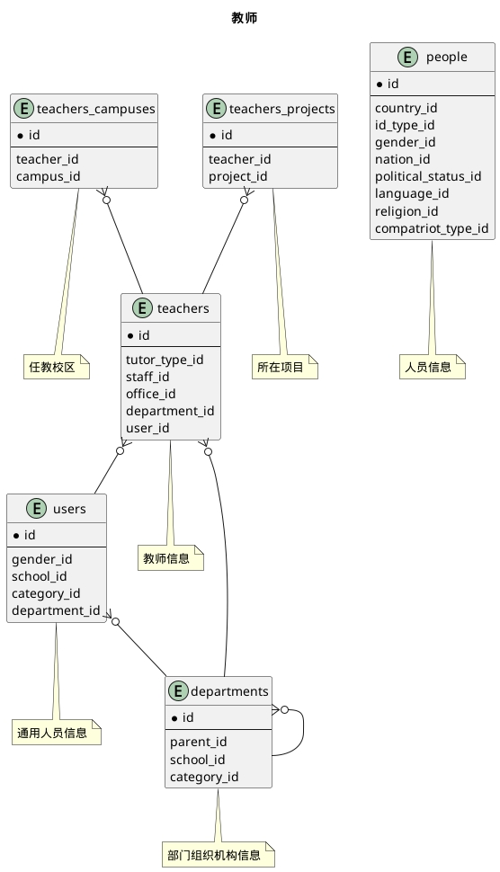

### 关系图 1. 教师
  * 关系图

### 表格 mentors 辅导员

  
<h5 id="table_base.mentors">表格base.mentors</h5>

  

<ul>
  <li>表格说明</li>
</ul>

<table class="table table-mini ">
<tr><th class="info_header">表名</th><th class="info_header">主键</th><th class="info_header" style="width:40%">注释</th>  </tr>
<tr><td>base.mentors</td><td>id</td><td>辅导员</td>  </tr>
</table>
<ul>
  <li>表格中的列</li>
</ul>
<table class="table table-mini">
<tr><th class="info_header text-center">序号</th><th class="info_header">字段名</th><th class="info_header">字段类型</th><th class="info_header text-center">是否可空</th><th class="info_header">描述</th><th class="info_header">引用表</th>  </tr>
<tr><td class="text-center">1</td><td>id</td><td>bigint</td><td class="text-center">否</td><td>非业务主键:assigned</td><td></td>  </tr>
<tr><td class="text-center">2</td><td>begin_on</td><td>date</td><td class="text-center">否</td><td>生效日期</td><td></td>  </tr>
<tr><td class="text-center">3</td><td>end_on</td><td>date</td><td class="text-center">是</td><td>失效日期</td><td></td>  </tr>
<tr><td class="text-center">4</td><td>name</td><td>varchar(255)</td><td class="text-center">否</td><td>名称</td><td></td>  </tr>
<tr><td class="text-center">5</td><td>staff_id</td><td>bigint</td><td class="text-center">否</td><td>教职工信息ID</td><td>            <a href="/model/base/hr/core.html#表格-staffs-教职工信息">base.staffs</a>
</td>  </tr>
</table>

<ul>
  <li>表格中唯一约束</li>
</ul>
<table class="table table-mini">
  <tr>
<th class="info_header">序号</th><th class="info_header">约束名</th><th class="info_header">约束字段</th>  </tr>
<tr><td>1</td><td>uk_4n9545nrhwav5b96nw9k2di1t</td><td>staff_id</td>  </tr>
</table>

  

### 表格 mentors_projects 辅导员-项目列表

  
<h5 id="table_base.mentors_projects">表格base.mentors_projects</h5>

  

<ul>
  <li>表格说明</li>
</ul>

<table class="table table-mini ">
<tr><th class="info_header">表名</th><th class="info_header">主键</th><th class="info_header" style="width:40%">注释</th>  </tr>
<tr><td>base.mentors_projects</td><td>mentor_id,project_id</td><td>辅导员-项目列表</td>  </tr>
</table>
<ul>
  <li>表格中的列</li>
</ul>
<table class="table table-mini">
<tr><th class="info_header text-center">序号</th><th class="info_header">字段名</th><th class="info_header">字段类型</th><th class="info_header text-center">是否可空</th><th class="info_header">描述</th><th class="info_header">引用表</th>  </tr>
<tr><td class="text-center">1</td><td>mentor_id</td><td>bigint</td><td class="text-center">否</td><td>辅导员ID</td><td>            <a href="/model/base/hr/core.html#表格-mentors-辅导员">base.mentors</a>
</td>  </tr>
<tr><td class="text-center">2</td><td>project_id</td><td>integer</td><td class="text-center">否</td><td>项目ID</td><td>            <a href="/model/base/common/misc.html#表格-projects-项目">base.projects</a>
</td>  </tr>
</table>
<ul>
  <li>表格的索引</li>
</ul>
<table class="table table-mini">
  <tr>
<th class="info_header">索引名</th><th class="info_header">索引字段</th><th class="info_header">是否唯一</th>  </tr>
<tr><td>idx_ppbhk85s88rolvwv4tm8d2kmv</td><td>mentor_id</td><td>否</td>  </tr>
</table>
  

### 表格 officials 领导干部

  
<h5 id="table_base.officials">表格base.officials</h5>

  

<ul>
  <li>表格说明</li>
</ul>

<table class="table table-mini ">
<tr><th class="info_header">表名</th><th class="info_header">主键</th><th class="info_header" style="width:40%">注释</th>  </tr>
<tr><td>base.officials</td><td>id</td><td>领导干部</td>  </tr>
</table>
<ul>
  <li>表格中的列</li>
</ul>
<table class="table table-mini">
<tr><th class="info_header text-center">序号</th><th class="info_header">字段名</th><th class="info_header">字段类型</th><th class="info_header text-center">是否可空</th><th class="info_header">描述</th><th class="info_header">引用表</th>  </tr>
<tr><td class="text-center">1</td><td>id</td><td>bigint</td><td class="text-center">否</td><td>非业务主键:datetime</td><td></td>  </tr>
<tr><td class="text-center">2</td><td>begin_on</td><td>date</td><td class="text-center">否</td><td>生效日期</td><td></td>  </tr>
<tr><td class="text-center">3</td><td>department_id</td><td>integer</td><td class="text-center">否</td><td>部门组织机构信息ID</td><td>            <a href="/model/base/common/user.html#表格-departments-部门组织机构信息">base.departments</a>
</td>  </tr>
<tr><td class="text-center">4</td><td>duty</td><td>varchar(100)</td><td class="text-center">否</td><td>行政职务</td><td></td>  </tr>
<tr><td class="text-center">5</td><td>end_on</td><td>date</td><td class="text-center">是</td><td>失效日期</td><td></td>  </tr>
<tr><td class="text-center">6</td><td>parttime</td><td>boolean</td><td class="text-center">否</td><td>是否兼职</td><td></td>  </tr>
<tr><td class="text-center">7</td><td>staff_id</td><td>bigint</td><td class="text-center">否</td><td>教职工信息ID</td><td>            <a href="/model/base/hr/core.html#表格-staffs-教职工信息">base.staffs</a>
</td>  </tr>
</table>
  

### 表格 secretaries 教学秘书

  
<h5 id="table_base.secretaries">表格base.secretaries</h5>

  

<ul>
  <li>表格说明</li>
</ul>

<table class="table table-mini ">
<tr><th class="info_header">表名</th><th class="info_header">主键</th><th class="info_header" style="width:40%">注释</th>  </tr>
<tr><td>base.secretaries</td><td>id</td><td>教学秘书</td>  </tr>
</table>
<ul>
  <li>表格中的列</li>
</ul>
<table class="table table-mini">
<tr><th class="info_header text-center">序号</th><th class="info_header">字段名</th><th class="info_header">字段类型</th><th class="info_header text-center">是否可空</th><th class="info_header">描述</th><th class="info_header">引用表</th>  </tr>
<tr><td class="text-center">1</td><td>id</td><td>bigint</td><td class="text-center">否</td><td>非业务主键:datetime</td><td></td>  </tr>
<tr><td class="text-center">2</td><td>begin_on</td><td>date</td><td class="text-center">否</td><td>生效日期</td><td></td>  </tr>
<tr><td class="text-center">3</td><td>end_on</td><td>date</td><td class="text-center">是</td><td>失效日期</td><td></td>  </tr>
<tr><td class="text-center">4</td><td>office_addr</td><td>varchar(100)</td><td class="text-center">是</td><td>办公室地址</td><td></td>  </tr>
<tr><td class="text-center">5</td><td>office_email</td><td>varchar(100)</td><td class="text-center">是</td><td>办公邮件</td><td></td>  </tr>
<tr><td class="text-center">6</td><td>office_phone</td><td>varchar(50)</td><td class="text-center">是</td><td>办公电话</td><td></td>  </tr>
<tr><td class="text-center">7</td><td>staff_id</td><td>bigint</td><td class="text-center">否</td><td>教职工信息ID</td><td>            <a href="/model/base/hr/core.html#表格-staffs-教职工信息">base.staffs</a>
</td>  </tr>
</table>
  

### 表格 secretaries_projects 教学秘书-项目列表

  
<h5 id="table_base.secretaries_projects">表格base.secretaries_projects</h5>

  

<ul>
  <li>表格说明</li>
</ul>

<table class="table table-mini ">
<tr><th class="info_header">表名</th><th class="info_header">主键</th><th class="info_header" style="width:40%">注释</th>  </tr>
<tr><td>base.secretaries_projects</td><td>secretary_id,project_id</td><td>教学秘书-项目列表</td>  </tr>
</table>
<ul>
  <li>表格中的列</li>
</ul>
<table class="table table-mini">
<tr><th class="info_header text-center">序号</th><th class="info_header">字段名</th><th class="info_header">字段类型</th><th class="info_header text-center">是否可空</th><th class="info_header">描述</th><th class="info_header">引用表</th>  </tr>
<tr><td class="text-center">1</td><td>project_id</td><td>integer</td><td class="text-center">否</td><td>项目ID</td><td>            <a href="/model/base/common/misc.html#表格-projects-项目">base.projects</a>
</td>  </tr>
<tr><td class="text-center">2</td><td>secretary_id</td><td>bigint</td><td class="text-center">否</td><td>教学秘书ID</td><td>            <a href="/model/base/hr/core.html#表格-secretaries-教学秘书">base.secretaries</a>
</td>  </tr>
</table>
<ul>
  <li>表格的索引</li>
</ul>
<table class="table table-mini">
  <tr>
<th class="info_header">索引名</th><th class="info_header">索引字段</th><th class="info_header">是否唯一</th>  </tr>
<tr><td>idx_4751fgfwuvlgoag1als5q4hm2</td><td>secretary_id</td><td>否</td>  </tr>
</table>
  

### 表格 staff_profiles 教师简介

  
<h5 id="table_base.staff_profiles">表格base.staff_profiles</h5>

  

<ul>
  <li>表格说明</li>
</ul>

<table class="table table-mini ">
<tr><th class="info_header">表名</th><th class="info_header">主键</th><th class="info_header" style="width:40%">注释</th>  </tr>
<tr><td>base.staff_profiles</td><td>id</td><td>教师简介</td>  </tr>
</table>
<ul>
  <li>表格中的列</li>
</ul>
<table class="table table-mini">
<tr><th class="info_header text-center">序号</th><th class="info_header">字段名</th><th class="info_header">字段类型</th><th class="info_header text-center">是否可空</th><th class="info_header">描述</th><th class="info_header">引用表</th>  </tr>
<tr><td class="text-center">1</td><td>id</td><td>bigint</td><td class="text-center">否</td><td>非业务主键:datetime</td><td></td>  </tr>
<tr><td class="text-center">2</td><td>awards</td><td>varchar(1000)</td><td class="text-center">是</td><td>荣誉和获奖</td><td></td>  </tr>
<tr><td class="text-center">3</td><td>career</td><td>varchar(4000)</td><td class="text-center">是</td><td>教学工作经历</td><td></td>  </tr>
<tr><td class="text-center">4</td><td>contact</td><td>varchar(255)</td><td class="text-center">是</td><td>联系方式</td><td></td>  </tr>
<tr><td class="text-center">5</td><td>courses</td><td>varchar(1000)</td><td class="text-center">是</td><td>教授课程</td><td></td>  </tr>
<tr><td class="text-center">6</td><td>harvest</td><td>text</td><td class="text-center">是</td><td>科研成果</td><td></td>  </tr>
<tr><td class="text-center">7</td><td>intro</td><td>text</td><td class="text-center">否</td><td>简介</td><td></td>  </tr>
<tr><td class="text-center">8</td><td>projects</td><td>varchar(1000)</td><td class="text-center">是</td><td>研究项目</td><td></td>  </tr>
<tr><td class="text-center">9</td><td>research</td><td>varchar(255)</td><td class="text-center">是</td><td>研究方向</td><td></td>  </tr>
<tr><td class="text-center">10</td><td>staff_id</td><td>bigint</td><td class="text-center">否</td><td>教职工信息ID</td><td>            <a href="/model/base/hr/core.html#表格-staffs-教职工信息">base.staffs</a>
</td>  </tr>
<tr><td class="text-center">11</td><td>titles</td><td>varchar(1000)</td><td class="text-center">是</td><td>学术兼职</td><td></td>  </tr>
<tr><td class="text-center">12</td><td>updated_at</td><td>timestamptz</td><td class="text-center">否</td><td>更新时间</td><td></td>  </tr>
</table>

<ul>
  <li>表格中唯一约束</li>
</ul>
<table class="table table-mini">
  <tr>
<th class="info_header">序号</th><th class="info_header">约束名</th><th class="info_header">约束字段</th>  </tr>
<tr><td>1</td><td>uk_ocmcnctnhlbe30lj7wwi7c4ks</td><td>staff_id</td>  </tr>
</table>

  

### 表格 staff_titles 职称信息

  
<h5 id="table_base.staff_titles">表格base.staff_titles</h5>

  

<ul>
  <li>表格说明</li>
</ul>

<table class="table table-mini ">
<tr><th class="info_header">表名</th><th class="info_header">主键</th><th class="info_header" style="width:40%">注释</th>  </tr>
<tr><td>base.staff_titles</td><td>id</td><td>职称信息</td>  </tr>
</table>
<ul>
  <li>表格中的列</li>
</ul>
<table class="table table-mini">
<tr><th class="info_header text-center">序号</th><th class="info_header">字段名</th><th class="info_header">字段类型</th><th class="info_header text-center">是否可空</th><th class="info_header">描述</th><th class="info_header">引用表</th>  </tr>
<tr><td class="text-center">1</td><td>id</td><td>bigint</td><td class="text-center">否</td><td>非业务主键:datetime</td><td></td>  </tr>
<tr><td class="text-center">2</td><td>begin_on</td><td>date</td><td class="text-center">否</td><td>生效日期</td><td></td>  </tr>
<tr><td class="text-center">3</td><td>end_on</td><td>date</td><td class="text-center">是</td><td>失效日期</td><td></td>  </tr>
<tr><td class="text-center">4</td><td>staff_id</td><td>bigint</td><td class="text-center">否</td><td>教职工ID</td><td>            <a href="/model/base/hr/core.html#表格-staffs-教职工信息">base.staffs</a>
</td>  </tr>
<tr><td class="text-center">5</td><td>title_id</td><td>integer</td><td class="text-center">否</td><td>职称ID</td><td>            <a href="/model/code/job/all.html#表格-professional_titles-职称">code.professional_titles</a>
</td>  </tr>
</table>
  

### 表格 staffs 教职工信息

  
<h5 id="table_base.staffs">表格base.staffs</h5>

  

<ul>
  <li>表格说明</li>
</ul>

<table class="table table-mini ">
<tr><th class="info_header">表名</th><th class="info_header">主键</th><th class="info_header" style="width:40%">注释</th>  </tr>
<tr><td>base.staffs</td><td>id</td><td>教职工信息</td>  </tr>
</table>
<ul>
  <li>表格中的列</li>
</ul>
<table class="table table-mini">
<tr><th class="info_header text-center">序号</th><th class="info_header">字段名</th><th class="info_header">字段类型</th><th class="info_header text-center">是否可空</th><th class="info_header">描述</th><th class="info_header">引用表</th>  </tr>
<tr><td class="text-center">1</td><td>id</td><td>bigint</td><td class="text-center">否</td><td>非业务主键:datetime</td><td></td>  </tr>
<tr><td class="text-center">2</td><td>begin_on</td><td>date</td><td class="text-center">否</td><td>生效日期</td><td></td>  </tr>
<tr><td class="text-center">3</td><td>birthday</td><td>date</td><td class="text-center">是</td><td>出生日期</td><td></td>  </tr>
<tr><td class="text-center">4</td><td>code</td><td>varchar(20)</td><td class="text-center">否</td><td>代码</td><td></td>  </tr>
<tr><td class="text-center">5</td><td>degree_award_by</td><td>varchar(255)</td><td class="text-center">是</td><td>最高学位授予单位</td><td></td>  </tr>
<tr><td class="text-center">6</td><td>degree_id</td><td>integer</td><td class="text-center">是</td><td>学位ID</td><td>            <a href="/model/code/edu/all.html#表格-degrees-学位">code.degrees</a>
</td>  </tr>
<tr><td class="text-center">7</td><td>degree_level_id</td><td>integer</td><td class="text-center">是</td><td>最高学位ID</td><td>            <a href="/model/code/edu/all.html#表格-degree_levels-学位层次">code.degree_levels</a>
</td>  </tr>
<tr><td class="text-center">8</td><td>department_id</td><td>integer</td><td class="text-center">否</td><td>部门组织机构信息ID</td><td>            <a href="/model/base/common/user.html#表格-departments-部门组织机构信息">base.departments</a>
</td>  </tr>
<tr><td class="text-center">9</td><td>education_degree_id</td><td>integer</td><td class="text-center">是</td><td>最高学历ID</td><td>            <a href="/model/code/edu/all.html#表格-education_degrees-学历(文化程度)">code.education_degrees</a>
</td>  </tr>
<tr><td class="text-center">10</td><td>email</td><td>varchar(100)</td><td class="text-center">是</td><td>电子邮件</td><td></td>  </tr>
<tr><td class="text-center">11</td><td>end_on</td><td>date</td><td class="text-center">是</td><td>失效日期</td><td></td>  </tr>
<tr><td class="text-center">12</td><td>external_</td><td>boolean</td><td class="text-center">否</td><td>是否外聘</td><td></td>  </tr>
<tr><td class="text-center">13</td><td>formal_hr</td><td>boolean</td><td class="text-center">否</td><td>是否在编</td><td></td>  </tr>
<tr><td class="text-center">14</td><td>gender_id</td><td>integer</td><td class="text-center">否</td><td>性别ID</td><td>            <a href="/model/code/person/all.html#表格-genders-性别">code.genders</a>
</td>  </tr>
<tr><td class="text-center">15</td><td>homepage</td><td>varchar(200)</td><td class="text-center">是</td><td>个人主页</td><td></td>  </tr>
<tr><td class="text-center">16</td><td>id_number</td><td>varchar(18)</td><td class="text-center">是</td><td>证件号码</td><td></td>  </tr>
<tr><td class="text-center">17</td><td>id_type_id</td><td>integer</td><td class="text-center">是</td><td>证件类型ID</td><td>            <a href="/model/code/person/all.html#表格-id_types-证件类型">code.id_types</a>
</td>  </tr>
<tr><td class="text-center">18</td><td>mobile</td><td>varchar(20)</td><td class="text-center">是</td><td>联系手机</td><td></td>  </tr>
<tr><td class="text-center">19</td><td>name</td><td>varchar(100)</td><td class="text-center">否</td><td>名称</td><td></td>  </tr>
<tr><td class="text-center">20</td><td>nation_id</td><td>integer</td><td class="text-center">是</td><td>民族ID</td><td>            <a href="/model/code/person/all.html#表格-nations-民族">code.nations</a>
</td>  </tr>
<tr><td class="text-center">21</td><td>organization</td><td>varchar(200)</td><td class="text-center">是</td><td>全职工作单位</td><td></td>  </tr>
<tr><td class="text-center">22</td><td>parttime</td><td>boolean</td><td class="text-center">否</td><td>是否兼职</td><td></td>  </tr>
<tr><td class="text-center">23</td><td>political_status_id</td><td>integer</td><td class="text-center">是</td><td>政治面貌ID</td><td>            <a href="/model/code/person/all.html#表格-political_statuses-政治面貌">code.political_statuses</a>
</td>  </tr>
<tr><td class="text-center">24</td><td>school_id</td><td>integer</td><td class="text-center">否</td><td>学校信息ID</td><td>            <a href="/model/base/common/misc.html#表格-schools-学校信息">base.schools</a>
</td>  </tr>
<tr><td class="text-center">25</td><td>staff_type_id</td><td>integer</td><td class="text-center">否</td><td>教职工类别ID</td><td>            <a href="/model/code/hr/all.html#表格-staff_types-教职工类别">code.staff_types</a>
</td>  </tr>
<tr><td class="text-center">26</td><td>status_id</td><td>integer</td><td class="text-center">否</td><td>在职状态ID</td><td>            <a href="/model/code/hr/all.html#表格-work_statuses-在职状态">code.work_statuses</a>
</td>  </tr>
<tr><td class="text-center">27</td><td>title_id</td><td>integer</td><td class="text-center">是</td><td>最高职称ID</td><td>            <a href="/model/code/job/all.html#表格-professional_titles-职称">code.professional_titles</a>
</td>  </tr>
<tr><td class="text-center">28</td><td>updated_at</td><td>timestamptz</td><td class="text-center">否</td><td>更新时间</td><td></td>  </tr>
</table>

<ul>
  <li>表格中唯一约束</li>
</ul>
<table class="table table-mini">
  <tr>
<th class="info_header">序号</th><th class="info_header">约束名</th><th class="info_header">约束字段</th>  </tr>
<tr><td>1</td><td>uk_ksaq070k32jb6aey065dd9xv0</td><td>school_id,code</td>  </tr>
</table>

  

### 表格 teachers 教师信息

  
<h5 id="table_base.teachers">表格base.teachers</h5>

  

<ul>
  <li>表格说明</li>
</ul>

<table class="table table-mini ">
<tr><th class="info_header">表名</th><th class="info_header">主键</th><th class="info_header" style="width:40%">注释</th>  </tr>
<tr><td>base.teachers</td><td>id</td><td>教师信息</td>  </tr>
</table>
<ul>
  <li>表格中的列</li>
</ul>
<table class="table table-mini">
<tr><th class="info_header text-center">序号</th><th class="info_header">字段名</th><th class="info_header">字段类型</th><th class="info_header text-center">是否可空</th><th class="info_header">描述</th><th class="info_header">引用表</th>  </tr>
<tr><td class="text-center">1</td><td>id</td><td>bigint</td><td class="text-center">否</td><td>非业务主键:assigned</td><td></td>  </tr>
<tr><td class="text-center">2</td><td>begin_on</td><td>date</td><td class="text-center">否</td><td>生效日期</td><td></td>  </tr>
<tr><td class="text-center">3</td><td>department_id</td><td>integer</td><td class="text-center">否</td><td>所在部门ID</td><td>            <a href="/model/base/common/user.html#表格-departments-部门组织机构信息">base.departments</a>
</td>  </tr>
<tr><td class="text-center">4</td><td>end_on</td><td>date</td><td class="text-center">是</td><td>失效日期</td><td></td>  </tr>
<tr><td class="text-center">5</td><td>name</td><td>varchar(100)</td><td class="text-center">否</td><td>名称</td><td></td>  </tr>
<tr><td class="text-center">6</td><td>office_id</td><td>bigint</td><td class="text-center">是</td><td>教研室ID</td><td>            <a href="/model/base/edu/misc.html#表格-teaching_offices-教研室">base.teaching_offices</a>
</td>  </tr>
<tr><td class="text-center">7</td><td>oqc</td><td>varchar(200)</td><td class="text-center">是</td><td>其他职业资格证书和等级说明</td><td></td>  </tr>
<tr><td class="text-center">8</td><td>remark</td><td>varchar(255)</td><td class="text-center">是</td><td>备注</td><td></td>  </tr>
<tr><td class="text-center">9</td><td>staff_id</td><td>bigint</td><td class="text-center">否</td><td>教职工信息ID</td><td>            <a href="/model/base/hr/core.html#表格-staffs-教职工信息">base.staffs</a>
</td>  </tr>
<tr><td class="text-center">10</td><td>tqc_number</td><td>varchar(20)</td><td class="text-center">是</td><td>教师资格证编号</td><td></td>  </tr>
<tr><td class="text-center">11</td><td>tutor_type_id</td><td>integer</td><td class="text-center">是</td><td>导师类别ID</td><td>            <a href="/model/code/job/all.html#表格-tutor_types-导师类别">code.tutor_types</a>
</td>  </tr>
<tr><td class="text-center">12</td><td>user_id</td><td>bigint</td><td class="text-center">否</td><td>通用人员信息ID</td><td>            <a href="/model/base/common/user.html#表格-users-通用人员信息">base.users</a>
</td>  </tr>
</table>

<ul>
  <li>表格中唯一约束</li>
</ul>
<table class="table table-mini">
  <tr>
<th class="info_header">序号</th><th class="info_header">约束名</th><th class="info_header">约束字段</th>  </tr>
<tr><td>1</td><td>uk_hwllts0elb03lqv7yenjhk3dt</td><td>staff_id</td>  </tr>
<tr><td>2</td><td>uk_cd1k6xwg9jqtiwx9ybnxpmoh9</td><td>user_id</td>  </tr>
</table>

  

### 表格 teachers_campuses 任教校区

  
<h5 id="table_base.teachers_campuses">表格base.teachers_campuses</h5>

  

<ul>
  <li>表格说明</li>
</ul>

<table class="table table-mini ">
<tr><th class="info_header">表名</th><th class="info_header">主键</th><th class="info_header" style="width:40%">注释</th>  </tr>
<tr><td>base.teachers_campuses</td><td>teacher_id,campus_id</td><td>任教校区</td>  </tr>
</table>
<ul>
  <li>表格中的列</li>
</ul>
<table class="table table-mini">
<tr><th class="info_header text-center">序号</th><th class="info_header">字段名</th><th class="info_header">字段类型</th><th class="info_header text-center">是否可空</th><th class="info_header">描述</th><th class="info_header">引用表</th>  </tr>
<tr><td class="text-center">1</td><td>campus_id</td><td>integer</td><td class="text-center">否</td><td>校区信息ID</td><td>            <a href="/model/base/common/misc.html#表格-campuses-校区信息">base.campuses</a>
</td>  </tr>
<tr><td class="text-center">2</td><td>teacher_id</td><td>bigint</td><td class="text-center">否</td><td>教师信息ID</td><td>            <a href="/model/base/hr/core.html#表格-teachers-教师信息">base.teachers</a>
</td>  </tr>
</table>
<ul>
  <li>表格的索引</li>
</ul>
<table class="table table-mini">
  <tr>
<th class="info_header">索引名</th><th class="info_header">索引字段</th><th class="info_header">是否唯一</th>  </tr>
<tr><td>idx_dryob4n9h2g16emfu7mhc2b7w</td><td>teacher_id</td><td>否</td>  </tr>
</table>
  

### 表格 teachers_projects 所在项目

  
<h5 id="table_base.teachers_projects">表格base.teachers_projects</h5>

  

<ul>
  <li>表格说明</li>
</ul>

<table class="table table-mini ">
<tr><th class="info_header">表名</th><th class="info_header">主键</th><th class="info_header" style="width:40%">注释</th>  </tr>
<tr><td>base.teachers_projects</td><td>teacher_id,project_id</td><td>所在项目</td>  </tr>
</table>
<ul>
  <li>表格中的列</li>
</ul>
<table class="table table-mini">
<tr><th class="info_header text-center">序号</th><th class="info_header">字段名</th><th class="info_header">字段类型</th><th class="info_header text-center">是否可空</th><th class="info_header">描述</th><th class="info_header">引用表</th>  </tr>
<tr><td class="text-center">1</td><td>project_id</td><td>integer</td><td class="text-center">否</td><td>项目ID</td><td>            <a href="/model/base/common/misc.html#表格-projects-项目">base.projects</a>
</td>  </tr>
<tr><td class="text-center">2</td><td>teacher_id</td><td>bigint</td><td class="text-center">否</td><td>教师信息ID</td><td>            <a href="/model/base/hr/core.html#表格-teachers-教师信息">base.teachers</a>
</td>  </tr>
</table>
<ul>
  <li>表格的索引</li>
</ul>
<table class="table table-mini">
  <tr>
<th class="info_header">索引名</th><th class="info_header">索引字段</th><th class="info_header">是否唯一</th>  </tr>
<tr><td>idx_swgo4qm8hl9fiixhbkynf4kmp</td><td>teacher_id</td><td>否</td>  </tr>
</table>
  

