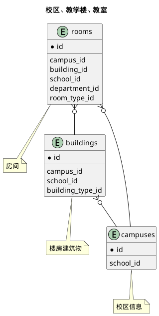



#### 目 录

##### 1. 数据库对象列表
  * [1.1 表格一览](index.html#表格一览)
  * [1.2 模块关系图](index.html#模块关系图)

##### 2. 具体模块明细
* [2.1 所有表格](/model/base/space/core.html)

### 表格一览
Schema base.space下共计5个表，分别如下:

<table class="table table-bordered table-striped table-condensed">
  <tr>
    <th class="info_header text-center">序号</th>
    <th class="info_header">表名/描述</th>
    <th class="info_header text-center">序号</th>
    <th class="info_header">表名/描述</th>
  </tr>
  <tr>
    <td>1</td>
    <td><a href="/model/base/space/core.html#表格-buildings-楼房建筑物">buildings</a> 楼房建筑物</td>
    <td>4</td>
    <td><a href="/model/base/space/core.html#表格-classrooms_projects-使用项目">classrooms_projects</a> 使用项目</td>
  </tr>
  <tr>
    <td>2</td>
    <td><a href="/model/base/space/core.html#表格-classrooms-教室">classrooms</a> 教室</td>
    <td>5</td>
    <td><a href="/model/base/space/core.html#表格-rooms-房间">rooms</a> 房间</td>
  </tr>
  <tr>
    <td>3</td>
    <td><a href="/model/base/space/core.html#表格-classrooms_departs-使用部门">classrooms_departs</a> 使用部门</td>
    <td></td>
    <td></td>
  </tr>
</table>

### 模块关系图

#### 1. 校区、教学楼、教室
  * 关系图

