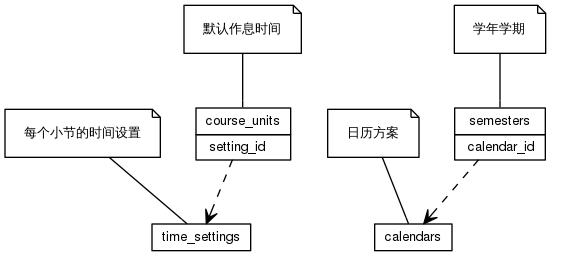


 目  录

* toc
{:toc}

### 关系图 1. 学期和作息时间
  * 关系图
  

### 表格 calendars

  * 表格说明

<table class="table table-bordered table-striped table-condensed">
<tr><th style="background-color:#D0D3FF">表名</th><th style="background-color:#D0D3FF">主键</th><th style="background-color:#D0D3FF">注释</th>  </tr>
<tr><td>calendars</td><td>id</td><td>日历方案</td>  </tr>
</table>

  * 表格中的列

<table class="table table-bordered table-striped table-condensed">
<tr><th style="background-color:#D0D3FF">序号</th><th style="background-color:#D0D3FF">字段名</th><th style="background-color:#D0D3FF">字段类型</th><th style="background-color:#D0D3FF">是否可空</th><th style="background-color:#D0D3FF">描述</th><th style="background-color:#D0D3FF">引用表</th>  </tr>
<tr><td>1</td><td>id</td><td>int4</td><td>否</td><td>非业务主键:auto_increment</td><td></td>  </tr>
<tr><td>2</td><td>code</td><td>varchar</td><td>否</td><td>代码</td><td></td>  </tr>
<tr><td>3</td><td>name</td><td>varchar</td><td>否</td><td>名称</td><td></td>  </tr>
<tr><td>4</td><td>first_day</td><td>int4</td><td>否</td><td>每周开始时间</td><td></td>  </tr>
<tr><td>5</td><td>begin_on</td><td>date</td><td>是</td><td>生效日期</td><td></td>  </tr>
<tr><td>6</td><td>end_on</td><td>date</td><td>是</td><td>失效日期</td><td></td>  </tr>
</table>

 
  * 表格的索引

<table class="table table-bordered table-striped table-condensed">
  <tr>
<th style="background-color:#D0D3FF">索引名</th><th style="background-color:#D0D3FF">索引字段</th><th style="background-color:#D0D3FF">是否唯一</th>  </tr>
<tr><td>calendars_pkey</td><td>id&nbsp;</td><td>是</td>  </tr>
<tr><td>uk_6li3adlkeys9uil7kw5weqssi</td><td>name&nbsp;</td><td>是</td>  </tr>
<tr><td>uk_8m1c6quax6tc0f5v76tqrfxmf</td><td>code&nbsp;</td><td>是</td>  </tr>
</table>

### 表格 course_units

  * 表格说明

<table class="table table-bordered table-striped table-condensed">
<tr><th style="background-color:#D0D3FF">表名</th><th style="background-color:#D0D3FF">主键</th><th style="background-color:#D0D3FF">注释</th>  </tr>
<tr><td>course_units</td><td>id</td><td>默认作息时间</td>  </tr>
</table>

  * 表格中的列

<table class="table table-bordered table-striped table-condensed">
<tr><th style="background-color:#D0D3FF">序号</th><th style="background-color:#D0D3FF">字段名</th><th style="background-color:#D0D3FF">字段类型</th><th style="background-color:#D0D3FF">是否可空</th><th style="background-color:#D0D3FF">描述</th><th style="background-color:#D0D3FF">引用表</th>  </tr>
<tr><td>1</td><td>id</td><td>int2</td><td>否</td><td>非业务主键:auto_increment</td><td></td>  </tr>
<tr><td>2</td><td>indexno</td><td>int4</td><td>否</td><td>小节编号</td><td></td>  </tr>
<tr><td>3</td><td>name</td><td>varchar</td><td>否</td><td>名称</td><td></td>  </tr>
<tr><td>4</td><td>setting_id</td><td>int4</td><td>否</td><td>时间设置 ID</td><td>time_settings</td>  </tr>
<tr><td>5</td><td>begin_at</td><td>int2</td><td>否</td><td>开始分钟</td><td></td>  </tr>
<tr><td>6</td><td>end_at</td><td>int2</td><td>否</td><td>结束分钟</td><td></td>  </tr>
</table>

 
  * 表格的索引

<table class="table table-bordered table-striped table-condensed">
  <tr>
<th style="background-color:#D0D3FF">索引名</th><th style="background-color:#D0D3FF">索引字段</th><th style="background-color:#D0D3FF">是否唯一</th>  </tr>
<tr><td>course_units_pkey</td><td>id&nbsp;</td><td>是</td>  </tr>
</table>

### 表格 holidays

  * 表格说明

<table class="table table-bordered table-striped table-condensed">
<tr><th style="background-color:#D0D3FF">表名</th><th style="background-color:#D0D3FF">主键</th><th style="background-color:#D0D3FF">注释</th>  </tr>
<tr><td>holidays</td><td>id</td><td>法定假日</td>  </tr>
</table>

  * 表格中的列

<table class="table table-bordered table-striped table-condensed">
<tr><th style="background-color:#D0D3FF">序号</th><th style="background-color:#D0D3FF">字段名</th><th style="background-color:#D0D3FF">字段类型</th><th style="background-color:#D0D3FF">是否可空</th><th style="background-color:#D0D3FF">描述</th><th style="background-color:#D0D3FF">引用表</th>  </tr>
<tr><td>1</td><td>id</td><td>int4</td><td>否</td><td>非业务主键:auto_increment</td><td></td>  </tr>
<tr><td>2</td><td>name</td><td>varchar</td><td>否</td><td>名称</td><td></td>  </tr>
<tr><td>3</td><td>begin_on</td><td>date</td><td>否</td><td>生效日期</td><td></td>  </tr>
<tr><td>4</td><td>end_on</td><td>date</td><td>否</td><td>失效日期</td><td></td>  </tr>
</table>

 
  * 表格的索引

<table class="table table-bordered table-striped table-condensed">
  <tr>
<th style="background-color:#D0D3FF">索引名</th><th style="background-color:#D0D3FF">索引字段</th><th style="background-color:#D0D3FF">是否唯一</th>  </tr>
<tr><td>holidays_pkey</td><td>id&nbsp;</td><td>是</td>  </tr>
</table>

### 表格 semesters

  * 表格说明

<table class="table table-bordered table-striped table-condensed">
<tr><th style="background-color:#D0D3FF">表名</th><th style="background-color:#D0D3FF">主键</th><th style="background-color:#D0D3FF">注释</th>  </tr>
<tr><td>semesters</td><td>id</td><td>学年学期</td>  </tr>
</table>

  * 表格中的列

<table class="table table-bordered table-striped table-condensed">
<tr><th style="background-color:#D0D3FF">序号</th><th style="background-color:#D0D3FF">字段名</th><th style="background-color:#D0D3FF">字段类型</th><th style="background-color:#D0D3FF">是否可空</th><th style="background-color:#D0D3FF">描述</th><th style="background-color:#D0D3FF">引用表</th>  </tr>
<tr><td>1</td><td>id</td><td>int4</td><td>否</td><td>非业务主键:code</td><td></td>  </tr>
<tr><td>2</td><td>code</td><td>varchar</td><td>否</td><td>代码</td><td></td>  </tr>
<tr><td>3</td><td>name</td><td>varchar</td><td>否</td><td>名称</td><td></td>  </tr>
<tr><td>4</td><td>school_year</td><td>varchar</td><td>否</td><td>学年度,格式2005-2006</td><td></td>  </tr>
<tr><td>5</td><td>calendar_id</td><td>int4</td><td>否</td><td>教学日历方案类别 ID</td><td>calendars</td>  </tr>
<tr><td>6</td><td>first_weekday</td><td>int4</td><td>否</td><td>每周开始时间</td><td></td>  </tr>
<tr><td>7</td><td>begin_on</td><td>date</td><td>否</td><td>生效日期</td><td></td>  </tr>
<tr><td>8</td><td>end_on</td><td>date</td><td>否</td><td>失效日期</td><td></td>  </tr>
</table>

 
  * 表格的索引

<table class="table table-bordered table-striped table-condensed">
  <tr>
<th style="background-color:#D0D3FF">索引名</th><th style="background-color:#D0D3FF">索引字段</th><th style="background-color:#D0D3FF">是否唯一</th>  </tr>
<tr><td>semesters_pkey</td><td>id&nbsp;</td><td>是</td>  </tr>
<tr><td>uk_ncllnspek0awc90guroynogp</td><td>code&nbsp;</td><td>是</td>  </tr>
</table>

### 表格 time_settings

  * 表格说明

<table class="table table-bordered table-striped table-condensed">
<tr><th style="background-color:#D0D3FF">表名</th><th style="background-color:#D0D3FF">主键</th><th style="background-color:#D0D3FF">注释</th>  </tr>
<tr><td>time_settings</td><td>id</td><td>每个小节的时间设置</td>  </tr>
</table>

  * 表格中的列

<table class="table table-bordered table-striped table-condensed">
<tr><th style="background-color:#D0D3FF">序号</th><th style="background-color:#D0D3FF">字段名</th><th style="background-color:#D0D3FF">字段类型</th><th style="background-color:#D0D3FF">是否可空</th><th style="background-color:#D0D3FF">描述</th><th style="background-color:#D0D3FF">引用表</th>  </tr>
<tr><td>1</td><td>id</td><td>int4</td><td>否</td><td>非业务主键:auto_increment</td><td></td>  </tr>
<tr><td>2</td><td>name</td><td>varchar</td><td>否</td><td>名称</td><td></td>  </tr>
</table>

 
  * 表格的索引

<table class="table table-bordered table-striped table-condensed">
  <tr>
<th style="background-color:#D0D3FF">索引名</th><th style="background-color:#D0D3FF">索引字段</th><th style="background-color:#D0D3FF">是否唯一</th>  </tr>
<tr><td>time_settings_pkey</td><td>id&nbsp;</td><td>是</td>  </tr>
</table>
