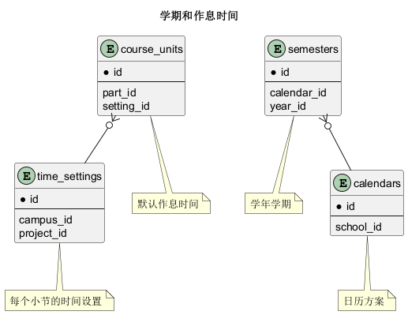

# 基础信息 学期和作息时间 表结构

## 表格一览

<table class="table-mini">
  <thead>
    <tr>
      <th class="info_header text-center" width="7%">序号</th>
      <th class="info_header" width="43%">表名/描述</th>
      <th class="info_header text-center" width="7%">序号</th>
      <th class="info_header" width="43%">表名/描述</th>
    </tr>
  </thead>
  <tbody>
    <tr>
      <td class="text-center">1</td>
      <td><a href="/model/base/time.html#calendar-stages">calendar_stages</a> 日历阶段</td>
      <td class="text-center">5</td>
      <td><a href="/model/base/time.html#school-years">school_years</a> 学年度</td>
    </tr>
    <tr>
      <td class="text-center">2</td>
      <td><a href="/model/base/time.html#calendars">calendars</a> 日历方案</td>
      <td class="text-center">6</td>
      <td><a href="/model/base/time.html#semester-stages">semester_stages</a> 学期阶段</td>
    </tr>
    <tr>
      <td class="text-center">3</td>
      <td><a href="/model/base/time.html#course-units">course_units</a> 默认作息时间</td>
      <td class="text-center">7</td>
      <td><a href="/model/base/time.html#semesters">semesters</a> 学年学期</td>
    </tr>
    <tr>
      <td class="text-center">4</td>
      <td><a href="/model/base/time.html#holidays">holidays</a> 假期</td>
      <td class="text-center">8</td>
      <td><a href="/model/base/time.html#time-settings">time_settings</a> 每个小节的时间设置</td>
    </tr>
  </tbody>
</table>

## 关键关系图

### 关系图 1. 学期和作息时间
  * 关系图

## 表格明细

## calendar_stages

<table class="table-entity">
  <tbody>
    <tr>
      <td class="table-entity-title" width="15%">表名:&nbsp;</td>
      <td>base.calendar_stages 日历阶段</td>
    </tr>
    <tr>
      <td class="table-entity-title">唯一约束:&nbsp;</td>
      <td>主键🔑(id) </td>
    </tr>
  </tbody>
</table>

<table class="table-entity">
  <thead>
    <tr>
<th class="info_header text-center" width="7%">序号</th><th class="info_header" width="20%">字段名</th><th class="info_header" width="20%">字段类型</th><th class="info_header text-center" width="8%">是否可空</th><th class="info_header" width="25%">描述</th><th class="info_header" width="20%">引用表</th>    </tr>
  </thead>
  <tbody>
    <tr>
      <td class="text-center">1</td>
      <td>id</td>
      <td>integer</td>
      <td class="text-center">否</td>
      <td>非业务主键:auto_increment</td>
      <td>      </td>
    </tr>
    <tr>
      <td class="text-center">2</td>
      <td>en_name</td>
      <td>varchar(255)</td>
      <td class="text-center">是</td>
      <td>英文名</td>
      <td>      </td>
    </tr>
    <tr>
      <td class="text-center">3</td>
      <td>end_week</td>
      <td>integer</td>
      <td class="text-center">否</td>
      <td>结束周</td>
      <td>      </td>
    </tr>
    <tr>
      <td class="text-center">4</td>
      <td>name</td>
      <td>varchar(100)</td>
      <td class="text-center">否</td>
      <td>名称</td>
      <td>      </td>
    </tr>
    <tr>
      <td class="text-center">5</td>
      <td>school_id</td>
      <td>integer</td>
      <td class="text-center">否</td>
      <td>学校信息ID</td>
      <td><a href="/model/base/user.html#schools">base.schools</a>      </td>
    </tr>
    <tr>
      <td class="text-center">6</td>
      <td>start_week</td>
      <td>integer</td>
      <td class="text-center">否</td>
      <td>起始周</td>
      <td>      </td>
    </tr>
    <tr>
      <td class="text-center">7</td>
      <td>vacation</td>
      <td>boolean</td>
      <td class="text-center">否</td>
      <td>是否假期</td>
      <td>      </td>
    </tr>
  </tbody>
</table>

## calendars

<table class="table-entity">
  <tbody>
    <tr>
      <td class="table-entity-title" width="15%">表名:&nbsp;</td>
      <td>base.calendars 日历方案</td>
    </tr>
    <tr>
      <td class="table-entity-title">唯一约束:&nbsp;</td>
      <td>主键🔑(id) uk_9k89gny3vqpqyk7mkhuxg16fi(school_id,code)</td>
    </tr>
  </tbody>
</table>

<table class="table-entity">
  <thead>
    <tr>
<th class="info_header text-center" width="7%">序号</th><th class="info_header" width="20%">字段名</th><th class="info_header" width="20%">字段类型</th><th class="info_header text-center" width="8%">是否可空</th><th class="info_header" width="25%">描述</th><th class="info_header" width="20%">引用表</th>    </tr>
  </thead>
  <tbody>
    <tr>
      <td class="text-center">1</td>
      <td>id</td>
      <td>integer</td>
      <td class="text-center">否</td>
      <td>非业务主键:auto_increment</td>
      <td>      </td>
    </tr>
    <tr>
      <td class="text-center">2</td>
      <td>begin_on</td>
      <td>date</td>
      <td class="text-center">否</td>
      <td>生效日期</td>
      <td>      </td>
    </tr>
    <tr>
      <td class="text-center">3</td>
      <td>code</td>
      <td>varchar(10)</td>
      <td class="text-center">否</td>
      <td>代码</td>
      <td>      </td>
    </tr>
    <tr>
      <td class="text-center">4</td>
      <td>end_on</td>
      <td>date</td>
      <td class="text-center">是</td>
      <td>失效日期</td>
      <td>      </td>
    </tr>
    <tr>
      <td class="text-center">5</td>
      <td>first_weekday</td>
      <td>integer</td>
      <td class="text-center">否</td>
      <td>每周开始时间</td>
      <td>      </td>
    </tr>
    <tr>
      <td class="text-center">6</td>
      <td>name</td>
      <td>varchar(80)</td>
      <td class="text-center">否</td>
      <td>名称</td>
      <td>      </td>
    </tr>
    <tr>
      <td class="text-center">7</td>
      <td>school_id</td>
      <td>integer</td>
      <td class="text-center">否</td>
      <td>学校ID</td>
      <td><a href="/model/base/user.html#schools">base.schools</a>      </td>
    </tr>
    <tr>
      <td class="text-center">8</td>
      <td>updated_at</td>
      <td>timestamptz</td>
      <td class="text-center">否</td>
      <td>更新时间</td>
      <td>      </td>
    </tr>
  </tbody>
</table>

## course_units

<table class="table-entity">
  <tbody>
    <tr>
      <td class="table-entity-title" width="15%">表名:&nbsp;</td>
      <td>base.course_units 默认作息时间</td>
    </tr>
    <tr>
      <td class="table-entity-title">唯一约束:&nbsp;</td>
      <td>主键🔑(id) </td>
    </tr>
    <tr>
      <td class="table-entity-title">索引:&nbsp;</td>
      <td>idx_enrjhpjmn8iterehufbi0m2f6(setting_id) </td>
    </tr>
  </tbody>
</table>

<table class="table-entity">
  <thead>
    <tr>
<th class="info_header text-center" width="7%">序号</th><th class="info_header" width="20%">字段名</th><th class="info_header" width="20%">字段类型</th><th class="info_header text-center" width="8%">是否可空</th><th class="info_header" width="25%">描述</th><th class="info_header" width="20%">引用表</th>    </tr>
  </thead>
  <tbody>
    <tr>
      <td class="text-center">1</td>
      <td>id</td>
      <td>integer</td>
      <td class="text-center">否</td>
      <td>非业务主键:auto_increment</td>
      <td>      </td>
    </tr>
    <tr>
      <td class="text-center">2</td>
      <td>begin_at</td>
      <td>smallint</td>
      <td class="text-center">否</td>
      <td>开始分钟</td>
      <td>      </td>
    </tr>
    <tr>
      <td class="text-center">3</td>
      <td>en_name</td>
      <td>varchar(30)</td>
      <td class="text-center">否</td>
      <td>英文名称</td>
      <td>      </td>
    </tr>
    <tr>
      <td class="text-center">4</td>
      <td>end_at</td>
      <td>smallint</td>
      <td class="text-center">否</td>
      <td>结束分钟</td>
      <td>      </td>
    </tr>
    <tr>
      <td class="text-center">5</td>
      <td>indexno</td>
      <td>integer</td>
      <td class="text-center">否</td>
      <td>小节编号</td>
      <td>      </td>
    </tr>
    <tr>
      <td class="text-center">6</td>
      <td>name</td>
      <td>varchar(20)</td>
      <td class="text-center">否</td>
      <td>名称</td>
      <td>      </td>
    </tr>
    <tr>
      <td class="text-center">7</td>
      <td>part_id</td>
      <td>integer</td>
      <td class="text-center">否</td>
      <td>时段ID</td>
      <td><a href="/model/code/all.html#day-parts">code.day_parts</a>      </td>
    </tr>
    <tr>
      <td class="text-center">8</td>
      <td>setting_id</td>
      <td>integer</td>
      <td class="text-center">否</td>
      <td>时间设置ID</td>
      <td><a href="/model/base/time.html#time-settings">base.time_settings</a>      </td>
    </tr>
  </tbody>
</table>

## holidays

<table class="table-entity">
  <tbody>
    <tr>
      <td class="table-entity-title" width="15%">表名:&nbsp;</td>
      <td>base.holidays 假期</td>
    </tr>
    <tr>
      <td class="table-entity-title">唯一约束:&nbsp;</td>
      <td>主键🔑(id) </td>
    </tr>
  </tbody>
</table>

<table class="table-entity">
  <thead>
    <tr>
<th class="info_header text-center" width="7%">序号</th><th class="info_header" width="20%">字段名</th><th class="info_header" width="20%">字段类型</th><th class="info_header text-center" width="8%">是否可空</th><th class="info_header" width="25%">描述</th><th class="info_header" width="20%">引用表</th>    </tr>
  </thead>
  <tbody>
    <tr>
      <td class="text-center">1</td>
      <td>id</td>
      <td>bigint</td>
      <td class="text-center">否</td>
      <td>非业务主键:datetime</td>
      <td>      </td>
    </tr>
    <tr>
      <td class="text-center">2</td>
      <td>name</td>
      <td>varchar(255)</td>
      <td class="text-center">否</td>
      <td>名称</td>
      <td>      </td>
    </tr>
    <tr>
      <td class="text-center">3</td>
      <td>project_id</td>
      <td>integer</td>
      <td class="text-center">否</td>
      <td>项目ID</td>
      <td><a href="/model/base/edu.html#projects">base.projects</a>      </td>
    </tr>
    <tr>
      <td class="text-center">4</td>
      <td>start_on</td>
      <td>date</td>
      <td class="text-center">否</td>
      <td>起始日期</td>
      <td>      </td>
    </tr>
    <tr>
      <td class="text-center">5</td>
      <td>switch_to</td>
      <td>date</td>
      <td class="text-center">是</td>
      <td>排课调整到</td>
      <td>      </td>
    </tr>
    <tr>
      <td class="text-center">6</td>
      <td>updated_at</td>
      <td>timestamptz</td>
      <td class="text-center">否</td>
      <td>更新时间</td>
      <td>      </td>
    </tr>
  </tbody>
</table>

## school_years

<table class="table-entity">
  <tbody>
    <tr>
      <td class="table-entity-title" width="15%">表名:&nbsp;</td>
      <td>base.school_years 学年度</td>
    </tr>
    <tr>
      <td class="table-entity-title">唯一约束:&nbsp;</td>
      <td>主键🔑(id) </td>
    </tr>
  </tbody>
</table>

<table class="table-entity">
  <thead>
    <tr>
<th class="info_header text-center" width="7%">序号</th><th class="info_header" width="20%">字段名</th><th class="info_header" width="20%">字段类型</th><th class="info_header text-center" width="8%">是否可空</th><th class="info_header" width="25%">描述</th><th class="info_header" width="20%">引用表</th>    </tr>
  </thead>
  <tbody>
    <tr>
      <td class="text-center">1</td>
      <td>id</td>
      <td>integer</td>
      <td class="text-center">否</td>
      <td>非业务主键:auto_increment</td>
      <td>      </td>
    </tr>
    <tr>
      <td class="text-center">2</td>
      <td>archived</td>
      <td>boolean</td>
      <td class="text-center">否</td>
      <td>是否归档</td>
      <td>      </td>
    </tr>
    <tr>
      <td class="text-center">3</td>
      <td>calendar_id</td>
      <td>integer</td>
      <td class="text-center">否</td>
      <td>日历方案ID</td>
      <td><a href="/model/base/time.html#calendars">base.calendars</a>      </td>
    </tr>
    <tr>
      <td class="text-center">4</td>
      <td>name</td>
      <td>varchar(10)</td>
      <td class="text-center">否</td>
      <td>名称</td>
      <td>      </td>
    </tr>
    <tr>
      <td class="text-center">5</td>
      <td>start_year</td>
      <td>integer</td>
      <td class="text-center">否</td>
      <td>起始年份</td>
      <td>      </td>
    </tr>
  </tbody>
</table>

## semester_stages

<table class="table-entity">
  <tbody>
    <tr>
      <td class="table-entity-title" width="15%">表名:&nbsp;</td>
      <td>base.semester_stages 学期阶段</td>
    </tr>
    <tr>
      <td class="table-entity-title">唯一约束:&nbsp;</td>
      <td>主键🔑(id) </td>
    </tr>
    <tr>
      <td class="table-entity-title">索引:&nbsp;</td>
      <td>idx_oaj7k1ifx24c5uno3e8xhi4c7(semester_id) </td>
    </tr>
  </tbody>
</table>

<table class="table-entity">
  <thead>
    <tr>
<th class="info_header text-center" width="7%">序号</th><th class="info_header" width="20%">字段名</th><th class="info_header" width="20%">字段类型</th><th class="info_header text-center" width="8%">是否可空</th><th class="info_header" width="25%">描述</th><th class="info_header" width="20%">引用表</th>    </tr>
  </thead>
  <tbody>
    <tr>
      <td class="text-center">1</td>
      <td>id</td>
      <td>integer</td>
      <td class="text-center">否</td>
      <td>非业务主键:auto_increment</td>
      <td>      </td>
    </tr>
    <tr>
      <td class="text-center">2</td>
      <td>begin_on</td>
      <td>date</td>
      <td class="text-center">否</td>
      <td>开始日期</td>
      <td>      </td>
    </tr>
    <tr>
      <td class="text-center">3</td>
      <td>end_on</td>
      <td>date</td>
      <td class="text-center">否</td>
      <td>结束日期</td>
      <td>      </td>
    </tr>
    <tr>
      <td class="text-center">4</td>
      <td>remark</td>
      <td>varchar(500)</td>
      <td class="text-center">是</td>
      <td>备注</td>
      <td>      </td>
    </tr>
    <tr>
      <td class="text-center">5</td>
      <td>semester_id</td>
      <td>integer</td>
      <td class="text-center">否</td>
      <td>学年学期ID</td>
      <td><a href="/model/base/time.html#semesters">base.semesters</a>      </td>
    </tr>
    <tr>
      <td class="text-center">6</td>
      <td>stage_id</td>
      <td>integer</td>
      <td class="text-center">否</td>
      <td>日历阶段ID</td>
      <td><a href="/model/base/time.html#calendar-stages">base.calendar_stages</a>      </td>
    </tr>
  </tbody>
</table>

## semesters

<table class="table-entity">
  <tbody>
    <tr>
      <td class="table-entity-title" width="15%">表名:&nbsp;</td>
      <td>base.semesters 学年学期</td>
    </tr>
    <tr>
      <td class="table-entity-title">唯一约束:&nbsp;</td>
      <td>主键🔑(id) uk_kd2xc25i3147f18f3i02rkisg(calendar_id,code)</td>
    </tr>
    <tr>
      <td class="table-entity-title">索引:&nbsp;</td>
      <td>idx_o7lu6fw6qehpr050je6d9rsa4(calendar_id) </td>
    </tr>
  </tbody>
</table>

<table class="table-entity">
  <thead>
    <tr>
<th class="info_header text-center" width="7%">序号</th><th class="info_header" width="20%">字段名</th><th class="info_header" width="20%">字段类型</th><th class="info_header text-center" width="8%">是否可空</th><th class="info_header" width="25%">描述</th><th class="info_header" width="20%">引用表</th>    </tr>
  </thead>
  <tbody>
    <tr>
      <td class="text-center">1</td>
      <td>id</td>
      <td>integer</td>
      <td class="text-center">否</td>
      <td>非业务主键:code</td>
      <td>      </td>
    </tr>
    <tr>
      <td class="text-center">2</td>
      <td>begin_on</td>
      <td>date</td>
      <td class="text-center">否</td>
      <td>开始日期</td>
      <td>      </td>
    </tr>
    <tr>
      <td class="text-center">3</td>
      <td>calendar_id</td>
      <td>integer</td>
      <td class="text-center">否</td>
      <td>教学日历方案类别ID</td>
      <td><a href="/model/base/time.html#calendars">base.calendars</a>      </td>
    </tr>
    <tr>
      <td class="text-center">4</td>
      <td>code</td>
      <td>varchar(15)</td>
      <td class="text-center">否</td>
      <td>代码</td>
      <td>      </td>
    </tr>
    <tr>
      <td class="text-center">5</td>
      <td>end_on</td>
      <td>date</td>
      <td class="text-center">否</td>
      <td>结束日期</td>
      <td>      </td>
    </tr>
    <tr>
      <td class="text-center">6</td>
      <td>name</td>
      <td>varchar(10)</td>
      <td class="text-center">否</td>
      <td>名称</td>
      <td>      </td>
    </tr>
    <tr>
      <td class="text-center">7</td>
      <td>remark</td>
      <td>varchar(255)</td>
      <td class="text-center">是</td>
      <td>备注</td>
      <td>      </td>
    </tr>
    <tr>
      <td class="text-center">8</td>
      <td>year_id</td>
      <td>integer</td>
      <td class="text-center">否</td>
      <td>学年度ID</td>
      <td><a href="/model/base/time.html#school-years">base.school_years</a>      </td>
    </tr>
  </tbody>
</table>

## time_settings

<table class="table-entity">
  <tbody>
    <tr>
      <td class="table-entity-title" width="15%">表名:&nbsp;</td>
      <td>base.time_settings 每个小节的时间设置</td>
    </tr>
    <tr>
      <td class="table-entity-title">唯一约束:&nbsp;</td>
      <td>主键🔑(id) </td>
    </tr>
  </tbody>
</table>

<table class="table-entity">
  <thead>
    <tr>
<th class="info_header text-center" width="7%">序号</th><th class="info_header" width="20%">字段名</th><th class="info_header" width="20%">字段类型</th><th class="info_header text-center" width="8%">是否可空</th><th class="info_header" width="25%">描述</th><th class="info_header" width="20%">引用表</th>    </tr>
  </thead>
  <tbody>
    <tr>
      <td class="text-center">1</td>
      <td>id</td>
      <td>integer</td>
      <td class="text-center">否</td>
      <td>非业务主键:auto_increment</td>
      <td>      </td>
    </tr>
    <tr>
      <td class="text-center">2</td>
      <td>begin_on</td>
      <td>date</td>
      <td class="text-center">否</td>
      <td>生效日期</td>
      <td>      </td>
    </tr>
    <tr>
      <td class="text-center">3</td>
      <td>campus_id</td>
      <td>integer</td>
      <td class="text-center">是</td>
      <td>校区信息ID</td>
      <td><a href="/model/base/resource.html#campuses">base.campuses</a>      </td>
    </tr>
    <tr>
      <td class="text-center">4</td>
      <td>end_on</td>
      <td>date</td>
      <td class="text-center">是</td>
      <td>失效日期</td>
      <td>      </td>
    </tr>
    <tr>
      <td class="text-center">5</td>
      <td>minutes_per_unit</td>
      <td>smallint</td>
      <td class="text-center">否</td>
      <td>每小节分钟数</td>
      <td>      </td>
    </tr>
    <tr>
      <td class="text-center">6</td>
      <td>name</td>
      <td>varchar(20)</td>
      <td class="text-center">否</td>
      <td>名称</td>
      <td>      </td>
    </tr>
    <tr>
      <td class="text-center">7</td>
      <td>project_id</td>
      <td>integer</td>
      <td class="text-center">否</td>
      <td>项目ID</td>
      <td><a href="/model/base/edu.html#projects">base.projects</a>      </td>
    </tr>
  </tbody>
</table>
