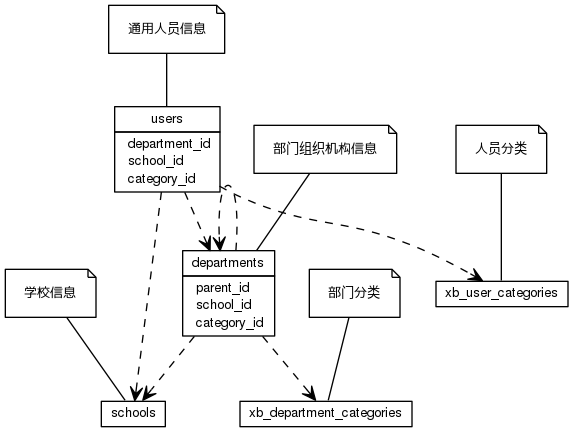


 目  录

* toc
{:toc}

### 关系图 1. 用户和部门
  * 关系图
  

### 表格 departments

  * 表格说明

<table class="table table-bordered table-striped table-condensed">
<tr><th style="background-color:#D0D3FF">表名</th><th style="background-color:#D0D3FF">主键</th><th style="background-color:#D0D3FF">注释</th>  </tr>
<tr><td>departments</td><td>id</td><td>部门组织机构信息</td>  </tr>
</table>

  * 表格中的列

<table class="table table-bordered table-striped table-condensed">
<tr><th style="background-color:#D0D3FF">序号</th><th style="background-color:#D0D3FF">字段名</th><th style="background-color:#D0D3FF">字段类型</th><th style="background-color:#D0D3FF">是否可空</th><th style="background-color:#D0D3FF">描述</th><th style="background-color:#D0D3FF">引用表</th>  </tr>
<tr><td>1</td><td>id</td><td>int4</td><td>否</td><td>非业务主键:auto_increment</td><td></td>  </tr>
<tr><td>2</td><td>code</td><td>varchar</td><td>否</td><td>代码</td><td></td>  </tr>
<tr><td>3</td><td>name</td><td>varchar</td><td>否</td><td>名称</td><td></td>  </tr>
<tr><td>4</td><td>en_name</td><td>varchar</td><td>是</td><td>英文名称</td><td></td>  </tr>
<tr><td>5</td><td>short_name</td><td>varchar</td><td>是</td><td>简称</td><td></td>  </tr>
<tr><td>6</td><td>begin_on</td><td>date</td><td>是</td><td>生效日期</td><td></td>  </tr>
<tr><td>7</td><td>end_on</td><td>date</td><td>是</td><td>失效日期</td><td></td>  </tr>
<tr><td>8</td><td>indexno</td><td>varchar</td><td>否</td><td>索引号</td><td></td>  </tr>
<tr><td>9</td><td>parent_id</td><td>int4</td><td>是</td><td>上级单位 ID</td><td>departments</td>  </tr>
<tr><td>10</td><td>category_id</td><td>int4</td><td>是</td><td>部门分类 ID</td><td>xb_department_categories</td>  </tr>
<tr><td>11</td><td>updated_at</td><td>timestamp</td><td>是</td><td>更新时间</td><td></td>  </tr>
<tr><td>12</td><td>remark</td><td>varchar</td><td>是</td><td>备注</td><td></td>  </tr>
</table>

 
  * 表格的索引

<table class="table table-bordered table-striped table-condensed">
  <tr>
<th style="background-color:#D0D3FF">索引名</th><th style="background-color:#D0D3FF">索引字段</th><th style="background-color:#D0D3FF">是否唯一</th>  </tr>
<tr><td>departments_pkey</td><td>id&nbsp;</td><td>是</td>  </tr>
<tr><td>uk_8ep04hrjh80dr54audhhk2jt3</td><td>indexno&nbsp;</td><td>是</td>  </tr>
<tr><td>uk_l7tivi5261wxdnvo6cct9gg6t</td><td>code&nbsp;</td><td>是</td>  </tr>
</table>

### 表格 users

  * 表格说明

<table class="table table-bordered table-striped table-condensed">
<tr><th style="background-color:#D0D3FF">表名</th><th style="background-color:#D0D3FF">主键</th><th style="background-color:#D0D3FF">注释</th>  </tr>
<tr><td>users</td><td>id</td><td>通用人员信息</td>  </tr>
</table>

  * 表格中的列

<table class="table table-bordered table-striped table-condensed">
<tr><th style="background-color:#D0D3FF">序号</th><th style="background-color:#D0D3FF">字段名</th><th style="background-color:#D0D3FF">字段类型</th><th style="background-color:#D0D3FF">是否可空</th><th style="background-color:#D0D3FF">描述</th><th style="background-color:#D0D3FF">引用表</th>  </tr>
<tr><td>1</td><td>id</td><td>int8</td><td>否</td><td>非业务主键:auto_increment</td><td></td>  </tr>
<tr><td>2</td><td>code</td><td>varchar</td><td>否</td><td>人员帐号</td><td></td>  </tr>
<tr><td>3</td><td>name</td><td>varchar</td><td>否</td><td>姓名</td><td></td>  </tr>
<tr><td>4</td><td>email</td><td>varchar</td><td>否</td><td>邮箱</td><td></td>  </tr>
<tr><td>5</td><td>department_id</td><td>int4</td><td>是</td><td>所在部门 ID</td><td>departments</td>  </tr>
<tr><td>6</td><td>category_id</td><td>int4</td><td>是</td><td>人员分类 ID</td><td>xb_user_categories</td>  </tr>
<tr><td>7</td><td>mobile</td><td>varchar</td><td>是</td><td>电话</td><td></td>  </tr>
<tr><td>8</td><td>updated_at</td><td>timestamp</td><td>是</td><td>更新时间</td><td></td>  </tr>
<tr><td>9</td><td>person_id</td><td>int8</td><td>是</td><td>人员ID</td><td></td>  </tr>
<tr><td>10</td><td>remark</td><td>varchar</td><td>是</td><td>备注</td><td></td>  </tr>
</table>

 
  * 表格的索引

<table class="table table-bordered table-striped table-condensed">
  <tr>
<th style="background-color:#D0D3FF">索引名</th><th style="background-color:#D0D3FF">索引字段</th><th style="background-color:#D0D3FF">是否唯一</th>  </tr>
<tr><td>uk_6dotkott2kjsp8vw4d0m25fb7</td><td>email&nbsp;</td><td>是</td>  </tr>
<tr><td>uk_71vrxovabe8x9tom8xwefi3e7</td><td>code&nbsp;</td><td>是</td>  </tr>
<tr><td>users_pkey</td><td>id&nbsp;</td><td>是</td>  </tr>
</table>
