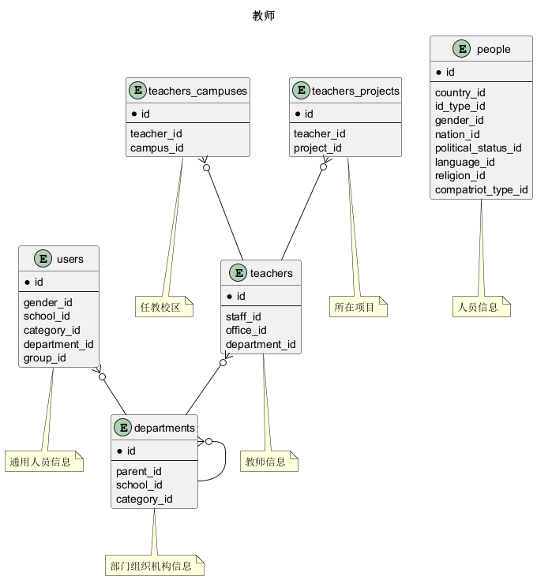
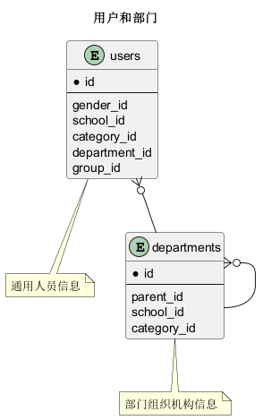

# 基础信息 用户 表结构

## 表格一览

<table class="table-mini">
  <thead>
    <tr>
      <th class="info_header text-center" width="7%">序号</th>
      <th class="info_header" width="43%">表名/描述</th>
      <th class="info_header text-center" width="7%">序号</th>
      <th class="info_header" width="43%">表名/描述</th>
    </tr>
  </thead>
  <tbody>
    <tr>
      <td class="text-center">1</td>
      <td><a href="/model/base/user.html#cadre-assignments">cadre_assignments</a> 领导干部任职信息</td>
      <td class="text-center">13</td>
      <td><a href="/model/base/user.html#staff-titles">staff_titles</a> 职称信息</td>
    </tr>
    <tr>
      <td class="text-center">2</td>
      <td><a href="/model/base/user.html#depart-transitions">depart_transitions</a> 部门变迁记录</td>
      <td class="text-center">14</td>
      <td><a href="/model/base/user.html#staffs">staffs</a> 教职工信息</td>
    </tr>
    <tr>
      <td class="text-center">3</td>
      <td><a href="/model/base/user.html#departments">departments</a> 部门组织机构信息</td>
      <td class="text-center">15</td>
      <td><a href="/model/base/user.html#teachers">teachers</a> 教师信息</td>
    </tr>
    <tr>
      <td class="text-center">4</td>
      <td><a href="/model/base/user.html#departments-campuses">departments_campuses</a> 部门对应校区</td>
      <td class="text-center">16</td>
      <td><a href="/model/base/user.html#teachers-campuses">teachers_campuses</a> 任教校区</td>
    </tr>
    <tr>
      <td class="text-center">5</td>
      <td><a href="/model/base/user.html#mentors">mentors</a> 辅导员</td>
      <td class="text-center">17</td>
      <td><a href="/model/base/user.html#teachers-projects">teachers_projects</a> 所在项目</td>
    </tr>
    <tr>
      <td class="text-center">6</td>
      <td><a href="/model/base/user.html#mentors-projects">mentors_projects</a> 辅导员-项目列表</td>
      <td class="text-center">18</td>
      <td><a href="/model/base/user.html#teaching-offices">teaching_offices</a> 教研室</td>
    </tr>
    <tr>
      <td class="text-center">7</td>
      <td><a href="/model/base/user.html#people">people</a> 人员信息</td>
      <td class="text-center">19</td>
      <td><a href="/model/base/user.html#tutor-journals">tutor_journals</a> 导师遴选记录</td>
    </tr>
    <tr>
      <td class="text-center">8</td>
      <td><a href="/model/base/user.html#presidents">presidents</a> 校长</td>
      <td class="text-center">20</td>
      <td><a href="/model/base/user.html#tutor-majors">tutor_majors</a> 教师研究领域</td>
    </tr>
    <tr>
      <td class="text-center">9</td>
      <td><a href="/model/base/user.html#schools">schools</a> 学校信息</td>
      <td class="text-center">21</td>
      <td><a href="/model/base/user.html#tutor-majors-directions">tutor_majors_directions</a> 教师研究方向</td>
    </tr>
    <tr>
      <td class="text-center">10</td>
      <td><a href="/model/base/user.html#secretaries">secretaries</a> 教学秘书</td>
      <td class="text-center">22</td>
      <td><a href="/model/base/user.html#user-group-members">user_group_members</a> 用户组成员</td>
    </tr>
    <tr>
      <td class="text-center">11</td>
      <td><a href="/model/base/user.html#secretaries-projects">secretaries_projects</a> 教学秘书-项目列表</td>
      <td class="text-center">23</td>
      <td><a href="/model/base/user.html#user-groups">user_groups</a> 用户组</td>
    </tr>
    <tr>
      <td class="text-center">12</td>
      <td><a href="/model/base/user.html#staff-profiles">staff_profiles</a> 教师简介</td>
      <td class="text-center">24</td>
      <td><a href="/model/base/user.html#users">users</a> 通用人员信息</td>
    </tr>
  </tbody>
</table>

## 关键关系图

### 关系图 1. 教师
  * 关系图

### 关系图 2. 用户和部门
  * 关系图

## 表格明细

## cadre_assignments

<table class="table-entity">
  <tbody>
    <tr>
      <td class="table-entity-title" width="15%">表名:&nbsp;</td>
      <td>base.cadre_assignments 领导干部任职信息</td>
    </tr>
    <tr>
      <td class="table-entity-title">唯一约束:&nbsp;</td>
      <td>主键🔑(id) </td>
    </tr>
  </tbody>
</table>

<table class="table-entity">
  <thead>
    <tr>
<th class="info_header text-center" width="7%">序号</th><th class="info_header" width="20%">字段名</th><th class="info_header" width="20%">字段类型</th><th class="info_header text-center" width="8%">是否可空</th><th class="info_header" width="25%">描述</th><th class="info_header" width="20%">引用表</th>    </tr>
  </thead>
  <tbody>
    <tr>
      <td class="text-center">1</td>
      <td>id</td>
      <td>bigint</td>
      <td class="text-center">否</td>
      <td>非业务主键:datetime</td>
      <td>      </td>
    </tr>
    <tr>
      <td class="text-center">2</td>
      <td>begin_on</td>
      <td>date</td>
      <td class="text-center">否</td>
      <td>生效日期</td>
      <td>      </td>
    </tr>
    <tr>
      <td class="text-center">3</td>
      <td>concurrent</td>
      <td>boolean</td>
      <td class="text-center">否</td>
      <td>是否兼职</td>
      <td>      </td>
    </tr>
    <tr>
      <td class="text-center">4</td>
      <td>department_id</td>
      <td>integer</td>
      <td class="text-center">否</td>
      <td>部门组织机构信息ID</td>
      <td><a href="/model/base/user.html#departments">base.departments</a>      </td>
    </tr>
    <tr>
      <td class="text-center">5</td>
      <td>end_on</td>
      <td>date</td>
      <td class="text-center">是</td>
      <td>失效日期</td>
      <td>      </td>
    </tr>
    <tr>
      <td class="text-center">6</td>
      <td>post</td>
      <td>varchar(100)</td>
      <td class="text-center">否</td>
      <td>行政职务</td>
      <td>      </td>
    </tr>
    <tr>
      <td class="text-center">7</td>
      <td>principal</td>
      <td>boolean</td>
      <td class="text-center">否</td>
      <td>是否正职</td>
      <td>      </td>
    </tr>
    <tr>
      <td class="text-center">8</td>
      <td>rank_id</td>
      <td>integer</td>
      <td class="text-center">否</td>
      <td>领导干部职级ID</td>
      <td><a href="/model/code/all.html#cadre-post-ranks">code.cadre_post_ranks</a>      </td>
    </tr>
    <tr>
      <td class="text-center">9</td>
      <td>staff_id</td>
      <td>bigint</td>
      <td class="text-center">否</td>
      <td>教职工信息ID</td>
      <td><a href="/model/base/user.html#staffs">base.staffs</a>      </td>
    </tr>
  </tbody>
</table>

## depart_transitions

<table class="table-entity">
  <tbody>
    <tr>
      <td class="table-entity-title" width="15%">表名:&nbsp;</td>
      <td>base.depart_transitions 部门变迁记录</td>
    </tr>
    <tr>
      <td class="table-entity-title">唯一约束:&nbsp;</td>
      <td>主键🔑(id) </td>
    </tr>
  </tbody>
</table>

<table class="table-entity">
  <thead>
    <tr>
<th class="info_header text-center" width="7%">序号</th><th class="info_header" width="20%">字段名</th><th class="info_header" width="20%">字段类型</th><th class="info_header text-center" width="8%">是否可空</th><th class="info_header" width="25%">描述</th><th class="info_header" width="20%">引用表</th>    </tr>
  </thead>
  <tbody>
    <tr>
      <td class="text-center">1</td>
      <td>id</td>
      <td>bigint</td>
      <td class="text-center">否</td>
      <td>非业务主键:datetime</td>
      <td>      </td>
    </tr>
    <tr>
      <td class="text-center">2</td>
      <td>effective_on</td>
      <td>date</td>
      <td class="text-center">否</td>
      <td>生效日期</td>
      <td>      </td>
    </tr>
    <tr>
      <td class="text-center">3</td>
      <td>from_id</td>
      <td>integer</td>
      <td class="text-center">否</td>
      <td>原部门ID</td>
      <td><a href="/model/base/user.html#departments">base.departments</a>      </td>
    </tr>
    <tr>
      <td class="text-center">4</td>
      <td>remark</td>
      <td>varchar(100)</td>
      <td class="text-center">是</td>
      <td>备注</td>
      <td>      </td>
    </tr>
    <tr>
      <td class="text-center">5</td>
      <td>to_id</td>
      <td>integer</td>
      <td class="text-center">否</td>
      <td>变更后部门ID</td>
      <td><a href="/model/base/user.html#departments">base.departments</a>      </td>
    </tr>
    <tr>
      <td class="text-center">6</td>
      <td>updated_at</td>
      <td>timestamptz</td>
      <td class="text-center">否</td>
      <td>更新时间</td>
      <td>      </td>
    </tr>
  </tbody>
</table>

## departments

<table class="table-entity">
  <tbody>
    <tr>
      <td class="table-entity-title" width="15%">表名:&nbsp;</td>
      <td>base.departments 部门组织机构信息</td>
    </tr>
    <tr>
      <td class="table-entity-title">唯一约束:&nbsp;</td>
      <td>主键🔑(id) uk_blem78dvbmeuekoy0jg6px6j7(school_id,code)</td>
    </tr>
    <tr>
      <td class="table-entity-title">索引:&nbsp;</td>
      <td>idx_lloboi12ir2a1q541ntsr7kao(parent_id) </td>
    </tr>
  </tbody>
</table>

<table class="table-entity">
  <thead>
    <tr>
<th class="info_header text-center" width="7%">序号</th><th class="info_header" width="20%">字段名</th><th class="info_header" width="20%">字段类型</th><th class="info_header text-center" width="8%">是否可空</th><th class="info_header" width="25%">描述</th><th class="info_header" width="20%">引用表</th>    </tr>
  </thead>
  <tbody>
    <tr>
      <td class="text-center">1</td>
      <td>id</td>
      <td>integer</td>
      <td class="text-center">否</td>
      <td>非业务主键:auto_increment</td>
      <td>      </td>
    </tr>
    <tr>
      <td class="text-center">2</td>
      <td>begin_on</td>
      <td>date</td>
      <td class="text-center">否</td>
      <td>生效日期</td>
      <td>      </td>
    </tr>
    <tr>
      <td class="text-center">3</td>
      <td>category_id</td>
      <td>integer</td>
      <td class="text-center">是</td>
      <td>部门分类ID</td>
      <td><a href="/model/code/all.html#department-categories">code.department_categories</a>      </td>
    </tr>
    <tr>
      <td class="text-center">4</td>
      <td>code</td>
      <td>varchar(10)</td>
      <td class="text-center">否</td>
      <td>代码</td>
      <td>      </td>
    </tr>
    <tr>
      <td class="text-center">5</td>
      <td>en_name</td>
      <td>varchar(100)</td>
      <td class="text-center">是</td>
      <td>英文名称</td>
      <td>      </td>
    </tr>
    <tr>
      <td class="text-center">6</td>
      <td>end_on</td>
      <td>date</td>
      <td class="text-center">是</td>
      <td>失效日期</td>
      <td>      </td>
    </tr>
    <tr>
      <td class="text-center">7</td>
      <td>indexno</td>
      <td>varchar(20)</td>
      <td class="text-center">否</td>
      <td>顺序号</td>
      <td>      </td>
    </tr>
    <tr>
      <td class="text-center">8</td>
      <td>name</td>
      <td>varchar(80)</td>
      <td class="text-center">否</td>
      <td>名称</td>
      <td>      </td>
    </tr>
    <tr>
      <td class="text-center">9</td>
      <td>parent_id</td>
      <td>integer</td>
      <td class="text-center">是</td>
      <td>上级单位ID</td>
      <td><a href="/model/base/user.html#departments">base.departments</a>      </td>
    </tr>
    <tr>
      <td class="text-center">10</td>
      <td>remark</td>
      <td>varchar(200)</td>
      <td class="text-center">是</td>
      <td>备注</td>
      <td>      </td>
    </tr>
    <tr>
      <td class="text-center">11</td>
      <td>research</td>
      <td>boolean</td>
      <td class="text-center">否</td>
      <td>是否科研部门</td>
      <td>      </td>
    </tr>
    <tr>
      <td class="text-center">12</td>
      <td>school_id</td>
      <td>integer</td>
      <td class="text-center">否</td>
      <td>学校ID</td>
      <td><a href="/model/base/user.html#schools">base.schools</a>      </td>
    </tr>
    <tr>
      <td class="text-center">13</td>
      <td>short_name</td>
      <td>varchar(100)</td>
      <td class="text-center">是</td>
      <td>简称</td>
      <td>      </td>
    </tr>
    <tr>
      <td class="text-center">14</td>
      <td>teaching</td>
      <td>boolean</td>
      <td class="text-center">否</td>
      <td>是否教学部门</td>
      <td>      </td>
    </tr>
    <tr>
      <td class="text-center">15</td>
      <td>updated_at</td>
      <td>timestamptz</td>
      <td class="text-center">否</td>
      <td>更新时间</td>
      <td>      </td>
    </tr>
  </tbody>
</table>

## departments_campuses

<table class="table-entity">
  <tbody>
    <tr>
      <td class="table-entity-title" width="15%">表名:&nbsp;</td>
      <td>base.departments_campuses 部门对应校区</td>
    </tr>
    <tr>
      <td class="table-entity-title">唯一约束:&nbsp;</td>
      <td>主键🔑(department_id,campus_id) </td>
    </tr>
    <tr>
      <td class="table-entity-title">索引:&nbsp;</td>
      <td>idx_4tia0kw51tgg3ruidjnm1q02k(department_id) </td>
    </tr>
  </tbody>
</table>

<table class="table-entity">
  <thead>
    <tr>
<th class="info_header text-center" width="7%">序号</th><th class="info_header" width="20%">字段名</th><th class="info_header" width="20%">字段类型</th><th class="info_header text-center" width="8%">是否可空</th><th class="info_header" width="25%">描述</th><th class="info_header" width="20%">引用表</th>    </tr>
  </thead>
  <tbody>
    <tr>
      <td class="text-center">1</td>
      <td>campus_id</td>
      <td>integer</td>
      <td class="text-center">否</td>
      <td>校区信息ID</td>
      <td><a href="/model/base/resources.html#campuses">base.campuses</a>      </td>
    </tr>
    <tr>
      <td class="text-center">2</td>
      <td>department_id</td>
      <td>integer</td>
      <td class="text-center">否</td>
      <td>部门组织机构信息ID</td>
      <td><a href="/model/base/user.html#departments">base.departments</a>      </td>
    </tr>
  </tbody>
</table>

## mentors

<table class="table-entity">
  <tbody>
    <tr>
      <td class="table-entity-title" width="15%">表名:&nbsp;</td>
      <td>base.mentors 辅导员</td>
    </tr>
    <tr>
      <td class="table-entity-title">唯一约束:&nbsp;</td>
      <td>主键🔑(id) uk_4n9545nrhwav5b96nw9k2di1t(staff_id)</td>
    </tr>
  </tbody>
</table>

<table class="table-entity">
  <thead>
    <tr>
<th class="info_header text-center" width="7%">序号</th><th class="info_header" width="20%">字段名</th><th class="info_header" width="20%">字段类型</th><th class="info_header text-center" width="8%">是否可空</th><th class="info_header" width="25%">描述</th><th class="info_header" width="20%">引用表</th>    </tr>
  </thead>
  <tbody>
    <tr>
      <td class="text-center">1</td>
      <td>id</td>
      <td>bigint</td>
      <td class="text-center">否</td>
      <td>非业务主键:assigned</td>
      <td>      </td>
    </tr>
    <tr>
      <td class="text-center">2</td>
      <td>begin_on</td>
      <td>date</td>
      <td class="text-center">否</td>
      <td>生效日期</td>
      <td>      </td>
    </tr>
    <tr>
      <td class="text-center">3</td>
      <td>end_on</td>
      <td>date</td>
      <td class="text-center">是</td>
      <td>失效日期</td>
      <td>      </td>
    </tr>
    <tr>
      <td class="text-center">4</td>
      <td>name</td>
      <td>varchar(255)</td>
      <td class="text-center">否</td>
      <td>名称</td>
      <td>      </td>
    </tr>
    <tr>
      <td class="text-center">5</td>
      <td>staff_id</td>
      <td>bigint</td>
      <td class="text-center">否</td>
      <td>教职工信息ID</td>
      <td><a href="/model/base/user.html#staffs">base.staffs</a>      </td>
    </tr>
  </tbody>
</table>

## mentors_projects

<table class="table-entity">
  <tbody>
    <tr>
      <td class="table-entity-title" width="15%">表名:&nbsp;</td>
      <td>base.mentors_projects 辅导员-项目列表</td>
    </tr>
    <tr>
      <td class="table-entity-title">唯一约束:&nbsp;</td>
      <td>主键🔑(mentor_id,project_id) </td>
    </tr>
    <tr>
      <td class="table-entity-title">索引:&nbsp;</td>
      <td>idx_ppbhk85s88rolvwv4tm8d2kmv(mentor_id) </td>
    </tr>
  </tbody>
</table>

<table class="table-entity">
  <thead>
    <tr>
<th class="info_header text-center" width="7%">序号</th><th class="info_header" width="20%">字段名</th><th class="info_header" width="20%">字段类型</th><th class="info_header text-center" width="8%">是否可空</th><th class="info_header" width="25%">描述</th><th class="info_header" width="20%">引用表</th>    </tr>
  </thead>
  <tbody>
    <tr>
      <td class="text-center">1</td>
      <td>mentor_id</td>
      <td>bigint</td>
      <td class="text-center">否</td>
      <td>辅导员ID</td>
      <td><a href="/model/base/user.html#mentors">base.mentors</a>      </td>
    </tr>
    <tr>
      <td class="text-center">2</td>
      <td>project_id</td>
      <td>integer</td>
      <td class="text-center">否</td>
      <td>项目ID</td>
      <td><a href="/model/base/edu.html#projects">base.projects</a>      </td>
    </tr>
  </tbody>
</table>

## people

<table class="table-entity">
  <tbody>
    <tr>
      <td class="table-entity-title" width="15%">表名:&nbsp;</td>
      <td>base.people 人员信息</td>
    </tr>
    <tr>
      <td class="table-entity-title">唯一约束:&nbsp;</td>
      <td>主键🔑(id) </td>
    </tr>
    <tr>
      <td class="table-entity-title">索引:&nbsp;</td>
      <td>idx_ajflqx9dbuh26q7nfapkr0rkh(code) </td>
    </tr>
  </tbody>
</table>

<table class="table-entity">
  <thead>
    <tr>
<th class="info_header text-center" width="7%">序号</th><th class="info_header" width="20%">字段名</th><th class="info_header" width="20%">字段类型</th><th class="info_header text-center" width="8%">是否可空</th><th class="info_header" width="25%">描述</th><th class="info_header" width="20%">引用表</th>    </tr>
  </thead>
  <tbody>
    <tr>
      <td class="text-center">1</td>
      <td>id</td>
      <td>bigint</td>
      <td class="text-center">否</td>
      <td>非业务主键:datetime</td>
      <td>      </td>
    </tr>
    <tr>
      <td class="text-center">2</td>
      <td>birthday</td>
      <td>date</td>
      <td class="text-center">是</td>
      <td>出生日期</td>
      <td>      </td>
    </tr>
    <tr>
      <td class="text-center">3</td>
      <td>birthplace</td>
      <td>varchar(255)</td>
      <td class="text-center">是</td>
      <td>出生地</td>
      <td>      </td>
    </tr>
    <tr>
      <td class="text-center">4</td>
      <td>code</td>
      <td>varchar(30)</td>
      <td class="text-center">否</td>
      <td>证件号码</td>
      <td>      </td>
    </tr>
    <tr>
      <td class="text-center">5</td>
      <td>compatriot_type_id</td>
      <td>integer</td>
      <td class="text-center">是</td>
      <td>港澳台侨ID</td>
      <td><a href="/model/code/all.html#compatriot-types">code.compatriot_types</a>      </td>
    </tr>
    <tr>
      <td class="text-center">6</td>
      <td>country_id</td>
      <td>integer</td>
      <td class="text-center">是</td>
      <td>国籍/地区ID</td>
      <td><a href="/model/code/all.html#countries">code.countries</a>      </td>
    </tr>
    <tr>
      <td class="text-center">7</td>
      <td>former_name</td>
      <td>varchar(100)</td>
      <td class="text-center">是</td>
      <td>曾用名</td>
      <td>      </td>
    </tr>
    <tr>
      <td class="text-center">8</td>
      <td>gender_id</td>
      <td>integer</td>
      <td class="text-center">否</td>
      <td>性别ID</td>
      <td><a href="/model/code/all.html#genders">code.genders</a>      </td>
    </tr>
    <tr>
      <td class="text-center">9</td>
      <td>home_town</td>
      <td>varchar(255)</td>
      <td class="text-center">是</td>
      <td>籍贯</td>
      <td>      </td>
    </tr>
    <tr>
      <td class="text-center">10</td>
      <td>id_type_id</td>
      <td>integer</td>
      <td class="text-center">否</td>
      <td>身份证件类型ID</td>
      <td><a href="/model/code/all.html#id-types">code.id_types</a>      </td>
    </tr>
    <tr>
      <td class="text-center">11</td>
      <td>language_id</td>
      <td>integer</td>
      <td class="text-center">是</td>
      <td>首要使用语言ID</td>
      <td><a href="/model/code/all.html#languages">code.languages</a>      </td>
    </tr>
    <tr>
      <td class="text-center">12</td>
      <td>name</td>
      <td>varchar(100)</td>
      <td class="text-center">否</td>
      <td>姓名</td>
      <td>      </td>
    </tr>
    <tr>
      <td class="text-center">13</td>
      <td>nation_id</td>
      <td>integer</td>
      <td class="text-center">是</td>
      <td>民族ID</td>
      <td><a href="/model/code/all.html#nations">code.nations</a>      </td>
    </tr>
    <tr>
      <td class="text-center">14</td>
      <td>phonetic_name</td>
      <td>varchar(100)</td>
      <td class="text-center">是</td>
      <td>姓名拼音</td>
      <td>      </td>
    </tr>
    <tr>
      <td class="text-center">15</td>
      <td>political_status_id</td>
      <td>integer</td>
      <td class="text-center">是</td>
      <td>政治面貌ID</td>
      <td><a href="/model/code/all.html#political-statuses">code.political_statuses</a>      </td>
    </tr>
    <tr>
      <td class="text-center">16</td>
      <td>religion_id</td>
      <td>integer</td>
      <td class="text-center">是</td>
      <td>宗教信仰ID</td>
      <td><a href="/model/code/all.html#religions">code.religions</a>      </td>
    </tr>
    <tr>
      <td class="text-center">17</td>
      <td>updated_at</td>
      <td>timestamptz</td>
      <td class="text-center">否</td>
      <td>更新时间</td>
      <td>      </td>
    </tr>
  </tbody>
</table>

## presidents

<table class="table-entity">
  <tbody>
    <tr>
      <td class="table-entity-title" width="15%">表名:&nbsp;</td>
      <td>base.presidents 校长</td>
    </tr>
    <tr>
      <td class="table-entity-title">唯一约束:&nbsp;</td>
      <td>主键🔑(id) </td>
    </tr>
  </tbody>
</table>

<table class="table-entity">
  <thead>
    <tr>
<th class="info_header text-center" width="7%">序号</th><th class="info_header" width="20%">字段名</th><th class="info_header" width="20%">字段类型</th><th class="info_header text-center" width="8%">是否可空</th><th class="info_header" width="25%">描述</th><th class="info_header" width="20%">引用表</th>    </tr>
  </thead>
  <tbody>
    <tr>
      <td class="text-center">1</td>
      <td>id</td>
      <td>bigint</td>
      <td class="text-center">否</td>
      <td>非业务主键:datetime</td>
      <td>      </td>
    </tr>
    <tr>
      <td class="text-center">2</td>
      <td>begin_on</td>
      <td>date</td>
      <td class="text-center">否</td>
      <td>生效日期</td>
      <td>      </td>
    </tr>
    <tr>
      <td class="text-center">3</td>
      <td>en_name</td>
      <td>varchar(100)</td>
      <td class="text-center">否</td>
      <td>英文名</td>
      <td>      </td>
    </tr>
    <tr>
      <td class="text-center">4</td>
      <td>end_on</td>
      <td>date</td>
      <td class="text-center">是</td>
      <td>失效日期</td>
      <td>      </td>
    </tr>
    <tr>
      <td class="text-center">5</td>
      <td>name</td>
      <td>varchar(50)</td>
      <td class="text-center">否</td>
      <td>名称</td>
      <td>      </td>
    </tr>
    <tr>
      <td class="text-center">6</td>
      <td>school_id</td>
      <td>integer</td>
      <td class="text-center">否</td>
      <td>学校信息ID</td>
      <td><a href="/model/base/user.html#schools">base.schools</a>      </td>
    </tr>
  </tbody>
</table>

## schools

<table class="table-entity">
  <tbody>
    <tr>
      <td class="table-entity-title" width="15%">表名:&nbsp;</td>
      <td>base.schools 学校信息</td>
    </tr>
    <tr>
      <td class="table-entity-title">唯一约束:&nbsp;</td>
      <td>主键🔑(id) uk_m5x8j64nhdcprk9ghc6622swx(code)</td>
    </tr>
  </tbody>
</table>

<table class="table-entity">
  <thead>
    <tr>
<th class="info_header text-center" width="7%">序号</th><th class="info_header" width="20%">字段名</th><th class="info_header" width="20%">字段类型</th><th class="info_header text-center" width="8%">是否可空</th><th class="info_header" width="25%">描述</th><th class="info_header" width="20%">引用表</th>    </tr>
  </thead>
  <tbody>
    <tr>
      <td class="text-center">1</td>
      <td>id</td>
      <td>integer</td>
      <td class="text-center">否</td>
      <td>非业务主键:auto_increment</td>
      <td>      </td>
    </tr>
    <tr>
      <td class="text-center">2</td>
      <td>begin_on</td>
      <td>date</td>
      <td class="text-center">否</td>
      <td>生效日期</td>
      <td>      </td>
    </tr>
    <tr>
      <td class="text-center">3</td>
      <td>category_id</td>
      <td>integer</td>
      <td class="text-center">否</td>
      <td>高校性质类别ID</td>
      <td><a href="/model/code/all.html#institution-categories">code.institution_categories</a>      </td>
    </tr>
    <tr>
      <td class="text-center">4</td>
      <td>code</td>
      <td>varchar(10)</td>
      <td class="text-center">否</td>
      <td>代码</td>
      <td>      </td>
    </tr>
    <tr>
      <td class="text-center">5</td>
      <td>division_id</td>
      <td>integer</td>
      <td class="text-center">否</td>
      <td>省份ID</td>
      <td><a href="/model/code/all.html#divisions">code.divisions</a>      </td>
    </tr>
    <tr>
      <td class="text-center">6</td>
      <td>en_name</td>
      <td>varchar(255)</td>
      <td class="text-center">是</td>
      <td>英文名</td>
      <td>      </td>
    </tr>
    <tr>
      <td class="text-center">7</td>
      <td>end_on</td>
      <td>date</td>
      <td class="text-center">是</td>
      <td>失效日期</td>
      <td>      </td>
    </tr>
    <tr>
      <td class="text-center">8</td>
      <td>identifier</td>
      <td>varchar(10)</td>
      <td class="text-center">是</td>
      <td>标识码(10位)</td>
      <td>      </td>
    </tr>
    <tr>
      <td class="text-center">9</td>
      <td>institution_id</td>
      <td>integer</td>
      <td class="text-center">否</td>
      <td>研究机构ID</td>
      <td><a href="/model/code/all.html#institutions">code.institutions</a>      </td>
    </tr>
    <tr>
      <td class="text-center">10</td>
      <td>logo_url</td>
      <td>varchar(255)</td>
      <td class="text-center">否</td>
      <td>Logo URL</td>
      <td>      </td>
    </tr>
    <tr>
      <td class="text-center">11</td>
      <td>name</td>
      <td>varchar(50)</td>
      <td class="text-center">否</td>
      <td>名称</td>
      <td>      </td>
    </tr>
    <tr>
      <td class="text-center">12</td>
      <td>short_name</td>
      <td>varchar(255)</td>
      <td class="text-center">是</td>
      <td>简称</td>
      <td>      </td>
    </tr>
    <tr>
      <td class="text-center">13</td>
      <td>superior_org</td>
      <td>varchar(50)</td>
      <td class="text-center">是</td>
      <td>主管部门</td>
      <td>      </td>
    </tr>
    <tr>
      <td class="text-center">14</td>
      <td>uscc</td>
      <td>varchar(18)</td>
      <td class="text-center">是</td>
      <td>统一信用代码</td>
      <td>      </td>
    </tr>
  </tbody>
</table>

## secretaries

<table class="table-entity">
  <tbody>
    <tr>
      <td class="table-entity-title" width="15%">表名:&nbsp;</td>
      <td>base.secretaries 教学秘书</td>
    </tr>
    <tr>
      <td class="table-entity-title">唯一约束:&nbsp;</td>
      <td>主键🔑(id) </td>
    </tr>
  </tbody>
</table>

<table class="table-entity">
  <thead>
    <tr>
<th class="info_header text-center" width="7%">序号</th><th class="info_header" width="20%">字段名</th><th class="info_header" width="20%">字段类型</th><th class="info_header text-center" width="8%">是否可空</th><th class="info_header" width="25%">描述</th><th class="info_header" width="20%">引用表</th>    </tr>
  </thead>
  <tbody>
    <tr>
      <td class="text-center">1</td>
      <td>id</td>
      <td>bigint</td>
      <td class="text-center">否</td>
      <td>非业务主键:datetime</td>
      <td>      </td>
    </tr>
    <tr>
      <td class="text-center">2</td>
      <td>begin_on</td>
      <td>date</td>
      <td class="text-center">否</td>
      <td>生效日期</td>
      <td>      </td>
    </tr>
    <tr>
      <td class="text-center">3</td>
      <td>end_on</td>
      <td>date</td>
      <td class="text-center">是</td>
      <td>失效日期</td>
      <td>      </td>
    </tr>
    <tr>
      <td class="text-center">4</td>
      <td>office_addr</td>
      <td>varchar(100)</td>
      <td class="text-center">是</td>
      <td>办公室地址</td>
      <td>      </td>
    </tr>
    <tr>
      <td class="text-center">5</td>
      <td>office_email</td>
      <td>varchar(100)</td>
      <td class="text-center">是</td>
      <td>办公邮件</td>
      <td>      </td>
    </tr>
    <tr>
      <td class="text-center">6</td>
      <td>office_phone</td>
      <td>varchar(50)</td>
      <td class="text-center">是</td>
      <td>办公电话</td>
      <td>      </td>
    </tr>
    <tr>
      <td class="text-center">7</td>
      <td>staff_id</td>
      <td>bigint</td>
      <td class="text-center">否</td>
      <td>教职工信息ID</td>
      <td><a href="/model/base/user.html#staffs">base.staffs</a>      </td>
    </tr>
  </tbody>
</table>

## secretaries_projects

<table class="table-entity">
  <tbody>
    <tr>
      <td class="table-entity-title" width="15%">表名:&nbsp;</td>
      <td>base.secretaries_projects 教学秘书-项目列表</td>
    </tr>
    <tr>
      <td class="table-entity-title">唯一约束:&nbsp;</td>
      <td>主键🔑(secretary_id,project_id) </td>
    </tr>
    <tr>
      <td class="table-entity-title">索引:&nbsp;</td>
      <td>idx_4751fgfwuvlgoag1als5q4hm2(secretary_id) </td>
    </tr>
  </tbody>
</table>

<table class="table-entity">
  <thead>
    <tr>
<th class="info_header text-center" width="7%">序号</th><th class="info_header" width="20%">字段名</th><th class="info_header" width="20%">字段类型</th><th class="info_header text-center" width="8%">是否可空</th><th class="info_header" width="25%">描述</th><th class="info_header" width="20%">引用表</th>    </tr>
  </thead>
  <tbody>
    <tr>
      <td class="text-center">1</td>
      <td>project_id</td>
      <td>integer</td>
      <td class="text-center">否</td>
      <td>项目ID</td>
      <td><a href="/model/base/edu.html#projects">base.projects</a>      </td>
    </tr>
    <tr>
      <td class="text-center">2</td>
      <td>secretary_id</td>
      <td>bigint</td>
      <td class="text-center">否</td>
      <td>教学秘书ID</td>
      <td><a href="/model/base/user.html#secretaries">base.secretaries</a>      </td>
    </tr>
  </tbody>
</table>

## staff_profiles

<table class="table-entity">
  <tbody>
    <tr>
      <td class="table-entity-title" width="15%">表名:&nbsp;</td>
      <td>base.staff_profiles 教师简介</td>
    </tr>
    <tr>
      <td class="table-entity-title">唯一约束:&nbsp;</td>
      <td>主键🔑(id) uk_ocmcnctnhlbe30lj7wwi7c4ks(staff_id)</td>
    </tr>
  </tbody>
</table>

<table class="table-entity">
  <thead>
    <tr>
<th class="info_header text-center" width="7%">序号</th><th class="info_header" width="20%">字段名</th><th class="info_header" width="20%">字段类型</th><th class="info_header text-center" width="8%">是否可空</th><th class="info_header" width="25%">描述</th><th class="info_header" width="20%">引用表</th>    </tr>
  </thead>
  <tbody>
    <tr>
      <td class="text-center">1</td>
      <td>id</td>
      <td>bigint</td>
      <td class="text-center">否</td>
      <td>非业务主键:datetime</td>
      <td>      </td>
    </tr>
    <tr>
      <td class="text-center">2</td>
      <td>awards</td>
      <td>varchar(1000)</td>
      <td class="text-center">是</td>
      <td>荣誉和获奖</td>
      <td>      </td>
    </tr>
    <tr>
      <td class="text-center">3</td>
      <td>career</td>
      <td>varchar(4000)</td>
      <td class="text-center">是</td>
      <td>教学工作经历</td>
      <td>      </td>
    </tr>
    <tr>
      <td class="text-center">4</td>
      <td>contact</td>
      <td>varchar(255)</td>
      <td class="text-center">是</td>
      <td>联系方式</td>
      <td>      </td>
    </tr>
    <tr>
      <td class="text-center">5</td>
      <td>courses</td>
      <td>varchar(1000)</td>
      <td class="text-center">是</td>
      <td>教授课程</td>
      <td>      </td>
    </tr>
    <tr>
      <td class="text-center">6</td>
      <td>harvest</td>
      <td>text</td>
      <td class="text-center">是</td>
      <td>科研成果</td>
      <td>      </td>
    </tr>
    <tr>
      <td class="text-center">7</td>
      <td>intro</td>
      <td>text</td>
      <td class="text-center">否</td>
      <td>简介</td>
      <td>      </td>
    </tr>
    <tr>
      <td class="text-center">8</td>
      <td>projects</td>
      <td>varchar(1000)</td>
      <td class="text-center">是</td>
      <td>研究项目</td>
      <td>      </td>
    </tr>
    <tr>
      <td class="text-center">9</td>
      <td>research</td>
      <td>varchar(255)</td>
      <td class="text-center">是</td>
      <td>研究方向</td>
      <td>      </td>
    </tr>
    <tr>
      <td class="text-center">10</td>
      <td>staff_id</td>
      <td>bigint</td>
      <td class="text-center">否</td>
      <td>教职工信息ID</td>
      <td><a href="/model/base/user.html#staffs">base.staffs</a>      </td>
    </tr>
    <tr>
      <td class="text-center">11</td>
      <td>titles</td>
      <td>varchar(1000)</td>
      <td class="text-center">是</td>
      <td>学术兼职</td>
      <td>      </td>
    </tr>
    <tr>
      <td class="text-center">12</td>
      <td>updated_at</td>
      <td>timestamptz</td>
      <td class="text-center">否</td>
      <td>更新时间</td>
      <td>      </td>
    </tr>
  </tbody>
</table>

## staff_titles

<table class="table-entity">
  <tbody>
    <tr>
      <td class="table-entity-title" width="15%">表名:&nbsp;</td>
      <td>base.staff_titles 职称信息</td>
    </tr>
    <tr>
      <td class="table-entity-title">唯一约束:&nbsp;</td>
      <td>主键🔑(id) </td>
    </tr>
  </tbody>
</table>

<table class="table-entity">
  <thead>
    <tr>
<th class="info_header text-center" width="7%">序号</th><th class="info_header" width="20%">字段名</th><th class="info_header" width="20%">字段类型</th><th class="info_header text-center" width="8%">是否可空</th><th class="info_header" width="25%">描述</th><th class="info_header" width="20%">引用表</th>    </tr>
  </thead>
  <tbody>
    <tr>
      <td class="text-center">1</td>
      <td>id</td>
      <td>bigint</td>
      <td class="text-center">否</td>
      <td>非业务主键:datetime</td>
      <td>      </td>
    </tr>
    <tr>
      <td class="text-center">2</td>
      <td>begin_on</td>
      <td>date</td>
      <td class="text-center">否</td>
      <td>生效日期</td>
      <td>      </td>
    </tr>
    <tr>
      <td class="text-center">3</td>
      <td>end_on</td>
      <td>date</td>
      <td class="text-center">是</td>
      <td>失效日期</td>
      <td>      </td>
    </tr>
    <tr>
      <td class="text-center">4</td>
      <td>staff_id</td>
      <td>bigint</td>
      <td class="text-center">否</td>
      <td>教职工ID</td>
      <td><a href="/model/base/user.html#staffs">base.staffs</a>      </td>
    </tr>
    <tr>
      <td class="text-center">5</td>
      <td>title_id</td>
      <td>integer</td>
      <td class="text-center">否</td>
      <td>职称ID</td>
      <td><a href="/model/code/all.html#professional-titles">code.professional_titles</a>      </td>
    </tr>
  </tbody>
</table>

## staffs

<table class="table-entity">
  <tbody>
    <tr>
      <td class="table-entity-title" width="15%">表名:&nbsp;</td>
      <td>base.staffs 教职工信息</td>
    </tr>
    <tr>
      <td class="table-entity-title">唯一约束:&nbsp;</td>
      <td>主键🔑(id) uk_ksaq070k32jb6aey065dd9xv0(school_id,code)</td>
    </tr>
  </tbody>
</table>

<table class="table-entity">
  <thead>
    <tr>
<th class="info_header text-center" width="7%">序号</th><th class="info_header" width="20%">字段名</th><th class="info_header" width="20%">字段类型</th><th class="info_header text-center" width="8%">是否可空</th><th class="info_header" width="25%">描述</th><th class="info_header" width="20%">引用表</th>    </tr>
  </thead>
  <tbody>
    <tr>
      <td class="text-center">1</td>
      <td>id</td>
      <td>bigint</td>
      <td class="text-center">否</td>
      <td>非业务主键:datetime</td>
      <td>      </td>
    </tr>
    <tr>
      <td class="text-center">2</td>
      <td>begin_on</td>
      <td>date</td>
      <td class="text-center">否</td>
      <td>生效日期</td>
      <td>      </td>
    </tr>
    <tr>
      <td class="text-center">3</td>
      <td>birthday</td>
      <td>date</td>
      <td class="text-center">是</td>
      <td>出生日期</td>
      <td>      </td>
    </tr>
    <tr>
      <td class="text-center">4</td>
      <td>code</td>
      <td>varchar(20)</td>
      <td class="text-center">否</td>
      <td>代码</td>
      <td>      </td>
    </tr>
    <tr>
      <td class="text-center">5</td>
      <td>degree_award_by</td>
      <td>varchar(255)</td>
      <td class="text-center">是</td>
      <td>最高学位授予单位</td>
      <td>      </td>
    </tr>
    <tr>
      <td class="text-center">6</td>
      <td>degree_id</td>
      <td>integer</td>
      <td class="text-center">是</td>
      <td>学位ID</td>
      <td><a href="/model/code/all.html#degrees">code.degrees</a>      </td>
    </tr>
    <tr>
      <td class="text-center">7</td>
      <td>degree_level_id</td>
      <td>integer</td>
      <td class="text-center">是</td>
      <td>最高学位ID</td>
      <td><a href="/model/code/all.html#degree-levels">code.degree_levels</a>      </td>
    </tr>
    <tr>
      <td class="text-center">8</td>
      <td>department_id</td>
      <td>integer</td>
      <td class="text-center">否</td>
      <td>部门组织机构信息ID</td>
      <td><a href="/model/base/user.html#departments">base.departments</a>      </td>
    </tr>
    <tr>
      <td class="text-center">9</td>
      <td>education_degree_id</td>
      <td>integer</td>
      <td class="text-center">是</td>
      <td>最高学历ID</td>
      <td><a href="/model/code/all.html#education-degrees">code.education_degrees</a>      </td>
    </tr>
    <tr>
      <td class="text-center">10</td>
      <td>email</td>
      <td>varchar(100)</td>
      <td class="text-center">是</td>
      <td>电子邮件</td>
      <td>      </td>
    </tr>
    <tr>
      <td class="text-center">11</td>
      <td>en_name</td>
      <td>varchar(255)</td>
      <td class="text-center">是</td>
      <td>英文名</td>
      <td>      </td>
    </tr>
    <tr>
      <td class="text-center">12</td>
      <td>end_on</td>
      <td>date</td>
      <td class="text-center">是</td>
      <td>失效日期</td>
      <td>      </td>
    </tr>
    <tr>
      <td class="text-center">13</td>
      <td>external_</td>
      <td>boolean</td>
      <td class="text-center">否</td>
      <td>是否外聘</td>
      <td>      </td>
    </tr>
    <tr>
      <td class="text-center">14</td>
      <td>formal_hr</td>
      <td>boolean</td>
      <td class="text-center">否</td>
      <td>是否在编</td>
      <td>      </td>
    </tr>
    <tr>
      <td class="text-center">15</td>
      <td>gender_id</td>
      <td>integer</td>
      <td class="text-center">否</td>
      <td>性别ID</td>
      <td><a href="/model/code/all.html#genders">code.genders</a>      </td>
    </tr>
    <tr>
      <td class="text-center">16</td>
      <td>homepage</td>
      <td>varchar(200)</td>
      <td class="text-center">是</td>
      <td>个人主页</td>
      <td>      </td>
    </tr>
    <tr>
      <td class="text-center">17</td>
      <td>id_number</td>
      <td>varchar(20)</td>
      <td class="text-center">是</td>
      <td>证件号码</td>
      <td>      </td>
    </tr>
    <tr>
      <td class="text-center">18</td>
      <td>id_type_id</td>
      <td>integer</td>
      <td class="text-center">是</td>
      <td>证件类型ID</td>
      <td><a href="/model/code/all.html#id-types">code.id_types</a>      </td>
    </tr>
    <tr>
      <td class="text-center">19</td>
      <td>mobile</td>
      <td>varchar(20)</td>
      <td class="text-center">是</td>
      <td>联系手机</td>
      <td>      </td>
    </tr>
    <tr>
      <td class="text-center">20</td>
      <td>name</td>
      <td>varchar(100)</td>
      <td class="text-center">否</td>
      <td>名称</td>
      <td>      </td>
    </tr>
    <tr>
      <td class="text-center">21</td>
      <td>nation_id</td>
      <td>integer</td>
      <td class="text-center">是</td>
      <td>民族ID</td>
      <td><a href="/model/code/all.html#nations">code.nations</a>      </td>
    </tr>
    <tr>
      <td class="text-center">22</td>
      <td>organization</td>
      <td>varchar(200)</td>
      <td class="text-center">是</td>
      <td>全职工作单位</td>
      <td>      </td>
    </tr>
    <tr>
      <td class="text-center">23</td>
      <td>parttime</td>
      <td>boolean</td>
      <td class="text-center">否</td>
      <td>是否兼职</td>
      <td>      </td>
    </tr>
    <tr>
      <td class="text-center">24</td>
      <td>political_status_id</td>
      <td>integer</td>
      <td class="text-center">是</td>
      <td>政治面貌ID</td>
      <td><a href="/model/code/all.html#political-statuses">code.political_statuses</a>      </td>
    </tr>
    <tr>
      <td class="text-center">25</td>
      <td>school_id</td>
      <td>integer</td>
      <td class="text-center">否</td>
      <td>学校信息ID</td>
      <td><a href="/model/base/user.html#schools">base.schools</a>      </td>
    </tr>
    <tr>
      <td class="text-center">26</td>
      <td>staff_type_id</td>
      <td>integer</td>
      <td class="text-center">否</td>
      <td>教职工类别ID</td>
      <td><a href="/model/code/all.html#staff-types">code.staff_types</a>      </td>
    </tr>
    <tr>
      <td class="text-center">27</td>
      <td>status_id</td>
      <td>integer</td>
      <td class="text-center">否</td>
      <td>在职状态ID</td>
      <td><a href="/model/code/all.html#work-statuses">code.work_statuses</a>      </td>
    </tr>
    <tr>
      <td class="text-center">28</td>
      <td>title_id</td>
      <td>integer</td>
      <td class="text-center">是</td>
      <td>最高职称ID</td>
      <td><a href="/model/code/all.html#professional-titles">code.professional_titles</a>      </td>
    </tr>
    <tr>
      <td class="text-center">29</td>
      <td>tutor_type_id</td>
      <td>integer</td>
      <td class="text-center">是</td>
      <td>导师类别ID</td>
      <td><a href="/model/code/all.html#tutor-types">code.tutor_types</a>      </td>
    </tr>
    <tr>
      <td class="text-center">30</td>
      <td>updated_at</td>
      <td>timestamptz</td>
      <td class="text-center">否</td>
      <td>更新时间</td>
      <td>      </td>
    </tr>
  </tbody>
</table>

## teachers

<table class="table-entity">
  <tbody>
    <tr>
      <td class="table-entity-title" width="15%">表名:&nbsp;</td>
      <td>base.teachers 教师信息</td>
    </tr>
    <tr>
      <td class="table-entity-title">唯一约束:&nbsp;</td>
      <td>主键🔑(id) uk_hwllts0elb03lqv7yenjhk3dt(staff_id)</td>
    </tr>
  </tbody>
</table>

<table class="table-entity">
  <thead>
    <tr>
<th class="info_header text-center" width="7%">序号</th><th class="info_header" width="20%">字段名</th><th class="info_header" width="20%">字段类型</th><th class="info_header text-center" width="8%">是否可空</th><th class="info_header" width="25%">描述</th><th class="info_header" width="20%">引用表</th>    </tr>
  </thead>
  <tbody>
    <tr>
      <td class="text-center">1</td>
      <td>id</td>
      <td>bigint</td>
      <td class="text-center">否</td>
      <td>非业务主键:assigned</td>
      <td>      </td>
    </tr>
    <tr>
      <td class="text-center">2</td>
      <td>begin_on</td>
      <td>date</td>
      <td class="text-center">否</td>
      <td>生效日期</td>
      <td>      </td>
    </tr>
    <tr>
      <td class="text-center">3</td>
      <td>department_id</td>
      <td>integer</td>
      <td class="text-center">否</td>
      <td>所在部门ID</td>
      <td><a href="/model/base/user.html#departments">base.departments</a>      </td>
    </tr>
    <tr>
      <td class="text-center">4</td>
      <td>end_on</td>
      <td>date</td>
      <td class="text-center">是</td>
      <td>失效日期</td>
      <td>      </td>
    </tr>
    <tr>
      <td class="text-center">5</td>
      <td>name</td>
      <td>varchar(100)</td>
      <td class="text-center">否</td>
      <td>名称</td>
      <td>      </td>
    </tr>
    <tr>
      <td class="text-center">6</td>
      <td>office_id</td>
      <td>bigint</td>
      <td class="text-center">是</td>
      <td>教研室ID</td>
      <td><a href="/model/base/user.html#teaching-offices">base.teaching_offices</a>      </td>
    </tr>
    <tr>
      <td class="text-center">7</td>
      <td>oqc</td>
      <td>varchar(200)</td>
      <td class="text-center">是</td>
      <td>其他职业资格证书和等级说明</td>
      <td>      </td>
    </tr>
    <tr>
      <td class="text-center">8</td>
      <td>remark</td>
      <td>varchar(255)</td>
      <td class="text-center">是</td>
      <td>备注</td>
      <td>      </td>
    </tr>
    <tr>
      <td class="text-center">9</td>
      <td>staff_id</td>
      <td>bigint</td>
      <td class="text-center">否</td>
      <td>教职工信息ID</td>
      <td><a href="/model/base/user.html#staffs">base.staffs</a>      </td>
    </tr>
    <tr>
      <td class="text-center">10</td>
      <td>tqc_number</td>
      <td>varchar(20)</td>
      <td class="text-center">是</td>
      <td>教师资格证编号</td>
      <td>      </td>
    </tr>
  </tbody>
</table>

## teachers_campuses

<table class="table-entity">
  <tbody>
    <tr>
      <td class="table-entity-title" width="15%">表名:&nbsp;</td>
      <td>base.teachers_campuses 任教校区</td>
    </tr>
    <tr>
      <td class="table-entity-title">唯一约束:&nbsp;</td>
      <td>主键🔑(teacher_id,campus_id) </td>
    </tr>
    <tr>
      <td class="table-entity-title">索引:&nbsp;</td>
      <td>idx_dryob4n9h2g16emfu7mhc2b7w(teacher_id) </td>
    </tr>
  </tbody>
</table>

<table class="table-entity">
  <thead>
    <tr>
<th class="info_header text-center" width="7%">序号</th><th class="info_header" width="20%">字段名</th><th class="info_header" width="20%">字段类型</th><th class="info_header text-center" width="8%">是否可空</th><th class="info_header" width="25%">描述</th><th class="info_header" width="20%">引用表</th>    </tr>
  </thead>
  <tbody>
    <tr>
      <td class="text-center">1</td>
      <td>campus_id</td>
      <td>integer</td>
      <td class="text-center">否</td>
      <td>校区信息ID</td>
      <td><a href="/model/base/resources.html#campuses">base.campuses</a>      </td>
    </tr>
    <tr>
      <td class="text-center">2</td>
      <td>teacher_id</td>
      <td>bigint</td>
      <td class="text-center">否</td>
      <td>教师信息ID</td>
      <td><a href="/model/base/user.html#teachers">base.teachers</a>      </td>
    </tr>
  </tbody>
</table>

## teachers_projects

<table class="table-entity">
  <tbody>
    <tr>
      <td class="table-entity-title" width="15%">表名:&nbsp;</td>
      <td>base.teachers_projects 所在项目</td>
    </tr>
    <tr>
      <td class="table-entity-title">唯一约束:&nbsp;</td>
      <td>主键🔑(teacher_id,project_id) </td>
    </tr>
    <tr>
      <td class="table-entity-title">索引:&nbsp;</td>
      <td>idx_swgo4qm8hl9fiixhbkynf4kmp(teacher_id) </td>
    </tr>
  </tbody>
</table>

<table class="table-entity">
  <thead>
    <tr>
<th class="info_header text-center" width="7%">序号</th><th class="info_header" width="20%">字段名</th><th class="info_header" width="20%">字段类型</th><th class="info_header text-center" width="8%">是否可空</th><th class="info_header" width="25%">描述</th><th class="info_header" width="20%">引用表</th>    </tr>
  </thead>
  <tbody>
    <tr>
      <td class="text-center">1</td>
      <td>project_id</td>
      <td>integer</td>
      <td class="text-center">否</td>
      <td>项目ID</td>
      <td><a href="/model/base/edu.html#projects">base.projects</a>      </td>
    </tr>
    <tr>
      <td class="text-center">2</td>
      <td>teacher_id</td>
      <td>bigint</td>
      <td class="text-center">否</td>
      <td>教师信息ID</td>
      <td><a href="/model/base/user.html#teachers">base.teachers</a>      </td>
    </tr>
  </tbody>
</table>

## teaching_offices

<table class="table-entity">
  <tbody>
    <tr>
      <td class="table-entity-title" width="15%">表名:&nbsp;</td>
      <td>base.teaching_offices 教研室</td>
    </tr>
    <tr>
      <td class="table-entity-title">唯一约束:&nbsp;</td>
      <td>主键🔑(id) uk_90yrmn6u3xmkpyo348xl31ihq(project_id,code)</td>
    </tr>
  </tbody>
</table>

<table class="table-entity">
  <thead>
    <tr>
<th class="info_header text-center" width="7%">序号</th><th class="info_header" width="20%">字段名</th><th class="info_header" width="20%">字段类型</th><th class="info_header text-center" width="8%">是否可空</th><th class="info_header" width="25%">描述</th><th class="info_header" width="20%">引用表</th>    </tr>
  </thead>
  <tbody>
    <tr>
      <td class="text-center">1</td>
      <td>id</td>
      <td>bigint</td>
      <td class="text-center">否</td>
      <td>非业务主键:datetime</td>
      <td>      </td>
    </tr>
    <tr>
      <td class="text-center">2</td>
      <td>begin_on</td>
      <td>date</td>
      <td class="text-center">否</td>
      <td>生效日期</td>
      <td>      </td>
    </tr>
    <tr>
      <td class="text-center">3</td>
      <td>code</td>
      <td>varchar(255)</td>
      <td class="text-center">否</td>
      <td>代码</td>
      <td>      </td>
    </tr>
    <tr>
      <td class="text-center">4</td>
      <td>department_id</td>
      <td>integer</td>
      <td class="text-center">否</td>
      <td>部门组织机构信息ID</td>
      <td><a href="/model/base/user.html#departments">base.departments</a>      </td>
    </tr>
    <tr>
      <td class="text-center">5</td>
      <td>director_id</td>
      <td>bigint</td>
      <td class="text-center">是</td>
      <td>负责人ID</td>
      <td><a href="/model/base/user.html#teachers">base.teachers</a>      </td>
    </tr>
    <tr>
      <td class="text-center">6</td>
      <td>end_on</td>
      <td>date</td>
      <td class="text-center">是</td>
      <td>失效日期</td>
      <td>      </td>
    </tr>
    <tr>
      <td class="text-center">7</td>
      <td>name</td>
      <td>varchar(255)</td>
      <td class="text-center">否</td>
      <td>名称</td>
      <td>      </td>
    </tr>
    <tr>
      <td class="text-center">8</td>
      <td>project_id</td>
      <td>integer</td>
      <td class="text-center">否</td>
      <td>项目ID</td>
      <td><a href="/model/base/edu.html#projects">base.projects</a>      </td>
    </tr>
    <tr>
      <td class="text-center">9</td>
      <td>updated_at</td>
      <td>timestamptz</td>
      <td class="text-center">否</td>
      <td>更新时间</td>
      <td>      </td>
    </tr>
  </tbody>
</table>

## tutor_journals

<table class="table-entity">
  <tbody>
    <tr>
      <td class="table-entity-title" width="15%">表名:&nbsp;</td>
      <td>base.tutor_journals 导师遴选记录</td>
    </tr>
    <tr>
      <td class="table-entity-title">唯一约束:&nbsp;</td>
      <td>主键🔑(id) </td>
    </tr>
  </tbody>
</table>

<table class="table-entity">
  <thead>
    <tr>
<th class="info_header text-center" width="7%">序号</th><th class="info_header" width="20%">字段名</th><th class="info_header" width="20%">字段类型</th><th class="info_header text-center" width="8%">是否可空</th><th class="info_header" width="25%">描述</th><th class="info_header" width="20%">引用表</th>    </tr>
  </thead>
  <tbody>
    <tr>
      <td class="text-center">1</td>
      <td>id</td>
      <td>bigint</td>
      <td class="text-center">否</td>
      <td>非业务主键:datetime</td>
      <td>      </td>
    </tr>
    <tr>
      <td class="text-center">2</td>
      <td>begin_on</td>
      <td>date</td>
      <td class="text-center">否</td>
      <td>生效日期</td>
      <td>      </td>
    </tr>
    <tr>
      <td class="text-center">3</td>
      <td>end_on</td>
      <td>date</td>
      <td class="text-center">是</td>
      <td>失效日期</td>
      <td>      </td>
    </tr>
    <tr>
      <td class="text-center">4</td>
      <td>staff_id</td>
      <td>bigint</td>
      <td class="text-center">否</td>
      <td>教职工信息ID</td>
      <td><a href="/model/base/user.html#staffs">base.staffs</a>      </td>
    </tr>
    <tr>
      <td class="text-center">5</td>
      <td>tutor_type_id</td>
      <td>integer</td>
      <td class="text-center">否</td>
      <td>导师类别ID</td>
      <td><a href="/model/code/all.html#tutor-types">code.tutor_types</a>      </td>
    </tr>
  </tbody>
</table>

## tutor_majors

<table class="table-entity">
  <tbody>
    <tr>
      <td class="table-entity-title" width="15%">表名:&nbsp;</td>
      <td>base.tutor_majors 教师研究领域</td>
    </tr>
    <tr>
      <td class="table-entity-title">唯一约束:&nbsp;</td>
      <td>主键🔑(id) </td>
    </tr>
  </tbody>
</table>

<table class="table-entity">
  <thead>
    <tr>
<th class="info_header text-center" width="7%">序号</th><th class="info_header" width="20%">字段名</th><th class="info_header" width="20%">字段类型</th><th class="info_header text-center" width="8%">是否可空</th><th class="info_header" width="25%">描述</th><th class="info_header" width="20%">引用表</th>    </tr>
  </thead>
  <tbody>
    <tr>
      <td class="text-center">1</td>
      <td>id</td>
      <td>bigint</td>
      <td class="text-center">否</td>
      <td>非业务主键:datetime</td>
      <td>      </td>
    </tr>
    <tr>
      <td class="text-center">2</td>
      <td>edu_type_id</td>
      <td>integer</td>
      <td class="text-center">否</td>
      <td>培养类型ID</td>
      <td><a href="/model/code/all.html#education-types">code.education_types</a>      </td>
    </tr>
    <tr>
      <td class="text-center">3</td>
      <td>grade_id</td>
      <td>bigint</td>
      <td class="text-center">否</td>
      <td>年级ID</td>
      <td><a href="/model/base/edu.html#grades">base.grades</a>      </td>
    </tr>
    <tr>
      <td class="text-center">4</td>
      <td>level_id</td>
      <td>integer</td>
      <td class="text-center">否</td>
      <td>培养层次ID</td>
      <td><a href="/model/code/all.html#education-levels">code.education_levels</a>      </td>
    </tr>
    <tr>
      <td class="text-center">5</td>
      <td>major_id</td>
      <td>bigint</td>
      <td class="text-center">否</td>
      <td>专业ID</td>
      <td><a href="/model/base/edu.html#majors">base.majors</a>      </td>
    </tr>
    <tr>
      <td class="text-center">6</td>
      <td>remark</td>
      <td>varchar(255)</td>
      <td class="text-center">是</td>
      <td>备注</td>
      <td>      </td>
    </tr>
    <tr>
      <td class="text-center">7</td>
      <td>staff_id</td>
      <td>bigint</td>
      <td class="text-center">否</td>
      <td>教职工信息ID</td>
      <td><a href="/model/base/user.html#staffs">base.staffs</a>      </td>
    </tr>
  </tbody>
</table>

## tutor_majors_directions

<table class="table-entity">
  <tbody>
    <tr>
      <td class="table-entity-title" width="15%">表名:&nbsp;</td>
      <td>base.tutor_majors_directions 教师研究方向</td>
    </tr>
    <tr>
      <td class="table-entity-title">唯一约束:&nbsp;</td>
      <td>主键🔑(tutor_major_id,direction_id) </td>
    </tr>
    <tr>
      <td class="table-entity-title">索引:&nbsp;</td>
      <td>idx_xwp64q9jqda0yiypgwq9mw5n(tutor_major_id) </td>
    </tr>
  </tbody>
</table>

<table class="table-entity">
  <thead>
    <tr>
<th class="info_header text-center" width="7%">序号</th><th class="info_header" width="20%">字段名</th><th class="info_header" width="20%">字段类型</th><th class="info_header text-center" width="8%">是否可空</th><th class="info_header" width="25%">描述</th><th class="info_header" width="20%">引用表</th>    </tr>
  </thead>
  <tbody>
    <tr>
      <td class="text-center">1</td>
      <td>direction_id</td>
      <td>bigint</td>
      <td class="text-center">否</td>
      <td>方向信息 专业领域ID</td>
      <td><a href="/model/base/edu.html#major-directions">base.major_directions</a>      </td>
    </tr>
    <tr>
      <td class="text-center">2</td>
      <td>tutor_major_id</td>
      <td>bigint</td>
      <td class="text-center">否</td>
      <td>教师研究领域ID</td>
      <td><a href="/model/base/user.html#tutor-majors">base.tutor_majors</a>      </td>
    </tr>
  </tbody>
</table>

## user_group_members

<table class="table-entity">
  <tbody>
    <tr>
      <td class="table-entity-title" width="15%">表名:&nbsp;</td>
      <td>base.user_group_members 用户组成员</td>
    </tr>
    <tr>
      <td class="table-entity-title">唯一约束:&nbsp;</td>
      <td>主键🔑(id) uk_6d0ao0fduegrwrn87d89nvkj7(group_id,user_id)</td>
    </tr>
    <tr>
      <td class="table-entity-title">索引:&nbsp;</td>
      <td>idx_o068gea4qj0vju9tm7h09mqbv(user_id) </td>
    </tr>
  </tbody>
</table>

<table class="table-entity">
  <thead>
    <tr>
<th class="info_header text-center" width="7%">序号</th><th class="info_header" width="20%">字段名</th><th class="info_header" width="20%">字段类型</th><th class="info_header text-center" width="8%">是否可空</th><th class="info_header" width="25%">描述</th><th class="info_header" width="20%">引用表</th>    </tr>
  </thead>
  <tbody>
    <tr>
      <td class="text-center">1</td>
      <td>id</td>
      <td>bigint</td>
      <td class="text-center">否</td>
      <td>非业务主键:datetime</td>
      <td>      </td>
    </tr>
    <tr>
      <td class="text-center">2</td>
      <td>group_id</td>
      <td>integer</td>
      <td class="text-center">否</td>
      <td>用户组ID</td>
      <td><a href="/model/base/user.html#user-groups">base.user_groups</a>      </td>
    </tr>
    <tr>
      <td class="text-center">3</td>
      <td>updated_at</td>
      <td>timestamptz</td>
      <td class="text-center">否</td>
      <td>更新时间</td>
      <td>      </td>
    </tr>
    <tr>
      <td class="text-center">4</td>
      <td>user_id</td>
      <td>bigint</td>
      <td class="text-center">否</td>
      <td>通用人员信息ID</td>
      <td><a href="/model/base/user.html#users">base.users</a>      </td>
    </tr>
  </tbody>
</table>

## user_groups

<table class="table-entity">
  <tbody>
    <tr>
      <td class="table-entity-title" width="15%">表名:&nbsp;</td>
      <td>base.user_groups 用户组</td>
    </tr>
    <tr>
      <td class="table-entity-title">唯一约束:&nbsp;</td>
      <td>主键🔑(id) uk_n3w9nvii9wui5ldmpdvtyooe1(school_id,code)</td>
    </tr>
    <tr>
      <td class="table-entity-title">索引:&nbsp;</td>
      <td>idx_psg4y38f0pvgmc8v0axsp9ac0(parent_id) </td>
    </tr>
  </tbody>
</table>

<table class="table-entity">
  <thead>
    <tr>
<th class="info_header text-center" width="7%">序号</th><th class="info_header" width="20%">字段名</th><th class="info_header" width="20%">字段类型</th><th class="info_header text-center" width="8%">是否可空</th><th class="info_header" width="25%">描述</th><th class="info_header" width="20%">引用表</th>    </tr>
  </thead>
  <tbody>
    <tr>
      <td class="text-center">1</td>
      <td>id</td>
      <td>integer</td>
      <td class="text-center">否</td>
      <td>非业务主键:auto_increment</td>
      <td>      </td>
    </tr>
    <tr>
      <td class="text-center">2</td>
      <td>auto_manage</td>
      <td>boolean</td>
      <td class="text-center">否</td>
      <td>自动管理</td>
      <td>      </td>
    </tr>
    <tr>
      <td class="text-center">3</td>
      <td>code</td>
      <td>varchar(255)</td>
      <td class="text-center">否</td>
      <td>代码</td>
      <td>      </td>
    </tr>
    <tr>
      <td class="text-center">4</td>
      <td>enabled</td>
      <td>boolean</td>
      <td class="text-center">否</td>
      <td>是否启用</td>
      <td>      </td>
    </tr>
    <tr>
      <td class="text-center">5</td>
      <td>indexno</td>
      <td>varchar(255)</td>
      <td class="text-center">否</td>
      <td>顺序号</td>
      <td>      </td>
    </tr>
    <tr>
      <td class="text-center">6</td>
      <td>manager_id</td>
      <td>bigint</td>
      <td class="text-center">是</td>
      <td>通用人员信息ID</td>
      <td><a href="/model/base/user.html#users">base.users</a>      </td>
    </tr>
    <tr>
      <td class="text-center">7</td>
      <td>name</td>
      <td>varchar(100)</td>
      <td class="text-center">否</td>
      <td>名称</td>
      <td>      </td>
    </tr>
    <tr>
      <td class="text-center">8</td>
      <td>parent_id</td>
      <td>integer</td>
      <td class="text-center">是</td>
      <td>用户组ID</td>
      <td><a href="/model/base/user.html#user-groups">base.user_groups</a>      </td>
    </tr>
    <tr>
      <td class="text-center">9</td>
      <td>remark</td>
      <td>varchar(255)</td>
      <td class="text-center">是</td>
      <td>备注</td>
      <td>      </td>
    </tr>
    <tr>
      <td class="text-center">10</td>
      <td>school_id</td>
      <td>integer</td>
      <td class="text-center">否</td>
      <td>学校信息ID</td>
      <td><a href="/model/base/user.html#schools">base.schools</a>      </td>
    </tr>
  </tbody>
</table>

## users

<table class="table-entity">
  <tbody>
    <tr>
      <td class="table-entity-title" width="15%">表名:&nbsp;</td>
      <td>base.users 通用人员信息</td>
    </tr>
    <tr>
      <td class="table-entity-title">唯一约束:&nbsp;</td>
      <td>主键🔑(id) uk_rtwk6iqyuv8d7se1gkkumd948(school_id,code)</td>
    </tr>
  </tbody>
</table>

<table class="table-entity">
  <thead>
    <tr>
<th class="info_header text-center" width="7%">序号</th><th class="info_header" width="20%">字段名</th><th class="info_header" width="20%">字段类型</th><th class="info_header text-center" width="8%">是否可空</th><th class="info_header" width="25%">描述</th><th class="info_header" width="20%">引用表</th>    </tr>
  </thead>
  <tbody>
    <tr>
      <td class="text-center">1</td>
      <td>id</td>
      <td>bigint</td>
      <td class="text-center">否</td>
      <td>非业务主键:datetime</td>
      <td>      </td>
    </tr>
    <tr>
      <td class="text-center">2</td>
      <td>begin_on</td>
      <td>date</td>
      <td class="text-center">否</td>
      <td>生效日期</td>
      <td>      </td>
    </tr>
    <tr>
      <td class="text-center">3</td>
      <td>category_id</td>
      <td>integer</td>
      <td class="text-center">否</td>
      <td>人员分类ID</td>
      <td><a href="/model/code/all.html#user-categories">code.user_categories</a>      </td>
    </tr>
    <tr>
      <td class="text-center">4</td>
      <td>code</td>
      <td>varchar(30)</td>
      <td class="text-center">否</td>
      <td>人员帐号</td>
      <td>      </td>
    </tr>
    <tr>
      <td class="text-center">5</td>
      <td>department_id</td>
      <td>integer</td>
      <td class="text-center">否</td>
      <td>所在部门ID</td>
      <td><a href="/model/base/user.html#departments">base.departments</a>      </td>
    </tr>
    <tr>
      <td class="text-center">6</td>
      <td>email</td>
      <td>varchar(80)</td>
      <td class="text-center">是</td>
      <td>邮箱</td>
      <td>      </td>
    </tr>
    <tr>
      <td class="text-center">7</td>
      <td>end_on</td>
      <td>date</td>
      <td class="text-center">是</td>
      <td>失效日期</td>
      <td>      </td>
    </tr>
    <tr>
      <td class="text-center">8</td>
      <td>gender_id</td>
      <td>integer</td>
      <td class="text-center">否</td>
      <td>性别ID</td>
      <td><a href="/model/code/all.html#genders">code.genders</a>      </td>
    </tr>
    <tr>
      <td class="text-center">9</td>
      <td>group_id</td>
      <td>integer</td>
      <td class="text-center">是</td>
      <td>用户组ID</td>
      <td><a href="/model/base/user.html#user-groups">base.user_groups</a>      </td>
    </tr>
    <tr>
      <td class="text-center">10</td>
      <td>mobile</td>
      <td>varchar(15)</td>
      <td class="text-center">是</td>
      <td>电话</td>
      <td>      </td>
    </tr>
    <tr>
      <td class="text-center">11</td>
      <td>name</td>
      <td>varchar(80)</td>
      <td class="text-center">否</td>
      <td>姓名</td>
      <td>      </td>
    </tr>
    <tr>
      <td class="text-center">12</td>
      <td>remark</td>
      <td>varchar(200)</td>
      <td class="text-center">是</td>
      <td>备注</td>
      <td>      </td>
    </tr>
    <tr>
      <td class="text-center">13</td>
      <td>school_id</td>
      <td>integer</td>
      <td class="text-center">否</td>
      <td>学校ID</td>
      <td><a href="/model/base/user.html#schools">base.schools</a>      </td>
    </tr>
    <tr>
      <td class="text-center">14</td>
      <td>updated_at</td>
      <td>timestamptz</td>
      <td class="text-center">否</td>
      <td>更新时间</td>
      <td>      </td>
    </tr>
  </tbody>
</table>
