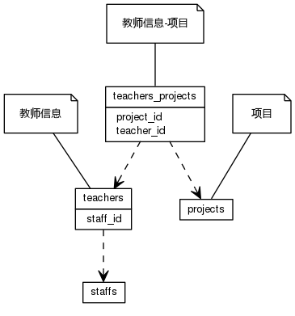


 目  录

* toc
{:toc}

### 关系图 1. 教师
  * 关系图
  

### 表格 hb_admission_ways

  * 表格说明

<table class="table table-bordered table-striped table-condensed">
<tr><th style="background-color:#D0D3FF">表名</th><th style="background-color:#D0D3FF">主键</th><th style="background-color:#D0D3FF">注释</th>  </tr>
<tr><td>hb_admission_ways</td><td>id</td><td>入学方式</td>  </tr>
</table>

  * 表格中的列

<table class="table table-bordered table-striped table-condensed">
<tr><th style="background-color:#D0D3FF">序号</th><th style="background-color:#D0D3FF">字段名</th><th style="background-color:#D0D3FF">字段类型</th><th style="background-color:#D0D3FF">是否可空</th><th style="background-color:#D0D3FF">描述</th><th style="background-color:#D0D3FF">引用表</th>  </tr>
<tr><td>1</td><td>id</td><td>int4</td><td>否</td><td>非业务主键:code</td><td></td>  </tr>
<tr><td>2</td><td>code</td><td>varchar</td><td>否</td><td>代码</td><td></td>  </tr>
<tr><td>3</td><td>name</td><td>varchar</td><td>否</td><td>名称</td><td></td>  </tr>
<tr><td>4</td><td>en_name</td><td>varchar</td><td>是</td><td>英文名称</td><td></td>  </tr>
<tr><td>5</td><td>begin_on</td><td>date</td><td>是</td><td>生效时间</td><td></td>  </tr>
<tr><td>6</td><td>end_on</td><td>date</td><td>是</td><td>失效时间</td><td></td>  </tr>
<tr><td>7</td><td>updated_at</td><td>timestamp</td><td>是</td><td>修改时间</td><td></td>  </tr>
<tr><td>8</td><td>remark</td><td>varchar</td><td>是</td><td>备注</td><td></td>  </tr>
</table>

 
  * 表格的索引

<table class="table table-bordered table-striped table-condensed">
  <tr>
<th style="background-color:#D0D3FF">索引名</th><th style="background-color:#D0D3FF">索引字段</th><th style="background-color:#D0D3FF">是否唯一</th>  </tr>
<tr><td>hb_admission_ways_pkey</td><td>id&nbsp;</td><td>是</td>  </tr>
<tr><td>uk_a5sbgqvogxeu885weoimyu451</td><td>name&nbsp;</td><td>是</td>  </tr>
<tr><td>uk_agkv6hsku5bwysg3w427i434l</td><td>code&nbsp;</td><td>是</td>  </tr>
</table>

### 表格 hb_presses

  * 表格说明

<table class="table table-bordered table-striped table-condensed">
<tr><th style="background-color:#D0D3FF">表名</th><th style="background-color:#D0D3FF">主键</th><th style="background-color:#D0D3FF">注释</th>  </tr>
<tr><td>hb_presses</td><td>id</td><td>出版社</td>  </tr>
</table>

  * 表格中的列

<table class="table table-bordered table-striped table-condensed">
<tr><th style="background-color:#D0D3FF">序号</th><th style="background-color:#D0D3FF">字段名</th><th style="background-color:#D0D3FF">字段类型</th><th style="background-color:#D0D3FF">是否可空</th><th style="background-color:#D0D3FF">描述</th><th style="background-color:#D0D3FF">引用表</th>  </tr>
<tr><td>1</td><td>id</td><td>int4</td><td>否</td><td>非业务主键:code</td><td></td>  </tr>
<tr><td>2</td><td>code</td><td>varchar</td><td>否</td><td>代码</td><td></td>  </tr>
<tr><td>3</td><td>name</td><td>varchar</td><td>否</td><td>名称</td><td></td>  </tr>
<tr><td>4</td><td>en_name</td><td>varchar</td><td>是</td><td>英文名称</td><td></td>  </tr>
<tr><td>5</td><td>begin_on</td><td>date</td><td>是</td><td>生效时间</td><td></td>  </tr>
<tr><td>6</td><td>end_on</td><td>date</td><td>是</td><td>失效时间</td><td></td>  </tr>
<tr><td>7</td><td>updated_at</td><td>timestamp</td><td>是</td><td>修改时间</td><td></td>  </tr>
<tr><td>8</td><td>remark</td><td>varchar</td><td>是</td><td>备注</td><td></td>  </tr>
</table>

 
  * 表格的索引

<table class="table table-bordered table-striped table-condensed">
  <tr>
<th style="background-color:#D0D3FF">索引名</th><th style="background-color:#D0D3FF">索引字段</th><th style="background-color:#D0D3FF">是否唯一</th>  </tr>
<tr><td>hb_presses_pkey</td><td>id&nbsp;</td><td>是</td>  </tr>
<tr><td>uk_9am8k37dnf6ldbfu356avon39</td><td>name&nbsp;</td><td>是</td>  </tr>
<tr><td>uk_imq90h3ergt5m2ae660apd4jn</td><td>code&nbsp;</td><td>是</td>  </tr>
</table>

### 表格 teachers

  * 表格说明

<table class="table table-bordered table-striped table-condensed">
<tr><th style="background-color:#D0D3FF">表名</th><th style="background-color:#D0D3FF">主键</th><th style="background-color:#D0D3FF">注释</th>  </tr>
<tr><td>teachers</td><td>id</td><td>教师信息</td>  </tr>
</table>

  * 表格中的列

<table class="table table-bordered table-striped table-condensed">
<tr><th style="background-color:#D0D3FF">序号</th><th style="background-color:#D0D3FF">字段名</th><th style="background-color:#D0D3FF">字段类型</th><th style="background-color:#D0D3FF">是否可空</th><th style="background-color:#D0D3FF">描述</th><th style="background-color:#D0D3FF">引用表</th>  </tr>
<tr><td>1</td><td>id</td><td>int8</td><td>否</td><td>非业务主键:auto_increment</td><td></td>  </tr>
<tr><td>2</td><td>staff_id</td><td>int8</td><td>否</td><td>人员信息 ID</td><td>staffs</td>  </tr>
<tr><td>3</td><td>begin_on</td><td>date</td><td>是</td><td>生效日期</td><td></td>  </tr>
<tr><td>4</td><td>end_on</td><td>date</td><td>是</td><td>失效日期</td><td></td>  </tr>
<tr><td>5</td><td>remark</td><td>varchar</td><td>是</td><td>备注</td><td></td>  </tr>
</table>

 
  * 表格的索引

<table class="table table-bordered table-striped table-condensed">
  <tr>
<th style="background-color:#D0D3FF">索引名</th><th style="background-color:#D0D3FF">索引字段</th><th style="background-color:#D0D3FF">是否唯一</th>  </tr>
<tr><td>teachers_pkey</td><td>id&nbsp;</td><td>是</td>  </tr>
</table>

### 表格 teachers_projects

  * 表格说明

<table class="table table-bordered table-striped table-condensed">
<tr><th style="background-color:#D0D3FF">表名</th><th style="background-color:#D0D3FF">主键</th><th style="background-color:#D0D3FF">注释</th>  </tr>
<tr><td>teachers_projects</td><td></td><td>教师信息-项目</td>  </tr>
</table>

  * 表格中的列

<table class="table table-bordered table-striped table-condensed">
<tr><th style="background-color:#D0D3FF">序号</th><th style="background-color:#D0D3FF">字段名</th><th style="background-color:#D0D3FF">字段类型</th><th style="background-color:#D0D3FF">是否可空</th><th style="background-color:#D0D3FF">描述</th><th style="background-color:#D0D3FF">引用表</th>  </tr>
<tr><td>1</td><td>teacher_id</td><td>int8</td><td>否</td><td>教师信息 ID</td><td>teachers</td>  </tr>
<tr><td>2</td><td>project_id</td><td>int4</td><td>否</td><td>项目 ID</td><td>projects</td>  </tr>
</table>

 
