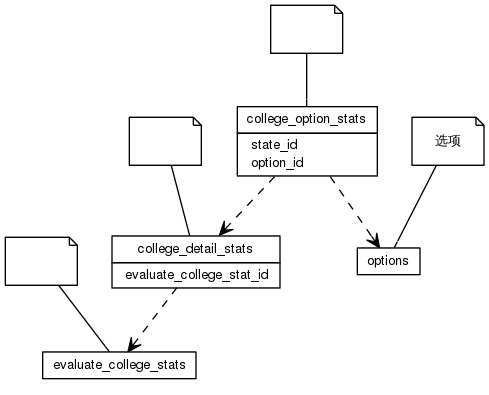


 目  录

* toc
{:toc}

### 关系图 1. 全校排名
  * 关系图
  

### 表格 college_detail_stats

  * 表格说明

<table class="table table-bordered table-striped table-condensed">
<tr><th style="background-color:#D0D3FF">表名</th><th style="background-color:#D0D3FF">主键</th><th style="background-color:#D0D3FF">注释</th>  </tr>
<tr><td>college_detail_stats</td><td>id</td><td></td>  </tr>
</table>

  * 表格中的列

<table class="table table-bordered table-striped table-condensed">
<tr><th style="background-color:#D0D3FF">序号</th><th style="background-color:#D0D3FF">字段名</th><th style="background-color:#D0D3FF">字段类型</th><th style="background-color:#D0D3FF">是否可空</th><th style="background-color:#D0D3FF">描述</th><th style="background-color:#D0D3FF">引用表</th>  </tr>
<tr><td>1</td><td>id</td><td>int8</td><td>否</td><td></td><td></td>  </tr>
<tr><td>2</td><td>evaluate_college_stat_id</td><td>int8</td><td>否</td><td></td><td>evaluate_college_stats</td>  </tr>
</table>

 
  * 表格的索引

<table class="table table-bordered table-striped table-condensed">
  <tr>
<th style="background-color:#D0D3FF">索引名</th><th style="background-color:#D0D3FF">索引字段</th><th style="background-color:#D0D3FF">是否唯一</th>  </tr>
<tr><td>college_detail_stats_pkey</td><td>id&nbsp;</td><td>是</td>  </tr>
</table>

### 表格 college_option_stats

  * 表格说明

<table class="table table-bordered table-striped table-condensed">
<tr><th style="background-color:#D0D3FF">表名</th><th style="background-color:#D0D3FF">主键</th><th style="background-color:#D0D3FF">注释</th>  </tr>
<tr><td>college_option_stats</td><td>id</td><td></td>  </tr>
</table>

  * 表格中的列

<table class="table table-bordered table-striped table-condensed">
<tr><th style="background-color:#D0D3FF">序号</th><th style="background-color:#D0D3FF">字段名</th><th style="background-color:#D0D3FF">字段类型</th><th style="background-color:#D0D3FF">是否可空</th><th style="background-color:#D0D3FF">描述</th><th style="background-color:#D0D3FF">引用表</th>  </tr>
<tr><td>1</td><td>id</td><td>int8</td><td>否</td><td></td><td></td>  </tr>
<tr><td>2</td><td>amount</td><td>int4</td><td>是</td><td></td><td></td>  </tr>
<tr><td>3</td><td>state_id</td><td>int8</td><td>是</td><td></td><td>college_detail_stats</td>  </tr>
<tr><td>4</td><td>option_id</td><td>int8</td><td>是</td><td></td><td>options</td>  </tr>
</table>

 
  * 表格的索引

<table class="table table-bordered table-striped table-condensed">
  <tr>
<th style="background-color:#D0D3FF">索引名</th><th style="background-color:#D0D3FF">索引字段</th><th style="background-color:#D0D3FF">是否唯一</th>  </tr>
<tr><td>college_option_stats_pkey</td><td>id&nbsp;</td><td>是</td>  </tr>
</table>

### 表格 evaluate_college_stats

  * 表格说明

<table class="table table-bordered table-striped table-condensed">
<tr><th style="background-color:#D0D3FF">表名</th><th style="background-color:#D0D3FF">主键</th><th style="background-color:#D0D3FF">注释</th>  </tr>
<tr><td>evaluate_college_stats</td><td>id</td><td></td>  </tr>
</table>

  * 表格中的列

<table class="table table-bordered table-striped table-condensed">
<tr><th style="background-color:#D0D3FF">序号</th><th style="background-color:#D0D3FF">字段名</th><th style="background-color:#D0D3FF">字段类型</th><th style="background-color:#D0D3FF">是否可空</th><th style="background-color:#D0D3FF">描述</th><th style="background-color:#D0D3FF">引用表</th>  </tr>
<tr><td>1</td><td>id</td><td>int8</td><td>否</td><td></td><td></td>  </tr>
<tr><td>2</td><td>count</td><td>int4</td><td>是</td><td></td><td></td>  </tr>
</table>

 
  * 表格的索引

<table class="table table-bordered table-striped table-condensed">
  <tr>
<th style="background-color:#D0D3FF">索引名</th><th style="background-color:#D0D3FF">索引字段</th><th style="background-color:#D0D3FF">是否唯一</th>  </tr>
<tr><td>evaluate_college_stats_pkey</td><td>id&nbsp;</td><td>是</td>  </tr>
</table>
