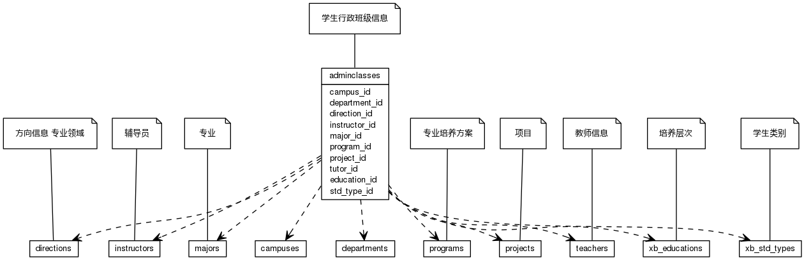
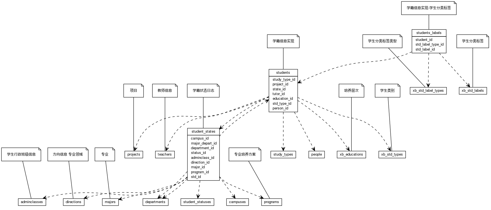


 目  录

* toc
{:toc}

### 关系图 1. 行政班级
  * 关系图
  

### 关系图 2. 专业
  * 关系图
  

### 关系图 3. 学生
  * 关系图
  

### 表格 adminclasses

  * 表格说明

<table class="table table-bordered table-striped table-condensed">
<tr><th style="background-color:#D0D3FF">表名</th><th style="background-color:#D0D3FF">主键</th><th style="background-color:#D0D3FF">注释</th>  </tr>
<tr><td>adminclasses</td><td>id</td><td>学生行政班级信息</td>  </tr>
</table>

  * 表格中的列

<table class="table table-bordered table-striped table-condensed">
<tr><th style="background-color:#D0D3FF">序号</th><th style="background-color:#D0D3FF">字段名</th><th style="background-color:#D0D3FF">字段类型</th><th style="background-color:#D0D3FF">是否可空</th><th style="background-color:#D0D3FF">描述</th><th style="background-color:#D0D3FF">引用表</th>  </tr>
<tr><td>1</td><td>id</td><td>int8</td><td>否</td><td>非业务主键:auto_increment</td><td></td>  </tr>
<tr><td>2</td><td>code</td><td>varchar</td><td>否</td><td>编码代码</td><td></td>  </tr>
<tr><td>3</td><td>name</td><td>varchar</td><td>否</td><td>名称</td><td></td>  </tr>
<tr><td>4</td><td>short_name</td><td>varchar</td><td>是</td><td>简称</td><td></td>  </tr>
<tr><td>5</td><td>grade</td><td>varchar</td><td>是</td><td>年级</td><td></td>  </tr>
<tr><td>6</td><td>project_id</td><td>int4</td><td>否</td><td>项目ID</td><td>projects</td>  </tr>
<tr><td>7</td><td>department_id</td><td>int4</td><td>否</td><td>院系ID</td><td>departments</td>  </tr>
<tr><td>8</td><td>major_id</td><td>int8</td><td>是</td><td>专业ID</td><td>majors</td>  </tr>
<tr><td>9</td><td>direction_id</td><td>int8</td><td>是</td><td>方向ID</td><td>directions</td>  </tr>
<tr><td>10</td><td>std_type_id</td><td>int4</td><td>否</td><td>学生类别ID</td><td>xb_std_types</td>  </tr>
<tr><td>11</td><td>education_id</td><td>int4</td><td>否</td><td>培养层次ID</td><td>xb_educations</td>  </tr>
<tr><td>12</td><td>begin_on</td><td>date</td><td>是</td><td>生效日期</td><td></td>  </tr>
<tr><td>13</td><td>end_on</td><td>date</td><td>是</td><td>失效日期</td><td></td>  </tr>
<tr><td>14</td><td>instructor_id</td><td>int8</td><td>是</td><td>辅导员ID</td><td>staffs</td>  </tr>
<tr><td>15</td><td>tutor_id</td><td>int8</td><td>是</td><td>班导师ID</td><td>staffs</td>  </tr>
<tr><td>16</td><td>plan_count</td><td>int4</td><td>是</td><td>计划人数</td><td></td>  </tr>
<tr><td>17</td><td>updated_at</td><td>timestamp</td><td>是</td><td>更新时间</td><td></td>  </tr>
<tr><td>18</td><td>remark</td><td>varchar</td><td>是</td><td>备注</td><td></td>  </tr>
<tr><td>19</td><td>std_count</td><td>int4</td><td>是</td><td>学籍有效人数</td><td></td>  </tr>
</table>

 
  * 表格的索引

<table class="table table-bordered table-striped table-condensed">
  <tr>
<th style="background-color:#D0D3FF">索引名</th><th style="background-color:#D0D3FF">索引字段</th><th style="background-color:#D0D3FF">是否唯一</th>  </tr>
<tr><td>adminclasses_pkey</td><td>id&nbsp;</td><td>是</td>  </tr>
<tr><td>uk_3ng3xpek5pt1fcbeayouyp2es</td><td>code&nbsp;</td><td>是</td>  </tr>
</table>

### 表格 course_hours

  * 表格说明

<table class="table table-bordered table-striped table-condensed">
<tr><th style="background-color:#D0D3FF">表名</th><th style="background-color:#D0D3FF">主键</th><th style="background-color:#D0D3FF">注释</th>  </tr>
<tr><td>course_hours</td><td>id</td><td>课程分类课时信息</td>  </tr>
</table>

  * 表格中的列

<table class="table table-bordered table-striped table-condensed">
<tr><th style="background-color:#D0D3FF">序号</th><th style="background-color:#D0D3FF">字段名</th><th style="background-color:#D0D3FF">字段类型</th><th style="background-color:#D0D3FF">是否可空</th><th style="background-color:#D0D3FF">描述</th><th style="background-color:#D0D3FF">引用表</th>  </tr>
<tr><td>1</td><td>id</td><td>int8</td><td>否</td><td>非业务主键:auto_increment</td><td></td>  </tr>
<tr><td>2</td><td>period</td><td>int4</td><td>是</td><td>学时/总课时</td><td></td>  </tr>
<tr><td>3</td><td>week_hour</td><td>int4</td><td>是</td><td>周课时</td><td></td>  </tr>
<tr><td>4</td><td>weeks</td><td>int4</td><td>是</td><td>周数</td><td></td>  </tr>
<tr><td>5</td><td>hour_type_id</td><td>int4</td><td>否</td><td>课时类别代码ID</td><td>xb_course_hour_types</td>  </tr>
<tr><td>6</td><td>course_id</td><td>int8</td><td>否</td><td>课程ID</td><td>courses</td>  </tr>
</table>

 
  * 表格的索引

<table class="table table-bordered table-striped table-condensed">
  <tr>
<th style="background-color:#D0D3FF">索引名</th><th style="background-color:#D0D3FF">索引字段</th><th style="background-color:#D0D3FF">是否唯一</th>  </tr>
<tr><td>course_hours_pkey</td><td>id&nbsp;</td><td>是</td>  </tr>
</table>

### 表格 courses

  * 表格说明

<table class="table table-bordered table-striped table-condensed">
<tr><th style="background-color:#D0D3FF">表名</th><th style="background-color:#D0D3FF">主键</th><th style="background-color:#D0D3FF">注释</th>  </tr>
<tr><td>courses</td><td>id</td><td>课程基本信息</td>  </tr>
</table>

  * 表格中的列

<table class="table table-bordered table-striped table-condensed">
<tr><th style="background-color:#D0D3FF">序号</th><th style="background-color:#D0D3FF">字段名</th><th style="background-color:#D0D3FF">字段类型</th><th style="background-color:#D0D3FF">是否可空</th><th style="background-color:#D0D3FF">描述</th><th style="background-color:#D0D3FF">引用表</th>  </tr>
<tr><td>1</td><td>id</td><td>int8</td><td>否</td><td>非业务主键:auto_increment</td><td></td>  </tr>
<tr><td>2</td><td>code</td><td>varchar</td><td>否</td><td>课程代码</td><td></td>  </tr>
<tr><td>3</td><td>name</td><td>varchar</td><td>否</td><td>课程名称</td><td></td>  </tr>
<tr><td>4</td><td>en_name</td><td>varchar</td><td>是</td><td>课程英文名</td><td></td>  </tr>
<tr><td>5</td><td>project_id</td><td>int4</td><td>否</td><td>项目ID</td><td>projects</td>  </tr>
<tr><td>6</td><td>education_level_id</td><td>int4</td><td>是</td><td>学历层次ID</td><td>education_levels</td>  </tr>
<tr><td>7</td><td>category_id</td><td>int4</td><td>是</td><td>课程种类代码ID</td><td>xb_course_categories</td>  </tr>
<tr><td>8</td><td>credits</td><td>float4</td><td>是</td><td>学分</td><td></td>  </tr>
<tr><td>9</td><td>period</td><td>int4</td><td>是</td><td>学时/总课时</td><td></td>  </tr>
<tr><td>10</td><td>week_hour</td><td>int4</td><td>是</td><td>周课时</td><td></td>  </tr>
<tr><td>11</td><td>weeks</td><td>int4</td><td>是</td><td>周数</td><td></td>  </tr>
<tr><td>12</td><td>department_id</td><td>int4</td><td>是</td><td>院系ID</td><td>departments</td>  </tr>
<tr><td>13</td><td>begin_on</td><td>date</td><td>是</td><td>设立日期</td><td></td>  </tr>
<tr><td>14</td><td>end_on</td><td>date</td><td>是</td><td>失效日期</td><td></td>  </tr>
<tr><td>15</td><td>course_type_id</td><td>int4</td><td>是</td><td>建议课程类别ID</td><td>xb_course_types</td>  </tr>
<tr><td>16</td><td>exam_mode_id</td><td>int4</td><td>是</td><td>考试方式ID</td><td>xb_exam_modes</td>  </tr>
<tr><td>17</td><td>mark_style_id</td><td>int4</td><td>是</td><td>成绩记录方式ID</td><td>xb_score_mark_styles</td>  </tr>
<tr><td>18</td><td>remark</td><td>varchar</td><td>是</td><td>课程备注</td><td></td>  </tr>
<tr><td>19</td><td>calgp</td><td>bool</td><td>否</td><td>是否计算绩点</td><td></td>  </tr>
<tr><td>20</td><td>updated_at</td><td>timestamp</td><td>是</td><td>更新时间</td><td></td>  </tr>
</table>

 
  * 表格的索引

<table class="table table-bordered table-striped table-condensed">
  <tr>
<th style="background-color:#D0D3FF">索引名</th><th style="background-color:#D0D3FF">索引字段</th><th style="background-color:#D0D3FF">是否唯一</th>  </tr>
<tr><td>courses_pkey</td><td>id&nbsp;</td><td>是</td>  </tr>
<tr><td>uk_61og8rbqdd2y28rx2et5fdnxd</td><td>code&nbsp;</td><td>是</td>  </tr>
</table>

### 表格 courses_majors

  * 表格说明

<table class="table table-bordered table-striped table-condensed">
<tr><th style="background-color:#D0D3FF">表名</th><th style="background-color:#D0D3FF">主键</th><th style="background-color:#D0D3FF">注释</th>  </tr>
<tr><td>courses_majors</td><td>course_id,major_id</td><td>课程基本信息-针对专业</td>  </tr>
</table>

  * 表格中的列

<table class="table table-bordered table-striped table-condensed">
<tr><th style="background-color:#D0D3FF">序号</th><th style="background-color:#D0D3FF">字段名</th><th style="background-color:#D0D3FF">字段类型</th><th style="background-color:#D0D3FF">是否可空</th><th style="background-color:#D0D3FF">描述</th><th style="background-color:#D0D3FF">引用表</th>  </tr>
<tr><td>1</td><td>course_id</td><td>int8</td><td>否</td><td>课程基本信息ID</td><td>courses</td>  </tr>
<tr><td>2</td><td>major_id</td><td>int8</td><td>否</td><td>专业ID</td><td>majors</td>  </tr>
</table>

 
  * 表格的索引

<table class="table table-bordered table-striped table-condensed">
  <tr>
<th style="background-color:#D0D3FF">索引名</th><th style="background-color:#D0D3FF">索引字段</th><th style="background-color:#D0D3FF">是否唯一</th>  </tr>
<tr><td>courses_majors_pkey</td><td>course_id&nbsp;major_id&nbsp;</td><td>是</td>  </tr>
</table>

### 表格 courses_prerequisites

  * 表格说明

<table class="table table-bordered table-striped table-condensed">
<tr><th style="background-color:#D0D3FF">表名</th><th style="background-color:#D0D3FF">主键</th><th style="background-color:#D0D3FF">注释</th>  </tr>
<tr><td>courses_prerequisites</td><td>course_id,precourse_id</td><td>课程基本信息-先修课程</td>  </tr>
</table>

  * 表格中的列

<table class="table table-bordered table-striped table-condensed">
<tr><th style="background-color:#D0D3FF">序号</th><th style="background-color:#D0D3FF">字段名</th><th style="background-color:#D0D3FF">字段类型</th><th style="background-color:#D0D3FF">是否可空</th><th style="background-color:#D0D3FF">描述</th><th style="background-color:#D0D3FF">引用表</th>  </tr>
<tr><td>1</td><td>course_id</td><td>int8</td><td>否</td><td>课程基本信息ID</td><td>courses</td>  </tr>
<tr><td>2</td><td>precourse_id</td><td>int8</td><td>否</td><td>课程基本信息ID</td><td>courses</td>  </tr>
</table>

 
  * 表格的索引

<table class="table table-bordered table-striped table-condensed">
  <tr>
<th style="background-color:#D0D3FF">索引名</th><th style="background-color:#D0D3FF">索引字段</th><th style="background-color:#D0D3FF">是否唯一</th>  </tr>
<tr><td>courses_prerequisites_pkey</td><td>course_id&nbsp;precourse_id&nbsp;</td><td>是</td>  </tr>
</table>

### 表格 courses_xmajors

  * 表格说明

<table class="table table-bordered table-striped table-condensed">
<tr><th style="background-color:#D0D3FF">表名</th><th style="background-color:#D0D3FF">主键</th><th style="background-color:#D0D3FF">注释</th>  </tr>
<tr><td>courses_xmajors</td><td>course_id,xmajor_id</td><td>课程基本信息-排除专业</td>  </tr>
</table>

  * 表格中的列

<table class="table table-bordered table-striped table-condensed">
<tr><th style="background-color:#D0D3FF">序号</th><th style="background-color:#D0D3FF">字段名</th><th style="background-color:#D0D3FF">字段类型</th><th style="background-color:#D0D3FF">是否可空</th><th style="background-color:#D0D3FF">描述</th><th style="background-color:#D0D3FF">引用表</th>  </tr>
<tr><td>1</td><td>course_id</td><td>int8</td><td>否</td><td>课程基本信息ID</td><td>courses</td>  </tr>
<tr><td>2</td><td>xmajor_id</td><td>int8</td><td>否</td><td>专业ID</td><td>majors</td>  </tr>
</table>

 
  * 表格的索引

<table class="table table-bordered table-striped table-condensed">
  <tr>
<th style="background-color:#D0D3FF">索引名</th><th style="background-color:#D0D3FF">索引字段</th><th style="background-color:#D0D3FF">是否唯一</th>  </tr>
<tr><td>courses_xmajors_pkey</td><td>course_id&nbsp;xmajor_id&nbsp;</td><td>是</td>  </tr>
</table>

### 表格 direction_journals

  * 表格说明

<table class="table table-bordered table-striped table-condensed">
<tr><th style="background-color:#D0D3FF">表名</th><th style="background-color:#D0D3FF">主键</th><th style="background-color:#D0D3FF">注释</th>  </tr>
<tr><td>direction_journals</td><td>id</td><td>专业方向建设过程</td>  </tr>
</table>

  * 表格中的列

<table class="table table-bordered table-striped table-condensed">
<tr><th style="background-color:#D0D3FF">序号</th><th style="background-color:#D0D3FF">字段名</th><th style="background-color:#D0D3FF">字段类型</th><th style="background-color:#D0D3FF">是否可空</th><th style="background-color:#D0D3FF">描述</th><th style="background-color:#D0D3FF">引用表</th>  </tr>
<tr><td>1</td><td>id</td><td>int8</td><td>否</td><td>非业务主键:auto_increment</td><td></td>  </tr>
<tr><td>2</td><td>direction_id</td><td>int8</td><td>是</td><td>专业方向ID</td><td>directions</td>  </tr>
<tr><td>3</td><td>education_id</td><td>int4</td><td>是</td><td>培养层次ID</td><td>xb_educations</td>  </tr>
<tr><td>4</td><td>depart_id</td><td>int4</td><td>是</td><td>部门ID</td><td>departments</td>  </tr>
<tr><td>5</td><td>begin_on</td><td>date</td><td>是</td><td>生效日期</td><td></td>  </tr>
<tr><td>6</td><td>end_on</td><td>date</td><td>是</td><td>失效日期</td><td></td>  </tr>
<tr><td>7</td><td>remark</td><td>varchar</td><td>是</td><td>备注</td><td></td>  </tr>
</table>

 
  * 表格的索引

<table class="table table-bordered table-striped table-condensed">
  <tr>
<th style="background-color:#D0D3FF">索引名</th><th style="background-color:#D0D3FF">索引字段</th><th style="background-color:#D0D3FF">是否唯一</th>  </tr>
<tr><td>direction_journals_pkey</td><td>id&nbsp;</td><td>是</td>  </tr>
</table>

### 表格 directions

  * 表格说明

<table class="table table-bordered table-striped table-condensed">
<tr><th style="background-color:#D0D3FF">表名</th><th style="background-color:#D0D3FF">主键</th><th style="background-color:#D0D3FF">注释</th>  </tr>
<tr><td>directions</td><td>id</td><td>方向信息 专业领域</td>  </tr>
</table>

  * 表格中的列

<table class="table table-bordered table-striped table-condensed">
<tr><th style="background-color:#D0D3FF">序号</th><th style="background-color:#D0D3FF">字段名</th><th style="background-color:#D0D3FF">字段类型</th><th style="background-color:#D0D3FF">是否可空</th><th style="background-color:#D0D3FF">描述</th><th style="background-color:#D0D3FF">引用表</th>  </tr>
<tr><td>1</td><td>id</td><td>int8</td><td>否</td><td>非业务主键:auto_increment</td><td></td>  </tr>
<tr><td>2</td><td>code</td><td>varchar</td><td>否</td><td>专业方向编码</td><td></td>  </tr>
<tr><td>3</td><td>name</td><td>varchar</td><td>否</td><td>专业方向名称</td><td></td>  </tr>
<tr><td>4</td><td>en_name</td><td>varchar</td><td>是</td><td>专业方向英文名</td><td></td>  </tr>
<tr><td>5</td><td>begin_on</td><td>date</td><td>是</td><td>生效日期</td><td></td>  </tr>
<tr><td>6</td><td>end_on</td><td>date</td><td>是</td><td>失效日期</td><td></td>  </tr>
<tr><td>7</td><td>updated_at</td><td>timestamp</td><td>是</td><td>更新时间</td><td></td>  </tr>
<tr><td>8</td><td>remark</td><td>varchar</td><td>是</td><td>备注</td><td></td>  </tr>
<tr><td>9</td><td>major_id</td><td>int8</td><td>是</td><td>所属专业ID</td><td>majors</td>  </tr>
</table>

 
  * 表格的索引

<table class="table table-bordered table-striped table-condensed">
  <tr>
<th style="background-color:#D0D3FF">索引名</th><th style="background-color:#D0D3FF">索引字段</th><th style="background-color:#D0D3FF">是否唯一</th>  </tr>
<tr><td>directions_pkey</td><td>id&nbsp;</td><td>是</td>  </tr>
<tr><td>uk_90d4g7vk0kov7ohapyq9u844</td><td>code&nbsp;</td><td>是</td>  </tr>
</table>

### 表格 major_journals

  * 表格说明

<table class="table table-bordered table-striped table-condensed">
<tr><th style="background-color:#D0D3FF">表名</th><th style="background-color:#D0D3FF">主键</th><th style="background-color:#D0D3FF">注释</th>  </tr>
<tr><td>major_journals</td><td>id</td><td>专业建设历程</td>  </tr>
</table>

  * 表格中的列

<table class="table table-bordered table-striped table-condensed">
<tr><th style="background-color:#D0D3FF">序号</th><th style="background-color:#D0D3FF">字段名</th><th style="background-color:#D0D3FF">字段类型</th><th style="background-color:#D0D3FF">是否可空</th><th style="background-color:#D0D3FF">描述</th><th style="background-color:#D0D3FF">引用表</th>  </tr>
<tr><td>1</td><td>id</td><td>int8</td><td>否</td><td>非业务主键:auto_increment</td><td></td>  </tr>
<tr><td>2</td><td>major_id</td><td>int8</td><td>是</td><td>专业ID</td><td>majors</td>  </tr>
<tr><td>3</td><td>duration</td><td>float4</td><td>是</td><td>修读年限</td><td></td>  </tr>
<tr><td>4</td><td>education_id</td><td>int4</td><td>是</td><td>培养层次ID</td><td>xb_educations</td>  </tr>
<tr><td>5</td><td>depart_id</td><td>int4</td><td>是</td><td>部门ID</td><td>departments</td>  </tr>
<tr><td>6</td><td>begin_on</td><td>date</td><td>是</td><td>生效日期</td><td></td>  </tr>
<tr><td>7</td><td>end_on</td><td>date</td><td>是</td><td>失效日期</td><td></td>  </tr>
<tr><td>8</td><td>remark</td><td>varchar</td><td>是</td><td>备注</td><td></td>  </tr>
</table>

 
  * 表格的索引

<table class="table table-bordered table-striped table-condensed">
  <tr>
<th style="background-color:#D0D3FF">索引名</th><th style="background-color:#D0D3FF">索引字段</th><th style="background-color:#D0D3FF">是否唯一</th>  </tr>
<tr><td>major_journals_pkey</td><td>id&nbsp;</td><td>是</td>  </tr>
</table>

### 表格 majors

  * 表格说明

<table class="table table-bordered table-striped table-condensed">
<tr><th style="background-color:#D0D3FF">表名</th><th style="background-color:#D0D3FF">主键</th><th style="background-color:#D0D3FF">注释</th>  </tr>
<tr><td>majors</td><td>id</td><td>专业</td>  </tr>
</table>

  * 表格中的列

<table class="table table-bordered table-striped table-condensed">
<tr><th style="background-color:#D0D3FF">序号</th><th style="background-color:#D0D3FF">字段名</th><th style="background-color:#D0D3FF">字段类型</th><th style="background-color:#D0D3FF">是否可空</th><th style="background-color:#D0D3FF">描述</th><th style="background-color:#D0D3FF">引用表</th>  </tr>
<tr><td>1</td><td>id</td><td>int8</td><td>否</td><td>非业务主键:auto_increment</td><td></td>  </tr>
<tr><td>2</td><td>code</td><td>varchar</td><td>否</td><td>专业编码</td><td></td>  </tr>
<tr><td>3</td><td>name</td><td>varchar</td><td>否</td><td>专业名称</td><td></td>  </tr>
<tr><td>4</td><td>en_name</td><td>varchar</td><td>是</td><td>专业英文名</td><td></td>  </tr>
<tr><td>5</td><td>project_id</td><td>int4</td><td>是</td><td>项目ID</td><td>projects</td>  </tr>
<tr><td>6</td><td>discipline_head_id</td><td>int8</td><td>是</td><td>学科信息ID</td><td>major_disciplines</td>  </tr>
<tr><td>7</td><td>begin_on</td><td>date</td><td>是</td><td>生效日期</td><td></td>  </tr>
<tr><td>8</td><td>end_on</td><td>date</td><td>是</td><td>失效日期</td><td></td>  </tr>
<tr><td>9</td><td>remark</td><td>varchar</td><td>是</td><td>备注</td><td></td>  </tr>
<tr><td>10</td><td>short_name</td><td>varchar</td><td>是</td><td>简称</td><td></td>  </tr>
<tr><td>11</td><td>updated_at</td><td>timestamp</td><td>是</td><td>更新时间</td><td></td>  </tr>
</table>

 
  * 表格的索引

<table class="table table-bordered table-striped table-condensed">
  <tr>
<th style="background-color:#D0D3FF">索引名</th><th style="background-color:#D0D3FF">索引字段</th><th style="background-color:#D0D3FF">是否唯一</th>  </tr>
<tr><td>majors_pkey</td><td>id&nbsp;</td><td>是</td>  </tr>
<tr><td>uk_2y2r71qxp7j6qki8lj639of4y</td><td>code&nbsp;</td><td>是</td>  </tr>
</table>

### 表格 programs

  * 表格说明

<table class="table table-bordered table-striped table-condensed">
<tr><th style="background-color:#D0D3FF">表名</th><th style="background-color:#D0D3FF">主键</th><th style="background-color:#D0D3FF">注释</th>  </tr>
<tr><td>programs</td><td>id</td><td>专业培养方案</td>  </tr>
</table>

  * 表格中的列

<table class="table table-bordered table-striped table-condensed">
<tr><th style="background-color:#D0D3FF">序号</th><th style="background-color:#D0D3FF">字段名</th><th style="background-color:#D0D3FF">字段类型</th><th style="background-color:#D0D3FF">是否可空</th><th style="background-color:#D0D3FF">描述</th><th style="background-color:#D0D3FF">引用表</th>  </tr>
<tr><td>1</td><td>id</td><td>int8</td><td>否</td><td>非业务主键:auto_increment</td><td></td>  </tr>
<tr><td>2</td><td>name</td><td>varchar</td><td>否</td><td>名称</td><td></td>  </tr>
<tr><td>3</td><td>grade</td><td>varchar</td><td>否</td><td>年级</td><td></td>  </tr>
<tr><td>4</td><td>department_id</td><td>int4</td><td>否</td><td>部门ID</td><td>departments</td>  </tr>
<tr><td>5</td><td>education_id</td><td>int4</td><td>否</td><td>培养层次ID</td><td>xb_educations</td>  </tr>
<tr><td>6</td><td>major_id</td><td>int8</td><td>否</td><td>专业ID</td><td>majors</td>  </tr>
<tr><td>7</td><td>direction_id</td><td>int8</td><td>是</td><td>专业方向ID</td><td>directions</td>  </tr>
<tr><td>8</td><td>std_type_id</td><td>int4</td><td>是</td><td>学生类别ID</td><td>xb_std_types</td>  </tr>
<tr><td>9</td><td>duration</td><td>float4</td><td>否</td><td>学制</td><td></td>  </tr>
<tr><td>10</td><td>degree_id</td><td>int4</td><td>是</td><td>毕业授予学位ID</td><td>degrees</td>  </tr>
<tr><td>11</td><td>study_type_id</td><td>int4</td><td>是</td><td>学习形式ID</td><td>study_types</td>  </tr>
<tr><td>12</td><td>begin_on</td><td>date</td><td>否</td><td>生效日期</td><td></td>  </tr>
<tr><td>13</td><td>end_on</td><td>date</td><td>否</td><td>失效日期</td><td></td>  </tr>
<tr><td>14</td><td>updated_at</td><td>timestamp</td><td>是</td><td>更新时间</td><td></td>  </tr>
<tr><td>15</td><td>remark</td><td>varchar</td><td>是</td><td>备注</td><td></td>  </tr>
<tr><td>16</td><td>state</td><td>int4</td><td>是</td><td>状态</td><td></td>  </tr>
</table>

 
  * 表格的索引

<table class="table table-bordered table-striped table-condensed">
  <tr>
<th style="background-color:#D0D3FF">索引名</th><th style="background-color:#D0D3FF">索引字段</th><th style="background-color:#D0D3FF">是否唯一</th>  </tr>
<tr><td>programs_pkey</td><td>id&nbsp;</td><td>是</td>  </tr>
</table>

### 表格 project_classrooms

  * 表格说明

<table class="table table-bordered table-striped table-condensed">
<tr><th style="background-color:#D0D3FF">表名</th><th style="background-color:#D0D3FF">主键</th><th style="background-color:#D0D3FF">注释</th>  </tr>
<tr><td>project_classrooms</td><td>id</td><td>项目师资人员配备</td>  </tr>
</table>

  * 表格中的列

<table class="table table-bordered table-striped table-condensed">
<tr><th style="background-color:#D0D3FF">序号</th><th style="background-color:#D0D3FF">字段名</th><th style="background-color:#D0D3FF">字段类型</th><th style="background-color:#D0D3FF">是否可空</th><th style="background-color:#D0D3FF">描述</th><th style="background-color:#D0D3FF">引用表</th>  </tr>
<tr><td>1</td><td>id</td><td>int8</td><td>否</td><td>非业务主键:auto_increment</td><td></td>  </tr>
<tr><td>2</td><td>classroom_id</td><td>int4</td><td>是</td><td>教室ID</td><td>classrooms</td>  </tr>
<tr><td>3</td><td>project_id</td><td>int4</td><td>否</td><td>项目ID</td><td>projects</td>  </tr>
<tr><td>4</td><td>begin_on</td><td>date</td><td>是</td><td>生效日期</td><td></td>  </tr>
<tr><td>5</td><td>end_on</td><td>date</td><td>是</td><td>失效日期</td><td></td>  </tr>
<tr><td>6</td><td>updated_at</td><td>timestamp</td><td>是</td><td>更新时间</td><td></td>  </tr>
</table>

 
  * 表格的索引

<table class="table table-bordered table-striped table-condensed">
  <tr>
<th style="background-color:#D0D3FF">索引名</th><th style="background-color:#D0D3FF">索引字段</th><th style="background-color:#D0D3FF">是否唯一</th>  </tr>
<tr><td>project_classrooms_pkey</td><td>id&nbsp;</td><td>是</td>  </tr>
</table>

### 表格 project_codes

  * 表格说明

<table class="table table-bordered table-striped table-condensed">
<tr><th style="background-color:#D0D3FF">表名</th><th style="background-color:#D0D3FF">主键</th><th style="background-color:#D0D3FF">注释</th>  </tr>
<tr><td>project_codes</td><td>id</td><td>项目基础代码配置</td>  </tr>
</table>

  * 表格中的列

<table class="table table-bordered table-striped table-condensed">
<tr><th style="background-color:#D0D3FF">序号</th><th style="background-color:#D0D3FF">字段名</th><th style="background-color:#D0D3FF">字段类型</th><th style="background-color:#D0D3FF">是否可空</th><th style="background-color:#D0D3FF">描述</th><th style="background-color:#D0D3FF">引用表</th>  </tr>
<tr><td>1</td><td>id</td><td>int8</td><td>否</td><td>非业务主键:auto_increment</td><td></td>  </tr>
<tr><td>2</td><td>project_id</td><td>int4</td><td>否</td><td>项目ID</td><td>projects</td>  </tr>
<tr><td>3</td><td>class_name</td><td>varchar</td><td>否</td><td>代码元</td><td></td>  </tr>
<tr><td>4</td><td>code_ids</td><td>varchar</td><td>否</td><td>代码ID</td><td></td>  </tr>
</table>

 
  * 表格的索引

<table class="table table-bordered table-striped table-condensed">
  <tr>
<th style="background-color:#D0D3FF">索引名</th><th style="background-color:#D0D3FF">索引字段</th><th style="background-color:#D0D3FF">是否唯一</th>  </tr>
<tr><td>project_codes_pkey</td><td>id&nbsp;</td><td>是</td>  </tr>
</table>

### 表格 project_staffs

  * 表格说明

<table class="table table-bordered table-striped table-condensed">
<tr><th style="background-color:#D0D3FF">表名</th><th style="background-color:#D0D3FF">主键</th><th style="background-color:#D0D3FF">注释</th>  </tr>
<tr><td>project_staffs</td><td>id</td><td>项目师资人员配备</td>  </tr>
</table>

  * 表格中的列

<table class="table table-bordered table-striped table-condensed">
<tr><th style="background-color:#D0D3FF">序号</th><th style="background-color:#D0D3FF">字段名</th><th style="background-color:#D0D3FF">字段类型</th><th style="background-color:#D0D3FF">是否可空</th><th style="background-color:#D0D3FF">描述</th><th style="background-color:#D0D3FF">引用表</th>  </tr>
<tr><td>1</td><td>id</td><td>int8</td><td>否</td><td>非业务主键:auto_increment</td><td></td>  </tr>
<tr><td>2</td><td>staff_id</td><td>int8</td><td>否</td><td>人员信息ID</td><td>staffs</td>  </tr>
<tr><td>3</td><td>project_id</td><td>int4</td><td>否</td><td>项目ID</td><td>projects</td>  </tr>
<tr><td>4</td><td>begin_on</td><td>date</td><td>是</td><td>生效日期</td><td></td>  </tr>
<tr><td>5</td><td>end_on</td><td>date</td><td>是</td><td>失效日期</td><td></td>  </tr>
<tr><td>6</td><td>updated_at</td><td>timestamp</td><td>是</td><td>更新时间</td><td></td>  </tr>
</table>

 
  * 表格的索引

<table class="table table-bordered table-striped table-condensed">
  <tr>
<th style="background-color:#D0D3FF">索引名</th><th style="background-color:#D0D3FF">索引字段</th><th style="background-color:#D0D3FF">是否唯一</th>  </tr>
<tr><td>project_staffs_pkey</td><td>id&nbsp;</td><td>是</td>  </tr>
</table>

### 表格 projects

  * 表格说明

<table class="table table-bordered table-striped table-condensed">
<tr><th style="background-color:#D0D3FF">表名</th><th style="background-color:#D0D3FF">主键</th><th style="background-color:#D0D3FF">注释</th>  </tr>
<tr><td>projects</td><td>id</td><td>项目</td>  </tr>
</table>

  * 表格中的列

<table class="table table-bordered table-striped table-condensed">
<tr><th style="background-color:#D0D3FF">序号</th><th style="background-color:#D0D3FF">字段名</th><th style="background-color:#D0D3FF">字段类型</th><th style="background-color:#D0D3FF">是否可空</th><th style="background-color:#D0D3FF">描述</th><th style="background-color:#D0D3FF">引用表</th>  </tr>
<tr><td>1</td><td>id</td><td>int4</td><td>否</td><td>非业务主键:auto_increment</td><td></td>  </tr>
<tr><td>2</td><td>name</td><td>varchar</td><td>否</td><td>名称</td><td></td>  </tr>
<tr><td>3</td><td>code</td><td>varchar</td><td>否</td><td>代码</td><td></td>  </tr>
<tr><td>4</td><td>school_id</td><td>int4</td><td>否</td><td>适用学校ID</td><td>schools</td>  </tr>
<tr><td>5</td><td>calendar_id</td><td>int4</td><td>否</td><td>使用校历ID</td><td>calendars</td>  </tr>
<tr><td>6</td><td>description</td><td>varchar</td><td>是</td><td>描述</td><td></td>  </tr>
<tr><td>7</td><td>minor</td><td>bool</td><td>是</td><td>是否辅修</td><td></td>  </tr>
<tr><td>8</td><td>begin_on</td><td>date</td><td>是</td><td>生效日期</td><td></td>  </tr>
<tr><td>9</td><td>end_on</td><td>date</td><td>是</td><td>失效日期</td><td></td>  </tr>
<tr><td>10</td><td>updated_at</td><td>timestamp</td><td>是</td><td>更新时间</td><td></td>  </tr>
</table>

 
  * 表格的索引

<table class="table table-bordered table-striped table-condensed">
  <tr>
<th style="background-color:#D0D3FF">索引名</th><th style="background-color:#D0D3FF">索引字段</th><th style="background-color:#D0D3FF">是否唯一</th>  </tr>
<tr><td>projects_pkey</td><td>id&nbsp;</td><td>是</td>  </tr>
<tr><td>uk_clujw4wu21d33ssgde022aymk</td><td>code&nbsp;</td><td>是</td>  </tr>
</table>

### 表格 projects_campuses

  * 表格说明

<table class="table table-bordered table-striped table-condensed">
<tr><th style="background-color:#D0D3FF">表名</th><th style="background-color:#D0D3FF">主键</th><th style="background-color:#D0D3FF">注释</th>  </tr>
<tr><td>projects_campuses</td><td></td><td>项目-校区列表</td>  </tr>
</table>

  * 表格中的列

<table class="table table-bordered table-striped table-condensed">
<tr><th style="background-color:#D0D3FF">序号</th><th style="background-color:#D0D3FF">字段名</th><th style="background-color:#D0D3FF">字段类型</th><th style="background-color:#D0D3FF">是否可空</th><th style="background-color:#D0D3FF">描述</th><th style="background-color:#D0D3FF">引用表</th>  </tr>
<tr><td>1</td><td>project_id</td><td>int4</td><td>否</td><td>项目ID</td><td>projects</td>  </tr>
<tr><td>2</td><td>campus_id</td><td>int4</td><td>否</td><td>校区信息ID</td><td>campuses</td>  </tr>
</table>

 

### 表格 projects_departments

  * 表格说明

<table class="table table-bordered table-striped table-condensed">
<tr><th style="background-color:#D0D3FF">表名</th><th style="background-color:#D0D3FF">主键</th><th style="background-color:#D0D3FF">注释</th>  </tr>
<tr><td>projects_departments</td><td></td><td>项目-部门列表</td>  </tr>
</table>

  * 表格中的列

<table class="table table-bordered table-striped table-condensed">
<tr><th style="background-color:#D0D3FF">序号</th><th style="background-color:#D0D3FF">字段名</th><th style="background-color:#D0D3FF">字段类型</th><th style="background-color:#D0D3FF">是否可空</th><th style="background-color:#D0D3FF">描述</th><th style="background-color:#D0D3FF">引用表</th>  </tr>
<tr><td>1</td><td>project_id</td><td>int4</td><td>否</td><td>项目ID</td><td>projects</td>  </tr>
<tr><td>2</td><td>department_id</td><td>int4</td><td>否</td><td>部门组织机构信息ID</td><td>departments</td>  </tr>
</table>

 

### 表格 projects_educations

  * 表格说明

<table class="table table-bordered table-striped table-condensed">
<tr><th style="background-color:#D0D3FF">表名</th><th style="background-color:#D0D3FF">主键</th><th style="background-color:#D0D3FF">注释</th>  </tr>
<tr><td>projects_educations</td><td></td><td>项目-学历层次列表</td>  </tr>
</table>

  * 表格中的列

<table class="table table-bordered table-striped table-condensed">
<tr><th style="background-color:#D0D3FF">序号</th><th style="background-color:#D0D3FF">字段名</th><th style="background-color:#D0D3FF">字段类型</th><th style="background-color:#D0D3FF">是否可空</th><th style="background-color:#D0D3FF">描述</th><th style="background-color:#D0D3FF">引用表</th>  </tr>
<tr><td>1</td><td>project_id</td><td>int4</td><td>否</td><td>项目ID</td><td>projects</td>  </tr>
<tr><td>2</td><td>education_id</td><td>int4</td><td>否</td><td>培养层次ID</td><td>xb_educations</td>  </tr>
</table>

 

### 表格 projects_properties

  * 表格说明

<table class="table table-bordered table-striped table-condensed">
<tr><th style="background-color:#D0D3FF">表名</th><th style="background-color:#D0D3FF">主键</th><th style="background-color:#D0D3FF">注释</th>  </tr>
<tr><td>projects_properties</td><td>project_id,name</td><td>项目-项目属性/项目参数</td>  </tr>
</table>

  * 表格中的列

<table class="table table-bordered table-striped table-condensed">
<tr><th style="background-color:#D0D3FF">序号</th><th style="background-color:#D0D3FF">字段名</th><th style="background-color:#D0D3FF">字段类型</th><th style="background-color:#D0D3FF">是否可空</th><th style="background-color:#D0D3FF">描述</th><th style="background-color:#D0D3FF">引用表</th>  </tr>
<tr><td>1</td><td>project_id</td><td>int4</td><td>否</td><td>项目ID</td><td>projects</td>  </tr>
<tr><td>2</td><td>value</td><td>varchar</td><td>是</td><td></td><td></td>  </tr>
<tr><td>3</td><td>name</td><td>varchar</td><td>否</td><td></td><td></td>  </tr>
</table>

 
  * 表格的索引

<table class="table table-bordered table-striped table-condensed">
  <tr>
<th style="background-color:#D0D3FF">索引名</th><th style="background-color:#D0D3FF">索引字段</th><th style="background-color:#D0D3FF">是否唯一</th>  </tr>
<tr><td>projects_properties_pkey</td><td>project_id&nbsp;name&nbsp;</td><td>是</td>  </tr>
</table>

### 表格 projects_std_labels

  * 表格说明

<table class="table table-bordered table-striped table-condensed">
<tr><th style="background-color:#D0D3FF">表名</th><th style="background-color:#D0D3FF">主键</th><th style="background-color:#D0D3FF">注释</th>  </tr>
<tr><td>projects_std_labels</td><td></td><td>项目-学生分类列表</td>  </tr>
</table>

  * 表格中的列

<table class="table table-bordered table-striped table-condensed">
<tr><th style="background-color:#D0D3FF">序号</th><th style="background-color:#D0D3FF">字段名</th><th style="background-color:#D0D3FF">字段类型</th><th style="background-color:#D0D3FF">是否可空</th><th style="background-color:#D0D3FF">描述</th><th style="background-color:#D0D3FF">引用表</th>  </tr>
<tr><td>1</td><td>project_id</td><td>int4</td><td>否</td><td>项目ID</td><td>projects</td>  </tr>
<tr><td>2</td><td>std_label_id</td><td>int4</td><td>否</td><td>学生分类标签ID</td><td>xb_std_labels</td>  </tr>
</table>

 

### 表格 projects_std_types

  * 表格说明

<table class="table table-bordered table-striped table-condensed">
<tr><th style="background-color:#D0D3FF">表名</th><th style="background-color:#D0D3FF">主键</th><th style="background-color:#D0D3FF">注释</th>  </tr>
<tr><td>projects_std_types</td><td></td><td>项目-学生类别</td>  </tr>
</table>

  * 表格中的列

<table class="table table-bordered table-striped table-condensed">
<tr><th style="background-color:#D0D3FF">序号</th><th style="background-color:#D0D3FF">字段名</th><th style="background-color:#D0D3FF">字段类型</th><th style="background-color:#D0D3FF">是否可空</th><th style="background-color:#D0D3FF">描述</th><th style="background-color:#D0D3FF">引用表</th>  </tr>
<tr><td>1</td><td>project_id</td><td>int4</td><td>否</td><td>项目ID</td><td>projects</td>  </tr>
<tr><td>2</td><td>std_type_id</td><td>int4</td><td>否</td><td>学生类别ID</td><td>xb_std_types</td>  </tr>
</table>

 

### 表格 projects_time_settings

  * 表格说明

<table class="table table-bordered table-striped table-condensed">
<tr><th style="background-color:#D0D3FF">表名</th><th style="background-color:#D0D3FF">主键</th><th style="background-color:#D0D3FF">注释</th>  </tr>
<tr><td>projects_time_settings</td><td></td><td>项目-小节设置</td>  </tr>
</table>

  * 表格中的列

<table class="table table-bordered table-striped table-condensed">
<tr><th style="background-color:#D0D3FF">序号</th><th style="background-color:#D0D3FF">字段名</th><th style="background-color:#D0D3FF">字段类型</th><th style="background-color:#D0D3FF">是否可空</th><th style="background-color:#D0D3FF">描述</th><th style="background-color:#D0D3FF">引用表</th>  </tr>
<tr><td>1</td><td>project_id</td><td>int4</td><td>否</td><td>项目ID</td><td>projects</td>  </tr>
<tr><td>2</td><td>time_setting_id</td><td>int4</td><td>否</td><td>每个小节的时间设置ID</td><td>time_settings</td>  </tr>
</table>

 

### 表格 student_journals

  * 表格说明

<table class="table table-bordered table-striped table-condensed">
<tr><th style="background-color:#D0D3FF">表名</th><th style="background-color:#D0D3FF">主键</th><th style="background-color:#D0D3FF">注释</th>  </tr>
<tr><td>student_journals</td><td>id</td><td>学籍状态日志</td>  </tr>
</table>

  * 表格中的列

<table class="table table-bordered table-striped table-condensed">
<tr><th style="background-color:#D0D3FF">序号</th><th style="background-color:#D0D3FF">字段名</th><th style="background-color:#D0D3FF">字段类型</th><th style="background-color:#D0D3FF">是否可空</th><th style="background-color:#D0D3FF">描述</th><th style="background-color:#D0D3FF">引用表</th>  </tr>
<tr><td>1</td><td>id</td><td>int8</td><td>否</td><td>非业务主键:auto_increment</td><td></td>  </tr>
<tr><td>2</td><td>std_id</td><td>int8</td><td>是</td><td>学生ID</td><td>students</td>  </tr>
<tr><td>3</td><td>grade</td><td>varchar</td><td>否</td><td>年级</td><td></td>  </tr>
<tr><td>4</td><td>department_id</td><td>int4</td><td>是</td><td>管理院系ID</td><td>departments</td>  </tr>
<tr><td>5</td><td>major_id</td><td>int8</td><td>是</td><td>专业ID</td><td>majors</td>  </tr>
<tr><td>6</td><td>direction_id</td><td>int8</td><td>是</td><td>方向ID</td><td>directions</td>  </tr>
<tr><td>7</td><td>adminclass_id</td><td>int8</td><td>是</td><td>行政班级ID</td><td>adminclasses</td>  </tr>
<tr><td>8</td><td>inschool</td><td>bool</td><td>是</td><td>是否在校</td><td></td>  </tr>
<tr><td>9</td><td>state_id</td><td>int4</td><td>是</td><td>学籍状态ID</td><td>student_states</td>  </tr>
<tr><td>10</td><td>program_id</td><td>int8</td><td>是</td><td>培养方案ID</td><td>programs</td>  </tr>
<tr><td>11</td><td>begin_on</td><td>date</td><td>是</td><td>起始日期</td><td></td>  </tr>
<tr><td>12</td><td>end_on</td><td>date</td><td>是</td><td>结束日期</td><td></td>  </tr>
<tr><td>13</td><td>remark</td><td>varchar</td><td>是</td><td>备注</td><td></td>  </tr>
<tr><td>14</td><td>student_id</td><td>int8</td><td>是</td><td></td><td>students</td>  </tr>
</table>

 
  * 表格的索引

<table class="table table-bordered table-striped table-condensed">
  <tr>
<th style="background-color:#D0D3FF">索引名</th><th style="background-color:#D0D3FF">索引字段</th><th style="background-color:#D0D3FF">是否唯一</th>  </tr>
<tr><td>student_journals_pkey</td><td>id&nbsp;</td><td>是</td>  </tr>
<tr><td>uk_c7khwwlni4wy4orv7wk1x8wi3</td><td>grade&nbsp;</td><td>是</td>  </tr>
</table>

### 表格 students

  * 表格说明

<table class="table table-bordered table-striped table-condensed">
<tr><th style="background-color:#D0D3FF">表名</th><th style="background-color:#D0D3FF">主键</th><th style="background-color:#D0D3FF">注释</th>  </tr>
<tr><td>students</td><td>id</td><td>学籍信息实现</td>  </tr>
</table>

  * 表格中的列

<table class="table table-bordered table-striped table-condensed">
<tr><th style="background-color:#D0D3FF">序号</th><th style="background-color:#D0D3FF">字段名</th><th style="background-color:#D0D3FF">字段类型</th><th style="background-color:#D0D3FF">是否可空</th><th style="background-color:#D0D3FF">描述</th><th style="background-color:#D0D3FF">引用表</th>  </tr>
<tr><td>1</td><td>id</td><td>int8</td><td>否</td><td>非业务主键:auto_increment</td><td></td>  </tr>
<tr><td>2</td><td>code</td><td>varchar</td><td>否</td><td>学号</td><td></td>  </tr>
<tr><td>3</td><td>person_id</td><td>int8</td><td>否</td><td>基本信息ID</td><td>people</td>  </tr>
<tr><td>4</td><td>project_id</td><td>int4</td><td>否</td><td>项目ID</td><td>projects</td>  </tr>
<tr><td>5</td><td>education_id</td><td>int4</td><td>否</td><td>培养层次ID</td><td>xb_educations</td>  </tr>
<tr><td>6</td><td>std_type_id</td><td>int4</td><td>是</td><td>学生类别ID</td><td>xb_std_types</td>  </tr>
<tr><td>7</td><td>grade</td><td>varchar</td><td>否</td><td>年级</td><td></td>  </tr>
<tr><td>8</td><td>department_id</td><td>int4</td><td>是</td><td>管理院系 行政管理院系ID</td><td>departments</td>  </tr>
<tr><td>9</td><td>major_id</td><td>int8</td><td>是</td><td>专业 当前修读专业ID</td><td>majors</td>  </tr>
<tr><td>10</td><td>direction_id</td><td>int8</td><td>是</td><td>方向 当前修读方向ID</td><td>directions</td>  </tr>
<tr><td>11</td><td>adminclass_id</td><td>int8</td><td>是</td><td>行政班级ID</td><td>adminclasses</td>  </tr>
<tr><td>12</td><td>inschool</td><td>bool</td><td>是</td><td>是否在校</td><td></td>  </tr>
<tr><td>13</td><td>state_id</td><td>int4</td><td>是</td><td>学籍状态ID</td><td>student_states</td>  </tr>
<tr><td>14</td><td>program_id</td><td>int8</td><td>是</td><td>培养方案ID</td><td>programs</td>  </tr>
<tr><td>15</td><td>campus_id</td><td>int4</td><td>是</td><td>校区ID</td><td>campuses</td>  </tr>
<tr><td>16</td><td>duration</td><td>float4</td><td>否</td><td>学制/学习年限</td><td></td>  </tr>
<tr><td>17</td><td>registed</td><td>bool</td><td>否</td><td>是否有学籍</td><td></td>  </tr>
<tr><td>18</td><td>enroll_on</td><td>date</td><td>否</td><td>入学报到日期</td><td></td>  </tr>
<tr><td>19</td><td>regist_on</td><td>date</td><td>是</td><td>学籍生效日期</td><td></td>  </tr>
<tr><td>20</td><td>updated_at</td><td>timestamp</td><td>是</td><td>更新时间</td><td></td>  </tr>
<tr><td>21</td><td>graduate_on</td><td>date</td><td>否</td><td>应毕业时间 预计毕业日期</td><td></td>  </tr>
<tr><td>22</td><td>remark</td><td>varchar</td><td>是</td><td>备注</td><td></td>  </tr>
<tr><td>23</td><td>study_type_id</td><td>int4</td><td>是</td><td>学习形式ID</td><td>study_types</td>  </tr>
<tr><td>24</td><td>tutor_id</td><td>int8</td><td>是</td><td>导师ID</td><td>staffs</td>  </tr>
</table>

 
  * 表格的索引

<table class="table table-bordered table-striped table-condensed">
  <tr>
<th style="background-color:#D0D3FF">索引名</th><th style="background-color:#D0D3FF">索引字段</th><th style="background-color:#D0D3FF">是否唯一</th>  </tr>
<tr><td>students_pkey</td><td>id&nbsp;</td><td>是</td>  </tr>
<tr><td>uk_ac1gjjlhhxsqd30fhb61ts84k</td><td>grade&nbsp;</td><td>是</td>  </tr>
<tr><td>uk_eqa1d4jiyg5m5rnuja7ifgw73</td><td>code&nbsp;</td><td>是</td>  </tr>
</table>

### 表格 students_labels

  * 表格说明

<table class="table table-bordered table-striped table-condensed">
<tr><th style="background-color:#D0D3FF">表名</th><th style="background-color:#D0D3FF">主键</th><th style="background-color:#D0D3FF">注释</th>  </tr>
<tr><td>students_labels</td><td>student_id,label_type_id</td><td>学籍信息实现-学生分类标签</td>  </tr>
</table>

  * 表格中的列

<table class="table table-bordered table-striped table-condensed">
<tr><th style="background-color:#D0D3FF">序号</th><th style="background-color:#D0D3FF">字段名</th><th style="background-color:#D0D3FF">字段类型</th><th style="background-color:#D0D3FF">是否可空</th><th style="background-color:#D0D3FF">描述</th><th style="background-color:#D0D3FF">引用表</th>  </tr>
<tr><td>1</td><td>student_id</td><td>int8</td><td>否</td><td>学籍信息实现ID</td><td>students</td>  </tr>
<tr><td>2</td><td>label_id</td><td>int4</td><td>否</td><td>学生分类标签ID</td><td>xb_std_labels</td>  </tr>
<tr><td>3</td><td>label_type_id</td><td>int4</td><td>否</td><td>学生分类标签类型ID</td><td>xb_std_label_types</td>  </tr>
</table>

 
  * 表格的索引

<table class="table table-bordered table-striped table-condensed">
  <tr>
<th style="background-color:#D0D3FF">索引名</th><th style="background-color:#D0D3FF">索引字段</th><th style="background-color:#D0D3FF">是否唯一</th>  </tr>
<tr><td>students_labels_pkey</td><td>student_id&nbsp;label_type_id&nbsp;</td><td>是</td>  </tr>
</table>
