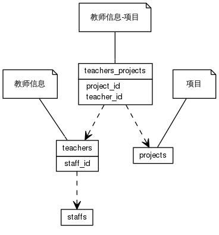


 目  录

* toc
{:toc}

### 关系图 1. 教师
  * 关系图
  

### 表格 classrooms

  * 表格说明

<table class="table table-bordered table-striped table-condensed">
<tr><th style="background-color:#D0D3FF">表名</th><th style="background-color:#D0D3FF">主键</th><th style="background-color:#D0D3FF">注释</th>  </tr>
<tr><td>classrooms</td><td>id</td><td>教室</td>  </tr>
</table>

  * 表格中的列

<table class="table table-bordered table-striped table-condensed">
<tr><th style="background-color:#D0D3FF">序号</th><th style="background-color:#D0D3FF">字段名</th><th style="background-color:#D0D3FF">字段类型</th><th style="background-color:#D0D3FF">是否可空</th><th style="background-color:#D0D3FF">描述</th><th style="background-color:#D0D3FF">引用表</th>  </tr>
<tr><td>1</td><td>campus_id</td><td>int4</td><td>否</td><td>校区ID</td><td>campuses</td>  </tr>
<tr><td>2</td><td>updated_at</td><td>timestamp</td><td>否</td><td>更新时间</td><td></td>  </tr>
<tr><td>3</td><td>short_name</td><td>varchar</td><td>是</td><td>简称</td><td></td>  </tr>
<tr><td>4</td><td>room_id</td><td>int4</td><td>否</td><td>房间ID</td><td>rooms</td>  </tr>
<tr><td>5</td><td>exam_capacity</td><td>int4</td><td>否</td><td>考试容量</td><td></td>  </tr>
<tr><td>6</td><td>room_type_id</td><td>int4</td><td>否</td><td>教室类型ID</td><td>classroom_types</td>  </tr>
<tr><td>7</td><td>en_name</td><td>varchar</td><td>是</td><td>英文名</td><td></td>  </tr>
<tr><td>8</td><td>code</td><td>varchar</td><td>否</td><td>代码</td><td></td>  </tr>
<tr><td>9</td><td>name</td><td>varchar</td><td>否</td><td>名称</td><td></td>  </tr>
<tr><td>10</td><td>course_capacity</td><td>int4</td><td>否</td><td>上课容量</td><td></td>  </tr>
<tr><td>11</td><td>project_id</td><td>int4</td><td>否</td><td>项目ID</td><td>projects</td>  </tr>
<tr><td>12</td><td>id</td><td>int8</td><td>否</td><td>非业务主键:auto_increment</td><td></td>  </tr>
</table>

 
  * 表格的索引

<table class="table table-bordered table-striped table-condensed">
  <tr>
<th style="background-color:#D0D3FF">索引名</th><th style="background-color:#D0D3FF">索引字段</th><th style="background-color:#D0D3FF">是否唯一</th>  </tr>
<tr><td>classrooms_pkey</td><td>id&nbsp;</td><td>是</td>  </tr>
</table>

### 表格 instructors

  * 表格说明

<table class="table table-bordered table-striped table-condensed">
<tr><th style="background-color:#D0D3FF">表名</th><th style="background-color:#D0D3FF">主键</th><th style="background-color:#D0D3FF">注释</th>  </tr>
<tr><td>instructors</td><td>id</td><td>辅导员</td>  </tr>
</table>

  * 表格中的列

<table class="table table-bordered table-striped table-condensed">
<tr><th style="background-color:#D0D3FF">序号</th><th style="background-color:#D0D3FF">字段名</th><th style="background-color:#D0D3FF">字段类型</th><th style="background-color:#D0D3FF">是否可空</th><th style="background-color:#D0D3FF">描述</th><th style="background-color:#D0D3FF">引用表</th>  </tr>
<tr><td>1</td><td>begin_on</td><td>date</td><td>否</td><td>生效日期</td><td></td>  </tr>
<tr><td>2</td><td>updated_at</td><td>timestamp</td><td>否</td><td>更新时间</td><td></td>  </tr>
<tr><td>3</td><td>end_on</td><td>date</td><td>是</td><td>失效日期</td><td></td>  </tr>
<tr><td>4</td><td>user_id</td><td>int8</td><td>否</td><td>用户ID</td><td>users</td>  </tr>
<tr><td>5</td><td>project_id</td><td>int4</td><td>否</td><td>项目ID</td><td>projects</td>  </tr>
<tr><td>6</td><td>id</td><td>int8</td><td>否</td><td>非业务主键:auto_increment</td><td></td>  </tr>
</table>

 
  * 表格的索引

<table class="table table-bordered table-striped table-condensed">
  <tr>
<th style="background-color:#D0D3FF">索引名</th><th style="background-color:#D0D3FF">索引字段</th><th style="background-color:#D0D3FF">是否唯一</th>  </tr>
<tr><td>instructors_pkey</td><td>id&nbsp;</td><td>是</td>  </tr>
</table>

### 表格 major_campuses

  * 表格说明

<table class="table table-bordered table-striped table-condensed">
<tr><th style="background-color:#D0D3FF">表名</th><th style="background-color:#D0D3FF">主键</th><th style="background-color:#D0D3FF">注释</th>  </tr>
<tr><td>major_campuses</td><td>id</td><td>专业所在校区</td>  </tr>
</table>

  * 表格中的列

<table class="table table-bordered table-striped table-condensed">
<tr><th style="background-color:#D0D3FF">序号</th><th style="background-color:#D0D3FF">字段名</th><th style="background-color:#D0D3FF">字段类型</th><th style="background-color:#D0D3FF">是否可空</th><th style="background-color:#D0D3FF">描述</th><th style="background-color:#D0D3FF">引用表</th>  </tr>
<tr><td>1</td><td>campus_id</td><td>int4</td><td>否</td><td>校区ID</td><td>campuses</td>  </tr>
<tr><td>2</td><td>terms</td><td>int4</td><td>否</td><td>学期</td><td></td>  </tr>
<tr><td>3</td><td>major_id</td><td>int8</td><td>否</td><td>专业ID</td><td>majors</td>  </tr>
<tr><td>4</td><td>education_id</td><td>int4</td><td>否</td><td>培养层次ID</td><td>xb_educations</td>  </tr>
<tr><td>5</td><td>grade</td><td>varchar</td><td>否</td><td>年级</td><td></td>  </tr>
<tr><td>6</td><td>id</td><td>int4</td><td>否</td><td>非业务主键:auto_increment</td><td></td>  </tr>
</table>

 
  * 表格的索引

<table class="table table-bordered table-striped table-condensed">
  <tr>
<th style="background-color:#D0D3FF">索引名</th><th style="background-color:#D0D3FF">索引字段</th><th style="background-color:#D0D3FF">是否唯一</th>  </tr>
<tr><td>major_campuses_pkey</td><td>id&nbsp;</td><td>是</td>  </tr>
</table>

### 表格 major_disciplines

  * 表格说明

<table class="table table-bordered table-striped table-condensed">
<tr><th style="background-color:#D0D3FF">表名</th><th style="background-color:#D0D3FF">主键</th><th style="background-color:#D0D3FF">注释</th>  </tr>
<tr><td>major_disciplines</td><td>id</td><td>专业学科信息</td>  </tr>
</table>

  * 表格中的列

<table class="table table-bordered table-striped table-condensed">
<tr><th style="background-color:#D0D3FF">序号</th><th style="background-color:#D0D3FF">字段名</th><th style="background-color:#D0D3FF">字段类型</th><th style="background-color:#D0D3FF">是否可空</th><th style="background-color:#D0D3FF">描述</th><th style="background-color:#D0D3FF">引用表</th>  </tr>
<tr><td>1</td><td>begin_on</td><td>date</td><td>否</td><td>生效日期</td><td></td>  </tr>
<tr><td>2</td><td>end_on</td><td>date</td><td>是</td><td>失效日期</td><td></td>  </tr>
<tr><td>3</td><td>discipline_code</td><td>varchar</td><td>是</td><td>教育部代码</td><td></td>  </tr>
<tr><td>4</td><td>category_id</td><td>int4</td><td>否</td><td>学科门类ID</td><td>discipline_categories</td>  </tr>
<tr><td>5</td><td>major_id</td><td>int8</td><td>否</td><td>专业ID</td><td>majors</td>  </tr>
<tr><td>6</td><td>id</td><td>int8</td><td>否</td><td>非业务主键:auto_increment</td><td></td>  </tr>
</table>

 
  * 表格的索引

<table class="table table-bordered table-striped table-condensed">
  <tr>
<th style="background-color:#D0D3FF">索引名</th><th style="background-color:#D0D3FF">索引字段</th><th style="background-color:#D0D3FF">是否唯一</th>  </tr>
<tr><td>major_disciplines_pkey</td><td>id&nbsp;</td><td>是</td>  </tr>
</table>

### 表格 teachers

  * 表格说明

<table class="table table-bordered table-striped table-condensed">
<tr><th style="background-color:#D0D3FF">表名</th><th style="background-color:#D0D3FF">主键</th><th style="background-color:#D0D3FF">注释</th>  </tr>
<tr><td>teachers</td><td>id</td><td>教师信息</td>  </tr>
</table>

  * 表格中的列

<table class="table table-bordered table-striped table-condensed">
<tr><th style="background-color:#D0D3FF">序号</th><th style="background-color:#D0D3FF">字段名</th><th style="background-color:#D0D3FF">字段类型</th><th style="background-color:#D0D3FF">是否可空</th><th style="background-color:#D0D3FF">描述</th><th style="background-color:#D0D3FF">引用表</th>  </tr>
<tr><td>1</td><td>begin_on</td><td>date</td><td>否</td><td>生效日期</td><td></td>  </tr>
<tr><td>2</td><td>teacher_type_id</td><td>int4</td><td>否</td><td>教师类型ID</td><td>xb_teacher_types</td>  </tr>
<tr><td>3</td><td>updated_at</td><td>timestamp</td><td>否</td><td>更新时间</td><td></td>  </tr>
<tr><td>4</td><td>end_on</td><td>date</td><td>是</td><td>失效日期</td><td></td>  </tr>
<tr><td>5</td><td>user_id</td><td>int8</td><td>否</td><td>用户ID</td><td>users</td>  </tr>
<tr><td>6</td><td>project_id</td><td>int4</td><td>否</td><td>所在项目ID</td><td>projects</td>  </tr>
<tr><td>7</td><td>id</td><td>int8</td><td>否</td><td>非业务主键:auto_increment</td><td></td>  </tr>
</table>

 
  * 表格的索引

<table class="table table-bordered table-striped table-condensed">
  <tr>
<th style="background-color:#D0D3FF">索引名</th><th style="background-color:#D0D3FF">索引字段</th><th style="background-color:#D0D3FF">是否唯一</th>  </tr>
<tr><td>teachers_pkey</td><td>id&nbsp;</td><td>是</td>  </tr>
</table>

### 表格 textbooks

  * 表格说明

<table class="table table-bordered table-striped table-condensed">
<tr><th style="background-color:#D0D3FF">表名</th><th style="background-color:#D0D3FF">主键</th><th style="background-color:#D0D3FF">注释</th>  </tr>
<tr><td>textbooks</td><td>id</td><td>教材</td>  </tr>
</table>

  * 表格中的列

<table class="table table-bordered table-striped table-condensed">
<tr><th style="background-color:#D0D3FF">序号</th><th style="background-color:#D0D3FF">字段名</th><th style="background-color:#D0D3FF">字段类型</th><th style="background-color:#D0D3FF">是否可空</th><th style="background-color:#D0D3FF">描述</th><th style="background-color:#D0D3FF">引用表</th>  </tr>
<tr><td>1</td><td>price</td><td>float8</td><td>是</td><td>价格</td><td></td>  </tr>
<tr><td>2</td><td>published</td><td>bool</td><td>否</td><td>是否出版</td><td></td>  </tr>
<tr><td>3</td><td>begin_on</td><td>date</td><td>否</td><td>生效日期</td><td></td>  </tr>
<tr><td>4</td><td>end_on</td><td>date</td><td>是</td><td>失效日期</td><td></td>  </tr>
<tr><td>5</td><td>description</td><td>varchar</td><td>是</td><td>描述</td><td></td>  </tr>
<tr><td>6</td><td>published_on</td><td>date</td><td>否</td><td>出版日期</td><td></td>  </tr>
<tr><td>7</td><td>name</td><td>varchar</td><td>否</td><td>名称</td><td></td>  </tr>
<tr><td>8</td><td>author</td><td>varchar</td><td>否</td><td>作者</td><td></td>  </tr>
<tr><td>9</td><td>remark</td><td>varchar</td><td>是</td><td>备注</td><td></td>  </tr>
<tr><td>10</td><td>award_type_id</td><td>int4</td><td>是</td><td>教材获奖类型ID</td><td>xb_book_award_types</td>  </tr>
<tr><td>11</td><td>book_type_id</td><td>int4</td><td>是</td><td>教材类型ID</td><td>xb_book_types</td>  </tr>
<tr><td>12</td><td>isbn</td><td>varchar</td><td>是</td><td>ISBN</td><td></td>  </tr>
<tr><td>13</td><td>press_id</td><td>int4</td><td>否</td><td>出版社ID</td><td>presses</td>  </tr>
<tr><td>14</td><td>version</td><td>varchar</td><td>否</td><td>版本</td><td></td>  </tr>
<tr><td>15</td><td>id</td><td>int8</td><td>否</td><td>非业务主键:auto_increment</td><td></td>  </tr>
</table>

 
  * 表格的索引

<table class="table table-bordered table-striped table-condensed">
  <tr>
<th style="background-color:#D0D3FF">索引名</th><th style="background-color:#D0D3FF">索引字段</th><th style="background-color:#D0D3FF">是否唯一</th>  </tr>
<tr><td>textbooks_pkey</td><td>id&nbsp;</td><td>是</td>  </tr>
</table>
