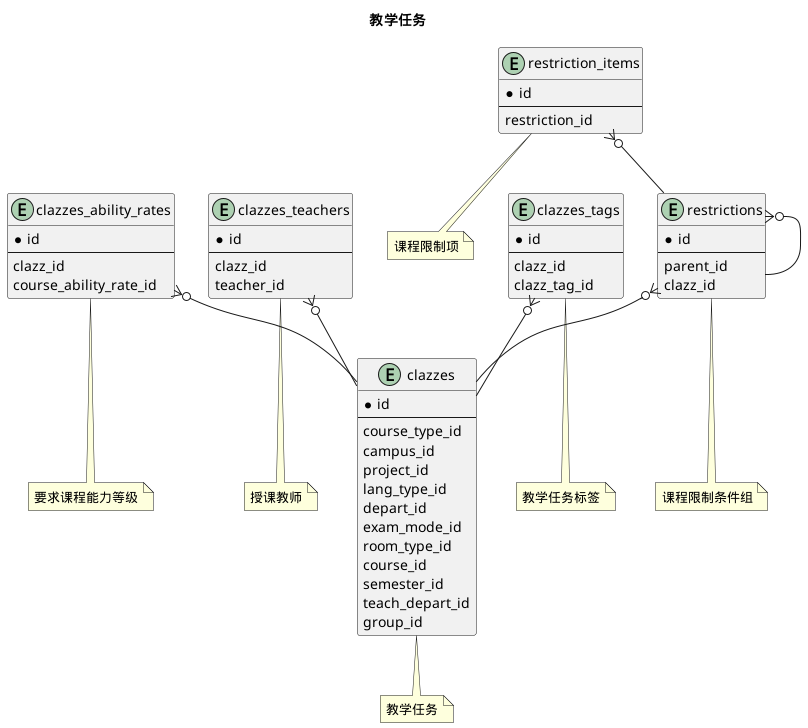
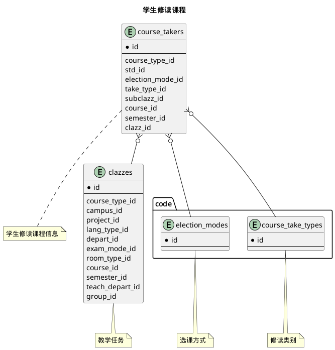
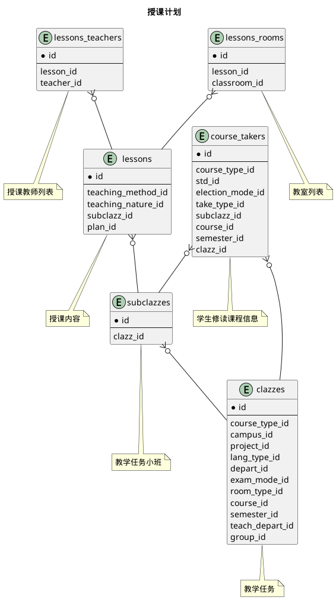


 目  录

* toc
{:toc}

### 关系图 1. 教学任务
  * 关系图

### 关系图 2. 学生修读课程
  * 关系图

### 关系图 3. 授课计划
  * 关系图

### 表格 clazz_activities 教学活动

  
<h5 id="table_edu.clazz_activities">表格edu.clazz_activities</h5>

  

<ul>
  <li>表格说明</li>
</ul>

<table class="table table-bordered table-striped table-condensed ">
<tr><th class="info_header">表名</th><th class="info_header">主键</th><th class="info_header" style="width:40%">注释</th>  </tr>
<tr><td>edu.clazz_activities</td><td>id</td><td>教学活动</td>  </tr>
</table>
<ul>
  <li>表格中的列</li>
</ul>
<table class="table table-bordered table-striped table-condensed">
<tr><th class="info_header text-center">序号</th><th class="info_header">字段名</th><th class="info_header">字段类型</th><th class="info_header text-center">是否可空</th><th class="info_header">描述</th><th class="info_header">引用表</th>  </tr>
<tr><td class="text-center">1</td><td>id</td><td>bigint</td><td class="text-center">否</td><td>非业务主键:datetime</td><td></td>  </tr>
<tr><td class="text-center">2</td><td>begin_at</td><td>smallint</td><td class="text-center">否</td><td>开始时间</td><td></td>  </tr>
<tr><td class="text-center">3</td><td>begin_unit</td><td>smallint</td><td class="text-center">否</td><td>开始节次</td><td></td>  </tr>
<tr><td class="text-center">4</td><td>clazz_id</td><td>bigint</td><td class="text-center">否</td><td>教学任务ID</td><td>            <a href="/model/edu/clazz/clazz.html#表格-clazzes-教学任务">edu.clazzes</a>
</td>  </tr>
<tr><td class="text-center">5</td><td>end_at</td><td>smallint</td><td class="text-center">否</td><td>结束时间</td><td></td>  </tr>
<tr><td class="text-center">6</td><td>end_unit</td><td>smallint</td><td class="text-center">否</td><td>结束节次</td><td></td>  </tr>
<tr><td class="text-center">7</td><td>places</td><td>varchar(100)</td><td class="text-center">是</td><td>授课场所</td><td></td>  </tr>
<tr><td class="text-center">8</td><td>start_on</td><td>date</td><td class="text-center">否</td><td>开始日期</td><td></td>  </tr>
<tr><td class="text-center">9</td><td>subclazz_id</td><td>bigint</td><td class="text-center">是</td><td>教学任务小班ID</td><td>            <a href="/model/edu/clazz/clazz.html#表格-subclazzes-教学任务小班">edu.subclazzes</a>
</td>  </tr>
<tr><td class="text-center">10</td><td>teaching_method_id</td><td>integer</td><td class="text-center">否</td><td>授课方式ID</td><td>            <a href="/model/code/edu/all.html#表格-teaching_methods-授课方式">code.teaching_methods</a>
</td>  </tr>
<tr><td class="text-center">11</td><td>teaching_nature_id</td><td>integer</td><td class="text-center">否</td><td>授课性质ID</td><td>            <a href="/model/code/edu/all.html#表格-teaching_natures-授课性质">code.teaching_natures</a>
</td>  </tr>
<tr><td class="text-center">12</td><td>weekstate</td><td>bigint</td><td class="text-center">否</td><td>周状态</td><td></td>  </tr>
</table>

<ul>
  <li>表格的索引</li>
</ul>
<table class="table table-bordered table-striped table-condensed">
  <tr>
<th class="info_header">索引名</th><th class="info_header">索引字段</th><th class="info_header">是否唯一</th>  </tr>
<tr><td>idx_sjlgr9e0wh41aqb4wbj7tyqaj</td><td>clazz_id</td><td>否</td>  </tr>
</table>
  

### 表格 clazz_activities_rooms 教室列表

  
<h5 id="table_edu.clazz_activities_rooms">表格edu.clazz_activities_rooms</h5>

  

<ul>
  <li>表格说明</li>
</ul>

<table class="table table-bordered table-striped table-condensed ">
<tr><th class="info_header">表名</th><th class="info_header">主键</th><th class="info_header" style="width:40%">注释</th>  </tr>
<tr><td>edu.clazz_activities_rooms</td><td>activity_id,classroom_id</td><td>教室列表</td>  </tr>
</table>
<ul>
  <li>表格中的列</li>
</ul>
<table class="table table-bordered table-striped table-condensed">
<tr><th class="info_header text-center">序号</th><th class="info_header">字段名</th><th class="info_header">字段类型</th><th class="info_header text-center">是否可空</th><th class="info_header">描述</th><th class="info_header">引用表</th>  </tr>
<tr><td class="text-center">1</td><td>activity_id</td><td>bigint</td><td class="text-center">否</td><td>教学活动ID</td><td>            <a href="/model/edu/clazz/clazz.html#表格-clazz_activities-教学活动">edu.clazz_activities</a>
</td>  </tr>
<tr><td class="text-center">2</td><td>classroom_id</td><td>bigint</td><td class="text-center">否</td><td>教室ID</td><td>            <a href="/model/base/edu/misc.html#表格-classrooms-教室">base.classrooms</a>
</td>  </tr>
</table>

<ul>
  <li>表格的索引</li>
</ul>
<table class="table table-bordered table-striped table-condensed">
  <tr>
<th class="info_header">索引名</th><th class="info_header">索引字段</th><th class="info_header">是否唯一</th>  </tr>
<tr><td>idx_lp1ho1db4ui0l4lffulgfn0yk</td><td>activity_id</td><td>否</td>  </tr>
</table>
  

### 表格 clazz_activities_teachers 授课教师列表

  
<h5 id="table_edu.clazz_activities_teachers">表格edu.clazz_activities_teachers</h5>

  

<ul>
  <li>表格说明</li>
</ul>

<table class="table table-bordered table-striped table-condensed ">
<tr><th class="info_header">表名</th><th class="info_header">主键</th><th class="info_header" style="width:40%">注释</th>  </tr>
<tr><td>edu.clazz_activities_teachers</td><td>activity_id,teacher_id</td><td>授课教师列表</td>  </tr>
</table>
<ul>
  <li>表格中的列</li>
</ul>
<table class="table table-bordered table-striped table-condensed">
<tr><th class="info_header text-center">序号</th><th class="info_header">字段名</th><th class="info_header">字段类型</th><th class="info_header text-center">是否可空</th><th class="info_header">描述</th><th class="info_header">引用表</th>  </tr>
<tr><td class="text-center">1</td><td>activity_id</td><td>bigint</td><td class="text-center">否</td><td>教学活动ID</td><td>            <a href="/model/edu/clazz/clazz.html#表格-clazz_activities-教学活动">edu.clazz_activities</a>
</td>  </tr>
<tr><td class="text-center">2</td><td>teacher_id</td><td>bigint</td><td class="text-center">否</td><td>教师信息ID</td><td>            <a href="/model/base/edu/core.html#表格-teachers-教师信息">base.teachers</a>
</td>  </tr>
</table>

<ul>
  <li>表格的索引</li>
</ul>
<table class="table table-bordered table-striped table-condensed">
  <tr>
<th class="info_header">索引名</th><th class="info_header">索引字段</th><th class="info_header">是否唯一</th>  </tr>
<tr><td>idx_15kq4qjipsyjesv30panl7d28</td><td>activity_id</td><td>否</td>  </tr>
</table>
  

### 表格 clazz_bulletins 教学班公告板

  
<h5 id="table_edu.clazz_bulletins">表格edu.clazz_bulletins</h5>

  

<ul>
  <li>表格说明</li>
</ul>

<table class="table table-bordered table-striped table-condensed ">
<tr><th class="info_header">表名</th><th class="info_header">主键</th><th class="info_header" style="width:40%">注释</th>  </tr>
<tr><td>edu.clazz_bulletins</td><td>id</td><td>教学班公告板</td>  </tr>
</table>
<ul>
  <li>表格中的列</li>
</ul>
<table class="table table-bordered table-striped table-condensed">
<tr><th class="info_header text-center">序号</th><th class="info_header">字段名</th><th class="info_header">字段类型</th><th class="info_header text-center">是否可空</th><th class="info_header">描述</th><th class="info_header">引用表</th>  </tr>
<tr><td class="text-center">1</td><td>id</td><td>bigint</td><td class="text-center">否</td><td>非业务主键:datetime</td><td></td>  </tr>
<tr><td class="text-center">2</td><td>clazz_id</td><td>bigint</td><td class="text-center">否</td><td>教学任务ID</td><td>            <a href="/model/edu/clazz/clazz.html#表格-clazzes-教学任务">edu.clazzes</a>
</td>  </tr>
<tr><td class="text-center">3</td><td>contact_channel</td><td>varchar(150)</td><td class="text-center">是</td><td>日常联系渠道</td><td></td>  </tr>
<tr><td class="text-center">4</td><td>contact_qrcode_path</td><td>varchar(300)</td><td class="text-center">是</td><td>日常联系渠道二维码</td><td></td>  </tr>
<tr><td class="text-center">5</td><td>contents</td><td>varchar(1000)</td><td class="text-center">是</td><td>公告内容</td><td></td>  </tr>
</table>

<ul>
  <li>表格中唯一约束</li>
</ul>
<table class="table table-bordered table-striped table-condensed">
  <tr>
<th class="info_header">序号</th><th class="info_header">约束名</th><th class="info_header">约束字段</th>  </tr>
<tr><td>1</td><td>uk_bw61pgrg2iw0irmhs8hof0q0g</td><td>clazz_id</td>  </tr>
</table>

  

### 表格 clazz_groups 教学任务组

  
<h5 id="table_edu.clazz_groups">表格edu.clazz_groups</h5>

  

<ul>
  <li>表格说明</li>
</ul>

<table class="table table-bordered table-striped table-condensed ">
<tr><th class="info_header">表名</th><th class="info_header">主键</th><th class="info_header" style="width:40%">注释</th>  </tr>
<tr><td>edu.clazz_groups</td><td>id</td><td>教学任务组</td>  </tr>
</table>
<ul>
  <li>表格中的列</li>
</ul>
<table class="table table-bordered table-striped table-condensed">
<tr><th class="info_header text-center">序号</th><th class="info_header">字段名</th><th class="info_header">字段类型</th><th class="info_header text-center">是否可空</th><th class="info_header">描述</th><th class="info_header">引用表</th>  </tr>
<tr><td class="text-center">1</td><td>id</td><td>bigint</td><td class="text-center">否</td><td>非业务主键:datetime</td><td></td>  </tr>
<tr><td class="text-center">2</td><td>course_id</td><td>bigint</td><td class="text-center">是</td><td>课程ID</td><td>            <a href="/model/base/edu/core.html#表格-courses-课程基本信息">base.courses</a>
</td>  </tr>
<tr><td class="text-center">3</td><td>name</td><td>varchar(255)</td><td class="text-center">否</td><td>组名称</td><td></td>  </tr>
<tr><td class="text-center">4</td><td>project_id</td><td>integer</td><td class="text-center">否</td><td>项目ID</td><td>            <a href="/model/base/common/misc.html#表格-projects-项目">base.projects</a>
</td>  </tr>
<tr><td class="text-center">5</td><td>semester_id</td><td>integer</td><td class="text-center">否</td><td>学期ID</td><td>            <a href="/model/base/common/time.html#表格-semesters-学年学期">base.semesters</a>
</td>  </tr>
<tr><td class="text-center">6</td><td>teach_depart_id</td><td>integer</td><td class="text-center">是</td><td>开课部门ID</td><td>            <a href="/model/base/common/user.html#表格-departments-部门组织机构信息">base.departments</a>
</td>  </tr>
</table>

  

### 表格 clazz_materials 教学班资料

  
<h5 id="table_edu.clazz_materials">表格edu.clazz_materials</h5>

  

<ul>
  <li>表格说明</li>
</ul>

<table class="table table-bordered table-striped table-condensed ">
<tr><th class="info_header">表名</th><th class="info_header">主键</th><th class="info_header" style="width:40%">注释</th>  </tr>
<tr><td>edu.clazz_materials</td><td>id</td><td>教学班资料</td>  </tr>
</table>
<ul>
  <li>表格中的列</li>
</ul>
<table class="table table-bordered table-striped table-condensed">
<tr><th class="info_header text-center">序号</th><th class="info_header">字段名</th><th class="info_header">字段类型</th><th class="info_header text-center">是否可空</th><th class="info_header">描述</th><th class="info_header">引用表</th>  </tr>
<tr><td class="text-center">1</td><td>id</td><td>bigint</td><td class="text-center">否</td><td>非业务主键:datetime</td><td></td>  </tr>
<tr><td class="text-center">2</td><td>clazz_id</td><td>bigint</td><td class="text-center">否</td><td>教学任务ID</td><td>            <a href="/model/edu/clazz/clazz.html#表格-clazzes-教学任务">edu.clazzes</a>
</td>  </tr>
<tr><td class="text-center">3</td><td>file_path</td><td>varchar(400)</td><td class="text-center">是</td><td>文件路径</td><td></td>  </tr>
<tr><td class="text-center">4</td><td>name</td><td>varchar(300)</td><td class="text-center">否</td><td>材料名称</td><td></td>  </tr>
<tr><td class="text-center">5</td><td>updated_at</td><td>timestamptz</td><td class="text-center">否</td><td>更新时间</td><td></td>  </tr>
<tr><td class="text-center">6</td><td>updated_by_id</td><td>bigint</td><td class="text-center">否</td><td>上传人ID</td><td>            <a href="/model/base/common/user.html#表格-users-通用人员信息">base.users</a>
</td>  </tr>
<tr><td class="text-center">7</td><td>url</td><td>varchar(400)</td><td class="text-center">是</td><td>网址</td><td></td>  </tr>
</table>

<ul>
  <li>表格的索引</li>
</ul>
<table class="table table-bordered table-striped table-condensed">
  <tr>
<th class="info_header">索引名</th><th class="info_header">索引字段</th><th class="info_header">是否唯一</th>  </tr>
<tr><td>idx_ftsvqtl0wf5lx885wwiw514hp</td><td>clazz_id</td><td>否</td>  </tr>
</table>
  

### 表格 clazz_notice_files 班级公告附件

  
<h5 id="table_edu.clazz_notice_files">表格edu.clazz_notice_files</h5>

  

<ul>
  <li>表格说明</li>
</ul>

<table class="table table-bordered table-striped table-condensed ">
<tr><th class="info_header">表名</th><th class="info_header">主键</th><th class="info_header" style="width:40%">注释</th>  </tr>
<tr><td>edu.clazz_notice_files</td><td>id</td><td>班级公告附件</td>  </tr>
</table>
<ul>
  <li>表格中的列</li>
</ul>
<table class="table table-bordered table-striped table-condensed">
<tr><th class="info_header text-center">序号</th><th class="info_header">字段名</th><th class="info_header">字段类型</th><th class="info_header text-center">是否可空</th><th class="info_header">描述</th><th class="info_header">引用表</th>  </tr>
<tr><td class="text-center">1</td><td>id</td><td>bigint</td><td class="text-center">否</td><td>非业务主键:datetime</td><td></td>  </tr>
<tr><td class="text-center">2</td><td>file_path</td><td>varchar(200)</td><td class="text-center">否</td><td>文件路径</td><td></td>  </tr>
<tr><td class="text-center">3</td><td>media_type</td><td>varchar(100)</td><td class="text-center">否</td><td>类型</td><td></td>  </tr>
<tr><td class="text-center">4</td><td>name</td><td>varchar(255)</td><td class="text-center">否</td><td>名称</td><td></td>  </tr>
<tr><td class="text-center">5</td><td>notice_id</td><td>bigint</td><td class="text-center">否</td><td>班内通知ID</td><td>            <a href="/model/edu/clazz/clazz.html#表格-clazz_notices-班内通知">edu.clazz_notices</a>
</td>  </tr>
<tr><td class="text-center">6</td><td>updated_at</td><td>timestamptz</td><td class="text-center">否</td><td>更新时间</td><td></td>  </tr>
</table>

<ul>
  <li>表格的索引</li>
</ul>
<table class="table table-bordered table-striped table-condensed">
  <tr>
<th class="info_header">索引名</th><th class="info_header">索引字段</th><th class="info_header">是否唯一</th>  </tr>
<tr><td>idx_ifw02k8m49nnnsixxeic5irmd</td><td>notice_id</td><td>否</td>  </tr>
</table>
  

### 表格 clazz_notices 班内通知

  
<h5 id="table_edu.clazz_notices">表格edu.clazz_notices</h5>

  

<ul>
  <li>表格说明</li>
</ul>

<table class="table table-bordered table-striped table-condensed ">
<tr><th class="info_header">表名</th><th class="info_header">主键</th><th class="info_header" style="width:40%">注释</th>  </tr>
<tr><td>edu.clazz_notices</td><td>id</td><td>班内通知</td>  </tr>
</table>
<ul>
  <li>表格中的列</li>
</ul>
<table class="table table-bordered table-striped table-condensed">
<tr><th class="info_header text-center">序号</th><th class="info_header">字段名</th><th class="info_header">字段类型</th><th class="info_header text-center">是否可空</th><th class="info_header">描述</th><th class="info_header">引用表</th>  </tr>
<tr><td class="text-center">1</td><td>id</td><td>bigint</td><td class="text-center">否</td><td>非业务主键:datetime</td><td></td>  </tr>
<tr><td class="text-center">2</td><td>clazz_id</td><td>bigint</td><td class="text-center">否</td><td>教学任务ID</td><td>            <a href="/model/edu/clazz/clazz.html#表格-clazzes-教学任务">edu.clazzes</a>
</td>  </tr>
<tr><td class="text-center">3</td><td>contents</td><td>varchar(1500)</td><td class="text-center">否</td><td>内容</td><td></td>  </tr>
<tr><td class="text-center">4</td><td>title</td><td>varchar(300)</td><td class="text-center">否</td><td>标题</td><td></td>  </tr>
<tr><td class="text-center">5</td><td>updated_at</td><td>timestamptz</td><td class="text-center">否</td><td>更新时间</td><td></td>  </tr>
<tr><td class="text-center">6</td><td>updated_by_id</td><td>bigint</td><td class="text-center">否</td><td>发布人ID</td><td>            <a href="/model/base/common/user.html#表格-users-通用人员信息">base.users</a>
</td>  </tr>
</table>

<ul>
  <li>表格的索引</li>
</ul>
<table class="table table-bordered table-striped table-condensed">
  <tr>
<th class="info_header">索引名</th><th class="info_header">索引字段</th><th class="info_header">是否唯一</th>  </tr>
<tr><td>idx_etjnc5p0edykl4yjenl8f5aqo</td><td>clazz_id</td><td>否</td>  </tr>
</table>
  

### 表格 clazzes 教学任务

  
<h5 id="table_edu.clazzes">表格edu.clazzes</h5>

  

<ul>
  <li>表格说明</li>
</ul>

<table class="table table-bordered table-striped table-condensed ">
<tr><th class="info_header">表名</th><th class="info_header">主键</th><th class="info_header" style="width:40%">注释</th>  </tr>
<tr><td>edu.clazzes</td><td>id</td><td>教学任务</td>  </tr>
</table>
<ul>
  <li>表格中的列</li>
</ul>
<table class="table table-bordered table-striped table-condensed">
<tr><th class="info_header text-center">序号</th><th class="info_header">字段名</th><th class="info_header">字段类型</th><th class="info_header text-center">是否可空</th><th class="info_header">描述</th><th class="info_header">引用表</th>  </tr>
<tr><td class="text-center">1</td><td>id</td><td>bigint</td><td class="text-center">否</td><td>非业务主键:datetime</td><td></td>  </tr>
<tr><td class="text-center">2</td><td>campus_id</td><td>integer</td><td class="text-center">否</td><td>开课校区ID</td><td>            <a href="/model/base/common/space.html#表格-campuses-校区信息">base.campuses</a>
</td>  </tr>
<tr><td class="text-center">3</td><td>capacity</td><td>integer</td><td class="text-center">否</td><td>人数上限</td><td></td>  </tr>
<tr><td class="text-center">4</td><td>capacity_locked</td><td>boolean</td><td class="text-center">否</td><td>是否锁定上限</td><td></td>  </tr>
<tr><td class="text-center">5</td><td>clazz_name</td><td>varchar(500)</td><td class="text-center">否</td><td>教学班名称</td><td></td>  </tr>
<tr><td class="text-center">6</td><td>course_id</td><td>bigint</td><td class="text-center">否</td><td>课程ID</td><td>            <a href="/model/base/edu/core.html#表格-courses-课程基本信息">base.courses</a>
</td>  </tr>
<tr><td class="text-center">7</td><td>course_type_id</td><td>integer</td><td class="text-center">否</td><td>课程类别ID</td><td>            <a href="/model/base/edu/misc.html#表格-c_course_types-课程类别">base.c_course_types</a>
</td>  </tr>
<tr><td class="text-center">8</td><td>credit_hours</td><td>integer</td><td class="text-center">否</td><td>学时</td><td></td>  </tr>
<tr><td class="text-center">9</td><td>crn</td><td>varchar(32)</td><td class="text-center">否</td><td>课程序号</td><td></td>  </tr>
<tr><td class="text-center">10</td><td>depart_arranged</td><td>boolean</td><td class="text-center">否</td><td>是否开课院系负责安排</td><td></td>  </tr>
<tr><td class="text-center">11</td><td>depart_id</td><td>integer</td><td class="text-center">是</td><td>学生所在部门ID</td><td>            <a href="/model/base/common/user.html#表格-departments-部门组织机构信息">base.departments</a>
</td>  </tr>
<tr><td class="text-center">12</td><td>exam_mode_id</td><td>integer</td><td class="text-center">否</td><td>考核方式ID</td><td>            <a href="/model/code/edu/all.html#表格-exam_modes-考核方式">code.exam_modes</a>
</td>  </tr>
<tr><td class="text-center">13</td><td>gender_ratio</td><td>smallint</td><td class="text-center">否</td><td>男女比</td><td></td>  </tr>
<tr><td class="text-center">14</td><td>grades</td><td>varchar(40)</td><td class="text-center">是</td><td>年级</td><td></td>  </tr>
<tr><td class="text-center">15</td><td>group_id</td><td>bigint</td><td class="text-center">是</td><td>所属课程组ID</td><td>            <a href="/model/edu/clazz/clazz.html#表格-clazz_groups-教学任务组">edu.clazz_groups</a>
</td>  </tr>
<tr><td class="text-center">16</td><td>has_makeup</td><td>boolean</td><td class="text-center">否</td><td>是否有补考</td><td></td>  </tr>
<tr><td class="text-center">17</td><td>lang_type_id</td><td>integer</td><td class="text-center">否</td><td>授课语言类型ID</td><td>            <a href="/model/code/edu/all.html#表格-teach_lang_types-授课语言类型">code.teach_lang_types</a>
</td>  </tr>
<tr><td class="text-center">18</td><td>plan_id</td><td>bigint</td><td class="text-center">是</td><td>执行计划ID</td><td></td>  </tr>
<tr><td class="text-center">19</td><td>project_id</td><td>integer</td><td class="text-center">否</td><td>项目ID</td><td>            <a href="/model/base/common/misc.html#表格-projects-项目">base.projects</a>
</td>  </tr>
<tr><td class="text-center">20</td><td>remark</td><td>varchar(255)</td><td class="text-center">是</td><td>备注</td><td></td>  </tr>
<tr><td class="text-center">21</td><td>reserved_count</td><td>integer</td><td class="text-center">否</td><td>保留人数</td><td></td>  </tr>
<tr><td class="text-center">22</td><td>room_type_id</td><td>integer</td><td class="text-center">否</td><td>教室类型ID</td><td>            <a href="/model/code/edu/all.html#表格-classroom_types-教室类型">code.classroom_types</a>
</td>  </tr>
<tr><td class="text-center">23</td><td>semester_id</td><td>integer</td><td class="text-center">否</td><td>教学日历ID</td><td>            <a href="/model/base/common/time.html#表格-semesters-学年学期">base.semesters</a>
</td>  </tr>
<tr><td class="text-center">24</td><td>shared</td><td>boolean</td><td class="text-center">否</td><td>是否全校共享</td><td></td>  </tr>
<tr><td class="text-center">25</td><td>status</td><td>integer</td><td class="text-center">否</td><td>审核状态</td><td></td>  </tr>
<tr><td class="text-center">26</td><td>std_count</td><td>integer</td><td class="text-center">否</td><td>学生人数</td><td></td>  </tr>
<tr><td class="text-center">27</td><td>subject</td><td>varchar(255)</td><td class="text-center">是</td><td>主题</td><td></td>  </tr>
<tr><td class="text-center">28</td><td>teach_depart_id</td><td>integer</td><td class="text-center">否</td><td>开课院系ID</td><td>            <a href="/model/base/common/user.html#表格-departments-部门组织机构信息">base.departments</a>
</td>  </tr>
<tr><td class="text-center">29</td><td>updated_at</td><td>timestamptz</td><td class="text-center">否</td><td>更新时间</td><td></td>  </tr>
<tr><td class="text-center">30</td><td>week_hours</td><td>integer</td><td class="text-center">否</td><td>周课时</td><td></td>  </tr>
<tr><td class="text-center">31</td><td>weekstate</td><td>bigint</td><td class="text-center">否</td><td>周状态</td><td></td>  </tr>
</table>

<ul>
  <li>表格中唯一约束</li>
</ul>
<table class="table table-bordered table-striped table-condensed">
  <tr>
<th class="info_header">序号</th><th class="info_header">约束名</th><th class="info_header">约束字段</th>  </tr>
<tr><td>1</td><td>uk_8xuvd3v6lnrq5xmcl8jje0yau</td><td>project_id,semester_id,crn</td>  </tr>
</table>

<ul>
  <li>表格的索引</li>
</ul>
<table class="table table-bordered table-striped table-condensed">
  <tr>
<th class="info_header">索引名</th><th class="info_header">索引字段</th><th class="info_header">是否唯一</th>  </tr>
<tr><td>idx_9bwygbyci888eug6sjs5ihbqq</td><td>project_id,semester_id,teach_depart_id</td><td>否</td>  </tr>
<tr><td>idx_2nu751wwcosaoh3kd2a36ycdj</td><td>group_id</td><td>否</td>  </tr>
</table>
  

### 表格 clazzes_ability_rates 要求课程能力等级

  
<h5 id="table_edu.clazzes_ability_rates">表格edu.clazzes_ability_rates</h5>

  

<ul>
  <li>表格说明</li>
</ul>

<table class="table table-bordered table-striped table-condensed ">
<tr><th class="info_header">表名</th><th class="info_header">主键</th><th class="info_header" style="width:40%">注释</th>  </tr>
<tr><td>edu.clazzes_ability_rates</td><td>clazz_id,course_ability_rate_id</td><td>要求课程能力等级</td>  </tr>
</table>
<ul>
  <li>表格中的列</li>
</ul>
<table class="table table-bordered table-striped table-condensed">
<tr><th class="info_header text-center">序号</th><th class="info_header">字段名</th><th class="info_header">字段类型</th><th class="info_header text-center">是否可空</th><th class="info_header">描述</th><th class="info_header">引用表</th>  </tr>
<tr><td class="text-center">1</td><td>clazz_id</td><td>bigint</td><td class="text-center">否</td><td>教学任务ID</td><td>            <a href="/model/edu/clazz/clazz.html#表格-clazzes-教学任务">edu.clazzes</a>
</td>  </tr>
<tr><td class="text-center">2</td><td>course_ability_rate_id</td><td>integer</td><td class="text-center">否</td><td>课程能力等级ID</td><td>            <a href="/model/base/edu/misc.html#表格-c_course_ability_rates-课程能力等级">base.c_course_ability_rates</a>
</td>  </tr>
</table>

<ul>
  <li>表格的索引</li>
</ul>
<table class="table table-bordered table-striped table-condensed">
  <tr>
<th class="info_header">索引名</th><th class="info_header">索引字段</th><th class="info_header">是否唯一</th>  </tr>
<tr><td>idx_dtwnr7ysxuukruvulscomb6on</td><td>clazz_id</td><td>否</td>  </tr>
</table>
  

### 表格 clazzes_tags 教学任务标签

  
<h5 id="table_edu.clazzes_tags">表格edu.clazzes_tags</h5>

  

<ul>
  <li>表格说明</li>
</ul>

<table class="table table-bordered table-striped table-condensed ">
<tr><th class="info_header">表名</th><th class="info_header">主键</th><th class="info_header" style="width:40%">注释</th>  </tr>
<tr><td>edu.clazzes_tags</td><td>clazz_id,clazz_tag_id</td><td>教学任务标签</td>  </tr>
</table>
<ul>
  <li>表格中的列</li>
</ul>
<table class="table table-bordered table-striped table-condensed">
<tr><th class="info_header text-center">序号</th><th class="info_header">字段名</th><th class="info_header">字段类型</th><th class="info_header text-center">是否可空</th><th class="info_header">描述</th><th class="info_header">引用表</th>  </tr>
<tr><td class="text-center">1</td><td>clazz_id</td><td>bigint</td><td class="text-center">否</td><td>教学任务ID</td><td>            <a href="/model/edu/clazz/clazz.html#表格-clazzes-教学任务">edu.clazzes</a>
</td>  </tr>
<tr><td class="text-center">2</td><td>clazz_tag_id</td><td>integer</td><td class="text-center">否</td><td>任务标签ID</td><td>            <a href="/model/edu/clazz/misc.html#表格-c_clazz_tags-任务标签">edu.c_clazz_tags</a>
</td>  </tr>
</table>

<ul>
  <li>表格的索引</li>
</ul>
<table class="table table-bordered table-striped table-condensed">
  <tr>
<th class="info_header">索引名</th><th class="info_header">索引字段</th><th class="info_header">是否唯一</th>  </tr>
<tr><td>idx_8w82phrf16wpnbxdoqo3otrtk</td><td>clazz_id</td><td>否</td>  </tr>
</table>
  

### 表格 clazzes_teachers 授课教师

  
<h5 id="table_edu.clazzes_teachers">表格edu.clazzes_teachers</h5>

  

<ul>
  <li>表格说明</li>
</ul>

<table class="table table-bordered table-striped table-condensed ">
<tr><th class="info_header">表名</th><th class="info_header">主键</th><th class="info_header" style="width:40%">注释</th>  </tr>
<tr><td>edu.clazzes_teachers</td><td>clazz_id,teacher_id,idx</td><td>授课教师</td>  </tr>
</table>
<ul>
  <li>表格中的列</li>
</ul>
<table class="table table-bordered table-striped table-condensed">
<tr><th class="info_header text-center">序号</th><th class="info_header">字段名</th><th class="info_header">字段类型</th><th class="info_header text-center">是否可空</th><th class="info_header">描述</th><th class="info_header">引用表</th>  </tr>
<tr><td class="text-center">1</td><td>clazz_id</td><td>bigint</td><td class="text-center">否</td><td>教学任务ID</td><td>            <a href="/model/edu/clazz/clazz.html#表格-clazzes-教学任务">edu.clazzes</a>
</td>  </tr>
<tr><td class="text-center">2</td><td>idx</td><td>integer</td><td class="text-center">否</td><td>index no</td><td></td>  </tr>
<tr><td class="text-center">3</td><td>teacher_id</td><td>bigint</td><td class="text-center">否</td><td>教师信息ID</td><td>            <a href="/model/base/edu/core.html#表格-teachers-教师信息">base.teachers</a>
</td>  </tr>
</table>

<ul>
  <li>表格的索引</li>
</ul>
<table class="table table-bordered table-striped table-condensed">
  <tr>
<th class="info_header">索引名</th><th class="info_header">索引字段</th><th class="info_header">是否唯一</th>  </tr>
<tr><td>idx_ljvsyyihis2oe1m3gt3rffg2m</td><td>clazz_id</td><td>否</td>  </tr>
</table>
  

### 表格 course_takers 学生修读课程信息

  
<h5 id="table_edu.course_takers">表格edu.course_takers</h5>

  

<ul>
  <li>表格说明</li>
</ul>

<table class="table table-bordered table-striped table-condensed ">
<tr><th class="info_header">表名</th><th class="info_header">主键</th><th class="info_header" style="width:40%">注释</th>  </tr>
<tr><td>edu.course_takers</td><td>id</td><td>学生修读课程信息</td>  </tr>
</table>
<ul>
  <li>表格中的列</li>
</ul>
<table class="table table-bordered table-striped table-condensed">
<tr><th class="info_header text-center">序号</th><th class="info_header">字段名</th><th class="info_header">字段类型</th><th class="info_header text-center">是否可空</th><th class="info_header">描述</th><th class="info_header">引用表</th>  </tr>
<tr><td class="text-center">1</td><td>id</td><td>bigint</td><td class="text-center">否</td><td>非业务主键:datetime</td><td></td>  </tr>
<tr><td class="text-center">2</td><td>alternative</td><td>boolean</td><td class="text-center">否</td><td>是否替代</td><td></td>  </tr>
<tr><td class="text-center">3</td><td>clazz_id</td><td>bigint</td><td class="text-center">否</td><td>教学任务ID</td><td>            <a href="/model/edu/clazz/clazz.html#表格-clazzes-教学任务">edu.clazzes</a>
</td>  </tr>
<tr><td class="text-center">4</td><td>course_id</td><td>bigint</td><td class="text-center">否</td><td>课程基本信息ID</td><td>            <a href="/model/base/edu/core.html#表格-courses-课程基本信息">base.courses</a>
</td>  </tr>
<tr><td class="text-center">5</td><td>course_type_id</td><td>integer</td><td class="text-center">否</td><td>课程类别ID</td><td>            <a href="/model/base/edu/misc.html#表格-c_course_types-课程类别">base.c_course_types</a>
</td>  </tr>
<tr><td class="text-center">6</td><td>election_mode_id</td><td>integer</td><td class="text-center">否</td><td>选课方式ID</td><td>            <a href="/model/code/edu/all.html#表格-election_modes-选课方式">code.election_modes</a>
</td>  </tr>
<tr><td class="text-center">7</td><td>free_listening</td><td>boolean</td><td class="text-center">否</td><td>是否免听</td><td></td>  </tr>
<tr><td class="text-center">8</td><td>remark</td><td>varchar(100)</td><td class="text-center">是</td><td>备注</td><td></td>  </tr>
<tr><td class="text-center">9</td><td>semester_id</td><td>integer</td><td class="text-center">否</td><td>学年学期ID</td><td>            <a href="/model/base/common/time.html#表格-semesters-学年学期">base.semesters</a>
</td>  </tr>
<tr><td class="text-center">10</td><td>std_id</td><td>bigint</td><td class="text-center">否</td><td>学生ID</td><td>            <a href="/model/base/std/core.html#表格-students-学籍信息实现">base.students</a>
</td>  </tr>
<tr><td class="text-center">11</td><td>subclazz_id</td><td>bigint</td><td class="text-center">是</td><td>教学任务小班ID</td><td>            <a href="/model/edu/clazz/clazz.html#表格-subclazzes-教学任务小班">edu.subclazzes</a>
</td>  </tr>
<tr><td class="text-center">12</td><td>take_type_id</td><td>integer</td><td class="text-center">否</td><td>修读类别ID</td><td>            <a href="/model/code/edu/all.html#表格-course_take_types-修读类别">code.course_take_types</a>
</td>  </tr>
<tr><td class="text-center">13</td><td>updated_at</td><td>timestamptz</td><td class="text-center">否</td><td>更新时间</td><td></td>  </tr>
</table>

<ul>
  <li>表格中唯一约束</li>
</ul>
<table class="table table-bordered table-striped table-condensed">
  <tr>
<th class="info_header">序号</th><th class="info_header">约束名</th><th class="info_header">约束字段</th>  </tr>
<tr><td>1</td><td>uk_9pqkafkcyi7pe6799lg614vay</td><td>std_id,course_id,semester_id</td>  </tr>
</table>

<ul>
  <li>表格的索引</li>
</ul>
<table class="table table-bordered table-striped table-condensed">
  <tr>
<th class="info_header">索引名</th><th class="info_header">索引字段</th><th class="info_header">是否唯一</th>  </tr>
<tr><td>idx_cg1338egu7o03diaf8h2ebjvp</td><td>clazz_id</td><td>否</td>  </tr>
</table>
  

### 表格 lessons 授课内容

  
<h5 id="table_edu.lessons">表格edu.lessons</h5>

  

<ul>
  <li>表格说明</li>
</ul>

<table class="table table-bordered table-striped table-condensed ">
<tr><th class="info_header">表名</th><th class="info_header">主键</th><th class="info_header" style="width:40%">注释</th>  </tr>
<tr><td>edu.lessons</td><td>id</td><td>授课内容</td>  </tr>
</table>
<ul>
  <li>表格中的列</li>
</ul>
<table class="table table-bordered table-striped table-condensed">
<tr><th class="info_header text-center">序号</th><th class="info_header">字段名</th><th class="info_header">字段类型</th><th class="info_header text-center">是否可空</th><th class="info_header">描述</th><th class="info_header">引用表</th>  </tr>
<tr><td class="text-center">1</td><td>id</td><td>bigint</td><td class="text-center">否</td><td>非业务主键:datetime</td><td></td>  </tr>
<tr><td class="text-center">2</td><td>begin_at</td><td>smallint</td><td class="text-center">否</td><td>开始时间</td><td></td>  </tr>
<tr><td class="text-center">3</td><td>contents</td><td>varchar(500)</td><td class="text-center">否</td><td>内容</td><td></td>  </tr>
<tr><td class="text-center">4</td><td>end_at</td><td>smallint</td><td class="text-center">否</td><td>结束时间</td><td></td>  </tr>
<tr><td class="text-center">5</td><td>idx</td><td>integer</td><td class="text-center">否</td><td>序号</td><td></td>  </tr>
<tr><td class="text-center">6</td><td>open_on</td><td>date</td><td class="text-center">否</td><td>开课日期</td><td></td>  </tr>
<tr><td class="text-center">7</td><td>places</td><td>varchar(255)</td><td class="text-center">是</td><td>授课地点</td><td></td>  </tr>
<tr><td class="text-center">8</td><td>plan_id</td><td>bigint</td><td class="text-center">否</td><td>授课计划ID</td><td>            <a href="/model/edu/clazz/clazz.html#表格-teaching_plans-授课计划">edu.teaching_plans</a>
</td>  </tr>
<tr><td class="text-center">9</td><td>subclazz_id</td><td>bigint</td><td class="text-center">是</td><td>教学任务小班ID</td><td>            <a href="/model/edu/clazz/clazz.html#表格-subclazzes-教学任务小班">edu.subclazzes</a>
</td>  </tr>
<tr><td class="text-center">10</td><td>teaching_method_id</td><td>integer</td><td class="text-center">否</td><td>授课方式ID</td><td>            <a href="/model/code/edu/all.html#表格-teaching_methods-授课方式">code.teaching_methods</a>
</td>  </tr>
<tr><td class="text-center">11</td><td>teaching_nature_id</td><td>integer</td><td class="text-center">否</td><td>授课性质ID</td><td>            <a href="/model/code/edu/all.html#表格-teaching_natures-授课性质">code.teaching_natures</a>
</td>  </tr>
<tr><td class="text-center">12</td><td>units</td><td>varchar(255)</td><td class="text-center">否</td><td>开课节次</td><td></td>  </tr>
</table>

<ul>
  <li>表格的索引</li>
</ul>
<table class="table table-bordered table-striped table-condensed">
  <tr>
<th class="info_header">索引名</th><th class="info_header">索引字段</th><th class="info_header">是否唯一</th>  </tr>
<tr><td>idx_m85fsqiyr7ldosv7uwt9atr7x</td><td>plan_id</td><td>否</td>  </tr>
</table>
  

### 表格 lessons_rooms 教室列表

  
<h5 id="table_edu.lessons_rooms">表格edu.lessons_rooms</h5>

  

<ul>
  <li>表格说明</li>
</ul>

<table class="table table-bordered table-striped table-condensed ">
<tr><th class="info_header">表名</th><th class="info_header">主键</th><th class="info_header" style="width:40%">注释</th>  </tr>
<tr><td>edu.lessons_rooms</td><td>lesson_id,classroom_id</td><td>教室列表</td>  </tr>
</table>
<ul>
  <li>表格中的列</li>
</ul>
<table class="table table-bordered table-striped table-condensed">
<tr><th class="info_header text-center">序号</th><th class="info_header">字段名</th><th class="info_header">字段类型</th><th class="info_header text-center">是否可空</th><th class="info_header">描述</th><th class="info_header">引用表</th>  </tr>
<tr><td class="text-center">1</td><td>classroom_id</td><td>bigint</td><td class="text-center">否</td><td>教室ID</td><td>            <a href="/model/base/edu/misc.html#表格-classrooms-教室">base.classrooms</a>
</td>  </tr>
<tr><td class="text-center">2</td><td>lesson_id</td><td>bigint</td><td class="text-center">否</td><td>授课内容ID</td><td>            <a href="/model/edu/clazz/clazz.html#表格-lessons-授课内容">edu.lessons</a>
</td>  </tr>
</table>

<ul>
  <li>表格的索引</li>
</ul>
<table class="table table-bordered table-striped table-condensed">
  <tr>
<th class="info_header">索引名</th><th class="info_header">索引字段</th><th class="info_header">是否唯一</th>  </tr>
<tr><td>idx_inlritlkt48apx8ejj1oa4xsp</td><td>lesson_id</td><td>否</td>  </tr>
</table>
  

### 表格 lessons_teachers 授课教师列表

  
<h5 id="table_edu.lessons_teachers">表格edu.lessons_teachers</h5>

  

<ul>
  <li>表格说明</li>
</ul>

<table class="table table-bordered table-striped table-condensed ">
<tr><th class="info_header">表名</th><th class="info_header">主键</th><th class="info_header" style="width:40%">注释</th>  </tr>
<tr><td>edu.lessons_teachers</td><td>lesson_id,teacher_id</td><td>授课教师列表</td>  </tr>
</table>
<ul>
  <li>表格中的列</li>
</ul>
<table class="table table-bordered table-striped table-condensed">
<tr><th class="info_header text-center">序号</th><th class="info_header">字段名</th><th class="info_header">字段类型</th><th class="info_header text-center">是否可空</th><th class="info_header">描述</th><th class="info_header">引用表</th>  </tr>
<tr><td class="text-center">1</td><td>lesson_id</td><td>bigint</td><td class="text-center">否</td><td>授课内容ID</td><td>            <a href="/model/edu/clazz/clazz.html#表格-lessons-授课内容">edu.lessons</a>
</td>  </tr>
<tr><td class="text-center">2</td><td>teacher_id</td><td>bigint</td><td class="text-center">否</td><td>教师信息ID</td><td>            <a href="/model/base/edu/core.html#表格-teachers-教师信息">base.teachers</a>
</td>  </tr>
</table>

<ul>
  <li>表格的索引</li>
</ul>
<table class="table table-bordered table-striped table-condensed">
  <tr>
<th class="info_header">索引名</th><th class="info_header">索引字段</th><th class="info_header">是否唯一</th>  </tr>
<tr><td>idx_6dfrp3fwx1fst4j0686ofjsuc</td><td>lesson_id</td><td>否</td>  </tr>
</table>
  

### 表格 restriction_items 课程限制项

  
<h5 id="table_edu.restriction_items">表格edu.restriction_items</h5>

  

<ul>
  <li>表格说明</li>
</ul>

<table class="table table-bordered table-striped table-condensed ">
<tr><th class="info_header">表名</th><th class="info_header">主键</th><th class="info_header" style="width:40%">注释</th>  </tr>
<tr><td>edu.restriction_items</td><td>id</td><td>课程限制项</td>  </tr>
</table>
<ul>
  <li>表格中的列</li>
</ul>
<table class="table table-bordered table-striped table-condensed">
<tr><th class="info_header text-center">序号</th><th class="info_header">字段名</th><th class="info_header">字段类型</th><th class="info_header text-center">是否可空</th><th class="info_header">描述</th><th class="info_header">引用表</th>  </tr>
<tr><td class="text-center">1</td><td>id</td><td>bigint</td><td class="text-center">否</td><td>非业务主键:datetime</td><td></td>  </tr>
<tr><td class="text-center">2</td><td>contents</td><td>varchar(255)</td><td class="text-center">否</td><td>限制内容</td><td></td>  </tr>
<tr><td class="text-center">3</td><td>included</td><td>boolean</td><td class="text-center">否</td><td>是否包含限定内容</td><td></td>  </tr>
<tr><td class="text-center">4</td><td>meta</td><td>integer</td><td class="text-center">否</td><td>限制具体项目</td><td></td>  </tr>
<tr><td class="text-center">5</td><td>restriction_id</td><td>bigint</td><td class="text-center">否</td><td>所在限制组ID</td><td>            <a href="/model/edu/clazz/clazz.html#表格-restrictions-课程限制条件组">edu.restrictions</a>
</td>  </tr>
</table>

<ul>
  <li>表格的索引</li>
</ul>
<table class="table table-bordered table-striped table-condensed">
  <tr>
<th class="info_header">索引名</th><th class="info_header">索引字段</th><th class="info_header">是否唯一</th>  </tr>
<tr><td>idx_dax3f658vva8uq89kdgg48v4n</td><td>restriction_id</td><td>否</td>  </tr>
</table>
  

### 表格 restrictions 课程限制条件组

  
<h5 id="table_edu.restrictions">表格edu.restrictions</h5>

  

<ul>
  <li>表格说明</li>
</ul>

<table class="table table-bordered table-striped table-condensed ">
<tr><th class="info_header">表名</th><th class="info_header">主键</th><th class="info_header" style="width:40%">注释</th>  </tr>
<tr><td>edu.restrictions</td><td>id</td><td>课程限制条件组</td>  </tr>
</table>
<ul>
  <li>表格中的列</li>
</ul>
<table class="table table-bordered table-striped table-condensed">
<tr><th class="info_header text-center">序号</th><th class="info_header">字段名</th><th class="info_header">字段类型</th><th class="info_header text-center">是否可空</th><th class="info_header">描述</th><th class="info_header">引用表</th>  </tr>
<tr><td class="text-center">1</td><td>id</td><td>bigint</td><td class="text-center">否</td><td>非业务主键:datetime</td><td></td>  </tr>
<tr><td class="text-center">2</td><td>clazz_id</td><td>bigint</td><td class="text-center">否</td><td>教学任务ID</td><td>            <a href="/model/edu/clazz/clazz.html#表格-clazzes-教学任务">edu.clazzes</a>
</td>  </tr>
<tr><td class="text-center">3</td><td>cur_count</td><td>integer</td><td class="text-center">否</td><td>当前人数</td><td></td>  </tr>
<tr><td class="text-center">4</td><td>max_count</td><td>integer</td><td class="text-center">否</td><td>最大人数</td><td></td>  </tr>
<tr><td class="text-center">5</td><td>parent_id</td><td>bigint</td><td class="text-center">是</td><td>上级组ID</td><td>            <a href="/model/edu/clazz/clazz.html#表格-restrictions-课程限制条件组">edu.restrictions</a>
</td>  </tr>
<tr><td class="text-center">6</td><td>prime</td><td>boolean</td><td class="text-center">否</td><td>是否主要授课对象</td><td></td>  </tr>
</table>

<ul>
  <li>表格的索引</li>
</ul>
<table class="table table-bordered table-striped table-condensed">
  <tr>
<th class="info_header">索引名</th><th class="info_header">索引字段</th><th class="info_header">是否唯一</th>  </tr>
<tr><td>idx_c2pllu9g7p0poy59op11nkab5</td><td>clazz_id</td><td>否</td>  </tr>
<tr><td>idx_i8g6bl3jpwldie38iiqgw4kes</td><td>parent_id</td><td>否</td>  </tr>
</table>
  

### 表格 subclazzes 教学任务小班

  
<h5 id="table_edu.subclazzes">表格edu.subclazzes</h5>

  

<ul>
  <li>表格说明</li>
</ul>

<table class="table table-bordered table-striped table-condensed ">
<tr><th class="info_header">表名</th><th class="info_header">主键</th><th class="info_header" style="width:40%">注释</th>  </tr>
<tr><td>edu.subclazzes</td><td>id</td><td>教学任务小班</td>  </tr>
</table>
<ul>
  <li>表格中的列</li>
</ul>
<table class="table table-bordered table-striped table-condensed">
<tr><th class="info_header text-center">序号</th><th class="info_header">字段名</th><th class="info_header">字段类型</th><th class="info_header text-center">是否可空</th><th class="info_header">描述</th><th class="info_header">引用表</th>  </tr>
<tr><td class="text-center">1</td><td>id</td><td>bigint</td><td class="text-center">否</td><td>非业务主键:datetime</td><td></td>  </tr>
<tr><td class="text-center">2</td><td>clazz_id</td><td>bigint</td><td class="text-center">否</td><td>教学任务ID</td><td>            <a href="/model/edu/clazz/clazz.html#表格-clazzes-教学任务">edu.clazzes</a>
</td>  </tr>
<tr><td class="text-center">3</td><td>cur_count</td><td>integer</td><td class="text-center">否</td><td>当前人数</td><td></td>  </tr>
<tr><td class="text-center">4</td><td>max_count</td><td>integer</td><td class="text-center">否</td><td>最大人数</td><td></td>  </tr>
<tr><td class="text-center">5</td><td>name</td><td>varchar(100)</td><td class="text-center">否</td><td>名称</td><td></td>  </tr>
</table>

<ul>
  <li>表格的索引</li>
</ul>
<table class="table table-bordered table-striped table-condensed">
  <tr>
<th class="info_header">索引名</th><th class="info_header">索引字段</th><th class="info_header">是否唯一</th>  </tr>
<tr><td>idx_4kc8i1iwg3dcxgp93s9lcfui9</td><td>clazz_id</td><td>否</td>  </tr>
</table>
  

### 表格 teaching_plans 授课计划

  
<h5 id="table_edu.teaching_plans">表格edu.teaching_plans</h5>

  

<ul>
  <li>表格说明</li>
</ul>

<table class="table table-bordered table-striped table-condensed ">
<tr><th class="info_header">表名</th><th class="info_header">主键</th><th class="info_header" style="width:40%">注释</th>  </tr>
<tr><td>edu.teaching_plans</td><td>id</td><td>授课计划</td>  </tr>
</table>
<ul>
  <li>表格中的列</li>
</ul>
<table class="table table-bordered table-striped table-condensed">
<tr><th class="info_header text-center">序号</th><th class="info_header">字段名</th><th class="info_header">字段类型</th><th class="info_header text-center">是否可空</th><th class="info_header">描述</th><th class="info_header">引用表</th>  </tr>
<tr><td class="text-center">1</td><td>id</td><td>bigint</td><td class="text-center">否</td><td>非业务主键:datetime</td><td></td>  </tr>
<tr><td class="text-center">2</td><td>audit_at</td><td>timestamptz</td><td class="text-center">是</td><td>审核时间</td><td></td>  </tr>
<tr><td class="text-center">3</td><td>auditor_id</td><td>bigint</td><td class="text-center">是</td><td>通用人员信息ID</td><td>            <a href="/model/base/common/user.html#表格-users-通用人员信息">base.users</a>
</td>  </tr>
<tr><td class="text-center">4</td><td>author_id</td><td>bigint</td><td class="text-center">是</td><td>作者ID</td><td>            <a href="/model/base/common/user.html#表格-users-通用人员信息">base.users</a>
</td>  </tr>
<tr><td class="text-center">5</td><td>clazz_id</td><td>bigint</td><td class="text-center">否</td><td>教学任务ID</td><td>            <a href="/model/edu/clazz/clazz.html#表格-clazzes-教学任务">edu.clazzes</a>
</td>  </tr>
<tr><td class="text-center">6</td><td>doc_locale</td><td>varchar(255)</td><td class="text-center">否</td><td>语言</td><td></td>  </tr>
<tr><td class="text-center">7</td><td>file_path</td><td>varchar(255)</td><td class="text-center">是</td><td>附件关键字</td><td></td>  </tr>
<tr><td class="text-center">8</td><td>file_size</td><td>integer</td><td class="text-center">否</td><td>大小</td><td></td>  </tr>
<tr><td class="text-center">9</td><td>mime_type</td><td>varchar(255)</td><td class="text-center">是</td><td>文件类型</td><td></td>  </tr>
<tr><td class="text-center">10</td><td>passed</td><td>boolean</td><td class="text-center">是</td><td>是否通过</td><td></td>  </tr>
<tr><td class="text-center">11</td><td>semester_id</td><td>integer</td><td class="text-center">否</td><td>学年学期ID</td><td>            <a href="/model/base/common/time.html#表格-semesters-学年学期">base.semesters</a>
</td>  </tr>
<tr><td class="text-center">12</td><td>updated_at</td><td>timestamptz</td><td class="text-center">否</td><td>更新时间</td><td></td>  </tr>
</table>

  

