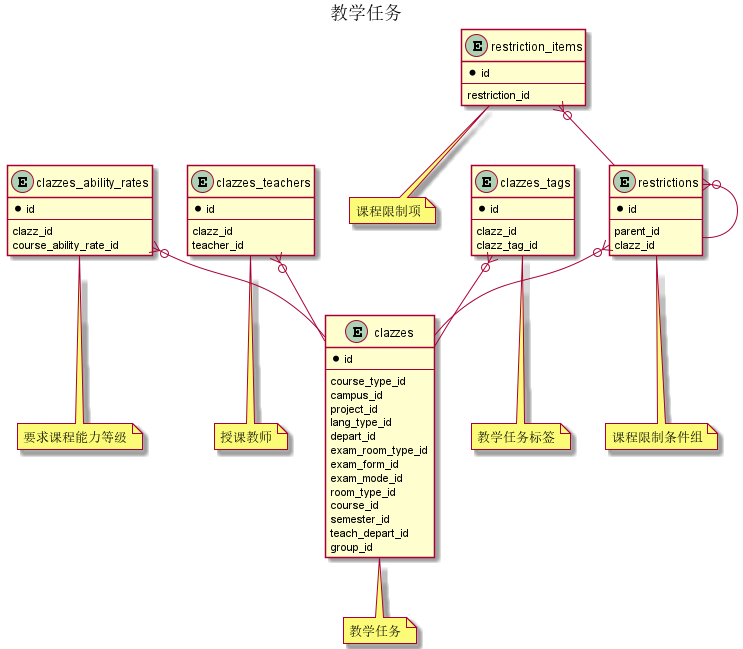
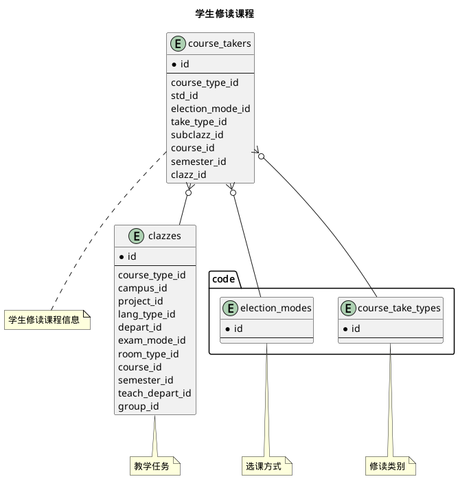
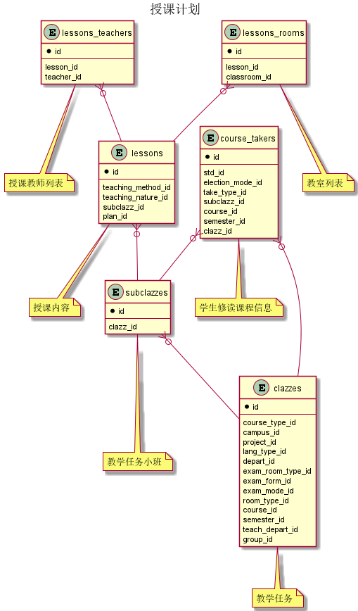
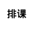



#### 目 录

##### 1. 数据库对象列表
  * [1.1 表格一览](index.html#表格一览)
  * [1.2 模块关系图](index.html#模块关系图)

##### 2. 具体模块明细
* [2.1 教学任务](/model/edu/clazz/clazz.html)
* [2.2 其他](/model/edu/clazz/misc.html)

### 表格一览
Schema edu.clazz下共计26个表，分别如下:

<table class="table table-bordered table-striped table-condensed">
  <tr>
    <th class="info_header text-center">序号</th>
    <th class="info_header">表名/描述</th>
    <th class="info_header text-center">序号</th>
    <th class="info_header">表名/描述</th>
  </tr>
  <tr>
    <td>1</td>
    <td><a href="/model/edu/clazz/misc.html#表格-c_clazz_tags-任务标签">c_clazz_tags</a> 任务标签</td>
    <td>14</td>
    <td><a href="/model/edu/clazz/clazz.html#表格-course_takers-学生修读课程信息">course_takers</a> 学生修读课程信息</td>
  </tr>
  <tr>
    <td>2</td>
    <td><a href="/model/edu/clazz/clazz.html#表格-clazz_activities-教学活动">clazz_activities</a> 教学活动</td>
    <td>15</td>
    <td><a href="/model/edu/clazz/misc.html#表格-final_exams-期末考试安排">final_exams</a> 期末考试安排</td>
  </tr>
  <tr>
    <td>3</td>
    <td><a href="/model/edu/clazz/clazz.html#表格-clazz_activities_rooms-教室列表">clazz_activities_rooms</a> 教室列表</td>
    <td>16</td>
    <td><a href="/model/edu/clazz/clazz.html#表格-lessons-授课内容">lessons</a> 授课内容</td>
  </tr>
  <tr>
    <td>4</td>
    <td><a href="/model/edu/clazz/clazz.html#表格-clazz_activities_teachers-授课教师列表">clazz_activities_teachers</a> 授课教师列表</td>
    <td>17</td>
    <td><a href="/model/edu/clazz/clazz.html#表格-lessons_rooms-教室列表">lessons_rooms</a> 教室列表</td>
  </tr>
  <tr>
    <td>5</td>
    <td><a href="/model/edu/clazz/clazz.html#表格-clazz_bulletins-教学班公告板">clazz_bulletins</a> 教学班公告板</td>
    <td>18</td>
    <td><a href="/model/edu/clazz/clazz.html#表格-lessons_teachers-授课教师列表">lessons_teachers</a> 授课教师列表</td>
  </tr>
  <tr>
    <td>6</td>
    <td><a href="/model/edu/clazz/clazz.html#表格-clazz_groups-教学任务组">clazz_groups</a> 教学任务组</td>
    <td>19</td>
    <td><a href="/model/edu/clazz/clazz.html#表格-restriction_items-课程限制项">restriction_items</a> 课程限制项</td>
  </tr>
  <tr>
    <td>7</td>
    <td><a href="/model/edu/clazz/clazz.html#表格-clazz_materials-教学班资料">clazz_materials</a> 教学班资料</td>
    <td>20</td>
    <td><a href="/model/edu/clazz/clazz.html#表格-restrictions-课程限制条件组">restrictions</a> 课程限制条件组</td>
  </tr>
  <tr>
    <td>8</td>
    <td><a href="/model/edu/clazz/clazz.html#表格-clazz_notice_files-班级公告附件">clazz_notice_files</a> 班级公告附件</td>
    <td>21</td>
    <td><a href="/model/edu/clazz/misc.html#表格-schedule_suggest_activities-排课建议活动">schedule_suggest_activities</a> 排课建议活动</td>
  </tr>
  <tr>
    <td>9</td>
    <td><a href="/model/edu/clazz/clazz.html#表格-clazz_notices-班内通知">clazz_notices</a> 班内通知</td>
    <td>22</td>
    <td><a href="/model/edu/clazz/misc.html#表格-schedule_suggests-排课建议">schedule_suggests</a> 排课建议</td>
  </tr>
  <tr>
    <td>10</td>
    <td><a href="/model/edu/clazz/clazz.html#表格-clazzes-教学任务">clazzes</a> 教学任务</td>
    <td>23</td>
    <td><a href="/model/edu/clazz/misc.html#表格-std_course_abilities-学生课程能力">std_course_abilities</a> 学生课程能力</td>
  </tr>
  <tr>
    <td>11</td>
    <td><a href="/model/edu/clazz/clazz.html#表格-clazzes_ability_rates-要求课程能力等级">clazzes_ability_rates</a> 要求课程能力等级</td>
    <td>24</td>
    <td><a href="/model/edu/clazz/misc.html#表格-std_credit_stats-学生每学期选择教学班限制和统计">std_credit_stats</a> 学生每学期选择教学班限制和统计</td>
  </tr>
  <tr>
    <td>12</td>
    <td><a href="/model/edu/clazz/clazz.html#表格-clazzes_tags-教学任务标签">clazzes_tags</a> 教学任务标签</td>
    <td>25</td>
    <td><a href="/model/edu/clazz/clazz.html#表格-subclazzes-教学任务小班">subclazzes</a> 教学任务小班</td>
  </tr>
  <tr>
    <td>13</td>
    <td><a href="/model/edu/clazz/clazz.html#表格-clazzes_teachers-授课教师">clazzes_teachers</a> 授课教师</td>
    <td>26</td>
    <td><a href="/model/edu/clazz/clazz.html#表格-teaching_plans-授课计划">teaching_plans</a> 授课计划</td>
  </tr>
</table>

### 模块关系图

#### 1. 教学任务
  * 关系图

#### 2. 学生修读课程
  * 关系图

#### 3. 授课计划
  * 关系图

#### 4. 排课
  * 关系图

