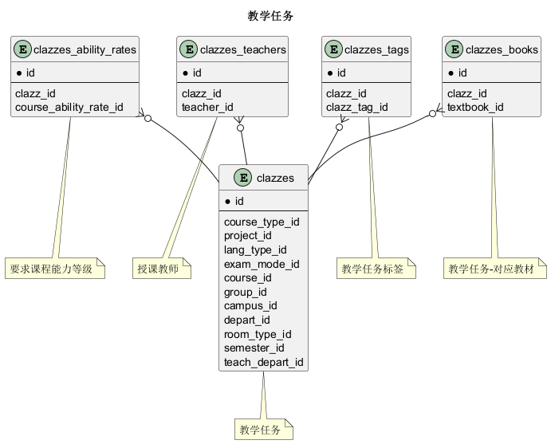
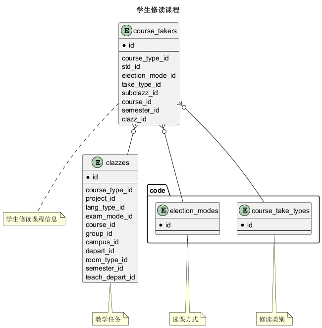
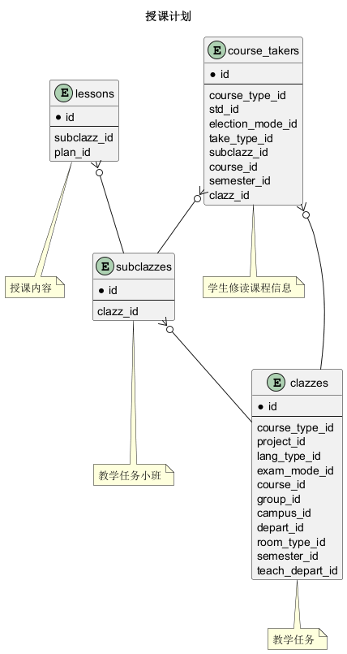
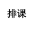

# 教务管理 课程安排 表结构

## 表格一览

<table class="table-mini">
  <thead>
    <tr>
      <th class="info_header text-center" width="7%">序号</th>
      <th class="info_header" width="43%">表名/描述</th>
      <th class="info_header text-center" width="7%">序号</th>
      <th class="info_header" width="43%">表名/描述</th>
    </tr>
  </thead>
  <tbody>
    <tr>
      <td class="text-center">1</td>
      <td><a href="/model/edu/clazz.html#clazz-activities">clazz_activities</a> 教学活动</td>
      <td class="text-center">12</td>
      <td><a href="/model/edu/clazz.html#clazzes">clazzes</a> 教学任务</td>
    </tr>
    <tr>
      <td class="text-center">2</td>
      <td><a href="/model/edu/clazz.html#clazz-activities-rooms">clazz_activities_rooms</a> 教室列表</td>
      <td class="text-center">13</td>
      <td><a href="/model/edu/clazz.html#clazzes-ability-rates">clazzes_ability_rates</a> 要求课程能力等级</td>
    </tr>
    <tr>
      <td class="text-center">3</td>
      <td><a href="/model/edu/clazz.html#clazz-activities-teachers">clazz_activities_teachers</a> 授课教师列表</td>
      <td class="text-center">14</td>
      <td><a href="/model/edu/clazz.html#clazzes-books">clazzes_books</a> 教学任务-对应教材</td>
    </tr>
    <tr>
      <td class="text-center">4</td>
      <td><a href="/model/edu/clazz.html#clazz-bulletins">clazz_bulletins</a> 教学班公告板</td>
      <td class="text-center">15</td>
      <td><a href="/model/edu/clazz.html#clazzes-tags">clazzes_tags</a> 教学任务标签</td>
    </tr>
    <tr>
      <td class="text-center">5</td>
      <td><a href="/model/edu/clazz.html#clazz-docs">clazz_docs</a> 教学班资料</td>
      <td class="text-center">16</td>
      <td><a href="/model/edu/clazz.html#clazzes-teachers">clazzes_teachers</a> 授课教师</td>
    </tr>
    <tr>
      <td class="text-center">6</td>
      <td><a href="/model/edu/clazz.html#clazz-final-exams">clazz_final_exams</a> 期末考试安排</td>
      <td class="text-center">17</td>
      <td><a href="/model/edu/clazz.html#course-takers">course_takers</a> 学生修读课程信息</td>
    </tr>
    <tr>
      <td class="text-center">7</td>
      <td><a href="/model/edu/clazz.html#clazz-groups">clazz_groups</a> 教学任务组</td>
      <td class="text-center">18</td>
      <td><a href="/model/edu/clazz.html#schedule-suggest-activities">schedule_suggest_activities</a> 排课建议活动</td>
    </tr>
    <tr>
      <td class="text-center">8</td>
      <td><a href="/model/edu/clazz.html#clazz-notice-files">clazz_notice_files</a> 班级公告附件</td>
      <td class="text-center">19</td>
      <td><a href="/model/edu/clazz.html#schedule-suggests">schedule_suggests</a> 排课建议</td>
    </tr>
    <tr>
      <td class="text-center">9</td>
      <td><a href="/model/edu/clazz.html#clazz-notices">clazz_notices</a> 班内通知</td>
      <td class="text-center">20</td>
      <td><a href="/model/edu/clazz.html#std-course-abilities">std_course_abilities</a> 学生课程能力</td>
    </tr>
    <tr>
      <td class="text-center">10</td>
      <td><a href="/model/edu/clazz.html#clazz-restriction-items">clazz_restriction_items</a> 课程限制项</td>
      <td class="text-center">21</td>
      <td><a href="/model/edu/clazz.html#std-credit-stats">std_credit_stats</a> 学生每学期选择教学班限制和统计</td>
    </tr>
    <tr>
      <td class="text-center">11</td>
      <td><a href="/model/edu/clazz.html#clazz-restrictions">clazz_restrictions</a> 课程限制条件组</td>
      <td class="text-center">22</td>
      <td><a href="/model/edu/clazz.html#subclazzes">subclazzes</a> 教学任务小班</td>
    </tr>
  </tbody>
</table>

## 关键关系图

### 关系图 1. 教学任务
  * 关系图

### 关系图 2. 学生修读课程
  * 关系图

### 关系图 3. 授课计划
  * 关系图

### 关系图 4. 排课
  * 关系图

## 表格明细

## clazz_activities

<table class="table-entity">
  <tbody>
    <tr>
      <td class="table-entity-title" width="15%">表名:&nbsp;</td>
      <td>edu.clazz_activities 教学活动</td>
    </tr>
    <tr>
      <td class="table-entity-title">唯一约束:&nbsp;</td>
      <td>主键🔑(id) </td>
    </tr>
    <tr>
      <td class="table-entity-title">索引:&nbsp;</td>
      <td>idx_sjlgr9e0wh41aqb4wbj7tyqaj(clazz_id) </td>
    </tr>
  </tbody>
</table>

<table class="table-entity">
  <thead>
    <tr>
<th class="info_header text-center" width="7%">序号</th><th class="info_header" width="20%">字段名</th><th class="info_header" width="20%">字段类型</th><th class="info_header text-center" width="8%">是否可空</th><th class="info_header" width="25%">描述</th><th class="info_header" width="20%">引用表</th>    </tr>
  </thead>
  <tbody>
    <tr>
      <td class="text-center">1</td>
      <td>id</td>
      <td>bigint</td>
      <td class="text-center">否</td>
      <td>非业务主键:datetime</td>
      <td>      </td>
    </tr>
    <tr>
      <td class="text-center">2</td>
      <td>begin_at</td>
      <td>smallint</td>
      <td class="text-center">否</td>
      <td>开始时间</td>
      <td>      </td>
    </tr>
    <tr>
      <td class="text-center">3</td>
      <td>begin_unit</td>
      <td>smallint</td>
      <td class="text-center">否</td>
      <td>开始节次</td>
      <td>      </td>
    </tr>
    <tr>
      <td class="text-center">4</td>
      <td>clazz_id</td>
      <td>bigint</td>
      <td class="text-center">否</td>
      <td>教学任务ID</td>
      <td><a href="/model/edu/clazz.html#clazzes">edu.clazzes</a>      </td>
    </tr>
    <tr>
      <td class="text-center">5</td>
      <td>end_at</td>
      <td>smallint</td>
      <td class="text-center">否</td>
      <td>结束时间</td>
      <td>      </td>
    </tr>
    <tr>
      <td class="text-center">6</td>
      <td>end_unit</td>
      <td>smallint</td>
      <td class="text-center">否</td>
      <td>结束节次</td>
      <td>      </td>
    </tr>
    <tr>
      <td class="text-center">7</td>
      <td>nature_id</td>
      <td>integer</td>
      <td class="text-center">否</td>
      <td>课时分类ID</td>
      <td><a href="/model/code/all.html#teaching-natures">code.teaching_natures</a>      </td>
    </tr>
    <tr>
      <td class="text-center">8</td>
      <td>remark</td>
      <td>varchar(200)</td>
      <td class="text-center">是</td>
      <td>备注</td>
      <td>      </td>
    </tr>
    <tr>
      <td class="text-center">9</td>
      <td>start_on</td>
      <td>date</td>
      <td class="text-center">否</td>
      <td>开始日期</td>
      <td>      </td>
    </tr>
    <tr>
      <td class="text-center">10</td>
      <td>subclazz_id</td>
      <td>bigint</td>
      <td class="text-center">是</td>
      <td>教学任务小班ID</td>
      <td><a href="/model/edu/clazz.html#subclazzes">edu.subclazzes</a>      </td>
    </tr>
    <tr>
      <td class="text-center">11</td>
      <td>weekstate</td>
      <td>bigint</td>
      <td class="text-center">否</td>
      <td>周状态</td>
      <td>      </td>
    </tr>
  </tbody>
</table>

## clazz_activities_rooms

<table class="table-entity">
  <tbody>
    <tr>
      <td class="table-entity-title" width="15%">表名:&nbsp;</td>
      <td>edu.clazz_activities_rooms 教室列表</td>
    </tr>
    <tr>
      <td class="table-entity-title">唯一约束:&nbsp;</td>
      <td>主键🔑(activity_id,classroom_id) </td>
    </tr>
    <tr>
      <td class="table-entity-title">索引:&nbsp;</td>
      <td>idx_lp1ho1db4ui0l4lffulgfn0yk(activity_id) </td>
    </tr>
  </tbody>
</table>

<table class="table-entity">
  <thead>
    <tr>
<th class="info_header text-center" width="7%">序号</th><th class="info_header" width="20%">字段名</th><th class="info_header" width="20%">字段类型</th><th class="info_header text-center" width="8%">是否可空</th><th class="info_header" width="25%">描述</th><th class="info_header" width="20%">引用表</th>    </tr>
  </thead>
  <tbody>
    <tr>
      <td class="text-center">1</td>
      <td>activity_id</td>
      <td>bigint</td>
      <td class="text-center">否</td>
      <td>教学活动ID</td>
      <td><a href="/model/edu/clazz.html#clazz-activities">edu.clazz_activities</a>      </td>
    </tr>
    <tr>
      <td class="text-center">2</td>
      <td>classroom_id</td>
      <td>bigint</td>
      <td class="text-center">否</td>
      <td>教室ID</td>
      <td><a href="/model/base/resource.html#classrooms">base.classrooms</a>      </td>
    </tr>
  </tbody>
</table>

## clazz_activities_teachers

<table class="table-entity">
  <tbody>
    <tr>
      <td class="table-entity-title" width="15%">表名:&nbsp;</td>
      <td>edu.clazz_activities_teachers 授课教师列表</td>
    </tr>
    <tr>
      <td class="table-entity-title">唯一约束:&nbsp;</td>
      <td>主键🔑(activity_id,teacher_id) </td>
    </tr>
    <tr>
      <td class="table-entity-title">索引:&nbsp;</td>
      <td>idx_15kq4qjipsyjesv30panl7d28(activity_id) </td>
    </tr>
  </tbody>
</table>

<table class="table-entity">
  <thead>
    <tr>
<th class="info_header text-center" width="7%">序号</th><th class="info_header" width="20%">字段名</th><th class="info_header" width="20%">字段类型</th><th class="info_header text-center" width="8%">是否可空</th><th class="info_header" width="25%">描述</th><th class="info_header" width="20%">引用表</th>    </tr>
  </thead>
  <tbody>
    <tr>
      <td class="text-center">1</td>
      <td>activity_id</td>
      <td>bigint</td>
      <td class="text-center">否</td>
      <td>教学活动ID</td>
      <td><a href="/model/edu/clazz.html#clazz-activities">edu.clazz_activities</a>      </td>
    </tr>
    <tr>
      <td class="text-center">2</td>
      <td>teacher_id</td>
      <td>bigint</td>
      <td class="text-center">否</td>
      <td>教师信息ID</td>
      <td><a href="/model/base/user.html#teachers">base.teachers</a>      </td>
    </tr>
  </tbody>
</table>

## clazz_bulletins

<table class="table-entity">
  <tbody>
    <tr>
      <td class="table-entity-title" width="15%">表名:&nbsp;</td>
      <td>edu.clazz_bulletins 教学班公告板</td>
    </tr>
    <tr>
      <td class="table-entity-title">唯一约束:&nbsp;</td>
      <td>主键🔑(id) uk_bw61pgrg2iw0irmhs8hof0q0g(clazz_id)</td>
    </tr>
  </tbody>
</table>

<table class="table-entity">
  <thead>
    <tr>
<th class="info_header text-center" width="7%">序号</th><th class="info_header" width="20%">字段名</th><th class="info_header" width="20%">字段类型</th><th class="info_header text-center" width="8%">是否可空</th><th class="info_header" width="25%">描述</th><th class="info_header" width="20%">引用表</th>    </tr>
  </thead>
  <tbody>
    <tr>
      <td class="text-center">1</td>
      <td>id</td>
      <td>bigint</td>
      <td class="text-center">否</td>
      <td>非业务主键:datetime</td>
      <td>      </td>
    </tr>
    <tr>
      <td class="text-center">2</td>
      <td>clazz_id</td>
      <td>bigint</td>
      <td class="text-center">否</td>
      <td>教学任务ID</td>
      <td><a href="/model/edu/clazz.html#clazzes">edu.clazzes</a>      </td>
    </tr>
    <tr>
      <td class="text-center">3</td>
      <td>contact_channel</td>
      <td>varchar(150)</td>
      <td class="text-center">是</td>
      <td>日常联系渠道</td>
      <td>      </td>
    </tr>
    <tr>
      <td class="text-center">4</td>
      <td>contact_qrcode_path</td>
      <td>varchar(300)</td>
      <td class="text-center">是</td>
      <td>日常联系渠道二维码</td>
      <td>      </td>
    </tr>
    <tr>
      <td class="text-center">5</td>
      <td>contents</td>
      <td>varchar(1000)</td>
      <td class="text-center">是</td>
      <td>公告内容</td>
      <td>      </td>
    </tr>
  </tbody>
</table>

## clazz_docs

<table class="table-entity">
  <tbody>
    <tr>
      <td class="table-entity-title" width="15%">表名:&nbsp;</td>
      <td>edu.clazz_docs 教学班资料</td>
    </tr>
    <tr>
      <td class="table-entity-title">唯一约束:&nbsp;</td>
      <td>主键🔑(id) </td>
    </tr>
    <tr>
      <td class="table-entity-title">索引:&nbsp;</td>
      <td>idx_bte7jeq8ko72gnghvj3wxrln1(clazz_id) </td>
    </tr>
  </tbody>
</table>

<table class="table-entity">
  <thead>
    <tr>
<th class="info_header text-center" width="7%">序号</th><th class="info_header" width="20%">字段名</th><th class="info_header" width="20%">字段类型</th><th class="info_header text-center" width="8%">是否可空</th><th class="info_header" width="25%">描述</th><th class="info_header" width="20%">引用表</th>    </tr>
  </thead>
  <tbody>
    <tr>
      <td class="text-center">1</td>
      <td>id</td>
      <td>bigint</td>
      <td class="text-center">否</td>
      <td>非业务主键:datetime</td>
      <td>      </td>
    </tr>
    <tr>
      <td class="text-center">2</td>
      <td>clazz_id</td>
      <td>bigint</td>
      <td class="text-center">否</td>
      <td>教学任务ID</td>
      <td><a href="/model/edu/clazz.html#clazzes">edu.clazzes</a>      </td>
    </tr>
    <tr>
      <td class="text-center">3</td>
      <td>file_path</td>
      <td>varchar(400)</td>
      <td class="text-center">是</td>
      <td>文件路径</td>
      <td>      </td>
    </tr>
    <tr>
      <td class="text-center">4</td>
      <td>name</td>
      <td>varchar(300)</td>
      <td class="text-center">否</td>
      <td>材料名称</td>
      <td>      </td>
    </tr>
    <tr>
      <td class="text-center">5</td>
      <td>updated_at</td>
      <td>timestamptz</td>
      <td class="text-center">否</td>
      <td>更新时间</td>
      <td>      </td>
    </tr>
    <tr>
      <td class="text-center">6</td>
      <td>updated_by_id</td>
      <td>bigint</td>
      <td class="text-center">否</td>
      <td>上传人ID</td>
      <td><a href="/model/base/user.html#users">base.users</a>      </td>
    </tr>
    <tr>
      <td class="text-center">7</td>
      <td>url</td>
      <td>varchar(400)</td>
      <td class="text-center">是</td>
      <td>网址</td>
      <td>      </td>
    </tr>
  </tbody>
</table>

## clazz_final_exams

<table class="table-entity">
  <tbody>
    <tr>
      <td class="table-entity-title" width="15%">表名:&nbsp;</td>
      <td>edu.clazz_final_exams 期末考试安排</td>
    </tr>
    <tr>
      <td class="table-entity-title">唯一约束:&nbsp;</td>
      <td>主键🔑(id) uk_j4vo8w3lb8v157ssmw709sga8(clazz_id)</td>
    </tr>
  </tbody>
</table>

<table class="table-entity">
  <thead>
    <tr>
<th class="info_header text-center" width="7%">序号</th><th class="info_header" width="20%">字段名</th><th class="info_header" width="20%">字段类型</th><th class="info_header text-center" width="8%">是否可空</th><th class="info_header" width="25%">描述</th><th class="info_header" width="20%">引用表</th>    </tr>
  </thead>
  <tbody>
    <tr>
      <td class="text-center">1</td>
      <td>id</td>
      <td>bigint</td>
      <td class="text-center">否</td>
      <td>非业务主键:datetime</td>
      <td>      </td>
    </tr>
    <tr>
      <td class="text-center">2</td>
      <td>begin_at</td>
      <td>smallint</td>
      <td class="text-center">否</td>
      <td>开始时间</td>
      <td>      </td>
    </tr>
    <tr>
      <td class="text-center">3</td>
      <td>clazz_id</td>
      <td>bigint</td>
      <td class="text-center">否</td>
      <td>教学任务ID</td>
      <td><a href="/model/edu/clazz.html#clazzes">edu.clazzes</a>      </td>
    </tr>
    <tr>
      <td class="text-center">4</td>
      <td>end_at</td>
      <td>smallint</td>
      <td class="text-center">否</td>
      <td>结束时间</td>
      <td>      </td>
    </tr>
    <tr>
      <td class="text-center">5</td>
      <td>exam_duration</td>
      <td>smallint</td>
      <td class="text-center">否</td>
      <td>考试时长</td>
      <td>      </td>
    </tr>
    <tr>
      <td class="text-center">6</td>
      <td>exam_form_id</td>
      <td>integer</td>
      <td class="text-center">是</td>
      <td>考试形式ID</td>
      <td><a href="/model/code/all.html#exam-forms">code.exam_forms</a>      </td>
    </tr>
    <tr>
      <td class="text-center">7</td>
      <td>exam_on</td>
      <td>date</td>
      <td class="text-center">是</td>
      <td>考试时间</td>
      <td>      </td>
    </tr>
    <tr>
      <td class="text-center">8</td>
      <td>room_type_id</td>
      <td>integer</td>
      <td class="text-center">是</td>
      <td>教室类型ID</td>
      <td><a href="/model/code/all.html#classroom-types">code.classroom_types</a>      </td>
    </tr>
  </tbody>
</table>

## clazz_groups

<table class="table-entity">
  <tbody>
    <tr>
      <td class="table-entity-title" width="15%">表名:&nbsp;</td>
      <td>edu.clazz_groups 教学任务组</td>
    </tr>
    <tr>
      <td class="table-entity-title">唯一约束:&nbsp;</td>
      <td>主键🔑(id) </td>
    </tr>
  </tbody>
</table>

<table class="table-entity">
  <thead>
    <tr>
<th class="info_header text-center" width="7%">序号</th><th class="info_header" width="20%">字段名</th><th class="info_header" width="20%">字段类型</th><th class="info_header text-center" width="8%">是否可空</th><th class="info_header" width="25%">描述</th><th class="info_header" width="20%">引用表</th>    </tr>
  </thead>
  <tbody>
    <tr>
      <td class="text-center">1</td>
      <td>id</td>
      <td>bigint</td>
      <td class="text-center">否</td>
      <td>非业务主键:datetime</td>
      <td>      </td>
    </tr>
    <tr>
      <td class="text-center">2</td>
      <td>course_id</td>
      <td>bigint</td>
      <td class="text-center">是</td>
      <td>课程ID</td>
      <td><a href="/model/base/edu.html#courses">base.courses</a>      </td>
    </tr>
    <tr>
      <td class="text-center">3</td>
      <td>name</td>
      <td>varchar(255)</td>
      <td class="text-center">否</td>
      <td>组名称</td>
      <td>      </td>
    </tr>
    <tr>
      <td class="text-center">4</td>
      <td>project_id</td>
      <td>integer</td>
      <td class="text-center">否</td>
      <td>项目ID</td>
      <td><a href="/model/base/edu.html#projects">base.projects</a>      </td>
    </tr>
    <tr>
      <td class="text-center">5</td>
      <td>semester_id</td>
      <td>integer</td>
      <td class="text-center">否</td>
      <td>学期ID</td>
      <td><a href="/model/base/time.html#semesters">base.semesters</a>      </td>
    </tr>
    <tr>
      <td class="text-center">6</td>
      <td>teach_depart_id</td>
      <td>integer</td>
      <td class="text-center">是</td>
      <td>开课部门ID</td>
      <td><a href="/model/base/user.html#departments">base.departments</a>      </td>
    </tr>
  </tbody>
</table>

## clazz_notice_files

<table class="table-entity">
  <tbody>
    <tr>
      <td class="table-entity-title" width="15%">表名:&nbsp;</td>
      <td>edu.clazz_notice_files 班级公告附件</td>
    </tr>
    <tr>
      <td class="table-entity-title">唯一约束:&nbsp;</td>
      <td>主键🔑(id) </td>
    </tr>
    <tr>
      <td class="table-entity-title">索引:&nbsp;</td>
      <td>idx_ifw02k8m49nnnsixxeic5irmd(notice_id) </td>
    </tr>
  </tbody>
</table>

<table class="table-entity">
  <thead>
    <tr>
<th class="info_header text-center" width="7%">序号</th><th class="info_header" width="20%">字段名</th><th class="info_header" width="20%">字段类型</th><th class="info_header text-center" width="8%">是否可空</th><th class="info_header" width="25%">描述</th><th class="info_header" width="20%">引用表</th>    </tr>
  </thead>
  <tbody>
    <tr>
      <td class="text-center">1</td>
      <td>id</td>
      <td>bigint</td>
      <td class="text-center">否</td>
      <td>非业务主键:datetime</td>
      <td>      </td>
    </tr>
    <tr>
      <td class="text-center">2</td>
      <td>file_path</td>
      <td>varchar(200)</td>
      <td class="text-center">否</td>
      <td>文件路径</td>
      <td>      </td>
    </tr>
    <tr>
      <td class="text-center">3</td>
      <td>media_type</td>
      <td>varchar(100)</td>
      <td class="text-center">否</td>
      <td>类型</td>
      <td>      </td>
    </tr>
    <tr>
      <td class="text-center">4</td>
      <td>name</td>
      <td>varchar(255)</td>
      <td class="text-center">否</td>
      <td>名称</td>
      <td>      </td>
    </tr>
    <tr>
      <td class="text-center">5</td>
      <td>notice_id</td>
      <td>bigint</td>
      <td class="text-center">否</td>
      <td>班内通知ID</td>
      <td><a href="/model/edu/clazz.html#clazz-notices">edu.clazz_notices</a>      </td>
    </tr>
    <tr>
      <td class="text-center">6</td>
      <td>updated_at</td>
      <td>timestamptz</td>
      <td class="text-center">否</td>
      <td>更新时间</td>
      <td>      </td>
    </tr>
  </tbody>
</table>

## clazz_notices

<table class="table-entity">
  <tbody>
    <tr>
      <td class="table-entity-title" width="15%">表名:&nbsp;</td>
      <td>edu.clazz_notices 班内通知</td>
    </tr>
    <tr>
      <td class="table-entity-title">唯一约束:&nbsp;</td>
      <td>主键🔑(id) </td>
    </tr>
    <tr>
      <td class="table-entity-title">索引:&nbsp;</td>
      <td>idx_etjnc5p0edykl4yjenl8f5aqo(clazz_id) </td>
    </tr>
  </tbody>
</table>

<table class="table-entity">
  <thead>
    <tr>
<th class="info_header text-center" width="7%">序号</th><th class="info_header" width="20%">字段名</th><th class="info_header" width="20%">字段类型</th><th class="info_header text-center" width="8%">是否可空</th><th class="info_header" width="25%">描述</th><th class="info_header" width="20%">引用表</th>    </tr>
  </thead>
  <tbody>
    <tr>
      <td class="text-center">1</td>
      <td>id</td>
      <td>bigint</td>
      <td class="text-center">否</td>
      <td>非业务主键:datetime</td>
      <td>      </td>
    </tr>
    <tr>
      <td class="text-center">2</td>
      <td>clazz_id</td>
      <td>bigint</td>
      <td class="text-center">否</td>
      <td>教学任务ID</td>
      <td><a href="/model/edu/clazz.html#clazzes">edu.clazzes</a>      </td>
    </tr>
    <tr>
      <td class="text-center">3</td>
      <td>contents</td>
      <td>varchar(1500)</td>
      <td class="text-center">否</td>
      <td>内容</td>
      <td>      </td>
    </tr>
    <tr>
      <td class="text-center">4</td>
      <td>title</td>
      <td>varchar(300)</td>
      <td class="text-center">否</td>
      <td>标题</td>
      <td>      </td>
    </tr>
    <tr>
      <td class="text-center">5</td>
      <td>updated_at</td>
      <td>timestamptz</td>
      <td class="text-center">否</td>
      <td>更新时间</td>
      <td>      </td>
    </tr>
    <tr>
      <td class="text-center">6</td>
      <td>updated_by_id</td>
      <td>bigint</td>
      <td class="text-center">否</td>
      <td>发布人ID</td>
      <td><a href="/model/base/user.html#users">base.users</a>      </td>
    </tr>
  </tbody>
</table>

## clazz_restriction_items

<table class="table-entity">
  <tbody>
    <tr>
      <td class="table-entity-title" width="15%">表名:&nbsp;</td>
      <td>edu.clazz_restriction_items 课程限制项</td>
    </tr>
    <tr>
      <td class="table-entity-title">唯一约束:&nbsp;</td>
      <td>主键🔑(id) </td>
    </tr>
    <tr>
      <td class="table-entity-title">索引:&nbsp;</td>
      <td>idx_tarm0ae4yoy7g95d7dlndehcj(restriction_id) </td>
    </tr>
  </tbody>
</table>

<table class="table-entity">
  <thead>
    <tr>
<th class="info_header text-center" width="7%">序号</th><th class="info_header" width="20%">字段名</th><th class="info_header" width="20%">字段类型</th><th class="info_header text-center" width="8%">是否可空</th><th class="info_header" width="25%">描述</th><th class="info_header" width="20%">引用表</th>    </tr>
  </thead>
  <tbody>
    <tr>
      <td class="text-center">1</td>
      <td>id</td>
      <td>bigint</td>
      <td class="text-center">否</td>
      <td>非业务主键:datetime</td>
      <td>      </td>
    </tr>
    <tr>
      <td class="text-center">2</td>
      <td>contents</td>
      <td>varchar(1000)</td>
      <td class="text-center">否</td>
      <td>限制内容</td>
      <td>      </td>
    </tr>
    <tr>
      <td class="text-center">3</td>
      <td>included</td>
      <td>boolean</td>
      <td class="text-center">否</td>
      <td>是否包含限定内容</td>
      <td>      </td>
    </tr>
    <tr>
      <td class="text-center">4</td>
      <td>meta</td>
      <td>integer</td>
      <td class="text-center">否</td>
      <td>限制具体项目</td>
      <td>      </td>
    </tr>
    <tr>
      <td class="text-center">5</td>
      <td>restriction_id</td>
      <td>bigint</td>
      <td class="text-center">否</td>
      <td>所在限制组ID</td>
      <td><a href="/model/edu/clazz.html#clazz-restrictions">edu.clazz_restrictions</a>      </td>
    </tr>
  </tbody>
</table>

## clazz_restrictions

<table class="table-entity">
  <tbody>
    <tr>
      <td class="table-entity-title" width="15%">表名:&nbsp;</td>
      <td>edu.clazz_restrictions 课程限制条件组</td>
    </tr>
    <tr>
      <td class="table-entity-title">唯一约束:&nbsp;</td>
      <td>主键🔑(id) </td>
    </tr>
    <tr>
      <td class="table-entity-title">索引:&nbsp;</td>
      <td>idx_qgp3bg29kpkhk1sclrxxklhos(clazz_id) ,idx_eu8m90l4434qlu64236gaxwd4(parent_id) </td>
    </tr>
  </tbody>
</table>

<table class="table-entity">
  <thead>
    <tr>
<th class="info_header text-center" width="7%">序号</th><th class="info_header" width="20%">字段名</th><th class="info_header" width="20%">字段类型</th><th class="info_header text-center" width="8%">是否可空</th><th class="info_header" width="25%">描述</th><th class="info_header" width="20%">引用表</th>    </tr>
  </thead>
  <tbody>
    <tr>
      <td class="text-center">1</td>
      <td>id</td>
      <td>bigint</td>
      <td class="text-center">否</td>
      <td>非业务主键:datetime</td>
      <td>      </td>
    </tr>
    <tr>
      <td class="text-center">2</td>
      <td>clazz_id</td>
      <td>bigint</td>
      <td class="text-center">否</td>
      <td>教学任务ID</td>
      <td><a href="/model/edu/clazz.html#clazzes">edu.clazzes</a>      </td>
    </tr>
    <tr>
      <td class="text-center">3</td>
      <td>cur_count</td>
      <td>integer</td>
      <td class="text-center">否</td>
      <td>当前人数</td>
      <td>      </td>
    </tr>
    <tr>
      <td class="text-center">4</td>
      <td>max_count</td>
      <td>integer</td>
      <td class="text-center">否</td>
      <td>最大人数</td>
      <td>      </td>
    </tr>
    <tr>
      <td class="text-center">5</td>
      <td>parent_id</td>
      <td>bigint</td>
      <td class="text-center">是</td>
      <td>上级组ID</td>
      <td><a href="/model/edu/clazz.html#clazz-restrictions">edu.clazz_restrictions</a>      </td>
    </tr>
    <tr>
      <td class="text-center">6</td>
      <td>prime</td>
      <td>boolean</td>
      <td class="text-center">否</td>
      <td>是否主要授课对象</td>
      <td>      </td>
    </tr>
  </tbody>
</table>

## clazzes

<table class="table-entity">
  <tbody>
    <tr>
      <td class="table-entity-title" width="15%">表名:&nbsp;</td>
      <td>edu.clazzes 教学任务</td>
    </tr>
    <tr>
      <td class="table-entity-title">唯一约束:&nbsp;</td>
      <td>主键🔑(id) uk_8xuvd3v6lnrq5xmcl8jje0yau(project_id,semester_id,crn)</td>
    </tr>
    <tr>
      <td class="table-entity-title">索引:&nbsp;</td>
      <td>idx_9bwygbyci888eug6sjs5ihbqq(project_id,semester_id,teach_depart_id) ,idx_2nu751wwcosaoh3kd2a36ycdj(group_id) </td>
    </tr>
  </tbody>
</table>

<table class="table-entity">
  <thead>
    <tr>
<th class="info_header text-center" width="7%">序号</th><th class="info_header" width="20%">字段名</th><th class="info_header" width="20%">字段类型</th><th class="info_header text-center" width="8%">是否可空</th><th class="info_header" width="25%">描述</th><th class="info_header" width="20%">引用表</th>    </tr>
  </thead>
  <tbody>
    <tr>
      <td class="text-center">1</td>
      <td>id</td>
      <td>bigint</td>
      <td class="text-center">否</td>
      <td>非业务主键:datetime</td>
      <td>      </td>
    </tr>
    <tr>
      <td class="text-center">2</td>
      <td>campus_id</td>
      <td>integer</td>
      <td class="text-center">否</td>
      <td>开课校区ID</td>
      <td><a href="/model/base/resource.html#campuses">base.campuses</a>      </td>
    </tr>
    <tr>
      <td class="text-center">3</td>
      <td>capacity</td>
      <td>integer</td>
      <td class="text-center">否</td>
      <td>人数上限</td>
      <td>      </td>
    </tr>
    <tr>
      <td class="text-center">4</td>
      <td>capacity_locked</td>
      <td>boolean</td>
      <td class="text-center">否</td>
      <td>是否锁定上限</td>
      <td>      </td>
    </tr>
    <tr>
      <td class="text-center">5</td>
      <td>clazz_name</td>
      <td>varchar(500)</td>
      <td class="text-center">否</td>
      <td>教学班名称</td>
      <td>      </td>
    </tr>
    <tr>
      <td class="text-center">6</td>
      <td>course_id</td>
      <td>bigint</td>
      <td class="text-center">否</td>
      <td>课程ID</td>
      <td><a href="/model/base/edu.html#courses">base.courses</a>      </td>
    </tr>
    <tr>
      <td class="text-center">7</td>
      <td>course_profile_id</td>
      <td>bigint</td>
      <td class="text-center">是</td>
      <td>课程介绍ID</td>
      <td>      </td>
    </tr>
    <tr>
      <td class="text-center">8</td>
      <td>course_type_id</td>
      <td>integer</td>
      <td class="text-center">否</td>
      <td>课程类别ID</td>
      <td><a href="/model/code/all.html#course-types">code.course_types</a>      </td>
    </tr>
    <tr>
      <td class="text-center">9</td>
      <td>credit_hours</td>
      <td>integer</td>
      <td class="text-center">否</td>
      <td>学时</td>
      <td>      </td>
    </tr>
    <tr>
      <td class="text-center">10</td>
      <td>crn</td>
      <td>varchar(32)</td>
      <td class="text-center">否</td>
      <td>课程序号</td>
      <td>      </td>
    </tr>
    <tr>
      <td class="text-center">11</td>
      <td>depart_arranged</td>
      <td>boolean</td>
      <td class="text-center">否</td>
      <td>是否开课院系负责安排</td>
      <td>      </td>
    </tr>
    <tr>
      <td class="text-center">12</td>
      <td>depart_id</td>
      <td>integer</td>
      <td class="text-center">是</td>
      <td>学生所在部门ID</td>
      <td><a href="/model/base/user.html#departments">base.departments</a>      </td>
    </tr>
    <tr>
      <td class="text-center">13</td>
      <td>exam_mode_id</td>
      <td>integer</td>
      <td class="text-center">否</td>
      <td>考核方式ID</td>
      <td><a href="/model/code/all.html#exam-modes">code.exam_modes</a>      </td>
    </tr>
    <tr>
      <td class="text-center">14</td>
      <td>gender_ratio</td>
      <td>smallint</td>
      <td class="text-center">否</td>
      <td>男女比</td>
      <td>      </td>
    </tr>
    <tr>
      <td class="text-center">15</td>
      <td>grades</td>
      <td>varchar(40)</td>
      <td class="text-center">是</td>
      <td>年级</td>
      <td>      </td>
    </tr>
    <tr>
      <td class="text-center">16</td>
      <td>group_id</td>
      <td>bigint</td>
      <td class="text-center">是</td>
      <td>所属课程组ID</td>
      <td><a href="/model/edu/clazz.html#clazz-groups">edu.clazz_groups</a>      </td>
    </tr>
    <tr>
      <td class="text-center">17</td>
      <td>has_makeup</td>
      <td>boolean</td>
      <td class="text-center">否</td>
      <td>是否有补考</td>
      <td>      </td>
    </tr>
    <tr>
      <td class="text-center">18</td>
      <td>lang_type_id</td>
      <td>integer</td>
      <td class="text-center">否</td>
      <td>授课语言类型ID</td>
      <td><a href="/model/code/all.html#teach-lang-types">code.teach_lang_types</a>      </td>
    </tr>
    <tr>
      <td class="text-center">19</td>
      <td>plan_id</td>
      <td>bigint</td>
      <td class="text-center">是</td>
      <td>执行计划ID</td>
      <td>      </td>
    </tr>
    <tr>
      <td class="text-center">20</td>
      <td>project_id</td>
      <td>integer</td>
      <td class="text-center">否</td>
      <td>项目ID</td>
      <td><a href="/model/base/edu.html#projects">base.projects</a>      </td>
    </tr>
    <tr>
      <td class="text-center">21</td>
      <td>remark</td>
      <td>varchar(255)</td>
      <td class="text-center">是</td>
      <td>备注</td>
      <td>      </td>
    </tr>
    <tr>
      <td class="text-center">22</td>
      <td>reserved_count</td>
      <td>integer</td>
      <td class="text-center">否</td>
      <td>保留人数</td>
      <td>      </td>
    </tr>
    <tr>
      <td class="text-center">23</td>
      <td>room_type_id</td>
      <td>integer</td>
      <td class="text-center">否</td>
      <td>教室类型ID</td>
      <td><a href="/model/code/all.html#classroom-types">code.classroom_types</a>      </td>
    </tr>
    <tr>
      <td class="text-center">24</td>
      <td>semester_id</td>
      <td>integer</td>
      <td class="text-center">否</td>
      <td>教学日历ID</td>
      <td><a href="/model/base/time.html#semesters">base.semesters</a>      </td>
    </tr>
    <tr>
      <td class="text-center">25</td>
      <td>shared</td>
      <td>boolean</td>
      <td class="text-center">否</td>
      <td>是否全校共享</td>
      <td>      </td>
    </tr>
    <tr>
      <td class="text-center">26</td>
      <td>status</td>
      <td>integer</td>
      <td class="text-center">否</td>
      <td>审核状态</td>
      <td>      </td>
    </tr>
    <tr>
      <td class="text-center">27</td>
      <td>std_count</td>
      <td>integer</td>
      <td class="text-center">否</td>
      <td>学生人数</td>
      <td>      </td>
    </tr>
    <tr>
      <td class="text-center">28</td>
      <td>subject</td>
      <td>varchar(255)</td>
      <td class="text-center">是</td>
      <td>主题</td>
      <td>      </td>
    </tr>
    <tr>
      <td class="text-center">29</td>
      <td>teach_depart_id</td>
      <td>integer</td>
      <td class="text-center">否</td>
      <td>开课院系ID</td>
      <td><a href="/model/base/user.html#departments">base.departments</a>      </td>
    </tr>
    <tr>
      <td class="text-center">30</td>
      <td>updated_at</td>
      <td>timestamptz</td>
      <td class="text-center">否</td>
      <td>更新时间</td>
      <td>      </td>
    </tr>
    <tr>
      <td class="text-center">31</td>
      <td>week_hours</td>
      <td>integer</td>
      <td class="text-center">否</td>
      <td>周课时</td>
      <td>      </td>
    </tr>
    <tr>
      <td class="text-center">32</td>
      <td>weekstate</td>
      <td>bigint</td>
      <td class="text-center">否</td>
      <td>周状态</td>
      <td>      </td>
    </tr>
  </tbody>
</table>

## clazzes_ability_rates

<table class="table-entity">
  <tbody>
    <tr>
      <td class="table-entity-title" width="15%">表名:&nbsp;</td>
      <td>edu.clazzes_ability_rates 要求课程能力等级</td>
    </tr>
    <tr>
      <td class="table-entity-title">唯一约束:&nbsp;</td>
      <td>主键🔑(clazz_id,course_ability_rate_id) </td>
    </tr>
    <tr>
      <td class="table-entity-title">索引:&nbsp;</td>
      <td>idx_dtwnr7ysxuukruvulscomb6on(clazz_id) </td>
    </tr>
  </tbody>
</table>

<table class="table-entity">
  <thead>
    <tr>
<th class="info_header text-center" width="7%">序号</th><th class="info_header" width="20%">字段名</th><th class="info_header" width="20%">字段类型</th><th class="info_header text-center" width="8%">是否可空</th><th class="info_header" width="25%">描述</th><th class="info_header" width="20%">引用表</th>    </tr>
  </thead>
  <tbody>
    <tr>
      <td class="text-center">1</td>
      <td>clazz_id</td>
      <td>bigint</td>
      <td class="text-center">否</td>
      <td>教学任务ID</td>
      <td><a href="/model/edu/clazz.html#clazzes">edu.clazzes</a>      </td>
    </tr>
    <tr>
      <td class="text-center">2</td>
      <td>course_ability_rate_id</td>
      <td>integer</td>
      <td class="text-center">否</td>
      <td>课程能力等级ID</td>
      <td><a href="/model/code/all.html#course-ability-rates">code.course_ability_rates</a>      </td>
    </tr>
  </tbody>
</table>

## clazzes_books

<table class="table-entity">
  <tbody>
    <tr>
      <td class="table-entity-title" width="15%">表名:&nbsp;</td>
      <td>edu.clazzes_books 教学任务-对应教材</td>
    </tr>
    <tr>
      <td class="table-entity-title">唯一约束:&nbsp;</td>
      <td>主键🔑(clazz_id,textbook_id) </td>
    </tr>
    <tr>
      <td class="table-entity-title">索引:&nbsp;</td>
      <td>idx_k0yuoagy6nvrf7ofks8j0dyg5(clazz_id) </td>
    </tr>
  </tbody>
</table>

<table class="table-entity">
  <thead>
    <tr>
<th class="info_header text-center" width="7%">序号</th><th class="info_header" width="20%">字段名</th><th class="info_header" width="20%">字段类型</th><th class="info_header text-center" width="8%">是否可空</th><th class="info_header" width="25%">描述</th><th class="info_header" width="20%">引用表</th>    </tr>
  </thead>
  <tbody>
    <tr>
      <td class="text-center">1</td>
      <td>clazz_id</td>
      <td>bigint</td>
      <td class="text-center">否</td>
      <td>教学任务ID</td>
      <td><a href="/model/edu/clazz.html#clazzes">edu.clazzes</a>      </td>
    </tr>
    <tr>
      <td class="text-center">2</td>
      <td>textbook_id</td>
      <td>bigint</td>
      <td class="text-center">否</td>
      <td>教材ID</td>
      <td><a href="/model/base/edu.html#textbooks">base.textbooks</a>      </td>
    </tr>
  </tbody>
</table>

## clazzes_tags

<table class="table-entity">
  <tbody>
    <tr>
      <td class="table-entity-title" width="15%">表名:&nbsp;</td>
      <td>edu.clazzes_tags 教学任务标签</td>
    </tr>
    <tr>
      <td class="table-entity-title">唯一约束:&nbsp;</td>
      <td>主键🔑(clazz_id,clazz_tag_id) </td>
    </tr>
    <tr>
      <td class="table-entity-title">索引:&nbsp;</td>
      <td>idx_8w82phrf16wpnbxdoqo3otrtk(clazz_id) </td>
    </tr>
  </tbody>
</table>

<table class="table-entity">
  <thead>
    <tr>
<th class="info_header text-center" width="7%">序号</th><th class="info_header" width="20%">字段名</th><th class="info_header" width="20%">字段类型</th><th class="info_header text-center" width="8%">是否可空</th><th class="info_header" width="25%">描述</th><th class="info_header" width="20%">引用表</th>    </tr>
  </thead>
  <tbody>
    <tr>
      <td class="text-center">1</td>
      <td>clazz_id</td>
      <td>bigint</td>
      <td class="text-center">否</td>
      <td>教学任务ID</td>
      <td><a href="/model/edu/clazz.html#clazzes">edu.clazzes</a>      </td>
    </tr>
    <tr>
      <td class="text-center">2</td>
      <td>clazz_tag_id</td>
      <td>integer</td>
      <td class="text-center">否</td>
      <td>任务标签ID</td>
      <td><a href="/model/code/all.html#clazz-tags">code.clazz_tags</a>      </td>
    </tr>
  </tbody>
</table>

## clazzes_teachers

<table class="table-entity">
  <tbody>
    <tr>
      <td class="table-entity-title" width="15%">表名:&nbsp;</td>
      <td>edu.clazzes_teachers 授课教师</td>
    </tr>
    <tr>
      <td class="table-entity-title">唯一约束:&nbsp;</td>
      <td>主键🔑(clazz_id,teacher_id,idx) </td>
    </tr>
    <tr>
      <td class="table-entity-title">索引:&nbsp;</td>
      <td>idx_ljvsyyihis2oe1m3gt3rffg2m(clazz_id) </td>
    </tr>
  </tbody>
</table>

<table class="table-entity">
  <thead>
    <tr>
<th class="info_header text-center" width="7%">序号</th><th class="info_header" width="20%">字段名</th><th class="info_header" width="20%">字段类型</th><th class="info_header text-center" width="8%">是否可空</th><th class="info_header" width="25%">描述</th><th class="info_header" width="20%">引用表</th>    </tr>
  </thead>
  <tbody>
    <tr>
      <td class="text-center">1</td>
      <td>clazz_id</td>
      <td>bigint</td>
      <td class="text-center">否</td>
      <td>教学任务ID</td>
      <td><a href="/model/edu/clazz.html#clazzes">edu.clazzes</a>      </td>
    </tr>
    <tr>
      <td class="text-center">2</td>
      <td>idx</td>
      <td>integer</td>
      <td class="text-center">否</td>
      <td>index no</td>
      <td>      </td>
    </tr>
    <tr>
      <td class="text-center">3</td>
      <td>teacher_id</td>
      <td>bigint</td>
      <td class="text-center">否</td>
      <td>教师信息ID</td>
      <td><a href="/model/base/user.html#teachers">base.teachers</a>      </td>
    </tr>
  </tbody>
</table>

## course_takers

<table class="table-entity">
  <tbody>
    <tr>
      <td class="table-entity-title" width="15%">表名:&nbsp;</td>
      <td>edu.course_takers 学生修读课程信息</td>
    </tr>
    <tr>
      <td class="table-entity-title">唯一约束:&nbsp;</td>
      <td>主键🔑(id) uk_9pqkafkcyi7pe6799lg614vay(std_id,course_id,semester_id)</td>
    </tr>
    <tr>
      <td class="table-entity-title">索引:&nbsp;</td>
      <td>idx_cg1338egu7o03diaf8h2ebjvp(clazz_id) ,idx_9l1h3gh5tajelrpwlja4rvoeu(semester_id) </td>
    </tr>
  </tbody>
</table>

<table class="table-entity">
  <thead>
    <tr>
<th class="info_header text-center" width="7%">序号</th><th class="info_header" width="20%">字段名</th><th class="info_header" width="20%">字段类型</th><th class="info_header text-center" width="8%">是否可空</th><th class="info_header" width="25%">描述</th><th class="info_header" width="20%">引用表</th>    </tr>
  </thead>
  <tbody>
    <tr>
      <td class="text-center">1</td>
      <td>id</td>
      <td>bigint</td>
      <td class="text-center">否</td>
      <td>非业务主键:datetime</td>
      <td>      </td>
    </tr>
    <tr>
      <td class="text-center">2</td>
      <td>alternative</td>
      <td>boolean</td>
      <td class="text-center">否</td>
      <td>是否替代</td>
      <td>      </td>
    </tr>
    <tr>
      <td class="text-center">3</td>
      <td>clazz_id</td>
      <td>bigint</td>
      <td class="text-center">否</td>
      <td>教学任务ID</td>
      <td><a href="/model/edu/clazz.html#clazzes">edu.clazzes</a>      </td>
    </tr>
    <tr>
      <td class="text-center">4</td>
      <td>course_id</td>
      <td>bigint</td>
      <td class="text-center">否</td>
      <td>课程基本信息ID</td>
      <td><a href="/model/base/edu.html#courses">base.courses</a>      </td>
    </tr>
    <tr>
      <td class="text-center">5</td>
      <td>course_type_id</td>
      <td>integer</td>
      <td class="text-center">否</td>
      <td>课程类别ID</td>
      <td><a href="/model/code/all.html#course-types">code.course_types</a>      </td>
    </tr>
    <tr>
      <td class="text-center">6</td>
      <td>election_mode_id</td>
      <td>integer</td>
      <td class="text-center">否</td>
      <td>选课方式ID</td>
      <td><a href="/model/code/all.html#election-modes">code.election_modes</a>      </td>
    </tr>
    <tr>
      <td class="text-center">7</td>
      <td>free_listening</td>
      <td>boolean</td>
      <td class="text-center">否</td>
      <td>是否免听</td>
      <td>      </td>
    </tr>
    <tr>
      <td class="text-center">8</td>
      <td>remark</td>
      <td>varchar(100)</td>
      <td class="text-center">是</td>
      <td>备注</td>
      <td>      </td>
    </tr>
    <tr>
      <td class="text-center">9</td>
      <td>semester_id</td>
      <td>integer</td>
      <td class="text-center">否</td>
      <td>学年学期ID</td>
      <td><a href="/model/base/time.html#semesters">base.semesters</a>      </td>
    </tr>
    <tr>
      <td class="text-center">10</td>
      <td>std_id</td>
      <td>bigint</td>
      <td class="text-center">否</td>
      <td>学生ID</td>
      <td><a href="/model/base/edu.html#students">base.students</a>      </td>
    </tr>
    <tr>
      <td class="text-center">11</td>
      <td>subclazz_id</td>
      <td>bigint</td>
      <td class="text-center">是</td>
      <td>教学任务小班ID</td>
      <td><a href="/model/edu/clazz.html#subclazzes">edu.subclazzes</a>      </td>
    </tr>
    <tr>
      <td class="text-center">12</td>
      <td>take_type_id</td>
      <td>integer</td>
      <td class="text-center">否</td>
      <td>修读类别ID</td>
      <td><a href="/model/code/all.html#course-take-types">code.course_take_types</a>      </td>
    </tr>
    <tr>
      <td class="text-center">13</td>
      <td>updated_at</td>
      <td>timestamptz</td>
      <td class="text-center">否</td>
      <td>更新时间</td>
      <td>      </td>
    </tr>
  </tbody>
</table>

## schedule_suggest_activities

<table class="table-entity">
  <tbody>
    <tr>
      <td class="table-entity-title" width="15%">表名:&nbsp;</td>
      <td>edu.schedule_suggest_activities 排课建议活动</td>
    </tr>
    <tr>
      <td class="table-entity-title">唯一约束:&nbsp;</td>
      <td>主键🔑(id) </td>
    </tr>
    <tr>
      <td class="table-entity-title">索引:&nbsp;</td>
      <td>idx_nw4fpd24j0jdnkjmyucxb8gkp(suggest_id) </td>
    </tr>
  </tbody>
</table>

<table class="table-entity">
  <thead>
    <tr>
<th class="info_header text-center" width="7%">序号</th><th class="info_header" width="20%">字段名</th><th class="info_header" width="20%">字段类型</th><th class="info_header text-center" width="8%">是否可空</th><th class="info_header" width="25%">描述</th><th class="info_header" width="20%">引用表</th>    </tr>
  </thead>
  <tbody>
    <tr>
      <td class="text-center">1</td>
      <td>id</td>
      <td>bigint</td>
      <td class="text-center">否</td>
      <td>非业务主键:datetime</td>
      <td>      </td>
    </tr>
    <tr>
      <td class="text-center">2</td>
      <td>begin_at</td>
      <td>smallint</td>
      <td class="text-center">否</td>
      <td>开始时间</td>
      <td>      </td>
    </tr>
    <tr>
      <td class="text-center">3</td>
      <td>end_at</td>
      <td>smallint</td>
      <td class="text-center">否</td>
      <td>结束时间</td>
      <td>      </td>
    </tr>
    <tr>
      <td class="text-center">4</td>
      <td>room_id</td>
      <td>bigint</td>
      <td class="text-center">是</td>
      <td>教室ID</td>
      <td><a href="/model/base/resource.html#classrooms">base.classrooms</a>      </td>
    </tr>
    <tr>
      <td class="text-center">5</td>
      <td>start_on</td>
      <td>date</td>
      <td class="text-center">否</td>
      <td>开始日期</td>
      <td>      </td>
    </tr>
    <tr>
      <td class="text-center">6</td>
      <td>suggest_id</td>
      <td>bigint</td>
      <td class="text-center">否</td>
      <td>排课建议ID</td>
      <td><a href="/model/edu/clazz.html#schedule-suggests">edu.schedule_suggests</a>      </td>
    </tr>
    <tr>
      <td class="text-center">7</td>
      <td>teacher_id</td>
      <td>bigint</td>
      <td class="text-center">是</td>
      <td>教师信息ID</td>
      <td><a href="/model/base/user.html#teachers">base.teachers</a>      </td>
    </tr>
    <tr>
      <td class="text-center">8</td>
      <td>weekstate</td>
      <td>bigint</td>
      <td class="text-center">否</td>
      <td>周状态</td>
      <td>      </td>
    </tr>
  </tbody>
</table>

## schedule_suggests

<table class="table-entity">
  <tbody>
    <tr>
      <td class="table-entity-title" width="15%">表名:&nbsp;</td>
      <td>edu.schedule_suggests 排课建议</td>
    </tr>
    <tr>
      <td class="table-entity-title">唯一约束:&nbsp;</td>
      <td>主键🔑(id) uk_p580lu918uyus7rr6weynmg2i(clazz_id)</td>
    </tr>
  </tbody>
</table>

<table class="table-entity">
  <thead>
    <tr>
<th class="info_header text-center" width="7%">序号</th><th class="info_header" width="20%">字段名</th><th class="info_header" width="20%">字段类型</th><th class="info_header text-center" width="8%">是否可空</th><th class="info_header" width="25%">描述</th><th class="info_header" width="20%">引用表</th>    </tr>
  </thead>
  <tbody>
    <tr>
      <td class="text-center">1</td>
      <td>id</td>
      <td>bigint</td>
      <td class="text-center">否</td>
      <td>非业务主键:datetime</td>
      <td>      </td>
    </tr>
    <tr>
      <td class="text-center">2</td>
      <td>clazz_id</td>
      <td>bigint</td>
      <td class="text-center">否</td>
      <td>教学任务ID</td>
      <td><a href="/model/edu/clazz.html#clazzes">edu.clazzes</a>      </td>
    </tr>
    <tr>
      <td class="text-center">3</td>
      <td>remark</td>
      <td>varchar(255)</td>
      <td class="text-center">是</td>
      <td>备注</td>
      <td>      </td>
    </tr>
  </tbody>
</table>

## std_course_abilities

<table class="table-entity">
  <tbody>
    <tr>
      <td class="table-entity-title" width="15%">表名:&nbsp;</td>
      <td>edu.std_course_abilities 学生课程能力</td>
    </tr>
    <tr>
      <td class="table-entity-title">唯一约束:&nbsp;</td>
      <td>主键🔑(id) </td>
    </tr>
    <tr>
      <td class="table-entity-title">索引:&nbsp;</td>
      <td>idx_sou84ebcj7jqrhl8670mw37xd(std_id) </td>
    </tr>
  </tbody>
</table>

<table class="table-entity">
  <thead>
    <tr>
<th class="info_header text-center" width="7%">序号</th><th class="info_header" width="20%">字段名</th><th class="info_header" width="20%">字段类型</th><th class="info_header text-center" width="8%">是否可空</th><th class="info_header" width="25%">描述</th><th class="info_header" width="20%">引用表</th>    </tr>
  </thead>
  <tbody>
    <tr>
      <td class="text-center">1</td>
      <td>id</td>
      <td>bigint</td>
      <td class="text-center">否</td>
      <td>非业务主键:datetime</td>
      <td>      </td>
    </tr>
    <tr>
      <td class="text-center">2</td>
      <td>begin_on</td>
      <td>date</td>
      <td class="text-center">否</td>
      <td>生效日期</td>
      <td>      </td>
    </tr>
    <tr>
      <td class="text-center">3</td>
      <td>end_on</td>
      <td>date</td>
      <td class="text-center">是</td>
      <td>失效日期</td>
      <td>      </td>
    </tr>
    <tr>
      <td class="text-center">4</td>
      <td>rate_id</td>
      <td>integer</td>
      <td class="text-center">否</td>
      <td>课程能力等级ID</td>
      <td><a href="/model/code/all.html#course-ability-rates">code.course_ability_rates</a>      </td>
    </tr>
    <tr>
      <td class="text-center">5</td>
      <td>remark</td>
      <td>varchar(255)</td>
      <td class="text-center">是</td>
      <td>备注</td>
      <td>      </td>
    </tr>
    <tr>
      <td class="text-center">6</td>
      <td>score</td>
      <td>float4</td>
      <td class="text-center">是</td>
      <td>分数</td>
      <td>      </td>
    </tr>
    <tr>
      <td class="text-center">7</td>
      <td>std_id</td>
      <td>bigint</td>
      <td class="text-center">否</td>
      <td>学生ID</td>
      <td><a href="/model/base/edu.html#students">base.students</a>      </td>
    </tr>
    <tr>
      <td class="text-center">8</td>
      <td>updated_at</td>
      <td>timestamptz</td>
      <td class="text-center">否</td>
      <td>更新时间</td>
      <td>      </td>
    </tr>
  </tbody>
</table>

## std_credit_stats

<table class="table-entity">
  <tbody>
    <tr>
      <td class="table-entity-title" width="15%">表名:&nbsp;</td>
      <td>edu.std_credit_stats 学生每学期选择教学班限制和统计</td>
    </tr>
    <tr>
      <td class="table-entity-title">唯一约束:&nbsp;</td>
      <td>主键🔑(id) </td>
    </tr>
  </tbody>
</table>

<table class="table-entity">
  <thead>
    <tr>
<th class="info_header text-center" width="7%">序号</th><th class="info_header" width="20%">字段名</th><th class="info_header" width="20%">字段类型</th><th class="info_header text-center" width="8%">是否可空</th><th class="info_header" width="25%">描述</th><th class="info_header" width="20%">引用表</th>    </tr>
  </thead>
  <tbody>
    <tr>
      <td class="text-center">1</td>
      <td>id</td>
      <td>bigint</td>
      <td class="text-center">否</td>
      <td>非业务主键:datetime</td>
      <td>      </td>
    </tr>
    <tr>
      <td class="text-center">2</td>
      <td>max_credits</td>
      <td>float4</td>
      <td class="text-center">否</td>
      <td>学分上限</td>
      <td>      </td>
    </tr>
    <tr>
      <td class="text-center">3</td>
      <td>max_new_count</td>
      <td>integer</td>
      <td class="text-center">否</td>
      <td>最多新选课程门数</td>
      <td>      </td>
    </tr>
    <tr>
      <td class="text-center">4</td>
      <td>repeat_count</td>
      <td>integer</td>
      <td class="text-center">否</td>
      <td>重修数量</td>
      <td>      </td>
    </tr>
    <tr>
      <td class="text-center">5</td>
      <td>semester_id</td>
      <td>integer</td>
      <td class="text-center">否</td>
      <td>学年学期ID</td>
      <td><a href="/model/base/time.html#semesters">base.semesters</a>      </td>
    </tr>
    <tr>
      <td class="text-center">6</td>
      <td>std_id</td>
      <td>bigint</td>
      <td class="text-center">否</td>
      <td>学生ID</td>
      <td><a href="/model/base/edu.html#students">base.students</a>      </td>
    </tr>
    <tr>
      <td class="text-center">7</td>
      <td>total_credits</td>
      <td>float4</td>
      <td class="text-center">否</td>
      <td>已选学分</td>
      <td>      </td>
    </tr>
    <tr>
      <td class="text-center">8</td>
      <td>total_new_count</td>
      <td>integer</td>
      <td class="text-center">否</td>
      <td>已选新课程门数(不含重修)</td>
      <td>      </td>
    </tr>
  </tbody>
</table>

## subclazzes

<table class="table-entity">
  <tbody>
    <tr>
      <td class="table-entity-title" width="15%">表名:&nbsp;</td>
      <td>edu.subclazzes 教学任务小班</td>
    </tr>
    <tr>
      <td class="table-entity-title">唯一约束:&nbsp;</td>
      <td>主键🔑(id) </td>
    </tr>
    <tr>
      <td class="table-entity-title">索引:&nbsp;</td>
      <td>idx_4kc8i1iwg3dcxgp93s9lcfui9(clazz_id) </td>
    </tr>
  </tbody>
</table>

<table class="table-entity">
  <thead>
    <tr>
<th class="info_header text-center" width="7%">序号</th><th class="info_header" width="20%">字段名</th><th class="info_header" width="20%">字段类型</th><th class="info_header text-center" width="8%">是否可空</th><th class="info_header" width="25%">描述</th><th class="info_header" width="20%">引用表</th>    </tr>
  </thead>
  <tbody>
    <tr>
      <td class="text-center">1</td>
      <td>id</td>
      <td>bigint</td>
      <td class="text-center">否</td>
      <td>非业务主键:datetime</td>
      <td>      </td>
    </tr>
    <tr>
      <td class="text-center">2</td>
      <td>clazz_id</td>
      <td>bigint</td>
      <td class="text-center">否</td>
      <td>教学任务ID</td>
      <td><a href="/model/edu/clazz.html#clazzes">edu.clazzes</a>      </td>
    </tr>
    <tr>
      <td class="text-center">3</td>
      <td>cur_count</td>
      <td>integer</td>
      <td class="text-center">否</td>
      <td>当前人数</td>
      <td>      </td>
    </tr>
    <tr>
      <td class="text-center">4</td>
      <td>max_count</td>
      <td>integer</td>
      <td class="text-center">否</td>
      <td>最大人数</td>
      <td>      </td>
    </tr>
    <tr>
      <td class="text-center">5</td>
      <td>name</td>
      <td>varchar(100)</td>
      <td class="text-center">否</td>
      <td>名称</td>
      <td>      </td>
    </tr>
  </tbody>
</table>
