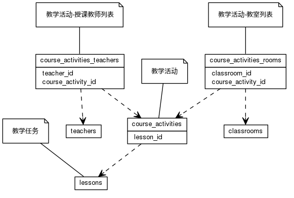


 目  录

* toc
{:toc}

### 关系图 1. 排课
  * 关系图
  

### 表格 course_activities

  * 表格说明

<table class="table table-bordered table-striped table-condensed">
<tr><th style="background-color:#D0D3FF">表名</th><th style="background-color:#D0D3FF">主键</th><th style="background-color:#D0D3FF">注释</th>  </tr>
<tr><td>course_activities</td><td>id</td><td>教学活动</td>  </tr>
</table>

  * 表格中的列

<table class="table table-bordered table-striped table-condensed">
<tr><th style="background-color:#D0D3FF">序号</th><th style="background-color:#D0D3FF">字段名</th><th style="background-color:#D0D3FF">字段类型</th><th style="background-color:#D0D3FF">是否可空</th><th style="background-color:#D0D3FF">描述</th><th style="background-color:#D0D3FF">引用表</th>  </tr>
<tr><td>1</td><td>lesson_id</td><td>int8</td><td>否</td><td>教学任务ID</td><td>lessons</td>  </tr>
<tr><td>2</td><td>weekstate</td><td>int8</td><td>否</td><td>周状态</td><td></td>  </tr>
<tr><td>3</td><td>end_at</td><td>int2</td><td>否</td><td>结束时间</td><td></td>  </tr>
<tr><td>4</td><td>begin_at</td><td>int2</td><td>否</td><td>开始时间</td><td></td>  </tr>
<tr><td>5</td><td>start_on</td><td>date</td><td>否</td><td>开始日期</td><td></td>  </tr>
<tr><td>6</td><td>remark</td><td>varchar</td><td>是</td><td>排课备注</td><td></td>  </tr>
<tr><td>7</td><td>id</td><td>int8</td><td>否</td><td>非业务主键:date</td><td></td>  </tr>
</table>

 
  * 表格的索引

<table class="table table-bordered table-striped table-condensed">
  <tr>
<th style="background-color:#D0D3FF">索引名</th><th style="background-color:#D0D3FF">索引字段</th><th style="background-color:#D0D3FF">是否唯一</th>  </tr>
<tr><td>course_activities_pkey</td><td>id&nbsp;</td><td>是</td>  </tr>
</table>

### 表格 course_activities_rooms

  * 表格说明

<table class="table table-bordered table-striped table-condensed">
<tr><th style="background-color:#D0D3FF">表名</th><th style="background-color:#D0D3FF">主键</th><th style="background-color:#D0D3FF">注释</th>  </tr>
<tr><td>course_activities_rooms</td><td>course_activity_id,classroom_id</td><td>教学活动-教室列表</td>  </tr>
</table>

  * 表格中的列

<table class="table table-bordered table-striped table-condensed">
<tr><th style="background-color:#D0D3FF">序号</th><th style="background-color:#D0D3FF">字段名</th><th style="background-color:#D0D3FF">字段类型</th><th style="background-color:#D0D3FF">是否可空</th><th style="background-color:#D0D3FF">描述</th><th style="background-color:#D0D3FF">引用表</th>  </tr>
<tr><td>1</td><td>classroom_id</td><td>int8</td><td>否</td><td>教室ID</td><td>classrooms</td>  </tr>
<tr><td>2</td><td>course_activity_id</td><td>int8</td><td>否</td><td>教学活动ID</td><td>course_activities</td>  </tr>
</table>

 
  * 表格的索引

<table class="table table-bordered table-striped table-condensed">
  <tr>
<th style="background-color:#D0D3FF">索引名</th><th style="background-color:#D0D3FF">索引字段</th><th style="background-color:#D0D3FF">是否唯一</th>  </tr>
<tr><td>course_activities_rooms_pkey</td><td>course_activity_id&nbsp;classroom_id&nbsp;</td><td>是</td>  </tr>
</table>

### 表格 course_activities_teachers

  * 表格说明

<table class="table table-bordered table-striped table-condensed">
<tr><th style="background-color:#D0D3FF">表名</th><th style="background-color:#D0D3FF">主键</th><th style="background-color:#D0D3FF">注释</th>  </tr>
<tr><td>course_activities_teachers</td><td>course_activity_id,teacher_id</td><td>教学活动-授课教师列表</td>  </tr>
</table>

  * 表格中的列

<table class="table table-bordered table-striped table-condensed">
<tr><th style="background-color:#D0D3FF">序号</th><th style="background-color:#D0D3FF">字段名</th><th style="background-color:#D0D3FF">字段类型</th><th style="background-color:#D0D3FF">是否可空</th><th style="background-color:#D0D3FF">描述</th><th style="background-color:#D0D3FF">引用表</th>  </tr>
<tr><td>1</td><td>teacher_id</td><td>int8</td><td>否</td><td>教师信息ID</td><td>teachers</td>  </tr>
<tr><td>2</td><td>course_activity_id</td><td>int8</td><td>否</td><td>教学活动ID</td><td>course_activities</td>  </tr>
</table>

 
  * 表格的索引

<table class="table table-bordered table-striped table-condensed">
  <tr>
<th style="background-color:#D0D3FF">索引名</th><th style="background-color:#D0D3FF">索引字段</th><th style="background-color:#D0D3FF">是否唯一</th>  </tr>
<tr><td>course_activities_teachers_pkey</td><td>course_activity_id&nbsp;teacher_id&nbsp;</td><td>是</td>  </tr>
</table>

### 表格 lesson_groups

  * 表格说明

<table class="table table-bordered table-striped table-condensed">
<tr><th style="background-color:#D0D3FF">表名</th><th style="background-color:#D0D3FF">主键</th><th style="background-color:#D0D3FF">注释</th>  </tr>
<tr><td>lesson_groups</td><td>id</td><td>教学任务组</td>  </tr>
</table>

  * 表格中的列

<table class="table table-bordered table-striped table-condensed">
<tr><th style="background-color:#D0D3FF">序号</th><th style="background-color:#D0D3FF">字段名</th><th style="background-color:#D0D3FF">字段类型</th><th style="background-color:#D0D3FF">是否可空</th><th style="background-color:#D0D3FF">描述</th><th style="background-color:#D0D3FF">引用表</th>  </tr>
<tr><td>1</td><td>course_id</td><td>int8</td><td>是</td><td>课程ID</td><td>courses</td>  </tr>
<tr><td>2</td><td>semester_id</td><td>int4</td><td>否</td><td>学期ID</td><td>semesters</td>  </tr>
<tr><td>3</td><td>name</td><td>varchar</td><td>否</td><td>组名称</td><td></td>  </tr>
<tr><td>4</td><td>teach_depart_id</td><td>int4</td><td>是</td><td>开课部门ID</td><td>departments</td>  </tr>
<tr><td>5</td><td>project_id</td><td>int4</td><td>否</td><td>项目ID</td><td>projects</td>  </tr>
<tr><td>6</td><td>id</td><td>int8</td><td>否</td><td>非业务主键:date</td><td></td>  </tr>
</table>

 
  * 表格的索引

<table class="table table-bordered table-striped table-condensed">
  <tr>
<th style="background-color:#D0D3FF">索引名</th><th style="background-color:#D0D3FF">索引字段</th><th style="background-color:#D0D3FF">是否唯一</th>  </tr>
<tr><td>lesson_groups_pkey</td><td>id&nbsp;</td><td>是</td>  </tr>
</table>
