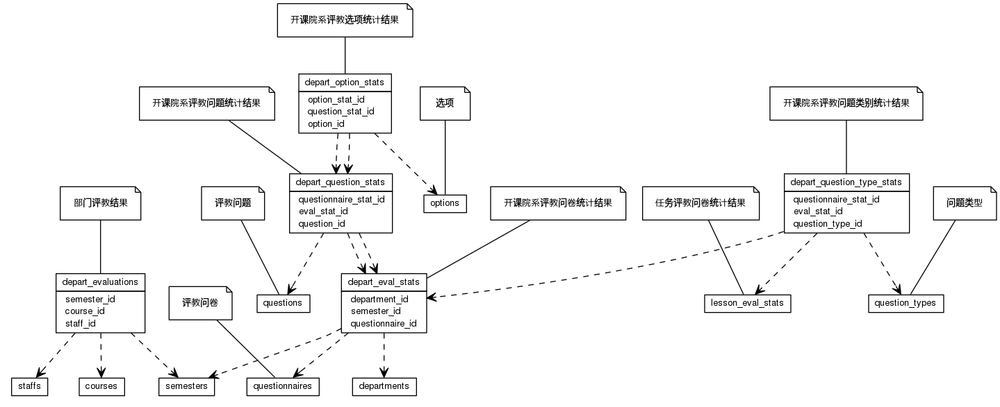


 目  录

* toc
{:toc}

### 关系图 1. 院系排名
  * 关系图
  

### 表格 depart_eval_stats

  * 表格说明

<table class="table table-bordered table-striped table-condensed">
<tr><th style="background-color:#D0D3FF">表名</th><th style="background-color:#D0D3FF">主键</th><th style="background-color:#D0D3FF">注释</th>  </tr>
<tr><td>depart_eval_stats</td><td>id</td><td>开课院系评教问卷统计结果</td>  </tr>
</table>

  * 表格中的列

<table class="table table-bordered table-striped table-condensed">
<tr><th style="background-color:#D0D3FF">序号</th><th style="background-color:#D0D3FF">字段名</th><th style="background-color:#D0D3FF">字段类型</th><th style="background-color:#D0D3FF">是否可空</th><th style="background-color:#D0D3FF">描述</th><th style="background-color:#D0D3FF">引用表</th>  </tr>
<tr><td>1</td><td>id</td><td>int8</td><td>否</td><td>非业务主键:date</td><td></td>  </tr>
<tr><td>2</td><td>department_id</td><td>int4</td><td>否</td><td>开课院系ID</td><td>departments</td>  </tr>
<tr><td>3</td><td>stat_at</td><td>timestamp</td><td>是</td><td>统计时间</td><td></td>  </tr>
<tr><td>4</td><td>score</td><td>float4</td><td>是</td><td>总得分</td><td></td>  </tr>
<tr><td>5</td><td>valid_score</td><td>float8</td><td>是</td><td>有效总分</td><td></td>  </tr>
<tr><td>6</td><td>valid_tickets</td><td>int4</td><td>是</td><td>有效票数</td><td></td>  </tr>
<tr><td>7</td><td>published</td><td>int4</td><td>是</td><td>是否发布</td><td></td>  </tr>
<tr><td>8</td><td>add_score</td><td>float8</td><td>是</td><td>附加题总分</td><td></td>  </tr>
<tr><td>9</td><td>all_tickets</td><td>int4</td><td>是</td><td>所有样本</td><td></td>  </tr>
<tr><td>10</td><td>semester_id</td><td>int4</td><td>否</td><td>教学日历ID</td><td>semesters</td>  </tr>
<tr><td>11</td><td>questionnaire_id</td><td>int8</td><td>否</td><td>问卷ID</td><td>questionnaires</td>  </tr>
</table>

 
  * 表格的索引

<table class="table table-bordered table-striped table-condensed">
  <tr>
<th style="background-color:#D0D3FF">索引名</th><th style="background-color:#D0D3FF">索引字段</th><th style="background-color:#D0D3FF">是否唯一</th>  </tr>
<tr><td>depart_eval_stats_pkey</td><td>id&nbsp;</td><td>是</td>  </tr>
</table>

### 表格 depart_evaluations

  * 表格说明

<table class="table table-bordered table-striped table-condensed">
<tr><th style="background-color:#D0D3FF">表名</th><th style="background-color:#D0D3FF">主键</th><th style="background-color:#D0D3FF">注释</th>  </tr>
<tr><td>depart_evaluations</td><td>id</td><td>部门评教结果</td>  </tr>
</table>

  * 表格中的列

<table class="table table-bordered table-striped table-condensed">
<tr><th style="background-color:#D0D3FF">序号</th><th style="background-color:#D0D3FF">字段名</th><th style="background-color:#D0D3FF">字段类型</th><th style="background-color:#D0D3FF">是否可空</th><th style="background-color:#D0D3FF">描述</th><th style="background-color:#D0D3FF">引用表</th>  </tr>
<tr><td>1</td><td>id</td><td>int8</td><td>否</td><td>非业务主键:date</td><td></td>  </tr>
<tr><td>2</td><td>score</td><td>float4</td><td>是</td><td>得分</td><td></td>  </tr>
<tr><td>3</td><td>updated_at</td><td>timestamp</td><td>是</td><td>更新时间</td><td></td>  </tr>
<tr><td>4</td><td>user_name</td><td>varchar</td><td>是</td><td>评测人</td><td></td>  </tr>
<tr><td>5</td><td>course_id</td><td>int8</td><td>是</td><td>被评课程ID</td><td>courses</td>  </tr>
<tr><td>6</td><td>semester_id</td><td>int4</td><td>是</td><td>学年学期ID</td><td>semesters</td>  </tr>
<tr><td>7</td><td>staff_id</td><td>int8</td><td>是</td><td>被评教师ID</td><td>staffs</td>  </tr>
</table>

 
  * 表格的索引

<table class="table table-bordered table-striped table-condensed">
  <tr>
<th style="background-color:#D0D3FF">索引名</th><th style="background-color:#D0D3FF">索引字段</th><th style="background-color:#D0D3FF">是否唯一</th>  </tr>
<tr><td>depart_evaluations_pkey</td><td>id&nbsp;</td><td>是</td>  </tr>
</table>

### 表格 depart_option_stats

  * 表格说明

<table class="table table-bordered table-striped table-condensed">
<tr><th style="background-color:#D0D3FF">表名</th><th style="background-color:#D0D3FF">主键</th><th style="background-color:#D0D3FF">注释</th>  </tr>
<tr><td>depart_option_stats</td><td>id</td><td>开课院系评教选项统计结果</td>  </tr>
</table>

  * 表格中的列

<table class="table table-bordered table-striped table-condensed">
<tr><th style="background-color:#D0D3FF">序号</th><th style="background-color:#D0D3FF">字段名</th><th style="background-color:#D0D3FF">字段类型</th><th style="background-color:#D0D3FF">是否可空</th><th style="background-color:#D0D3FF">描述</th><th style="background-color:#D0D3FF">引用表</th>  </tr>
<tr><td>1</td><td>id</td><td>int8</td><td>否</td><td>非业务主键:date</td><td></td>  </tr>
<tr><td>2</td><td>amount</td><td>int4</td><td>是</td><td>人数</td><td></td>  </tr>
<tr><td>3</td><td>question_stat_id</td><td>int8</td><td>否</td><td>问题统计明细ID</td><td>depart_question_stats</td>  </tr>
<tr><td>4</td><td>option_id</td><td>int8</td><td>否</td><td>选项ID</td><td>options</td>  </tr>
<tr><td>5</td><td>option_stat_id</td><td>int8</td><td>是</td><td></td><td>depart_question_stats</td>  </tr>
</table>

 
  * 表格的索引

<table class="table table-bordered table-striped table-condensed">
  <tr>
<th style="background-color:#D0D3FF">索引名</th><th style="background-color:#D0D3FF">索引字段</th><th style="background-color:#D0D3FF">是否唯一</th>  </tr>
<tr><td>depart_option_stats_pkey</td><td>id&nbsp;</td><td>是</td>  </tr>
</table>

### 表格 depart_question_stats

  * 表格说明

<table class="table table-bordered table-striped table-condensed">
<tr><th style="background-color:#D0D3FF">表名</th><th style="background-color:#D0D3FF">主键</th><th style="background-color:#D0D3FF">注释</th>  </tr>
<tr><td>depart_question_stats</td><td>id</td><td>开课院系评教问题统计结果</td>  </tr>
</table>

  * 表格中的列

<table class="table table-bordered table-striped table-condensed">
<tr><th style="background-color:#D0D3FF">序号</th><th style="background-color:#D0D3FF">字段名</th><th style="background-color:#D0D3FF">字段类型</th><th style="background-color:#D0D3FF">是否可空</th><th style="background-color:#D0D3FF">描述</th><th style="background-color:#D0D3FF">引用表</th>  </tr>
<tr><td>1</td><td>id</td><td>int8</td><td>否</td><td>非业务主键:date</td><td></td>  </tr>
<tr><td>2</td><td>average</td><td>float8</td><td>是</td><td>平均得分</td><td></td>  </tr>
<tr><td>3</td><td>stddev</td><td>float8</td><td>是</td><td>标准差</td><td></td>  </tr>
<tr><td>4</td><td>total</td><td>float8</td><td>是</td><td>总得分</td><td></td>  </tr>
<tr><td>5</td><td>question_id</td><td>int8</td><td>否</td><td>具体问题ID</td><td>questions</td>  </tr>
<tr><td>6</td><td>eval_stat_id</td><td>int8</td><td>否</td><td>问卷统计ID</td><td>depart_eval_stats</td>  </tr>
<tr><td>7</td><td>questionnaire_stat_id</td><td>int8</td><td>是</td><td></td><td>depart_eval_stats</td>  </tr>
</table>

 
  * 表格的索引

<table class="table table-bordered table-striped table-condensed">
  <tr>
<th style="background-color:#D0D3FF">索引名</th><th style="background-color:#D0D3FF">索引字段</th><th style="background-color:#D0D3FF">是否唯一</th>  </tr>
<tr><td>depart_question_stats_pkey</td><td>id&nbsp;</td><td>是</td>  </tr>
</table>

### 表格 depart_question_type_stats

  * 表格说明

<table class="table table-bordered table-striped table-condensed">
<tr><th style="background-color:#D0D3FF">表名</th><th style="background-color:#D0D3FF">主键</th><th style="background-color:#D0D3FF">注释</th>  </tr>
<tr><td>depart_question_type_stats</td><td>id</td><td>开课院系评教问题类别统计结果</td>  </tr>
</table>

  * 表格中的列

<table class="table table-bordered table-striped table-condensed">
<tr><th style="background-color:#D0D3FF">序号</th><th style="background-color:#D0D3FF">字段名</th><th style="background-color:#D0D3FF">字段类型</th><th style="background-color:#D0D3FF">是否可空</th><th style="background-color:#D0D3FF">描述</th><th style="background-color:#D0D3FF">引用表</th>  </tr>
<tr><td>1</td><td>id</td><td>int8</td><td>否</td><td>非业务主键:date</td><td></td>  </tr>
<tr><td>2</td><td>score</td><td>float4</td><td>是</td><td>问题类别统计的分值(百分制)</td><td></td>  </tr>
<tr><td>3</td><td>question_type_id</td><td>int8</td><td>是</td><td>问题类别ID</td><td>question_types</td>  </tr>
<tr><td>4</td><td>eval_stat_id</td><td>int8</td><td>是</td><td>问卷评教结果ID</td><td>lesson_eval_stats</td>  </tr>
<tr><td>5</td><td>questionnaire_stat_id</td><td>int8</td><td>是</td><td></td><td>depart_eval_stats</td>  </tr>
</table>

 
  * 表格的索引

<table class="table table-bordered table-striped table-condensed">
  <tr>
<th style="background-color:#D0D3FF">索引名</th><th style="background-color:#D0D3FF">索引字段</th><th style="background-color:#D0D3FF">是否唯一</th>  </tr>
<tr><td>depart_question_type_stats_pkey</td><td>id&nbsp;</td><td>是</td>  </tr>
</table>
