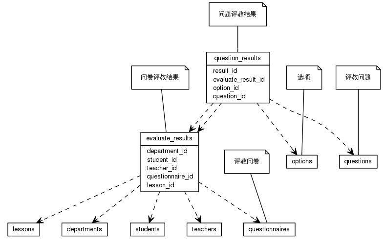


 目  录

* toc
{:toc}

### 关系图 1. 评教明细
  * 关系图
  

### 表格 evaluate_results

  * 表格说明

<table class="table table-bordered table-striped table-condensed">
<tr><th style="background-color:#D0D3FF">表名</th><th style="background-color:#D0D3FF">主键</th><th style="background-color:#D0D3FF">注释</th>  </tr>
<tr><td>evaluate_results</td><td>id</td><td>问卷评教结果</td>  </tr>
</table>

  * 表格中的列

<table class="table table-bordered table-striped table-condensed">
<tr><th style="background-color:#D0D3FF">序号</th><th style="background-color:#D0D3FF">字段名</th><th style="background-color:#D0D3FF">字段类型</th><th style="background-color:#D0D3FF">是否可空</th><th style="background-color:#D0D3FF">描述</th><th style="background-color:#D0D3FF">引用表</th>  </tr>
<tr><td>1</td><td>evaluate_at</td><td>timestamp</td><td>否</td><td>评教时间</td><td></td>  </tr>
<tr><td>2</td><td>stat_type</td><td>int4</td><td>否</td><td>1正常 2 无效 3异常(互斥)</td><td></td>  </tr>
<tr><td>3</td><td>questionnaire_id</td><td>int8</td><td>否</td><td>问卷信息ID</td><td>questionnaires</td>  </tr>
<tr><td>4</td><td>department_id</td><td>int4</td><td>否</td><td>开课院系ID</td><td>departments</td>  </tr>
<tr><td>5</td><td>lesson_id</td><td>int8</td><td>否</td><td>教学任务ID</td><td>lessons</td>  </tr>
<tr><td>6</td><td>remark</td><td>varchar</td><td>是</td><td>备注</td><td></td>  </tr>
<tr><td>7</td><td>teacher_id</td><td>int8</td><td>是</td><td>教师ID</td><td>teachers</td>  </tr>
<tr><td>8</td><td>student_id</td><td>int8</td><td>否</td><td>学生ID</td><td>students</td>  </tr>
<tr><td>9</td><td>id</td><td>int8</td><td>否</td><td>非业务主键:date</td><td></td>  </tr>
</table>

 
  * 表格的索引

<table class="table table-bordered table-striped table-condensed">
  <tr>
<th style="background-color:#D0D3FF">索引名</th><th style="background-color:#D0D3FF">索引字段</th><th style="background-color:#D0D3FF">是否唯一</th>  </tr>
<tr><td>evaluate_results_pkey</td><td>id&nbsp;</td><td>是</td>  </tr>
</table>

### 表格 question_results

  * 表格说明

<table class="table table-bordered table-striped table-condensed">
<tr><th style="background-color:#D0D3FF">表名</th><th style="background-color:#D0D3FF">主键</th><th style="background-color:#D0D3FF">注释</th>  </tr>
<tr><td>question_results</td><td>id</td><td>问题评教结果</td>  </tr>
</table>

  * 表格中的列

<table class="table table-bordered table-striped table-condensed">
<tr><th style="background-color:#D0D3FF">序号</th><th style="background-color:#D0D3FF">字段名</th><th style="background-color:#D0D3FF">字段类型</th><th style="background-color:#D0D3FF">是否可空</th><th style="background-color:#D0D3FF">描述</th><th style="background-color:#D0D3FF">引用表</th>  </tr>
<tr><td>1</td><td>result_id</td><td>int8</td><td>否</td><td>评教结果ID</td><td>evaluate_results</td>  </tr>
<tr><td>2</td><td>question_id</td><td>int8</td><td>否</td><td>问题ID</td><td>questions</td>  </tr>
<tr><td>3</td><td>question_type_id</td><td>int8</td><td>否</td><td>问题类别ID</td><td>question_types</td>  </tr>
<tr><td>4</td><td>id</td><td>int8</td><td>否</td><td>非业务主键:date</td><td></td>  </tr>
<tr><td>5</td><td>option_id</td><td>int8</td><td>是</td><td>问题选项ID</td><td>options</td>  </tr>
<tr><td>6</td><td>score</td><td>float4</td><td>否</td><td>得分</td><td></td>  </tr>
<tr><td>7</td><td>evaluate_result_id</td><td>int8</td><td>是</td><td></td><td>evaluate_results</td>  </tr>
</table>

 
  * 表格的索引

<table class="table table-bordered table-striped table-condensed">
  <tr>
<th style="background-color:#D0D3FF">索引名</th><th style="background-color:#D0D3FF">索引字段</th><th style="background-color:#D0D3FF">是否唯一</th>  </tr>
<tr><td>question_results_pkey</td><td>id&nbsp;</td><td>是</td>  </tr>
</table>
