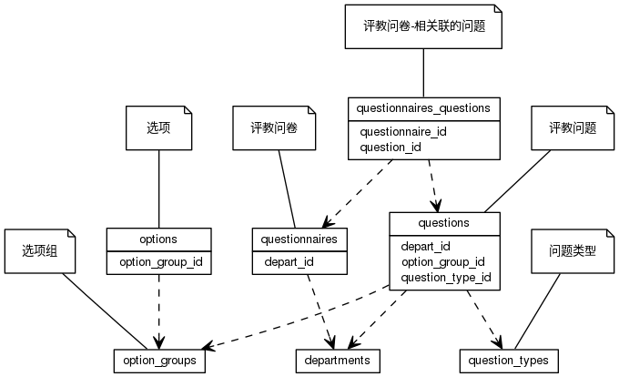


 目  录

* toc
{:toc}

### 关系图 1. 问卷
  * 关系图

### 表格 option_groups 选项组

  * 表格说明

<table class="table table-bordered table-striped table-condensed">
<tr><th style="background-color:#D0D3FF">表名</th><th style="background-color:#D0D3FF">主键</th><th style="background-color:#D0D3FF">注释</th>  </tr>
<tr><td>option_groups</td><td>id</td><td>选项组</td>  </tr>
</table>

  * 表格中的列

<table class="table table-bordered table-striped table-condensed">
<tr><th style="background-color:#D0D3FF" class="text-center">序号</th><th style="background-color:#D0D3FF">字段名</th><th style="background-color:#D0D3FF">字段类型</th><th style="background-color:#D0D3FF" class="text-center">是否可空</th><th style="background-color:#D0D3FF">描述</th><th style="background-color:#D0D3FF">引用表</th>  </tr>
<tr><td class="text-center">1</td><td>id</td><td>bigint</td><td class="text-center">否</td><td>非业务主键:datetime</td><td></td>  </tr>
<tr><td class="text-center">2</td><td>name</td><td>varchar(50)</td><td class="text-center">否</td><td>名称</td><td></td>  </tr>
<tr><td class="text-center">3</td><td>oppo_val</td><td>float4</td><td class="text-center">否</td><td>倾向性权重 必须在0和1之间</td><td></td>  </tr>
<tr><td class="text-center">4</td><td>project_id</td><td>integer</td><td class="text-center">否</td><td>项目ID</td><td>edu_base.projects</td>  </tr>
</table>

### 表格 options 选项

  * 表格说明

<table class="table table-bordered table-striped table-condensed">
<tr><th style="background-color:#D0D3FF">表名</th><th style="background-color:#D0D3FF">主键</th><th style="background-color:#D0D3FF">注释</th>  </tr>
<tr><td>options</td><td>id</td><td>选项</td>  </tr>
</table>

  * 表格中的列

<table class="table table-bordered table-striped table-condensed">
<tr><th style="background-color:#D0D3FF" class="text-center">序号</th><th style="background-color:#D0D3FF">字段名</th><th style="background-color:#D0D3FF">字段类型</th><th style="background-color:#D0D3FF" class="text-center">是否可空</th><th style="background-color:#D0D3FF">描述</th><th style="background-color:#D0D3FF">引用表</th>  </tr>
<tr><td class="text-center">1</td><td>id</td><td>bigint</td><td class="text-center">否</td><td>非业务主键:datetime</td><td></td>  </tr>
<tr><td class="text-center">2</td><td>name</td><td>varchar(50)</td><td class="text-center">否</td><td>选项名</td><td></td>  </tr>
<tr><td class="text-center">3</td><td>option_group_id</td><td>bigint</td><td class="text-center">否</td><td>选项组ID</td><td>edu_evaluation.option_groups</td>  </tr>
<tr><td class="text-center">4</td><td>proportion</td><td>float4</td><td class="text-center">否</td><td>选项所占比重（权重）</td><td></td>  </tr>
</table>

  * 表格的索引

<table class="table table-bordered table-striped table-condensed">
  <tr>
<th style="background-color:#D0D3FF">索引名</th><th style="background-color:#D0D3FF">索引字段</th><th style="background-color:#D0D3FF">是否唯一</th>  </tr>
<tr><td>idx_f5kj6dxaq8tcasfuc6a1r4nv</td><td>option_group_id&nbsp;</td><td>否</td>  </tr>
</table>

### 表格 question_types 问题类型

  * 表格说明

<table class="table table-bordered table-striped table-condensed">
<tr><th style="background-color:#D0D3FF">表名</th><th style="background-color:#D0D3FF">主键</th><th style="background-color:#D0D3FF">注释</th>  </tr>
<tr><td>question_types</td><td>id</td><td>问题类型</td>  </tr>
</table>

  * 表格中的列

<table class="table table-bordered table-striped table-condensed">
<tr><th style="background-color:#D0D3FF" class="text-center">序号</th><th style="background-color:#D0D3FF">字段名</th><th style="background-color:#D0D3FF">字段类型</th><th style="background-color:#D0D3FF" class="text-center">是否可空</th><th style="background-color:#D0D3FF">描述</th><th style="background-color:#D0D3FF">引用表</th>  </tr>
<tr><td class="text-center">1</td><td>id</td><td>bigint</td><td class="text-center">否</td><td>非业务主键:datetime</td><td></td>  </tr>
<tr><td class="text-center">2</td><td>begin_on</td><td>date</td><td class="text-center">否</td><td>生效时间</td><td></td>  </tr>
<tr><td class="text-center">3</td><td>en_name</td><td>varchar(100)</td><td class="text-center">是</td><td>英文名称</td><td></td>  </tr>
<tr><td class="text-center">4</td><td>end_on</td><td>date</td><td class="text-center">是</td><td>失效时间</td><td></td>  </tr>
<tr><td class="text-center">5</td><td>name</td><td>varchar(50)</td><td class="text-center">否</td><td>中文名称</td><td></td>  </tr>
<tr><td class="text-center">6</td><td>priority</td><td>integer</td><td class="text-center">否</td><td>优先级 ,越大越靠前</td><td></td>  </tr>
<tr><td class="text-center">7</td><td>project_id</td><td>integer</td><td class="text-center">否</td><td>项目ID</td><td>edu_base.projects</td>  </tr>
<tr><td class="text-center">8</td><td>remark</td><td>varchar(100)</td><td class="text-center">是</td><td>备注</td><td></td>  </tr>
<tr><td class="text-center">9</td><td>updated_at</td><td>timestamp</td><td class="text-center">否</td><td>更新时间</td><td></td>  </tr>
</table>

### 表格 questionnaires 评教问卷

  * 表格说明

<table class="table table-bordered table-striped table-condensed">
<tr><th style="background-color:#D0D3FF">表名</th><th style="background-color:#D0D3FF">主键</th><th style="background-color:#D0D3FF">注释</th>  </tr>
<tr><td>questionnaires</td><td>id</td><td>评教问卷</td>  </tr>
</table>

  * 表格中的列

<table class="table table-bordered table-striped table-condensed">
<tr><th style="background-color:#D0D3FF" class="text-center">序号</th><th style="background-color:#D0D3FF">字段名</th><th style="background-color:#D0D3FF">字段类型</th><th style="background-color:#D0D3FF" class="text-center">是否可空</th><th style="background-color:#D0D3FF">描述</th><th style="background-color:#D0D3FF">引用表</th>  </tr>
<tr><td class="text-center">1</td><td>id</td><td>bigint</td><td class="text-center">否</td><td>非业务主键:datetime</td><td></td>  </tr>
<tr><td class="text-center">2</td><td>begin_on</td><td>date</td><td class="text-center">否</td><td>生效时间</td><td></td>  </tr>
<tr><td class="text-center">3</td><td>create_by</td><td>varchar(255)</td><td class="text-center">否</td><td>创建者</td><td></td>  </tr>
<tr><td class="text-center">4</td><td>depart_id</td><td>integer</td><td class="text-center">否</td><td>创建部门ID</td><td>base.departments</td>  </tr>
<tr><td class="text-center">5</td><td>description</td><td>varchar(500)</td><td class="text-center">否</td><td>简单描述</td><td></td>  </tr>
<tr><td class="text-center">6</td><td>end_on</td><td>date</td><td class="text-center">是</td><td>失效时间</td><td></td>  </tr>
<tr><td class="text-center">7</td><td>project_id</td><td>integer</td><td class="text-center">否</td><td>项目ID</td><td>edu_base.projects</td>  </tr>
<tr><td class="text-center">8</td><td>remark</td><td>varchar(200)</td><td class="text-center">是</td><td>备注</td><td></td>  </tr>
<tr><td class="text-center">9</td><td>title</td><td>varchar(200)</td><td class="text-center">否</td><td>问卷标题</td><td></td>  </tr>
<tr><td class="text-center">10</td><td>updated_at</td><td>timestamp</td><td class="text-center">否</td><td>更新时间</td><td></td>  </tr>
</table>

### 表格 questionnaires_questions 相关联的问题

  * 表格说明

<table class="table table-bordered table-striped table-condensed">
<tr><th style="background-color:#D0D3FF">表名</th><th style="background-color:#D0D3FF">主键</th><th style="background-color:#D0D3FF">注释</th>  </tr>
<tr><td>questionnaires_questions</td><td>questionnaire_id,question_id</td><td>相关联的问题</td>  </tr>
</table>

  * 表格中的列

<table class="table table-bordered table-striped table-condensed">
<tr><th style="background-color:#D0D3FF" class="text-center">序号</th><th style="background-color:#D0D3FF">字段名</th><th style="background-color:#D0D3FF">字段类型</th><th style="background-color:#D0D3FF" class="text-center">是否可空</th><th style="background-color:#D0D3FF">描述</th><th style="background-color:#D0D3FF">引用表</th>  </tr>
<tr><td class="text-center">1</td><td>question_id</td><td>bigint</td><td class="text-center">否</td><td>评教问题ID</td><td>edu_evaluation.questions</td>  </tr>
<tr><td class="text-center">2</td><td>questionnaire_id</td><td>bigint</td><td class="text-center">否</td><td>评教问卷ID</td><td>edu_evaluation.questionnaires</td>  </tr>
</table>

  * 表格的索引

<table class="table table-bordered table-striped table-condensed">
  <tr>
<th style="background-color:#D0D3FF">索引名</th><th style="background-color:#D0D3FF">索引字段</th><th style="background-color:#D0D3FF">是否唯一</th>  </tr>
<tr><td>idx_1mhhdaxdan0vekgoofvqin7hk</td><td>questionnaire_id&nbsp;</td><td>否</td>  </tr>
</table>

### 表格 questions 评教问题

  * 表格说明

<table class="table table-bordered table-striped table-condensed">
<tr><th style="background-color:#D0D3FF">表名</th><th style="background-color:#D0D3FF">主键</th><th style="background-color:#D0D3FF">注释</th>  </tr>
<tr><td>questions</td><td>id</td><td>评教问题</td>  </tr>
</table>

  * 表格中的列

<table class="table table-bordered table-striped table-condensed">
<tr><th style="background-color:#D0D3FF" class="text-center">序号</th><th style="background-color:#D0D3FF">字段名</th><th style="background-color:#D0D3FF">字段类型</th><th style="background-color:#D0D3FF" class="text-center">是否可空</th><th style="background-color:#D0D3FF">描述</th><th style="background-color:#D0D3FF">引用表</th>  </tr>
<tr><td class="text-center">1</td><td>id</td><td>bigint</td><td class="text-center">否</td><td>非业务主键:datetime</td><td></td>  </tr>
<tr><td class="text-center">2</td><td>addition</td><td>boolean</td><td class="text-center">否</td><td>是否附加题</td><td></td>  </tr>
<tr><td class="text-center">3</td><td>begin_on</td><td>date</td><td class="text-center">否</td><td>生效时间</td><td></td>  </tr>
<tr><td class="text-center">4</td><td>contents</td><td>varchar(400)</td><td class="text-center">否</td><td>问题内容</td><td></td>  </tr>
<tr><td class="text-center">5</td><td>depart_id</td><td>integer</td><td class="text-center">否</td><td>问题所对应的使用部门ID</td><td>base.departments</td>  </tr>
<tr><td class="text-center">6</td><td>end_on</td><td>date</td><td class="text-center">是</td><td>失效时间</td><td></td>  </tr>
<tr><td class="text-center">7</td><td>option_group_id</td><td>bigint</td><td class="text-center">否</td><td>选项组ID</td><td>edu_evaluation.option_groups</td>  </tr>
<tr><td class="text-center">8</td><td>priority</td><td>integer</td><td class="text-center">否</td><td>优先级</td><td></td>  </tr>
<tr><td class="text-center">9</td><td>project_id</td><td>integer</td><td class="text-center">否</td><td>项目ID</td><td>edu_base.projects</td>  </tr>
<tr><td class="text-center">10</td><td>question_type_id</td><td>bigint</td><td class="text-center">否</td><td>问题类型ID</td><td>edu_evaluation.question_types</td>  </tr>
<tr><td class="text-center">11</td><td>remark</td><td>varchar(200)</td><td class="text-center">是</td><td>注释</td><td></td>  </tr>
<tr><td class="text-center">12</td><td>score</td><td>float4</td><td class="text-center">否</td><td>分值</td><td></td>  </tr>
<tr><td class="text-center">13</td><td>updated_at</td><td>timestamp</td><td class="text-center">否</td><td>更新时间</td><td></td>  </tr>
</table>

