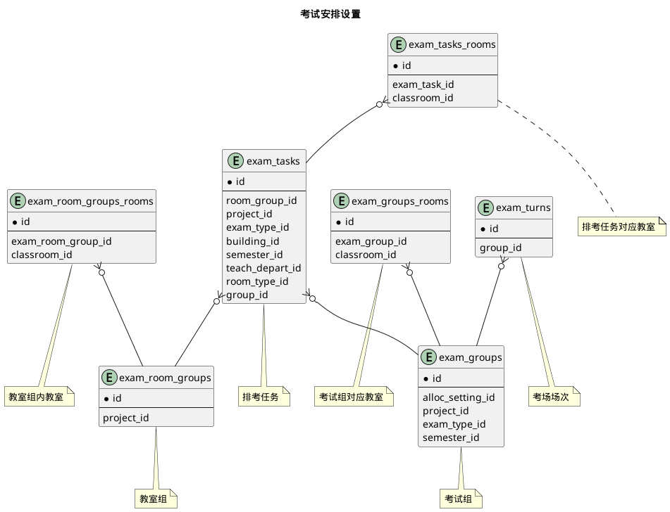
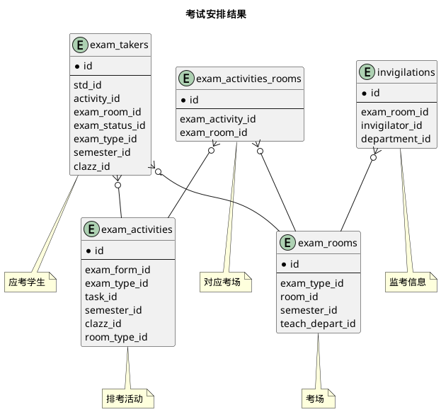
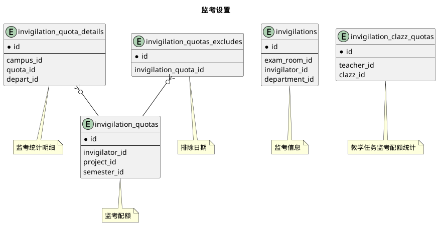


 目  录

* toc
{:toc}

### 关系图 1. 考试安排设置
  * 关系图

### 关系图 2. 考试安排结果
  * 关系图

### 关系图 3. 监考设置
  * 关系图

### 表格 exam_activities 排考活动

  * 表格说明

<table class="table table-bordered table-striped table-condensed">
<tr><th style="background-color:#D0D3FF">表名</th><th style="background-color:#D0D3FF">主键</th><th style="background-color:#D0D3FF">注释</th>  </tr>
<tr><td>exam_activities</td><td>id</td><td>排考活动</td>  </tr>
</table>

  * 表格中的列

<table class="table table-bordered table-striped table-condensed">
<tr><th style="background-color:#D0D3FF" class="text-center">序号</th><th style="background-color:#D0D3FF">字段名</th><th style="background-color:#D0D3FF">字段类型</th><th style="background-color:#D0D3FF" class="text-center">是否可空</th><th style="background-color:#D0D3FF">描述</th><th style="background-color:#D0D3FF">引用表</th>  </tr>
<tr><td class="text-center">1</td><td>id</td><td>bigint</td><td class="text-center">否</td><td>非业务主键:datetime</td><td></td>  </tr>
<tr><td class="text-center">2</td><td>begin_at</td><td>smallint</td><td class="text-center">否</td><td>开始时间</td><td></td>  </tr>
<tr><td class="text-center">3</td><td>centralized</td><td>boolean</td><td class="text-center">是</td><td>是否集中考试</td><td></td>  </tr>
<tr><td class="text-center">4</td><td>clazz_id</td><td>bigint</td><td class="text-center">否</td><td>教学任务ID</td><td>edu.clazzes</td>  </tr>
<tr><td class="text-center">5</td><td>end_at</td><td>smallint</td><td class="text-center">否</td><td>结束时间</td><td></td>  </tr>
<tr><td class="text-center">6</td><td>exam_on</td><td>date</td><td class="text-center">是</td><td>考试时间</td><td></td>  </tr>
<tr><td class="text-center">7</td><td>exam_paper_no</td><td>varchar(255)</td><td class="text-center">是</td><td>试卷号</td><td></td>  </tr>
<tr><td class="text-center">8</td><td>exam_type_id</td><td>integer</td><td class="text-center">否</td><td>考试类型ID</td><td>code.exam_types</td>  </tr>
<tr><td class="text-center">9</td><td>exam_week</td><td>integer</td><td class="text-center">是</td><td>考试周</td><td></td>  </tr>
<tr><td class="text-center">10</td><td>publish_state</td><td>integer</td><td class="text-center">否</td><td>发布状态</td><td></td>  </tr>
<tr><td class="text-center">11</td><td>remark</td><td>varchar(100)</td><td class="text-center">是</td><td>备注</td><td></td>  </tr>
<tr><td class="text-center">12</td><td>semester_id</td><td>integer</td><td class="text-center">否</td><td>学年学期ID</td><td>base.semesters</td>  </tr>
<tr><td class="text-center">13</td><td>std_count</td><td>integer</td><td class="text-center">否</td><td>考生数</td><td></td>  </tr>
<tr><td class="text-center">14</td><td>task_id</td><td>bigint</td><td class="text-center">是</td><td>排考任务ID</td><td>edu.exam_tasks</td>  </tr>
</table>

  * 表格的索引

<table class="table table-bordered table-striped table-condensed">
  <tr>
<th style="background-color:#D0D3FF">索引名</th><th style="background-color:#D0D3FF">索引字段</th><th style="background-color:#D0D3FF">是否唯一</th>  </tr>
<tr><td>idx_9eb357ua5ig65i2eufrufd9y</td><td>clazz_id,exam_type_id</td><td>否</td>  </tr>
<tr><td>idx_2tuc5f1o0pkk22qb86p2pawup</td><td>semester_id</td><td>否</td>  </tr>
<tr><td>idx_3c0fuy04m4yleiot9mvjwnud6</td><td>task_id</td><td>否</td>  </tr>
</table>

### 表格 exam_activities_rooms 对应考场

  * 表格说明

<table class="table table-bordered table-striped table-condensed">
<tr><th style="background-color:#D0D3FF">表名</th><th style="background-color:#D0D3FF">主键</th><th style="background-color:#D0D3FF">注释</th>  </tr>
<tr><td>exam_activities_rooms</td><td>exam_activity_id,exam_room_id</td><td>对应考场</td>  </tr>
</table>

  * 表格中的列

<table class="table table-bordered table-striped table-condensed">
<tr><th style="background-color:#D0D3FF" class="text-center">序号</th><th style="background-color:#D0D3FF">字段名</th><th style="background-color:#D0D3FF">字段类型</th><th style="background-color:#D0D3FF" class="text-center">是否可空</th><th style="background-color:#D0D3FF">描述</th><th style="background-color:#D0D3FF">引用表</th>  </tr>
<tr><td class="text-center">1</td><td>exam_activity_id</td><td>bigint</td><td class="text-center">否</td><td>排考活动ID</td><td>edu.exam_activities</td>  </tr>
<tr><td class="text-center">2</td><td>exam_room_id</td><td>bigint</td><td class="text-center">否</td><td>考场ID</td><td>edu.exam_rooms</td>  </tr>
</table>

  * 表格的索引

<table class="table table-bordered table-striped table-condensed">
  <tr>
<th style="background-color:#D0D3FF">索引名</th><th style="background-color:#D0D3FF">索引字段</th><th style="background-color:#D0D3FF">是否唯一</th>  </tr>
<tr><td>idx_qbiu7ds54rmfpxmjwnvwo8dal</td><td>exam_activity_id</td><td>否</td>  </tr>
<tr><td>idx_pjwqn6d874ljreci8v9elrxac</td><td>exam_room_id</td><td>否</td>  </tr>
</table>

### 表格 exam_alloc_settings 教室分配设置

  * 表格说明

<table class="table table-bordered table-striped table-condensed">
<tr><th style="background-color:#D0D3FF">表名</th><th style="background-color:#D0D3FF">主键</th><th style="background-color:#D0D3FF">注释</th>  </tr>
<tr><td>exam_alloc_settings</td><td>id</td><td>教室分配设置</td>  </tr>
</table>

  * 表格中的列

<table class="table table-bordered table-striped table-condensed">
<tr><th style="background-color:#D0D3FF" class="text-center">序号</th><th style="background-color:#D0D3FF">字段名</th><th style="background-color:#D0D3FF">字段类型</th><th style="background-color:#D0D3FF" class="text-center">是否可空</th><th style="background-color:#D0D3FF">描述</th><th style="background-color:#D0D3FF">引用表</th>  </tr>
<tr><td class="text-center">1</td><td>id</td><td>bigint</td><td class="text-center">否</td><td>非业务主键:datetime</td><td></td>  </tr>
<tr><td class="text-center">2</td><td>alloc_policy</td><td>integer</td><td class="text-center">否</td><td>分配策略</td><td></td>  </tr>
<tr><td class="text-center">3</td><td>exam_type_id</td><td>integer</td><td class="text-center">否</td><td>考试类型ID</td><td>code.exam_types</td>  </tr>
<tr><td class="text-center">4</td><td>min_capacity</td><td>integer</td><td class="text-center">否</td><td>最小容量</td><td></td>  </tr>
<tr><td class="text-center">5</td><td>min_occupy_ratio</td><td>float4</td><td class="text-center">否</td><td>最低占用率</td><td></td>  </tr>
<tr><td class="text-center">6</td><td>min_std_exam_interval</td><td>integer</td><td class="text-center">否</td><td>学生连续考试最小间隔</td><td></td>  </tr>
<tr><td class="text-center">7</td><td>name</td><td>varchar(255)</td><td class="text-center">否</td><td>名称</td><td></td>  </tr>
<tr><td class="text-center">8</td><td>project_id</td><td>integer</td><td class="text-center">否</td><td>项目ID</td><td>base.projects</td>  </tr>
</table>

### 表格 exam_groups 考试组

  * 表格说明

<table class="table table-bordered table-striped table-condensed">
<tr><th style="background-color:#D0D3FF">表名</th><th style="background-color:#D0D3FF">主键</th><th style="background-color:#D0D3FF">注释</th>  </tr>
<tr><td>exam_groups</td><td>id</td><td>考试组</td>  </tr>
</table>

  * 表格中的列

<table class="table table-bordered table-striped table-condensed">
<tr><th style="background-color:#D0D3FF" class="text-center">序号</th><th style="background-color:#D0D3FF">字段名</th><th style="background-color:#D0D3FF">字段类型</th><th style="background-color:#D0D3FF" class="text-center">是否可空</th><th style="background-color:#D0D3FF">描述</th><th style="background-color:#D0D3FF">引用表</th>  </tr>
<tr><td class="text-center">1</td><td>id</td><td>bigint</td><td class="text-center">否</td><td>非业务主键:datetime</td><td></td>  </tr>
<tr><td class="text-center">2</td><td>alloc_setting_id</td><td>bigint</td><td class="text-center">否</td><td>教室分配设置ID</td><td>edu.exam_alloc_settings</td>  </tr>
<tr><td class="text-center">3</td><td>allow_in_class</td><td>boolean</td><td class="text-center">否</td><td>允许随堂考</td><td></td>  </tr>
<tr><td class="text-center">4</td><td>begin_on</td><td>date</td><td class="text-center">否</td><td>开始日期</td><td></td>  </tr>
<tr><td class="text-center">5</td><td>end_on</td><td>date</td><td class="text-center">否</td><td>结束日期</td><td></td>  </tr>
<tr><td class="text-center">6</td><td>exam_type_id</td><td>integer</td><td class="text-center">否</td><td>考试类型ID</td><td>code.exam_types</td>  </tr>
<tr><td class="text-center">7</td><td>max_course_conflict_ratio</td><td>float4</td><td class="text-center">否</td><td>最大上课冲突比例</td><td></td>  </tr>
<tr><td class="text-center">8</td><td>min_course_conflict_count</td><td>integer</td><td class="text-center">否</td><td>最小学生上课冲突人数</td><td></td>  </tr>
<tr><td class="text-center">9</td><td>name</td><td>varchar(255)</td><td class="text-center">否</td><td>名称</td><td></td>  </tr>
<tr><td class="text-center">10</td><td>project_id</td><td>integer</td><td class="text-center">否</td><td>项目ID</td><td>base.projects</td>  </tr>
<tr><td class="text-center">11</td><td>publish_state</td><td>integer</td><td class="text-center">否</td><td>发布状态</td><td></td>  </tr>
<tr><td class="text-center">12</td><td>semester_id</td><td>integer</td><td class="text-center">否</td><td>学年学期ID</td><td>base.semesters</td>  </tr>
<tr><td class="text-center">13</td><td>updated_at</td><td>timestamp</td><td class="text-center">否</td><td>更新时间</td><td></td>  </tr>
</table>

### 表格 exam_groups_rooms 考试组对应教室

  * 表格说明

<table class="table table-bordered table-striped table-condensed">
<tr><th style="background-color:#D0D3FF">表名</th><th style="background-color:#D0D3FF">主键</th><th style="background-color:#D0D3FF">注释</th>  </tr>
<tr><td>exam_groups_rooms</td><td>exam_group_id,classroom_id</td><td>考试组对应教室</td>  </tr>
</table>

  * 表格中的列

<table class="table table-bordered table-striped table-condensed">
<tr><th style="background-color:#D0D3FF" class="text-center">序号</th><th style="background-color:#D0D3FF">字段名</th><th style="background-color:#D0D3FF">字段类型</th><th style="background-color:#D0D3FF" class="text-center">是否可空</th><th style="background-color:#D0D3FF">描述</th><th style="background-color:#D0D3FF">引用表</th>  </tr>
<tr><td class="text-center">1</td><td>classroom_id</td><td>bigint</td><td class="text-center">否</td><td>教室ID</td><td>base.classrooms</td>  </tr>
<tr><td class="text-center">2</td><td>exam_group_id</td><td>bigint</td><td class="text-center">否</td><td>考试组ID</td><td>edu.exam_groups</td>  </tr>
</table>

  * 表格的索引

<table class="table table-bordered table-striped table-condensed">
  <tr>
<th style="background-color:#D0D3FF">索引名</th><th style="background-color:#D0D3FF">索引字段</th><th style="background-color:#D0D3FF">是否唯一</th>  </tr>
<tr><td>idx_3fn9e5bana3uc5991o48ldw1x</td><td>exam_group_id</td><td>否</td>  </tr>
</table>

### 表格 exam_room_groups 教室组

  * 表格说明

<table class="table table-bordered table-striped table-condensed">
<tr><th style="background-color:#D0D3FF">表名</th><th style="background-color:#D0D3FF">主键</th><th style="background-color:#D0D3FF">注释</th>  </tr>
<tr><td>exam_room_groups</td><td>id</td><td>教室组</td>  </tr>
</table>

  * 表格中的列

<table class="table table-bordered table-striped table-condensed">
<tr><th style="background-color:#D0D3FF" class="text-center">序号</th><th style="background-color:#D0D3FF">字段名</th><th style="background-color:#D0D3FF">字段类型</th><th style="background-color:#D0D3FF" class="text-center">是否可空</th><th style="background-color:#D0D3FF">描述</th><th style="background-color:#D0D3FF">引用表</th>  </tr>
<tr><td class="text-center">1</td><td>id</td><td>bigint</td><td class="text-center">否</td><td>非业务主键:datetime</td><td></td>  </tr>
<tr><td class="text-center">2</td><td>name</td><td>varchar(255)</td><td class="text-center">否</td><td>名称</td><td></td>  </tr>
<tr><td class="text-center">3</td><td>project_id</td><td>integer</td><td class="text-center">否</td><td>项目ID</td><td>base.projects</td>  </tr>
<tr><td class="text-center">4</td><td>updated_at</td><td>timestamp</td><td class="text-center">否</td><td>更新时间</td><td></td>  </tr>
</table>

### 表格 exam_room_groups_rooms 教室组内教室

  * 表格说明

<table class="table table-bordered table-striped table-condensed">
<tr><th style="background-color:#D0D3FF">表名</th><th style="background-color:#D0D3FF">主键</th><th style="background-color:#D0D3FF">注释</th>  </tr>
<tr><td>exam_room_groups_rooms</td><td>exam_room_group_id,classroom_id</td><td>教室组内教室</td>  </tr>
</table>

  * 表格中的列

<table class="table table-bordered table-striped table-condensed">
<tr><th style="background-color:#D0D3FF" class="text-center">序号</th><th style="background-color:#D0D3FF">字段名</th><th style="background-color:#D0D3FF">字段类型</th><th style="background-color:#D0D3FF" class="text-center">是否可空</th><th style="background-color:#D0D3FF">描述</th><th style="background-color:#D0D3FF">引用表</th>  </tr>
<tr><td class="text-center">1</td><td>classroom_id</td><td>bigint</td><td class="text-center">否</td><td>教室ID</td><td>base.classrooms</td>  </tr>
<tr><td class="text-center">2</td><td>exam_room_group_id</td><td>bigint</td><td class="text-center">否</td><td>教室组ID</td><td>edu.exam_room_groups</td>  </tr>
</table>

  * 表格的索引

<table class="table table-bordered table-striped table-condensed">
  <tr>
<th style="background-color:#D0D3FF">索引名</th><th style="background-color:#D0D3FF">索引字段</th><th style="background-color:#D0D3FF">是否唯一</th>  </tr>
<tr><td>idx_okvnxy33bnpg2tpeexe0h3fvy</td><td>exam_room_group_id</td><td>否</td>  </tr>
</table>

### 表格 exam_rooms 考场

  * 表格说明

<table class="table table-bordered table-striped table-condensed">
<tr><th style="background-color:#D0D3FF">表名</th><th style="background-color:#D0D3FF">主键</th><th style="background-color:#D0D3FF">注释</th>  </tr>
<tr><td>exam_rooms</td><td>id</td><td>考场</td>  </tr>
</table>

  * 表格中的列

<table class="table table-bordered table-striped table-condensed">
<tr><th style="background-color:#D0D3FF" class="text-center">序号</th><th style="background-color:#D0D3FF">字段名</th><th style="background-color:#D0D3FF">字段类型</th><th style="background-color:#D0D3FF" class="text-center">是否可空</th><th style="background-color:#D0D3FF">描述</th><th style="background-color:#D0D3FF">引用表</th>  </tr>
<tr><td class="text-center">1</td><td>id</td><td>bigint</td><td class="text-center">否</td><td>非业务主键:datetime</td><td></td>  </tr>
<tr><td class="text-center">2</td><td>begin_at</td><td>smallint</td><td class="text-center">否</td><td>开始时间</td><td></td>  </tr>
<tr><td class="text-center">3</td><td>end_at</td><td>smallint</td><td class="text-center">否</td><td>结束时间</td><td></td>  </tr>
<tr><td class="text-center">4</td><td>exam_on</td><td>date</td><td class="text-center">否</td><td>考试日期</td><td></td>  </tr>
<tr><td class="text-center">5</td><td>exam_type_id</td><td>integer</td><td class="text-center">否</td><td>考试类型ID</td><td>code.exam_types</td>  </tr>
<tr><td class="text-center">6</td><td>room_id</td><td>bigint</td><td class="text-center">否</td><td>教室ID</td><td>base.classrooms</td>  </tr>
<tr><td class="text-center">7</td><td>semester_id</td><td>integer</td><td class="text-center">否</td><td>学年学期ID</td><td>base.semesters</td>  </tr>
<tr><td class="text-center">8</td><td>std_count</td><td>integer</td><td class="text-center">否</td><td>考生数</td><td></td>  </tr>
<tr><td class="text-center">9</td><td>teach_depart_id</td><td>integer</td><td class="text-center">否</td><td>部门组织机构信息ID</td><td>base.departments</td>  </tr>
</table>

### 表格 exam_takers 应考学生

  * 表格说明

<table class="table table-bordered table-striped table-condensed">
<tr><th style="background-color:#D0D3FF">表名</th><th style="background-color:#D0D3FF">主键</th><th style="background-color:#D0D3FF">注释</th>  </tr>
<tr><td>exam_takers</td><td>id</td><td>应考学生</td>  </tr>
</table>

  * 表格中的列

<table class="table table-bordered table-striped table-condensed">
<tr><th style="background-color:#D0D3FF" class="text-center">序号</th><th style="background-color:#D0D3FF">字段名</th><th style="background-color:#D0D3FF">字段类型</th><th style="background-color:#D0D3FF" class="text-center">是否可空</th><th style="background-color:#D0D3FF">描述</th><th style="background-color:#D0D3FF">引用表</th>  </tr>
<tr><td class="text-center">1</td><td>id</td><td>bigint</td><td class="text-center">否</td><td>非业务主键:datetime</td><td></td>  </tr>
<tr><td class="text-center">2</td><td>activity_id</td><td>bigint</td><td class="text-center">是</td><td>排考活动ID</td><td>edu.exam_activities</td>  </tr>
<tr><td class="text-center">3</td><td>clazz_id</td><td>bigint</td><td class="text-center">否</td><td>教学任务ID</td><td>edu.clazzes</td>  </tr>
<tr><td class="text-center">4</td><td>exam_room_id</td><td>bigint</td><td class="text-center">是</td><td>考场ID</td><td>edu.exam_rooms</td>  </tr>
<tr><td class="text-center">5</td><td>exam_status_id</td><td>integer</td><td class="text-center">否</td><td>考试情况ID</td><td>code.exam_statuses</td>  </tr>
<tr><td class="text-center">6</td><td>exam_type_id</td><td>integer</td><td class="text-center">否</td><td>考试类型ID</td><td>code.exam_types</td>  </tr>
<tr><td class="text-center">7</td><td>remark</td><td>varchar(255)</td><td class="text-center">是</td><td>缓考申请原因/记录处分</td><td></td>  </tr>
<tr><td class="text-center">8</td><td>seat_no</td><td>smallint</td><td class="text-center">否</td><td>考场座位号</td><td></td>  </tr>
<tr><td class="text-center">9</td><td>semester_id</td><td>integer</td><td class="text-center">否</td><td>学期ID</td><td>base.semesters</td>  </tr>
<tr><td class="text-center">10</td><td>std_id</td><td>bigint</td><td class="text-center">否</td><td>学生ID</td><td>base.students</td>  </tr>
</table>

  * 表格中唯一约束

<table class="table table-bordered table-striped table-condensed">
  <tr>
<th style="background-color:#D0D3FF">序号</th><th style="background-color:#D0D3FF">约束名</th><th style="background-color:#D0D3FF">约束字段</th>  </tr>
<tr><td>1</td><td>uk_aw5c1boicjyshvgr1tbouf4r0</td><td>std_id,clazz_id,exam_type_id</td>  </tr>
</table>

  * 表格的索引

<table class="table table-bordered table-striped table-condensed">
  <tr>
<th style="background-color:#D0D3FF">索引名</th><th style="background-color:#D0D3FF">索引字段</th><th style="background-color:#D0D3FF">是否唯一</th>  </tr>
<tr><td>idx_1hhyq3u8al0sqnt26y580k722</td><td>clazz_id</td><td>否</td>  </tr>
<tr><td>idx_l5wab7yp0sb0g5emubh6fp2iy</td><td>exam_room_id</td><td>否</td>  </tr>
<tr><td>idx_rlo27xd1egx2ff1e2311u4wqq</td><td>activity_id</td><td>否</td>  </tr>
</table>

### 表格 exam_tasks 排考任务

  * 表格说明

<table class="table table-bordered table-striped table-condensed">
<tr><th style="background-color:#D0D3FF">表名</th><th style="background-color:#D0D3FF">主键</th><th style="background-color:#D0D3FF">注释</th>  </tr>
<tr><td>exam_tasks</td><td>id</td><td>排考任务</td>  </tr>
</table>

  * 表格中的列

<table class="table table-bordered table-striped table-condensed">
<tr><th style="background-color:#D0D3FF" class="text-center">序号</th><th style="background-color:#D0D3FF">字段名</th><th style="background-color:#D0D3FF">字段类型</th><th style="background-color:#D0D3FF" class="text-center">是否可空</th><th style="background-color:#D0D3FF">描述</th><th style="background-color:#D0D3FF">引用表</th>  </tr>
<tr><td class="text-center">1</td><td>id</td><td>bigint</td><td class="text-center">否</td><td>非业务主键:datetime</td><td></td>  </tr>
<tr><td class="text-center">2</td><td>begin_at</td><td>smallint</td><td class="text-center">否</td><td>考试开始时间</td><td></td>  </tr>
<tr><td class="text-center">3</td><td>building_id</td><td>integer</td><td class="text-center">是</td><td>楼房建筑物ID</td><td>base.buildings</td>  </tr>
<tr><td class="text-center">4</td><td>centralized</td><td>boolean</td><td class="text-center">否</td><td>是否集中考试</td><td></td>  </tr>
<tr><td class="text-center">5</td><td>code</td><td>varchar(255)</td><td class="text-center">否</td><td>代码</td><td></td>  </tr>
<tr><td class="text-center">6</td><td>duration</td><td>smallint</td><td class="text-center">否</td><td>考试时长</td><td></td>  </tr>
<tr><td class="text-center">7</td><td>end_at</td><td>smallint</td><td class="text-center">否</td><td>考试结束时间</td><td></td>  </tr>
<tr><td class="text-center">8</td><td>exam_on</td><td>date</td><td class="text-center">是</td><td>考试日期</td><td></td>  </tr>
<tr><td class="text-center">9</td><td>exam_type_id</td><td>integer</td><td class="text-center">否</td><td>考试类型ID</td><td>code.exam_types</td>  </tr>
<tr><td class="text-center">10</td><td>exam_week</td><td>smallint</td><td class="text-center">是</td><td>考试周</td><td></td>  </tr>
<tr><td class="text-center">11</td><td>group_id</td><td>bigint</td><td class="text-center">是</td><td>考试组ID</td><td>edu.exam_groups</td>  </tr>
<tr><td class="text-center">12</td><td>max_course_conflict_ratio</td><td>float4</td><td class="text-center">是</td><td>最大上课冲突比例</td><td></td>  </tr>
<tr><td class="text-center">13</td><td>min_exam_on</td><td>date</td><td class="text-center">是</td><td>最早考试日期</td><td></td>  </tr>
<tr><td class="text-center">14</td><td>project_id</td><td>integer</td><td class="text-center">否</td><td>项目ID</td><td>base.projects</td>  </tr>
<tr><td class="text-center">15</td><td>remark</td><td>varchar(255)</td><td class="text-center">是</td><td>备注</td><td></td>  </tr>
<tr><td class="text-center">16</td><td>room_group_id</td><td>bigint</td><td class="text-center">是</td><td>教室组ID</td><td>edu.exam_room_groups</td>  </tr>
<tr><td class="text-center">17</td><td>room_type_id</td><td>integer</td><td class="text-center">是</td><td>教室类型ID</td><td>code.classroom_types</td>  </tr>
<tr><td class="text-center">18</td><td>semester_id</td><td>integer</td><td class="text-center">否</td><td>学期ID</td><td>base.semesters</td>  </tr>
<tr><td class="text-center">19</td><td>std_count</td><td>integer</td><td class="text-center">否</td><td>考生人数</td><td></td>  </tr>
<tr><td class="text-center">20</td><td>teach_depart_id</td><td>integer</td><td class="text-center">否</td><td>部门组织机构信息ID</td><td>base.departments</td>  </tr>
<tr><td class="text-center">21</td><td>time_allotted</td><td>boolean</td><td class="text-center">否</td><td>是否时间已经指定</td><td></td>  </tr>
</table>

  * 表格中唯一约束

<table class="table table-bordered table-striped table-condensed">
  <tr>
<th style="background-color:#D0D3FF">序号</th><th style="background-color:#D0D3FF">约束名</th><th style="background-color:#D0D3FF">约束字段</th>  </tr>
<tr><td>1</td><td>uk_hblf5miprku52a8qklxm4lvpi</td><td>project_id,semester_id,code</td>  </tr>
</table>

  * 表格的索引

<table class="table table-bordered table-striped table-condensed">
  <tr>
<th style="background-color:#D0D3FF">索引名</th><th style="background-color:#D0D3FF">索引字段</th><th style="background-color:#D0D3FF">是否唯一</th>  </tr>
<tr><td>idx_t7hobv2c1smv3okkui80qnent</td><td>semester_id</td><td>否</td>  </tr>
<tr><td>idx_i2jdex5p4klvkav3llp032ie3</td><td>group_id</td><td>否</td>  </tr>
</table>

### 表格 exam_tasks_rooms 排考任务对应教室

  * 表格说明

<table class="table table-bordered table-striped table-condensed">
<tr><th style="background-color:#D0D3FF">表名</th><th style="background-color:#D0D3FF">主键</th><th style="background-color:#D0D3FF">注释</th>  </tr>
<tr><td>exam_tasks_rooms</td><td>exam_task_id,classroom_id</td><td>排考任务对应教室</td>  </tr>
</table>

  * 表格中的列

<table class="table table-bordered table-striped table-condensed">
<tr><th style="background-color:#D0D3FF" class="text-center">序号</th><th style="background-color:#D0D3FF">字段名</th><th style="background-color:#D0D3FF">字段类型</th><th style="background-color:#D0D3FF" class="text-center">是否可空</th><th style="background-color:#D0D3FF">描述</th><th style="background-color:#D0D3FF">引用表</th>  </tr>
<tr><td class="text-center">1</td><td>classroom_id</td><td>bigint</td><td class="text-center">否</td><td>教室ID</td><td>base.classrooms</td>  </tr>
<tr><td class="text-center">2</td><td>exam_task_id</td><td>bigint</td><td class="text-center">否</td><td>排考任务ID</td><td>edu.exam_tasks</td>  </tr>
</table>

  * 表格的索引

<table class="table table-bordered table-striped table-condensed">
  <tr>
<th style="background-color:#D0D3FF">索引名</th><th style="background-color:#D0D3FF">索引字段</th><th style="background-color:#D0D3FF">是否唯一</th>  </tr>
<tr><td>idx_imbpgw9lfiugawpojujikpuon</td><td>exam_task_id</td><td>否</td>  </tr>
</table>

### 表格 exam_turns 考场场次

  * 表格说明

<table class="table table-bordered table-striped table-condensed">
<tr><th style="background-color:#D0D3FF">表名</th><th style="background-color:#D0D3FF">主键</th><th style="background-color:#D0D3FF">注释</th>  </tr>
<tr><td>exam_turns</td><td>id</td><td>考场场次</td>  </tr>
</table>

  * 表格中的列

<table class="table table-bordered table-striped table-condensed">
<tr><th style="background-color:#D0D3FF" class="text-center">序号</th><th style="background-color:#D0D3FF">字段名</th><th style="background-color:#D0D3FF">字段类型</th><th style="background-color:#D0D3FF" class="text-center">是否可空</th><th style="background-color:#D0D3FF">描述</th><th style="background-color:#D0D3FF">引用表</th>  </tr>
<tr><td class="text-center">1</td><td>id</td><td>bigint</td><td class="text-center">否</td><td>非业务主键:datetime</td><td></td>  </tr>
<tr><td class="text-center">2</td><td>begin_at</td><td>smallint</td><td class="text-center">否</td><td>开始时间</td><td></td>  </tr>
<tr><td class="text-center">3</td><td>capacity</td><td>integer</td><td class="text-center">是</td><td>最大容量</td><td></td>  </tr>
<tr><td class="text-center">4</td><td>end_at</td><td>smallint</td><td class="text-center">否</td><td>结束时间</td><td></td>  </tr>
<tr><td class="text-center">5</td><td>exam_on</td><td>date</td><td class="text-center">否</td><td>考试日期</td><td></td>  </tr>
<tr><td class="text-center">6</td><td>group_id</td><td>bigint</td><td class="text-center">否</td><td>考试组ID</td><td>edu.exam_groups</td>  </tr>
</table>

  * 表格的索引

<table class="table table-bordered table-striped table-condensed">
  <tr>
<th style="background-color:#D0D3FF">索引名</th><th style="background-color:#D0D3FF">索引字段</th><th style="background-color:#D0D3FF">是否唯一</th>  </tr>
<tr><td>idx_sxe04un5lqoyaj8phyx3yrn5g</td><td>group_id</td><td>否</td>  </tr>
</table>

### 表格 invigilation_clazz_quotas 教学任务监考配额统计

  * 表格说明

<table class="table table-bordered table-striped table-condensed">
<tr><th style="background-color:#D0D3FF">表名</th><th style="background-color:#D0D3FF">主键</th><th style="background-color:#D0D3FF">注释</th>  </tr>
<tr><td>invigilation_clazz_quotas</td><td>id</td><td>教学任务监考配额统计</td>  </tr>
</table>

  * 表格中的列

<table class="table table-bordered table-striped table-condensed">
<tr><th style="background-color:#D0D3FF" class="text-center">序号</th><th style="background-color:#D0D3FF">字段名</th><th style="background-color:#D0D3FF">字段类型</th><th style="background-color:#D0D3FF" class="text-center">是否可空</th><th style="background-color:#D0D3FF">描述</th><th style="background-color:#D0D3FF">引用表</th>  </tr>
<tr><td class="text-center">1</td><td>id</td><td>bigint</td><td class="text-center">否</td><td>非业务主键:datetime</td><td></td>  </tr>
<tr><td class="text-center">2</td><td>amount</td><td>float4</td><td class="text-center">否</td><td>配额</td><td></td>  </tr>
<tr><td class="text-center">3</td><td>clazz_id</td><td>bigint</td><td class="text-center">否</td><td>教学任务ID</td><td>edu.clazzes</td>  </tr>
<tr><td class="text-center">4</td><td>credit_hours</td><td>float4</td><td class="text-center">否</td><td>学时</td><td></td>  </tr>
<tr><td class="text-center">5</td><td>ratio</td><td>float4</td><td class="text-center">否</td><td>比例</td><td></td>  </tr>
<tr><td class="text-center">6</td><td>teacher_id</td><td>bigint</td><td class="text-center">否</td><td>教师信息ID</td><td>base.teachers</td>  </tr>
</table>

  * 表格中唯一约束

<table class="table table-bordered table-striped table-condensed">
  <tr>
<th style="background-color:#D0D3FF">序号</th><th style="background-color:#D0D3FF">约束名</th><th style="background-color:#D0D3FF">约束字段</th>  </tr>
<tr><td>1</td><td>uk_99ht874j4b5ccw734m1h1moa0</td><td>clazz_id,teacher_id</td>  </tr>
</table>

### 表格 invigilation_quota_details 监考统计明细

  * 表格说明

<table class="table table-bordered table-striped table-condensed">
<tr><th style="background-color:#D0D3FF">表名</th><th style="background-color:#D0D3FF">主键</th><th style="background-color:#D0D3FF">注释</th>  </tr>
<tr><td>invigilation_quota_details</td><td>id</td><td>监考统计明细</td>  </tr>
</table>

  * 表格中的列

<table class="table table-bordered table-striped table-condensed">
<tr><th style="background-color:#D0D3FF" class="text-center">序号</th><th style="background-color:#D0D3FF">字段名</th><th style="background-color:#D0D3FF">字段类型</th><th style="background-color:#D0D3FF" class="text-center">是否可空</th><th style="background-color:#D0D3FF">描述</th><th style="background-color:#D0D3FF">引用表</th>  </tr>
<tr><td class="text-center">1</td><td>id</td><td>bigint</td><td class="text-center">否</td><td>非业务主键:datetime</td><td></td>  </tr>
<tr><td class="text-center">2</td><td>amount</td><td>float4</td><td class="text-center">否</td><td>配额</td><td></td>  </tr>
<tr><td class="text-center">3</td><td>campus_id</td><td>integer</td><td class="text-center">否</td><td>校区信息ID</td><td>base.campuses</td>  </tr>
<tr><td class="text-center">4</td><td>depart_id</td><td>integer</td><td class="text-center">否</td><td>部门组织机构信息ID</td><td>base.departments</td>  </tr>
<tr><td class="text-center">5</td><td>quota_id</td><td>bigint</td><td class="text-center">否</td><td>监考配额ID</td><td>edu.invigilation_quotas</td>  </tr>
</table>

  * 表格的索引

<table class="table table-bordered table-striped table-condensed">
  <tr>
<th style="background-color:#D0D3FF">索引名</th><th style="background-color:#D0D3FF">索引字段</th><th style="background-color:#D0D3FF">是否唯一</th>  </tr>
<tr><td>idx_hxngncdxsqws8idke1p2m3ood</td><td>quota_id</td><td>否</td>  </tr>
</table>

### 表格 invigilation_quotas 监考配额

  * 表格说明

<table class="table table-bordered table-striped table-condensed">
<tr><th style="background-color:#D0D3FF">表名</th><th style="background-color:#D0D3FF">主键</th><th style="background-color:#D0D3FF">注释</th>  </tr>
<tr><td>invigilation_quotas</td><td>id</td><td>监考配额</td>  </tr>
</table>

  * 表格中的列

<table class="table table-bordered table-striped table-condensed">
<tr><th style="background-color:#D0D3FF" class="text-center">序号</th><th style="background-color:#D0D3FF">字段名</th><th style="background-color:#D0D3FF">字段类型</th><th style="background-color:#D0D3FF" class="text-center">是否可空</th><th style="background-color:#D0D3FF">描述</th><th style="background-color:#D0D3FF">引用表</th>  </tr>
<tr><td class="text-center">1</td><td>id</td><td>bigint</td><td class="text-center">否</td><td>非业务主键:datetime</td><td></td>  </tr>
<tr><td class="text-center">2</td><td>amount</td><td>integer</td><td class="text-center">否</td><td>配额</td><td></td>  </tr>
<tr><td class="text-center">3</td><td>invigilator_id</td><td>bigint</td><td class="text-center">否</td><td>通用人员信息ID</td><td>base.users</td>  </tr>
<tr><td class="text-center">4</td><td>project_id</td><td>integer</td><td class="text-center">否</td><td>项目ID</td><td>base.projects</td>  </tr>
<tr><td class="text-center">5</td><td>remark</td><td>varchar(255)</td><td class="text-center">是</td><td>备注</td><td></td>  </tr>
<tr><td class="text-center">6</td><td>semester_id</td><td>integer</td><td class="text-center">否</td><td>学年学期ID</td><td>base.semesters</td>  </tr>
</table>

  * 表格中唯一约束

<table class="table table-bordered table-striped table-condensed">
  <tr>
<th style="background-color:#D0D3FF">序号</th><th style="background-color:#D0D3FF">约束名</th><th style="background-color:#D0D3FF">约束字段</th>  </tr>
<tr><td>1</td><td>uk_h35ysb0b74pj8foxdpfxvy0sv</td><td>invigilator_id,semester_id</td>  </tr>
</table>

### 表格 invigilation_quotas_excludes 排除日期

  * 表格说明

<table class="table table-bordered table-striped table-condensed">
<tr><th style="background-color:#D0D3FF">表名</th><th style="background-color:#D0D3FF">主键</th><th style="background-color:#D0D3FF">注释</th>  </tr>
<tr><td>invigilation_quotas_excludes</td><td>invigilation_quota_id,exclude_on</td><td>排除日期</td>  </tr>
</table>

  * 表格中的列

<table class="table table-bordered table-striped table-condensed">
<tr><th style="background-color:#D0D3FF" class="text-center">序号</th><th style="background-color:#D0D3FF">字段名</th><th style="background-color:#D0D3FF">字段类型</th><th style="background-color:#D0D3FF" class="text-center">是否可空</th><th style="background-color:#D0D3FF">描述</th><th style="background-color:#D0D3FF">引用表</th>  </tr>
<tr><td class="text-center">1</td><td>exclude_on</td><td>date</td><td class="text-center">否</td><td>排除日期</td><td></td>  </tr>
<tr><td class="text-center">2</td><td>invigilation_quota_id</td><td>bigint</td><td class="text-center">否</td><td>监考配额ID</td><td>edu.invigilation_quotas</td>  </tr>
</table>

  * 表格的索引

<table class="table table-bordered table-striped table-condensed">
  <tr>
<th style="background-color:#D0D3FF">索引名</th><th style="background-color:#D0D3FF">索引字段</th><th style="background-color:#D0D3FF">是否唯一</th>  </tr>
<tr><td>idx_t403dhky0rxdpfyt54q7rq0kq</td><td>invigilation_quota_id</td><td>否</td>  </tr>
</table>

### 表格 invigilations 监考信息

  * 表格说明

<table class="table table-bordered table-striped table-condensed">
<tr><th style="background-color:#D0D3FF">表名</th><th style="background-color:#D0D3FF">主键</th><th style="background-color:#D0D3FF">注释</th>  </tr>
<tr><td>invigilations</td><td>id</td><td>监考信息</td>  </tr>
</table>

  * 表格中的列

<table class="table table-bordered table-striped table-condensed">
<tr><th style="background-color:#D0D3FF" class="text-center">序号</th><th style="background-color:#D0D3FF">字段名</th><th style="background-color:#D0D3FF">字段类型</th><th style="background-color:#D0D3FF" class="text-center">是否可空</th><th style="background-color:#D0D3FF">描述</th><th style="background-color:#D0D3FF">引用表</th>  </tr>
<tr><td class="text-center">1</td><td>id</td><td>bigint</td><td class="text-center">否</td><td>非业务主键:datetime</td><td></td>  </tr>
<tr><td class="text-center">2</td><td>chief</td><td>boolean</td><td class="text-center">否</td><td>是否第一监考</td><td></td>  </tr>
<tr><td class="text-center">3</td><td>department_id</td><td>integer</td><td class="text-center">否</td><td>部门组织机构信息ID</td><td>base.departments</td>  </tr>
<tr><td class="text-center">4</td><td>exam_room_id</td><td>bigint</td><td class="text-center">否</td><td>考场ID</td><td>edu.exam_rooms</td>  </tr>
<tr><td class="text-center">5</td><td>invigilator_id</td><td>bigint</td><td class="text-center">是</td><td>通用人员信息ID</td><td>base.users</td>  </tr>
<tr><td class="text-center">6</td><td>invigilator_name</td><td>varchar(255)</td><td class="text-center">是</td><td>监考姓名</td><td></td>  </tr>
<tr><td class="text-center">7</td><td>published</td><td>boolean</td><td class="text-center">否</td><td>是否发布</td><td></td>  </tr>
<tr><td class="text-center">8</td><td>updated_at</td><td>timestamp</td><td class="text-center">否</td><td>更新时间</td><td></td>  </tr>
</table>

  * 表格的索引

<table class="table table-bordered table-striped table-condensed">
  <tr>
<th style="background-color:#D0D3FF">索引名</th><th style="background-color:#D0D3FF">索引字段</th><th style="background-color:#D0D3FF">是否唯一</th>  </tr>
<tr><td>idx_2awmtgmlcsgq6pncrafck1dbh</td><td>exam_room_id</td><td>否</td>  </tr>
</table>
