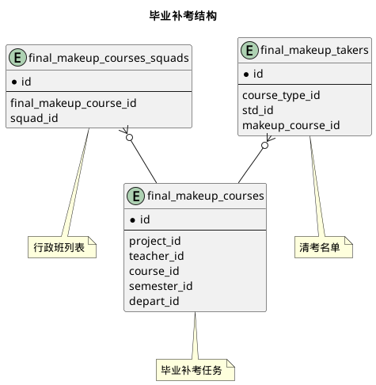



#### 目 录

##### 1. 数据库对象列表
  * [1.1 表格一览](index.html#表格一览)
  * [1.2 模块关系图](index.html#模块关系图)

##### 2. 具体模块明细
* [2.1 核心部分](/model/edu/exam/core.html)
* [2.2 毕业补考](/model/edu/exam/makeup.html)

### 表格一览
Schema edu.exam下共计21个表，分别如下:

<table class="table table-bordered table-striped table-condensed">
  <tr>
    <th class="info_header text-center">序号</th>
    <th class="info_header">表名/描述</th>
    <th class="info_header text-center">序号</th>
    <th class="info_header">表名/描述</th>
  </tr>
  <tr>
    <td>1</td>
    <td><a href="/model/edu/exam/core.html#表格-exam_activities-排考活动">exam_activities</a> 排考活动</td>
    <td>12</td>
    <td><a href="/model/edu/exam/core.html#表格-exam_tasks_rooms-排考任务对应教室">exam_tasks_rooms</a> 排考任务对应教室</td>
  </tr>
  <tr>
    <td>2</td>
    <td><a href="/model/edu/exam/core.html#表格-exam_activities_rooms-对应考场">exam_activities_rooms</a> 对应考场</td>
    <td>13</td>
    <td><a href="/model/edu/exam/core.html#表格-exam_turns-考场场次">exam_turns</a> 考场场次</td>
  </tr>
  <tr>
    <td>3</td>
    <td><a href="/model/edu/exam/core.html#表格-exam_defer_applies-考试延期申请">exam_defer_applies</a> 考试延期申请</td>
    <td>14</td>
    <td><a href="/model/edu/exam/makeup.html#表格-final_makeup_courses-毕业补考任务">final_makeup_courses</a> 毕业补考任务</td>
  </tr>
  <tr>
    <td>4</td>
    <td><a href="/model/edu/exam/core.html#表格-exam_groups-考试组">exam_groups</a> 考试组</td>
    <td>15</td>
    <td><a href="/model/edu/exam/makeup.html#表格-final_makeup_courses_squads-行政班列表">final_makeup_courses_squads</a> 行政班列表</td>
  </tr>
  <tr>
    <td>5</td>
    <td><a href="/model/edu/exam/core.html#表格-exam_groups_rooms-考试组对应教室">exam_groups_rooms</a> 考试组对应教室</td>
    <td>16</td>
    <td><a href="/model/edu/exam/makeup.html#表格-final_makeup_takers-清考名单">final_makeup_takers</a> 清考名单</td>
  </tr>
  <tr>
    <td>6</td>
    <td><a href="/model/edu/exam/core.html#表格-exam_notices-考试通知">exam_notices</a> 考试通知</td>
    <td>17</td>
    <td><a href="/model/edu/exam/core.html#表格-invigilation_clazz_quotas-教学任务监考配额统计">invigilation_clazz_quotas</a> 教学任务监考配额统计</td>
  </tr>
  <tr>
    <td>7</td>
    <td><a href="/model/edu/exam/core.html#表格-exam_room_groups-教室组">exam_room_groups</a> 教室组</td>
    <td>18</td>
    <td><a href="/model/edu/exam/core.html#表格-invigilation_quota_details-监考统计明细">invigilation_quota_details</a> 监考统计明细</td>
  </tr>
  <tr>
    <td>8</td>
    <td><a href="/model/edu/exam/core.html#表格-exam_room_groups_rooms-教室组内教室">exam_room_groups_rooms</a> 教室组内教室</td>
    <td>19</td>
    <td><a href="/model/edu/exam/core.html#表格-invigilation_quotas-监考配额">invigilation_quotas</a> 监考配额</td>
  </tr>
  <tr>
    <td>9</td>
    <td><a href="/model/edu/exam/core.html#表格-exam_rooms-考场">exam_rooms</a> 考场</td>
    <td>20</td>
    <td><a href="/model/edu/exam/core.html#表格-invigilation_quotas_excludes-排除日期">invigilation_quotas_excludes</a> 排除日期</td>
  </tr>
  <tr>
    <td>10</td>
    <td><a href="/model/edu/exam/core.html#表格-exam_takers-应考学生">exam_takers</a> 应考学生</td>
    <td>21</td>
    <td><a href="/model/edu/exam/core.html#表格-invigilations-监考信息">invigilations</a> 监考信息</td>
  </tr>
  <tr>
    <td>11</td>
    <td><a href="/model/edu/exam/core.html#表格-exam_tasks-排考任务">exam_tasks</a> 排考任务</td>
    <td></td>
    <td></td>
  </tr>
</table>

### 模块关系图

#### 1. 考试安排设置
  * 关系图

#### 2. 考试安排结果
  * 关系图

#### 3. 监考设置
  * 关系图

#### 4. 毕业补考结构
  * 关系图

