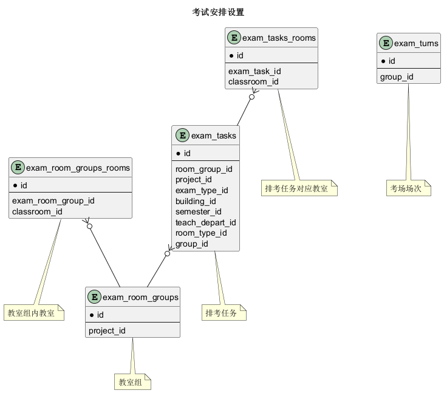
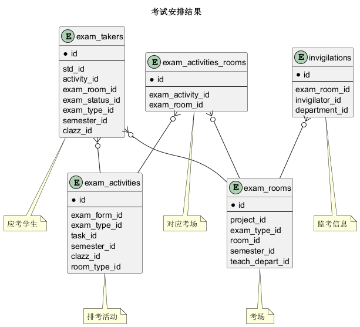
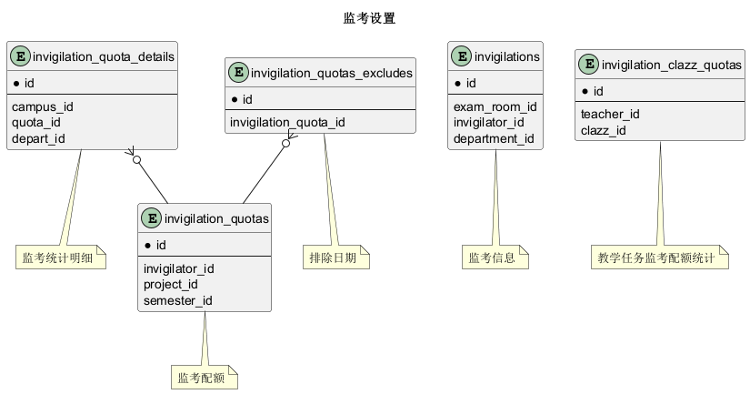
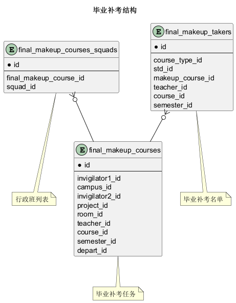

# 教务管理 考务管理 表结构

## 表格一览

<table class="table-mini">
  <thead>
    <tr>
      <th class="info_header text-center" width="7%">序号</th>
      <th class="info_header" width="43%">表名/描述</th>
      <th class="info_header text-center" width="7%">序号</th>
      <th class="info_header" width="43%">表名/描述</th>
    </tr>
  </thead>
  <tbody>
    <tr>
      <td class="text-center">1</td>
      <td><a href="/model/edu/exam.html#exam-activities">exam_activities</a> 排考活动</td>
      <td class="text-center">11</td>
      <td><a href="/model/edu/exam.html#exam-tasks-rooms">exam_tasks_rooms</a> 排考任务对应教室</td>
    </tr>
    <tr>
      <td class="text-center">2</td>
      <td><a href="/model/edu/exam.html#exam-activities-rooms">exam_activities_rooms</a> 对应考场</td>
      <td class="text-center">12</td>
      <td><a href="/model/edu/exam.html#exam-turns">exam_turns</a> 考场场次</td>
    </tr>
    <tr>
      <td class="text-center">3</td>
      <td><a href="/model/edu/exam.html#exam-groups">exam_groups</a> 考试组</td>
      <td class="text-center">13</td>
      <td><a href="/model/edu/exam.html#final-makeup-courses">final_makeup_courses</a> 毕业补考任务</td>
    </tr>
    <tr>
      <td class="text-center">4</td>
      <td><a href="/model/edu/exam.html#exam-groups-rooms">exam_groups_rooms</a> 考试组对应教室</td>
      <td class="text-center">14</td>
      <td><a href="/model/edu/exam.html#final-makeup-courses-squads">final_makeup_courses_squads</a> 行政班列表</td>
    </tr>
    <tr>
      <td class="text-center">5</td>
      <td><a href="/model/edu/exam.html#exam-notices">exam_notices</a> 考试通知</td>
      <td class="text-center">15</td>
      <td><a href="/model/edu/exam.html#final-makeup-takers">final_makeup_takers</a> 毕业补考名单</td>
    </tr>
    <tr>
      <td class="text-center">6</td>
      <td><a href="/model/edu/exam.html#exam-room-groups">exam_room_groups</a> 教室组</td>
      <td class="text-center">16</td>
      <td><a href="/model/edu/exam.html#invigilation-clazz-quotas">invigilation_clazz_quotas</a> 教学任务监考配额统计</td>
    </tr>
    <tr>
      <td class="text-center">7</td>
      <td><a href="/model/edu/exam.html#exam-room-groups-rooms">exam_room_groups_rooms</a> 教室组内教室</td>
      <td class="text-center">17</td>
      <td><a href="/model/edu/exam.html#invigilation-quota-details">invigilation_quota_details</a> 监考统计明细</td>
    </tr>
    <tr>
      <td class="text-center">8</td>
      <td><a href="/model/edu/exam.html#exam-rooms">exam_rooms</a> 考场</td>
      <td class="text-center">18</td>
      <td><a href="/model/edu/exam.html#invigilation-quotas">invigilation_quotas</a> 监考配额</td>
    </tr>
    <tr>
      <td class="text-center">9</td>
      <td><a href="/model/edu/exam.html#exam-takers">exam_takers</a> 应考学生</td>
      <td class="text-center">19</td>
      <td><a href="/model/edu/exam.html#invigilation-quotas-excludes">invigilation_quotas_excludes</a> 排除日期</td>
    </tr>
    <tr>
      <td class="text-center">10</td>
      <td><a href="/model/edu/exam.html#exam-tasks">exam_tasks</a> 排考任务</td>
      <td class="text-center">20</td>
      <td><a href="/model/edu/exam.html#invigilations">invigilations</a> 监考信息</td>
    </tr>
  </tbody>
</table>

## 关键关系图

### 关系图 1. 考试安排设置
  * 关系图

### 关系图 2. 考试安排结果
  * 关系图

### 关系图 3. 监考设置
  * 关系图

### 关系图 4. 毕业补考结构
  * 关系图

## 表格明细

## exam_activities

<table class="table-entity">
  <tbody>
    <tr>
      <td class="table-entity-title" width="15%">表名:&nbsp;</td>
      <td>edu.exam_activities 排考活动</td>
    </tr>
    <tr>
      <td class="table-entity-title">唯一约束:&nbsp;</td>
      <td>主键🔑(id) </td>
    </tr>
    <tr>
      <td class="table-entity-title">索引:&nbsp;</td>
      <td>idx_9eb357ua5ig65i2eufrufd9y(clazz_id,exam_type_id) ,idx_2tuc5f1o0pkk22qb86p2pawup(semester_id) ,idx_3c0fuy04m4yleiot9mvjwnud6(task_id) </td>
    </tr>
  </tbody>
</table>

<table class="table-entity">
  <thead>
    <tr>
<th class="info_header text-center" width="7%">序号</th><th class="info_header" width="20%">字段名</th><th class="info_header" width="20%">字段类型</th><th class="info_header text-center" width="8%">是否可空</th><th class="info_header" width="25%">描述</th><th class="info_header" width="20%">引用表</th>    </tr>
  </thead>
  <tbody>
    <tr>
      <td class="text-center">1</td>
      <td>id</td>
      <td>bigint</td>
      <td class="text-center">否</td>
      <td>非业务主键:datetime</td>
      <td>      </td>
    </tr>
    <tr>
      <td class="text-center">2</td>
      <td>begin_at</td>
      <td>smallint</td>
      <td class="text-center">否</td>
      <td>开始时间</td>
      <td>      </td>
    </tr>
    <tr>
      <td class="text-center">3</td>
      <td>centralized</td>
      <td>boolean</td>
      <td class="text-center">是</td>
      <td>是否集中考试</td>
      <td>      </td>
    </tr>
    <tr>
      <td class="text-center">4</td>
      <td>clazz_id</td>
      <td>bigint</td>
      <td class="text-center">否</td>
      <td>教学任务ID</td>
      <td><a href="/model/edu/clazz.html#clazzes">edu.clazzes</a>      </td>
    </tr>
    <tr>
      <td class="text-center">5</td>
      <td>end_at</td>
      <td>smallint</td>
      <td class="text-center">否</td>
      <td>结束时间</td>
      <td>      </td>
    </tr>
    <tr>
      <td class="text-center">6</td>
      <td>exam_duration</td>
      <td>smallint</td>
      <td class="text-center">否</td>
      <td>考试时长</td>
      <td>      </td>
    </tr>
    <tr>
      <td class="text-center">7</td>
      <td>exam_form_id</td>
      <td>integer</td>
      <td class="text-center">是</td>
      <td>考试形式ID</td>
      <td><a href="/model/code/all.html#exam-forms">code.exam_forms</a>      </td>
    </tr>
    <tr>
      <td class="text-center">8</td>
      <td>exam_on</td>
      <td>date</td>
      <td class="text-center">是</td>
      <td>考试时间</td>
      <td>      </td>
    </tr>
    <tr>
      <td class="text-center">9</td>
      <td>exam_paper_no</td>
      <td>varchar(255)</td>
      <td class="text-center">是</td>
      <td>试卷号</td>
      <td>      </td>
    </tr>
    <tr>
      <td class="text-center">10</td>
      <td>exam_type_id</td>
      <td>integer</td>
      <td class="text-center">否</td>
      <td>考试类型ID</td>
      <td><a href="/model/code/all.html#exam-types">code.exam_types</a>      </td>
    </tr>
    <tr>
      <td class="text-center">11</td>
      <td>exam_week</td>
      <td>smallint</td>
      <td class="text-center">是</td>
      <td>考试周</td>
      <td>      </td>
    </tr>
    <tr>
      <td class="text-center">12</td>
      <td>publish_state</td>
      <td>integer</td>
      <td class="text-center">否</td>
      <td>发布状态</td>
      <td>      </td>
    </tr>
    <tr>
      <td class="text-center">13</td>
      <td>remark</td>
      <td>varchar(100)</td>
      <td class="text-center">是</td>
      <td>备注</td>
      <td>      </td>
    </tr>
    <tr>
      <td class="text-center">14</td>
      <td>room_type_id</td>
      <td>integer</td>
      <td class="text-center">是</td>
      <td>教室类型ID</td>
      <td><a href="/model/code/all.html#classroom-types">code.classroom_types</a>      </td>
    </tr>
    <tr>
      <td class="text-center">15</td>
      <td>semester_id</td>
      <td>integer</td>
      <td class="text-center">否</td>
      <td>学年学期ID</td>
      <td><a href="/model/base/time.html#semesters">base.semesters</a>      </td>
    </tr>
    <tr>
      <td class="text-center">16</td>
      <td>std_count</td>
      <td>integer</td>
      <td class="text-center">否</td>
      <td>考生数</td>
      <td>      </td>
    </tr>
    <tr>
      <td class="text-center">17</td>
      <td>task_id</td>
      <td>bigint</td>
      <td class="text-center">是</td>
      <td>排考任务ID</td>
      <td><a href="/model/edu/exam.html#exam-tasks">edu.exam_tasks</a>      </td>
    </tr>
  </tbody>
</table>

## exam_activities_rooms

<table class="table-entity">
  <tbody>
    <tr>
      <td class="table-entity-title" width="15%">表名:&nbsp;</td>
      <td>edu.exam_activities_rooms 对应考场</td>
    </tr>
    <tr>
      <td class="table-entity-title">唯一约束:&nbsp;</td>
      <td>主键🔑(exam_activity_id,exam_room_id) </td>
    </tr>
    <tr>
      <td class="table-entity-title">索引:&nbsp;</td>
      <td>idx_qbiu7ds54rmfpxmjwnvwo8dal(exam_activity_id) ,idx_pjwqn6d874ljreci8v9elrxac(exam_room_id) </td>
    </tr>
  </tbody>
</table>

<table class="table-entity">
  <thead>
    <tr>
<th class="info_header text-center" width="7%">序号</th><th class="info_header" width="20%">字段名</th><th class="info_header" width="20%">字段类型</th><th class="info_header text-center" width="8%">是否可空</th><th class="info_header" width="25%">描述</th><th class="info_header" width="20%">引用表</th>    </tr>
  </thead>
  <tbody>
    <tr>
      <td class="text-center">1</td>
      <td>exam_activity_id</td>
      <td>bigint</td>
      <td class="text-center">否</td>
      <td>排考活动ID</td>
      <td><a href="/model/edu/exam.html#exam-activities">edu.exam_activities</a>      </td>
    </tr>
    <tr>
      <td class="text-center">2</td>
      <td>exam_room_id</td>
      <td>bigint</td>
      <td class="text-center">否</td>
      <td>考场ID</td>
      <td><a href="/model/edu/exam.html#exam-rooms">edu.exam_rooms</a>      </td>
    </tr>
  </tbody>
</table>

## exam_groups

<table class="table-entity">
  <tbody>
    <tr>
      <td class="table-entity-title" width="15%">表名:&nbsp;</td>
      <td>edu.exam_groups 考试组</td>
    </tr>
    <tr>
      <td class="table-entity-title">唯一约束:&nbsp;</td>
      <td>主键🔑(id) </td>
    </tr>
  </tbody>
</table>

<table class="table-entity">
  <thead>
    <tr>
<th class="info_header text-center" width="7%">序号</th><th class="info_header" width="20%">字段名</th><th class="info_header" width="20%">字段类型</th><th class="info_header text-center" width="8%">是否可空</th><th class="info_header" width="25%">描述</th><th class="info_header" width="20%">引用表</th>    </tr>
  </thead>
  <tbody>
    <tr>
      <td class="text-center">1</td>
      <td>id</td>
      <td>bigint</td>
      <td class="text-center">否</td>
      <td>非业务主键:datetime</td>
      <td>      </td>
    </tr>
    <tr>
      <td class="text-center">2</td>
      <td>alloc_setting_id</td>
      <td>bigint</td>
      <td class="text-center">否</td>
      <td>教室分配设置ID</td>
      <td><a href="/model/cfg/all.html#edu-exam-alloc-settings">cfg.edu_exam_alloc_settings</a>      </td>
    </tr>
    <tr>
      <td class="text-center">3</td>
      <td>allow_in_class</td>
      <td>boolean</td>
      <td class="text-center">否</td>
      <td>允许随堂考</td>
      <td>      </td>
    </tr>
    <tr>
      <td class="text-center">4</td>
      <td>begin_on</td>
      <td>date</td>
      <td class="text-center">否</td>
      <td>开始日期</td>
      <td>      </td>
    </tr>
    <tr>
      <td class="text-center">5</td>
      <td>end_on</td>
      <td>date</td>
      <td class="text-center">否</td>
      <td>结束日期</td>
      <td>      </td>
    </tr>
    <tr>
      <td class="text-center">6</td>
      <td>exam_type_id</td>
      <td>integer</td>
      <td class="text-center">否</td>
      <td>考试类型ID</td>
      <td><a href="/model/code/all.html#exam-types">code.exam_types</a>      </td>
    </tr>
    <tr>
      <td class="text-center">7</td>
      <td>max_course_conflict_ratio</td>
      <td>float4</td>
      <td class="text-center">否</td>
      <td>最大上课冲突比例</td>
      <td>      </td>
    </tr>
    <tr>
      <td class="text-center">8</td>
      <td>min_course_conflict_count</td>
      <td>integer</td>
      <td class="text-center">否</td>
      <td>最小学生上课冲突人数</td>
      <td>      </td>
    </tr>
    <tr>
      <td class="text-center">9</td>
      <td>name</td>
      <td>varchar(255)</td>
      <td class="text-center">否</td>
      <td>名称</td>
      <td>      </td>
    </tr>
    <tr>
      <td class="text-center">10</td>
      <td>project_id</td>
      <td>integer</td>
      <td class="text-center">否</td>
      <td>项目ID</td>
      <td><a href="/model/base/edu.html#projects">base.projects</a>      </td>
    </tr>
    <tr>
      <td class="text-center">11</td>
      <td>publish_state</td>
      <td>integer</td>
      <td class="text-center">否</td>
      <td>发布状态</td>
      <td>      </td>
    </tr>
    <tr>
      <td class="text-center">12</td>
      <td>semester_id</td>
      <td>integer</td>
      <td class="text-center">否</td>
      <td>学年学期ID</td>
      <td><a href="/model/base/time.html#semesters">base.semesters</a>      </td>
    </tr>
    <tr>
      <td class="text-center">13</td>
      <td>updated_at</td>
      <td>timestamptz</td>
      <td class="text-center">否</td>
      <td>更新时间</td>
      <td>      </td>
    </tr>
  </tbody>
</table>

## exam_groups_rooms

<table class="table-entity">
  <tbody>
    <tr>
      <td class="table-entity-title" width="15%">表名:&nbsp;</td>
      <td>edu.exam_groups_rooms 考试组对应教室</td>
    </tr>
    <tr>
      <td class="table-entity-title">唯一约束:&nbsp;</td>
      <td>主键🔑(exam_group_id,classroom_id) </td>
    </tr>
    <tr>
      <td class="table-entity-title">索引:&nbsp;</td>
      <td>idx_3fn9e5bana3uc5991o48ldw1x(exam_group_id) </td>
    </tr>
  </tbody>
</table>

<table class="table-entity">
  <thead>
    <tr>
<th class="info_header text-center" width="7%">序号</th><th class="info_header" width="20%">字段名</th><th class="info_header" width="20%">字段类型</th><th class="info_header text-center" width="8%">是否可空</th><th class="info_header" width="25%">描述</th><th class="info_header" width="20%">引用表</th>    </tr>
  </thead>
  <tbody>
    <tr>
      <td class="text-center">1</td>
      <td>classroom_id</td>
      <td>bigint</td>
      <td class="text-center">否</td>
      <td>教室ID</td>
      <td><a href="/model/base/resources.html#classrooms">base.classrooms</a>      </td>
    </tr>
    <tr>
      <td class="text-center">2</td>
      <td>exam_group_id</td>
      <td>bigint</td>
      <td class="text-center">否</td>
      <td>考试组ID</td>
      <td><a href="/model/edu/exam.html#exam-groups">edu.exam_groups</a>      </td>
    </tr>
  </tbody>
</table>

## exam_notices

<table class="table-entity">
  <tbody>
    <tr>
      <td class="table-entity-title" width="15%">表名:&nbsp;</td>
      <td>edu.exam_notices 考试通知</td>
    </tr>
    <tr>
      <td class="table-entity-title">唯一约束:&nbsp;</td>
      <td>主键🔑(id) </td>
    </tr>
  </tbody>
</table>

<table class="table-entity">
  <thead>
    <tr>
<th class="info_header text-center" width="7%">序号</th><th class="info_header" width="20%">字段名</th><th class="info_header" width="20%">字段类型</th><th class="info_header text-center" width="8%">是否可空</th><th class="info_header" width="25%">描述</th><th class="info_header" width="20%">引用表</th>    </tr>
  </thead>
  <tbody>
    <tr>
      <td class="text-center">1</td>
      <td>id</td>
      <td>bigint</td>
      <td class="text-center">否</td>
      <td>非业务主键:datetime</td>
      <td>      </td>
    </tr>
    <tr>
      <td class="text-center">2</td>
      <td>exam_type_id</td>
      <td>integer</td>
      <td class="text-center">否</td>
      <td>考试类型ID</td>
      <td><a href="/model/code/all.html#exam-types">code.exam_types</a>      </td>
    </tr>
    <tr>
      <td class="text-center">3</td>
      <td>manager_notice</td>
      <td>varchar(1000)</td>
      <td class="text-center">否</td>
      <td>管理人员通知</td>
      <td>      </td>
    </tr>
    <tr>
      <td class="text-center">4</td>
      <td>project_id</td>
      <td>integer</td>
      <td class="text-center">否</td>
      <td>项目ID</td>
      <td><a href="/model/base/edu.html#projects">base.projects</a>      </td>
    </tr>
    <tr>
      <td class="text-center">5</td>
      <td>semester_id</td>
      <td>integer</td>
      <td class="text-center">否</td>
      <td>学年学期ID</td>
      <td><a href="/model/base/time.html#semesters">base.semesters</a>      </td>
    </tr>
    <tr>
      <td class="text-center">6</td>
      <td>student_notice</td>
      <td>varchar(1000)</td>
      <td class="text-center">否</td>
      <td>学生通知</td>
      <td>      </td>
    </tr>
  </tbody>
</table>

## exam_room_groups

<table class="table-entity">
  <tbody>
    <tr>
      <td class="table-entity-title" width="15%">表名:&nbsp;</td>
      <td>edu.exam_room_groups 教室组</td>
    </tr>
    <tr>
      <td class="table-entity-title">唯一约束:&nbsp;</td>
      <td>主键🔑(id) </td>
    </tr>
  </tbody>
</table>

<table class="table-entity">
  <thead>
    <tr>
<th class="info_header text-center" width="7%">序号</th><th class="info_header" width="20%">字段名</th><th class="info_header" width="20%">字段类型</th><th class="info_header text-center" width="8%">是否可空</th><th class="info_header" width="25%">描述</th><th class="info_header" width="20%">引用表</th>    </tr>
  </thead>
  <tbody>
    <tr>
      <td class="text-center">1</td>
      <td>id</td>
      <td>bigint</td>
      <td class="text-center">否</td>
      <td>非业务主键:datetime</td>
      <td>      </td>
    </tr>
    <tr>
      <td class="text-center">2</td>
      <td>name</td>
      <td>varchar(255)</td>
      <td class="text-center">否</td>
      <td>名称</td>
      <td>      </td>
    </tr>
    <tr>
      <td class="text-center">3</td>
      <td>project_id</td>
      <td>integer</td>
      <td class="text-center">否</td>
      <td>项目ID</td>
      <td><a href="/model/base/edu.html#projects">base.projects</a>      </td>
    </tr>
    <tr>
      <td class="text-center">4</td>
      <td>updated_at</td>
      <td>timestamptz</td>
      <td class="text-center">否</td>
      <td>更新时间</td>
      <td>      </td>
    </tr>
  </tbody>
</table>

## exam_room_groups_rooms

<table class="table-entity">
  <tbody>
    <tr>
      <td class="table-entity-title" width="15%">表名:&nbsp;</td>
      <td>edu.exam_room_groups_rooms 教室组内教室</td>
    </tr>
    <tr>
      <td class="table-entity-title">唯一约束:&nbsp;</td>
      <td>主键🔑(exam_room_group_id,classroom_id) </td>
    </tr>
    <tr>
      <td class="table-entity-title">索引:&nbsp;</td>
      <td>idx_okvnxy33bnpg2tpeexe0h3fvy(exam_room_group_id) </td>
    </tr>
  </tbody>
</table>

<table class="table-entity">
  <thead>
    <tr>
<th class="info_header text-center" width="7%">序号</th><th class="info_header" width="20%">字段名</th><th class="info_header" width="20%">字段类型</th><th class="info_header text-center" width="8%">是否可空</th><th class="info_header" width="25%">描述</th><th class="info_header" width="20%">引用表</th>    </tr>
  </thead>
  <tbody>
    <tr>
      <td class="text-center">1</td>
      <td>classroom_id</td>
      <td>bigint</td>
      <td class="text-center">否</td>
      <td>教室ID</td>
      <td><a href="/model/base/resources.html#classrooms">base.classrooms</a>      </td>
    </tr>
    <tr>
      <td class="text-center">2</td>
      <td>exam_room_group_id</td>
      <td>bigint</td>
      <td class="text-center">否</td>
      <td>教室组ID</td>
      <td><a href="/model/edu/exam.html#exam-room-groups">edu.exam_room_groups</a>      </td>
    </tr>
  </tbody>
</table>

## exam_rooms

<table class="table-entity">
  <tbody>
    <tr>
      <td class="table-entity-title" width="15%">表名:&nbsp;</td>
      <td>edu.exam_rooms 考场</td>
    </tr>
    <tr>
      <td class="table-entity-title">唯一约束:&nbsp;</td>
      <td>主键🔑(id) </td>
    </tr>
  </tbody>
</table>

<table class="table-entity">
  <thead>
    <tr>
<th class="info_header text-center" width="7%">序号</th><th class="info_header" width="20%">字段名</th><th class="info_header" width="20%">字段类型</th><th class="info_header text-center" width="8%">是否可空</th><th class="info_header" width="25%">描述</th><th class="info_header" width="20%">引用表</th>    </tr>
  </thead>
  <tbody>
    <tr>
      <td class="text-center">1</td>
      <td>id</td>
      <td>bigint</td>
      <td class="text-center">否</td>
      <td>非业务主键:datetime</td>
      <td>      </td>
    </tr>
    <tr>
      <td class="text-center">2</td>
      <td>begin_at</td>
      <td>smallint</td>
      <td class="text-center">否</td>
      <td>开始时间</td>
      <td>      </td>
    </tr>
    <tr>
      <td class="text-center">3</td>
      <td>end_at</td>
      <td>smallint</td>
      <td class="text-center">否</td>
      <td>结束时间</td>
      <td>      </td>
    </tr>
    <tr>
      <td class="text-center">4</td>
      <td>exam_on</td>
      <td>date</td>
      <td class="text-center">否</td>
      <td>考试日期</td>
      <td>      </td>
    </tr>
    <tr>
      <td class="text-center">5</td>
      <td>exam_type_id</td>
      <td>integer</td>
      <td class="text-center">否</td>
      <td>考试类型ID</td>
      <td><a href="/model/code/all.html#exam-types">code.exam_types</a>      </td>
    </tr>
    <tr>
      <td class="text-center">6</td>
      <td>project_id</td>
      <td>integer</td>
      <td class="text-center">否</td>
      <td>项目ID</td>
      <td><a href="/model/base/edu.html#projects">base.projects</a>      </td>
    </tr>
    <tr>
      <td class="text-center">7</td>
      <td>room_id</td>
      <td>bigint</td>
      <td class="text-center">否</td>
      <td>教室ID</td>
      <td><a href="/model/base/resources.html#classrooms">base.classrooms</a>      </td>
    </tr>
    <tr>
      <td class="text-center">8</td>
      <td>semester_id</td>
      <td>integer</td>
      <td class="text-center">否</td>
      <td>学年学期ID</td>
      <td><a href="/model/base/time.html#semesters">base.semesters</a>      </td>
    </tr>
    <tr>
      <td class="text-center">9</td>
      <td>std_count</td>
      <td>integer</td>
      <td class="text-center">否</td>
      <td>考生数</td>
      <td>      </td>
    </tr>
    <tr>
      <td class="text-center">10</td>
      <td>teach_depart_id</td>
      <td>integer</td>
      <td class="text-center">否</td>
      <td>部门组织机构信息ID</td>
      <td><a href="/model/base/user.html#departments">base.departments</a>      </td>
    </tr>
  </tbody>
</table>

## exam_takers

<table class="table-entity">
  <tbody>
    <tr>
      <td class="table-entity-title" width="15%">表名:&nbsp;</td>
      <td>edu.exam_takers 应考学生</td>
    </tr>
    <tr>
      <td class="table-entity-title">唯一约束:&nbsp;</td>
      <td>主键🔑(id) uk_aw5c1boicjyshvgr1tbouf4r0(std_id,clazz_id,exam_type_id)</td>
    </tr>
    <tr>
      <td class="table-entity-title">索引:&nbsp;</td>
      <td>idx_1hhyq3u8al0sqnt26y580k722(clazz_id) ,idx_l5wab7yp0sb0g5emubh6fp2iy(exam_room_id) ,idx_rlo27xd1egx2ff1e2311u4wqq(activity_id) </td>
    </tr>
  </tbody>
</table>

<table class="table-entity">
  <thead>
    <tr>
<th class="info_header text-center" width="7%">序号</th><th class="info_header" width="20%">字段名</th><th class="info_header" width="20%">字段类型</th><th class="info_header text-center" width="8%">是否可空</th><th class="info_header" width="25%">描述</th><th class="info_header" width="20%">引用表</th>    </tr>
  </thead>
  <tbody>
    <tr>
      <td class="text-center">1</td>
      <td>id</td>
      <td>bigint</td>
      <td class="text-center">否</td>
      <td>非业务主键:datetime</td>
      <td>      </td>
    </tr>
    <tr>
      <td class="text-center">2</td>
      <td>activity_id</td>
      <td>bigint</td>
      <td class="text-center">是</td>
      <td>排考活动ID</td>
      <td><a href="/model/edu/exam.html#exam-activities">edu.exam_activities</a>      </td>
    </tr>
    <tr>
      <td class="text-center">3</td>
      <td>clazz_id</td>
      <td>bigint</td>
      <td class="text-center">否</td>
      <td>教学任务ID</td>
      <td><a href="/model/edu/clazz.html#clazzes">edu.clazzes</a>      </td>
    </tr>
    <tr>
      <td class="text-center">4</td>
      <td>exam_room_id</td>
      <td>bigint</td>
      <td class="text-center">是</td>
      <td>考场ID</td>
      <td><a href="/model/edu/exam.html#exam-rooms">edu.exam_rooms</a>      </td>
    </tr>
    <tr>
      <td class="text-center">5</td>
      <td>exam_status_id</td>
      <td>integer</td>
      <td class="text-center">否</td>
      <td>考试情况ID</td>
      <td><a href="/model/code/all.html#exam-statuses">code.exam_statuses</a>      </td>
    </tr>
    <tr>
      <td class="text-center">6</td>
      <td>exam_type_id</td>
      <td>integer</td>
      <td class="text-center">否</td>
      <td>考试类型ID</td>
      <td><a href="/model/code/all.html#exam-types">code.exam_types</a>      </td>
    </tr>
    <tr>
      <td class="text-center">7</td>
      <td>remark</td>
      <td>varchar(255)</td>
      <td class="text-center">是</td>
      <td>缓考申请原因/记录处分</td>
      <td>      </td>
    </tr>
    <tr>
      <td class="text-center">8</td>
      <td>seat_no</td>
      <td>smallint</td>
      <td class="text-center">否</td>
      <td>考场座位号</td>
      <td>      </td>
    </tr>
    <tr>
      <td class="text-center">9</td>
      <td>semester_id</td>
      <td>integer</td>
      <td class="text-center">否</td>
      <td>学期ID</td>
      <td><a href="/model/base/time.html#semesters">base.semesters</a>      </td>
    </tr>
    <tr>
      <td class="text-center">10</td>
      <td>std_id</td>
      <td>bigint</td>
      <td class="text-center">否</td>
      <td>学生ID</td>
      <td><a href="/model/base/edu.html#students">base.students</a>      </td>
    </tr>
  </tbody>
</table>

## exam_tasks

<table class="table-entity">
  <tbody>
    <tr>
      <td class="table-entity-title" width="15%">表名:&nbsp;</td>
      <td>edu.exam_tasks 排考任务</td>
    </tr>
    <tr>
      <td class="table-entity-title">唯一约束:&nbsp;</td>
      <td>主键🔑(id) </td>
    </tr>
    <tr>
      <td class="table-entity-title">索引:&nbsp;</td>
      <td>idx_t7hobv2c1smv3okkui80qnent(semester_id) ,idx_i2jdex5p4klvkav3llp032ie3(group_id) </td>
    </tr>
  </tbody>
</table>

<table class="table-entity">
  <thead>
    <tr>
<th class="info_header text-center" width="7%">序号</th><th class="info_header" width="20%">字段名</th><th class="info_header" width="20%">字段类型</th><th class="info_header text-center" width="8%">是否可空</th><th class="info_header" width="25%">描述</th><th class="info_header" width="20%">引用表</th>    </tr>
  </thead>
  <tbody>
    <tr>
      <td class="text-center">1</td>
      <td>id</td>
      <td>bigint</td>
      <td class="text-center">否</td>
      <td>非业务主键:datetime</td>
      <td>      </td>
    </tr>
    <tr>
      <td class="text-center">2</td>
      <td>begin_at</td>
      <td>smallint</td>
      <td class="text-center">否</td>
      <td>考试开始时间</td>
      <td>      </td>
    </tr>
    <tr>
      <td class="text-center">3</td>
      <td>building_id</td>
      <td>integer</td>
      <td class="text-center">是</td>
      <td>楼房建筑物ID</td>
      <td><a href="/model/base/resources.html#buildings">base.buildings</a>      </td>
    </tr>
    <tr>
      <td class="text-center">4</td>
      <td>centralized</td>
      <td>boolean</td>
      <td class="text-center">否</td>
      <td>是否集中考试</td>
      <td>      </td>
    </tr>
    <tr>
      <td class="text-center">5</td>
      <td>code</td>
      <td>varchar(255)</td>
      <td class="text-center">否</td>
      <td>代码</td>
      <td>      </td>
    </tr>
    <tr>
      <td class="text-center">6</td>
      <td>duration</td>
      <td>smallint</td>
      <td class="text-center">否</td>
      <td>考试时长</td>
      <td>      </td>
    </tr>
    <tr>
      <td class="text-center">7</td>
      <td>end_at</td>
      <td>smallint</td>
      <td class="text-center">否</td>
      <td>考试结束时间</td>
      <td>      </td>
    </tr>
    <tr>
      <td class="text-center">8</td>
      <td>exam_on</td>
      <td>date</td>
      <td class="text-center">是</td>
      <td>考试日期</td>
      <td>      </td>
    </tr>
    <tr>
      <td class="text-center">9</td>
      <td>exam_type_id</td>
      <td>integer</td>
      <td class="text-center">否</td>
      <td>考试类型ID</td>
      <td><a href="/model/code/all.html#exam-types">code.exam_types</a>      </td>
    </tr>
    <tr>
      <td class="text-center">10</td>
      <td>exam_week</td>
      <td>smallint</td>
      <td class="text-center">是</td>
      <td>考试周</td>
      <td>      </td>
    </tr>
    <tr>
      <td class="text-center">11</td>
      <td>group_id</td>
      <td>bigint</td>
      <td class="text-center">是</td>
      <td>考试组ID</td>
      <td><a href="/model/edu/exam.html#exam-groups">edu.exam_groups</a>      </td>
    </tr>
    <tr>
      <td class="text-center">12</td>
      <td>max_course_conflict_ratio</td>
      <td>float4</td>
      <td class="text-center">是</td>
      <td>最大上课冲突比例</td>
      <td>      </td>
    </tr>
    <tr>
      <td class="text-center">13</td>
      <td>min_exam_on</td>
      <td>date</td>
      <td class="text-center">是</td>
      <td>最早考试日期</td>
      <td>      </td>
    </tr>
    <tr>
      <td class="text-center">14</td>
      <td>project_id</td>
      <td>integer</td>
      <td class="text-center">否</td>
      <td>项目ID</td>
      <td><a href="/model/base/edu.html#projects">base.projects</a>      </td>
    </tr>
    <tr>
      <td class="text-center">15</td>
      <td>remark</td>
      <td>varchar(255)</td>
      <td class="text-center">是</td>
      <td>备注</td>
      <td>      </td>
    </tr>
    <tr>
      <td class="text-center">16</td>
      <td>room_group_id</td>
      <td>bigint</td>
      <td class="text-center">是</td>
      <td>教室组ID</td>
      <td><a href="/model/edu/exam.html#exam-room-groups">edu.exam_room_groups</a>      </td>
    </tr>
    <tr>
      <td class="text-center">17</td>
      <td>room_type_id</td>
      <td>integer</td>
      <td class="text-center">是</td>
      <td>教室类型ID</td>
      <td><a href="/model/code/all.html#classroom-types">code.classroom_types</a>      </td>
    </tr>
    <tr>
      <td class="text-center">18</td>
      <td>semester_id</td>
      <td>integer</td>
      <td class="text-center">否</td>
      <td>学期ID</td>
      <td><a href="/model/base/time.html#semesters">base.semesters</a>      </td>
    </tr>
    <tr>
      <td class="text-center">19</td>
      <td>std_count</td>
      <td>integer</td>
      <td class="text-center">否</td>
      <td>考生人数</td>
      <td>      </td>
    </tr>
    <tr>
      <td class="text-center">20</td>
      <td>teach_depart_id</td>
      <td>integer</td>
      <td class="text-center">否</td>
      <td>部门组织机构信息ID</td>
      <td><a href="/model/base/user.html#departments">base.departments</a>      </td>
    </tr>
    <tr>
      <td class="text-center">21</td>
      <td>time_allotted</td>
      <td>boolean</td>
      <td class="text-center">否</td>
      <td>是否时间已经指定</td>
      <td>      </td>
    </tr>
  </tbody>
</table>

## exam_tasks_rooms

<table class="table-entity">
  <tbody>
    <tr>
      <td class="table-entity-title" width="15%">表名:&nbsp;</td>
      <td>edu.exam_tasks_rooms 排考任务对应教室</td>
    </tr>
    <tr>
      <td class="table-entity-title">唯一约束:&nbsp;</td>
      <td>主键🔑(exam_task_id,classroom_id) </td>
    </tr>
    <tr>
      <td class="table-entity-title">索引:&nbsp;</td>
      <td>idx_imbpgw9lfiugawpojujikpuon(exam_task_id) </td>
    </tr>
  </tbody>
</table>

<table class="table-entity">
  <thead>
    <tr>
<th class="info_header text-center" width="7%">序号</th><th class="info_header" width="20%">字段名</th><th class="info_header" width="20%">字段类型</th><th class="info_header text-center" width="8%">是否可空</th><th class="info_header" width="25%">描述</th><th class="info_header" width="20%">引用表</th>    </tr>
  </thead>
  <tbody>
    <tr>
      <td class="text-center">1</td>
      <td>classroom_id</td>
      <td>bigint</td>
      <td class="text-center">否</td>
      <td>教室ID</td>
      <td><a href="/model/base/resources.html#classrooms">base.classrooms</a>      </td>
    </tr>
    <tr>
      <td class="text-center">2</td>
      <td>exam_task_id</td>
      <td>bigint</td>
      <td class="text-center">否</td>
      <td>排考任务ID</td>
      <td><a href="/model/edu/exam.html#exam-tasks">edu.exam_tasks</a>      </td>
    </tr>
  </tbody>
</table>

## exam_turns

<table class="table-entity">
  <tbody>
    <tr>
      <td class="table-entity-title" width="15%">表名:&nbsp;</td>
      <td>edu.exam_turns 考场场次</td>
    </tr>
    <tr>
      <td class="table-entity-title">唯一约束:&nbsp;</td>
      <td>主键🔑(id) </td>
    </tr>
    <tr>
      <td class="table-entity-title">索引:&nbsp;</td>
      <td>idx_sxe04un5lqoyaj8phyx3yrn5g(group_id) </td>
    </tr>
  </tbody>
</table>

<table class="table-entity">
  <thead>
    <tr>
<th class="info_header text-center" width="7%">序号</th><th class="info_header" width="20%">字段名</th><th class="info_header" width="20%">字段类型</th><th class="info_header text-center" width="8%">是否可空</th><th class="info_header" width="25%">描述</th><th class="info_header" width="20%">引用表</th>    </tr>
  </thead>
  <tbody>
    <tr>
      <td class="text-center">1</td>
      <td>id</td>
      <td>bigint</td>
      <td class="text-center">否</td>
      <td>非业务主键:datetime</td>
      <td>      </td>
    </tr>
    <tr>
      <td class="text-center">2</td>
      <td>begin_at</td>
      <td>smallint</td>
      <td class="text-center">否</td>
      <td>开始时间</td>
      <td>      </td>
    </tr>
    <tr>
      <td class="text-center">3</td>
      <td>capacity</td>
      <td>integer</td>
      <td class="text-center">是</td>
      <td>最大容量</td>
      <td>      </td>
    </tr>
    <tr>
      <td class="text-center">4</td>
      <td>end_at</td>
      <td>smallint</td>
      <td class="text-center">否</td>
      <td>结束时间</td>
      <td>      </td>
    </tr>
    <tr>
      <td class="text-center">5</td>
      <td>exam_on</td>
      <td>date</td>
      <td class="text-center">否</td>
      <td>考试日期</td>
      <td>      </td>
    </tr>
    <tr>
      <td class="text-center">6</td>
      <td>group_id</td>
      <td>bigint</td>
      <td class="text-center">否</td>
      <td>考试组ID</td>
      <td><a href="/model/edu/exam.html#exam-groups">edu.exam_groups</a>      </td>
    </tr>
  </tbody>
</table>

## final_makeup_courses

<table class="table-entity">
  <tbody>
    <tr>
      <td class="table-entity-title" width="15%">表名:&nbsp;</td>
      <td>edu.final_makeup_courses 毕业补考任务</td>
    </tr>
    <tr>
      <td class="table-entity-title">唯一约束:&nbsp;</td>
      <td>主键🔑(id) </td>
    </tr>
  </tbody>
</table>

<table class="table-entity">
  <thead>
    <tr>
<th class="info_header text-center" width="7%">序号</th><th class="info_header" width="20%">字段名</th><th class="info_header" width="20%">字段类型</th><th class="info_header text-center" width="8%">是否可空</th><th class="info_header" width="25%">描述</th><th class="info_header" width="20%">引用表</th>    </tr>
  </thead>
  <tbody>
    <tr>
      <td class="text-center">1</td>
      <td>id</td>
      <td>bigint</td>
      <td class="text-center">否</td>
      <td>非业务主键:datetime</td>
      <td>      </td>
    </tr>
    <tr>
      <td class="text-center">2</td>
      <td>begin_at</td>
      <td>smallint</td>
      <td class="text-center">否</td>
      <td>考试开始时间</td>
      <td>      </td>
    </tr>
    <tr>
      <td class="text-center">3</td>
      <td>campus_id</td>
      <td>integer</td>
      <td class="text-center">否</td>
      <td>校区信息ID</td>
      <td><a href="/model/base/resources.html#campuses">base.campuses</a>      </td>
    </tr>
    <tr>
      <td class="text-center">4</td>
      <td>course_id</td>
      <td>bigint</td>
      <td class="text-center">否</td>
      <td>课程ID</td>
      <td><a href="/model/base/edu.html#courses">base.courses</a>      </td>
    </tr>
    <tr>
      <td class="text-center">5</td>
      <td>crn</td>
      <td>varchar(255)</td>
      <td class="text-center">否</td>
      <td>序号</td>
      <td>      </td>
    </tr>
    <tr>
      <td class="text-center">6</td>
      <td>depart_id</td>
      <td>integer</td>
      <td class="text-center">否</td>
      <td>开课院系ID</td>
      <td><a href="/model/base/user.html#departments">base.departments</a>      </td>
    </tr>
    <tr>
      <td class="text-center">7</td>
      <td>end_at</td>
      <td>smallint</td>
      <td class="text-center">否</td>
      <td>考试结束时间</td>
      <td>      </td>
    </tr>
    <tr>
      <td class="text-center">8</td>
      <td>exam_on</td>
      <td>date</td>
      <td class="text-center">是</td>
      <td>考试日期</td>
      <td>      </td>
    </tr>
    <tr>
      <td class="text-center">9</td>
      <td>input_at</td>
      <td>timestamptz</td>
      <td class="text-center">是</td>
      <td>成绩录入时间</td>
      <td>      </td>
    </tr>
    <tr>
      <td class="text-center">10</td>
      <td>invigilator1_id</td>
      <td>bigint</td>
      <td class="text-center">是</td>
      <td>监考人1ID</td>
      <td><a href="/model/base/user.html#users">base.users</a>      </td>
    </tr>
    <tr>
      <td class="text-center">11</td>
      <td>invigilator2_id</td>
      <td>bigint</td>
      <td class="text-center">是</td>
      <td>监考人2ID</td>
      <td><a href="/model/base/user.html#users">base.users</a>      </td>
    </tr>
    <tr>
      <td class="text-center">12</td>
      <td>project_id</td>
      <td>integer</td>
      <td class="text-center">否</td>
      <td>项目ID</td>
      <td><a href="/model/base/edu.html#projects">base.projects</a>      </td>
    </tr>
    <tr>
      <td class="text-center">13</td>
      <td>room_id</td>
      <td>bigint</td>
      <td class="text-center">是</td>
      <td>考试教室ID</td>
      <td><a href="/model/base/resources.html#classrooms">base.classrooms</a>      </td>
    </tr>
    <tr>
      <td class="text-center">14</td>
      <td>semester_id</td>
      <td>integer</td>
      <td class="text-center">否</td>
      <td>学年学期ID</td>
      <td><a href="/model/base/time.html#semesters">base.semesters</a>      </td>
    </tr>
    <tr>
      <td class="text-center">15</td>
      <td>status</td>
      <td>integer</td>
      <td class="text-center">否</td>
      <td>成绩录入状态</td>
      <td>      </td>
    </tr>
    <tr>
      <td class="text-center">16</td>
      <td>std_count</td>
      <td>integer</td>
      <td class="text-center">否</td>
      <td>学生人数</td>
      <td>      </td>
    </tr>
    <tr>
      <td class="text-center">17</td>
      <td>teacher_id</td>
      <td>bigint</td>
      <td class="text-center">是</td>
      <td>阅卷老师ID</td>
      <td><a href="/model/base/user.html#teachers">base.teachers</a>      </td>
    </tr>
  </tbody>
</table>

## final_makeup_courses_squads

<table class="table-entity">
  <tbody>
    <tr>
      <td class="table-entity-title" width="15%">表名:&nbsp;</td>
      <td>edu.final_makeup_courses_squads 行政班列表</td>
    </tr>
    <tr>
      <td class="table-entity-title">唯一约束:&nbsp;</td>
      <td>主键🔑(final_makeup_course_id,squad_id) </td>
    </tr>
    <tr>
      <td class="table-entity-title">索引:&nbsp;</td>
      <td>idx_kn96mnwxflrwspmtwlq970vhr(final_makeup_course_id) </td>
    </tr>
  </tbody>
</table>

<table class="table-entity">
  <thead>
    <tr>
<th class="info_header text-center" width="7%">序号</th><th class="info_header" width="20%">字段名</th><th class="info_header" width="20%">字段类型</th><th class="info_header text-center" width="8%">是否可空</th><th class="info_header" width="25%">描述</th><th class="info_header" width="20%">引用表</th>    </tr>
  </thead>
  <tbody>
    <tr>
      <td class="text-center">1</td>
      <td>final_makeup_course_id</td>
      <td>bigint</td>
      <td class="text-center">否</td>
      <td>毕业补考任务ID</td>
      <td><a href="/model/edu/exam.html#final-makeup-courses">edu.final_makeup_courses</a>      </td>
    </tr>
    <tr>
      <td class="text-center">2</td>
      <td>squad_id</td>
      <td>bigint</td>
      <td class="text-center">否</td>
      <td>学生行政班级信息ID</td>
      <td><a href="/model/base/edu.html#squads">base.squads</a>      </td>
    </tr>
  </tbody>
</table>

## final_makeup_takers

<table class="table-entity">
  <tbody>
    <tr>
      <td class="table-entity-title" width="15%">表名:&nbsp;</td>
      <td>edu.final_makeup_takers 毕业补考名单</td>
    </tr>
    <tr>
      <td class="table-entity-title">唯一约束:&nbsp;</td>
      <td>主键🔑(id) </td>
    </tr>
    <tr>
      <td class="table-entity-title">索引:&nbsp;</td>
      <td>idx_tmijebsy2v1l6otedsmxu6q4q(std_id) ,idx_h87h8nwy1vu833fi9ddal46nd(makeup_course_id) </td>
    </tr>
  </tbody>
</table>

<table class="table-entity">
  <thead>
    <tr>
<th class="info_header text-center" width="7%">序号</th><th class="info_header" width="20%">字段名</th><th class="info_header" width="20%">字段类型</th><th class="info_header text-center" width="8%">是否可空</th><th class="info_header" width="25%">描述</th><th class="info_header" width="20%">引用表</th>    </tr>
  </thead>
  <tbody>
    <tr>
      <td class="text-center">1</td>
      <td>id</td>
      <td>bigint</td>
      <td class="text-center">否</td>
      <td>非业务主键:datetime</td>
      <td>      </td>
    </tr>
    <tr>
      <td class="text-center">2</td>
      <td>course_id</td>
      <td>bigint</td>
      <td class="text-center">否</td>
      <td>课程基本信息ID</td>
      <td><a href="/model/base/edu.html#courses">base.courses</a>      </td>
    </tr>
    <tr>
      <td class="text-center">3</td>
      <td>course_type_id</td>
      <td>integer</td>
      <td class="text-center">否</td>
      <td>课程类型ID</td>
      <td><a href="/model/code/all.html#course-types">code.course_types</a>      </td>
    </tr>
    <tr>
      <td class="text-center">4</td>
      <td>fail_scores</td>
      <td>varchar(255)</td>
      <td class="text-center">否</td>
      <td>之前的成绩</td>
      <td>      </td>
    </tr>
    <tr>
      <td class="text-center">5</td>
      <td>makeup_course_id</td>
      <td>bigint</td>
      <td class="text-center">是</td>
      <td>毕业补考任务ID</td>
      <td><a href="/model/edu/exam.html#final-makeup-courses">edu.final_makeup_courses</a>      </td>
    </tr>
    <tr>
      <td class="text-center">6</td>
      <td>remark</td>
      <td>varchar(255)</td>
      <td class="text-center">是</td>
      <td>备注</td>
      <td>      </td>
    </tr>
    <tr>
      <td class="text-center">7</td>
      <td>score</td>
      <td>float4</td>
      <td class="text-center">是</td>
      <td>本次补考分数</td>
      <td>      </td>
    </tr>
    <tr>
      <td class="text-center">8</td>
      <td>semester_id</td>
      <td>integer</td>
      <td class="text-center">否</td>
      <td>学年学期ID</td>
      <td><a href="/model/base/time.html#semesters">base.semesters</a>      </td>
    </tr>
    <tr>
      <td class="text-center">9</td>
      <td>std_id</td>
      <td>bigint</td>
      <td class="text-center">否</td>
      <td>学生ID</td>
      <td><a href="/model/base/edu.html#students">base.students</a>      </td>
    </tr>
    <tr>
      <td class="text-center">10</td>
      <td>teacher_id</td>
      <td>bigint</td>
      <td class="text-center">是</td>
      <td>教师信息ID</td>
      <td><a href="/model/base/user.html#teachers">base.teachers</a>      </td>
    </tr>
    <tr>
      <td class="text-center">11</td>
      <td>updated_at</td>
      <td>timestamptz</td>
      <td class="text-center">否</td>
      <td>更新时间</td>
      <td>      </td>
    </tr>
  </tbody>
</table>

## invigilation_clazz_quotas

<table class="table-entity">
  <tbody>
    <tr>
      <td class="table-entity-title" width="15%">表名:&nbsp;</td>
      <td>edu.invigilation_clazz_quotas 教学任务监考配额统计</td>
    </tr>
    <tr>
      <td class="table-entity-title">唯一约束:&nbsp;</td>
      <td>主键🔑(id) uk_99ht874j4b5ccw734m1h1moa0(clazz_id,teacher_id)</td>
    </tr>
  </tbody>
</table>

<table class="table-entity">
  <thead>
    <tr>
<th class="info_header text-center" width="7%">序号</th><th class="info_header" width="20%">字段名</th><th class="info_header" width="20%">字段类型</th><th class="info_header text-center" width="8%">是否可空</th><th class="info_header" width="25%">描述</th><th class="info_header" width="20%">引用表</th>    </tr>
  </thead>
  <tbody>
    <tr>
      <td class="text-center">1</td>
      <td>id</td>
      <td>bigint</td>
      <td class="text-center">否</td>
      <td>非业务主键:datetime</td>
      <td>      </td>
    </tr>
    <tr>
      <td class="text-center">2</td>
      <td>amount</td>
      <td>float4</td>
      <td class="text-center">否</td>
      <td>配额</td>
      <td>      </td>
    </tr>
    <tr>
      <td class="text-center">3</td>
      <td>clazz_id</td>
      <td>bigint</td>
      <td class="text-center">否</td>
      <td>教学任务ID</td>
      <td><a href="/model/edu/clazz.html#clazzes">edu.clazzes</a>      </td>
    </tr>
    <tr>
      <td class="text-center">4</td>
      <td>credit_hours</td>
      <td>float4</td>
      <td class="text-center">否</td>
      <td>学时</td>
      <td>      </td>
    </tr>
    <tr>
      <td class="text-center">5</td>
      <td>ratio</td>
      <td>float4</td>
      <td class="text-center">否</td>
      <td>比例</td>
      <td>      </td>
    </tr>
    <tr>
      <td class="text-center">6</td>
      <td>teacher_id</td>
      <td>bigint</td>
      <td class="text-center">否</td>
      <td>教师信息ID</td>
      <td><a href="/model/base/user.html#teachers">base.teachers</a>      </td>
    </tr>
  </tbody>
</table>

## invigilation_quota_details

<table class="table-entity">
  <tbody>
    <tr>
      <td class="table-entity-title" width="15%">表名:&nbsp;</td>
      <td>edu.invigilation_quota_details 监考统计明细</td>
    </tr>
    <tr>
      <td class="table-entity-title">唯一约束:&nbsp;</td>
      <td>主键🔑(id) </td>
    </tr>
    <tr>
      <td class="table-entity-title">索引:&nbsp;</td>
      <td>idx_hxngncdxsqws8idke1p2m3ood(quota_id) </td>
    </tr>
  </tbody>
</table>

<table class="table-entity">
  <thead>
    <tr>
<th class="info_header text-center" width="7%">序号</th><th class="info_header" width="20%">字段名</th><th class="info_header" width="20%">字段类型</th><th class="info_header text-center" width="8%">是否可空</th><th class="info_header" width="25%">描述</th><th class="info_header" width="20%">引用表</th>    </tr>
  </thead>
  <tbody>
    <tr>
      <td class="text-center">1</td>
      <td>id</td>
      <td>bigint</td>
      <td class="text-center">否</td>
      <td>非业务主键:datetime</td>
      <td>      </td>
    </tr>
    <tr>
      <td class="text-center">2</td>
      <td>amount</td>
      <td>float4</td>
      <td class="text-center">否</td>
      <td>配额</td>
      <td>      </td>
    </tr>
    <tr>
      <td class="text-center">3</td>
      <td>campus_id</td>
      <td>integer</td>
      <td class="text-center">否</td>
      <td>校区信息ID</td>
      <td><a href="/model/base/resources.html#campuses">base.campuses</a>      </td>
    </tr>
    <tr>
      <td class="text-center">4</td>
      <td>depart_id</td>
      <td>integer</td>
      <td class="text-center">否</td>
      <td>部门组织机构信息ID</td>
      <td><a href="/model/base/user.html#departments">base.departments</a>      </td>
    </tr>
    <tr>
      <td class="text-center">5</td>
      <td>quota_id</td>
      <td>bigint</td>
      <td class="text-center">否</td>
      <td>监考配额ID</td>
      <td><a href="/model/edu/exam.html#invigilation-quotas">edu.invigilation_quotas</a>      </td>
    </tr>
  </tbody>
</table>

## invigilation_quotas

<table class="table-entity">
  <tbody>
    <tr>
      <td class="table-entity-title" width="15%">表名:&nbsp;</td>
      <td>edu.invigilation_quotas 监考配额</td>
    </tr>
    <tr>
      <td class="table-entity-title">唯一约束:&nbsp;</td>
      <td>主键🔑(id) uk_h35ysb0b74pj8foxdpfxvy0sv(invigilator_id,semester_id)</td>
    </tr>
  </tbody>
</table>

<table class="table-entity">
  <thead>
    <tr>
<th class="info_header text-center" width="7%">序号</th><th class="info_header" width="20%">字段名</th><th class="info_header" width="20%">字段类型</th><th class="info_header text-center" width="8%">是否可空</th><th class="info_header" width="25%">描述</th><th class="info_header" width="20%">引用表</th>    </tr>
  </thead>
  <tbody>
    <tr>
      <td class="text-center">1</td>
      <td>id</td>
      <td>bigint</td>
      <td class="text-center">否</td>
      <td>非业务主键:datetime</td>
      <td>      </td>
    </tr>
    <tr>
      <td class="text-center">2</td>
      <td>amount</td>
      <td>integer</td>
      <td class="text-center">否</td>
      <td>配额</td>
      <td>      </td>
    </tr>
    <tr>
      <td class="text-center">3</td>
      <td>invigilator_id</td>
      <td>bigint</td>
      <td class="text-center">否</td>
      <td>通用人员信息ID</td>
      <td><a href="/model/base/user.html#users">base.users</a>      </td>
    </tr>
    <tr>
      <td class="text-center">4</td>
      <td>project_id</td>
      <td>integer</td>
      <td class="text-center">否</td>
      <td>项目ID</td>
      <td><a href="/model/base/edu.html#projects">base.projects</a>      </td>
    </tr>
    <tr>
      <td class="text-center">5</td>
      <td>remark</td>
      <td>varchar(255)</td>
      <td class="text-center">是</td>
      <td>备注</td>
      <td>      </td>
    </tr>
    <tr>
      <td class="text-center">6</td>
      <td>semester_id</td>
      <td>integer</td>
      <td class="text-center">否</td>
      <td>学年学期ID</td>
      <td><a href="/model/base/time.html#semesters">base.semesters</a>      </td>
    </tr>
  </tbody>
</table>

## invigilation_quotas_excludes

<table class="table-entity">
  <tbody>
    <tr>
      <td class="table-entity-title" width="15%">表名:&nbsp;</td>
      <td>edu.invigilation_quotas_excludes 排除日期</td>
    </tr>
    <tr>
      <td class="table-entity-title">唯一约束:&nbsp;</td>
      <td>主键🔑(invigilation_quota_id,exclude_on) </td>
    </tr>
    <tr>
      <td class="table-entity-title">索引:&nbsp;</td>
      <td>idx_t403dhky0rxdpfyt54q7rq0kq(invigilation_quota_id) </td>
    </tr>
  </tbody>
</table>

<table class="table-entity">
  <thead>
    <tr>
<th class="info_header text-center" width="7%">序号</th><th class="info_header" width="20%">字段名</th><th class="info_header" width="20%">字段类型</th><th class="info_header text-center" width="8%">是否可空</th><th class="info_header" width="25%">描述</th><th class="info_header" width="20%">引用表</th>    </tr>
  </thead>
  <tbody>
    <tr>
      <td class="text-center">1</td>
      <td>exclude_on</td>
      <td>date</td>
      <td class="text-center">否</td>
      <td>排除日期</td>
      <td>      </td>
    </tr>
    <tr>
      <td class="text-center">2</td>
      <td>invigilation_quota_id</td>
      <td>bigint</td>
      <td class="text-center">否</td>
      <td>监考配额ID</td>
      <td><a href="/model/edu/exam.html#invigilation-quotas">edu.invigilation_quotas</a>      </td>
    </tr>
  </tbody>
</table>

## invigilations

<table class="table-entity">
  <tbody>
    <tr>
      <td class="table-entity-title" width="15%">表名:&nbsp;</td>
      <td>edu.invigilations 监考信息</td>
    </tr>
    <tr>
      <td class="table-entity-title">唯一约束:&nbsp;</td>
      <td>主键🔑(id) </td>
    </tr>
    <tr>
      <td class="table-entity-title">索引:&nbsp;</td>
      <td>idx_2awmtgmlcsgq6pncrafck1dbh(exam_room_id) </td>
    </tr>
  </tbody>
</table>

<table class="table-entity">
  <thead>
    <tr>
<th class="info_header text-center" width="7%">序号</th><th class="info_header" width="20%">字段名</th><th class="info_header" width="20%">字段类型</th><th class="info_header text-center" width="8%">是否可空</th><th class="info_header" width="25%">描述</th><th class="info_header" width="20%">引用表</th>    </tr>
  </thead>
  <tbody>
    <tr>
      <td class="text-center">1</td>
      <td>id</td>
      <td>bigint</td>
      <td class="text-center">否</td>
      <td>非业务主键:datetime</td>
      <td>      </td>
    </tr>
    <tr>
      <td class="text-center">2</td>
      <td>chief</td>
      <td>boolean</td>
      <td class="text-center">否</td>
      <td>是否第一监考</td>
      <td>      </td>
    </tr>
    <tr>
      <td class="text-center">3</td>
      <td>department_id</td>
      <td>integer</td>
      <td class="text-center">否</td>
      <td>部门组织机构信息ID</td>
      <td><a href="/model/base/user.html#departments">base.departments</a>      </td>
    </tr>
    <tr>
      <td class="text-center">4</td>
      <td>exam_room_id</td>
      <td>bigint</td>
      <td class="text-center">否</td>
      <td>考场ID</td>
      <td><a href="/model/edu/exam.html#exam-rooms">edu.exam_rooms</a>      </td>
    </tr>
    <tr>
      <td class="text-center">5</td>
      <td>invigilator_id</td>
      <td>bigint</td>
      <td class="text-center">是</td>
      <td>通用人员信息ID</td>
      <td><a href="/model/base/user.html#users">base.users</a>      </td>
    </tr>
    <tr>
      <td class="text-center">6</td>
      <td>invigilator_name</td>
      <td>varchar(255)</td>
      <td class="text-center">是</td>
      <td>监考姓名</td>
      <td>      </td>
    </tr>
    <tr>
      <td class="text-center">7</td>
      <td>published</td>
      <td>boolean</td>
      <td class="text-center">否</td>
      <td>是否发布</td>
      <td>      </td>
    </tr>
    <tr>
      <td class="text-center">8</td>
      <td>updated_at</td>
      <td>timestamptz</td>
      <td class="text-center">否</td>
      <td>更新时间</td>
      <td>      </td>
    </tr>
  </tbody>
</table>
