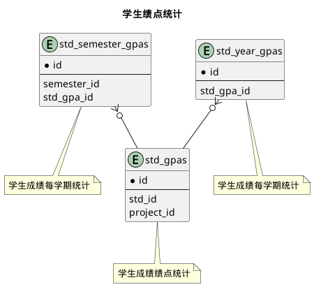


 目  录

* toc
{:toc}

### 关系图 1. 学生课程成绩
  * 关系图

### 关系图 2. 学生绩点统计
  * 关系图

### 表格 course_grade_states 成绩状态

  
<h5 id="table_edu.course_grade_states">表格edu.course_grade_states</h5>

  

<ul>
  <li>表格说明</li>
</ul>

<table class="table table-bordered table-striped table-condensed ">
<tr><th class="info_header">表名</th><th class="info_header">主键</th><th class="info_header" style="width:40%">注释</th>  </tr>
<tr><td>edu.course_grade_states</td><td>id</td><td>成绩状态</td>  </tr>
</table>
<ul>
  <li>表格中的列</li>
</ul>
<table class="table table-bordered table-striped table-condensed">
<tr><th class="info_header text-center">序号</th><th class="info_header">字段名</th><th class="info_header">字段类型</th><th class="info_header text-center">是否可空</th><th class="info_header">描述</th><th class="info_header">引用表</th>  </tr>
<tr><td class="text-center">1</td><td>id</td><td>bigint</td><td class="text-center">否</td><td>非业务主键:datetime</td><td></td>  </tr>
<tr><td class="text-center">2</td><td>clazz_id</td><td>bigint</td><td class="text-center">否</td><td>教学任务ID</td><td>            <a href="/model/edu/clazz/clazz.html#表格-clazzes-教学任务">edu.clazzes</a>
</td>  </tr>
<tr><td class="text-center">3</td><td>grading_mode_id</td><td>integer</td><td class="text-center">否</td><td>成绩记录方式ID</td><td>            <a href="/model/code/edu/all.html#表格-grading_modes-成绩记录方式">code.grading_modes</a>
</td>  </tr>
<tr><td class="text-center">4</td><td>inputer_id</td><td>bigint</td><td class="text-center">是</td><td>通用人员信息ID</td><td>            <a href="/model/base/common/user.html#表格-users-通用人员信息">base.users</a>
</td>  </tr>
<tr><td class="text-center">5</td><td>operator</td><td>varchar(100)</td><td class="text-center">否</td><td>操作者</td><td></td>  </tr>
<tr><td class="text-center">6</td><td>score_precision</td><td>integer</td><td class="text-center">否</td><td>保留小数位</td><td></td>  </tr>
<tr><td class="text-center">7</td><td>status</td><td>integer</td><td class="text-center">否</td><td>成绩状态</td><td></td>  </tr>
<tr><td class="text-center">8</td><td>updated_at</td><td>timestamptz</td><td class="text-center">否</td><td>更新时间</td><td></td>  </tr>
</table>

<ul>
  <li>表格的索引</li>
</ul>
<table class="table table-bordered table-striped table-condensed">
  <tr>
<th class="info_header">索引名</th><th class="info_header">索引字段</th><th class="info_header">是否唯一</th>  </tr>
<tr><td>idx_14ecxgagb3kumjkrb1bxv86tw</td><td>clazz_id</td><td>否</td>  </tr>
</table>
  

### 表格 course_grades 课程成绩实现

  
<h5 id="table_edu.course_grades">表格edu.course_grades</h5>

  

<ul>
  <li>表格说明</li>
</ul>

<table class="table table-bordered table-striped table-condensed ">
<tr><th class="info_header">表名</th><th class="info_header">主键</th><th class="info_header" style="width:40%">注释</th>  </tr>
<tr><td>edu.course_grades</td><td>id</td><td>课程成绩实现</td>  </tr>
</table>
<ul>
  <li>表格中的列</li>
</ul>
<table class="table table-bordered table-striped table-condensed">
<tr><th class="info_header text-center">序号</th><th class="info_header">字段名</th><th class="info_header">字段类型</th><th class="info_header text-center">是否可空</th><th class="info_header">描述</th><th class="info_header">引用表</th>  </tr>
<tr><td class="text-center">1</td><td>id</td><td>bigint</td><td class="text-center">否</td><td>非业务主键:datetime</td><td></td>  </tr>
<tr><td class="text-center">2</td><td>clazz_id</td><td>bigint</td><td class="text-center">是</td><td>教学任务ID</td><td>            <a href="/model/edu/clazz/clazz.html#表格-clazzes-教学任务">edu.clazzes</a>
</td>  </tr>
<tr><td class="text-center">3</td><td>course_id</td><td>bigint</td><td class="text-center">否</td><td>课程ID</td><td>            <a href="/model/base/edu/core.html#表格-courses-课程基本信息">base.courses</a>
</td>  </tr>
<tr><td class="text-center">4</td><td>course_take_type_id</td><td>integer</td><td class="text-center">否</td><td>修读类别ID</td><td>            <a href="/model/code/edu/all.html#表格-course_take_types-修读类别">code.course_take_types</a>
</td>  </tr>
<tr><td class="text-center">5</td><td>course_type_id</td><td>integer</td><td class="text-center">否</td><td>课程类别ID</td><td>            <a href="/model/base/edu/misc.html#表格-c_course_types-课程类别">base.c_course_types</a>
</td>  </tr>
<tr><td class="text-center">6</td><td>created_at</td><td>timestamptz</td><td class="text-center">否</td><td>创建时间</td><td></td>  </tr>
<tr><td class="text-center">7</td><td>crn</td><td>varchar(20)</td><td class="text-center">否</td><td>课程序号</td><td></td>  </tr>
<tr><td class="text-center">8</td><td>exam_mode_id</td><td>integer</td><td class="text-center">否</td><td>考核方式ID</td><td>            <a href="/model/code/edu/all.html#表格-exam_modes-考核方式">code.exam_modes</a>
</td>  </tr>
<tr><td class="text-center">9</td><td>free_listening</td><td>boolean</td><td class="text-center">否</td><td>是否免听</td><td></td>  </tr>
<tr><td class="text-center">10</td><td>gp</td><td>float4</td><td class="text-center">是</td><td>绩点</td><td></td>  </tr>
<tr><td class="text-center">11</td><td>grading_mode_id</td><td>integer</td><td class="text-center">否</td><td>成绩记录方式ID</td><td>            <a href="/model/code/edu/all.html#表格-grading_modes-成绩记录方式">code.grading_modes</a>
</td>  </tr>
<tr><td class="text-center">12</td><td>operator</td><td>varchar(100)</td><td class="text-center">是</td><td>操作者</td><td></td>  </tr>
<tr><td class="text-center">13</td><td>passed</td><td>boolean</td><td class="text-center">否</td><td>是否通过</td><td></td>  </tr>
<tr><td class="text-center">14</td><td>project_id</td><td>integer</td><td class="text-center">否</td><td>项目ID</td><td>            <a href="/model/base/common/misc.html#表格-projects-项目">base.projects</a>
</td>  </tr>
<tr><td class="text-center">15</td><td>provider</td><td>varchar(80)</td><td class="text-center">是</td><td>成绩来源</td><td></td>  </tr>
<tr><td class="text-center">16</td><td>remark</td><td>varchar(200)</td><td class="text-center">是</td><td>备注</td><td></td>  </tr>
<tr><td class="text-center">17</td><td>score</td><td>float4</td><td class="text-center">是</td><td>得分</td><td></td>  </tr>
<tr><td class="text-center">18</td><td>score_text</td><td>varchar(5)</td><td class="text-center">是</td><td>得分字面值</td><td></td>  </tr>
<tr><td class="text-center">19</td><td>semester_id</td><td>integer</td><td class="text-center">否</td><td>学期ID</td><td>            <a href="/model/base/common/time.html#表格-semesters-学年学期">base.semesters</a>
</td>  </tr>
<tr><td class="text-center">20</td><td>status</td><td>integer</td><td class="text-center">否</td><td>成绩状态</td><td></td>  </tr>
<tr><td class="text-center">21</td><td>std_id</td><td>bigint</td><td class="text-center">否</td><td>学生ID</td><td>            <a href="/model/base/std/core.html#表格-students-学籍信息实现">base.students</a>
</td>  </tr>
<tr><td class="text-center">22</td><td>updated_at</td><td>timestamptz</td><td class="text-center">否</td><td>更新时间</td><td></td>  </tr>
</table>

<ul>
  <li>表格中唯一约束</li>
</ul>
<table class="table table-bordered table-striped table-condensed">
  <tr>
<th class="info_header">序号</th><th class="info_header">约束名</th><th class="info_header">约束字段</th>  </tr>
<tr><td>1</td><td>uk_xitxltysiibv3efvpe69hk1j</td><td>std_id,course_id,semester_id,crn</td>  </tr>
</table>

<ul>
  <li>表格的索引</li>
</ul>
<table class="table table-bordered table-striped table-condensed">
  <tr>
<th class="info_header">索引名</th><th class="info_header">索引字段</th><th class="info_header">是否唯一</th>  </tr>
<tr><td>idx_4sj9rxcj7k0w4n33ijoi43yfw</td><td>std_id</td><td>否</td>  </tr>
<tr><td>idx_slt78xg1vj372c8mh8a9chs4l</td><td>clazz_id</td><td>否</td>  </tr>
<tr><td>idx_temwvr6v0fwgm0p56bik0h1wh</td><td>project_id</td><td>否</td>  </tr>
</table>
  

### 表格 exam_grade_states 考试成绩状态

  
<h5 id="table_edu.exam_grade_states">表格edu.exam_grade_states</h5>

  

<ul>
  <li>表格说明</li>
</ul>

<table class="table table-bordered table-striped table-condensed ">
<tr><th class="info_header">表名</th><th class="info_header">主键</th><th class="info_header" style="width:40%">注释</th>  </tr>
<tr><td>edu.exam_grade_states</td><td>id</td><td>考试成绩状态</td>  </tr>
</table>
<ul>
  <li>表格中的列</li>
</ul>
<table class="table table-bordered table-striped table-condensed">
<tr><th class="info_header text-center">序号</th><th class="info_header">字段名</th><th class="info_header">字段类型</th><th class="info_header text-center">是否可空</th><th class="info_header">描述</th><th class="info_header">引用表</th>  </tr>
<tr><td class="text-center">1</td><td>id</td><td>bigint</td><td class="text-center">否</td><td>非业务主键:datetime</td><td></td>  </tr>
<tr><td class="text-center">2</td><td>grade_state_id</td><td>bigint</td><td class="text-center">否</td><td>总成绩状态ID</td><td>            <a href="/model/edu/grade/course.html#表格-course_grade_states-成绩状态">edu.course_grade_states</a>
</td>  </tr>
<tr><td class="text-center">3</td><td>grade_type_id</td><td>integer</td><td class="text-center">否</td><td>成绩类型ID</td><td>            <a href="/model/code/edu/all.html#表格-grade_types-成绩类型">code.grade_types</a>
</td>  </tr>
<tr><td class="text-center">4</td><td>grading_mode_id</td><td>integer</td><td class="text-center">否</td><td>成绩记录方式ID</td><td>            <a href="/model/code/edu/all.html#表格-grading_modes-成绩记录方式">code.grading_modes</a>
</td>  </tr>
<tr><td class="text-center">5</td><td>operator</td><td>varchar(100)</td><td class="text-center">否</td><td>操作者</td><td></td>  </tr>
<tr><td class="text-center">6</td><td>remark</td><td>varchar(255)</td><td class="text-center">是</td><td>备注</td><td></td>  </tr>
<tr><td class="text-center">7</td><td>score_percent</td><td>smallint</td><td class="text-center">是</td><td>百分比描述</td><td></td>  </tr>
<tr><td class="text-center">8</td><td>status</td><td>integer</td><td class="text-center">否</td><td>成绩状态</td><td></td>  </tr>
<tr><td class="text-center">9</td><td>updated_at</td><td>timestamptz</td><td class="text-center">否</td><td>更新时间</td><td></td>  </tr>
</table>

<ul>
  <li>表格中唯一约束</li>
</ul>
<table class="table table-bordered table-striped table-condensed">
  <tr>
<th class="info_header">序号</th><th class="info_header">约束名</th><th class="info_header">约束字段</th>  </tr>
<tr><td>1</td><td>uk_hbbjtria5w2yv76athjignsdk</td><td>grade_state_id,grade_type_id</td>  </tr>
</table>

<ul>
  <li>表格的索引</li>
</ul>
<table class="table table-bordered table-striped table-condensed">
  <tr>
<th class="info_header">索引名</th><th class="info_header">索引字段</th><th class="info_header">是否唯一</th>  </tr>
<tr><td>idx_k9c9mutaa6jeye5w02bmskklp</td><td>grade_state_id</td><td>否</td>  </tr>
</table>
  

### 表格 exam_grades 考试成绩

  
<h5 id="table_edu.exam_grades">表格edu.exam_grades</h5>

  

<ul>
  <li>表格说明</li>
</ul>

<table class="table table-bordered table-striped table-condensed ">
<tr><th class="info_header">表名</th><th class="info_header">主键</th><th class="info_header" style="width:40%">注释</th>  </tr>
<tr><td>edu.exam_grades</td><td>id</td><td>考试成绩</td>  </tr>
</table>
<ul>
  <li>表格中的列</li>
</ul>
<table class="table table-bordered table-striped table-condensed">
<tr><th class="info_header text-center">序号</th><th class="info_header">字段名</th><th class="info_header">字段类型</th><th class="info_header text-center">是否可空</th><th class="info_header">描述</th><th class="info_header">引用表</th>  </tr>
<tr><td class="text-center">1</td><td>id</td><td>bigint</td><td class="text-center">否</td><td>非业务主键:datetime</td><td></td>  </tr>
<tr><td class="text-center">2</td><td>course_grade_id</td><td>bigint</td><td class="text-center">否</td><td>对应的课程成绩ID</td><td>            <a href="/model/edu/grade/course.html#表格-course_grades-课程成绩实现">edu.course_grades</a>
</td>  </tr>
<tr><td class="text-center">3</td><td>created_at</td><td>timestamptz</td><td class="text-center">否</td><td>创建时间</td><td></td>  </tr>
<tr><td class="text-center">4</td><td>exam_status_id</td><td>integer</td><td class="text-center">否</td><td>考试情况ID</td><td>            <a href="/model/code/edu/all.html#表格-exam_statuses-考试情况">code.exam_statuses</a>
</td>  </tr>
<tr><td class="text-center">5</td><td>grade_type_id</td><td>integer</td><td class="text-center">否</td><td>成绩类型ID</td><td>            <a href="/model/code/edu/all.html#表格-grade_types-成绩类型">code.grade_types</a>
</td>  </tr>
<tr><td class="text-center">6</td><td>grading_mode_id</td><td>integer</td><td class="text-center">否</td><td>成绩记录方式ID</td><td>            <a href="/model/code/edu/all.html#表格-grading_modes-成绩记录方式">code.grading_modes</a>
</td>  </tr>
<tr><td class="text-center">7</td><td>operator</td><td>varchar(100)</td><td class="text-center">是</td><td>操作者</td><td></td>  </tr>
<tr><td class="text-center">8</td><td>passed</td><td>boolean</td><td class="text-center">否</td><td>是否通过</td><td></td>  </tr>
<tr><td class="text-center">9</td><td>score</td><td>float4</td><td class="text-center">是</td><td>得分</td><td></td>  </tr>
<tr><td class="text-center">10</td><td>score_percent</td><td>smallint</td><td class="text-center">是</td><td>百分比描述</td><td></td>  </tr>
<tr><td class="text-center">11</td><td>score_text</td><td>varchar(5)</td><td class="text-center">是</td><td>得分字面值</td><td></td>  </tr>
<tr><td class="text-center">12</td><td>status</td><td>integer</td><td class="text-center">否</td><td>成绩状态</td><td></td>  </tr>
<tr><td class="text-center">13</td><td>updated_at</td><td>timestamptz</td><td class="text-center">否</td><td>更新时间</td><td></td>  </tr>
</table>

<ul>
  <li>表格中唯一约束</li>
</ul>
<table class="table table-bordered table-striped table-condensed">
  <tr>
<th class="info_header">序号</th><th class="info_header">约束名</th><th class="info_header">约束字段</th>  </tr>
<tr><td>1</td><td>uk_ij6eu0s9mftmblpso35iwm796</td><td>course_grade_id,grade_type_id</td>  </tr>
</table>

<ul>
  <li>表格的索引</li>
</ul>
<table class="table table-bordered table-striped table-condensed">
  <tr>
<th class="info_header">索引名</th><th class="info_header">索引字段</th><th class="info_header">是否唯一</th>  </tr>
<tr><td>idx_otlslgc3imibs7quv0d0dqjb3</td><td>course_grade_id</td><td>否</td>  </tr>
</table>
  

### 表格 ga_grade_states 总评成绩状态

  
<h5 id="table_edu.ga_grade_states">表格edu.ga_grade_states</h5>

  

<ul>
  <li>表格说明</li>
</ul>

<table class="table table-bordered table-striped table-condensed ">
<tr><th class="info_header">表名</th><th class="info_header">主键</th><th class="info_header" style="width:40%">注释</th>  </tr>
<tr><td>edu.ga_grade_states</td><td>id</td><td>总评成绩状态</td>  </tr>
</table>
<ul>
  <li>表格中的列</li>
</ul>
<table class="table table-bordered table-striped table-condensed">
<tr><th class="info_header text-center">序号</th><th class="info_header">字段名</th><th class="info_header">字段类型</th><th class="info_header text-center">是否可空</th><th class="info_header">描述</th><th class="info_header">引用表</th>  </tr>
<tr><td class="text-center">1</td><td>id</td><td>bigint</td><td class="text-center">否</td><td>非业务主键:datetime</td><td></td>  </tr>
<tr><td class="text-center">2</td><td>grade_state_id</td><td>bigint</td><td class="text-center">否</td><td>总成绩状态ID</td><td>            <a href="/model/edu/grade/course.html#表格-course_grade_states-成绩状态">edu.course_grade_states</a>
</td>  </tr>
<tr><td class="text-center">3</td><td>grade_type_id</td><td>integer</td><td class="text-center">否</td><td>成绩类型ID</td><td>            <a href="/model/code/edu/all.html#表格-grade_types-成绩类型">code.grade_types</a>
</td>  </tr>
<tr><td class="text-center">4</td><td>grading_mode_id</td><td>integer</td><td class="text-center">否</td><td>成绩记录方式ID</td><td>            <a href="/model/code/edu/all.html#表格-grading_modes-成绩记录方式">code.grading_modes</a>
</td>  </tr>
<tr><td class="text-center">5</td><td>operator</td><td>varchar(100)</td><td class="text-center">否</td><td>操作者</td><td></td>  </tr>
<tr><td class="text-center">6</td><td>remark</td><td>varchar(50)</td><td class="text-center">是</td><td>备注</td><td></td>  </tr>
<tr><td class="text-center">7</td><td>status</td><td>integer</td><td class="text-center">否</td><td>成绩状态</td><td></td>  </tr>
<tr><td class="text-center">8</td><td>updated_at</td><td>timestamptz</td><td class="text-center">否</td><td>更新时间</td><td></td>  </tr>
</table>

<ul>
  <li>表格中唯一约束</li>
</ul>
<table class="table table-bordered table-striped table-condensed">
  <tr>
<th class="info_header">序号</th><th class="info_header">约束名</th><th class="info_header">约束字段</th>  </tr>
<tr><td>1</td><td>uk_55c7tsme8v49y1o7tjn1r8vpe</td><td>grade_state_id,grade_type_id</td>  </tr>
</table>

<ul>
  <li>表格的索引</li>
</ul>
<table class="table table-bordered table-striped table-condensed">
  <tr>
<th class="info_header">索引名</th><th class="info_header">索引字段</th><th class="info_header">是否唯一</th>  </tr>
<tr><td>idx_1lirrcdr4lcwbe5iju3f82jsb</td><td>grade_state_id</td><td>否</td>  </tr>
</table>
  

### 表格 ga_grades 总评成绩

  
<h5 id="table_edu.ga_grades">表格edu.ga_grades</h5>

  

<ul>
  <li>表格说明</li>
</ul>

<table class="table table-bordered table-striped table-condensed ">
<tr><th class="info_header">表名</th><th class="info_header">主键</th><th class="info_header" style="width:40%">注释</th>  </tr>
<tr><td>edu.ga_grades</td><td>id</td><td>总评成绩</td>  </tr>
</table>
<ul>
  <li>表格中的列</li>
</ul>
<table class="table table-bordered table-striped table-condensed">
<tr><th class="info_header text-center">序号</th><th class="info_header">字段名</th><th class="info_header">字段类型</th><th class="info_header text-center">是否可空</th><th class="info_header">描述</th><th class="info_header">引用表</th>  </tr>
<tr><td class="text-center">1</td><td>id</td><td>bigint</td><td class="text-center">否</td><td>非业务主键:datetime</td><td></td>  </tr>
<tr><td class="text-center">2</td><td>course_grade_id</td><td>bigint</td><td class="text-center">否</td><td>对应的课程成绩ID</td><td>            <a href="/model/edu/grade/course.html#表格-course_grades-课程成绩实现">edu.course_grades</a>
</td>  </tr>
<tr><td class="text-center">3</td><td>created_at</td><td>timestamptz</td><td class="text-center">否</td><td>创建时间</td><td></td>  </tr>
<tr><td class="text-center">4</td><td>delta</td><td>float4</td><td class="text-center">是</td><td>加减修正分</td><td></td>  </tr>
<tr><td class="text-center">5</td><td>gp</td><td>float4</td><td class="text-center">是</td><td>绩点</td><td></td>  </tr>
<tr><td class="text-center">6</td><td>grade_type_id</td><td>integer</td><td class="text-center">否</td><td>成绩类型ID</td><td>            <a href="/model/code/edu/all.html#表格-grade_types-成绩类型">code.grade_types</a>
</td>  </tr>
<tr><td class="text-center">7</td><td>grading_mode_id</td><td>integer</td><td class="text-center">否</td><td>成绩记录方式ID</td><td>            <a href="/model/code/edu/all.html#表格-grading_modes-成绩记录方式">code.grading_modes</a>
</td>  </tr>
<tr><td class="text-center">8</td><td>operator</td><td>varchar(100)</td><td class="text-center">是</td><td>操作者</td><td></td>  </tr>
<tr><td class="text-center">9</td><td>passed</td><td>boolean</td><td class="text-center">否</td><td>是否通过</td><td></td>  </tr>
<tr><td class="text-center">10</td><td>remark</td><td>varchar(255)</td><td class="text-center">是</td><td>备注</td><td></td>  </tr>
<tr><td class="text-center">11</td><td>score</td><td>float4</td><td class="text-center">是</td><td>得分</td><td></td>  </tr>
<tr><td class="text-center">12</td><td>score_text</td><td>varchar(5)</td><td class="text-center">是</td><td>得分字面值</td><td></td>  </tr>
<tr><td class="text-center">13</td><td>status</td><td>integer</td><td class="text-center">否</td><td>成绩状态</td><td></td>  </tr>
<tr><td class="text-center">14</td><td>updated_at</td><td>timestamptz</td><td class="text-center">否</td><td>更新时间</td><td></td>  </tr>
</table>

<ul>
  <li>表格中唯一约束</li>
</ul>
<table class="table table-bordered table-striped table-condensed">
  <tr>
<th class="info_header">序号</th><th class="info_header">约束名</th><th class="info_header">约束字段</th>  </tr>
<tr><td>1</td><td>uk_6l1n05tqq55sh661e6s1s12vm</td><td>course_grade_id,grade_type_id</td>  </tr>
</table>

<ul>
  <li>表格的索引</li>
</ul>
<table class="table table-bordered table-striped table-condensed">
  <tr>
<th class="info_header">索引名</th><th class="info_header">索引字段</th><th class="info_header">是否唯一</th>  </tr>
<tr><td>idx_2h8ijcy7d6yg7t44byw2rn1i7</td><td>course_grade_id</td><td>否</td>  </tr>
</table>
  

### 表格 std_gpas 学生成绩绩点统计

  
<h5 id="table_edu.std_gpas">表格edu.std_gpas</h5>

  

<ul>
  <li>表格说明</li>
</ul>

<table class="table table-bordered table-striped table-condensed ">
<tr><th class="info_header">表名</th><th class="info_header">主键</th><th class="info_header" style="width:40%">注释</th>  </tr>
<tr><td>edu.std_gpas</td><td>id</td><td>学生成绩绩点统计</td>  </tr>
</table>
<ul>
  <li>表格中的列</li>
</ul>
<table class="table table-bordered table-striped table-condensed">
<tr><th class="info_header text-center">序号</th><th class="info_header">字段名</th><th class="info_header">字段类型</th><th class="info_header text-center">是否可空</th><th class="info_header">描述</th><th class="info_header">引用表</th>  </tr>
<tr><td class="text-center">1</td><td>id</td><td>bigint</td><td class="text-center">否</td><td>非业务主键:datetime</td><td></td>  </tr>
<tr><td class="text-center">2</td><td>credits</td><td>float4</td><td class="text-center">否</td><td>获得学分</td><td></td>  </tr>
<tr><td class="text-center">3</td><td>ga</td><td>float4</td><td class="text-center">否</td><td>平均分</td><td></td>  </tr>
<tr><td class="text-center">4</td><td>gpa</td><td>float4</td><td class="text-center">否</td><td>总平均绩点</td><td></td>  </tr>
<tr><td class="text-center">5</td><td>grade_count</td><td>integer</td><td class="text-center">否</td><td>门数</td><td></td>  </tr>
<tr><td class="text-center">6</td><td>project_id</td><td>integer</td><td class="text-center">否</td><td>项目ID</td><td>            <a href="/model/base/common/misc.html#表格-projects-项目">base.projects</a>
</td>  </tr>
<tr><td class="text-center">7</td><td>std_id</td><td>bigint</td><td class="text-center">否</td><td>学生ID</td><td>            <a href="/model/base/std/core.html#表格-students-学籍信息实现">base.students</a>
</td>  </tr>
<tr><td class="text-center">8</td><td>total_credits</td><td>float4</td><td class="text-center">否</td><td>总学分</td><td></td>  </tr>
<tr><td class="text-center">9</td><td>updated_at</td><td>timestamptz</td><td class="text-center">否</td><td>更新时间</td><td></td>  </tr>
</table>

<ul>
  <li>表格中唯一约束</li>
</ul>
<table class="table table-bordered table-striped table-condensed">
  <tr>
<th class="info_header">序号</th><th class="info_header">约束名</th><th class="info_header">约束字段</th>  </tr>
<tr><td>1</td><td>uk_1pgtli4u8gcx191biigqq6mty</td><td>std_id</td>  </tr>
</table>

  

### 表格 std_semester_gpas 学生成绩每学期统计

  
<h5 id="table_edu.std_semester_gpas">表格edu.std_semester_gpas</h5>

  

<ul>
  <li>表格说明</li>
</ul>

<table class="table table-bordered table-striped table-condensed ">
<tr><th class="info_header">表名</th><th class="info_header">主键</th><th class="info_header" style="width:40%">注释</th>  </tr>
<tr><td>edu.std_semester_gpas</td><td>id</td><td>学生成绩每学期统计</td>  </tr>
</table>
<ul>
  <li>表格中的列</li>
</ul>
<table class="table table-bordered table-striped table-condensed">
<tr><th class="info_header text-center">序号</th><th class="info_header">字段名</th><th class="info_header">字段类型</th><th class="info_header text-center">是否可空</th><th class="info_header">描述</th><th class="info_header">引用表</th>  </tr>
<tr><td class="text-center">1</td><td>id</td><td>bigint</td><td class="text-center">否</td><td>非业务主键:datetime</td><td></td>  </tr>
<tr><td class="text-center">2</td><td>credits</td><td>float4</td><td class="text-center">否</td><td>获得学分</td><td></td>  </tr>
<tr><td class="text-center">3</td><td>ga</td><td>float4</td><td class="text-center">否</td><td>平均分</td><td></td>  </tr>
<tr><td class="text-center">4</td><td>gpa</td><td>float4</td><td class="text-center">否</td><td>总平均绩点</td><td></td>  </tr>
<tr><td class="text-center">5</td><td>grade_count</td><td>integer</td><td class="text-center">否</td><td>门数</td><td></td>  </tr>
<tr><td class="text-center">6</td><td>semester_id</td><td>integer</td><td class="text-center">否</td><td>学期ID</td><td>            <a href="/model/base/common/time.html#表格-semesters-学年学期">base.semesters</a>
</td>  </tr>
<tr><td class="text-center">7</td><td>std_gpa_id</td><td>bigint</td><td class="text-center">否</td><td>总体统计ID</td><td>            <a href="/model/edu/grade/course.html#表格-std_gpas-学生成绩绩点统计">edu.std_gpas</a>
</td>  </tr>
<tr><td class="text-center">8</td><td>total_credits</td><td>float4</td><td class="text-center">否</td><td>总学分</td><td></td>  </tr>
</table>

<ul>
  <li>表格中唯一约束</li>
</ul>
<table class="table table-bordered table-striped table-condensed">
  <tr>
<th class="info_header">序号</th><th class="info_header">约束名</th><th class="info_header">约束字段</th>  </tr>
<tr><td>1</td><td>uk_54djya8v8f1shu5uutr9e555e</td><td>std_gpa_id,semester_id</td>  </tr>
</table>

<ul>
  <li>表格的索引</li>
</ul>
<table class="table table-bordered table-striped table-condensed">
  <tr>
<th class="info_header">索引名</th><th class="info_header">索引字段</th><th class="info_header">是否唯一</th>  </tr>
<tr><td>idx_oi064e8gd1lg81fdcrvgp4p2a</td><td>std_gpa_id</td><td>否</td>  </tr>
</table>
  

### 表格 std_year_gpas 学生成绩每学期统计

  
<h5 id="table_edu.std_year_gpas">表格edu.std_year_gpas</h5>

  

<ul>
  <li>表格说明</li>
</ul>

<table class="table table-bordered table-striped table-condensed ">
<tr><th class="info_header">表名</th><th class="info_header">主键</th><th class="info_header" style="width:40%">注释</th>  </tr>
<tr><td>edu.std_year_gpas</td><td>id</td><td>学生成绩每学期统计</td>  </tr>
</table>
<ul>
  <li>表格中的列</li>
</ul>
<table class="table table-bordered table-striped table-condensed">
<tr><th class="info_header text-center">序号</th><th class="info_header">字段名</th><th class="info_header">字段类型</th><th class="info_header text-center">是否可空</th><th class="info_header">描述</th><th class="info_header">引用表</th>  </tr>
<tr><td class="text-center">1</td><td>id</td><td>bigint</td><td class="text-center">否</td><td>非业务主键:datetime</td><td></td>  </tr>
<tr><td class="text-center">2</td><td>credits</td><td>float4</td><td class="text-center">否</td><td>获得学分</td><td></td>  </tr>
<tr><td class="text-center">3</td><td>ga</td><td>float4</td><td class="text-center">否</td><td>平均分</td><td></td>  </tr>
<tr><td class="text-center">4</td><td>gpa</td><td>float4</td><td class="text-center">否</td><td>总平均绩点</td><td></td>  </tr>
<tr><td class="text-center">5</td><td>grade_count</td><td>integer</td><td class="text-center">否</td><td>门数</td><td></td>  </tr>
<tr><td class="text-center">6</td><td>school_year</td><td>varchar(255)</td><td class="text-center">否</td><td>学年</td><td></td>  </tr>
<tr><td class="text-center">7</td><td>std_gpa_id</td><td>bigint</td><td class="text-center">否</td><td>总体统计ID</td><td>            <a href="/model/edu/grade/course.html#表格-std_gpas-学生成绩绩点统计">edu.std_gpas</a>
</td>  </tr>
<tr><td class="text-center">8</td><td>total_credits</td><td>float4</td><td class="text-center">否</td><td>总学分</td><td></td>  </tr>
</table>

<ul>
  <li>表格中唯一约束</li>
</ul>
<table class="table table-bordered table-striped table-condensed">
  <tr>
<th class="info_header">序号</th><th class="info_header">约束名</th><th class="info_header">约束字段</th>  </tr>
<tr><td>1</td><td>uk_e0src4xf9uskqtilum6e01344</td><td>std_gpa_id,school_year</td>  </tr>
</table>

<ul>
  <li>表格的索引</li>
</ul>
<table class="table table-bordered table-striped table-condensed">
  <tr>
<th class="info_header">索引名</th><th class="info_header">索引字段</th><th class="info_header">是否唯一</th>  </tr>
<tr><td>idx_k2it4d6hlqi69f22ht73l2ogb</td><td>std_gpa_id</td><td>否</td>  </tr>
</table>
  

