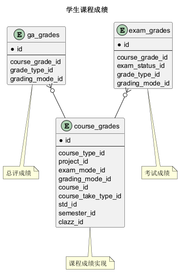
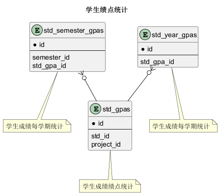
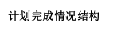
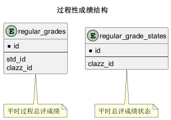

# 教务管理 成绩信息 表结构

## 表格一览

<table class="table-mini">
  <thead>
    <tr>
      <th class="info_header text-center" width="7%">序号</th>
      <th class="info_header" width="43%">表名/描述</th>
      <th class="info_header text-center" width="7%">序号</th>
      <th class="info_header" width="43%">表名/描述</th>
    </tr>
  </thead>
  <tbody>
    <tr>
      <td class="text-center">1</td>
      <td><a href="/model/edu/grade.html#audit-course-results">audit_course_results</a> 课程审核结果</td>
      <td class="text-center">9</td>
      <td><a href="/model/edu/grade.html#ga-grades">ga_grades</a> 总评成绩</td>
    </tr>
    <tr>
      <td class="text-center">2</td>
      <td><a href="/model/edu/grade.html#audit-group-results">audit_group_results</a> 组审核结果</td>
      <td class="text-center">10</td>
      <td><a href="/model/edu/grade.html#moral-grades">moral_grades</a> 德育成绩</td>
    </tr>
    <tr>
      <td class="text-center">3</td>
      <td><a href="/model/edu/grade.html#audit-plan-results">audit_plan_results</a> 计划审核结果</td>
      <td class="text-center">11</td>
      <td><a href="/model/edu/grade.html#regular-grade-states">regular_grade_states</a> 平时总评成绩状态</td>
    </tr>
    <tr>
      <td class="text-center">4</td>
      <td><a href="/model/edu/grade.html#course-grade-states">course_grade_states</a> 成绩状态</td>
      <td class="text-center">12</td>
      <td><a href="/model/edu/grade.html#regular-grades">regular_grades</a> 平时过程总评成绩</td>
    </tr>
    <tr>
      <td class="text-center">5</td>
      <td><a href="/model/edu/grade.html#course-grades">course_grades</a> 课程成绩实现</td>
      <td class="text-center">13</td>
      <td><a href="/model/edu/grade.html#std-gpas">std_gpas</a> 学生成绩绩点统计</td>
    </tr>
    <tr>
      <td class="text-center">6</td>
      <td><a href="/model/edu/grade.html#exam-grade-states">exam_grade_states</a> 考试成绩状态</td>
      <td class="text-center">14</td>
      <td><a href="/model/edu/grade.html#std-semester-gpas">std_semester_gpas</a> 学生成绩每学期统计</td>
    </tr>
    <tr>
      <td class="text-center">7</td>
      <td><a href="/model/edu/grade.html#exam-grades">exam_grades</a> 考试成绩</td>
      <td class="text-center">15</td>
      <td><a href="/model/edu/grade.html#std-year-gpas">std_year_gpas</a> 学生成绩每学期统计</td>
    </tr>
    <tr>
      <td class="text-center">8</td>
      <td><a href="/model/edu/grade.html#ga-grade-states">ga_grade_states</a> 总评成绩状态</td>
      <td></td>
      <td></td>
    </tr>
  </tbody>
</table>

## 关键关系图

### 关系图 1. 学生课程成绩
  * 关系图

### 关系图 2. 学生绩点统计
  * 关系图

### 关系图 3. 计划完成情况结构
  * 关系图

### 关系图 4. 过程性成绩结构
  * 关系图

## 表格明细

## audit_course_results

<table class="table-entity">
  <tbody>
    <tr>
      <td class="table-entity-title" width="15%">表名:&nbsp;</td>
      <td>edu.audit_course_results 课程审核结果</td>
    </tr>
    <tr>
      <td class="table-entity-title">唯一约束:&nbsp;</td>
      <td>主键🔑(id) uk_l15jy8rdu4luc06vmaa8xx7ct(group_result_id,course_id)</td>
    </tr>
    <tr>
      <td class="table-entity-title">索引:&nbsp;</td>
      <td>idx_7f4fl8ra3f9rfwu0dn89o4mcu(group_result_id) </td>
    </tr>
  </tbody>
</table>

<table class="table-entity">
  <thead>
    <tr>
<th class="info_header text-center" width="7%">序号</th><th class="info_header" width="20%">字段名</th><th class="info_header" width="20%">字段类型</th><th class="info_header text-center" width="8%">是否可空</th><th class="info_header" width="25%">描述</th><th class="info_header" width="20%">引用表</th>    </tr>
  </thead>
  <tbody>
    <tr>
      <td class="text-center">1</td>
      <td>id</td>
      <td>bigint</td>
      <td class="text-center">否</td>
      <td>非业务主键:datetime</td>
      <td>      </td>
    </tr>
    <tr>
      <td class="text-center">2</td>
      <td>compulsory</td>
      <td>boolean</td>
      <td class="text-center">否</td>
      <td>是否必修</td>
      <td>      </td>
    </tr>
    <tr>
      <td class="text-center">3</td>
      <td>course_id</td>
      <td>bigint</td>
      <td class="text-center">否</td>
      <td>课程基本信息ID</td>
      <td><a href="/model/base/edu.html#courses">base.courses</a>      </td>
    </tr>
    <tr>
      <td class="text-center">4</td>
      <td>group_result_id</td>
      <td>bigint</td>
      <td class="text-center">否</td>
      <td>组审核结果ID</td>
      <td><a href="/model/edu/grade.html#audit-group-results">edu.audit_group_results</a>      </td>
    </tr>
    <tr>
      <td class="text-center">5</td>
      <td>has_grade</td>
      <td>boolean</td>
      <td class="text-center">否</td>
      <td>是否有成绩</td>
      <td>      </td>
    </tr>
    <tr>
      <td class="text-center">6</td>
      <td>passed</td>
      <td>boolean</td>
      <td class="text-center">否</td>
      <td>是否通过</td>
      <td>      </td>
    </tr>
    <tr>
      <td class="text-center">7</td>
      <td>passed_way</td>
      <td>integer</td>
      <td class="text-center">是</td>
      <td>通过方式</td>
      <td>      </td>
    </tr>
    <tr>
      <td class="text-center">8</td>
      <td>predicted</td>
      <td>boolean</td>
      <td class="text-center">否</td>
      <td>预计是否通过</td>
      <td>      </td>
    </tr>
    <tr>
      <td class="text-center">9</td>
      <td>remark</td>
      <td>varchar(200)</td>
      <td class="text-center">是</td>
      <td>备注</td>
      <td>      </td>
    </tr>
    <tr>
      <td class="text-center">10</td>
      <td>scores</td>
      <td>varchar(50)</td>
      <td class="text-center">否</td>
      <td>分数</td>
      <td>      </td>
    </tr>
    <tr>
      <td class="text-center">11</td>
      <td>taking</td>
      <td>boolean</td>
      <td class="text-center">否</td>
      <td>是否正在修读</td>
      <td>      </td>
    </tr>
    <tr>
      <td class="text-center">12</td>
      <td>terms</td>
      <td>integer</td>
      <td class="text-center">否</td>
      <td>开课学期</td>
      <td>      </td>
    </tr>
  </tbody>
</table>

## audit_group_results

<table class="table-entity">
  <tbody>
    <tr>
      <td class="table-entity-title" width="15%">表名:&nbsp;</td>
      <td>edu.audit_group_results 组审核结果</td>
    </tr>
    <tr>
      <td class="table-entity-title">唯一约束:&nbsp;</td>
      <td>主键🔑(id) </td>
    </tr>
    <tr>
      <td class="table-entity-title">索引:&nbsp;</td>
      <td>idx_1fjw4dws9p4gekfgb0n7864wq(plan_result_id) ,idx_acjvk6wb7g4n0uokihrrqn060(parent_id) </td>
    </tr>
  </tbody>
</table>

<table class="table-entity">
  <thead>
    <tr>
<th class="info_header text-center" width="7%">序号</th><th class="info_header" width="20%">字段名</th><th class="info_header" width="20%">字段类型</th><th class="info_header text-center" width="8%">是否可空</th><th class="info_header" width="25%">描述</th><th class="info_header" width="20%">引用表</th>    </tr>
  </thead>
  <tbody>
    <tr>
      <td class="text-center">1</td>
      <td>id</td>
      <td>bigint</td>
      <td class="text-center">否</td>
      <td>非业务主键:datetime</td>
      <td>      </td>
    </tr>
    <tr>
      <td class="text-center">2</td>
      <td>converted_credits</td>
      <td>float4</td>
      <td class="text-center">否</td>
      <td>转换学分</td>
      <td>      </td>
    </tr>
    <tr>
      <td class="text-center">3</td>
      <td>course_type_id</td>
      <td>integer</td>
      <td class="text-center">否</td>
      <td>课程类别ID</td>
      <td><a href="/model/code/all.html#course-types">code.course_types</a>      </td>
    </tr>
    <tr>
      <td class="text-center">4</td>
      <td>indexno</td>
      <td>varchar(255)</td>
      <td class="text-center">否</td>
      <td>顺序号</td>
      <td>      </td>
    </tr>
    <tr>
      <td class="text-center">5</td>
      <td>name</td>
      <td>varchar(100)</td>
      <td class="text-center">否</td>
      <td>名称</td>
      <td>      </td>
    </tr>
    <tr>
      <td class="text-center">6</td>
      <td>owed_credits</td>
      <td>float4</td>
      <td class="text-center">否</td>
      <td>不足学分</td>
      <td>      </td>
    </tr>
    <tr>
      <td class="text-center">7</td>
      <td>owed_credits2</td>
      <td>float4</td>
      <td class="text-center">否</td>
      <td>预计完成不足学分</td>
      <td>      </td>
    </tr>
    <tr>
      <td class="text-center">8</td>
      <td>owed_credits3</td>
      <td>float4</td>
      <td class="text-center">否</td>
      <td>考虑在读情况下不足学分</td>
      <td>      </td>
    </tr>
    <tr>
      <td class="text-center">9</td>
      <td>parent_id</td>
      <td>bigint</td>
      <td class="text-center">是</td>
      <td>组审核结果ID</td>
      <td><a href="/model/edu/grade.html#audit-group-results">edu.audit_group_results</a>      </td>
    </tr>
    <tr>
      <td class="text-center">10</td>
      <td>passed</td>
      <td>boolean</td>
      <td class="text-center">否</td>
      <td>是否通过</td>
      <td>      </td>
    </tr>
    <tr>
      <td class="text-center">11</td>
      <td>passed_credits</td>
      <td>float4</td>
      <td class="text-center">否</td>
      <td>完成学分</td>
      <td>      </td>
    </tr>
    <tr>
      <td class="text-center">12</td>
      <td>plan_result_id</td>
      <td>bigint</td>
      <td class="text-center">否</td>
      <td>计划审核结果ID</td>
      <td><a href="/model/edu/grade.html#audit-plan-results">edu.audit_plan_results</a>      </td>
    </tr>
    <tr>
      <td class="text-center">13</td>
      <td>rank_id</td>
      <td>integer</td>
      <td class="text-center">是</td>
      <td>课程属性ID</td>
      <td><a href="/model/code/all.html#course-ranks">code.course_ranks</a>      </td>
    </tr>
    <tr>
      <td class="text-center">14</td>
      <td>remark</td>
      <td>varchar(255)</td>
      <td class="text-center">是</td>
      <td>备注</td>
      <td>      </td>
    </tr>
    <tr>
      <td class="text-center">15</td>
      <td>required_credits</td>
      <td>float4</td>
      <td class="text-center">否</td>
      <td>要求学分</td>
      <td>      </td>
    </tr>
    <tr>
      <td class="text-center">16</td>
      <td>sub_count</td>
      <td>smallint</td>
      <td class="text-center">否</td>
      <td>要求完成子组数量</td>
      <td>      </td>
    </tr>
  </tbody>
</table>

## audit_plan_results

<table class="table-entity">
  <tbody>
    <tr>
      <td class="table-entity-title" width="15%">表名:&nbsp;</td>
      <td>edu.audit_plan_results 计划审核结果</td>
    </tr>
    <tr>
      <td class="table-entity-title">唯一约束:&nbsp;</td>
      <td>主键🔑(id) uk_ny8kmjinja7xa9ye8cou48588(std_id)</td>
    </tr>
  </tbody>
</table>

<table class="table-entity">
  <thead>
    <tr>
<th class="info_header text-center" width="7%">序号</th><th class="info_header" width="20%">字段名</th><th class="info_header" width="20%">字段类型</th><th class="info_header text-center" width="8%">是否可空</th><th class="info_header" width="25%">描述</th><th class="info_header" width="20%">引用表</th>    </tr>
  </thead>
  <tbody>
    <tr>
      <td class="text-center">1</td>
      <td>id</td>
      <td>bigint</td>
      <td class="text-center">否</td>
      <td>非业务主键:datetime</td>
      <td>      </td>
    </tr>
    <tr>
      <td class="text-center">2</td>
      <td>archived</td>
      <td>boolean</td>
      <td class="text-center">否</td>
      <td>是否归档</td>
      <td>      </td>
    </tr>
    <tr>
      <td class="text-center">3</td>
      <td>owed_credits</td>
      <td>float4</td>
      <td class="text-center">否</td>
      <td>不足学分</td>
      <td>      </td>
    </tr>
    <tr>
      <td class="text-center">4</td>
      <td>owed_credits2</td>
      <td>float4</td>
      <td class="text-center">否</td>
      <td>预计完成不足学分</td>
      <td>      </td>
    </tr>
    <tr>
      <td class="text-center">5</td>
      <td>owed_credits3</td>
      <td>float4</td>
      <td class="text-center">否</td>
      <td>考虑在读情况下不足学分</td>
      <td>      </td>
    </tr>
    <tr>
      <td class="text-center">6</td>
      <td>passed</td>
      <td>boolean</td>
      <td class="text-center">否</td>
      <td>是否通过</td>
      <td>      </td>
    </tr>
    <tr>
      <td class="text-center">7</td>
      <td>passed_credits</td>
      <td>float4</td>
      <td class="text-center">否</td>
      <td>完成学分</td>
      <td>      </td>
    </tr>
    <tr>
      <td class="text-center">8</td>
      <td>predicted</td>
      <td>boolean</td>
      <td class="text-center">否</td>
      <td>预计是否通过</td>
      <td>      </td>
    </tr>
    <tr>
      <td class="text-center">9</td>
      <td>remark</td>
      <td>varchar(200)</td>
      <td class="text-center">是</td>
      <td>备注</td>
      <td>      </td>
    </tr>
    <tr>
      <td class="text-center">10</td>
      <td>required_credits</td>
      <td>float4</td>
      <td class="text-center">否</td>
      <td>要求学分</td>
      <td>      </td>
    </tr>
    <tr>
      <td class="text-center">11</td>
      <td>std_id</td>
      <td>bigint</td>
      <td class="text-center">否</td>
      <td>学生ID</td>
      <td><a href="/model/base/edu.html#students">base.students</a>      </td>
    </tr>
    <tr>
      <td class="text-center">12</td>
      <td>updated_at</td>
      <td>timestamptz</td>
      <td class="text-center">否</td>
      <td>更新时间</td>
      <td>      </td>
    </tr>
    <tr>
      <td class="text-center">13</td>
      <td>updates</td>
      <td>varchar(500)</td>
      <td class="text-center">是</td>
      <td>更新内容</td>
      <td>      </td>
    </tr>
  </tbody>
</table>

## course_grade_states

<table class="table-entity">
  <tbody>
    <tr>
      <td class="table-entity-title" width="15%">表名:&nbsp;</td>
      <td>edu.course_grade_states 成绩状态</td>
    </tr>
    <tr>
      <td class="table-entity-title">唯一约束:&nbsp;</td>
      <td>主键🔑(id) </td>
    </tr>
    <tr>
      <td class="table-entity-title">索引:&nbsp;</td>
      <td>idx_14ecxgagb3kumjkrb1bxv86tw(clazz_id) </td>
    </tr>
  </tbody>
</table>

<table class="table-entity">
  <thead>
    <tr>
<th class="info_header text-center" width="7%">序号</th><th class="info_header" width="20%">字段名</th><th class="info_header" width="20%">字段类型</th><th class="info_header text-center" width="8%">是否可空</th><th class="info_header" width="25%">描述</th><th class="info_header" width="20%">引用表</th>    </tr>
  </thead>
  <tbody>
    <tr>
      <td class="text-center">1</td>
      <td>id</td>
      <td>bigint</td>
      <td class="text-center">否</td>
      <td>非业务主键:datetime</td>
      <td>      </td>
    </tr>
    <tr>
      <td class="text-center">2</td>
      <td>clazz_id</td>
      <td>bigint</td>
      <td class="text-center">否</td>
      <td>教学任务ID</td>
      <td><a href="/model/edu/clazz.html#clazzes">edu.clazzes</a>      </td>
    </tr>
    <tr>
      <td class="text-center">3</td>
      <td>excellent_ratio</td>
      <td>float4</td>
      <td class="text-center">是</td>
      <td>优秀比例</td>
      <td>      </td>
    </tr>
    <tr>
      <td class="text-center">4</td>
      <td>excellent_ratio_limit</td>
      <td>float4</td>
      <td class="text-center">是</td>
      <td>优秀比例限制</td>
      <td>      </td>
    </tr>
    <tr>
      <td class="text-center">5</td>
      <td>grading_mode_id</td>
      <td>integer</td>
      <td class="text-center">否</td>
      <td>成绩记录方式ID</td>
      <td><a href="/model/code/all.html#grading-modes">code.grading_modes</a>      </td>
    </tr>
    <tr>
      <td class="text-center">6</td>
      <td>inputer_id</td>
      <td>bigint</td>
      <td class="text-center">是</td>
      <td>通用人员信息ID</td>
      <td><a href="/model/base/user.html#users">base.users</a>      </td>
    </tr>
    <tr>
      <td class="text-center">7</td>
      <td>operator</td>
      <td>varchar(100)</td>
      <td class="text-center">否</td>
      <td>操作者</td>
      <td>      </td>
    </tr>
    <tr>
      <td class="text-center">8</td>
      <td>score_precision</td>
      <td>integer</td>
      <td class="text-center">否</td>
      <td>保留小数位</td>
      <td>      </td>
    </tr>
    <tr>
      <td class="text-center">9</td>
      <td>status</td>
      <td>integer</td>
      <td class="text-center">否</td>
      <td>成绩状态</td>
      <td>      </td>
    </tr>
    <tr>
      <td class="text-center">10</td>
      <td>updated_at</td>
      <td>timestamptz</td>
      <td class="text-center">否</td>
      <td>更新时间</td>
      <td>      </td>
    </tr>
  </tbody>
</table>

## course_grades

<table class="table-entity">
  <tbody>
    <tr>
      <td class="table-entity-title" width="15%">表名:&nbsp;</td>
      <td>edu.course_grades 课程成绩实现</td>
    </tr>
    <tr>
      <td class="table-entity-title">唯一约束:&nbsp;</td>
      <td>主键🔑(id) uk_xitxltysiibv3efvpe69hk1j(std_id,course_id,semester_id,crn)</td>
    </tr>
    <tr>
      <td class="table-entity-title">索引:&nbsp;</td>
      <td>idx_4sj9rxcj7k0w4n33ijoi43yfw(std_id) ,idx_slt78xg1vj372c8mh8a9chs4l(clazz_id) ,idx_temwvr6v0fwgm0p56bik0h1wh(project_id) </td>
    </tr>
  </tbody>
</table>

<table class="table-entity">
  <thead>
    <tr>
<th class="info_header text-center" width="7%">序号</th><th class="info_header" width="20%">字段名</th><th class="info_header" width="20%">字段类型</th><th class="info_header text-center" width="8%">是否可空</th><th class="info_header" width="25%">描述</th><th class="info_header" width="20%">引用表</th>    </tr>
  </thead>
  <tbody>
    <tr>
      <td class="text-center">1</td>
      <td>id</td>
      <td>bigint</td>
      <td class="text-center">否</td>
      <td>非业务主键:datetime</td>
      <td>      </td>
    </tr>
    <tr>
      <td class="text-center">2</td>
      <td>clazz_id</td>
      <td>bigint</td>
      <td class="text-center">是</td>
      <td>教学任务ID</td>
      <td><a href="/model/edu/clazz.html#clazzes">edu.clazzes</a>      </td>
    </tr>
    <tr>
      <td class="text-center">3</td>
      <td>course_id</td>
      <td>bigint</td>
      <td class="text-center">否</td>
      <td>课程ID</td>
      <td><a href="/model/base/edu.html#courses">base.courses</a>      </td>
    </tr>
    <tr>
      <td class="text-center">4</td>
      <td>course_take_type_id</td>
      <td>integer</td>
      <td class="text-center">否</td>
      <td>修读类别ID</td>
      <td><a href="/model/code/all.html#course-take-types">code.course_take_types</a>      </td>
    </tr>
    <tr>
      <td class="text-center">5</td>
      <td>course_type_id</td>
      <td>integer</td>
      <td class="text-center">否</td>
      <td>课程类别ID</td>
      <td><a href="/model/code/all.html#course-types">code.course_types</a>      </td>
    </tr>
    <tr>
      <td class="text-center">6</td>
      <td>created_at</td>
      <td>timestamptz</td>
      <td class="text-center">否</td>
      <td>创建时间</td>
      <td>      </td>
    </tr>
    <tr>
      <td class="text-center">7</td>
      <td>crn</td>
      <td>varchar(20)</td>
      <td class="text-center">否</td>
      <td>课程序号</td>
      <td>      </td>
    </tr>
    <tr>
      <td class="text-center">8</td>
      <td>exam_mode_id</td>
      <td>integer</td>
      <td class="text-center">否</td>
      <td>考核方式ID</td>
      <td><a href="/model/code/all.html#exam-modes">code.exam_modes</a>      </td>
    </tr>
    <tr>
      <td class="text-center">9</td>
      <td>free_listening</td>
      <td>boolean</td>
      <td class="text-center">否</td>
      <td>是否免听</td>
      <td>      </td>
    </tr>
    <tr>
      <td class="text-center">10</td>
      <td>gp</td>
      <td>float4</td>
      <td class="text-center">是</td>
      <td>绩点</td>
      <td>      </td>
    </tr>
    <tr>
      <td class="text-center">11</td>
      <td>grading_mode_id</td>
      <td>integer</td>
      <td class="text-center">否</td>
      <td>成绩记录方式ID</td>
      <td><a href="/model/code/all.html#grading-modes">code.grading_modes</a>      </td>
    </tr>
    <tr>
      <td class="text-center">12</td>
      <td>operator</td>
      <td>varchar(100)</td>
      <td class="text-center">是</td>
      <td>操作者</td>
      <td>      </td>
    </tr>
    <tr>
      <td class="text-center">13</td>
      <td>passed</td>
      <td>boolean</td>
      <td class="text-center">否</td>
      <td>是否通过</td>
      <td>      </td>
    </tr>
    <tr>
      <td class="text-center">14</td>
      <td>project_id</td>
      <td>integer</td>
      <td class="text-center">否</td>
      <td>项目ID</td>
      <td><a href="/model/base/edu.html#projects">base.projects</a>      </td>
    </tr>
    <tr>
      <td class="text-center">15</td>
      <td>provider</td>
      <td>varchar(80)</td>
      <td class="text-center">是</td>
      <td>成绩来源</td>
      <td>      </td>
    </tr>
    <tr>
      <td class="text-center">16</td>
      <td>remark</td>
      <td>varchar(200)</td>
      <td class="text-center">是</td>
      <td>备注</td>
      <td>      </td>
    </tr>
    <tr>
      <td class="text-center">17</td>
      <td>score</td>
      <td>float4</td>
      <td class="text-center">是</td>
      <td>得分</td>
      <td>      </td>
    </tr>
    <tr>
      <td class="text-center">18</td>
      <td>score_text</td>
      <td>varchar(10)</td>
      <td class="text-center">是</td>
      <td>得分字面值</td>
      <td>      </td>
    </tr>
    <tr>
      <td class="text-center">19</td>
      <td>semester_id</td>
      <td>integer</td>
      <td class="text-center">否</td>
      <td>学期ID</td>
      <td><a href="/model/base/time.html#semesters">base.semesters</a>      </td>
    </tr>
    <tr>
      <td class="text-center">20</td>
      <td>status</td>
      <td>integer</td>
      <td class="text-center">否</td>
      <td>成绩状态</td>
      <td>      </td>
    </tr>
    <tr>
      <td class="text-center">21</td>
      <td>std_id</td>
      <td>bigint</td>
      <td class="text-center">否</td>
      <td>学生ID</td>
      <td><a href="/model/base/edu.html#students">base.students</a>      </td>
    </tr>
    <tr>
      <td class="text-center">22</td>
      <td>updated_at</td>
      <td>timestamptz</td>
      <td class="text-center">否</td>
      <td>更新时间</td>
      <td>      </td>
    </tr>
  </tbody>
</table>

## exam_grade_states

<table class="table-entity">
  <tbody>
    <tr>
      <td class="table-entity-title" width="15%">表名:&nbsp;</td>
      <td>edu.exam_grade_states 考试成绩状态</td>
    </tr>
    <tr>
      <td class="table-entity-title">唯一约束:&nbsp;</td>
      <td>主键🔑(id) uk_hbbjtria5w2yv76athjignsdk(grade_state_id,grade_type_id)</td>
    </tr>
    <tr>
      <td class="table-entity-title">索引:&nbsp;</td>
      <td>idx_k9c9mutaa6jeye5w02bmskklp(grade_state_id) </td>
    </tr>
  </tbody>
</table>

<table class="table-entity">
  <thead>
    <tr>
<th class="info_header text-center" width="7%">序号</th><th class="info_header" width="20%">字段名</th><th class="info_header" width="20%">字段类型</th><th class="info_header text-center" width="8%">是否可空</th><th class="info_header" width="25%">描述</th><th class="info_header" width="20%">引用表</th>    </tr>
  </thead>
  <tbody>
    <tr>
      <td class="text-center">1</td>
      <td>id</td>
      <td>bigint</td>
      <td class="text-center">否</td>
      <td>非业务主键:datetime</td>
      <td>      </td>
    </tr>
    <tr>
      <td class="text-center">2</td>
      <td>excellent_ratio</td>
      <td>float4</td>
      <td class="text-center">是</td>
      <td>优秀比例</td>
      <td>      </td>
    </tr>
    <tr>
      <td class="text-center">3</td>
      <td>excellent_ratio_limit</td>
      <td>float4</td>
      <td class="text-center">是</td>
      <td>优秀比例限制</td>
      <td>      </td>
    </tr>
    <tr>
      <td class="text-center">4</td>
      <td>grade_state_id</td>
      <td>bigint</td>
      <td class="text-center">否</td>
      <td>总成绩状态ID</td>
      <td><a href="/model/edu/grade.html#course-grade-states">edu.course_grade_states</a>      </td>
    </tr>
    <tr>
      <td class="text-center">5</td>
      <td>grade_type_id</td>
      <td>integer</td>
      <td class="text-center">否</td>
      <td>成绩类型ID</td>
      <td><a href="/model/code/all.html#grade-types">code.grade_types</a>      </td>
    </tr>
    <tr>
      <td class="text-center">6</td>
      <td>grading_mode_id</td>
      <td>integer</td>
      <td class="text-center">否</td>
      <td>成绩记录方式ID</td>
      <td><a href="/model/code/all.html#grading-modes">code.grading_modes</a>      </td>
    </tr>
    <tr>
      <td class="text-center">7</td>
      <td>operator</td>
      <td>varchar(100)</td>
      <td class="text-center">否</td>
      <td>操作者</td>
      <td>      </td>
    </tr>
    <tr>
      <td class="text-center">8</td>
      <td>remark</td>
      <td>varchar(255)</td>
      <td class="text-center">是</td>
      <td>备注</td>
      <td>      </td>
    </tr>
    <tr>
      <td class="text-center">9</td>
      <td>status</td>
      <td>integer</td>
      <td class="text-center">否</td>
      <td>成绩状态</td>
      <td>      </td>
    </tr>
    <tr>
      <td class="text-center">10</td>
      <td>updated_at</td>
      <td>timestamptz</td>
      <td class="text-center">否</td>
      <td>更新时间</td>
      <td>      </td>
    </tr>
    <tr>
      <td class="text-center">11</td>
      <td>weight</td>
      <td>smallint</td>
      <td class="text-center">是</td>
      <td>百分比</td>
      <td>      </td>
    </tr>
  </tbody>
</table>

## exam_grades

<table class="table-entity">
  <tbody>
    <tr>
      <td class="table-entity-title" width="15%">表名:&nbsp;</td>
      <td>edu.exam_grades 考试成绩</td>
    </tr>
    <tr>
      <td class="table-entity-title">唯一约束:&nbsp;</td>
      <td>主键🔑(id) uk_ij6eu0s9mftmblpso35iwm796(course_grade_id,grade_type_id)</td>
    </tr>
    <tr>
      <td class="table-entity-title">索引:&nbsp;</td>
      <td>idx_otlslgc3imibs7quv0d0dqjb3(course_grade_id) </td>
    </tr>
  </tbody>
</table>

<table class="table-entity">
  <thead>
    <tr>
<th class="info_header text-center" width="7%">序号</th><th class="info_header" width="20%">字段名</th><th class="info_header" width="20%">字段类型</th><th class="info_header text-center" width="8%">是否可空</th><th class="info_header" width="25%">描述</th><th class="info_header" width="20%">引用表</th>    </tr>
  </thead>
  <tbody>
    <tr>
      <td class="text-center">1</td>
      <td>id</td>
      <td>bigint</td>
      <td class="text-center">否</td>
      <td>非业务主键:datetime</td>
      <td>      </td>
    </tr>
    <tr>
      <td class="text-center">2</td>
      <td>course_grade_id</td>
      <td>bigint</td>
      <td class="text-center">否</td>
      <td>对应的课程成绩ID</td>
      <td><a href="/model/edu/grade.html#course-grades">edu.course_grades</a>      </td>
    </tr>
    <tr>
      <td class="text-center">3</td>
      <td>created_at</td>
      <td>timestamptz</td>
      <td class="text-center">否</td>
      <td>创建时间</td>
      <td>      </td>
    </tr>
    <tr>
      <td class="text-center">4</td>
      <td>exam_status_id</td>
      <td>integer</td>
      <td class="text-center">否</td>
      <td>考试情况ID</td>
      <td><a href="/model/code/all.html#exam-statuses">code.exam_statuses</a>      </td>
    </tr>
    <tr>
      <td class="text-center">5</td>
      <td>grade_type_id</td>
      <td>integer</td>
      <td class="text-center">否</td>
      <td>成绩类型ID</td>
      <td><a href="/model/code/all.html#grade-types">code.grade_types</a>      </td>
    </tr>
    <tr>
      <td class="text-center">6</td>
      <td>grading_mode_id</td>
      <td>integer</td>
      <td class="text-center">否</td>
      <td>成绩记录方式ID</td>
      <td><a href="/model/code/all.html#grading-modes">code.grading_modes</a>      </td>
    </tr>
    <tr>
      <td class="text-center">7</td>
      <td>operator</td>
      <td>varchar(100)</td>
      <td class="text-center">是</td>
      <td>操作者</td>
      <td>      </td>
    </tr>
    <tr>
      <td class="text-center">8</td>
      <td>passed</td>
      <td>boolean</td>
      <td class="text-center">否</td>
      <td>是否通过</td>
      <td>      </td>
    </tr>
    <tr>
      <td class="text-center">9</td>
      <td>score</td>
      <td>float4</td>
      <td class="text-center">是</td>
      <td>得分</td>
      <td>      </td>
    </tr>
    <tr>
      <td class="text-center">10</td>
      <td>score_text</td>
      <td>varchar(10)</td>
      <td class="text-center">是</td>
      <td>得分字面值</td>
      <td>      </td>
    </tr>
    <tr>
      <td class="text-center">11</td>
      <td>status</td>
      <td>integer</td>
      <td class="text-center">否</td>
      <td>成绩状态</td>
      <td>      </td>
    </tr>
    <tr>
      <td class="text-center">12</td>
      <td>updated_at</td>
      <td>timestamptz</td>
      <td class="text-center">否</td>
      <td>更新时间</td>
      <td>      </td>
    </tr>
    <tr>
      <td class="text-center">13</td>
      <td>weight</td>
      <td>smallint</td>
      <td class="text-center">是</td>
      <td>百分比</td>
      <td>      </td>
    </tr>
  </tbody>
</table>

## ga_grade_states

<table class="table-entity">
  <tbody>
    <tr>
      <td class="table-entity-title" width="15%">表名:&nbsp;</td>
      <td>edu.ga_grade_states 总评成绩状态</td>
    </tr>
    <tr>
      <td class="table-entity-title">唯一约束:&nbsp;</td>
      <td>主键🔑(id) uk_55c7tsme8v49y1o7tjn1r8vpe(grade_state_id,grade_type_id)</td>
    </tr>
    <tr>
      <td class="table-entity-title">索引:&nbsp;</td>
      <td>idx_1lirrcdr4lcwbe5iju3f82jsb(grade_state_id) </td>
    </tr>
  </tbody>
</table>

<table class="table-entity">
  <thead>
    <tr>
<th class="info_header text-center" width="7%">序号</th><th class="info_header" width="20%">字段名</th><th class="info_header" width="20%">字段类型</th><th class="info_header text-center" width="8%">是否可空</th><th class="info_header" width="25%">描述</th><th class="info_header" width="20%">引用表</th>    </tr>
  </thead>
  <tbody>
    <tr>
      <td class="text-center">1</td>
      <td>id</td>
      <td>bigint</td>
      <td class="text-center">否</td>
      <td>非业务主键:datetime</td>
      <td>      </td>
    </tr>
    <tr>
      <td class="text-center">2</td>
      <td>excellent_ratio</td>
      <td>float4</td>
      <td class="text-center">是</td>
      <td>优秀比例</td>
      <td>      </td>
    </tr>
    <tr>
      <td class="text-center">3</td>
      <td>excellent_ratio_limit</td>
      <td>float4</td>
      <td class="text-center">是</td>
      <td>优秀比例限制</td>
      <td>      </td>
    </tr>
    <tr>
      <td class="text-center">4</td>
      <td>grade_state_id</td>
      <td>bigint</td>
      <td class="text-center">否</td>
      <td>总成绩状态ID</td>
      <td><a href="/model/edu/grade.html#course-grade-states">edu.course_grade_states</a>      </td>
    </tr>
    <tr>
      <td class="text-center">5</td>
      <td>grade_type_id</td>
      <td>integer</td>
      <td class="text-center">否</td>
      <td>成绩类型ID</td>
      <td><a href="/model/code/all.html#grade-types">code.grade_types</a>      </td>
    </tr>
    <tr>
      <td class="text-center">6</td>
      <td>grading_mode_id</td>
      <td>integer</td>
      <td class="text-center">否</td>
      <td>成绩记录方式ID</td>
      <td><a href="/model/code/all.html#grading-modes">code.grading_modes</a>      </td>
    </tr>
    <tr>
      <td class="text-center">7</td>
      <td>operator</td>
      <td>varchar(100)</td>
      <td class="text-center">否</td>
      <td>操作者</td>
      <td>      </td>
    </tr>
    <tr>
      <td class="text-center">8</td>
      <td>remark</td>
      <td>varchar(50)</td>
      <td class="text-center">是</td>
      <td>备注</td>
      <td>      </td>
    </tr>
    <tr>
      <td class="text-center">9</td>
      <td>status</td>
      <td>integer</td>
      <td class="text-center">否</td>
      <td>成绩状态</td>
      <td>      </td>
    </tr>
    <tr>
      <td class="text-center">10</td>
      <td>updated_at</td>
      <td>timestamptz</td>
      <td class="text-center">否</td>
      <td>更新时间</td>
      <td>      </td>
    </tr>
  </tbody>
</table>

## ga_grades

<table class="table-entity">
  <tbody>
    <tr>
      <td class="table-entity-title" width="15%">表名:&nbsp;</td>
      <td>edu.ga_grades 总评成绩</td>
    </tr>
    <tr>
      <td class="table-entity-title">唯一约束:&nbsp;</td>
      <td>主键🔑(id) uk_6l1n05tqq55sh661e6s1s12vm(course_grade_id,grade_type_id)</td>
    </tr>
    <tr>
      <td class="table-entity-title">索引:&nbsp;</td>
      <td>idx_2h8ijcy7d6yg7t44byw2rn1i7(course_grade_id) </td>
    </tr>
  </tbody>
</table>

<table class="table-entity">
  <thead>
    <tr>
<th class="info_header text-center" width="7%">序号</th><th class="info_header" width="20%">字段名</th><th class="info_header" width="20%">字段类型</th><th class="info_header text-center" width="8%">是否可空</th><th class="info_header" width="25%">描述</th><th class="info_header" width="20%">引用表</th>    </tr>
  </thead>
  <tbody>
    <tr>
      <td class="text-center">1</td>
      <td>id</td>
      <td>bigint</td>
      <td class="text-center">否</td>
      <td>非业务主键:datetime</td>
      <td>      </td>
    </tr>
    <tr>
      <td class="text-center">2</td>
      <td>course_grade_id</td>
      <td>bigint</td>
      <td class="text-center">否</td>
      <td>对应的课程成绩ID</td>
      <td><a href="/model/edu/grade.html#course-grades">edu.course_grades</a>      </td>
    </tr>
    <tr>
      <td class="text-center">3</td>
      <td>created_at</td>
      <td>timestamptz</td>
      <td class="text-center">否</td>
      <td>创建时间</td>
      <td>      </td>
    </tr>
    <tr>
      <td class="text-center">4</td>
      <td>delta</td>
      <td>float4</td>
      <td class="text-center">是</td>
      <td>加减修正分</td>
      <td>      </td>
    </tr>
    <tr>
      <td class="text-center">5</td>
      <td>gp</td>
      <td>float4</td>
      <td class="text-center">是</td>
      <td>绩点</td>
      <td>      </td>
    </tr>
    <tr>
      <td class="text-center">6</td>
      <td>grade_type_id</td>
      <td>integer</td>
      <td class="text-center">否</td>
      <td>成绩类型ID</td>
      <td><a href="/model/code/all.html#grade-types">code.grade_types</a>      </td>
    </tr>
    <tr>
      <td class="text-center">7</td>
      <td>grading_mode_id</td>
      <td>integer</td>
      <td class="text-center">否</td>
      <td>成绩记录方式ID</td>
      <td><a href="/model/code/all.html#grading-modes">code.grading_modes</a>      </td>
    </tr>
    <tr>
      <td class="text-center">8</td>
      <td>operator</td>
      <td>varchar(100)</td>
      <td class="text-center">是</td>
      <td>操作者</td>
      <td>      </td>
    </tr>
    <tr>
      <td class="text-center">9</td>
      <td>passed</td>
      <td>boolean</td>
      <td class="text-center">否</td>
      <td>是否通过</td>
      <td>      </td>
    </tr>
    <tr>
      <td class="text-center">10</td>
      <td>remark</td>
      <td>varchar(255)</td>
      <td class="text-center">是</td>
      <td>备注</td>
      <td>      </td>
    </tr>
    <tr>
      <td class="text-center">11</td>
      <td>score</td>
      <td>float4</td>
      <td class="text-center">是</td>
      <td>得分</td>
      <td>      </td>
    </tr>
    <tr>
      <td class="text-center">12</td>
      <td>score_text</td>
      <td>varchar(10)</td>
      <td class="text-center">是</td>
      <td>得分字面值</td>
      <td>      </td>
    </tr>
    <tr>
      <td class="text-center">13</td>
      <td>status</td>
      <td>integer</td>
      <td class="text-center">否</td>
      <td>成绩状态</td>
      <td>      </td>
    </tr>
    <tr>
      <td class="text-center">14</td>
      <td>updated_at</td>
      <td>timestamptz</td>
      <td class="text-center">否</td>
      <td>更新时间</td>
      <td>      </td>
    </tr>
  </tbody>
</table>

## moral_grades

<table class="table-entity">
  <tbody>
    <tr>
      <td class="table-entity-title" width="15%">表名:&nbsp;</td>
      <td>edu.moral_grades 德育成绩</td>
    </tr>
    <tr>
      <td class="table-entity-title">唯一约束:&nbsp;</td>
      <td>主键🔑(id) </td>
    </tr>
  </tbody>
</table>

<table class="table-entity">
  <thead>
    <tr>
<th class="info_header text-center" width="7%">序号</th><th class="info_header" width="20%">字段名</th><th class="info_header" width="20%">字段类型</th><th class="info_header text-center" width="8%">是否可空</th><th class="info_header" width="25%">描述</th><th class="info_header" width="20%">引用表</th>    </tr>
  </thead>
  <tbody>
    <tr>
      <td class="text-center">1</td>
      <td>id</td>
      <td>bigint</td>
      <td class="text-center">否</td>
      <td>非业务主键:datetime</td>
      <td>      </td>
    </tr>
    <tr>
      <td class="text-center">2</td>
      <td>grading_mode_id</td>
      <td>integer</td>
      <td class="text-center">否</td>
      <td>记录方式ID</td>
      <td><a href="/model/code/all.html#grading-modes">code.grading_modes</a>      </td>
    </tr>
    <tr>
      <td class="text-center">3</td>
      <td>operator</td>
      <td>varchar(255)</td>
      <td class="text-center">否</td>
      <td>操作者</td>
      <td>      </td>
    </tr>
    <tr>
      <td class="text-center">4</td>
      <td>passed</td>
      <td>boolean</td>
      <td class="text-center">否</td>
      <td>是否通过</td>
      <td>      </td>
    </tr>
    <tr>
      <td class="text-center">5</td>
      <td>score</td>
      <td>float4</td>
      <td class="text-center">是</td>
      <td>得分</td>
      <td>      </td>
    </tr>
    <tr>
      <td class="text-center">6</td>
      <td>score_text</td>
      <td>varchar(255)</td>
      <td class="text-center">否</td>
      <td>成绩</td>
      <td>      </td>
    </tr>
    <tr>
      <td class="text-center">7</td>
      <td>semester_id</td>
      <td>integer</td>
      <td class="text-center">否</td>
      <td>学年学期ID</td>
      <td><a href="/model/base/time.html#semesters">base.semesters</a>      </td>
    </tr>
    <tr>
      <td class="text-center">8</td>
      <td>status</td>
      <td>integer</td>
      <td class="text-center">否</td>
      <td>状态</td>
      <td>      </td>
    </tr>
    <tr>
      <td class="text-center">9</td>
      <td>std_id</td>
      <td>bigint</td>
      <td class="text-center">否</td>
      <td>学生ID</td>
      <td><a href="/model/base/edu.html#students">base.students</a>      </td>
    </tr>
  </tbody>
</table>

## regular_grade_states

<table class="table-entity">
  <tbody>
    <tr>
      <td class="table-entity-title" width="15%">表名:&nbsp;</td>
      <td>edu.regular_grade_states 平时总评成绩状态</td>
    </tr>
    <tr>
      <td class="table-entity-title">唯一约束:&nbsp;</td>
      <td>主键🔑(id) uk_nv0dulh1dhs6ddpd0clg8tvac(clazz_id)</td>
    </tr>
  </tbody>
</table>

<table class="table-entity">
  <thead>
    <tr>
<th class="info_header text-center" width="7%">序号</th><th class="info_header" width="20%">字段名</th><th class="info_header" width="20%">字段类型</th><th class="info_header text-center" width="8%">是否可空</th><th class="info_header" width="25%">描述</th><th class="info_header" width="20%">引用表</th>    </tr>
  </thead>
  <tbody>
    <tr>
      <td class="text-center">1</td>
      <td>id</td>
      <td>bigint</td>
      <td class="text-center">否</td>
      <td>非业务主键:datetime</td>
      <td>      </td>
    </tr>
    <tr>
      <td class="text-center">2</td>
      <td>clazz_id</td>
      <td>bigint</td>
      <td class="text-center">否</td>
      <td>教学任务ID</td>
      <td><a href="/model/edu/clazz.html#clazzes">edu.clazzes</a>      </td>
    </tr>
    <tr>
      <td class="text-center">3</td>
      <td>components_json</td>
      <td>jsonb</td>
      <td class="text-center">否</td>
      <td>百分比设置</td>
      <td>      </td>
    </tr>
    <tr>
      <td class="text-center">4</td>
      <td>excellent_rate</td>
      <td>float4</td>
      <td class="text-center">否</td>
      <td>优秀率</td>
      <td>      </td>
    </tr>
    <tr>
      <td class="text-center">5</td>
      <td>excellent_rate_limit</td>
      <td>float4</td>
      <td class="text-center">否</td>
      <td>优秀率上限</td>
      <td>      </td>
    </tr>
    <tr>
      <td class="text-center">6</td>
      <td>status</td>
      <td>integer</td>
      <td class="text-center">否</td>
      <td>状态</td>
      <td>      </td>
    </tr>
    <tr>
      <td class="text-center">7</td>
      <td>updated_at</td>
      <td>timestamptz</td>
      <td class="text-center">否</td>
      <td>更新时间</td>
      <td>      </td>
    </tr>
  </tbody>
</table>

## regular_grades

<table class="table-entity">
  <tbody>
    <tr>
      <td class="table-entity-title" width="15%">表名:&nbsp;</td>
      <td>edu.regular_grades 平时过程总评成绩</td>
    </tr>
    <tr>
      <td class="table-entity-title">唯一约束:&nbsp;</td>
      <td>主键🔑(id) uk_ek8kmmv077hq3rh4docowoqw7(std_id,clazz_id)</td>
    </tr>
    <tr>
      <td class="table-entity-title">索引:&nbsp;</td>
      <td>idx_fmwrwh59gqwgfcs1jevsbahxw(std_id) ,idx_79jpq20ahqs7fp9yhfb1k0eac(clazz_id) </td>
    </tr>
  </tbody>
</table>

<table class="table-entity">
  <thead>
    <tr>
<th class="info_header text-center" width="7%">序号</th><th class="info_header" width="20%">字段名</th><th class="info_header" width="20%">字段类型</th><th class="info_header text-center" width="8%">是否可空</th><th class="info_header" width="25%">描述</th><th class="info_header" width="20%">引用表</th>    </tr>
  </thead>
  <tbody>
    <tr>
      <td class="text-center">1</td>
      <td>id</td>
      <td>bigint</td>
      <td class="text-center">否</td>
      <td>非业务主键:datetime</td>
      <td>      </td>
    </tr>
    <tr>
      <td class="text-center">2</td>
      <td>clazz_id</td>
      <td>bigint</td>
      <td class="text-center">否</td>
      <td>教学任务ID</td>
      <td><a href="/model/edu/clazz.html#clazzes">edu.clazzes</a>      </td>
    </tr>
    <tr>
      <td class="text-center">3</td>
      <td>score</td>
      <td>float4</td>
      <td class="text-center">否</td>
      <td>分数</td>
      <td>      </td>
    </tr>
    <tr>
      <td class="text-center">4</td>
      <td>status</td>
      <td>integer</td>
      <td class="text-center">否</td>
      <td>状态</td>
      <td>      </td>
    </tr>
    <tr>
      <td class="text-center">5</td>
      <td>std_id</td>
      <td>bigint</td>
      <td class="text-center">否</td>
      <td>学生ID</td>
      <td><a href="/model/base/edu.html#students">base.students</a>      </td>
    </tr>
    <tr>
      <td class="text-center">6</td>
      <td>tests_json</td>
      <td>jsonb</td>
      <td class="text-center">否</td>
      <td>测试分数详情</td>
      <td>      </td>
    </tr>
    <tr>
      <td class="text-center">7</td>
      <td>updated_at</td>
      <td>timestamptz</td>
      <td class="text-center">否</td>
      <td>更新时间</td>
      <td>      </td>
    </tr>
  </tbody>
</table>

## std_gpas

<table class="table-entity">
  <tbody>
    <tr>
      <td class="table-entity-title" width="15%">表名:&nbsp;</td>
      <td>edu.std_gpas 学生成绩绩点统计</td>
    </tr>
    <tr>
      <td class="table-entity-title">唯一约束:&nbsp;</td>
      <td>主键🔑(id) uk_1pgtli4u8gcx191biigqq6mty(std_id)</td>
    </tr>
  </tbody>
</table>

<table class="table-entity">
  <thead>
    <tr>
<th class="info_header text-center" width="7%">序号</th><th class="info_header" width="20%">字段名</th><th class="info_header" width="20%">字段类型</th><th class="info_header text-center" width="8%">是否可空</th><th class="info_header" width="25%">描述</th><th class="info_header" width="20%">引用表</th>    </tr>
  </thead>
  <tbody>
    <tr>
      <td class="text-center">1</td>
      <td>id</td>
      <td>bigint</td>
      <td class="text-center">否</td>
      <td>非业务主键:datetime</td>
      <td>      </td>
    </tr>
    <tr>
      <td class="text-center">2</td>
      <td>ams</td>
      <td>float8</td>
      <td class="text-center">否</td>
      <td>算术平均分</td>
      <td>      </td>
    </tr>
    <tr>
      <td class="text-center">3</td>
      <td>credits</td>
      <td>float4</td>
      <td class="text-center">否</td>
      <td>获得学分</td>
      <td>      </td>
    </tr>
    <tr>
      <td class="text-center">4</td>
      <td>gpa</td>
      <td>float8</td>
      <td class="text-center">否</td>
      <td>总平均绩点</td>
      <td>      </td>
    </tr>
    <tr>
      <td class="text-center">5</td>
      <td>pending_credits</td>
      <td>float4</td>
      <td class="text-center">否</td>
      <td>在修学分</td>
      <td>      </td>
    </tr>
    <tr>
      <td class="text-center">6</td>
      <td>project_id</td>
      <td>integer</td>
      <td class="text-center">否</td>
      <td>项目ID</td>
      <td><a href="/model/base/edu.html#projects">base.projects</a>      </td>
    </tr>
    <tr>
      <td class="text-center">7</td>
      <td>std_id</td>
      <td>bigint</td>
      <td class="text-center">否</td>
      <td>学生ID</td>
      <td><a href="/model/base/edu.html#students">base.students</a>      </td>
    </tr>
    <tr>
      <td class="text-center">8</td>
      <td>taken_credits</td>
      <td>float4</td>
      <td class="text-center">否</td>
      <td>实修学分</td>
      <td>      </td>
    </tr>
    <tr>
      <td class="text-center">9</td>
      <td>total_count</td>
      <td>integer</td>
      <td class="text-center">否</td>
      <td>门数</td>
      <td>      </td>
    </tr>
    <tr>
      <td class="text-center">10</td>
      <td>total_credits</td>
      <td>float4</td>
      <td class="text-center">否</td>
      <td>总学分</td>
      <td>      </td>
    </tr>
    <tr>
      <td class="text-center">11</td>
      <td>updated_at</td>
      <td>timestamptz</td>
      <td class="text-center">否</td>
      <td>更新时间</td>
      <td>      </td>
    </tr>
    <tr>
      <td class="text-center">12</td>
      <td>wms</td>
      <td>float8</td>
      <td class="text-center">否</td>
      <td>加权平均分</td>
      <td>      </td>
    </tr>
  </tbody>
</table>

## std_semester_gpas

<table class="table-entity">
  <tbody>
    <tr>
      <td class="table-entity-title" width="15%">表名:&nbsp;</td>
      <td>edu.std_semester_gpas 学生成绩每学期统计</td>
    </tr>
    <tr>
      <td class="table-entity-title">唯一约束:&nbsp;</td>
      <td>主键🔑(id) uk_54djya8v8f1shu5uutr9e555e(std_gpa_id,semester_id)</td>
    </tr>
    <tr>
      <td class="table-entity-title">索引:&nbsp;</td>
      <td>idx_oi064e8gd1lg81fdcrvgp4p2a(std_gpa_id) </td>
    </tr>
  </tbody>
</table>

<table class="table-entity">
  <thead>
    <tr>
<th class="info_header text-center" width="7%">序号</th><th class="info_header" width="20%">字段名</th><th class="info_header" width="20%">字段类型</th><th class="info_header text-center" width="8%">是否可空</th><th class="info_header" width="25%">描述</th><th class="info_header" width="20%">引用表</th>    </tr>
  </thead>
  <tbody>
    <tr>
      <td class="text-center">1</td>
      <td>id</td>
      <td>bigint</td>
      <td class="text-center">否</td>
      <td>非业务主键:datetime</td>
      <td>      </td>
    </tr>
    <tr>
      <td class="text-center">2</td>
      <td>ams</td>
      <td>float8</td>
      <td class="text-center">否</td>
      <td>算术平均分</td>
      <td>      </td>
    </tr>
    <tr>
      <td class="text-center">3</td>
      <td>credits</td>
      <td>float4</td>
      <td class="text-center">否</td>
      <td>获得学分</td>
      <td>      </td>
    </tr>
    <tr>
      <td class="text-center">4</td>
      <td>gpa</td>
      <td>float8</td>
      <td class="text-center">否</td>
      <td>总平均绩点</td>
      <td>      </td>
    </tr>
    <tr>
      <td class="text-center">5</td>
      <td>pending_credits</td>
      <td>float4</td>
      <td class="text-center">否</td>
      <td>在修学分</td>
      <td>      </td>
    </tr>
    <tr>
      <td class="text-center">6</td>
      <td>semester_id</td>
      <td>integer</td>
      <td class="text-center">否</td>
      <td>学期ID</td>
      <td><a href="/model/base/time.html#semesters">base.semesters</a>      </td>
    </tr>
    <tr>
      <td class="text-center">7</td>
      <td>std_gpa_id</td>
      <td>bigint</td>
      <td class="text-center">否</td>
      <td>总体统计ID</td>
      <td><a href="/model/edu/grade.html#std-gpas">edu.std_gpas</a>      </td>
    </tr>
    <tr>
      <td class="text-center">8</td>
      <td>taken_credits</td>
      <td>float4</td>
      <td class="text-center">否</td>
      <td>实修学分</td>
      <td>      </td>
    </tr>
    <tr>
      <td class="text-center">9</td>
      <td>total_count</td>
      <td>integer</td>
      <td class="text-center">否</td>
      <td>门数</td>
      <td>      </td>
    </tr>
    <tr>
      <td class="text-center">10</td>
      <td>total_credits</td>
      <td>float4</td>
      <td class="text-center">否</td>
      <td>总学分</td>
      <td>      </td>
    </tr>
    <tr>
      <td class="text-center">11</td>
      <td>wms</td>
      <td>float8</td>
      <td class="text-center">否</td>
      <td>加权平均分</td>
      <td>      </td>
    </tr>
  </tbody>
</table>

## std_year_gpas

<table class="table-entity">
  <tbody>
    <tr>
      <td class="table-entity-title" width="15%">表名:&nbsp;</td>
      <td>edu.std_year_gpas 学生成绩每学期统计</td>
    </tr>
    <tr>
      <td class="table-entity-title">唯一约束:&nbsp;</td>
      <td>主键🔑(id) uk_e0src4xf9uskqtilum6e01344(std_gpa_id,school_year)</td>
    </tr>
    <tr>
      <td class="table-entity-title">索引:&nbsp;</td>
      <td>idx_k2it4d6hlqi69f22ht73l2ogb(std_gpa_id) </td>
    </tr>
  </tbody>
</table>

<table class="table-entity">
  <thead>
    <tr>
<th class="info_header text-center" width="7%">序号</th><th class="info_header" width="20%">字段名</th><th class="info_header" width="20%">字段类型</th><th class="info_header text-center" width="8%">是否可空</th><th class="info_header" width="25%">描述</th><th class="info_header" width="20%">引用表</th>    </tr>
  </thead>
  <tbody>
    <tr>
      <td class="text-center">1</td>
      <td>id</td>
      <td>bigint</td>
      <td class="text-center">否</td>
      <td>非业务主键:datetime</td>
      <td>      </td>
    </tr>
    <tr>
      <td class="text-center">2</td>
      <td>ams</td>
      <td>float8</td>
      <td class="text-center">否</td>
      <td>算术平均分</td>
      <td>      </td>
    </tr>
    <tr>
      <td class="text-center">3</td>
      <td>credits</td>
      <td>float4</td>
      <td class="text-center">否</td>
      <td>获得学分</td>
      <td>      </td>
    </tr>
    <tr>
      <td class="text-center">4</td>
      <td>gpa</td>
      <td>float8</td>
      <td class="text-center">否</td>
      <td>总平均绩点</td>
      <td>      </td>
    </tr>
    <tr>
      <td class="text-center">5</td>
      <td>pending_credits</td>
      <td>float4</td>
      <td class="text-center">否</td>
      <td>在修学分</td>
      <td>      </td>
    </tr>
    <tr>
      <td class="text-center">6</td>
      <td>school_year</td>
      <td>varchar(10)</td>
      <td class="text-center">否</td>
      <td>学年</td>
      <td>      </td>
    </tr>
    <tr>
      <td class="text-center">7</td>
      <td>std_gpa_id</td>
      <td>bigint</td>
      <td class="text-center">否</td>
      <td>总体统计ID</td>
      <td><a href="/model/edu/grade.html#std-gpas">edu.std_gpas</a>      </td>
    </tr>
    <tr>
      <td class="text-center">8</td>
      <td>taken_credits</td>
      <td>float4</td>
      <td class="text-center">否</td>
      <td>实修学分</td>
      <td>      </td>
    </tr>
    <tr>
      <td class="text-center">9</td>
      <td>total_count</td>
      <td>integer</td>
      <td class="text-center">否</td>
      <td>门数</td>
      <td>      </td>
    </tr>
    <tr>
      <td class="text-center">10</td>
      <td>total_credits</td>
      <td>float4</td>
      <td class="text-center">否</td>
      <td>总学分</td>
      <td>      </td>
    </tr>
    <tr>
      <td class="text-center">11</td>
      <td>wms</td>
      <td>float8</td>
      <td class="text-center">否</td>
      <td>加权平均分</td>
      <td>      </td>
    </tr>
  </tbody>
</table>
