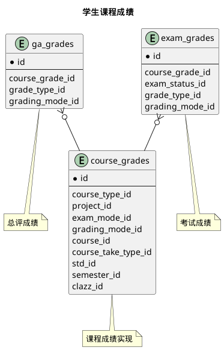



#### 目 录

##### 1. 数据库对象列表
  * [1.1 表格一览](index.html#表格一览)
  * [1.2 模块关系图](index.html#模块关系图)

##### 2. 具体模块明细
* [2.1 学生成绩](course.html)
* [2.2 计划完成](plan.html)
* [2.3 过程性成绩](process.html)
* [2.4 德育成绩](moral.html)
* [2.5 其他](misc.html)

### 表格一览
数据库共计104个表，分别如下:

<table class="table table-bordered table-striped table-condensed">
  <tr>
    <th style="background-color:#D0D3FF">序号</th>
    <th style="background-color:#D0D3FF">表名/描述</th>
    <th style="background-color:#D0D3FF">序号</th>
    <th style="background-color:#D0D3FF">表名/描述</th>
  </tr>
  <tr>
    <td>1</td>
    <td><a href="misc.html#表格-certificate_categories-校外考试种类">certificate_categories</a> 校外考试种类</td>
    <td>53</td>
    <td><a href="misc.html#表格-major_alt_courses_news-新课程">major_alt_courses_news</a> 新课程</td>
  </tr>
  <tr>
    <td>2</td>
    <td><a href="misc.html#表格-certificate_grades-考试成绩">certificate_grades</a> 考试成绩</td>
    <td>54</td>
    <td><a href="misc.html#表格-major_alt_courses_olds-原课程">major_alt_courses_olds</a> 原课程</td>
  </tr>
  <tr>
    <td>3</td>
    <td><a href="misc.html#表格-certificate_grades_courses-证书成绩认定结果">certificate_grades_courses</a> 证书成绩认定结果</td>
    <td>55</td>
    <td><a href="misc.html#表格-major_course_groups-专业计划课程组">major_course_groups</a> 专业计划课程组</td>
  </tr>
  <tr>
    <td>4</td>
    <td><a href="misc.html#表格-certificate_subjects-校外考试科目">certificate_subjects</a> 校外考试科目</td>
    <td>56</td>
    <td><a href="misc.html#表格-major_plan_courses-专业计划课程">major_plan_courses</a> 专业计划课程</td>
  </tr>
  <tr>
    <td>5</td>
    <td><a href="misc.html#表格-clazz_book_stats-课程教材订购汇总">clazz_book_stats</a> 课程教材订购汇总</td>
    <td>57</td>
    <td><a href="misc.html#表格-major_plans-专业培养计划">major_plans</a> 专业培养计划</td>
  </tr>
  <tr>
    <td>6</td>
    <td><a href="misc.html#表格-clazz_groups-教学任务组">clazz_groups</a> 教学任务组</td>
    <td>58</td>
    <td><a href="misc.html#表格-materials-教材选用">materials</a> 教材选用</td>
  </tr>
  <tr>
    <td>7</td>
    <td><a href="misc.html#表格-clazz_tags-任务标签">clazz_tags</a> 任务标签</td>
    <td>59</td>
    <td><a href="misc.html#表格-materials_books-教材">materials_books</a> 教材</td>
  </tr>
  <tr>
    <td>8</td>
    <td><a href="misc.html#表格-clazzes-教学任务">clazzes</a> 教学任务</td>
    <td>60</td>
    <td><a href="moral.html#表格-moral_grades-德育成绩">moral_grades</a> 德育成绩</td>
  </tr>
  <tr>
    <td>9</td>
    <td><a href="misc.html#表格-clazzes_ability_rates-要求课程能力等级">clazzes_ability_rates</a> 要求课程能力等级</td>
    <td>61</td>
    <td><a href="misc.html#表格-occupancies-房间占用情况">occupancies</a> 房间占用情况</td>
  </tr>
  <tr>
    <td>10</td>
    <td><a href="misc.html#表格-clazzes_tags-教学任务标签">clazzes_tags</a> 教学任务标签</td>
    <td>62</td>
    <td><a href="plan.html#表格-plan_audit_results-计划审核结果">plan_audit_results</a> 计划审核结果</td>
  </tr>
  <tr>
    <td>11</td>
    <td><a href="misc.html#表格-clazzes_teachers-授课教师">clazzes_teachers</a> 授课教师</td>
    <td>63</td>
    <td><a href="process.html#表格-process_grade_states-平时总评成绩状态">process_grade_states</a> 平时总评成绩状态</td>
  </tr>
  <tr>
    <td>12</td>
    <td><a href="plan.html#表格-course_audit_results-课程审核结果">course_audit_results</a> 课程审核结果</td>
    <td>64</td>
    <td><a href="process.html#表格-process_grade_states_percents-各类测试百分比">process_grade_states_percents</a> 各类测试百分比</td>
  </tr>
  <tr>
    <td>13</td>
    <td><a href="course.html#表格-course_grade_states-成绩状态">course_grade_states</a> 成绩状态</td>
    <td>65</td>
    <td><a href="process.html#表格-process_grades-平时过程总评成绩">process_grades</a> 平时过程总评成绩</td>
  </tr>
  <tr>
    <td>14</td>
    <td><a href="course.html#表格-course_grades-课程成绩实现">course_grades</a> 课程成绩实现</td>
    <td>66</td>
    <td><a href="process.html#表格-process_test_grades-平时测试成绩">process_test_grades</a> 平时测试成绩</td>
  </tr>
  <tr>
    <td>15</td>
    <td><a href="misc.html#表格-course_profiles-课程简介">course_profiles</a> 课程简介</td>
    <td>67</td>
    <td><a href="process.html#表格-process_test_types-平时测试类型">process_test_types</a> 平时测试类型</td>
  </tr>
  <tr>
    <td>16</td>
    <td><a href="misc.html#表格-course_takers-学生修读课程信息">course_takers</a> 学生修读课程信息</td>
    <td>68</td>
    <td><a href="misc.html#表格-program_doc_metas-培养方案章节定义">program_doc_metas</a> 培养方案章节定义</td>
  </tr>
  <tr>
    <td>17</td>
    <td><a href="misc.html#表格-exam_activities-排考活动">exam_activities</a> 排考活动</td>
    <td>69</td>
    <td><a href="misc.html#表格-program_doc_sections-培养方案文档章节">program_doc_sections</a> 培养方案文档章节</td>
  </tr>
  <tr>
    <td>18</td>
    <td><a href="misc.html#表格-exam_activities_rooms-对应考场">exam_activities_rooms</a> 对应考场</td>
    <td>70</td>
    <td><a href="misc.html#表格-program_doc_templates-培养方案文档模板">program_doc_templates</a> 培养方案文档模板</td>
  </tr>
  <tr>
    <td>19</td>
    <td><a href="misc.html#表格-exam_alloc_settings-教室分配设置">exam_alloc_settings</a> 教室分配设置</td>
    <td>71</td>
    <td><a href="misc.html#表格-program_doc_templates_types-文档对应学生类别">program_doc_templates_types</a> 文档对应学生类别</td>
  </tr>
  <tr>
    <td>20</td>
    <td><a href="course.html#表格-exam_grade_states-考试成绩状态">exam_grade_states</a> 考试成绩状态</td>
    <td>72</td>
    <td><a href="misc.html#表格-program_docs-培养方案文档">program_docs</a> 培养方案文档</td>
  </tr>
  <tr>
    <td>21</td>
    <td><a href="course.html#表格-exam_grades-考试成绩">exam_grades</a> 考试成绩</td>
    <td>73</td>
    <td><a href="misc.html#表格-programs-专业培养方案">programs</a> 专业培养方案</td>
  </tr>
  <tr>
    <td>22</td>
    <td><a href="misc.html#表格-exam_groups-考试组">exam_groups</a> 考试组</td>
    <td>74</td>
    <td><a href="misc.html#表格-restriction_items-课程限制项">restriction_items</a> 课程限制项</td>
  </tr>
  <tr>
    <td>23</td>
    <td><a href="misc.html#表格-exam_groups_rooms-考试组对应教室">exam_groups_rooms</a> 考试组对应教室</td>
    <td>75</td>
    <td><a href="misc.html#表格-restrictions-课程限制条件组">restrictions</a> 课程限制条件组</td>
  </tr>
  <tr>
    <td>24</td>
    <td><a href="misc.html#表格-exam_room_groups-教室组">exam_room_groups</a> 教室组</td>
    <td>76</td>
    <td><a href="misc.html#表格-room_applies-教室借用">room_applies</a> 教室借用</td>
  </tr>
  <tr>
    <td>25</td>
    <td><a href="misc.html#表格-exam_room_groups_rooms-教室组内教室">exam_room_groups_rooms</a> 教室组内教室</td>
    <td>77</td>
    <td><a href="misc.html#表格-room_applies_rooms-已分配教室">room_applies_rooms</a> 已分配教室</td>
  </tr>
  <tr>
    <td>26</td>
    <td><a href="misc.html#表格-exam_rooms-考场">exam_rooms</a> 考场</td>
    <td>78</td>
    <td><a href="misc.html#表格-room_applies_times-申请借用时间">room_applies_times</a> 申请借用时间</td>
  </tr>
  <tr>
    <td>27</td>
    <td><a href="misc.html#表格-exam_takers-应考学生">exam_takers</a> 应考学生</td>
    <td>79</td>
    <td><a href="misc.html#表格-room_apply_depart_checks-归口审核">room_apply_depart_checks</a> 归口审核</td>
  </tr>
  <tr>
    <td>28</td>
    <td><a href="misc.html#表格-exam_tasks-排考任务">exam_tasks</a> 排考任务</td>
    <td>80</td>
    <td><a href="misc.html#表格-room_apply_final_checks-最终审核">room_apply_final_checks</a> 最终审核</td>
  </tr>
  <tr>
    <td>29</td>
    <td><a href="misc.html#表格-exam_tasks_rooms-排考任务对应教室">exam_tasks_rooms</a> 排考任务对应教室</td>
    <td>81</td>
    <td><a href="misc.html#表格-room_available_times-教室可用时间">room_available_times</a> 教室可用时间</td>
  </tr>
  <tr>
    <td>30</td>
    <td><a href="misc.html#表格-exam_turns-考场场次">exam_turns</a> 考场场次</td>
    <td>82</td>
    <td><a href="misc.html#表格-room_occupy_apps-房间占用用户系统">room_occupy_apps</a> 房间占用用户系统</td>
  </tr>
  <tr>
    <td>31</td>
    <td><a href="misc.html#表格-execution_course_groups-执行计划课程组">execution_course_groups</a> 执行计划课程组</td>
    <td>83</td>
    <td><a href="misc.html#表格-sessions-教学活动">sessions</a> 教学活动</td>
  </tr>
  <tr>
    <td>32</td>
    <td><a href="misc.html#表格-execution_plan_courses-执行计划课程">execution_plan_courses</a> 执行计划课程</td>
    <td>84</td>
    <td><a href="misc.html#表格-sessions_rooms-教室列表">sessions_rooms</a> 教室列表</td>
  </tr>
  <tr>
    <td>33</td>
    <td><a href="misc.html#表格-execution_plans-执行培养计划">execution_plans</a> 执行培养计划</td>
    <td>85</td>
    <td><a href="misc.html#表格-sessions_teachers-授课教师列表">sessions_teachers</a> 授课教师列表</td>
  </tr>
  <tr>
    <td>34</td>
    <td><a href="misc.html#表格-extern_grades-校外成绩">extern_grades</a> 校外成绩</td>
    <td>86</td>
    <td><a href="misc.html#表格-share_course_groups-公共共享课程组">share_course_groups</a> 公共共享课程组</td>
  </tr>
  <tr>
    <td>35</td>
    <td><a href="misc.html#表格-extern_grades_courses-冲抵课程">extern_grades_courses</a> 冲抵课程</td>
    <td>87</td>
    <td><a href="misc.html#表格-share_plan_courses-公共共享课程组课程">share_plan_courses</a> 公共共享课程组课程</td>
  </tr>
  <tr>
    <td>36</td>
    <td><a href="misc.html#表格-final_makeup_courses-毕业补考任务">final_makeup_courses</a> 毕业补考任务</td>
    <td>88</td>
    <td><a href="misc.html#表格-share_plans-公共共享计划">share_plans</a> 公共共享计划</td>
  </tr>
  <tr>
    <td>37</td>
    <td><a href="misc.html#表格-final_makeup_courses_squads-行政班列表">final_makeup_courses_squads</a> 行政班列表</td>
    <td>89</td>
    <td><a href="misc.html#表格-std_alt_courses-学生替代课程">std_alt_courses</a> 学生替代课程</td>
  </tr>
  <tr>
    <td>38</td>
    <td><a href="misc.html#表格-final_makeup_takers-清考名单">final_makeup_takers</a> 清考名单</td>
    <td>90</td>
    <td><a href="misc.html#表格-std_alt_courses_news-新课程">std_alt_courses_news</a> 新课程</td>
  </tr>
  <tr>
    <td>39</td>
    <td><a href="course.html#表格-ga_grade_states-总评成绩状态">ga_grade_states</a> 总评成绩状态</td>
    <td>91</td>
    <td><a href="misc.html#表格-std_alt_courses_olds-原课程">std_alt_courses_olds</a> 原课程</td>
  </tr>
  <tr>
    <td>40</td>
    <td><a href="course.html#表格-ga_grades-总评成绩">ga_grades</a> 总评成绩</td>
    <td>92</td>
    <td><a href="misc.html#表格-std_book_orders-教材征订单">std_book_orders</a> 教材征订单</td>
  </tr>
  <tr>
    <td>41</td>
    <td><a href="misc.html#表格-grade_rate_configs-成绩分级配置">grade_rate_configs</a> 成绩分级配置</td>
    <td>93</td>
    <td><a href="misc.html#表格-std_course_abilities-学生课程能力">std_course_abilities</a> 学生课程能力</td>
  </tr>
  <tr>
    <td>42</td>
    <td><a href="misc.html#表格-grade_rate_items-成绩分级配置项">grade_rate_items</a> 成绩分级配置项</td>
    <td>94</td>
    <td><a href="misc.html#表格-std_course_groups-学生共享课程组">std_course_groups</a> 学生共享课程组</td>
  </tr>
  <tr>
    <td>43</td>
    <td><a href="plan.html#表格-group_audit_results-组审核结果">group_audit_results</a> 组审核结果</td>
    <td>95</td>
    <td><a href="course.html#表格-std_gpas-学生成绩绩点统计">std_gpas</a> 学生成绩绩点统计</td>
  </tr>
  <tr>
    <td>44</td>
    <td><a href="misc.html#表格-invigilation_clazz_quotas-教学任务监考配额统计">invigilation_clazz_quotas</a> 教学任务监考配额统计</td>
    <td>96</td>
    <td><a href="misc.html#表格-std_plan_courses-学生共享课程组课程">std_plan_courses</a> 学生共享课程组课程</td>
  </tr>
  <tr>
    <td>45</td>
    <td><a href="misc.html#表格-invigilation_quota_details-监考统计明细">invigilation_quota_details</a> 监考统计明细</td>
    <td>97</td>
    <td><a href="misc.html#表格-std_plans-个人计划">std_plans</a> 个人计划</td>
  </tr>
  <tr>
    <td>46</td>
    <td><a href="misc.html#表格-invigilation_quotas-监考配额">invigilation_quotas</a> 监考配额</td>
    <td>98</td>
    <td><a href="course.html#表格-std_semester_gpas-学生成绩每学期统计">std_semester_gpas</a> 学生成绩每学期统计</td>
  </tr>
  <tr>
    <td>47</td>
    <td><a href="misc.html#表格-invigilation_quotas_excludes-排除日期">invigilation_quotas_excludes</a> 排除日期</td>
    <td>99</td>
    <td><a href="course.html#表格-std_year_gpas-学生成绩每学期统计">std_year_gpas</a> 学生成绩每学期统计</td>
  </tr>
  <tr>
    <td>48</td>
    <td><a href="misc.html#表格-invigilations-监考信息">invigilations</a> 监考信息</td>
    <td>100</td>
    <td><a href="misc.html#表格-subclazzes-教学任务小班">subclazzes</a> 教学任务小班</td>
  </tr>
  <tr>
    <td>49</td>
    <td><a href="misc.html#表格-lessons-授课内容">lessons</a> 授课内容</td>
    <td>101</td>
    <td><a href="misc.html#表格-syllabus_files-教学大纲附件">syllabus_files</a> 教学大纲附件</td>
  </tr>
  <tr>
    <td>50</td>
    <td><a href="misc.html#表格-lessons_rooms-教室列表">lessons_rooms</a> 教室列表</td>
    <td>102</td>
    <td><a href="misc.html#表格-syllabuses-课程教学大纲">syllabuses</a> 课程教学大纲</td>
  </tr>
  <tr>
    <td>51</td>
    <td><a href="misc.html#表格-lessons_teachers-授课教师列表">lessons_teachers</a> 授课教师列表</td>
    <td>103</td>
    <td><a href="misc.html#表格-teaching_plans-授课计划">teaching_plans</a> 授课计划</td>
  </tr>
  <tr>
    <td>52</td>
    <td><a href="misc.html#表格-major_alt_courses-专业替代课程">major_alt_courses</a> 专业替代课程</td>
    <td>104</td>
    <td><a href="misc.html#表格-term_campuses-专业所在校区">term_campuses</a> 专业所在校区</td>
  </tr>
</table>

### 模块关系图

#### 1. 学生成绩
  * 关系图

