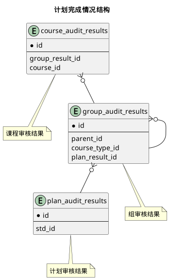



#### 目 录

##### 1. 数据库对象列表
  * [1.1 表格一览](index.html#表格一览)
  * [1.2 模块关系图](index.html#模块关系图)

##### 2. 具体模块明细
* [2.1 学生成绩](/model/edu/grade/course.html)
* [2.2 计划完成](/model/edu/grade/plan.html)
* [2.3 过程性成绩](/model/edu/grade/regular.html)
* [2.4 德育成绩](/model/edu/grade/moral.html)

### 表格一览
Schema edu.grade下共计18个表，分别如下:

<table class="table table-bordered table-striped table-condensed">
  <tr>
    <th class="info_header text-center">序号</th>
    <th class="info_header">表名/描述</th>
    <th class="info_header text-center">序号</th>
    <th class="info_header">表名/描述</th>
  </tr>
  <tr>
    <td>1</td>
    <td><a href="/model/edu/grade/plan.html#表格-course_audit_results-课程审核结果">course_audit_results</a> 课程审核结果</td>
    <td>10</td>
    <td><a href="/model/edu/grade/plan.html#表格-plan_audit_results-计划审核结果">plan_audit_results</a> 计划审核结果</td>
  </tr>
  <tr>
    <td>2</td>
    <td><a href="/model/edu/grade/course.html#表格-course_grade_states-成绩状态">course_grade_states</a> 成绩状态</td>
    <td>11</td>
    <td><a href="/model/edu/grade/regular.html#表格-regular_grade_states-平时总评成绩状态">regular_grade_states</a> 平时总评成绩状态</td>
  </tr>
  <tr>
    <td>3</td>
    <td><a href="/model/edu/grade/course.html#表格-course_grades-课程成绩实现">course_grades</a> 课程成绩实现</td>
    <td>12</td>
    <td><a href="/model/edu/grade/regular.html#表格-regular_grade_states_percents-各类测试百分比">regular_grade_states_percents</a> 各类测试百分比</td>
  </tr>
  <tr>
    <td>4</td>
    <td><a href="/model/edu/grade/course.html#表格-exam_grade_states-考试成绩状态">exam_grade_states</a> 考试成绩状态</td>
    <td>13</td>
    <td><a href="/model/edu/grade/regular.html#表格-regular_grades-平时过程总评成绩">regular_grades</a> 平时过程总评成绩</td>
  </tr>
  <tr>
    <td>5</td>
    <td><a href="/model/edu/grade/course.html#表格-exam_grades-考试成绩">exam_grades</a> 考试成绩</td>
    <td>14</td>
    <td><a href="/model/edu/grade/regular.html#表格-regular_test_grades-平时测试成绩">regular_test_grades</a> 平时测试成绩</td>
  </tr>
  <tr>
    <td>6</td>
    <td><a href="/model/edu/grade/course.html#表格-ga_grade_states-总评成绩状态">ga_grade_states</a> 总评成绩状态</td>
    <td>15</td>
    <td><a href="/model/edu/grade/regular.html#表格-regular_test_types-平时测试类型">regular_test_types</a> 平时测试类型</td>
  </tr>
  <tr>
    <td>7</td>
    <td><a href="/model/edu/grade/course.html#表格-ga_grades-总评成绩">ga_grades</a> 总评成绩</td>
    <td>16</td>
    <td><a href="/model/edu/grade/course.html#表格-std_gpas-学生成绩绩点统计">std_gpas</a> 学生成绩绩点统计</td>
  </tr>
  <tr>
    <td>8</td>
    <td><a href="/model/edu/grade/plan.html#表格-group_audit_results-组审核结果">group_audit_results</a> 组审核结果</td>
    <td>17</td>
    <td><a href="/model/edu/grade/course.html#表格-std_semester_gpas-学生成绩每学期统计">std_semester_gpas</a> 学生成绩每学期统计</td>
  </tr>
  <tr>
    <td>9</td>
    <td><a href="/model/edu/grade/moral.html#表格-moral_grades-德育成绩">moral_grades</a> 德育成绩</td>
    <td>18</td>
    <td><a href="/model/edu/grade/course.html#表格-std_year_gpas-学生成绩每学期统计">std_year_gpas</a> 学生成绩每学期统计</td>
  </tr>
</table>

### 模块关系图

#### 1. 学生课程成绩
  * 关系图

#### 2. 学生绩点统计
  * 关系图

#### 3. 计划完成情况结构
  * 关系图

#### 4. 过程性成绩结构
  * 关系图

