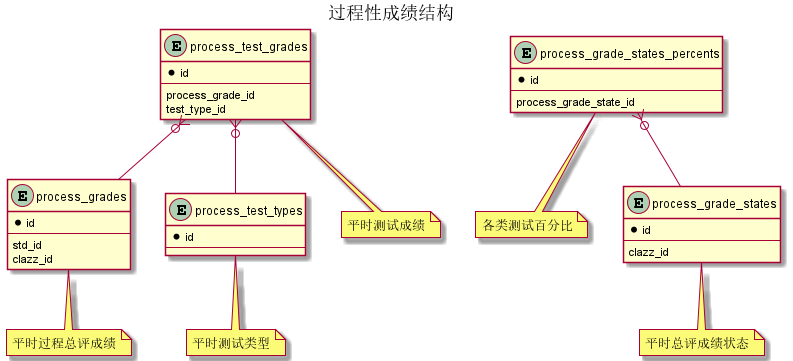

 
### 关系图 1. 过程性成绩结构
  * 关系图

### 表格 process_grade_states 平时总评成绩状态

  * 表格说明

<table class="table table-mini">
<tr><th style="background-color:#D0D3FF">表名</th><th style="background-color:#D0D3FF">主键</th><th style="background-color:#D0D3FF">注释</th>  </tr>
<tr><td>process_grade_states</td><td>id</td><td>平时总评成绩状态</td>  </tr>
</table>

  * 表格中的列

<table class="table table-mini">
<tr><th style="background-color:#D0D3FF" class="text-center">序号</th><th style="background-color:#D0D3FF">字段名</th><th style="background-color:#D0D3FF">字段类型</th><th style="background-color:#D0D3FF" class="text-center">是否可空</th><th style="background-color:#D0D3FF">描述</th><th style="background-color:#D0D3FF">引用表</th>  </tr>
<tr><td class="text-center">1</td><td>id</td><td>bigint</td><td class="text-center">否</td><td>非业务主键:datetime</td><td></td>  </tr>
<tr><td class="text-center">2</td><td>clazz_id</td><td>bigint</td><td class="text-center">否</td><td>教学任务ID</td><td>           <a href="/model/edu/clazz/clazz.html#表格-clazzes-教学任务">edu.clazzes</a>
</td>  </tr>
<tr><td class="text-center">3</td><td>excellent_rate</td><td>float4</td><td class="text-center">否</td><td>优秀率</td><td></td>  </tr>
<tr><td class="text-center">4</td><td>excellent_rate_limit</td><td>float4</td><td class="text-center">否</td><td>优秀率上限</td><td></td>  </tr>
<tr><td class="text-center">5</td><td>status</td><td>integer</td><td class="text-center">否</td><td>状态</td><td></td>  </tr>
<tr><td class="text-center">6</td><td>updated_at</td><td>timestamp</td><td class="text-center">否</td><td>更新时间</td><td></td>  </tr>
</table>

  * 表格中唯一约束

<table class="table table-mini">
  <tr>
<th style="background-color:#D0D3FF">序号</th><th style="background-color:#D0D3FF">约束名</th><th style="background-color:#D0D3FF">约束字段</th>  </tr>
<tr><td>1</td><td>uk_efki1v9qto7s90pa2081ajov</td><td>clazz_id</td>  </tr>
</table>
### 表格 process_grade_states_percents 各类测试百分比

  * 表格说明

<table class="table table-mini">
<tr><th style="background-color:#D0D3FF">表名</th><th style="background-color:#D0D3FF">主键</th><th style="background-color:#D0D3FF">注释</th>  </tr>
<tr><td>process_grade_states_percents</td><td>process_grade_state_id,value_,process_test_type_id</td><td>各类测试百分比</td>  </tr>
</table>

  * 表格中的列

<table class="table table-mini">
<tr><th style="background-color:#D0D3FF" class="text-center">序号</th><th style="background-color:#D0D3FF">字段名</th><th style="background-color:#D0D3FF">字段类型</th><th style="background-color:#D0D3FF" class="text-center">是否可空</th><th style="background-color:#D0D3FF">描述</th><th style="background-color:#D0D3FF">引用表</th>  </tr>
<tr><td class="text-center">1</td><td>process_grade_state_id</td><td>bigint</td><td class="text-center">否</td><td>平时总评成绩状态ID</td><td>           <a href="/model/edu/grade/process.html#表格-process_grade_states-平时总评成绩状态">edu.process_grade_states</a>
</td>  </tr>
<tr><td class="text-center">2</td><td>process_test_type_id</td><td>integer</td><td class="text-center">否</td><td>平时测试类型ID</td><td></td>  </tr>
<tr><td class="text-center">3</td><td>value_</td><td>integer</td><td class="text-center">否</td><td>各类测试百分比</td><td></td>  </tr>
</table>
  * 表格的索引

<table class="table table-mini">
  <tr>
<th style="background-color:#D0D3FF">索引名</th><th style="background-color:#D0D3FF">索引字段</th><th style="background-color:#D0D3FF">是否唯一</th>  </tr>
<tr><td>idx_pqls9iau3y0aiari9j1i8pjbh</td><td>process_grade_state_id</td><td>否</td>  </tr>
</table>

### 表格 process_grades 平时过程总评成绩

  * 表格说明

<table class="table table-mini">
<tr><th style="background-color:#D0D3FF">表名</th><th style="background-color:#D0D3FF">主键</th><th style="background-color:#D0D3FF">注释</th>  </tr>
<tr><td>process_grades</td><td>id</td><td>平时过程总评成绩</td>  </tr>
</table>

  * 表格中的列

<table class="table table-mini">
<tr><th style="background-color:#D0D3FF" class="text-center">序号</th><th style="background-color:#D0D3FF">字段名</th><th style="background-color:#D0D3FF">字段类型</th><th style="background-color:#D0D3FF" class="text-center">是否可空</th><th style="background-color:#D0D3FF">描述</th><th style="background-color:#D0D3FF">引用表</th>  </tr>
<tr><td class="text-center">1</td><td>id</td><td>bigint</td><td class="text-center">否</td><td>非业务主键:datetime</td><td></td>  </tr>
<tr><td class="text-center">2</td><td>clazz_id</td><td>bigint</td><td class="text-center">否</td><td>教学任务ID</td><td>           <a href="/model/edu/clazz/clazz.html#表格-clazzes-教学任务">edu.clazzes</a>
</td>  </tr>
<tr><td class="text-center">3</td><td>score</td><td>float4</td><td class="text-center">否</td><td>分数</td><td></td>  </tr>
<tr><td class="text-center">4</td><td>status</td><td>integer</td><td class="text-center">否</td><td>状态</td><td></td>  </tr>
<tr><td class="text-center">5</td><td>std_id</td><td>bigint</td><td class="text-center">否</td><td>学籍信息实现ID</td><td>           <a href="/model/base/edu/core.html#表格-students-学籍信息实现">base.students</a>
</td>  </tr>
<tr><td class="text-center">6</td><td>updated_at</td><td>timestamp</td><td class="text-center">否</td><td>更新时间</td><td></td>  </tr>
</table>

  * 表格中唯一约束

<table class="table table-mini">
  <tr>
<th style="background-color:#D0D3FF">序号</th><th style="background-color:#D0D3FF">约束名</th><th style="background-color:#D0D3FF">约束字段</th>  </tr>
<tr><td>1</td><td>uk_tpg5ssh3c0nc4bgte7770lsop</td><td>std_id,clazz_id</td>  </tr>
</table>

  * 表格的索引

<table class="table table-mini">
  <tr>
<th style="background-color:#D0D3FF">索引名</th><th style="background-color:#D0D3FF">索引字段</th><th style="background-color:#D0D3FF">是否唯一</th>  </tr>
<tr><td>idx_1oeikyxe9m04d1os8e6soi5go</td><td>std_id</td><td>否</td>  </tr>
<tr><td>idx_py3s5ykk1fw0gk21lxl5ctl7v</td><td>clazz_id</td><td>否</td>  </tr>
</table>

### 表格 process_test_grades 平时测试成绩

  * 表格说明

<table class="table table-mini">
<tr><th style="background-color:#D0D3FF">表名</th><th style="background-color:#D0D3FF">主键</th><th style="background-color:#D0D3FF">注释</th>  </tr>
<tr><td>process_test_grades</td><td>id</td><td>平时测试成绩</td>  </tr>
</table>

  * 表格中的列

<table class="table table-mini">
<tr><th style="background-color:#D0D3FF" class="text-center">序号</th><th style="background-color:#D0D3FF">字段名</th><th style="background-color:#D0D3FF">字段类型</th><th style="background-color:#D0D3FF" class="text-center">是否可空</th><th style="background-color:#D0D3FF">描述</th><th style="background-color:#D0D3FF">引用表</th>  </tr>
<tr><td class="text-center">1</td><td>id</td><td>bigint</td><td class="text-center">否</td><td>非业务主键:datetime</td><td></td>  </tr>
<tr><td class="text-center">2</td><td>process_grade_id</td><td>bigint</td><td class="text-center">否</td><td>平时过程总评成绩ID</td><td>           <a href="/model/edu/grade/process.html#表格-process_grades-平时过程总评成绩">edu.process_grades</a>
</td>  </tr>
<tr><td class="text-center">3</td><td>score</td><td>integer</td><td class="text-center">否</td><td>分数</td><td></td>  </tr>
<tr><td class="text-center">4</td><td>score_percent</td><td>integer</td><td class="text-center">否</td><td>百分比</td><td></td>  </tr>
<tr><td class="text-center">5</td><td>test_type_id</td><td>integer</td><td class="text-center">否</td><td>平时测试类型ID</td><td>           <a href="/model/edu/grade/process.html#表格-process_test_types-平时测试类型">edu.process_test_types</a>
</td>  </tr>
</table>

  * 表格中唯一约束

<table class="table table-mini">
  <tr>
<th style="background-color:#D0D3FF">序号</th><th style="background-color:#D0D3FF">约束名</th><th style="background-color:#D0D3FF">约束字段</th>  </tr>
<tr><td>1</td><td>uk_23w8j9ifx282bxgi9f12gjwh3</td><td>process_grade_id,test_type_id</td>  </tr>
</table>

  * 表格的索引

<table class="table table-mini">
  <tr>
<th style="background-color:#D0D3FF">索引名</th><th style="background-color:#D0D3FF">索引字段</th><th style="background-color:#D0D3FF">是否唯一</th>  </tr>
<tr><td>idx_qoyl32k2m10m7r8g1if8fwdg5</td><td>process_grade_id</td><td>否</td>  </tr>
</table>

### 表格 process_test_types 平时测试类型

  * 表格说明

<table class="table table-mini">
<tr><th style="background-color:#D0D3FF">表名</th><th style="background-color:#D0D3FF">主键</th><th style="background-color:#D0D3FF">注释</th>  </tr>
<tr><td>process_test_types</td><td>id</td><td>平时测试类型</td>  </tr>
</table>

  * 表格中的列

<table class="table table-mini">
<tr><th style="background-color:#D0D3FF" class="text-center">序号</th><th style="background-color:#D0D3FF">字段名</th><th style="background-color:#D0D3FF">字段类型</th><th style="background-color:#D0D3FF" class="text-center">是否可空</th><th style="background-color:#D0D3FF">描述</th><th style="background-color:#D0D3FF">引用表</th>  </tr>
<tr><td class="text-center">1</td><td>id</td><td>integer</td><td class="text-center">否</td><td>非业务主键:auto_increment</td><td></td>  </tr>
<tr><td class="text-center">2</td><td>name</td><td>varchar(255)</td><td class="text-center">否</td><td>名称</td><td></td>  </tr>
</table>

  * 表格中唯一约束

<table class="table table-mini">
  <tr>
<th style="background-color:#D0D3FF">序号</th><th style="background-color:#D0D3FF">约束名</th><th style="background-color:#D0D3FF">约束字段</th>  </tr>
<tr><td>1</td><td>uk_oxllj3oaiitkn2np5b1bviv3h</td><td>name</td>  </tr>
</table>

