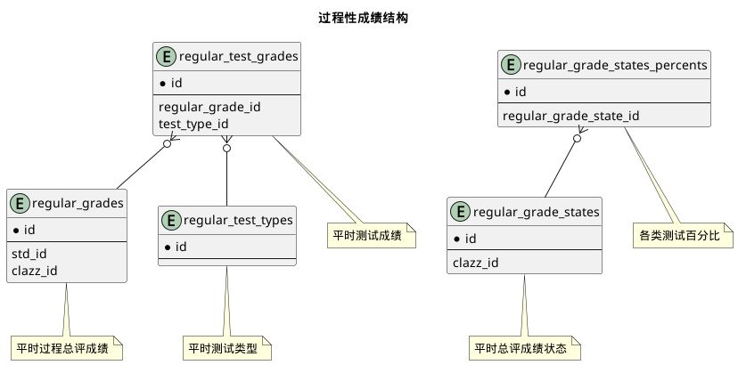


 目  录

* toc
{:toc}

### 关系图 1. 过程性成绩结构
  * 关系图

### 表格 regular_grade_states 平时总评成绩状态

  
<h5 id="table_edu.regular_grade_states">表格edu.regular_grade_states</h5>

  

<ul>
  <li>表格说明</li>
</ul>

<table class="table table-bordered table-striped table-condensed ">
<tr><th class="info_header">表名</th><th class="info_header">主键</th><th class="info_header" style="width:40%">注释</th>  </tr>
<tr><td>edu.regular_grade_states</td><td>id</td><td>平时总评成绩状态</td>  </tr>
</table>
<ul>
  <li>表格中的列</li>
</ul>
<table class="table table-bordered table-striped table-condensed">
<tr><th class="info_header text-center">序号</th><th class="info_header">字段名</th><th class="info_header">字段类型</th><th class="info_header text-center">是否可空</th><th class="info_header">描述</th><th class="info_header">引用表</th>  </tr>
<tr><td class="text-center">1</td><td>id</td><td>bigint</td><td class="text-center">否</td><td>非业务主键:datetime</td><td></td>  </tr>
<tr><td class="text-center">2</td><td>clazz_id</td><td>bigint</td><td class="text-center">否</td><td>教学任务ID</td><td>            <a href="/model/edu/clazz/clazz.html#表格-clazzes-教学任务">edu.clazzes</a>
</td>  </tr>
<tr><td class="text-center">3</td><td>excellent_rate</td><td>float4</td><td class="text-center">否</td><td>优秀率</td><td></td>  </tr>
<tr><td class="text-center">4</td><td>excellent_rate_limit</td><td>float4</td><td class="text-center">否</td><td>优秀率上限</td><td></td>  </tr>
<tr><td class="text-center">5</td><td>status</td><td>integer</td><td class="text-center">否</td><td>状态</td><td></td>  </tr>
<tr><td class="text-center">6</td><td>updated_at</td><td>timestamptz</td><td class="text-center">否</td><td>更新时间</td><td></td>  </tr>
</table>

<ul>
  <li>表格中唯一约束</li>
</ul>
<table class="table table-bordered table-striped table-condensed">
  <tr>
<th class="info_header">序号</th><th class="info_header">约束名</th><th class="info_header">约束字段</th>  </tr>
<tr><td>1</td><td>uk_nv0dulh1dhs6ddpd0clg8tvac</td><td>clazz_id</td>  </tr>
</table>

  

### 表格 regular_grade_states_percents 各类测试百分比

  
<h5 id="table_edu.regular_grade_states_percents">表格edu.regular_grade_states_percents</h5>

  

<ul>
  <li>表格说明</li>
</ul>

<table class="table table-bordered table-striped table-condensed ">
<tr><th class="info_header">表名</th><th class="info_header">主键</th><th class="info_header" style="width:40%">注释</th>  </tr>
<tr><td>edu.regular_grade_states_percents</td><td>regular_grade_state_id,value_,regular_test_type_id</td><td>各类测试百分比</td>  </tr>
</table>
<ul>
  <li>表格中的列</li>
</ul>
<table class="table table-bordered table-striped table-condensed">
<tr><th class="info_header text-center">序号</th><th class="info_header">字段名</th><th class="info_header">字段类型</th><th class="info_header text-center">是否可空</th><th class="info_header">描述</th><th class="info_header">引用表</th>  </tr>
<tr><td class="text-center">1</td><td>regular_grade_state_id</td><td>bigint</td><td class="text-center">否</td><td>平时总评成绩状态ID</td><td>            <a href="/model/edu/grade/regular.html#表格-regular_grade_states-平时总评成绩状态">edu.regular_grade_states</a>
</td>  </tr>
<tr><td class="text-center">2</td><td>regular_test_type_id</td><td>integer</td><td class="text-center">否</td><td>平时测试类型ID</td><td></td>  </tr>
<tr><td class="text-center">3</td><td>value_</td><td>integer</td><td class="text-center">否</td><td>各类测试百分比</td><td></td>  </tr>
</table>

<ul>
  <li>表格的索引</li>
</ul>
<table class="table table-bordered table-striped table-condensed">
  <tr>
<th class="info_header">索引名</th><th class="info_header">索引字段</th><th class="info_header">是否唯一</th>  </tr>
<tr><td>idx_qcchbnp54bci79i8mdudt2y63</td><td>regular_grade_state_id</td><td>否</td>  </tr>
</table>
  

### 表格 regular_grades 平时过程总评成绩

  
<h5 id="table_edu.regular_grades">表格edu.regular_grades</h5>

  

<ul>
  <li>表格说明</li>
</ul>

<table class="table table-bordered table-striped table-condensed ">
<tr><th class="info_header">表名</th><th class="info_header">主键</th><th class="info_header" style="width:40%">注释</th>  </tr>
<tr><td>edu.regular_grades</td><td>id</td><td>平时过程总评成绩</td>  </tr>
</table>
<ul>
  <li>表格中的列</li>
</ul>
<table class="table table-bordered table-striped table-condensed">
<tr><th class="info_header text-center">序号</th><th class="info_header">字段名</th><th class="info_header">字段类型</th><th class="info_header text-center">是否可空</th><th class="info_header">描述</th><th class="info_header">引用表</th>  </tr>
<tr><td class="text-center">1</td><td>id</td><td>bigint</td><td class="text-center">否</td><td>非业务主键:datetime</td><td></td>  </tr>
<tr><td class="text-center">2</td><td>clazz_id</td><td>bigint</td><td class="text-center">否</td><td>教学任务ID</td><td>            <a href="/model/edu/clazz/clazz.html#表格-clazzes-教学任务">edu.clazzes</a>
</td>  </tr>
<tr><td class="text-center">3</td><td>score</td><td>float4</td><td class="text-center">否</td><td>分数</td><td></td>  </tr>
<tr><td class="text-center">4</td><td>status</td><td>integer</td><td class="text-center">否</td><td>状态</td><td></td>  </tr>
<tr><td class="text-center">5</td><td>std_id</td><td>bigint</td><td class="text-center">否</td><td>学籍信息实现ID</td><td>            <a href="/model/base/std/core.html#表格-students-学籍信息实现">base.students</a>
</td>  </tr>
<tr><td class="text-center">6</td><td>updated_at</td><td>timestamptz</td><td class="text-center">否</td><td>更新时间</td><td></td>  </tr>
</table>

<ul>
  <li>表格中唯一约束</li>
</ul>
<table class="table table-bordered table-striped table-condensed">
  <tr>
<th class="info_header">序号</th><th class="info_header">约束名</th><th class="info_header">约束字段</th>  </tr>
<tr><td>1</td><td>uk_ek8kmmv077hq3rh4docowoqw7</td><td>std_id,clazz_id</td>  </tr>
</table>

<ul>
  <li>表格的索引</li>
</ul>
<table class="table table-bordered table-striped table-condensed">
  <tr>
<th class="info_header">索引名</th><th class="info_header">索引字段</th><th class="info_header">是否唯一</th>  </tr>
<tr><td>idx_fmwrwh59gqwgfcs1jevsbahxw</td><td>std_id</td><td>否</td>  </tr>
<tr><td>idx_79jpq20ahqs7fp9yhfb1k0eac</td><td>clazz_id</td><td>否</td>  </tr>
</table>
  

### 表格 regular_test_grades 平时测试成绩

  
<h5 id="table_edu.regular_test_grades">表格edu.regular_test_grades</h5>

  

<ul>
  <li>表格说明</li>
</ul>

<table class="table table-bordered table-striped table-condensed ">
<tr><th class="info_header">表名</th><th class="info_header">主键</th><th class="info_header" style="width:40%">注释</th>  </tr>
<tr><td>edu.regular_test_grades</td><td>id</td><td>平时测试成绩</td>  </tr>
</table>
<ul>
  <li>表格中的列</li>
</ul>
<table class="table table-bordered table-striped table-condensed">
<tr><th class="info_header text-center">序号</th><th class="info_header">字段名</th><th class="info_header">字段类型</th><th class="info_header text-center">是否可空</th><th class="info_header">描述</th><th class="info_header">引用表</th>  </tr>
<tr><td class="text-center">1</td><td>id</td><td>bigint</td><td class="text-center">否</td><td>非业务主键:datetime</td><td></td>  </tr>
<tr><td class="text-center">2</td><td>regular_grade_id</td><td>bigint</td><td class="text-center">否</td><td>平时过程总评成绩ID</td><td>            <a href="/model/edu/grade/regular.html#表格-regular_grades-平时过程总评成绩">edu.regular_grades</a>
</td>  </tr>
<tr><td class="text-center">3</td><td>score</td><td>integer</td><td class="text-center">否</td><td>分数</td><td></td>  </tr>
<tr><td class="text-center">4</td><td>score_percent</td><td>integer</td><td class="text-center">否</td><td>百分比</td><td></td>  </tr>
<tr><td class="text-center">5</td><td>test_type_id</td><td>integer</td><td class="text-center">否</td><td>平时测试类型ID</td><td>            <a href="/model/edu/grade/regular.html#表格-regular_test_types-平时测试类型">edu.regular_test_types</a>
</td>  </tr>
</table>

<ul>
  <li>表格中唯一约束</li>
</ul>
<table class="table table-bordered table-striped table-condensed">
  <tr>
<th class="info_header">序号</th><th class="info_header">约束名</th><th class="info_header">约束字段</th>  </tr>
<tr><td>1</td><td>uk_8n2yq76yji9pqu6q0ccfcymaw</td><td>regular_grade_id,test_type_id</td>  </tr>
</table>

<ul>
  <li>表格的索引</li>
</ul>
<table class="table table-bordered table-striped table-condensed">
  <tr>
<th class="info_header">索引名</th><th class="info_header">索引字段</th><th class="info_header">是否唯一</th>  </tr>
<tr><td>idx_4uha48ytsvm0oy0dn16v694u3</td><td>regular_grade_id</td><td>否</td>  </tr>
</table>
  

### 表格 regular_test_types 平时测试类型

  
<h5 id="table_edu.regular_test_types">表格edu.regular_test_types</h5>

  

<ul>
  <li>表格说明</li>
</ul>

<table class="table table-bordered table-striped table-condensed ">
<tr><th class="info_header">表名</th><th class="info_header">主键</th><th class="info_header" style="width:40%">注释</th>  </tr>
<tr><td>edu.regular_test_types</td><td>id</td><td>平时测试类型</td>  </tr>
</table>
<ul>
  <li>表格中的列</li>
</ul>
<table class="table table-bordered table-striped table-condensed">
<tr><th class="info_header text-center">序号</th><th class="info_header">字段名</th><th class="info_header">字段类型</th><th class="info_header text-center">是否可空</th><th class="info_header">描述</th><th class="info_header">引用表</th>  </tr>
<tr><td class="text-center">1</td><td>id</td><td>integer</td><td class="text-center">否</td><td>非业务主键:auto_increment</td><td></td>  </tr>
<tr><td class="text-center">2</td><td>name</td><td>varchar(255)</td><td class="text-center">否</td><td>名称</td><td></td>  </tr>
</table>

<ul>
  <li>表格中唯一约束</li>
</ul>
<table class="table table-bordered table-striped table-condensed">
  <tr>
<th class="info_header">序号</th><th class="info_header">约束名</th><th class="info_header">约束字段</th>  </tr>
<tr><td>1</td><td>uk_pjg3i553nwubmj92t250lraw9</td><td>name</td>  </tr>
</table>

  

