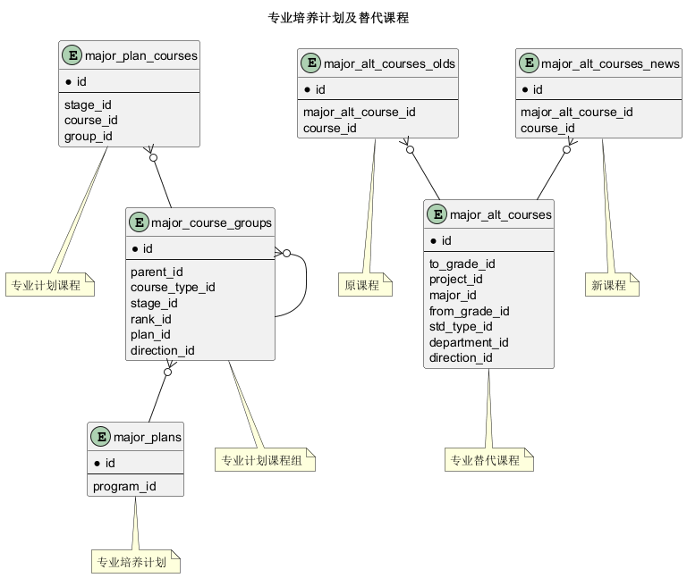
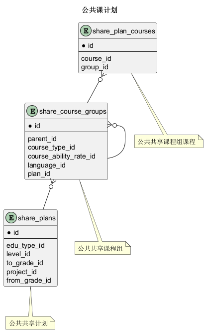
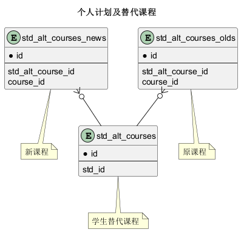

# 教务管理 培养方案 表结构

## 表格一览

<table class="table-mini">
  <thead>
    <tr>
      <th class="info_header text-center" width="7%">序号</th>
      <th class="info_header" width="43%">表名/描述</th>
      <th class="info_header text-center" width="7%">序号</th>
      <th class="info_header" width="43%">表名/描述</th>
    </tr>
  </thead>
  <tbody>
    <tr>
      <td class="text-center">1</td>
      <td><a href="/model/edu/program.html#executive-course-groups">executive_course_groups</a> 执行计划课程组</td>
      <td class="text-center">20</td>
      <td><a href="/model/edu/program.html#program-outcomes">program_outcomes</a> 培养方案-毕业要求</td>
    </tr>
    <tr>
      <td class="text-center">2</td>
      <td><a href="/model/edu/program.html#executive-plan-courses">executive_plan_courses</a> 执行计划课程</td>
      <td class="text-center">21</td>
      <td><a href="/model/edu/program.html#program-outlines">program_outlines</a> 培养方案大纲</td>
    </tr>
    <tr>
      <td class="text-center">3</td>
      <td><a href="/model/edu/program.html#executive-plans">executive_plans</a> 执行培养计划</td>
      <td class="text-center">22</td>
      <td><a href="/model/edu/program.html#program-prerequisites">program_prerequisites</a> 培养方案先修课程</td>
    </tr>
    <tr>
      <td class="text-center">4</td>
      <td><a href="/model/edu/program.html#exempt-courses">exempt_courses</a> 免修课程</td>
      <td class="text-center">23</td>
      <td><a href="/model/edu/program.html#program-tables">program_tables</a> 培养方案-表格</td>
    </tr>
    <tr>
      <td class="text-center">5</td>
      <td><a href="/model/edu/program.html#exempt-courses-std-types">exempt_courses_std_types</a> 免修课程-适用学生类别范围</td>
      <td class="text-center">24</td>
      <td><a href="/model/edu/program.html#program-texts">program_texts</a> 培养方案-文本</td>
    </tr>
    <tr>
      <td class="text-center">6</td>
      <td><a href="/model/edu/program.html#major-alt-courses">major_alt_courses</a> 专业替代课程</td>
      <td class="text-center">25</td>
      <td><a href="/model/edu/program.html#programs">programs</a> 专业培养方案</td>
    </tr>
    <tr>
      <td class="text-center">7</td>
      <td><a href="/model/edu/program.html#major-alt-courses-news">major_alt_courses_news</a> 新课程</td>
      <td class="text-center">26</td>
      <td><a href="/model/edu/program.html#programs-degree-certificates">programs_degree_certificates</a> 学位要求证书</td>
    </tr>
    <tr>
      <td class="text-center">8</td>
      <td><a href="/model/edu/program.html#major-alt-courses-olds">major_alt_courses_olds</a> 原课程</td>
      <td class="text-center">27</td>
      <td><a href="/model/edu/program.html#programs-degree-courses">programs_degree_courses</a> 学位课程</td>
    </tr>
    <tr>
      <td class="text-center">9</td>
      <td><a href="/model/edu/program.html#major-course-groups">major_course_groups</a> 专业计划课程组</td>
      <td class="text-center">28</td>
      <td><a href="/model/edu/program.html#programs-std-types">programs_std_types</a> 方案-学生类别</td>
    </tr>
    <tr>
      <td class="text-center">10</td>
      <td><a href="/model/edu/program.html#major-plan-courses">major_plan_courses</a> 专业计划课程</td>
      <td class="text-center">29</td>
      <td><a href="/model/edu/program.html#share-course-groups">share_course_groups</a> 公共共享课程组</td>
    </tr>
    <tr>
      <td class="text-center">11</td>
      <td><a href="/model/edu/program.html#major-plans">major_plans</a> 专业培养计划</td>
      <td class="text-center">30</td>
      <td><a href="/model/edu/program.html#share-plan-courses">share_plan_courses</a> 公共共享课程组课程</td>
    </tr>
    <tr>
      <td class="text-center">12</td>
      <td><a href="/model/edu/program.html#program-course-labels">program_course_labels</a> 培养方案方案课程标签</td>
      <td class="text-center">31</td>
      <td><a href="/model/edu/program.html#share-plans">share_plans</a> 公共共享计划</td>
    </tr>
    <tr>
      <td class="text-center">13</td>
      <td><a href="/model/edu/program.html#program-course-outcomes">program_course_outcomes</a> 课程对应课表目标</td>
      <td class="text-center">32</td>
      <td><a href="/model/edu/program.html#std-alt-courses">std_alt_courses</a> 学生替代课程</td>
    </tr>
    <tr>
      <td class="text-center">14</td>
      <td><a href="/model/edu/program.html#program-doc-metas">program_doc_metas</a> 培养方案章节定义</td>
      <td class="text-center">33</td>
      <td><a href="/model/edu/program.html#std-alt-courses-news">std_alt_courses_news</a> 新课程</td>
    </tr>
    <tr>
      <td class="text-center">15</td>
      <td><a href="/model/edu/program.html#program-doc-sections">program_doc_sections</a> 培养方案文档章节</td>
      <td class="text-center">34</td>
      <td><a href="/model/edu/program.html#std-alt-courses-olds">std_alt_courses_olds</a> 原课程</td>
    </tr>
    <tr>
      <td class="text-center">16</td>
      <td><a href="/model/edu/program.html#program-doc-templates">program_doc_templates</a> 培养方案文档模板</td>
      <td class="text-center">35</td>
      <td><a href="/model/edu/program.html#std-exempt-courses">std_exempt_courses</a> 学生个人免修课程</td>
    </tr>
    <tr>
      <td class="text-center">17</td>
      <td><a href="/model/edu/program.html#program-doc-templates-types">program_doc_templates_types</a> 文档对应学生类别</td>
      <td class="text-center">36</td>
      <td><a href="/model/edu/program.html#std-program-bindings">std_program_bindings</a> 特殊学生方案绑定</td>
    </tr>
    <tr>
      <td class="text-center">18</td>
      <td><a href="/model/edu/program.html#program-docs">program_docs</a> 培养方案文档</td>
      <td class="text-center">37</td>
      <td><a href="/model/edu/program.html#term-campuses">term_campuses</a> 专业所在校区</td>
    </tr>
    <tr>
      <td class="text-center">19</td>
      <td><a href="/model/edu/program.html#program-objectives">program_objectives</a> 培养方案-培养目标</td>
      <td></td>
      <td></td>
    </tr>
  </tbody>
</table>

## 关键关系图

### 关系图 1. 专业培养计划及替代课程
  * 关系图

### 关系图 2. 公共课计划
  * 关系图

### 关系图 3. 个人计划及替代课程
  * 关系图

## 表格明细

## executive_course_groups

<table class="table-entity">
  <tbody>
    <tr>
      <td class="table-entity-title" width="15%">表名:&nbsp;</td>
      <td>edu.executive_course_groups 执行计划课程组</td>
    </tr>
    <tr>
      <td class="table-entity-title">唯一约束:&nbsp;</td>
      <td>主键🔑(id) </td>
    </tr>
    <tr>
      <td class="table-entity-title">索引:&nbsp;</td>
      <td>idx_ktdcfjdpse8b04tpfwisrj4w6(plan_id) ,idx_ia1rnujj64tq7s6bw31qxvvbs(parent_id) </td>
    </tr>
  </tbody>
</table>

<table class="table-entity">
  <thead>
    <tr>
<th class="info_header text-center" width="7%">序号</th><th class="info_header" width="20%">字段名</th><th class="info_header" width="20%">字段类型</th><th class="info_header text-center" width="8%">是否可空</th><th class="info_header" width="25%">描述</th><th class="info_header" width="20%">引用表</th>    </tr>
  </thead>
  <tbody>
    <tr>
      <td class="text-center">1</td>
      <td>id</td>
      <td>bigint</td>
      <td class="text-center">否</td>
      <td>非业务主键:datetime</td>
      <td>      </td>
    </tr>
    <tr>
      <td class="text-center">2</td>
      <td>course_type_id</td>
      <td>integer</td>
      <td class="text-center">否</td>
      <td>课程类别ID</td>
      <td><a href="/model/code/all.html#course-types">code.course_types</a>      </td>
    </tr>
    <tr>
      <td class="text-center">3</td>
      <td>credit_hours</td>
      <td>integer</td>
      <td class="text-center">否</td>
      <td>要求学时</td>
      <td>      </td>
    </tr>
    <tr>
      <td class="text-center">4</td>
      <td>credits</td>
      <td>float4</td>
      <td class="text-center">否</td>
      <td>要求学分</td>
      <td>      </td>
    </tr>
    <tr>
      <td class="text-center">5</td>
      <td>direction_id</td>
      <td>bigint</td>
      <td class="text-center">是</td>
      <td>该组针对的专业方向ID</td>
      <td><a href="/model/base/edu.html#major-directions">base.major_directions</a>      </td>
    </tr>
    <tr>
      <td class="text-center">6</td>
      <td>given_name</td>
      <td>varchar(100)</td>
      <td class="text-center">是</td>
      <td>自定义别名</td>
      <td>      </td>
    </tr>
    <tr>
      <td class="text-center">7</td>
      <td>hour_ratios</td>
      <td>varchar(50)</td>
      <td class="text-center">否</td>
      <td>要求学时比例</td>
      <td>      </td>
    </tr>
    <tr>
      <td class="text-center">8</td>
      <td>indexno</td>
      <td>varchar(20)</td>
      <td class="text-center">否</td>
      <td>索引号</td>
      <td>      </td>
    </tr>
    <tr>
      <td class="text-center">9</td>
      <td>parent_id</td>
      <td>bigint</td>
      <td class="text-center">是</td>
      <td>上级组ID</td>
      <td><a href="/model/edu/program.html#executive-course-groups">edu.executive_course_groups</a>      </td>
    </tr>
    <tr>
      <td class="text-center">10</td>
      <td>plan_id</td>
      <td>bigint</td>
      <td class="text-center">否</td>
      <td>计划ID</td>
      <td><a href="/model/edu/program.html#executive-plans">edu.executive_plans</a>      </td>
    </tr>
    <tr>
      <td class="text-center">11</td>
      <td>rank_id</td>
      <td>integer</td>
      <td class="text-center">是</td>
      <td>课程属性ID</td>
      <td><a href="/model/code/all.html#course-ranks">code.course_ranks</a>      </td>
    </tr>
    <tr>
      <td class="text-center">12</td>
      <td>remark</td>
      <td>varchar(200)</td>
      <td class="text-center">是</td>
      <td>备注</td>
      <td>      </td>
    </tr>
    <tr>
      <td class="text-center">13</td>
      <td>required</td>
      <td>boolean</td>
      <td class="text-center">否</td>
      <td>是否必须完成</td>
      <td>      </td>
    </tr>
    <tr>
      <td class="text-center">14</td>
      <td>stage_id</td>
      <td>integer</td>
      <td class="text-center">是</td>
      <td>日历阶段ID</td>
      <td><a href="/model/base/time.html#calendar-stages">base.calendar_stages</a>      </td>
    </tr>
    <tr>
      <td class="text-center">15</td>
      <td>sub_count</td>
      <td>smallint</td>
      <td class="text-center">否</td>
      <td>要求完成组数</td>
      <td>      </td>
    </tr>
    <tr>
      <td class="text-center">16</td>
      <td>term_credits</td>
      <td>varchar(60)</td>
      <td class="text-center">否</td>
      <td>学期学分分布</td>
      <td>      </td>
    </tr>
    <tr>
      <td class="text-center">17</td>
      <td>terms</td>
      <td>integer</td>
      <td class="text-center">否</td>
      <td>开课学期</td>
      <td>      </td>
    </tr>
    <tr>
      <td class="text-center">18</td>
      <td>weeks</td>
      <td>integer</td>
      <td class="text-center">是</td>
      <td>周数</td>
      <td>      </td>
    </tr>
  </tbody>
</table>

## executive_plan_courses

<table class="table-entity">
  <tbody>
    <tr>
      <td class="table-entity-title" width="15%">表名:&nbsp;</td>
      <td>edu.executive_plan_courses 执行计划课程</td>
    </tr>
    <tr>
      <td class="table-entity-title">唯一约束:&nbsp;</td>
      <td>主键🔑(id) uk_aqtnrm89r68onugcbfp1jcbwa(group_id,course_id)</td>
    </tr>
    <tr>
      <td class="table-entity-title">索引:&nbsp;</td>
      <td>idx_maqy74ejiwi3u11ldf8hn8ji5(group_id) </td>
    </tr>
  </tbody>
</table>

<table class="table-entity">
  <thead>
    <tr>
<th class="info_header text-center" width="7%">序号</th><th class="info_header" width="20%">字段名</th><th class="info_header" width="20%">字段类型</th><th class="info_header text-center" width="8%">是否可空</th><th class="info_header" width="25%">描述</th><th class="info_header" width="20%">引用表</th>    </tr>
  </thead>
  <tbody>
    <tr>
      <td class="text-center">1</td>
      <td>id</td>
      <td>bigint</td>
      <td class="text-center">否</td>
      <td>非业务主键:datetime</td>
      <td>      </td>
    </tr>
    <tr>
      <td class="text-center">2</td>
      <td>compulsory</td>
      <td>boolean</td>
      <td class="text-center">否</td>
      <td>是否必修</td>
      <td>      </td>
    </tr>
    <tr>
      <td class="text-center">3</td>
      <td>course_id</td>
      <td>bigint</td>
      <td class="text-center">否</td>
      <td>课程ID</td>
      <td><a href="/model/base/edu.html#courses">base.courses</a>      </td>
    </tr>
    <tr>
      <td class="text-center">4</td>
      <td>group_id</td>
      <td>bigint</td>
      <td class="text-center">否</td>
      <td>课程组ID</td>
      <td><a href="/model/edu/program.html#executive-course-groups">edu.executive_course_groups</a>      </td>
    </tr>
    <tr>
      <td class="text-center">5</td>
      <td>idx</td>
      <td>smallint</td>
      <td class="text-center">否</td>
      <td>序号</td>
      <td>      </td>
    </tr>
    <tr>
      <td class="text-center">6</td>
      <td>remark</td>
      <td>varchar(200)</td>
      <td class="text-center">是</td>
      <td>备注</td>
      <td>      </td>
    </tr>
    <tr>
      <td class="text-center">7</td>
      <td>stage_id</td>
      <td>integer</td>
      <td class="text-center">是</td>
      <td>开课阶段ID</td>
      <td><a href="/model/base/time.html#calendar-stages">base.calendar_stages</a>      </td>
    </tr>
    <tr>
      <td class="text-center">8</td>
      <td>term_text</td>
      <td>varchar(20)</td>
      <td class="text-center">是</td>
      <td>开课学期文本</td>
      <td>      </td>
    </tr>
    <tr>
      <td class="text-center">9</td>
      <td>terms</td>
      <td>integer</td>
      <td class="text-center">否</td>
      <td>开课学期</td>
      <td>      </td>
    </tr>
    <tr>
      <td class="text-center">10</td>
      <td>weekstate</td>
      <td>bigint</td>
      <td class="text-center">否</td>
      <td>开课周</td>
      <td>      </td>
    </tr>
  </tbody>
</table>

## executive_plans

<table class="table-entity">
  <tbody>
    <tr>
      <td class="table-entity-title" width="15%">表名:&nbsp;</td>
      <td>edu.executive_plans 执行培养计划</td>
    </tr>
    <tr>
      <td class="table-entity-title">唯一约束:&nbsp;</td>
      <td>主键🔑(id) </td>
    </tr>
    <tr>
      <td class="table-entity-title">索引:&nbsp;</td>
      <td>idx_2p1f05r4qitxkli21t8ie7v3i(program_id) </td>
    </tr>
  </tbody>
</table>

<table class="table-entity">
  <thead>
    <tr>
<th class="info_header text-center" width="7%">序号</th><th class="info_header" width="20%">字段名</th><th class="info_header" width="20%">字段类型</th><th class="info_header text-center" width="8%">是否可空</th><th class="info_header" width="25%">描述</th><th class="info_header" width="20%">引用表</th>    </tr>
  </thead>
  <tbody>
    <tr>
      <td class="text-center">1</td>
      <td>id</td>
      <td>bigint</td>
      <td class="text-center">否</td>
      <td>非业务主键:datetime</td>
      <td>      </td>
    </tr>
    <tr>
      <td class="text-center">2</td>
      <td>credit_hours</td>
      <td>integer</td>
      <td class="text-center">否</td>
      <td>要求学时</td>
      <td>      </td>
    </tr>
    <tr>
      <td class="text-center">3</td>
      <td>credits</td>
      <td>float4</td>
      <td class="text-center">否</td>
      <td>要求学分</td>
      <td>      </td>
    </tr>
    <tr>
      <td class="text-center">4</td>
      <td>department_id</td>
      <td>integer</td>
      <td class="text-center">否</td>
      <td>部门组织机构信息ID</td>
      <td><a href="/model/base/user.html#departments">base.departments</a>      </td>
    </tr>
    <tr>
      <td class="text-center">5</td>
      <td>hour_ratios</td>
      <td>varchar(50)</td>
      <td class="text-center">否</td>
      <td>学时比例</td>
      <td>      </td>
    </tr>
    <tr>
      <td class="text-center">6</td>
      <td>program_id</td>
      <td>bigint</td>
      <td class="text-center">否</td>
      <td>专业培养方案ID</td>
      <td><a href="/model/edu/program.html#programs">edu.programs</a>      </td>
    </tr>
    <tr>
      <td class="text-center">7</td>
      <td>updated_at</td>
      <td>timestamptz</td>
      <td class="text-center">否</td>
      <td>更新时间</td>
      <td>      </td>
    </tr>
  </tbody>
</table>

## exempt_courses

<table class="table-entity">
  <tbody>
    <tr>
      <td class="table-entity-title" width="15%">表名:&nbsp;</td>
      <td>edu.exempt_courses 免修课程</td>
    </tr>
    <tr>
      <td class="table-entity-title">唯一约束:&nbsp;</td>
      <td>主键🔑(id) </td>
    </tr>
  </tbody>
</table>

<table class="table-entity">
  <thead>
    <tr>
<th class="info_header text-center" width="7%">序号</th><th class="info_header" width="20%">字段名</th><th class="info_header" width="20%">字段类型</th><th class="info_header text-center" width="8%">是否可空</th><th class="info_header" width="25%">描述</th><th class="info_header" width="20%">引用表</th>    </tr>
  </thead>
  <tbody>
    <tr>
      <td class="text-center">1</td>
      <td>id</td>
      <td>bigint</td>
      <td class="text-center">否</td>
      <td>非业务主键:datetime</td>
      <td>      </td>
    </tr>
    <tr>
      <td class="text-center">2</td>
      <td>course_id</td>
      <td>bigint</td>
      <td class="text-center">是</td>
      <td>课程基本信息ID</td>
      <td><a href="/model/base/edu.html#courses">base.courses</a>      </td>
    </tr>
    <tr>
      <td class="text-center">3</td>
      <td>course_type_id</td>
      <td>integer</td>
      <td class="text-center">否</td>
      <td>课程类别ID</td>
      <td><a href="/model/code/all.html#course-types">code.course_types</a>      </td>
    </tr>
    <tr>
      <td class="text-center">4</td>
      <td>edu_type_id</td>
      <td>integer</td>
      <td class="text-center">否</td>
      <td>培养类型ID</td>
      <td><a href="/model/code/all.html#education-types">code.education_types</a>      </td>
    </tr>
    <tr>
      <td class="text-center">5</td>
      <td>from_grade_id</td>
      <td>bigint</td>
      <td class="text-center">否</td>
      <td>起始年级ID</td>
      <td><a href="/model/base/edu.html#grades">base.grades</a>      </td>
    </tr>
    <tr>
      <td class="text-center">6</td>
      <td>level_id</td>
      <td>integer</td>
      <td class="text-center">否</td>
      <td>培养层次ID</td>
      <td><a href="/model/code/all.html#education-levels">code.education_levels</a>      </td>
    </tr>
    <tr>
      <td class="text-center">7</td>
      <td>project_id</td>
      <td>integer</td>
      <td class="text-center">否</td>
      <td>项目ID</td>
      <td><a href="/model/base/edu.html#projects">base.projects</a>      </td>
    </tr>
    <tr>
      <td class="text-center">8</td>
      <td>remark</td>
      <td>varchar(255)</td>
      <td class="text-center">是</td>
      <td>备注</td>
      <td>      </td>
    </tr>
    <tr>
      <td class="text-center">9</td>
      <td>to_grade_id</td>
      <td>bigint</td>
      <td class="text-center">是</td>
      <td>结束年级ID</td>
      <td><a href="/model/base/edu.html#grades">base.grades</a>      </td>
    </tr>
    <tr>
      <td class="text-center">10</td>
      <td>updated_at</td>
      <td>timestamptz</td>
      <td class="text-center">否</td>
      <td>更新时间</td>
      <td>      </td>
    </tr>
  </tbody>
</table>

## exempt_courses_std_types

<table class="table-entity">
  <tbody>
    <tr>
      <td class="table-entity-title" width="15%">表名:&nbsp;</td>
      <td>edu.exempt_courses_std_types 免修课程-适用学生类别范围</td>
    </tr>
    <tr>
      <td class="table-entity-title">唯一约束:&nbsp;</td>
      <td>主键🔑(exempt_course_id,std_type_id) </td>
    </tr>
    <tr>
      <td class="table-entity-title">索引:&nbsp;</td>
      <td>idx_3l1lv5lhap575efwfuyfklwa3(exempt_course_id) </td>
    </tr>
  </tbody>
</table>

<table class="table-entity">
  <thead>
    <tr>
<th class="info_header text-center" width="7%">序号</th><th class="info_header" width="20%">字段名</th><th class="info_header" width="20%">字段类型</th><th class="info_header text-center" width="8%">是否可空</th><th class="info_header" width="25%">描述</th><th class="info_header" width="20%">引用表</th>    </tr>
  </thead>
  <tbody>
    <tr>
      <td class="text-center">1</td>
      <td>exempt_course_id</td>
      <td>bigint</td>
      <td class="text-center">否</td>
      <td>免修课程ID</td>
      <td><a href="/model/edu/program.html#exempt-courses">edu.exempt_courses</a>      </td>
    </tr>
    <tr>
      <td class="text-center">2</td>
      <td>std_type_id</td>
      <td>integer</td>
      <td class="text-center">否</td>
      <td>学生类别ID</td>
      <td><a href="/model/code/all.html#std-types">code.std_types</a>      </td>
    </tr>
  </tbody>
</table>

## major_alt_courses

<table class="table-entity">
  <tbody>
    <tr>
      <td class="table-entity-title" width="15%">表名:&nbsp;</td>
      <td>edu.major_alt_courses 专业替代课程</td>
    </tr>
    <tr>
      <td class="table-entity-title">唯一约束:&nbsp;</td>
      <td>主键🔑(id) </td>
    </tr>
    <tr>
      <td class="table-entity-title">索引:&nbsp;</td>
      <td>idx_hnm0j0sfpkc5gqn2s07ln80th(project_id) </td>
    </tr>
  </tbody>
</table>

<table class="table-entity">
  <thead>
    <tr>
<th class="info_header text-center" width="7%">序号</th><th class="info_header" width="20%">字段名</th><th class="info_header" width="20%">字段类型</th><th class="info_header text-center" width="8%">是否可空</th><th class="info_header" width="25%">描述</th><th class="info_header" width="20%">引用表</th>    </tr>
  </thead>
  <tbody>
    <tr>
      <td class="text-center">1</td>
      <td>id</td>
      <td>bigint</td>
      <td class="text-center">否</td>
      <td>非业务主键:datetime</td>
      <td>      </td>
    </tr>
    <tr>
      <td class="text-center">2</td>
      <td>department_id</td>
      <td>integer</td>
      <td class="text-center">是</td>
      <td>院系ID</td>
      <td><a href="/model/base/user.html#departments">base.departments</a>      </td>
    </tr>
    <tr>
      <td class="text-center">3</td>
      <td>direction_id</td>
      <td>bigint</td>
      <td class="text-center">是</td>
      <td>适用方向ID</td>
      <td><a href="/model/base/edu.html#major-directions">base.major_directions</a>      </td>
    </tr>
    <tr>
      <td class="text-center">4</td>
      <td>from_grade_id</td>
      <td>bigint</td>
      <td class="text-center">否</td>
      <td>起始年级ID</td>
      <td><a href="/model/base/edu.html#grades">base.grades</a>      </td>
    </tr>
    <tr>
      <td class="text-center">5</td>
      <td>major_id</td>
      <td>bigint</td>
      <td class="text-center">是</td>
      <td>适用专业ID</td>
      <td><a href="/model/base/edu.html#majors">base.majors</a>      </td>
    </tr>
    <tr>
      <td class="text-center">6</td>
      <td>project_id</td>
      <td>integer</td>
      <td class="text-center">否</td>
      <td>项目ID</td>
      <td><a href="/model/base/edu.html#projects">base.projects</a>      </td>
    </tr>
    <tr>
      <td class="text-center">7</td>
      <td>remark</td>
      <td>varchar(255)</td>
      <td class="text-center">是</td>
      <td>备注</td>
      <td>      </td>
    </tr>
    <tr>
      <td class="text-center">8</td>
      <td>std_type_id</td>
      <td>integer</td>
      <td class="text-center">是</td>
      <td>学生类别ID</td>
      <td><a href="/model/code/all.html#std-types">code.std_types</a>      </td>
    </tr>
    <tr>
      <td class="text-center">9</td>
      <td>to_grade_id</td>
      <td>bigint</td>
      <td class="text-center">否</td>
      <td>截至年级ID</td>
      <td><a href="/model/base/edu.html#grades">base.grades</a>      </td>
    </tr>
    <tr>
      <td class="text-center">10</td>
      <td>updated_at</td>
      <td>timestamptz</td>
      <td class="text-center">否</td>
      <td>更新时间</td>
      <td>      </td>
    </tr>
  </tbody>
</table>

## major_alt_courses_news

<table class="table-entity">
  <tbody>
    <tr>
      <td class="table-entity-title" width="15%">表名:&nbsp;</td>
      <td>edu.major_alt_courses_news 新课程</td>
    </tr>
    <tr>
      <td class="table-entity-title">唯一约束:&nbsp;</td>
      <td>主键🔑(major_alt_course_id,course_id) </td>
    </tr>
    <tr>
      <td class="table-entity-title">索引:&nbsp;</td>
      <td>idx_afx0rbkspks71gaexr83lu1oo(major_alt_course_id) </td>
    </tr>
  </tbody>
</table>

<table class="table-entity">
  <thead>
    <tr>
<th class="info_header text-center" width="7%">序号</th><th class="info_header" width="20%">字段名</th><th class="info_header" width="20%">字段类型</th><th class="info_header text-center" width="8%">是否可空</th><th class="info_header" width="25%">描述</th><th class="info_header" width="20%">引用表</th>    </tr>
  </thead>
  <tbody>
    <tr>
      <td class="text-center">1</td>
      <td>course_id</td>
      <td>bigint</td>
      <td class="text-center">否</td>
      <td>课程基本信息ID</td>
      <td><a href="/model/base/edu.html#courses">base.courses</a>      </td>
    </tr>
    <tr>
      <td class="text-center">2</td>
      <td>major_alt_course_id</td>
      <td>bigint</td>
      <td class="text-center">否</td>
      <td>专业替代课程ID</td>
      <td><a href="/model/edu/program.html#major-alt-courses">edu.major_alt_courses</a>      </td>
    </tr>
  </tbody>
</table>

## major_alt_courses_olds

<table class="table-entity">
  <tbody>
    <tr>
      <td class="table-entity-title" width="15%">表名:&nbsp;</td>
      <td>edu.major_alt_courses_olds 原课程</td>
    </tr>
    <tr>
      <td class="table-entity-title">唯一约束:&nbsp;</td>
      <td>主键🔑(major_alt_course_id,course_id) </td>
    </tr>
    <tr>
      <td class="table-entity-title">索引:&nbsp;</td>
      <td>idx_l2bh1c8bo4hsur07k9yo62lu8(major_alt_course_id) </td>
    </tr>
  </tbody>
</table>

<table class="table-entity">
  <thead>
    <tr>
<th class="info_header text-center" width="7%">序号</th><th class="info_header" width="20%">字段名</th><th class="info_header" width="20%">字段类型</th><th class="info_header text-center" width="8%">是否可空</th><th class="info_header" width="25%">描述</th><th class="info_header" width="20%">引用表</th>    </tr>
  </thead>
  <tbody>
    <tr>
      <td class="text-center">1</td>
      <td>course_id</td>
      <td>bigint</td>
      <td class="text-center">否</td>
      <td>课程基本信息ID</td>
      <td><a href="/model/base/edu.html#courses">base.courses</a>      </td>
    </tr>
    <tr>
      <td class="text-center">2</td>
      <td>major_alt_course_id</td>
      <td>bigint</td>
      <td class="text-center">否</td>
      <td>专业替代课程ID</td>
      <td><a href="/model/edu/program.html#major-alt-courses">edu.major_alt_courses</a>      </td>
    </tr>
  </tbody>
</table>

## major_course_groups

<table class="table-entity">
  <tbody>
    <tr>
      <td class="table-entity-title" width="15%">表名:&nbsp;</td>
      <td>edu.major_course_groups 专业计划课程组</td>
    </tr>
    <tr>
      <td class="table-entity-title">唯一约束:&nbsp;</td>
      <td>主键🔑(id) </td>
    </tr>
    <tr>
      <td class="table-entity-title">索引:&nbsp;</td>
      <td>idx_h0ysdj9584dxm8l728cffxrrl(plan_id) ,idx_k721uxxb3t08ojvw2gw6s4nt5(parent_id) </td>
    </tr>
  </tbody>
</table>

<table class="table-entity">
  <thead>
    <tr>
<th class="info_header text-center" width="7%">序号</th><th class="info_header" width="20%">字段名</th><th class="info_header" width="20%">字段类型</th><th class="info_header text-center" width="8%">是否可空</th><th class="info_header" width="25%">描述</th><th class="info_header" width="20%">引用表</th>    </tr>
  </thead>
  <tbody>
    <tr>
      <td class="text-center">1</td>
      <td>id</td>
      <td>bigint</td>
      <td class="text-center">否</td>
      <td>非业务主键:datetime</td>
      <td>      </td>
    </tr>
    <tr>
      <td class="text-center">2</td>
      <td>course_type_id</td>
      <td>integer</td>
      <td class="text-center">否</td>
      <td>课程类别ID</td>
      <td><a href="/model/code/all.html#course-types">code.course_types</a>      </td>
    </tr>
    <tr>
      <td class="text-center">3</td>
      <td>credit_hours</td>
      <td>integer</td>
      <td class="text-center">否</td>
      <td>要求学时</td>
      <td>      </td>
    </tr>
    <tr>
      <td class="text-center">4</td>
      <td>credits</td>
      <td>float4</td>
      <td class="text-center">否</td>
      <td>要求学分</td>
      <td>      </td>
    </tr>
    <tr>
      <td class="text-center">5</td>
      <td>departments</td>
      <td>varchar(100)</td>
      <td class="text-center">是</td>
      <td>开课院系说明</td>
      <td>      </td>
    </tr>
    <tr>
      <td class="text-center">6</td>
      <td>direction_id</td>
      <td>bigint</td>
      <td class="text-center">是</td>
      <td>该组针对的专业方向ID</td>
      <td><a href="/model/base/edu.html#major-directions">base.major_directions</a>      </td>
    </tr>
    <tr>
      <td class="text-center">7</td>
      <td>given_name</td>
      <td>varchar(100)</td>
      <td class="text-center">是</td>
      <td>自定义别名</td>
      <td>      </td>
    </tr>
    <tr>
      <td class="text-center">8</td>
      <td>hour_ratios</td>
      <td>varchar(50)</td>
      <td class="text-center">否</td>
      <td>要求学时比例</td>
      <td>      </td>
    </tr>
    <tr>
      <td class="text-center">9</td>
      <td>indexno</td>
      <td>varchar(20)</td>
      <td class="text-center">否</td>
      <td>索引号</td>
      <td>      </td>
    </tr>
    <tr>
      <td class="text-center">10</td>
      <td>parent_id</td>
      <td>bigint</td>
      <td class="text-center">是</td>
      <td>上级组ID</td>
      <td><a href="/model/edu/program.html#major-course-groups">edu.major_course_groups</a>      </td>
    </tr>
    <tr>
      <td class="text-center">11</td>
      <td>plan_id</td>
      <td>bigint</td>
      <td class="text-center">否</td>
      <td>计划ID</td>
      <td><a href="/model/edu/program.html#major-plans">edu.major_plans</a>      </td>
    </tr>
    <tr>
      <td class="text-center">12</td>
      <td>rank_id</td>
      <td>integer</td>
      <td class="text-center">是</td>
      <td>课程属性ID</td>
      <td><a href="/model/code/all.html#course-ranks">code.course_ranks</a>      </td>
    </tr>
    <tr>
      <td class="text-center">13</td>
      <td>remark</td>
      <td>varchar(200)</td>
      <td class="text-center">是</td>
      <td>备注</td>
      <td>      </td>
    </tr>
    <tr>
      <td class="text-center">14</td>
      <td>required</td>
      <td>boolean</td>
      <td class="text-center">否</td>
      <td>是否必须完成</td>
      <td>      </td>
    </tr>
    <tr>
      <td class="text-center">15</td>
      <td>stage_id</td>
      <td>integer</td>
      <td class="text-center">是</td>
      <td>日历阶段ID</td>
      <td><a href="/model/base/time.html#calendar-stages">base.calendar_stages</a>      </td>
    </tr>
    <tr>
      <td class="text-center">16</td>
      <td>sub_count</td>
      <td>smallint</td>
      <td class="text-center">否</td>
      <td>要求完成组数</td>
      <td>      </td>
    </tr>
    <tr>
      <td class="text-center">17</td>
      <td>term_credits</td>
      <td>varchar(60)</td>
      <td class="text-center">否</td>
      <td>学期学分分布</td>
      <td>      </td>
    </tr>
    <tr>
      <td class="text-center">18</td>
      <td>terms</td>
      <td>integer</td>
      <td class="text-center">否</td>
      <td>开课学期</td>
      <td>      </td>
    </tr>
    <tr>
      <td class="text-center">19</td>
      <td>weeks</td>
      <td>integer</td>
      <td class="text-center">是</td>
      <td>周数</td>
      <td>      </td>
    </tr>
  </tbody>
</table>

## major_plan_courses

<table class="table-entity">
  <tbody>
    <tr>
      <td class="table-entity-title" width="15%">表名:&nbsp;</td>
      <td>edu.major_plan_courses 专业计划课程</td>
    </tr>
    <tr>
      <td class="table-entity-title">唯一约束:&nbsp;</td>
      <td>主键🔑(id) uk_bmxrewotma5nd0dxovv1m77cw(group_id,course_id)</td>
    </tr>
    <tr>
      <td class="table-entity-title">索引:&nbsp;</td>
      <td>idx_lew5g9v57qxwekv4aherpblii(group_id) </td>
    </tr>
  </tbody>
</table>

<table class="table-entity">
  <thead>
    <tr>
<th class="info_header text-center" width="7%">序号</th><th class="info_header" width="20%">字段名</th><th class="info_header" width="20%">字段类型</th><th class="info_header text-center" width="8%">是否可空</th><th class="info_header" width="25%">描述</th><th class="info_header" width="20%">引用表</th>    </tr>
  </thead>
  <tbody>
    <tr>
      <td class="text-center">1</td>
      <td>id</td>
      <td>bigint</td>
      <td class="text-center">否</td>
      <td>非业务主键:datetime</td>
      <td>      </td>
    </tr>
    <tr>
      <td class="text-center">2</td>
      <td>compulsory</td>
      <td>boolean</td>
      <td class="text-center">否</td>
      <td>是否必修</td>
      <td>      </td>
    </tr>
    <tr>
      <td class="text-center">3</td>
      <td>course_id</td>
      <td>bigint</td>
      <td class="text-center">否</td>
      <td>课程ID</td>
      <td><a href="/model/base/edu.html#courses">base.courses</a>      </td>
    </tr>
    <tr>
      <td class="text-center">4</td>
      <td>group_id</td>
      <td>bigint</td>
      <td class="text-center">否</td>
      <td>课程组ID</td>
      <td><a href="/model/edu/program.html#major-course-groups">edu.major_course_groups</a>      </td>
    </tr>
    <tr>
      <td class="text-center">5</td>
      <td>idx</td>
      <td>smallint</td>
      <td class="text-center">否</td>
      <td>序号</td>
      <td>      </td>
    </tr>
    <tr>
      <td class="text-center">6</td>
      <td>remark</td>
      <td>varchar(200)</td>
      <td class="text-center">是</td>
      <td>备注</td>
      <td>      </td>
    </tr>
    <tr>
      <td class="text-center">7</td>
      <td>stage_id</td>
      <td>integer</td>
      <td class="text-center">是</td>
      <td>开课阶段ID</td>
      <td><a href="/model/base/time.html#calendar-stages">base.calendar_stages</a>      </td>
    </tr>
    <tr>
      <td class="text-center">8</td>
      <td>suggest_terms</td>
      <td>integer</td>
      <td class="text-center">否</td>
      <td>建议修读学期</td>
      <td>      </td>
    </tr>
    <tr>
      <td class="text-center">9</td>
      <td>term_text</td>
      <td>varchar(20)</td>
      <td class="text-center">是</td>
      <td>开课学期文本</td>
      <td>      </td>
    </tr>
    <tr>
      <td class="text-center">10</td>
      <td>terms</td>
      <td>integer</td>
      <td class="text-center">否</td>
      <td>开课学期</td>
      <td>      </td>
    </tr>
    <tr>
      <td class="text-center">11</td>
      <td>weekstate</td>
      <td>bigint</td>
      <td class="text-center">否</td>
      <td>开课周</td>
      <td>      </td>
    </tr>
  </tbody>
</table>

## major_plans

<table class="table-entity">
  <tbody>
    <tr>
      <td class="table-entity-title" width="15%">表名:&nbsp;</td>
      <td>edu.major_plans 专业培养计划</td>
    </tr>
    <tr>
      <td class="table-entity-title">唯一约束:&nbsp;</td>
      <td>主键🔑(id) </td>
    </tr>
    <tr>
      <td class="table-entity-title">索引:&nbsp;</td>
      <td>idx_5kjqjfeqltk9lomhga2doccnh(program_id) </td>
    </tr>
  </tbody>
</table>

<table class="table-entity">
  <thead>
    <tr>
<th class="info_header text-center" width="7%">序号</th><th class="info_header" width="20%">字段名</th><th class="info_header" width="20%">字段类型</th><th class="info_header text-center" width="8%">是否可空</th><th class="info_header" width="25%">描述</th><th class="info_header" width="20%">引用表</th>    </tr>
  </thead>
  <tbody>
    <tr>
      <td class="text-center">1</td>
      <td>id</td>
      <td>bigint</td>
      <td class="text-center">否</td>
      <td>非业务主键:datetime</td>
      <td>      </td>
    </tr>
    <tr>
      <td class="text-center">2</td>
      <td>credit_hours</td>
      <td>integer</td>
      <td class="text-center">否</td>
      <td>要求学时</td>
      <td>      </td>
    </tr>
    <tr>
      <td class="text-center">3</td>
      <td>credits</td>
      <td>float4</td>
      <td class="text-center">否</td>
      <td>要求学分</td>
      <td>      </td>
    </tr>
    <tr>
      <td class="text-center">4</td>
      <td>hour_ratios</td>
      <td>varchar(50)</td>
      <td class="text-center">否</td>
      <td>学时比例</td>
      <td>      </td>
    </tr>
    <tr>
      <td class="text-center">5</td>
      <td>program_id</td>
      <td>bigint</td>
      <td class="text-center">否</td>
      <td>专业培养方案ID</td>
      <td><a href="/model/edu/program.html#programs">edu.programs</a>      </td>
    </tr>
    <tr>
      <td class="text-center">6</td>
      <td>updated_at</td>
      <td>timestamptz</td>
      <td class="text-center">否</td>
      <td>更新时间</td>
      <td>      </td>
    </tr>
  </tbody>
</table>

## program_course_labels

<table class="table-entity">
  <tbody>
    <tr>
      <td class="table-entity-title" width="15%">表名:&nbsp;</td>
      <td>edu.program_course_labels 培养方案方案课程标签</td>
    </tr>
    <tr>
      <td class="table-entity-title">唯一约束:&nbsp;</td>
      <td>主键🔑(id) </td>
    </tr>
    <tr>
      <td class="table-entity-title">索引:&nbsp;</td>
      <td>idx_gfyumr969ca1ykkkgat7biy2t(program_id) </td>
    </tr>
  </tbody>
</table>

<table class="table-entity">
  <thead>
    <tr>
<th class="info_header text-center" width="7%">序号</th><th class="info_header" width="20%">字段名</th><th class="info_header" width="20%">字段类型</th><th class="info_header text-center" width="8%">是否可空</th><th class="info_header" width="25%">描述</th><th class="info_header" width="20%">引用表</th>    </tr>
  </thead>
  <tbody>
    <tr>
      <td class="text-center">1</td>
      <td>id</td>
      <td>bigint</td>
      <td class="text-center">否</td>
      <td>非业务主键:datetime</td>
      <td>      </td>
    </tr>
    <tr>
      <td class="text-center">2</td>
      <td>course_id</td>
      <td>bigint</td>
      <td class="text-center">否</td>
      <td>课程基本信息ID</td>
      <td><a href="/model/base/edu.html#courses">base.courses</a>      </td>
    </tr>
    <tr>
      <td class="text-center">3</td>
      <td>program_id</td>
      <td>bigint</td>
      <td class="text-center">否</td>
      <td>专业培养方案ID</td>
      <td><a href="/model/edu/program.html#programs">edu.programs</a>      </td>
    </tr>
    <tr>
      <td class="text-center">4</td>
      <td>tag_id</td>
      <td>integer</td>
      <td class="text-center">否</td>
      <td>专业课程标签ID</td>
      <td><a href="/model/code/all.html#program-course-tags">code.program_course_tags</a>      </td>
    </tr>
  </tbody>
</table>

## program_course_outcomes

<table class="table-entity">
  <tbody>
    <tr>
      <td class="table-entity-title" width="15%">表名:&nbsp;</td>
      <td>edu.program_course_outcomes 课程对应课表目标</td>
    </tr>
    <tr>
      <td class="table-entity-title">唯一约束:&nbsp;</td>
      <td>主键🔑(id) </td>
    </tr>
    <tr>
      <td class="table-entity-title">索引:&nbsp;</td>
      <td>idx_tkx5sw4r528dewo84cr4kl2w2(doc_id) </td>
    </tr>
  </tbody>
</table>

<table class="table-entity">
  <thead>
    <tr>
<th class="info_header text-center" width="7%">序号</th><th class="info_header" width="20%">字段名</th><th class="info_header" width="20%">字段类型</th><th class="info_header text-center" width="8%">是否可空</th><th class="info_header" width="25%">描述</th><th class="info_header" width="20%">引用表</th>    </tr>
  </thead>
  <tbody>
    <tr>
      <td class="text-center">1</td>
      <td>id</td>
      <td>bigint</td>
      <td class="text-center">否</td>
      <td>非业务主键:datetime</td>
      <td>      </td>
    </tr>
    <tr>
      <td class="text-center">2</td>
      <td>course_id</td>
      <td>bigint</td>
      <td class="text-center">是</td>
      <td>课程基本信息ID</td>
      <td><a href="/model/base/edu.html#courses">base.courses</a>      </td>
    </tr>
    <tr>
      <td class="text-center">3</td>
      <td>course_name</td>
      <td>varchar(255)</td>
      <td class="text-center">否</td>
      <td>课程名</td>
      <td>      </td>
    </tr>
    <tr>
      <td class="text-center">4</td>
      <td>doc_id</td>
      <td>bigint</td>
      <td class="text-center">否</td>
      <td>培养方案文档ID</td>
      <td><a href="/model/edu/program.html#program-docs">edu.program_docs</a>      </td>
    </tr>
    <tr>
      <td class="text-center">5</td>
      <td>group_name</td>
      <td>varchar(255)</td>
      <td class="text-center">否</td>
      <td>分组</td>
      <td>      </td>
    </tr>
    <tr>
      <td class="text-center">6</td>
      <td>idx</td>
      <td>integer</td>
      <td class="text-center">否</td>
      <td>顺序号</td>
      <td>      </td>
    </tr>
    <tr>
      <td class="text-center">7</td>
      <td>outcomes</td>
      <td>varchar(50)</td>
      <td class="text-center">否</td>
      <td>对应毕业要求</td>
      <td>      </td>
    </tr>
  </tbody>
</table>

## program_doc_metas

<table class="table-entity">
  <tbody>
    <tr>
      <td class="table-entity-title" width="15%">表名:&nbsp;</td>
      <td>edu.program_doc_metas 培养方案章节定义</td>
    </tr>
    <tr>
      <td class="table-entity-title">唯一约束:&nbsp;</td>
      <td>主键🔑(id) </td>
    </tr>
    <tr>
      <td class="table-entity-title">索引:&nbsp;</td>
      <td>idx_d69hctw0adiwc375iducsqovm(template_id) </td>
    </tr>
  </tbody>
</table>

<table class="table-entity">
  <thead>
    <tr>
<th class="info_header text-center" width="7%">序号</th><th class="info_header" width="20%">字段名</th><th class="info_header" width="20%">字段类型</th><th class="info_header text-center" width="8%">是否可空</th><th class="info_header" width="25%">描述</th><th class="info_header" width="20%">引用表</th>    </tr>
  </thead>
  <tbody>
    <tr>
      <td class="text-center">1</td>
      <td>id</td>
      <td>integer</td>
      <td class="text-center">否</td>
      <td>非业务主键:auto_increment</td>
      <td>      </td>
    </tr>
    <tr>
      <td class="text-center">2</td>
      <td>indexno</td>
      <td>varchar(255)</td>
      <td class="text-center">否</td>
      <td>章节编号</td>
      <td>      </td>
    </tr>
    <tr>
      <td class="text-center">3</td>
      <td>maxlength</td>
      <td>integer</td>
      <td class="text-center">否</td>
      <td>最大长度</td>
      <td>      </td>
    </tr>
    <tr>
      <td class="text-center">4</td>
      <td>name</td>
      <td>varchar(255)</td>
      <td class="text-center">否</td>
      <td>名称</td>
      <td>      </td>
    </tr>
    <tr>
      <td class="text-center">5</td>
      <td>template_id</td>
      <td>integer</td>
      <td class="text-center">否</td>
      <td>培养方案文档模板ID</td>
      <td><a href="/model/edu/program.html#program-doc-templates">edu.program_doc_templates</a>      </td>
    </tr>
  </tbody>
</table>

## program_doc_sections

<table class="table-entity">
  <tbody>
    <tr>
      <td class="table-entity-title" width="15%">表名:&nbsp;</td>
      <td>edu.program_doc_sections 培养方案文档章节</td>
    </tr>
    <tr>
      <td class="table-entity-title">唯一约束:&nbsp;</td>
      <td>主键🔑(id) </td>
    </tr>
    <tr>
      <td class="table-entity-title">索引:&nbsp;</td>
      <td>idx_jfn7je4lfhja46qtvdeka1dut(parent_id) ,idx_lkchplwh47vmakls9riujfgrw(doc_id) </td>
    </tr>
  </tbody>
</table>

<table class="table-entity">
  <thead>
    <tr>
<th class="info_header text-center" width="7%">序号</th><th class="info_header" width="20%">字段名</th><th class="info_header" width="20%">字段类型</th><th class="info_header text-center" width="8%">是否可空</th><th class="info_header" width="25%">描述</th><th class="info_header" width="20%">引用表</th>    </tr>
  </thead>
  <tbody>
    <tr>
      <td class="text-center">1</td>
      <td>id</td>
      <td>bigint</td>
      <td class="text-center">否</td>
      <td>非业务主键:datetime</td>
      <td>      </td>
    </tr>
    <tr>
      <td class="text-center">2</td>
      <td>contents</td>
      <td>text</td>
      <td class="text-center">否</td>
      <td>内容</td>
      <td>      </td>
    </tr>
    <tr>
      <td class="text-center">3</td>
      <td>doc_id</td>
      <td>bigint</td>
      <td class="text-center">否</td>
      <td>培养方案文档ID</td>
      <td><a href="/model/edu/program.html#program-docs">edu.program_docs</a>      </td>
    </tr>
    <tr>
      <td class="text-center">4</td>
      <td>indexno</td>
      <td>varchar(255)</td>
      <td class="text-center">否</td>
      <td>顺序号</td>
      <td>      </td>
    </tr>
    <tr>
      <td class="text-center">5</td>
      <td>name</td>
      <td>varchar(255)</td>
      <td class="text-center">否</td>
      <td>名称</td>
      <td>      </td>
    </tr>
    <tr>
      <td class="text-center">6</td>
      <td>parent_id</td>
      <td>bigint</td>
      <td class="text-center">是</td>
      <td>培养方案文档章节ID</td>
      <td><a href="/model/edu/program.html#program-doc-sections">edu.program_doc_sections</a>      </td>
    </tr>
  </tbody>
</table>

## program_doc_templates

<table class="table-entity">
  <tbody>
    <tr>
      <td class="table-entity-title" width="15%">表名:&nbsp;</td>
      <td>edu.program_doc_templates 培养方案文档模板</td>
    </tr>
    <tr>
      <td class="table-entity-title">唯一约束:&nbsp;</td>
      <td>主键🔑(id) </td>
    </tr>
  </tbody>
</table>

<table class="table-entity">
  <thead>
    <tr>
<th class="info_header text-center" width="7%">序号</th><th class="info_header" width="20%">字段名</th><th class="info_header" width="20%">字段类型</th><th class="info_header text-center" width="8%">是否可空</th><th class="info_header" width="25%">描述</th><th class="info_header" width="20%">引用表</th>    </tr>
  </thead>
  <tbody>
    <tr>
      <td class="text-center">1</td>
      <td>id</td>
      <td>integer</td>
      <td class="text-center">否</td>
      <td>非业务主键:auto_increment</td>
      <td>      </td>
    </tr>
    <tr>
      <td class="text-center">2</td>
      <td>begin_on</td>
      <td>date</td>
      <td class="text-center">否</td>
      <td>生效日期</td>
      <td>      </td>
    </tr>
    <tr>
      <td class="text-center">3</td>
      <td>department_id</td>
      <td>integer</td>
      <td class="text-center">是</td>
      <td>部门组织机构信息ID</td>
      <td><a href="/model/base/user.html#departments">base.departments</a>      </td>
    </tr>
    <tr>
      <td class="text-center">4</td>
      <td>doc_locale</td>
      <td>varchar(255)</td>
      <td class="text-center">否</td>
      <td>语言</td>
      <td>      </td>
    </tr>
    <tr>
      <td class="text-center">5</td>
      <td>edu_type_id</td>
      <td>integer</td>
      <td class="text-center">否</td>
      <td>培养类型ID</td>
      <td><a href="/model/code/all.html#education-types">code.education_types</a>      </td>
    </tr>
    <tr>
      <td class="text-center">6</td>
      <td>end_on</td>
      <td>date</td>
      <td class="text-center">是</td>
      <td>失效日期</td>
      <td>      </td>
    </tr>
    <tr>
      <td class="text-center">7</td>
      <td>level_id</td>
      <td>integer</td>
      <td class="text-center">否</td>
      <td>培养层次ID</td>
      <td><a href="/model/code/all.html#education-levels">code.education_levels</a>      </td>
    </tr>
    <tr>
      <td class="text-center">8</td>
      <td>name</td>
      <td>varchar(255)</td>
      <td class="text-center">否</td>
      <td>名称</td>
      <td>      </td>
    </tr>
    <tr>
      <td class="text-center">9</td>
      <td>project_id</td>
      <td>integer</td>
      <td class="text-center">否</td>
      <td>项目ID</td>
      <td><a href="/model/base/edu.html#projects">base.projects</a>      </td>
    </tr>
    <tr>
      <td class="text-center">10</td>
      <td>updated_at</td>
      <td>timestamptz</td>
      <td class="text-center">否</td>
      <td>更新时间</td>
      <td>      </td>
    </tr>
  </tbody>
</table>

## program_doc_templates_types

<table class="table-entity">
  <tbody>
    <tr>
      <td class="table-entity-title" width="15%">表名:&nbsp;</td>
      <td>edu.program_doc_templates_types 文档对应学生类别</td>
    </tr>
    <tr>
      <td class="table-entity-title">唯一约束:&nbsp;</td>
      <td>主键🔑(program_doc_template_id,std_type_id) </td>
    </tr>
    <tr>
      <td class="table-entity-title">索引:&nbsp;</td>
      <td>idx_q0vt9i2ql8fjenu8ldm8fm5wu(program_doc_template_id) </td>
    </tr>
  </tbody>
</table>

<table class="table-entity">
  <thead>
    <tr>
<th class="info_header text-center" width="7%">序号</th><th class="info_header" width="20%">字段名</th><th class="info_header" width="20%">字段类型</th><th class="info_header text-center" width="8%">是否可空</th><th class="info_header" width="25%">描述</th><th class="info_header" width="20%">引用表</th>    </tr>
  </thead>
  <tbody>
    <tr>
      <td class="text-center">1</td>
      <td>program_doc_template_id</td>
      <td>integer</td>
      <td class="text-center">否</td>
      <td>培养方案文档模板ID</td>
      <td><a href="/model/edu/program.html#program-doc-templates">edu.program_doc_templates</a>      </td>
    </tr>
    <tr>
      <td class="text-center">2</td>
      <td>std_type_id</td>
      <td>integer</td>
      <td class="text-center">否</td>
      <td>学生类别ID</td>
      <td><a href="/model/code/all.html#std-types">code.std_types</a>      </td>
    </tr>
  </tbody>
</table>

## program_docs

<table class="table-entity">
  <tbody>
    <tr>
      <td class="table-entity-title" width="15%">表名:&nbsp;</td>
      <td>edu.program_docs 培养方案文档</td>
    </tr>
    <tr>
      <td class="table-entity-title">唯一约束:&nbsp;</td>
      <td>主键🔑(id) </td>
    </tr>
  </tbody>
</table>

<table class="table-entity">
  <thead>
    <tr>
<th class="info_header text-center" width="7%">序号</th><th class="info_header" width="20%">字段名</th><th class="info_header" width="20%">字段类型</th><th class="info_header text-center" width="8%">是否可空</th><th class="info_header" width="25%">描述</th><th class="info_header" width="20%">引用表</th>    </tr>
  </thead>
  <tbody>
    <tr>
      <td class="text-center">1</td>
      <td>id</td>
      <td>bigint</td>
      <td class="text-center">否</td>
      <td>非业务主键:datetime</td>
      <td>      </td>
    </tr>
    <tr>
      <td class="text-center">2</td>
      <td>doc_locale</td>
      <td>varchar(255)</td>
      <td class="text-center">否</td>
      <td>语言</td>
      <td>      </td>
    </tr>
    <tr>
      <td class="text-center">3</td>
      <td>program_id</td>
      <td>bigint</td>
      <td class="text-center">否</td>
      <td>专业培养方案ID</td>
      <td><a href="/model/edu/program.html#programs">edu.programs</a>      </td>
    </tr>
    <tr>
      <td class="text-center">4</td>
      <td>updated_at</td>
      <td>timestamptz</td>
      <td class="text-center">否</td>
      <td>更新时间</td>
      <td>      </td>
    </tr>
  </tbody>
</table>

## program_objectives

<table class="table-entity">
  <tbody>
    <tr>
      <td class="table-entity-title" width="15%">表名:&nbsp;</td>
      <td>edu.program_objectives 培养方案-培养目标</td>
    </tr>
    <tr>
      <td class="table-entity-title">唯一约束:&nbsp;</td>
      <td>主键🔑(id) </td>
    </tr>
    <tr>
      <td class="table-entity-title">索引:&nbsp;</td>
      <td>idx_2nskwcp75nhywhfvwra2o5tvr(doc_id) </td>
    </tr>
  </tbody>
</table>

<table class="table-entity">
  <thead>
    <tr>
<th class="info_header text-center" width="7%">序号</th><th class="info_header" width="20%">字段名</th><th class="info_header" width="20%">字段类型</th><th class="info_header text-center" width="8%">是否可空</th><th class="info_header" width="25%">描述</th><th class="info_header" width="20%">引用表</th>    </tr>
  </thead>
  <tbody>
    <tr>
      <td class="text-center">1</td>
      <td>id</td>
      <td>bigint</td>
      <td class="text-center">否</td>
      <td>非业务主键:datetime</td>
      <td>      </td>
    </tr>
    <tr>
      <td class="text-center">2</td>
      <td>code</td>
      <td>varchar(255)</td>
      <td class="text-center">否</td>
      <td>代码</td>
      <td>      </td>
    </tr>
    <tr>
      <td class="text-center">3</td>
      <td>contents</td>
      <td>varchar(500)</td>
      <td class="text-center">否</td>
      <td>内容</td>
      <td>      </td>
    </tr>
    <tr>
      <td class="text-center">4</td>
      <td>doc_id</td>
      <td>bigint</td>
      <td class="text-center">否</td>
      <td>培养方案文档ID</td>
      <td><a href="/model/edu/program.html#program-docs">edu.program_docs</a>      </td>
    </tr>
    <tr>
      <td class="text-center">5</td>
      <td>outcomes</td>
      <td>varchar(40)</td>
      <td class="text-center">否</td>
      <td>对应毕业要求</td>
      <td>      </td>
    </tr>
  </tbody>
</table>

## program_outcomes

<table class="table-entity">
  <tbody>
    <tr>
      <td class="table-entity-title" width="15%">表名:&nbsp;</td>
      <td>edu.program_outcomes 培养方案-毕业要求</td>
    </tr>
    <tr>
      <td class="table-entity-title">唯一约束:&nbsp;</td>
      <td>主键🔑(id) </td>
    </tr>
    <tr>
      <td class="table-entity-title">索引:&nbsp;</td>
      <td>idx_e735gkuaellofhjbxsxixwlj7(doc_id) </td>
    </tr>
  </tbody>
</table>

<table class="table-entity">
  <thead>
    <tr>
<th class="info_header text-center" width="7%">序号</th><th class="info_header" width="20%">字段名</th><th class="info_header" width="20%">字段类型</th><th class="info_header text-center" width="8%">是否可空</th><th class="info_header" width="25%">描述</th><th class="info_header" width="20%">引用表</th>    </tr>
  </thead>
  <tbody>
    <tr>
      <td class="text-center">1</td>
      <td>id</td>
      <td>bigint</td>
      <td class="text-center">否</td>
      <td>非业务主键:datetime</td>
      <td>      </td>
    </tr>
    <tr>
      <td class="text-center">2</td>
      <td>contents</td>
      <td>varchar(4000)</td>
      <td class="text-center">否</td>
      <td>毕业要求</td>
      <td>      </td>
    </tr>
    <tr>
      <td class="text-center">3</td>
      <td>doc_id</td>
      <td>bigint</td>
      <td class="text-center">否</td>
      <td>培养方案文档ID</td>
      <td><a href="/model/edu/program.html#program-docs">edu.program_docs</a>      </td>
    </tr>
    <tr>
      <td class="text-center">4</td>
      <td>idx</td>
      <td>integer</td>
      <td class="text-center">否</td>
      <td>顺序号</td>
      <td>      </td>
    </tr>
    <tr>
      <td class="text-center">5</td>
      <td>title</td>
      <td>varchar(255)</td>
      <td class="text-center">否</td>
      <td>标题</td>
      <td>      </td>
    </tr>
  </tbody>
</table>

## program_outlines

<table class="table-entity">
  <tbody>
    <tr>
      <td class="table-entity-title" width="15%">表名:&nbsp;</td>
      <td>edu.program_outlines 培养方案大纲</td>
    </tr>
    <tr>
      <td class="table-entity-title">唯一约束:&nbsp;</td>
      <td>主键🔑(id) </td>
    </tr>
  </tbody>
</table>

<table class="table-entity">
  <thead>
    <tr>
<th class="info_header text-center" width="7%">序号</th><th class="info_header" width="20%">字段名</th><th class="info_header" width="20%">字段类型</th><th class="info_header text-center" width="8%">是否可空</th><th class="info_header" width="25%">描述</th><th class="info_header" width="20%">引用表</th>    </tr>
  </thead>
  <tbody>
    <tr>
      <td class="text-center">1</td>
      <td>id</td>
      <td>integer</td>
      <td class="text-center">否</td>
      <td>非业务主键:auto_increment</td>
      <td>      </td>
    </tr>
    <tr>
      <td class="text-center">2</td>
      <td>code</td>
      <td>varchar(255)</td>
      <td class="text-center">否</td>
      <td>代码</td>
      <td>      </td>
    </tr>
    <tr>
      <td class="text-center">3</td>
      <td>name</td>
      <td>varchar(255)</td>
      <td class="text-center">否</td>
      <td>名称</td>
      <td>      </td>
    </tr>
  </tbody>
</table>

## program_prerequisites

<table class="table-entity">
  <tbody>
    <tr>
      <td class="table-entity-title" width="15%">表名:&nbsp;</td>
      <td>edu.program_prerequisites 培养方案先修课程</td>
    </tr>
    <tr>
      <td class="table-entity-title">唯一约束:&nbsp;</td>
      <td>主键🔑(id) </td>
    </tr>
    <tr>
      <td class="table-entity-title">索引:&nbsp;</td>
      <td>idx_i4rlfwsjdqfqvi0cep3ke92nj(program_id) </td>
    </tr>
  </tbody>
</table>

<table class="table-entity">
  <thead>
    <tr>
<th class="info_header text-center" width="7%">序号</th><th class="info_header" width="20%">字段名</th><th class="info_header" width="20%">字段类型</th><th class="info_header text-center" width="8%">是否可空</th><th class="info_header" width="25%">描述</th><th class="info_header" width="20%">引用表</th>    </tr>
  </thead>
  <tbody>
    <tr>
      <td class="text-center">1</td>
      <td>id</td>
      <td>bigint</td>
      <td class="text-center">否</td>
      <td>非业务主键:datetime</td>
      <td>      </td>
    </tr>
    <tr>
      <td class="text-center">2</td>
      <td>course_id</td>
      <td>bigint</td>
      <td class="text-center">否</td>
      <td>课程ID</td>
      <td><a href="/model/base/edu.html#courses">base.courses</a>      </td>
    </tr>
    <tr>
      <td class="text-center">3</td>
      <td>prerequisite_id</td>
      <td>bigint</td>
      <td class="text-center">否</td>
      <td>先修课程ID</td>
      <td><a href="/model/base/edu.html#courses">base.courses</a>      </td>
    </tr>
    <tr>
      <td class="text-center">4</td>
      <td>program_id</td>
      <td>bigint</td>
      <td class="text-center">否</td>
      <td>专业培养方案ID</td>
      <td><a href="/model/edu/program.html#programs">edu.programs</a>      </td>
    </tr>
  </tbody>
</table>

## program_tables

<table class="table-entity">
  <tbody>
    <tr>
      <td class="table-entity-title" width="15%">表名:&nbsp;</td>
      <td>edu.program_tables 培养方案-表格</td>
    </tr>
    <tr>
      <td class="table-entity-title">唯一约束:&nbsp;</td>
      <td>主键🔑(id) </td>
    </tr>
    <tr>
      <td class="table-entity-title">索引:&nbsp;</td>
      <td>idx_6d6uejbklk3j5me187qk8nmc3(doc_id) </td>
    </tr>
  </tbody>
</table>

<table class="table-entity">
  <thead>
    <tr>
<th class="info_header text-center" width="7%">序号</th><th class="info_header" width="20%">字段名</th><th class="info_header" width="20%">字段类型</th><th class="info_header text-center" width="8%">是否可空</th><th class="info_header" width="25%">描述</th><th class="info_header" width="20%">引用表</th>    </tr>
  </thead>
  <tbody>
    <tr>
      <td class="text-center">1</td>
      <td>id</td>
      <td>bigint</td>
      <td class="text-center">否</td>
      <td>非业务主键:datetime</td>
      <td>      </td>
    </tr>
    <tr>
      <td class="text-center">2</td>
      <td>caption</td>
      <td>varchar(255)</td>
      <td class="text-center">否</td>
      <td>标题</td>
      <td>      </td>
    </tr>
    <tr>
      <td class="text-center">3</td>
      <td>contents</td>
      <td>varchar(10000)</td>
      <td class="text-center">否</td>
      <td>内容</td>
      <td>      </td>
    </tr>
    <tr>
      <td class="text-center">4</td>
      <td>doc_id</td>
      <td>bigint</td>
      <td class="text-center">否</td>
      <td>培养方案文档ID</td>
      <td><a href="/model/edu/program.html#program-docs">edu.program_docs</a>      </td>
    </tr>
    <tr>
      <td class="text-center">5</td>
      <td>name</td>
      <td>varchar(255)</td>
      <td class="text-center">否</td>
      <td>名称</td>
      <td>      </td>
    </tr>
  </tbody>
</table>

## program_texts

<table class="table-entity">
  <tbody>
    <tr>
      <td class="table-entity-title" width="15%">表名:&nbsp;</td>
      <td>edu.program_texts 培养方案-文本</td>
    </tr>
    <tr>
      <td class="table-entity-title">唯一约束:&nbsp;</td>
      <td>主键🔑(id) </td>
    </tr>
    <tr>
      <td class="table-entity-title">索引:&nbsp;</td>
      <td>idx_sjusvc5k3oltaoggtr9xb02jo(doc_id) </td>
    </tr>
  </tbody>
</table>

<table class="table-entity">
  <thead>
    <tr>
<th class="info_header text-center" width="7%">序号</th><th class="info_header" width="20%">字段名</th><th class="info_header" width="20%">字段类型</th><th class="info_header text-center" width="8%">是否可空</th><th class="info_header" width="25%">描述</th><th class="info_header" width="20%">引用表</th>    </tr>
  </thead>
  <tbody>
    <tr>
      <td class="text-center">1</td>
      <td>id</td>
      <td>bigint</td>
      <td class="text-center">否</td>
      <td>非业务主键:datetime</td>
      <td>      </td>
    </tr>
    <tr>
      <td class="text-center">2</td>
      <td>contents</td>
      <td>varchar(4000)</td>
      <td class="text-center">否</td>
      <td>内容</td>
      <td>      </td>
    </tr>
    <tr>
      <td class="text-center">3</td>
      <td>doc_id</td>
      <td>bigint</td>
      <td class="text-center">否</td>
      <td>培养方案文档ID</td>
      <td><a href="/model/edu/program.html#program-docs">edu.program_docs</a>      </td>
    </tr>
    <tr>
      <td class="text-center">4</td>
      <td>link_table</td>
      <td>varchar(255)</td>
      <td class="text-center">是</td>
      <td>链接表格的名称</td>
      <td>      </td>
    </tr>
    <tr>
      <td class="text-center">5</td>
      <td>name</td>
      <td>varchar(255)</td>
      <td class="text-center">否</td>
      <td>名称</td>
      <td>      </td>
    </tr>
    <tr>
      <td class="text-center">6</td>
      <td>title</td>
      <td>varchar(255)</td>
      <td class="text-center">否</td>
      <td>标题</td>
      <td>      </td>
    </tr>
  </tbody>
</table>

## programs

<table class="table-entity">
  <tbody>
    <tr>
      <td class="table-entity-title" width="15%">表名:&nbsp;</td>
      <td>edu.programs 专业培养方案</td>
    </tr>
    <tr>
      <td class="table-entity-title">唯一约束:&nbsp;</td>
      <td>主键🔑(id) </td>
    </tr>
  </tbody>
</table>

<table class="table-entity">
  <thead>
    <tr>
<th class="info_header text-center" width="7%">序号</th><th class="info_header" width="20%">字段名</th><th class="info_header" width="20%">字段类型</th><th class="info_header text-center" width="8%">是否可空</th><th class="info_header" width="25%">描述</th><th class="info_header" width="20%">引用表</th>    </tr>
  </thead>
  <tbody>
    <tr>
      <td class="text-center">1</td>
      <td>id</td>
      <td>bigint</td>
      <td class="text-center">否</td>
      <td>非业务主键:datetime</td>
      <td>      </td>
    </tr>
    <tr>
      <td class="text-center">2</td>
      <td>begin_on</td>
      <td>date</td>
      <td class="text-center">否</td>
      <td>开始日期</td>
      <td>      </td>
    </tr>
    <tr>
      <td class="text-center">3</td>
      <td>credits</td>
      <td>float4</td>
      <td class="text-center">否</td>
      <td>学分</td>
      <td>      </td>
    </tr>
    <tr>
      <td class="text-center">4</td>
      <td>degree_gpa</td>
      <td>float4</td>
      <td class="text-center">是</td>
      <td>学位绩点</td>
      <td>      </td>
    </tr>
    <tr>
      <td class="text-center">5</td>
      <td>degree_id</td>
      <td>integer</td>
      <td class="text-center">是</td>
      <td>毕业授予学位ID</td>
      <td><a href="/model/code/all.html#degrees">code.degrees</a>      </td>
    </tr>
    <tr>
      <td class="text-center">6</td>
      <td>department_id</td>
      <td>integer</td>
      <td class="text-center">否</td>
      <td>部门ID</td>
      <td><a href="/model/base/user.html#departments">base.departments</a>      </td>
    </tr>
    <tr>
      <td class="text-center">7</td>
      <td>direction_id</td>
      <td>bigint</td>
      <td class="text-center">是</td>
      <td>专业方向ID</td>
      <td><a href="/model/base/edu.html#major-directions">base.major_directions</a>      </td>
    </tr>
    <tr>
      <td class="text-center">8</td>
      <td>duration</td>
      <td>float4</td>
      <td class="text-center">否</td>
      <td>学制</td>
      <td>      </td>
    </tr>
    <tr>
      <td class="text-center">9</td>
      <td>edu_type_id</td>
      <td>integer</td>
      <td class="text-center">否</td>
      <td>培养类型ID</td>
      <td><a href="/model/code/all.html#education-types">code.education_types</a>      </td>
    </tr>
    <tr>
      <td class="text-center">10</td>
      <td>end_on</td>
      <td>date</td>
      <td class="text-center">否</td>
      <td>结束日期</td>
      <td>      </td>
    </tr>
    <tr>
      <td class="text-center">11</td>
      <td>end_term</td>
      <td>smallint</td>
      <td class="text-center">否</td>
      <td>结束学期</td>
      <td>      </td>
    </tr>
    <tr>
      <td class="text-center">12</td>
      <td>grade_id</td>
      <td>bigint</td>
      <td class="text-center">否</td>
      <td>年级ID</td>
      <td><a href="/model/base/edu.html#grades">base.grades</a>      </td>
    </tr>
    <tr>
      <td class="text-center">13</td>
      <td>level_id</td>
      <td>integer</td>
      <td class="text-center">否</td>
      <td>培养层次ID</td>
      <td><a href="/model/code/all.html#education-levels">code.education_levels</a>      </td>
    </tr>
    <tr>
      <td class="text-center">14</td>
      <td>major_id</td>
      <td>bigint</td>
      <td class="text-center">否</td>
      <td>专业ID</td>
      <td><a href="/model/base/edu.html#majors">base.majors</a>      </td>
    </tr>
    <tr>
      <td class="text-center">15</td>
      <td>name</td>
      <td>varchar(100)</td>
      <td class="text-center">否</td>
      <td>名称</td>
      <td>      </td>
    </tr>
    <tr>
      <td class="text-center">16</td>
      <td>offset_type_id</td>
      <td>integer</td>
      <td class="text-center">是</td>
      <td>任选课类别ID</td>
      <td><a href="/model/code/all.html#course-types">code.course_types</a>      </td>
    </tr>
    <tr>
      <td class="text-center">17</td>
      <td>opinions</td>
      <td>varchar(200)</td>
      <td class="text-center">是</td>
      <td>审核意见</td>
      <td>      </td>
    </tr>
    <tr>
      <td class="text-center">18</td>
      <td>project_id</td>
      <td>integer</td>
      <td class="text-center">否</td>
      <td>项目ID</td>
      <td><a href="/model/base/edu.html#projects">base.projects</a>      </td>
    </tr>
    <tr>
      <td class="text-center">19</td>
      <td>remark</td>
      <td>varchar(500)</td>
      <td class="text-center">是</td>
      <td>备注</td>
      <td>      </td>
    </tr>
    <tr>
      <td class="text-center">20</td>
      <td>start_term</td>
      <td>smallint</td>
      <td class="text-center">否</td>
      <td>起始学期</td>
      <td>      </td>
    </tr>
    <tr>
      <td class="text-center">21</td>
      <td>status</td>
      <td>integer</td>
      <td class="text-center">否</td>
      <td>状态</td>
      <td>      </td>
    </tr>
    <tr>
      <td class="text-center">22</td>
      <td>study_type_id</td>
      <td>integer</td>
      <td class="text-center">是</td>
      <td>学习形式ID</td>
      <td><a href="/model/code/all.html#study-types">code.study_types</a>      </td>
    </tr>
    <tr>
      <td class="text-center">23</td>
      <td>updated_at</td>
      <td>timestamptz</td>
      <td class="text-center">否</td>
      <td>更新时间</td>
      <td>      </td>
    </tr>
  </tbody>
</table>

## programs_degree_certificates

<table class="table-entity">
  <tbody>
    <tr>
      <td class="table-entity-title" width="15%">表名:&nbsp;</td>
      <td>edu.programs_degree_certificates 学位要求证书</td>
    </tr>
    <tr>
      <td class="table-entity-title">唯一约束:&nbsp;</td>
      <td>主键🔑(program_id,certificate_id) </td>
    </tr>
    <tr>
      <td class="table-entity-title">索引:&nbsp;</td>
      <td>idx_7w0yqeo8hxaggvl60x9vedi3d(program_id) </td>
    </tr>
  </tbody>
</table>

<table class="table-entity">
  <thead>
    <tr>
<th class="info_header text-center" width="7%">序号</th><th class="info_header" width="20%">字段名</th><th class="info_header" width="20%">字段类型</th><th class="info_header text-center" width="8%">是否可空</th><th class="info_header" width="25%">描述</th><th class="info_header" width="20%">引用表</th>    </tr>
  </thead>
  <tbody>
    <tr>
      <td class="text-center">1</td>
      <td>certificate_id</td>
      <td>integer</td>
      <td class="text-center">否</td>
      <td>校外证书ID</td>
      <td><a href="/model/code/all.html#certificates">code.certificates</a>      </td>
    </tr>
    <tr>
      <td class="text-center">2</td>
      <td>program_id</td>
      <td>bigint</td>
      <td class="text-center">否</td>
      <td>专业培养方案ID</td>
      <td><a href="/model/edu/program.html#programs">edu.programs</a>      </td>
    </tr>
  </tbody>
</table>

## programs_degree_courses

<table class="table-entity">
  <tbody>
    <tr>
      <td class="table-entity-title" width="15%">表名:&nbsp;</td>
      <td>edu.programs_degree_courses 学位课程</td>
    </tr>
    <tr>
      <td class="table-entity-title">唯一约束:&nbsp;</td>
      <td>主键🔑(program_id,course_id) </td>
    </tr>
    <tr>
      <td class="table-entity-title">索引:&nbsp;</td>
      <td>idx_g6aj9g4hfn2pbwy6l2pkyh2mh(program_id) </td>
    </tr>
  </tbody>
</table>

<table class="table-entity">
  <thead>
    <tr>
<th class="info_header text-center" width="7%">序号</th><th class="info_header" width="20%">字段名</th><th class="info_header" width="20%">字段类型</th><th class="info_header text-center" width="8%">是否可空</th><th class="info_header" width="25%">描述</th><th class="info_header" width="20%">引用表</th>    </tr>
  </thead>
  <tbody>
    <tr>
      <td class="text-center">1</td>
      <td>course_id</td>
      <td>bigint</td>
      <td class="text-center">否</td>
      <td>课程基本信息ID</td>
      <td><a href="/model/base/edu.html#courses">base.courses</a>      </td>
    </tr>
    <tr>
      <td class="text-center">2</td>
      <td>program_id</td>
      <td>bigint</td>
      <td class="text-center">否</td>
      <td>专业培养方案ID</td>
      <td><a href="/model/edu/program.html#programs">edu.programs</a>      </td>
    </tr>
  </tbody>
</table>

## programs_std_types

<table class="table-entity">
  <tbody>
    <tr>
      <td class="table-entity-title" width="15%">表名:&nbsp;</td>
      <td>edu.programs_std_types 方案-学生类别</td>
    </tr>
    <tr>
      <td class="table-entity-title">唯一约束:&nbsp;</td>
      <td>主键🔑(program_id,std_type_id) </td>
    </tr>
    <tr>
      <td class="table-entity-title">索引:&nbsp;</td>
      <td>idx_5u4gknostdmf16gyfurc2u6eq(program_id) </td>
    </tr>
  </tbody>
</table>

<table class="table-entity">
  <thead>
    <tr>
<th class="info_header text-center" width="7%">序号</th><th class="info_header" width="20%">字段名</th><th class="info_header" width="20%">字段类型</th><th class="info_header text-center" width="8%">是否可空</th><th class="info_header" width="25%">描述</th><th class="info_header" width="20%">引用表</th>    </tr>
  </thead>
  <tbody>
    <tr>
      <td class="text-center">1</td>
      <td>program_id</td>
      <td>bigint</td>
      <td class="text-center">否</td>
      <td>专业培养方案ID</td>
      <td><a href="/model/edu/program.html#programs">edu.programs</a>      </td>
    </tr>
    <tr>
      <td class="text-center">2</td>
      <td>std_type_id</td>
      <td>integer</td>
      <td class="text-center">否</td>
      <td>学生类别ID</td>
      <td><a href="/model/code/all.html#std-types">code.std_types</a>      </td>
    </tr>
  </tbody>
</table>

## share_course_groups

<table class="table-entity">
  <tbody>
    <tr>
      <td class="table-entity-title" width="15%">表名:&nbsp;</td>
      <td>edu.share_course_groups 公共共享课程组</td>
    </tr>
    <tr>
      <td class="table-entity-title">唯一约束:&nbsp;</td>
      <td>主键🔑(id) </td>
    </tr>
    <tr>
      <td class="table-entity-title">索引:&nbsp;</td>
      <td>idx_127cshdpus15xol454uaojjfe(parent_id) ,idx_dsgghmsmfesuqdn7ct736a6re(plan_id) </td>
    </tr>
  </tbody>
</table>

<table class="table-entity">
  <thead>
    <tr>
<th class="info_header text-center" width="7%">序号</th><th class="info_header" width="20%">字段名</th><th class="info_header" width="20%">字段类型</th><th class="info_header text-center" width="8%">是否可空</th><th class="info_header" width="25%">描述</th><th class="info_header" width="20%">引用表</th>    </tr>
  </thead>
  <tbody>
    <tr>
      <td class="text-center">1</td>
      <td>id</td>
      <td>bigint</td>
      <td class="text-center">否</td>
      <td>非业务主键:datetime</td>
      <td>      </td>
    </tr>
    <tr>
      <td class="text-center">2</td>
      <td>course_ability_rate_id</td>
      <td>integer</td>
      <td class="text-center">是</td>
      <td>要求能力等级ID</td>
      <td><a href="/model/code/all.html#course-ability-rates">code.course_ability_rates</a>      </td>
    </tr>
    <tr>
      <td class="text-center">3</td>
      <td>course_type_id</td>
      <td>integer</td>
      <td class="text-center">否</td>
      <td>课程类别ID</td>
      <td><a href="/model/code/all.html#course-types">code.course_types</a>      </td>
    </tr>
    <tr>
      <td class="text-center">4</td>
      <td>indexno</td>
      <td>varchar(255)</td>
      <td class="text-center">否</td>
      <td>顺序号</td>
      <td>      </td>
    </tr>
    <tr>
      <td class="text-center">5</td>
      <td>language_id</td>
      <td>integer</td>
      <td class="text-center">是</td>
      <td>要求外语语种ID</td>
      <td><a href="/model/code/all.html#languages">code.languages</a>      </td>
    </tr>
    <tr>
      <td class="text-center">6</td>
      <td>parent_id</td>
      <td>bigint</td>
      <td class="text-center">是</td>
      <td>公共共享课程组ID</td>
      <td><a href="/model/edu/program.html#share-course-groups">edu.share_course_groups</a>      </td>
    </tr>
    <tr>
      <td class="text-center">7</td>
      <td>plan_id</td>
      <td>bigint</td>
      <td class="text-center">否</td>
      <td>公共共享计划ID</td>
      <td><a href="/model/edu/program.html#share-plans">edu.share_plans</a>      </td>
    </tr>
  </tbody>
</table>

## share_plan_courses

<table class="table-entity">
  <tbody>
    <tr>
      <td class="table-entity-title" width="15%">表名:&nbsp;</td>
      <td>edu.share_plan_courses 公共共享课程组课程</td>
    </tr>
    <tr>
      <td class="table-entity-title">唯一约束:&nbsp;</td>
      <td>主键🔑(id) uk_4g3u5b9itdu90iij2y6la2ms5(group_id,course_id)</td>
    </tr>
    <tr>
      <td class="table-entity-title">索引:&nbsp;</td>
      <td>idx_4kls4p6klclkgscfvak8pqsdf(group_id) </td>
    </tr>
  </tbody>
</table>

<table class="table-entity">
  <thead>
    <tr>
<th class="info_header text-center" width="7%">序号</th><th class="info_header" width="20%">字段名</th><th class="info_header" width="20%">字段类型</th><th class="info_header text-center" width="8%">是否可空</th><th class="info_header" width="25%">描述</th><th class="info_header" width="20%">引用表</th>    </tr>
  </thead>
  <tbody>
    <tr>
      <td class="text-center">1</td>
      <td>id</td>
      <td>bigint</td>
      <td class="text-center">否</td>
      <td>非业务主键:datetime</td>
      <td>      </td>
    </tr>
    <tr>
      <td class="text-center">2</td>
      <td>compulsory</td>
      <td>boolean</td>
      <td class="text-center">否</td>
      <td>是否必修</td>
      <td>      </td>
    </tr>
    <tr>
      <td class="text-center">3</td>
      <td>course_id</td>
      <td>bigint</td>
      <td class="text-center">否</td>
      <td>课程基本信息ID</td>
      <td><a href="/model/base/edu.html#courses">base.courses</a>      </td>
    </tr>
    <tr>
      <td class="text-center">4</td>
      <td>group_id</td>
      <td>bigint</td>
      <td class="text-center">否</td>
      <td>公共共享课程组ID</td>
      <td><a href="/model/edu/program.html#share-course-groups">edu.share_course_groups</a>      </td>
    </tr>
    <tr>
      <td class="text-center">5</td>
      <td>terms</td>
      <td>integer</td>
      <td class="text-center">否</td>
      <td>学期</td>
      <td>      </td>
    </tr>
  </tbody>
</table>

## share_plans

<table class="table-entity">
  <tbody>
    <tr>
      <td class="table-entity-title" width="15%">表名:&nbsp;</td>
      <td>edu.share_plans 公共共享计划</td>
    </tr>
    <tr>
      <td class="table-entity-title">唯一约束:&nbsp;</td>
      <td>主键🔑(id) </td>
    </tr>
  </tbody>
</table>

<table class="table-entity">
  <thead>
    <tr>
<th class="info_header text-center" width="7%">序号</th><th class="info_header" width="20%">字段名</th><th class="info_header" width="20%">字段类型</th><th class="info_header text-center" width="8%">是否可空</th><th class="info_header" width="25%">描述</th><th class="info_header" width="20%">引用表</th>    </tr>
  </thead>
  <tbody>
    <tr>
      <td class="text-center">1</td>
      <td>id</td>
      <td>bigint</td>
      <td class="text-center">否</td>
      <td>非业务主键:datetime</td>
      <td>      </td>
    </tr>
    <tr>
      <td class="text-center">2</td>
      <td>begin_on</td>
      <td>date</td>
      <td class="text-center">否</td>
      <td>生效日期</td>
      <td>      </td>
    </tr>
    <tr>
      <td class="text-center">3</td>
      <td>edu_type_id</td>
      <td>integer</td>
      <td class="text-center">否</td>
      <td>培养类型ID</td>
      <td><a href="/model/code/all.html#education-types">code.education_types</a>      </td>
    </tr>
    <tr>
      <td class="text-center">4</td>
      <td>end_on</td>
      <td>date</td>
      <td class="text-center">是</td>
      <td>失效日期</td>
      <td>      </td>
    </tr>
    <tr>
      <td class="text-center">5</td>
      <td>from_grade_id</td>
      <td>bigint</td>
      <td class="text-center">否</td>
      <td>起始适用年级ID</td>
      <td><a href="/model/base/edu.html#grades">base.grades</a>      </td>
    </tr>
    <tr>
      <td class="text-center">6</td>
      <td>level_id</td>
      <td>integer</td>
      <td class="text-center">否</td>
      <td>培养层次ID</td>
      <td><a href="/model/code/all.html#education-levels">code.education_levels</a>      </td>
    </tr>
    <tr>
      <td class="text-center">7</td>
      <td>name</td>
      <td>varchar(255)</td>
      <td class="text-center">否</td>
      <td>名称</td>
      <td>      </td>
    </tr>
    <tr>
      <td class="text-center">8</td>
      <td>project_id</td>
      <td>integer</td>
      <td class="text-center">否</td>
      <td>项目ID</td>
      <td><a href="/model/base/edu.html#projects">base.projects</a>      </td>
    </tr>
    <tr>
      <td class="text-center">9</td>
      <td>remark</td>
      <td>varchar(200)</td>
      <td class="text-center">是</td>
      <td>备注</td>
      <td>      </td>
    </tr>
    <tr>
      <td class="text-center">10</td>
      <td>to_grade_id</td>
      <td>bigint</td>
      <td class="text-center">否</td>
      <td>截止适用年级ID</td>
      <td><a href="/model/base/edu.html#grades">base.grades</a>      </td>
    </tr>
    <tr>
      <td class="text-center">11</td>
      <td>updated_at</td>
      <td>timestamptz</td>
      <td class="text-center">否</td>
      <td>更新时间</td>
      <td>      </td>
    </tr>
  </tbody>
</table>

## std_alt_courses

<table class="table-entity">
  <tbody>
    <tr>
      <td class="table-entity-title" width="15%">表名:&nbsp;</td>
      <td>edu.std_alt_courses 学生替代课程</td>
    </tr>
    <tr>
      <td class="table-entity-title">唯一约束:&nbsp;</td>
      <td>主键🔑(id) </td>
    </tr>
    <tr>
      <td class="table-entity-title">索引:&nbsp;</td>
      <td>idx_qayu145ivc7x931n23vnaxskr(std_id) </td>
    </tr>
  </tbody>
</table>

<table class="table-entity">
  <thead>
    <tr>
<th class="info_header text-center" width="7%">序号</th><th class="info_header" width="20%">字段名</th><th class="info_header" width="20%">字段类型</th><th class="info_header text-center" width="8%">是否可空</th><th class="info_header" width="25%">描述</th><th class="info_header" width="20%">引用表</th>    </tr>
  </thead>
  <tbody>
    <tr>
      <td class="text-center">1</td>
      <td>id</td>
      <td>bigint</td>
      <td class="text-center">否</td>
      <td>非业务主键:datetime</td>
      <td>      </td>
    </tr>
    <tr>
      <td class="text-center">2</td>
      <td>remark</td>
      <td>varchar(255)</td>
      <td class="text-center">是</td>
      <td>备注</td>
      <td>      </td>
    </tr>
    <tr>
      <td class="text-center">3</td>
      <td>std_id</td>
      <td>bigint</td>
      <td class="text-center">否</td>
      <td>学生ID</td>
      <td><a href="/model/base/edu.html#students">base.students</a>      </td>
    </tr>
    <tr>
      <td class="text-center">4</td>
      <td>updated_at</td>
      <td>timestamptz</td>
      <td class="text-center">否</td>
      <td>更新时间</td>
      <td>      </td>
    </tr>
  </tbody>
</table>

## std_alt_courses_news

<table class="table-entity">
  <tbody>
    <tr>
      <td class="table-entity-title" width="15%">表名:&nbsp;</td>
      <td>edu.std_alt_courses_news 新课程</td>
    </tr>
    <tr>
      <td class="table-entity-title">唯一约束:&nbsp;</td>
      <td>主键🔑(std_alt_course_id,course_id) </td>
    </tr>
    <tr>
      <td class="table-entity-title">索引:&nbsp;</td>
      <td>idx_oqnutavt0ni5equ6cxmx15yv9(std_alt_course_id) </td>
    </tr>
  </tbody>
</table>

<table class="table-entity">
  <thead>
    <tr>
<th class="info_header text-center" width="7%">序号</th><th class="info_header" width="20%">字段名</th><th class="info_header" width="20%">字段类型</th><th class="info_header text-center" width="8%">是否可空</th><th class="info_header" width="25%">描述</th><th class="info_header" width="20%">引用表</th>    </tr>
  </thead>
  <tbody>
    <tr>
      <td class="text-center">1</td>
      <td>course_id</td>
      <td>bigint</td>
      <td class="text-center">否</td>
      <td>课程基本信息ID</td>
      <td><a href="/model/base/edu.html#courses">base.courses</a>      </td>
    </tr>
    <tr>
      <td class="text-center">2</td>
      <td>std_alt_course_id</td>
      <td>bigint</td>
      <td class="text-center">否</td>
      <td>学生替代课程ID</td>
      <td><a href="/model/edu/program.html#std-alt-courses">edu.std_alt_courses</a>      </td>
    </tr>
  </tbody>
</table>

## std_alt_courses_olds

<table class="table-entity">
  <tbody>
    <tr>
      <td class="table-entity-title" width="15%">表名:&nbsp;</td>
      <td>edu.std_alt_courses_olds 原课程</td>
    </tr>
    <tr>
      <td class="table-entity-title">唯一约束:&nbsp;</td>
      <td>主键🔑(std_alt_course_id,course_id) </td>
    </tr>
    <tr>
      <td class="table-entity-title">索引:&nbsp;</td>
      <td>idx_limcsyiq30whrglyd56hbsv1a(std_alt_course_id) </td>
    </tr>
  </tbody>
</table>

<table class="table-entity">
  <thead>
    <tr>
<th class="info_header text-center" width="7%">序号</th><th class="info_header" width="20%">字段名</th><th class="info_header" width="20%">字段类型</th><th class="info_header text-center" width="8%">是否可空</th><th class="info_header" width="25%">描述</th><th class="info_header" width="20%">引用表</th>    </tr>
  </thead>
  <tbody>
    <tr>
      <td class="text-center">1</td>
      <td>course_id</td>
      <td>bigint</td>
      <td class="text-center">否</td>
      <td>课程基本信息ID</td>
      <td><a href="/model/base/edu.html#courses">base.courses</a>      </td>
    </tr>
    <tr>
      <td class="text-center">2</td>
      <td>std_alt_course_id</td>
      <td>bigint</td>
      <td class="text-center">否</td>
      <td>学生替代课程ID</td>
      <td><a href="/model/edu/program.html#std-alt-courses">edu.std_alt_courses</a>      </td>
    </tr>
  </tbody>
</table>

## std_exempt_courses

<table class="table-entity">
  <tbody>
    <tr>
      <td class="table-entity-title" width="15%">表名:&nbsp;</td>
      <td>edu.std_exempt_courses 学生个人免修课程</td>
    </tr>
    <tr>
      <td class="table-entity-title">唯一约束:&nbsp;</td>
      <td>主键🔑(id) </td>
    </tr>
    <tr>
      <td class="table-entity-title">索引:&nbsp;</td>
      <td>idx_56fbv4yt2d1wshrjys9mjfarf(std_id) </td>
    </tr>
  </tbody>
</table>

<table class="table-entity">
  <thead>
    <tr>
<th class="info_header text-center" width="7%">序号</th><th class="info_header" width="20%">字段名</th><th class="info_header" width="20%">字段类型</th><th class="info_header text-center" width="8%">是否可空</th><th class="info_header" width="25%">描述</th><th class="info_header" width="20%">引用表</th>    </tr>
  </thead>
  <tbody>
    <tr>
      <td class="text-center">1</td>
      <td>id</td>
      <td>bigint</td>
      <td class="text-center">否</td>
      <td>非业务主键:datetime</td>
      <td>      </td>
    </tr>
    <tr>
      <td class="text-center">2</td>
      <td>course_id</td>
      <td>bigint</td>
      <td class="text-center">否</td>
      <td>课程基本信息ID</td>
      <td><a href="/model/base/edu.html#courses">base.courses</a>      </td>
    </tr>
    <tr>
      <td class="text-center">3</td>
      <td>remark</td>
      <td>varchar(255)</td>
      <td class="text-center">是</td>
      <td>备注</td>
      <td>      </td>
    </tr>
    <tr>
      <td class="text-center">4</td>
      <td>std_id</td>
      <td>bigint</td>
      <td class="text-center">否</td>
      <td>学生ID</td>
      <td><a href="/model/base/edu.html#students">base.students</a>      </td>
    </tr>
    <tr>
      <td class="text-center">5</td>
      <td>updated_at</td>
      <td>timestamptz</td>
      <td class="text-center">否</td>
      <td>更新时间</td>
      <td>      </td>
    </tr>
  </tbody>
</table>

## std_program_bindings

<table class="table-entity">
  <tbody>
    <tr>
      <td class="table-entity-title" width="15%">表名:&nbsp;</td>
      <td>edu.std_program_bindings 特殊学生方案绑定</td>
    </tr>
    <tr>
      <td class="table-entity-title">唯一约束:&nbsp;</td>
      <td>主键🔑(id) uk_c966tfqv5ixyy0sxufc8w6osc(std_id)</td>
    </tr>
  </tbody>
</table>

<table class="table-entity">
  <thead>
    <tr>
<th class="info_header text-center" width="7%">序号</th><th class="info_header" width="20%">字段名</th><th class="info_header" width="20%">字段类型</th><th class="info_header text-center" width="8%">是否可空</th><th class="info_header" width="25%">描述</th><th class="info_header" width="20%">引用表</th>    </tr>
  </thead>
  <tbody>
    <tr>
      <td class="text-center">1</td>
      <td>id</td>
      <td>bigint</td>
      <td class="text-center">否</td>
      <td>非业务主键:datetime</td>
      <td>      </td>
    </tr>
    <tr>
      <td class="text-center">2</td>
      <td>program_id</td>
      <td>bigint</td>
      <td class="text-center">否</td>
      <td>专业培养方案ID</td>
      <td><a href="/model/edu/program.html#programs">edu.programs</a>      </td>
    </tr>
    <tr>
      <td class="text-center">3</td>
      <td>std_id</td>
      <td>bigint</td>
      <td class="text-center">否</td>
      <td>学生ID</td>
      <td><a href="/model/base/edu.html#students">base.students</a>      </td>
    </tr>
    <tr>
      <td class="text-center">4</td>
      <td>updated_at</td>
      <td>timestamptz</td>
      <td class="text-center">否</td>
      <td>更新时间</td>
      <td>      </td>
    </tr>
  </tbody>
</table>

## term_campuses

<table class="table-entity">
  <tbody>
    <tr>
      <td class="table-entity-title" width="15%">表名:&nbsp;</td>
      <td>edu.term_campuses 专业所在校区</td>
    </tr>
    <tr>
      <td class="table-entity-title">唯一约束:&nbsp;</td>
      <td>主键🔑(id) </td>
    </tr>
    <tr>
      <td class="table-entity-title">索引:&nbsp;</td>
      <td>idx_ks5c08r0ewjy6tqj2bdktvcnr(program_id) </td>
    </tr>
  </tbody>
</table>

<table class="table-entity">
  <thead>
    <tr>
<th class="info_header text-center" width="7%">序号</th><th class="info_header" width="20%">字段名</th><th class="info_header" width="20%">字段类型</th><th class="info_header text-center" width="8%">是否可空</th><th class="info_header" width="25%">描述</th><th class="info_header" width="20%">引用表</th>    </tr>
  </thead>
  <tbody>
    <tr>
      <td class="text-center">1</td>
      <td>id</td>
      <td>bigint</td>
      <td class="text-center">否</td>
      <td>非业务主键:datetime</td>
      <td>      </td>
    </tr>
    <tr>
      <td class="text-center">2</td>
      <td>campus_id</td>
      <td>integer</td>
      <td class="text-center">否</td>
      <td>校区ID</td>
      <td><a href="/model/base/resources.html#campuses">base.campuses</a>      </td>
    </tr>
    <tr>
      <td class="text-center">3</td>
      <td>program_id</td>
      <td>bigint</td>
      <td class="text-center">否</td>
      <td>培养方案ID</td>
      <td><a href="/model/edu/program.html#programs">edu.programs</a>      </td>
    </tr>
    <tr>
      <td class="text-center">4</td>
      <td>terms</td>
      <td>integer</td>
      <td class="text-center">否</td>
      <td>学期</td>
      <td>      </td>
    </tr>
  </tbody>
</table>
