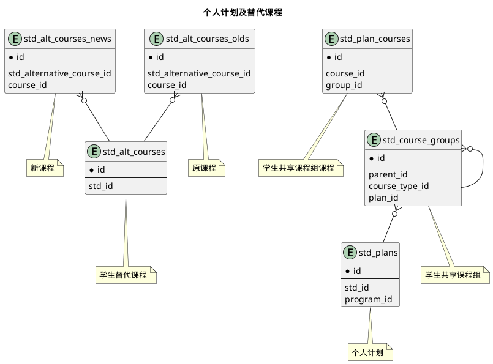



#### 目 录

##### 1. 数据库对象列表
  * [1.1 表格一览](index.html#表格一览)
  * [1.2 模块关系图](index.html#模块关系图)

##### 2. 具体模块明细
* [2.1 培养计划](plan.html)
* [2.2 其他](misc.html)

### 表格一览
数据库共计25个表，分别如下:

<table class="table table-bordered table-striped table-condensed">
  <tr>
    <th style="background-color:#D0D3FF">序号</th>
    <th style="background-color:#D0D3FF">表名/描述</th>
    <th style="background-color:#D0D3FF">序号</th>
    <th style="background-color:#D0D3FF">表名/描述</th>
  </tr>
  <tr>
    <td>1</td>
    <td><a href="misc.html#表格-execution_course_groups-执行计划课程组">execution_course_groups</a> 执行计划课程组</td>
    <td>14</td>
    <td><a href="misc.html#表格-program_docs-培养方案文档">program_docs</a> 培养方案文档</td>
  </tr>
  <tr>
    <td>2</td>
    <td><a href="misc.html#表格-execution_plan_courses-执行计划课程">execution_plan_courses</a> 执行计划课程</td>
    <td>15</td>
    <td><a href="misc.html#表格-programs-专业培养方案">programs</a> 专业培养方案</td>
  </tr>
  <tr>
    <td>3</td>
    <td><a href="misc.html#表格-execution_plans-执行培养计划">execution_plans</a> 执行培养计划</td>
    <td>16</td>
    <td><a href="plan.html#表格-share_course_groups-公共共享课程组">share_course_groups</a> 公共共享课程组</td>
  </tr>
  <tr>
    <td>4</td>
    <td><a href="plan.html#表格-major_alt_courses-专业替代课程">major_alt_courses</a> 专业替代课程</td>
    <td>17</td>
    <td><a href="plan.html#表格-share_plan_courses-公共共享课程组课程">share_plan_courses</a> 公共共享课程组课程</td>
  </tr>
  <tr>
    <td>5</td>
    <td><a href="plan.html#表格-major_alt_courses_news-新课程">major_alt_courses_news</a> 新课程</td>
    <td>18</td>
    <td><a href="plan.html#表格-share_plans-公共共享计划">share_plans</a> 公共共享计划</td>
  </tr>
  <tr>
    <td>6</td>
    <td><a href="plan.html#表格-major_alt_courses_olds-原课程">major_alt_courses_olds</a> 原课程</td>
    <td>19</td>
    <td><a href="plan.html#表格-std_alt_courses-学生替代课程">std_alt_courses</a> 学生替代课程</td>
  </tr>
  <tr>
    <td>7</td>
    <td><a href="plan.html#表格-major_course_groups-专业计划课程组">major_course_groups</a> 专业计划课程组</td>
    <td>20</td>
    <td><a href="plan.html#表格-std_alt_courses_news-新课程">std_alt_courses_news</a> 新课程</td>
  </tr>
  <tr>
    <td>8</td>
    <td><a href="plan.html#表格-major_plan_courses-专业计划课程">major_plan_courses</a> 专业计划课程</td>
    <td>21</td>
    <td><a href="plan.html#表格-std_alt_courses_olds-原课程">std_alt_courses_olds</a> 原课程</td>
  </tr>
  <tr>
    <td>9</td>
    <td><a href="plan.html#表格-major_plans-专业培养计划">major_plans</a> 专业培养计划</td>
    <td>22</td>
    <td><a href="plan.html#表格-std_course_groups-学生共享课程组">std_course_groups</a> 学生共享课程组</td>
  </tr>
  <tr>
    <td>10</td>
    <td><a href="misc.html#表格-program_doc_metas-培养方案章节定义">program_doc_metas</a> 培养方案章节定义</td>
    <td>23</td>
    <td><a href="plan.html#表格-std_plan_courses-学生共享课程组课程">std_plan_courses</a> 学生共享课程组课程</td>
  </tr>
  <tr>
    <td>11</td>
    <td><a href="misc.html#表格-program_doc_sections-培养方案文档章节">program_doc_sections</a> 培养方案文档章节</td>
    <td>24</td>
    <td><a href="plan.html#表格-std_plans-个人计划">std_plans</a> 个人计划</td>
  </tr>
  <tr>
    <td>12</td>
    <td><a href="misc.html#表格-program_doc_templates-培养方案文档模板">program_doc_templates</a> 培养方案文档模板</td>
    <td>25</td>
    <td><a href="misc.html#表格-term_campuses-专业所在校区">term_campuses</a> 专业所在校区</td>
  </tr>
  <tr>
    <td>13</td>
    <td><a href="misc.html#表格-program_doc_templates_types-文档对应学生类别">program_doc_templates_types</a> 文档对应学生类别</td>
    <td></td>
    <td></td>
  </tr>
</table>

### 模块关系图

#### 1. 专业培养计划及替代课程
  * 关系图

#### 2. 公共课计划
  * 关系图

#### 3. 个人计划及替代课程
  * 关系图

