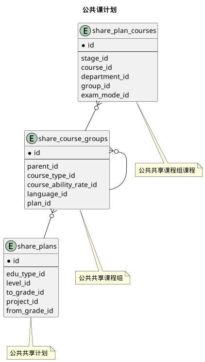


 目  录

* toc
{:toc}

### 关系图 1. 专业培养计划
  * 关系图

### 关系图 2. 公共课计划
  * 关系图

### 关系图 3. 个人计划
  * 关系图

### 表格 major_alt_courses 专业替代课程

  * 表格说明

<table class="table table-bordered table-striped table-condensed">
<tr><th style="background-color:#D0D3FF">表名</th><th style="background-color:#D0D3FF">主键</th><th style="background-color:#D0D3FF">注释</th>  </tr>
<tr><td>major_alt_courses</td><td>id</td><td>专业替代课程</td>  </tr>
</table>

  * 表格中的列

<table class="table table-bordered table-striped table-condensed">
<tr><th style="background-color:#D0D3FF" class="text-center">序号</th><th style="background-color:#D0D3FF">字段名</th><th style="background-color:#D0D3FF">字段类型</th><th style="background-color:#D0D3FF" class="text-center">是否可空</th><th style="background-color:#D0D3FF">描述</th><th style="background-color:#D0D3FF">引用表</th>  </tr>
<tr><td class="text-center">1</td><td>id</td><td>bigint</td><td class="text-center">否</td><td>非业务主键:datetime</td><td></td>  </tr>
<tr><td class="text-center">2</td><td>department_id</td><td>integer</td><td class="text-center">是</td><td>院系ID</td><td>base.departments</td>  </tr>
<tr><td class="text-center">3</td><td>direction_id</td><td>bigint</td><td class="text-center">是</td><td>适用方向ID</td><td>edu_base.directions</td>  </tr>
<tr><td class="text-center">4</td><td>from_grade</td><td>varchar(10)</td><td class="text-center">否</td><td>起始年级</td><td></td>  </tr>
<tr><td class="text-center">5</td><td>level_id</td><td>integer</td><td class="text-center">否</td><td>学历层次ID</td><td>code_gb.academic_levels</td>  </tr>
<tr><td class="text-center">6</td><td>major_id</td><td>bigint</td><td class="text-center">是</td><td>适用专业ID</td><td>edu_base.majors</td>  </tr>
<tr><td class="text-center">7</td><td>project_id</td><td>integer</td><td class="text-center">否</td><td>项目ID</td><td>edu_base.projects</td>  </tr>
<tr><td class="text-center">8</td><td>std_type_id</td><td>integer</td><td class="text-center">是</td><td>学生类别ID</td><td>edu_base.std_types</td>  </tr>
<tr><td class="text-center">9</td><td>to_grade</td><td>varchar(10)</td><td class="text-center">否</td><td>截至年级</td><td></td>  </tr>
<tr><td class="text-center">10</td><td>updated_at</td><td>timestamp</td><td class="text-center">否</td><td>更新时间</td><td></td>  </tr>
</table>

  * 表格的索引

<table class="table table-bordered table-striped table-condensed">
  <tr>
<th style="background-color:#D0D3FF">索引名</th><th style="background-color:#D0D3FF">索引字段</th><th style="background-color:#D0D3FF">是否唯一</th>  </tr>
<tr><td>idx_8s5d0wiirdi101qp238i6ovru</td><td>project_id&nbsp;</td><td>否</td>  </tr>
</table>

### 表格 major_alt_courses_news 新课程

  * 表格说明

<table class="table table-bordered table-striped table-condensed">
<tr><th style="background-color:#D0D3FF">表名</th><th style="background-color:#D0D3FF">主键</th><th style="background-color:#D0D3FF">注释</th>  </tr>
<tr><td>major_alt_courses_news</td><td>major_alternative_course_id,course_id</td><td>新课程</td>  </tr>
</table>

  * 表格中的列

<table class="table table-bordered table-striped table-condensed">
<tr><th style="background-color:#D0D3FF" class="text-center">序号</th><th style="background-color:#D0D3FF">字段名</th><th style="background-color:#D0D3FF">字段类型</th><th style="background-color:#D0D3FF" class="text-center">是否可空</th><th style="background-color:#D0D3FF">描述</th><th style="background-color:#D0D3FF">引用表</th>  </tr>
<tr><td class="text-center">1</td><td>course_id</td><td>bigint</td><td class="text-center">否</td><td>课程基本信息ID</td><td>edu_base.courses</td>  </tr>
<tr><td class="text-center">2</td><td>major_alternative_course_id</td><td>bigint</td><td class="text-center">否</td><td>专业替代课程ID</td><td>edu_program.major_alt_courses</td>  </tr>
</table>

  * 表格的索引

<table class="table table-bordered table-striped table-condensed">
  <tr>
<th style="background-color:#D0D3FF">索引名</th><th style="background-color:#D0D3FF">索引字段</th><th style="background-color:#D0D3FF">是否唯一</th>  </tr>
<tr><td>idx_4hvjp5b9sm4mb3gn32sdn86ch</td><td>major_alternative_course_id&nbsp;</td><td>否</td>  </tr>
</table>

### 表格 major_alt_courses_olds 原课程

  * 表格说明

<table class="table table-bordered table-striped table-condensed">
<tr><th style="background-color:#D0D3FF">表名</th><th style="background-color:#D0D3FF">主键</th><th style="background-color:#D0D3FF">注释</th>  </tr>
<tr><td>major_alt_courses_olds</td><td>major_alternative_course_id,course_id</td><td>原课程</td>  </tr>
</table>

  * 表格中的列

<table class="table table-bordered table-striped table-condensed">
<tr><th style="background-color:#D0D3FF" class="text-center">序号</th><th style="background-color:#D0D3FF">字段名</th><th style="background-color:#D0D3FF">字段类型</th><th style="background-color:#D0D3FF" class="text-center">是否可空</th><th style="background-color:#D0D3FF">描述</th><th style="background-color:#D0D3FF">引用表</th>  </tr>
<tr><td class="text-center">1</td><td>course_id</td><td>bigint</td><td class="text-center">否</td><td>课程基本信息ID</td><td>edu_base.courses</td>  </tr>
<tr><td class="text-center">2</td><td>major_alternative_course_id</td><td>bigint</td><td class="text-center">否</td><td>专业替代课程ID</td><td>edu_program.major_alt_courses</td>  </tr>
</table>

  * 表格的索引

<table class="table table-bordered table-striped table-condensed">
  <tr>
<th style="background-color:#D0D3FF">索引名</th><th style="background-color:#D0D3FF">索引字段</th><th style="background-color:#D0D3FF">是否唯一</th>  </tr>
<tr><td>idx_2v1a5cnldp9ct2bepe4510lry</td><td>major_alternative_course_id&nbsp;</td><td>否</td>  </tr>
</table>

### 表格 major_course_groups 专业计划课程组

  * 表格说明

<table class="table table-bordered table-striped table-condensed">
<tr><th style="background-color:#D0D3FF">表名</th><th style="background-color:#D0D3FF">主键</th><th style="background-color:#D0D3FF">注释</th>  </tr>
<tr><td>major_course_groups</td><td>id</td><td>专业计划课程组</td>  </tr>
</table>

  * 表格中的列

<table class="table table-bordered table-striped table-condensed">
<tr><th style="background-color:#D0D3FF" class="text-center">序号</th><th style="background-color:#D0D3FF">字段名</th><th style="background-color:#D0D3FF">字段类型</th><th style="background-color:#D0D3FF" class="text-center">是否可空</th><th style="background-color:#D0D3FF">描述</th><th style="background-color:#D0D3FF">引用表</th>  </tr>
<tr><td class="text-center">1</td><td>id</td><td>bigint</td><td class="text-center">否</td><td>非业务主键:datetime</td><td></td>  </tr>
<tr><td class="text-center">2</td><td>auto_addup</td><td>boolean</td><td class="text-center">否</td><td>自动累加学分</td><td></td>  </tr>
<tr><td class="text-center">3</td><td>course_count</td><td>smallint</td><td class="text-center">否</td><td>要求课程门数</td><td></td>  </tr>
<tr><td class="text-center">4</td><td>course_type_id</td><td>integer</td><td class="text-center">否</td><td>课程类别ID</td><td>edu_base.course_types</td>  </tr>
<tr><td class="text-center">5</td><td>credits</td><td>float4</td><td class="text-center">否</td><td>要求学分</td><td></td>  </tr>
<tr><td class="text-center">6</td><td>direction_id</td><td>bigint</td><td class="text-center">是</td><td>该组针对的专业方向ID</td><td>edu_base.directions</td>  </tr>
<tr><td class="text-center">7</td><td>given_name</td><td>varchar(100)</td><td class="text-center">是</td><td>自定义别名</td><td></td>  </tr>
<tr><td class="text-center">8</td><td>indexno</td><td>varchar(20)</td><td class="text-center">否</td><td>索引号</td><td></td>  </tr>
<tr><td class="text-center">9</td><td>parent_id</td><td>bigint</td><td class="text-center">是</td><td>上级组ID</td><td>edu_program.major_course_groups</td>  </tr>
<tr><td class="text-center">10</td><td>plan_id</td><td>bigint</td><td class="text-center">否</td><td>计划ID</td><td>edu_program.major_plans</td>  </tr>
<tr><td class="text-center">11</td><td>remark</td><td>varchar(200)</td><td class="text-center">是</td><td>备注</td><td></td>  </tr>
<tr><td class="text-center">12</td><td>sub_count</td><td>smallint</td><td class="text-center">否</td><td>要求完成组数</td><td></td>  </tr>
<tr><td class="text-center">13</td><td>term_credits</td><td>varchar(40)</td><td class="text-center">否</td><td>学期学分分布</td><td></td>  </tr>
<tr><td class="text-center">14</td><td>terms</td><td>integer</td><td class="text-center">否</td><td>开课学期</td><td></td>  </tr>
</table>

  * 表格的索引

<table class="table table-bordered table-striped table-condensed">
  <tr>
<th style="background-color:#D0D3FF">索引名</th><th style="background-color:#D0D3FF">索引字段</th><th style="background-color:#D0D3FF">是否唯一</th>  </tr>
<tr><td>idx_h0ysdj9584dxm8l728cffxrrl</td><td>plan_id&nbsp;</td><td>否</td>  </tr>
<tr><td>idx_k721uxxb3t08ojvw2gw6s4nt5</td><td>parent_id&nbsp;</td><td>否</td>  </tr>
</table>

### 表格 major_plan_courses 专业计划课程

  * 表格说明

<table class="table table-bordered table-striped table-condensed">
<tr><th style="background-color:#D0D3FF">表名</th><th style="background-color:#D0D3FF">主键</th><th style="background-color:#D0D3FF">注释</th>  </tr>
<tr><td>major_plan_courses</td><td>id</td><td>专业计划课程</td>  </tr>
</table>

  * 表格中的列

<table class="table table-bordered table-striped table-condensed">
<tr><th style="background-color:#D0D3FF" class="text-center">序号</th><th style="background-color:#D0D3FF">字段名</th><th style="background-color:#D0D3FF">字段类型</th><th style="background-color:#D0D3FF" class="text-center">是否可空</th><th style="background-color:#D0D3FF">描述</th><th style="background-color:#D0D3FF">引用表</th>  </tr>
<tr><td class="text-center">1</td><td>id</td><td>bigint</td><td class="text-center">否</td><td>非业务主键:datetime</td><td></td>  </tr>
<tr><td class="text-center">2</td><td>compulsory</td><td>boolean</td><td class="text-center">否</td><td>是否必修</td><td></td>  </tr>
<tr><td class="text-center">3</td><td>course_id</td><td>bigint</td><td class="text-center">否</td><td>课程ID</td><td>edu_base.courses</td>  </tr>
<tr><td class="text-center">4</td><td>department_id</td><td>integer</td><td class="text-center">否</td><td>开课部门ID</td><td>base.departments</td>  </tr>
<tr><td class="text-center">5</td><td>exam_mode_id</td><td>integer</td><td class="text-center">否</td><td>考核方式ID</td><td>code_hb.exam_modes</td>  </tr>
<tr><td class="text-center">6</td><td>group_id</td><td>bigint</td><td class="text-center">否</td><td>课程组ID</td><td>edu_program.major_course_groups</td>  </tr>
<tr><td class="text-center">7</td><td>remark</td><td>varchar(200)</td><td class="text-center">是</td><td>备注</td><td></td>  </tr>
<tr><td class="text-center">8</td><td>stage_id</td><td>integer</td><td class="text-center">否</td><td>日历阶段ID</td><td>edu_base.calendar_stages</td>  </tr>
<tr><td class="text-center">9</td><td>suggest_terms</td><td>integer</td><td class="text-center">否</td><td>建议修读学期</td><td></td>  </tr>
<tr><td class="text-center">10</td><td>terms</td><td>integer</td><td class="text-center">否</td><td>开课学期</td><td></td>  </tr>
<tr><td class="text-center">11</td><td>weekstate</td><td>bigint</td><td class="text-center">否</td><td>开课周</td><td></td>  </tr>
</table>

  * 表格中唯一约束

<table class="table table-bordered table-striped table-condensed">
  <tr>
<th style="background-color:#D0D3FF">序号</th><th style="background-color:#D0D3FF">约束名</th><th style="background-color:#D0D3FF">约束字段</th>  </tr>
<tr><td>1</td><td>uk_bmxrewotma5nd0dxovv1m77cw</td><td>group_id&nbsp;course_id&nbsp;</td>  </tr>
</table>

  * 表格的索引

<table class="table table-bordered table-striped table-condensed">
  <tr>
<th style="background-color:#D0D3FF">索引名</th><th style="background-color:#D0D3FF">索引字段</th><th style="background-color:#D0D3FF">是否唯一</th>  </tr>
<tr><td>idx_lew5g9v57qxwekv4aherpblii</td><td>group_id&nbsp;</td><td>否</td>  </tr>
</table>

### 表格 major_plans 专业培养计划

  * 表格说明

<table class="table table-bordered table-striped table-condensed">
<tr><th style="background-color:#D0D3FF">表名</th><th style="background-color:#D0D3FF">主键</th><th style="background-color:#D0D3FF">注释</th>  </tr>
<tr><td>major_plans</td><td>id</td><td>专业培养计划</td>  </tr>
</table>

  * 表格中的列

<table class="table table-bordered table-striped table-condensed">
<tr><th style="background-color:#D0D3FF" class="text-center">序号</th><th style="background-color:#D0D3FF">字段名</th><th style="background-color:#D0D3FF">字段类型</th><th style="background-color:#D0D3FF" class="text-center">是否可空</th><th style="background-color:#D0D3FF">描述</th><th style="background-color:#D0D3FF">引用表</th>  </tr>
<tr><td class="text-center">1</td><td>id</td><td>bigint</td><td class="text-center">否</td><td>非业务主键:datetime</td><td></td>  </tr>
<tr><td class="text-center">2</td><td>audit_state</td><td>integer</td><td class="text-center">否</td><td>审核状态</td><td></td>  </tr>
<tr><td class="text-center">3</td><td>begin_on</td><td>date</td><td class="text-center">否</td><td>生效日期</td><td></td>  </tr>
<tr><td class="text-center">4</td><td>credits</td><td>float4</td><td class="text-center">否</td><td>要求学分</td><td></td>  </tr>
<tr><td class="text-center">5</td><td>end_on</td><td>date</td><td class="text-center">否</td><td>失效日期</td><td></td>  </tr>
<tr><td class="text-center">6</td><td>end_term</td><td>smallint</td><td class="text-center">否</td><td>结束学期</td><td></td>  </tr>
<tr><td class="text-center">7</td><td>program_id</td><td>bigint</td><td class="text-center">否</td><td>专业培养方案ID</td><td>edu_program.programs</td>  </tr>
<tr><td class="text-center">8</td><td>remark</td><td>varchar(200)</td><td class="text-center">是</td><td>备注</td><td></td>  </tr>
<tr><td class="text-center">9</td><td>start_term</td><td>smallint</td><td class="text-center">否</td><td>起始学期</td><td></td>  </tr>
<tr><td class="text-center">10</td><td>updated_at</td><td>timestamp</td><td class="text-center">否</td><td>更新时间</td><td></td>  </tr>
</table>

  * 表格的索引

<table class="table table-bordered table-striped table-condensed">
  <tr>
<th style="background-color:#D0D3FF">索引名</th><th style="background-color:#D0D3FF">索引字段</th><th style="background-color:#D0D3FF">是否唯一</th>  </tr>
<tr><td>idx_5kjqjfeqltk9lomhga2doccnh</td><td>program_id&nbsp;</td><td>否</td>  </tr>
</table>

### 表格 share_course_groups 公共共享课程组

  * 表格说明

<table class="table table-bordered table-striped table-condensed">
<tr><th style="background-color:#D0D3FF">表名</th><th style="background-color:#D0D3FF">主键</th><th style="background-color:#D0D3FF">注释</th>  </tr>
<tr><td>share_course_groups</td><td>id</td><td>公共共享课程组</td>  </tr>
</table>

  * 表格中的列

<table class="table table-bordered table-striped table-condensed">
<tr><th style="background-color:#D0D3FF" class="text-center">序号</th><th style="background-color:#D0D3FF">字段名</th><th style="background-color:#D0D3FF">字段类型</th><th style="background-color:#D0D3FF" class="text-center">是否可空</th><th style="background-color:#D0D3FF">描述</th><th style="background-color:#D0D3FF">引用表</th>  </tr>
<tr><td class="text-center">1</td><td>id</td><td>bigint</td><td class="text-center">否</td><td>非业务主键:datetime</td><td></td>  </tr>
<tr><td class="text-center">2</td><td>course_ability_rate_id</td><td>integer</td><td class="text-center">是</td><td>要求能力等级ID</td><td>edu_base.course_ability_rates</td>  </tr>
<tr><td class="text-center">3</td><td>course_type_id</td><td>integer</td><td class="text-center">否</td><td>课程类别ID</td><td>edu_base.course_types</td>  </tr>
<tr><td class="text-center">4</td><td>indexno</td><td>varchar(255)</td><td class="text-center">否</td><td>顺序号</td><td></td>  </tr>
<tr><td class="text-center">5</td><td>language_id</td><td>integer</td><td class="text-center">是</td><td>要求外语语种ID</td><td>code_gb.languages</td>  </tr>
<tr><td class="text-center">6</td><td>parent_id</td><td>bigint</td><td class="text-center">是</td><td>公共共享课程组ID</td><td>edu_program.share_course_groups</td>  </tr>
<tr><td class="text-center">7</td><td>plan_id</td><td>bigint</td><td class="text-center">否</td><td>公共共享计划ID</td><td>edu_program.share_plans</td>  </tr>
</table>

  * 表格的索引

<table class="table table-bordered table-striped table-condensed">
  <tr>
<th style="background-color:#D0D3FF">索引名</th><th style="background-color:#D0D3FF">索引字段</th><th style="background-color:#D0D3FF">是否唯一</th>  </tr>
<tr><td>idx_127cshdpus15xol454uaojjfe</td><td>parent_id&nbsp;</td><td>否</td>  </tr>
<tr><td>idx_dsgghmsmfesuqdn7ct736a6re</td><td>plan_id&nbsp;</td><td>否</td>  </tr>
</table>

### 表格 share_plan_courses 公共共享课程组课程

  * 表格说明

<table class="table table-bordered table-striped table-condensed">
<tr><th style="background-color:#D0D3FF">表名</th><th style="background-color:#D0D3FF">主键</th><th style="background-color:#D0D3FF">注释</th>  </tr>
<tr><td>share_plan_courses</td><td>id</td><td>公共共享课程组课程</td>  </tr>
</table>

  * 表格中的列

<table class="table table-bordered table-striped table-condensed">
<tr><th style="background-color:#D0D3FF" class="text-center">序号</th><th style="background-color:#D0D3FF">字段名</th><th style="background-color:#D0D3FF">字段类型</th><th style="background-color:#D0D3FF" class="text-center">是否可空</th><th style="background-color:#D0D3FF">描述</th><th style="background-color:#D0D3FF">引用表</th>  </tr>
<tr><td class="text-center">1</td><td>id</td><td>bigint</td><td class="text-center">否</td><td>非业务主键:datetime</td><td></td>  </tr>
<tr><td class="text-center">2</td><td>course_id</td><td>bigint</td><td class="text-center">否</td><td>课程基本信息ID</td><td>edu_base.courses</td>  </tr>
<tr><td class="text-center">3</td><td>department_id</td><td>integer</td><td class="text-center">否</td><td>开课部门ID</td><td>base.departments</td>  </tr>
<tr><td class="text-center">4</td><td>exam_mode_id</td><td>integer</td><td class="text-center">否</td><td>考核方式ID</td><td>code_hb.exam_modes</td>  </tr>
<tr><td class="text-center">5</td><td>group_id</td><td>bigint</td><td class="text-center">否</td><td>公共共享课程组ID</td><td>edu_program.share_course_groups</td>  </tr>
<tr><td class="text-center">6</td><td>stage_id</td><td>integer</td><td class="text-center">否</td><td>日历阶段ID</td><td>edu_base.calendar_stages</td>  </tr>
<tr><td class="text-center">7</td><td>terms</td><td>integer</td><td class="text-center">否</td><td>学期</td><td></td>  </tr>
<tr><td class="text-center">8</td><td>weekstate</td><td>bigint</td><td class="text-center">否</td><td>开课周</td><td></td>  </tr>
</table>

  * 表格中唯一约束

<table class="table table-bordered table-striped table-condensed">
  <tr>
<th style="background-color:#D0D3FF">序号</th><th style="background-color:#D0D3FF">约束名</th><th style="background-color:#D0D3FF">约束字段</th>  </tr>
<tr><td>1</td><td>uk_4g3u5b9itdu90iij2y6la2ms5</td><td>group_id&nbsp;course_id&nbsp;</td>  </tr>
</table>

  * 表格的索引

<table class="table table-bordered table-striped table-condensed">
  <tr>
<th style="background-color:#D0D3FF">索引名</th><th style="background-color:#D0D3FF">索引字段</th><th style="background-color:#D0D3FF">是否唯一</th>  </tr>
<tr><td>idx_4kls4p6klclkgscfvak8pqsdf</td><td>group_id&nbsp;</td><td>否</td>  </tr>
</table>

### 表格 share_plans 公共共享计划

  * 表格说明

<table class="table table-bordered table-striped table-condensed">
<tr><th style="background-color:#D0D3FF">表名</th><th style="background-color:#D0D3FF">主键</th><th style="background-color:#D0D3FF">注释</th>  </tr>
<tr><td>share_plans</td><td>id</td><td>公共共享计划</td>  </tr>
</table>

  * 表格中的列

<table class="table table-bordered table-striped table-condensed">
<tr><th style="background-color:#D0D3FF" class="text-center">序号</th><th style="background-color:#D0D3FF">字段名</th><th style="background-color:#D0D3FF">字段类型</th><th style="background-color:#D0D3FF" class="text-center">是否可空</th><th style="background-color:#D0D3FF">描述</th><th style="background-color:#D0D3FF">引用表</th>  </tr>
<tr><td class="text-center">1</td><td>id</td><td>bigint</td><td class="text-center">否</td><td>非业务主键:datetime</td><td></td>  </tr>
<tr><td class="text-center">2</td><td>begin_on</td><td>date</td><td class="text-center">否</td><td>生效日期</td><td></td>  </tr>
<tr><td class="text-center">3</td><td>end_on</td><td>date</td><td class="text-center">否</td><td>失效日期</td><td></td>  </tr>
<tr><td class="text-center">4</td><td>from_grade</td><td>varchar(255)</td><td class="text-center">否</td><td>起始适用年级</td><td></td>  </tr>
<tr><td class="text-center">5</td><td>level_id</td><td>integer</td><td class="text-center">否</td><td>培养层次ID</td><td>code_hb.education_levels</td>  </tr>
<tr><td class="text-center">6</td><td>name</td><td>varchar(255)</td><td class="text-center">否</td><td>名称</td><td></td>  </tr>
<tr><td class="text-center">7</td><td>project_id</td><td>integer</td><td class="text-center">否</td><td>项目ID</td><td>edu_base.projects</td>  </tr>
<tr><td class="text-center">8</td><td>remark</td><td>varchar(200)</td><td class="text-center">是</td><td>备注</td><td></td>  </tr>
<tr><td class="text-center">9</td><td>to_grade</td><td>varchar(255)</td><td class="text-center">否</td><td>截止适用年级</td><td></td>  </tr>
<tr><td class="text-center">10</td><td>updated_at</td><td>timestamp</td><td class="text-center">否</td><td>更新时间</td><td></td>  </tr>
</table>

### 表格 std_alt_courses 学生替代课程

  * 表格说明

<table class="table table-bordered table-striped table-condensed">
<tr><th style="background-color:#D0D3FF">表名</th><th style="background-color:#D0D3FF">主键</th><th style="background-color:#D0D3FF">注释</th>  </tr>
<tr><td>std_alt_courses</td><td>id</td><td>学生替代课程</td>  </tr>
</table>

  * 表格中的列

<table class="table table-bordered table-striped table-condensed">
<tr><th style="background-color:#D0D3FF" class="text-center">序号</th><th style="background-color:#D0D3FF">字段名</th><th style="background-color:#D0D3FF">字段类型</th><th style="background-color:#D0D3FF" class="text-center">是否可空</th><th style="background-color:#D0D3FF">描述</th><th style="background-color:#D0D3FF">引用表</th>  </tr>
<tr><td class="text-center">1</td><td>id</td><td>bigint</td><td class="text-center">否</td><td>非业务主键:datetime</td><td></td>  </tr>
<tr><td class="text-center">2</td><td>std_id</td><td>bigint</td><td class="text-center">否</td><td>学生ID</td><td>edu_base.students</td>  </tr>
<tr><td class="text-center">3</td><td>updated_at</td><td>timestamp</td><td class="text-center">否</td><td>更新时间</td><td></td>  </tr>
</table>

  * 表格的索引

<table class="table table-bordered table-striped table-condensed">
  <tr>
<th style="background-color:#D0D3FF">索引名</th><th style="background-color:#D0D3FF">索引字段</th><th style="background-color:#D0D3FF">是否唯一</th>  </tr>
<tr><td>idx_mstilk5giawk7vh78kv73x7tr</td><td>std_id&nbsp;</td><td>否</td>  </tr>
</table>

### 表格 std_alt_courses_news 新课程

  * 表格说明

<table class="table table-bordered table-striped table-condensed">
<tr><th style="background-color:#D0D3FF">表名</th><th style="background-color:#D0D3FF">主键</th><th style="background-color:#D0D3FF">注释</th>  </tr>
<tr><td>std_alt_courses_news</td><td>std_alternative_course_id,course_id</td><td>新课程</td>  </tr>
</table>

  * 表格中的列

<table class="table table-bordered table-striped table-condensed">
<tr><th style="background-color:#D0D3FF" class="text-center">序号</th><th style="background-color:#D0D3FF">字段名</th><th style="background-color:#D0D3FF">字段类型</th><th style="background-color:#D0D3FF" class="text-center">是否可空</th><th style="background-color:#D0D3FF">描述</th><th style="background-color:#D0D3FF">引用表</th>  </tr>
<tr><td class="text-center">1</td><td>course_id</td><td>bigint</td><td class="text-center">否</td><td>课程基本信息ID</td><td>edu_base.courses</td>  </tr>
<tr><td class="text-center">2</td><td>std_alternative_course_id</td><td>bigint</td><td class="text-center">否</td><td>学生替代课程ID</td><td>edu_program.std_alt_courses</td>  </tr>
</table>

  * 表格的索引

<table class="table table-bordered table-striped table-condensed">
  <tr>
<th style="background-color:#D0D3FF">索引名</th><th style="background-color:#D0D3FF">索引字段</th><th style="background-color:#D0D3FF">是否唯一</th>  </tr>
<tr><td>idx_1swj196xyqjha21237i35824w</td><td>std_alternative_course_id&nbsp;</td><td>否</td>  </tr>
</table>

### 表格 std_alt_courses_olds 原课程

  * 表格说明

<table class="table table-bordered table-striped table-condensed">
<tr><th style="background-color:#D0D3FF">表名</th><th style="background-color:#D0D3FF">主键</th><th style="background-color:#D0D3FF">注释</th>  </tr>
<tr><td>std_alt_courses_olds</td><td>std_alternative_course_id,course_id</td><td>原课程</td>  </tr>
</table>

  * 表格中的列

<table class="table table-bordered table-striped table-condensed">
<tr><th style="background-color:#D0D3FF" class="text-center">序号</th><th style="background-color:#D0D3FF">字段名</th><th style="background-color:#D0D3FF">字段类型</th><th style="background-color:#D0D3FF" class="text-center">是否可空</th><th style="background-color:#D0D3FF">描述</th><th style="background-color:#D0D3FF">引用表</th>  </tr>
<tr><td class="text-center">1</td><td>course_id</td><td>bigint</td><td class="text-center">否</td><td>课程基本信息ID</td><td>edu_base.courses</td>  </tr>
<tr><td class="text-center">2</td><td>std_alternative_course_id</td><td>bigint</td><td class="text-center">否</td><td>学生替代课程ID</td><td>edu_program.std_alt_courses</td>  </tr>
</table>

  * 表格的索引

<table class="table table-bordered table-striped table-condensed">
  <tr>
<th style="background-color:#D0D3FF">索引名</th><th style="background-color:#D0D3FF">索引字段</th><th style="background-color:#D0D3FF">是否唯一</th>  </tr>
<tr><td>idx_xtxet4oto3m3lt6fkyq6l9vj</td><td>std_alternative_course_id&nbsp;</td><td>否</td>  </tr>
</table>

### 表格 std_course_groups 学生共享课程组

  * 表格说明

<table class="table table-bordered table-striped table-condensed">
<tr><th style="background-color:#D0D3FF">表名</th><th style="background-color:#D0D3FF">主键</th><th style="background-color:#D0D3FF">注释</th>  </tr>
<tr><td>std_course_groups</td><td>id</td><td>学生共享课程组</td>  </tr>
</table>

  * 表格中的列

<table class="table table-bordered table-striped table-condensed">
<tr><th style="background-color:#D0D3FF" class="text-center">序号</th><th style="background-color:#D0D3FF">字段名</th><th style="background-color:#D0D3FF">字段类型</th><th style="background-color:#D0D3FF" class="text-center">是否可空</th><th style="background-color:#D0D3FF">描述</th><th style="background-color:#D0D3FF">引用表</th>  </tr>
<tr><td class="text-center">1</td><td>id</td><td>bigint</td><td class="text-center">否</td><td>非业务主键:datetime</td><td></td>  </tr>
<tr><td class="text-center">2</td><td>auto_addup</td><td>boolean</td><td class="text-center">否</td><td>自动累加学分</td><td></td>  </tr>
<tr><td class="text-center">3</td><td>course_count</td><td>smallint</td><td class="text-center">否</td><td>要求课程门数</td><td></td>  </tr>
<tr><td class="text-center">4</td><td>course_type_id</td><td>integer</td><td class="text-center">否</td><td>课程类别ID</td><td>edu_base.course_types</td>  </tr>
<tr><td class="text-center">5</td><td>credits</td><td>float4</td><td class="text-center">否</td><td>要求学分</td><td></td>  </tr>
<tr><td class="text-center">6</td><td>indexno</td><td>varchar(20)</td><td class="text-center">否</td><td>索引号</td><td></td>  </tr>
<tr><td class="text-center">7</td><td>parent_id</td><td>bigint</td><td class="text-center">是</td><td>上级组ID</td><td>edu_program.std_course_groups</td>  </tr>
<tr><td class="text-center">8</td><td>plan_id</td><td>bigint</td><td class="text-center">否</td><td>计划ID</td><td>edu_program.std_plans</td>  </tr>
<tr><td class="text-center">9</td><td>remark</td><td>varchar(200)</td><td class="text-center">是</td><td>备注</td><td></td>  </tr>
<tr><td class="text-center">10</td><td>sub_count</td><td>smallint</td><td class="text-center">否</td><td>要求完成组数</td><td></td>  </tr>
<tr><td class="text-center">11</td><td>term_credits</td><td>varchar(255)</td><td class="text-center">否</td><td>学期学分分布</td><td></td>  </tr>
<tr><td class="text-center">12</td><td>terms</td><td>integer</td><td class="text-center">否</td><td>开课学期</td><td></td>  </tr>
</table>

  * 表格的索引

<table class="table table-bordered table-striped table-condensed">
  <tr>
<th style="background-color:#D0D3FF">索引名</th><th style="background-color:#D0D3FF">索引字段</th><th style="background-color:#D0D3FF">是否唯一</th>  </tr>
<tr><td>idx_e7b2h1mmriptticlepxklqk0c</td><td>parent_id&nbsp;</td><td>否</td>  </tr>
<tr><td>idx_fu51ynnn9xdnujcuopnl6nu7k</td><td>plan_id&nbsp;</td><td>否</td>  </tr>
</table>

### 表格 std_plan_courses 学生共享课程组课程

  * 表格说明

<table class="table table-bordered table-striped table-condensed">
<tr><th style="background-color:#D0D3FF">表名</th><th style="background-color:#D0D3FF">主键</th><th style="background-color:#D0D3FF">注释</th>  </tr>
<tr><td>std_plan_courses</td><td>id</td><td>学生共享课程组课程</td>  </tr>
</table>

  * 表格中的列

<table class="table table-bordered table-striped table-condensed">
<tr><th style="background-color:#D0D3FF" class="text-center">序号</th><th style="background-color:#D0D3FF">字段名</th><th style="background-color:#D0D3FF">字段类型</th><th style="background-color:#D0D3FF" class="text-center">是否可空</th><th style="background-color:#D0D3FF">描述</th><th style="background-color:#D0D3FF">引用表</th>  </tr>
<tr><td class="text-center">1</td><td>id</td><td>bigint</td><td class="text-center">否</td><td>非业务主键:datetime</td><td></td>  </tr>
<tr><td class="text-center">2</td><td>compulsory</td><td>boolean</td><td class="text-center">否</td><td>是否必修</td><td></td>  </tr>
<tr><td class="text-center">3</td><td>course_id</td><td>bigint</td><td class="text-center">否</td><td>课程ID</td><td>edu_base.courses</td>  </tr>
<tr><td class="text-center">4</td><td>group_id</td><td>bigint</td><td class="text-center">否</td><td>课程组ID</td><td>edu_program.std_course_groups</td>  </tr>
<tr><td class="text-center">5</td><td>remark</td><td>varchar(200)</td><td class="text-center">是</td><td>备注</td><td></td>  </tr>
<tr><td class="text-center">6</td><td>terms</td><td>integer</td><td class="text-center">否</td><td>开课学期</td><td></td>  </tr>
</table>

  * 表格中唯一约束

<table class="table table-bordered table-striped table-condensed">
  <tr>
<th style="background-color:#D0D3FF">序号</th><th style="background-color:#D0D3FF">约束名</th><th style="background-color:#D0D3FF">约束字段</th>  </tr>
<tr><td>1</td><td>uk_9ume0khx1eqjh5l7v7lsp3gjf</td><td>group_id&nbsp;course_id&nbsp;</td>  </tr>
</table>

  * 表格的索引

<table class="table table-bordered table-striped table-condensed">
  <tr>
<th style="background-color:#D0D3FF">索引名</th><th style="background-color:#D0D3FF">索引字段</th><th style="background-color:#D0D3FF">是否唯一</th>  </tr>
<tr><td>idx_fyc4q8xtjps60xf5gfovi398s</td><td>group_id&nbsp;</td><td>否</td>  </tr>
</table>

### 表格 std_plans 个人计划

  * 表格说明

<table class="table table-bordered table-striped table-condensed">
<tr><th style="background-color:#D0D3FF">表名</th><th style="background-color:#D0D3FF">主键</th><th style="background-color:#D0D3FF">注释</th>  </tr>
<tr><td>std_plans</td><td>id</td><td>个人计划</td>  </tr>
</table>

  * 表格中的列

<table class="table table-bordered table-striped table-condensed">
<tr><th style="background-color:#D0D3FF" class="text-center">序号</th><th style="background-color:#D0D3FF">字段名</th><th style="background-color:#D0D3FF">字段类型</th><th style="background-color:#D0D3FF" class="text-center">是否可空</th><th style="background-color:#D0D3FF">描述</th><th style="background-color:#D0D3FF">引用表</th>  </tr>
<tr><td class="text-center">1</td><td>id</td><td>bigint</td><td class="text-center">否</td><td>非业务主键:datetime</td><td></td>  </tr>
<tr><td class="text-center">2</td><td>audit_state</td><td>integer</td><td class="text-center">否</td><td>审核状态</td><td></td>  </tr>
<tr><td class="text-center">3</td><td>begin_on</td><td>date</td><td class="text-center">否</td><td>生效日期</td><td></td>  </tr>
<tr><td class="text-center">4</td><td>credits</td><td>float4</td><td class="text-center">否</td><td>要求学分</td><td></td>  </tr>
<tr><td class="text-center">5</td><td>end_on</td><td>date</td><td class="text-center">否</td><td>失效日期</td><td></td>  </tr>
<tr><td class="text-center">6</td><td>end_term</td><td>smallint</td><td class="text-center">否</td><td>结束学期</td><td></td>  </tr>
<tr><td class="text-center">7</td><td>program_id</td><td>bigint</td><td class="text-center">否</td><td>专业培养方案ID</td><td>edu_program.programs</td>  </tr>
<tr><td class="text-center">8</td><td>remark</td><td>varchar(200)</td><td class="text-center">是</td><td>备注</td><td></td>  </tr>
<tr><td class="text-center">9</td><td>start_term</td><td>smallint</td><td class="text-center">否</td><td>起始学期</td><td></td>  </tr>
<tr><td class="text-center">10</td><td>std_id</td><td>bigint</td><td class="text-center">否</td><td>学生ID</td><td>edu_base.students</td>  </tr>
<tr><td class="text-center">11</td><td>updated_at</td><td>timestamp</td><td class="text-center">否</td><td>更新时间</td><td></td>  </tr>
</table>

  * 表格中唯一约束

<table class="table table-bordered table-striped table-condensed">
  <tr>
<th style="background-color:#D0D3FF">序号</th><th style="background-color:#D0D3FF">约束名</th><th style="background-color:#D0D3FF">约束字段</th>  </tr>
<tr><td>1</td><td>uk_jo5xh73ptavgr1lk7p0sfpamw</td><td>std_id&nbsp;</td>  </tr>
</table>

