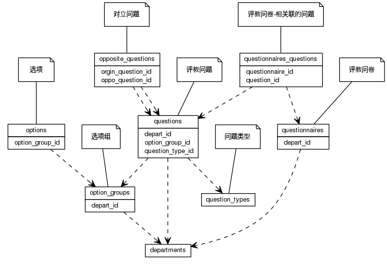


 目  录

* toc
{:toc}

### 关系图 1. 问卷
  * 关系图
  

### 表格 opposite_questions

  * 表格说明

<table class="table table-bordered table-striped table-condensed">
<tr><th style="background-color:#D0D3FF">表名</th><th style="background-color:#D0D3FF">主键</th><th style="background-color:#D0D3FF">注释</th>  </tr>
<tr><td>opposite_questions</td><td>id</td><td>对立问题</td>  </tr>
</table>

  * 表格中的列

<table class="table table-bordered table-striped table-condensed">
<tr><th style="background-color:#D0D3FF">序号</th><th style="background-color:#D0D3FF">字段名</th><th style="background-color:#D0D3FF">字段类型</th><th style="background-color:#D0D3FF">是否可空</th><th style="background-color:#D0D3FF">描述</th><th style="background-color:#D0D3FF">引用表</th>  </tr>
<tr><td>1</td><td>id</td><td>int8</td><td>否</td><td>非业务主键:date</td><td></td>  </tr>
<tr><td>2</td><td>orgin_question_id</td><td>int8</td><td>否</td><td>原始问题 ID</td><td>questions</td>  </tr>
<tr><td>3</td><td>oppo_question_id</td><td>int8</td><td>否</td><td>对立问题 ID</td><td>questions</td>  </tr>
</table>

 
  * 表格的索引

<table class="table table-bordered table-striped table-condensed">
  <tr>
<th style="background-color:#D0D3FF">索引名</th><th style="background-color:#D0D3FF">索引字段</th><th style="background-color:#D0D3FF">是否唯一</th>  </tr>
<tr><td>opposite_questions_pkey</td><td>id&nbsp;</td><td>是</td>  </tr>
</table>

### 表格 option_groups

  * 表格说明

<table class="table table-bordered table-striped table-condensed">
<tr><th style="background-color:#D0D3FF">表名</th><th style="background-color:#D0D3FF">主键</th><th style="background-color:#D0D3FF">注释</th>  </tr>
<tr><td>option_groups</td><td>id</td><td>选项组</td>  </tr>
</table>

  * 表格中的列

<table class="table table-bordered table-striped table-condensed">
<tr><th style="background-color:#D0D3FF">序号</th><th style="background-color:#D0D3FF">字段名</th><th style="background-color:#D0D3FF">字段类型</th><th style="background-color:#D0D3FF">是否可空</th><th style="background-color:#D0D3FF">描述</th><th style="background-color:#D0D3FF">引用表</th>  </tr>
<tr><td>1</td><td>id</td><td>int8</td><td>否</td><td>非业务主键:date</td><td></td>  </tr>
<tr><td>2</td><td>name</td><td>varchar</td><td>是</td><td>名称</td><td></td>  </tr>
<tr><td>3</td><td>oppo_val</td><td>float4</td><td>否</td><td>倾向性权重 必须在0和1之间</td><td></td>  </tr>
<tr><td>4</td><td>depart_id</td><td>int4</td><td>否</td><td>创建部门 ID</td><td>departments</td>  </tr>
</table>

 
  * 表格的索引

<table class="table table-bordered table-striped table-condensed">
  <tr>
<th style="background-color:#D0D3FF">索引名</th><th style="background-color:#D0D3FF">索引字段</th><th style="background-color:#D0D3FF">是否唯一</th>  </tr>
<tr><td>option_groups_pkey</td><td>id&nbsp;</td><td>是</td>  </tr>
</table>

### 表格 options

  * 表格说明

<table class="table table-bordered table-striped table-condensed">
<tr><th style="background-color:#D0D3FF">表名</th><th style="background-color:#D0D3FF">主键</th><th style="background-color:#D0D3FF">注释</th>  </tr>
<tr><td>options</td><td>id</td><td>选项</td>  </tr>
</table>

  * 表格中的列

<table class="table table-bordered table-striped table-condensed">
<tr><th style="background-color:#D0D3FF">序号</th><th style="background-color:#D0D3FF">字段名</th><th style="background-color:#D0D3FF">字段类型</th><th style="background-color:#D0D3FF">是否可空</th><th style="background-color:#D0D3FF">描述</th><th style="background-color:#D0D3FF">引用表</th>  </tr>
<tr><td>1</td><td>id</td><td>int8</td><td>否</td><td>非业务主键:date</td><td></td>  </tr>
<tr><td>2</td><td>name</td><td>varchar</td><td>是</td><td>选项名</td><td></td>  </tr>
<tr><td>3</td><td>proportion</td><td>float4</td><td>是</td><td>选项所占比重（权重）</td><td></td>  </tr>
<tr><td>4</td><td>option_group_id</td><td>int8</td><td>否</td><td>选项组 ID</td><td>option_groups</td>  </tr>
</table>

 
  * 表格的索引

<table class="table table-bordered table-striped table-condensed">
  <tr>
<th style="background-color:#D0D3FF">索引名</th><th style="background-color:#D0D3FF">索引字段</th><th style="background-color:#D0D3FF">是否唯一</th>  </tr>
<tr><td>options_pkey</td><td>id&nbsp;</td><td>是</td>  </tr>
</table>

### 表格 question_types

  * 表格说明

<table class="table table-bordered table-striped table-condensed">
<tr><th style="background-color:#D0D3FF">表名</th><th style="background-color:#D0D3FF">主键</th><th style="background-color:#D0D3FF">注释</th>  </tr>
<tr><td>question_types</td><td>id</td><td>问题类型</td>  </tr>
</table>

  * 表格中的列

<table class="table table-bordered table-striped table-condensed">
<tr><th style="background-color:#D0D3FF">序号</th><th style="background-color:#D0D3FF">字段名</th><th style="background-color:#D0D3FF">字段类型</th><th style="background-color:#D0D3FF">是否可空</th><th style="background-color:#D0D3FF">描述</th><th style="background-color:#D0D3FF">引用表</th>  </tr>
<tr><td>1</td><td>id</td><td>int8</td><td>否</td><td>非业务主键:date</td><td></td>  </tr>
<tr><td>2</td><td>name</td><td>varchar</td><td>否</td><td>中文名称</td><td></td>  </tr>
<tr><td>3</td><td>en_name</td><td>varchar</td><td>是</td><td>英文名称</td><td></td>  </tr>
<tr><td>4</td><td>priority</td><td>int4</td><td>是</td><td>优先级 ,越大越靠前</td><td></td>  </tr>
<tr><td>5</td><td>remark</td><td>varchar</td><td>是</td><td>备注</td><td></td>  </tr>
<tr><td>6</td><td>created_at</td><td>timestamp</td><td>是</td><td>创建时间</td><td></td>  </tr>
<tr><td>7</td><td>updated_at</td><td>timestamp</td><td>是</td><td>更新时间</td><td></td>  </tr>
<tr><td>8</td><td>effective_at</td><td>timestamp</td><td>是</td><td>生效时间</td><td></td>  </tr>
<tr><td>9</td><td>invalid_at</td><td>timestamp</td><td>是</td><td>失效时间</td><td></td>  </tr>
<tr><td>10</td><td>state</td><td>bool</td><td>否</td><td>状态</td><td></td>  </tr>
</table>

 
  * 表格的索引

<table class="table table-bordered table-striped table-condensed">
  <tr>
<th style="background-color:#D0D3FF">索引名</th><th style="background-color:#D0D3FF">索引字段</th><th style="background-color:#D0D3FF">是否唯一</th>  </tr>
<tr><td>question_types_pkey</td><td>id&nbsp;</td><td>是</td>  </tr>
</table>

### 表格 questionnaires

  * 表格说明

<table class="table table-bordered table-striped table-condensed">
<tr><th style="background-color:#D0D3FF">表名</th><th style="background-color:#D0D3FF">主键</th><th style="background-color:#D0D3FF">注释</th>  </tr>
<tr><td>questionnaires</td><td>id</td><td>评教问卷</td>  </tr>
</table>

  * 表格中的列

<table class="table table-bordered table-striped table-condensed">
<tr><th style="background-color:#D0D3FF">序号</th><th style="background-color:#D0D3FF">字段名</th><th style="background-color:#D0D3FF">字段类型</th><th style="background-color:#D0D3FF">是否可空</th><th style="background-color:#D0D3FF">描述</th><th style="background-color:#D0D3FF">引用表</th>  </tr>
<tr><td>1</td><td>id</td><td>int8</td><td>否</td><td>非业务主键:date</td><td></td>  </tr>
<tr><td>2</td><td>title</td><td>varchar</td><td>是</td><td>问卷标题</td><td></td>  </tr>
<tr><td>3</td><td>description</td><td>varchar</td><td>是</td><td>简单描述</td><td></td>  </tr>
<tr><td>4</td><td>depart_id</td><td>int4</td><td>否</td><td>创建部门 ID</td><td>departments</td>  </tr>
<tr><td>5</td><td>create_by</td><td>varchar</td><td>是</td><td>创建者</td><td></td>  </tr>
<tr><td>6</td><td>remark</td><td>varchar</td><td>是</td><td>备注</td><td></td>  </tr>
<tr><td>7</td><td>created_at</td><td>timestamp</td><td>是</td><td>创建时间</td><td></td>  </tr>
<tr><td>8</td><td>updated_at</td><td>timestamp</td><td>是</td><td>更新时间</td><td></td>  </tr>
<tr><td>9</td><td>effective_at</td><td>timestamp</td><td>是</td><td>生效时间</td><td></td>  </tr>
<tr><td>10</td><td>invalid_at</td><td>timestamp</td><td>是</td><td>失效时间</td><td></td>  </tr>
<tr><td>11</td><td>state</td><td>bool</td><td>否</td><td>使用状态</td><td></td>  </tr>
</table>

 
  * 表格的索引

<table class="table table-bordered table-striped table-condensed">
  <tr>
<th style="background-color:#D0D3FF">索引名</th><th style="background-color:#D0D3FF">索引字段</th><th style="background-color:#D0D3FF">是否唯一</th>  </tr>
<tr><td>questionnaires_pkey</td><td>id&nbsp;</td><td>是</td>  </tr>
</table>

### 表格 questionnaires_questions

  * 表格说明

<table class="table table-bordered table-striped table-condensed">
<tr><th style="background-color:#D0D3FF">表名</th><th style="background-color:#D0D3FF">主键</th><th style="background-color:#D0D3FF">注释</th>  </tr>
<tr><td>questionnaires_questions</td><td>questionnaire_id,question_id</td><td>评教问卷-相关联的问题</td>  </tr>
</table>

  * 表格中的列

<table class="table table-bordered table-striped table-condensed">
<tr><th style="background-color:#D0D3FF">序号</th><th style="background-color:#D0D3FF">字段名</th><th style="background-color:#D0D3FF">字段类型</th><th style="background-color:#D0D3FF">是否可空</th><th style="background-color:#D0D3FF">描述</th><th style="background-color:#D0D3FF">引用表</th>  </tr>
<tr><td>1</td><td>questionnaire_id</td><td>int8</td><td>否</td><td>评教问卷 ID</td><td>questionnaires</td>  </tr>
<tr><td>2</td><td>question_id</td><td>int8</td><td>否</td><td>评教问题 ID</td><td>questions</td>  </tr>
</table>

 
  * 表格的索引

<table class="table table-bordered table-striped table-condensed">
  <tr>
<th style="background-color:#D0D3FF">索引名</th><th style="background-color:#D0D3FF">索引字段</th><th style="background-color:#D0D3FF">是否唯一</th>  </tr>
<tr><td>questionnaires_questions_pkey</td><td>questionnaire_id&nbsp;question_id&nbsp;</td><td>是</td>  </tr>
</table>

### 表格 questions

  * 表格说明

<table class="table table-bordered table-striped table-condensed">
<tr><th style="background-color:#D0D3FF">表名</th><th style="background-color:#D0D3FF">主键</th><th style="background-color:#D0D3FF">注释</th>  </tr>
<tr><td>questions</td><td>id</td><td>评教问题</td>  </tr>
</table>

  * 表格中的列

<table class="table table-bordered table-striped table-condensed">
<tr><th style="background-color:#D0D3FF">序号</th><th style="background-color:#D0D3FF">字段名</th><th style="background-color:#D0D3FF">字段类型</th><th style="background-color:#D0D3FF">是否可空</th><th style="background-color:#D0D3FF">描述</th><th style="background-color:#D0D3FF">引用表</th>  </tr>
<tr><td>1</td><td>id</td><td>int8</td><td>否</td><td>非业务主键:date</td><td></td>  </tr>
<tr><td>2</td><td>content</td><td>varchar</td><td>否</td><td>问题内容</td><td></td>  </tr>
<tr><td>3</td><td>score</td><td>float4</td><td>是</td><td>分值</td><td></td>  </tr>
<tr><td>4</td><td>priority</td><td>int4</td><td>是</td><td>优先级</td><td></td>  </tr>
<tr><td>5</td><td>remark</td><td>varchar</td><td>是</td><td>注释</td><td></td>  </tr>
<tr><td>6</td><td>created_at</td><td>timestamp</td><td>是</td><td>创建时间</td><td></td>  </tr>
<tr><td>7</td><td>updated_at</td><td>timestamp</td><td>是</td><td>更新时间</td><td></td>  </tr>
<tr><td>8</td><td>effective_at</td><td>timestamp</td><td>是</td><td>生效时间</td><td></td>  </tr>
<tr><td>9</td><td>invalid_at</td><td>timestamp</td><td>是</td><td>失效时间</td><td></td>  </tr>
<tr><td>10</td><td>state</td><td>bool</td><td>否</td><td>使用状态</td><td></td>  </tr>
<tr><td>11</td><td>addition</td><td>bool</td><td>否</td><td>是否附加题</td><td></td>  </tr>
<tr><td>12</td><td>question_type_id</td><td>int8</td><td>否</td><td>问题类型 ID</td><td>question_types</td>  </tr>
<tr><td>13</td><td>depart_id</td><td>int4</td><td>否</td><td>问题所对应的使用部门 ID</td><td>departments</td>  </tr>
<tr><td>14</td><td>option_group_id</td><td>int8</td><td>否</td><td>选项组 ID</td><td>option_groups</td>  </tr>
</table>

 
  * 表格的索引

<table class="table table-bordered table-striped table-condensed">
  <tr>
<th style="background-color:#D0D3FF">索引名</th><th style="background-color:#D0D3FF">索引字段</th><th style="background-color:#D0D3FF">是否唯一</th>  </tr>
<tr><td>questions_pkey</td><td>id&nbsp;</td><td>是</td>  </tr>
</table>
