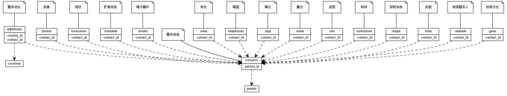


 目  录

* toc
{:toc}

### 关系图 1. 总体
  * 关系图
  

### 表格 addresses

  * 表格说明

<table class="table table-bordered table-striped table-condensed">
<tr><th style="background-color:#D0D3FF">表名</th><th style="background-color:#D0D3FF">主键</th><th style="background-color:#D0D3FF">注释</th>  </tr>
<tr><td>addresses</td><td>id</td><td>联系地址</td>  </tr>
</table>

  * 表格中的列

<table class="table table-bordered table-striped table-condensed">
<tr><th style="background-color:#D0D3FF">序号</th><th style="background-color:#D0D3FF">字段名</th><th style="background-color:#D0D3FF">字段类型</th><th style="background-color:#D0D3FF">是否可空</th><th style="background-color:#D0D3FF">描述</th><th style="background-color:#D0D3FF">引用表</th>  </tr>
<tr><td>1</td><td>id</td><td>int8</td><td>否</td><td>非业务主键:auto_increment</td><td></td>  </tr>
<tr><td>2</td><td>contact_id</td><td>int8</td><td>否</td><td>联系方式 ID</td><td>contacts</td>  </tr>
<tr><td>3</td><td>pref</td><td>int4</td><td>是</td><td>优先级</td><td></td>  </tr>
<tr><td>4</td><td>typenames</td><td>varchar</td><td>是</td><td>类型列表</td><td></td>  </tr>
<tr><td>5</td><td>country_id</td><td>int4</td><td>是</td><td>国家地区 ID</td><td></td>  </tr>
<tr><td>6</td><td>pobox</td><td>varchar</td><td>是</td><td>信箱</td><td></td>  </tr>
<tr><td>7</td><td>extended</td><td>varchar</td><td>是</td><td>其他详细说明</td><td></td>  </tr>
<tr><td>8</td><td>street</td><td>varchar</td><td>是</td><td>街道</td><td></td>  </tr>
<tr><td>9</td><td>locality</td><td>varchar</td><td>是</td><td>地区/县/镇</td><td></td>  </tr>
<tr><td>10</td><td>region</td><td>varchar</td><td>是</td><td>州/省份/直辖市</td><td></td>  </tr>
<tr><td>11</td><td>postal_code</td><td>varchar</td><td>是</td><td>邮编</td><td></td>  </tr>
<tr><td>12</td><td>geo</td><td>varchar</td><td>是</td><td>地理方位</td><td></td>  </tr>
</table>

 
  * 表格的索引

<table class="table table-bordered table-striped table-condensed">
  <tr>
<th style="background-color:#D0D3FF">索引名</th><th style="background-color:#D0D3FF">索引字段</th><th style="background-color:#D0D3FF">是否唯一</th>  </tr>
<tr><td>addresses_pkey</td><td>id&nbsp;</td><td>是</td>  </tr>
</table>

### 表格 contacts

  * 表格说明

<table class="table table-bordered table-striped table-condensed">
<tr><th style="background-color:#D0D3FF">表名</th><th style="background-color:#D0D3FF">主键</th><th style="background-color:#D0D3FF">注释</th>  </tr>
<tr><td>contacts</td><td>id</td><td>联系信息</td>  </tr>
</table>

  * 表格中的列

<table class="table table-bordered table-striped table-condensed">
<tr><th style="background-color:#D0D3FF">序号</th><th style="background-color:#D0D3FF">字段名</th><th style="background-color:#D0D3FF">字段类型</th><th style="background-color:#D0D3FF">是否可空</th><th style="background-color:#D0D3FF">描述</th><th style="background-color:#D0D3FF">引用表</th>  </tr>
<tr><td>1</td><td>id</td><td>int8</td><td>否</td><td>非业务主键:auto_increment</td><td></td>  </tr>
<tr><td>2</td><td>person_id</td><td>int8</td><td>否</td><td>人员 ID</td><td>people</td>  </tr>
<tr><td>3</td><td>revision</td><td>int8</td><td>是</td><td>revision</td><td></td>  </tr>
<tr><td>4</td><td>uuid</td><td>varchar</td><td>是</td><td>UUID</td><td></td>  </tr>
<tr><td>5</td><td>sort_as</td><td>varchar</td><td>是</td><td>排序字段</td><td></td>  </tr>
<tr><td>6</td><td>anniversary</td><td>date</td><td>是</td><td>anniversary</td><td></td>  </tr>
<tr><td>7</td><td>updated_at</td><td>timestamp</td><td>是</td><td>updatedAt</td><td></td>  </tr>
</table>

 
  * 表格的索引

<table class="table table-bordered table-striped table-condensed">
  <tr>
<th style="background-color:#D0D3FF">索引名</th><th style="background-color:#D0D3FF">索引字段</th><th style="background-color:#D0D3FF">是否唯一</th>  </tr>
<tr><td>contacts_pkey</td><td>id&nbsp;</td><td>是</td>  </tr>
</table>

### 表格 emails

  * 表格说明

<table class="table table-bordered table-striped table-condensed">
<tr><th style="background-color:#D0D3FF">表名</th><th style="background-color:#D0D3FF">主键</th><th style="background-color:#D0D3FF">注释</th>  </tr>
<tr><td>emails</td><td>id</td><td>电子邮件</td>  </tr>
</table>

  * 表格中的列

<table class="table table-bordered table-striped table-condensed">
<tr><th style="background-color:#D0D3FF">序号</th><th style="background-color:#D0D3FF">字段名</th><th style="background-color:#D0D3FF">字段类型</th><th style="background-color:#D0D3FF">是否可空</th><th style="background-color:#D0D3FF">描述</th><th style="background-color:#D0D3FF">引用表</th>  </tr>
<tr><td>1</td><td>id</td><td>int8</td><td>否</td><td>非业务主键:auto_increment</td><td></td>  </tr>
<tr><td>2</td><td>contact_id</td><td>int8</td><td>否</td><td>联系方式 ID</td><td>contacts</td>  </tr>
<tr><td>3</td><td>pref</td><td>int4</td><td>是</td><td>优先级</td><td></td>  </tr>
<tr><td>4</td><td>typenames</td><td>varchar</td><td>是</td><td>类型列表</td><td></td>  </tr>
<tr><td>5</td><td>email</td><td>varchar</td><td>是</td><td>邮件地址</td><td></td>  </tr>
</table>

 
  * 表格的索引

<table class="table table-bordered table-striped table-condensed">
  <tr>
<th style="background-color:#D0D3FF">索引名</th><th style="background-color:#D0D3FF">索引字段</th><th style="background-color:#D0D3FF">是否唯一</th>  </tr>
<tr><td>emails_pkey</td><td>id&nbsp;</td><td>是</td>  </tr>
</table>

### 表格 geos

  * 表格说明

<table class="table table-bordered table-striped table-condensed">
<tr><th style="background-color:#D0D3FF">表名</th><th style="background-color:#D0D3FF">主键</th><th style="background-color:#D0D3FF">注释</th>  </tr>
<tr><td>geos</td><td>id</td><td>地理方位</td>  </tr>
</table>

  * 表格中的列

<table class="table table-bordered table-striped table-condensed">
<tr><th style="background-color:#D0D3FF">序号</th><th style="background-color:#D0D3FF">字段名</th><th style="background-color:#D0D3FF">字段类型</th><th style="background-color:#D0D3FF">是否可空</th><th style="background-color:#D0D3FF">描述</th><th style="background-color:#D0D3FF">引用表</th>  </tr>
<tr><td>1</td><td>id</td><td>int8</td><td>否</td><td>非业务主键:auto_increment</td><td></td>  </tr>
<tr><td>2</td><td>contact_id</td><td>int8</td><td>否</td><td>联系方式 ID</td><td>contacts</td>  </tr>
<tr><td>3</td><td>pref</td><td>int4</td><td>是</td><td>优先级</td><td></td>  </tr>
<tr><td>4</td><td>typenames</td><td>varchar</td><td>是</td><td>类型列表</td><td></td>  </tr>
<tr><td>5</td><td>latitude</td><td>float8</td><td>是</td><td>纬度</td><td></td>  </tr>
<tr><td>6</td><td>longitude</td><td>float8</td><td>是</td><td>经度</td><td></td>  </tr>
</table>

 
  * 表格的索引

<table class="table table-bordered table-striped table-condensed">
  <tr>
<th style="background-color:#D0D3FF">索引名</th><th style="background-color:#D0D3FF">索引字段</th><th style="background-color:#D0D3FF">是否唯一</th>  </tr>
<tr><td>geos_pkey</td><td>id&nbsp;</td><td>是</td>  </tr>
</table>

### 表格 impps

  * 表格说明

<table class="table table-bordered table-striped table-condensed">
<tr><th style="background-color:#D0D3FF">表名</th><th style="background-color:#D0D3FF">主键</th><th style="background-color:#D0D3FF">注释</th>  </tr>
<tr><td>impps</td><td>id</td><td>即时消息</td>  </tr>
</table>

  * 表格中的列

<table class="table table-bordered table-striped table-condensed">
<tr><th style="background-color:#D0D3FF">序号</th><th style="background-color:#D0D3FF">字段名</th><th style="background-color:#D0D3FF">字段类型</th><th style="background-color:#D0D3FF">是否可空</th><th style="background-color:#D0D3FF">描述</th><th style="background-color:#D0D3FF">引用表</th>  </tr>
<tr><td>1</td><td>id</td><td>int8</td><td>否</td><td>非业务主键:auto_increment</td><td></td>  </tr>
<tr><td>2</td><td>contact_id</td><td>int8</td><td>否</td><td>联系方式 ID</td><td>contacts</td>  </tr>
<tr><td>3</td><td>pref</td><td>int4</td><td>是</td><td>优先级</td><td></td>  </tr>
<tr><td>4</td><td>typenames</td><td>varchar</td><td>是</td><td>类型列表</td><td></td>  </tr>
<tr><td>5</td><td>impp</td><td>varchar</td><td>是</td><td>协议内容</td><td></td>  </tr>
</table>

 
  * 表格的索引

<table class="table table-bordered table-striped table-condensed">
  <tr>
<th style="background-color:#D0D3FF">索引名</th><th style="background-color:#D0D3FF">索引字段</th><th style="background-color:#D0D3FF">是否唯一</th>  </tr>
<tr><td>impps_pkey</td><td>id&nbsp;</td><td>是</td>  </tr>
</table>

### 表格 nicknames

  * 表格说明

<table class="table table-bordered table-striped table-condensed">
<tr><th style="background-color:#D0D3FF">表名</th><th style="background-color:#D0D3FF">主键</th><th style="background-color:#D0D3FF">注释</th>  </tr>
<tr><td>nicknames</td><td>id</td><td>称呼</td>  </tr>
</table>

  * 表格中的列

<table class="table table-bordered table-striped table-condensed">
<tr><th style="background-color:#D0D3FF">序号</th><th style="background-color:#D0D3FF">字段名</th><th style="background-color:#D0D3FF">字段类型</th><th style="background-color:#D0D3FF">是否可空</th><th style="background-color:#D0D3FF">描述</th><th style="background-color:#D0D3FF">引用表</th>  </tr>
<tr><td>1</td><td>id</td><td>int8</td><td>否</td><td>非业务主键:auto_increment</td><td></td>  </tr>
<tr><td>2</td><td>contact_id</td><td>int8</td><td>否</td><td>联系方式 ID</td><td>contacts</td>  </tr>
<tr><td>3</td><td>pref</td><td>int4</td><td>是</td><td>优先级</td><td></td>  </tr>
<tr><td>4</td><td>typenames</td><td>varchar</td><td>是</td><td>类型列表</td><td></td>  </tr>
<tr><td>5</td><td>name</td><td>varchar</td><td>是</td><td>name</td><td></td>  </tr>
</table>

 
  * 表格的索引

<table class="table table-bordered table-striped table-condensed">
  <tr>
<th style="background-color:#D0D3FF">索引名</th><th style="background-color:#D0D3FF">索引字段</th><th style="background-color:#D0D3FF">是否唯一</th>  </tr>
<tr><td>nicknames_pkey</td><td>id&nbsp;</td><td>是</td>  </tr>
</table>

### 表格 notes

  * 表格说明

<table class="table table-bordered table-striped table-condensed">
<tr><th style="background-color:#D0D3FF">表名</th><th style="background-color:#D0D3FF">主键</th><th style="background-color:#D0D3FF">注释</th>  </tr>
<tr><td>notes</td><td>id</td><td>备注</td>  </tr>
</table>

  * 表格中的列

<table class="table table-bordered table-striped table-condensed">
<tr><th style="background-color:#D0D3FF">序号</th><th style="background-color:#D0D3FF">字段名</th><th style="background-color:#D0D3FF">字段类型</th><th style="background-color:#D0D3FF">是否可空</th><th style="background-color:#D0D3FF">描述</th><th style="background-color:#D0D3FF">引用表</th>  </tr>
<tr><td>1</td><td>id</td><td>int8</td><td>否</td><td>非业务主键:auto_increment</td><td></td>  </tr>
<tr><td>2</td><td>contact_id</td><td>int8</td><td>否</td><td>联系方式 ID</td><td>contacts</td>  </tr>
<tr><td>3</td><td>pref</td><td>int4</td><td>是</td><td>优先级</td><td></td>  </tr>
<tr><td>4</td><td>typenames</td><td>varchar</td><td>是</td><td>类型列表</td><td></td>  </tr>
<tr><td>5</td><td>note</td><td>varchar</td><td>是</td><td>备注</td><td></td>  </tr>
</table>

 
  * 表格的索引

<table class="table table-bordered table-striped table-condensed">
  <tr>
<th style="background-color:#D0D3FF">索引名</th><th style="background-color:#D0D3FF">索引字段</th><th style="background-color:#D0D3FF">是否唯一</th>  </tr>
<tr><td>notes_pkey</td><td>id&nbsp;</td><td>是</td>  </tr>
</table>

### 表格 orgs

  * 表格说明

<table class="table table-bordered table-striped table-condensed">
<tr><th style="background-color:#D0D3FF">表名</th><th style="background-color:#D0D3FF">主键</th><th style="background-color:#D0D3FF">注释</th>  </tr>
<tr><td>orgs</td><td>id</td><td>单位</td>  </tr>
</table>

  * 表格中的列

<table class="table table-bordered table-striped table-condensed">
<tr><th style="background-color:#D0D3FF">序号</th><th style="background-color:#D0D3FF">字段名</th><th style="background-color:#D0D3FF">字段类型</th><th style="background-color:#D0D3FF">是否可空</th><th style="background-color:#D0D3FF">描述</th><th style="background-color:#D0D3FF">引用表</th>  </tr>
<tr><td>1</td><td>id</td><td>int8</td><td>否</td><td>非业务主键:auto_increment</td><td></td>  </tr>
<tr><td>2</td><td>contact_id</td><td>int8</td><td>否</td><td>联系方式 ID</td><td>contacts</td>  </tr>
<tr><td>3</td><td>pref</td><td>int4</td><td>是</td><td>优先级</td><td></td>  </tr>
<tr><td>4</td><td>typenames</td><td>varchar</td><td>是</td><td>类型列表</td><td></td>  </tr>
<tr><td>5</td><td>name</td><td>varchar</td><td>是</td><td>名称</td><td></td>  </tr>
<tr><td>6</td><td>unit</td><td>varchar</td><td>是</td><td>部门</td><td></td>  </tr>
</table>

 
  * 表格的索引

<table class="table table-bordered table-striped table-condensed">
  <tr>
<th style="background-color:#D0D3FF">索引名</th><th style="background-color:#D0D3FF">索引字段</th><th style="background-color:#D0D3FF">是否唯一</th>  </tr>
<tr><td>orgs_pkey</td><td>id&nbsp;</td><td>是</td>  </tr>
</table>

### 表格 photos

  * 表格说明

<table class="table table-bordered table-striped table-condensed">
<tr><th style="background-color:#D0D3FF">表名</th><th style="background-color:#D0D3FF">主键</th><th style="background-color:#D0D3FF">注释</th>  </tr>
<tr><td>photos</td><td>id</td><td>头像</td>  </tr>
</table>

  * 表格中的列

<table class="table table-bordered table-striped table-condensed">
<tr><th style="background-color:#D0D3FF">序号</th><th style="background-color:#D0D3FF">字段名</th><th style="background-color:#D0D3FF">字段类型</th><th style="background-color:#D0D3FF">是否可空</th><th style="background-color:#D0D3FF">描述</th><th style="background-color:#D0D3FF">引用表</th>  </tr>
<tr><td>1</td><td>id</td><td>int8</td><td>否</td><td>非业务主键:auto_increment</td><td></td>  </tr>
<tr><td>2</td><td>contact_id</td><td>int8</td><td>否</td><td>联系方式 ID</td><td>contacts</td>  </tr>
<tr><td>3</td><td>pref</td><td>int4</td><td>是</td><td>优先级</td><td></td>  </tr>
<tr><td>4</td><td>typenames</td><td>varchar</td><td>是</td><td>类型列表</td><td></td>  </tr>
<tr><td>5</td><td>uri</td><td>varchar</td><td>是</td><td>地址</td><td></td>  </tr>
</table>

 
  * 表格的索引

<table class="table table-bordered table-striped table-condensed">
  <tr>
<th style="background-color:#D0D3FF">索引名</th><th style="background-color:#D0D3FF">索引字段</th><th style="background-color:#D0D3FF">是否唯一</th>  </tr>
<tr><td>photos_pkey</td><td>id&nbsp;</td><td>是</td>  </tr>
</table>

### 表格 relateds

  * 表格说明

<table class="table table-bordered table-striped table-condensed">
<tr><th style="background-color:#D0D3FF">表名</th><th style="background-color:#D0D3FF">主键</th><th style="background-color:#D0D3FF">注释</th>  </tr>
<tr><td>relateds</td><td>id</td><td>相关联系人</td>  </tr>
</table>

  * 表格中的列

<table class="table table-bordered table-striped table-condensed">
<tr><th style="background-color:#D0D3FF">序号</th><th style="background-color:#D0D3FF">字段名</th><th style="background-color:#D0D3FF">字段类型</th><th style="background-color:#D0D3FF">是否可空</th><th style="background-color:#D0D3FF">描述</th><th style="background-color:#D0D3FF">引用表</th>  </tr>
<tr><td>1</td><td>id</td><td>int8</td><td>否</td><td>非业务主键:auto_increment</td><td></td>  </tr>
<tr><td>2</td><td>contact_id</td><td>int8</td><td>否</td><td>联系方式 ID</td><td>contacts</td>  </tr>
<tr><td>3</td><td>pref</td><td>int4</td><td>是</td><td>优先级</td><td></td>  </tr>
<tr><td>4</td><td>typenames</td><td>varchar</td><td>是</td><td>类型列表</td><td></td>  </tr>
<tr><td>5</td><td>related</td><td>varchar</td><td>是</td><td>相关联系人</td><td></td>  </tr>
</table>

 
  * 表格的索引

<table class="table table-bordered table-striped table-condensed">
  <tr>
<th style="background-color:#D0D3FF">索引名</th><th style="background-color:#D0D3FF">索引字段</th><th style="background-color:#D0D3FF">是否唯一</th>  </tr>
<tr><td>relateds_pkey</td><td>id&nbsp;</td><td>是</td>  </tr>
</table>

### 表格 roles

  * 表格说明

<table class="table table-bordered table-striped table-condensed">
<tr><th style="background-color:#D0D3FF">表名</th><th style="background-color:#D0D3FF">主键</th><th style="background-color:#D0D3FF">注释</th>  </tr>
<tr><td>roles</td><td>id</td><td>角色</td>  </tr>
</table>

  * 表格中的列

<table class="table table-bordered table-striped table-condensed">
<tr><th style="background-color:#D0D3FF">序号</th><th style="background-color:#D0D3FF">字段名</th><th style="background-color:#D0D3FF">字段类型</th><th style="background-color:#D0D3FF">是否可空</th><th style="background-color:#D0D3FF">描述</th><th style="background-color:#D0D3FF">引用表</th>  </tr>
<tr><td>1</td><td>id</td><td>int8</td><td>否</td><td>非业务主键:auto_increment</td><td></td>  </tr>
<tr><td>2</td><td>contact_id</td><td>int8</td><td>否</td><td>联系方式 ID</td><td>contacts</td>  </tr>
<tr><td>3</td><td>pref</td><td>int4</td><td>是</td><td>优先级</td><td></td>  </tr>
<tr><td>4</td><td>typenames</td><td>varchar</td><td>是</td><td>类型列表</td><td></td>  </tr>
<tr><td>5</td><td>name</td><td>varchar</td><td>是</td><td>名称</td><td></td>  </tr>
</table>

 
  * 表格的索引

<table class="table table-bordered table-striped table-condensed">
  <tr>
<th style="background-color:#D0D3FF">索引名</th><th style="background-color:#D0D3FF">索引字段</th><th style="background-color:#D0D3FF">是否唯一</th>  </tr>
<tr><td>roles_pkey</td><td>id&nbsp;</td><td>是</td>  </tr>
</table>

### 表格 telephones

  * 表格说明

<table class="table table-bordered table-striped table-condensed">
<tr><th style="background-color:#D0D3FF">表名</th><th style="background-color:#D0D3FF">主键</th><th style="background-color:#D0D3FF">注释</th>  </tr>
<tr><td>telephones</td><td>id</td><td>电话</td>  </tr>
</table>

  * 表格中的列

<table class="table table-bordered table-striped table-condensed">
<tr><th style="background-color:#D0D3FF">序号</th><th style="background-color:#D0D3FF">字段名</th><th style="background-color:#D0D3FF">字段类型</th><th style="background-color:#D0D3FF">是否可空</th><th style="background-color:#D0D3FF">描述</th><th style="background-color:#D0D3FF">引用表</th>  </tr>
<tr><td>1</td><td>id</td><td>int8</td><td>否</td><td>非业务主键:auto_increment</td><td></td>  </tr>
<tr><td>2</td><td>contact_id</td><td>int8</td><td>否</td><td>联系方式 ID</td><td>contacts</td>  </tr>
<tr><td>3</td><td>pref</td><td>int4</td><td>是</td><td>优先级</td><td></td>  </tr>
<tr><td>4</td><td>typenames</td><td>varchar</td><td>是</td><td>类型列表</td><td></td>  </tr>
<tr><td>5</td><td>tel</td><td>varchar</td><td>是</td><td>号码</td><td></td>  </tr>
</table>

 
  * 表格的索引

<table class="table table-bordered table-striped table-condensed">
  <tr>
<th style="background-color:#D0D3FF">索引名</th><th style="background-color:#D0D3FF">索引字段</th><th style="background-color:#D0D3FF">是否唯一</th>  </tr>
<tr><td>telephones_pkey</td><td>id&nbsp;</td><td>是</td>  </tr>
</table>

### 表格 timezones

  * 表格说明

<table class="table table-bordered table-striped table-condensed">
<tr><th style="background-color:#D0D3FF">表名</th><th style="background-color:#D0D3FF">主键</th><th style="background-color:#D0D3FF">注释</th>  </tr>
<tr><td>timezones</td><td>id</td><td>时区</td>  </tr>
</table>

  * 表格中的列

<table class="table table-bordered table-striped table-condensed">
<tr><th style="background-color:#D0D3FF">序号</th><th style="background-color:#D0D3FF">字段名</th><th style="background-color:#D0D3FF">字段类型</th><th style="background-color:#D0D3FF">是否可空</th><th style="background-color:#D0D3FF">描述</th><th style="background-color:#D0D3FF">引用表</th>  </tr>
<tr><td>1</td><td>id</td><td>int8</td><td>否</td><td>非业务主键:auto_increment</td><td></td>  </tr>
<tr><td>2</td><td>contact_id</td><td>int8</td><td>否</td><td>联系方式 ID</td><td>contacts</td>  </tr>
<tr><td>3</td><td>pref</td><td>int4</td><td>是</td><td>优先级</td><td></td>  </tr>
<tr><td>4</td><td>typenames</td><td>varchar</td><td>是</td><td>类型列表</td><td></td>  </tr>
<tr><td>5</td><td>timezone</td><td>varchar</td><td>是</td><td>时区</td><td></td>  </tr>
</table>

 
  * 表格的索引

<table class="table table-bordered table-striped table-condensed">
  <tr>
<th style="background-color:#D0D3FF">索引名</th><th style="background-color:#D0D3FF">索引字段</th><th style="background-color:#D0D3FF">是否唯一</th>  </tr>
<tr><td>timezones_pkey</td><td>id&nbsp;</td><td>是</td>  </tr>
</table>

### 表格 titles

  * 表格说明

<table class="table table-bordered table-striped table-condensed">
<tr><th style="background-color:#D0D3FF">表名</th><th style="background-color:#D0D3FF">主键</th><th style="background-color:#D0D3FF">注释</th>  </tr>
<tr><td>titles</td><td>id</td><td>头衔</td>  </tr>
</table>

  * 表格中的列

<table class="table table-bordered table-striped table-condensed">
<tr><th style="background-color:#D0D3FF">序号</th><th style="background-color:#D0D3FF">字段名</th><th style="background-color:#D0D3FF">字段类型</th><th style="background-color:#D0D3FF">是否可空</th><th style="background-color:#D0D3FF">描述</th><th style="background-color:#D0D3FF">引用表</th>  </tr>
<tr><td>1</td><td>id</td><td>int8</td><td>否</td><td>非业务主键:auto_increment</td><td></td>  </tr>
<tr><td>2</td><td>contact_id</td><td>int8</td><td>否</td><td>联系方式 ID</td><td>contacts</td>  </tr>
<tr><td>3</td><td>pref</td><td>int4</td><td>是</td><td>优先级</td><td></td>  </tr>
<tr><td>4</td><td>typenames</td><td>varchar</td><td>是</td><td>类型列表</td><td></td>  </tr>
<tr><td>5</td><td>name</td><td>varchar</td><td>是</td><td>name</td><td></td>  </tr>
</table>

 
  * 表格的索引

<table class="table table-bordered table-striped table-condensed">
  <tr>
<th style="background-color:#D0D3FF">索引名</th><th style="background-color:#D0D3FF">索引字段</th><th style="background-color:#D0D3FF">是否唯一</th>  </tr>
<tr><td>titles_pkey</td><td>id&nbsp;</td><td>是</td>  </tr>
</table>

### 表格 urls

  * 表格说明

<table class="table table-bordered table-striped table-condensed">
<tr><th style="background-color:#D0D3FF">表名</th><th style="background-color:#D0D3FF">主键</th><th style="background-color:#D0D3FF">注释</th>  </tr>
<tr><td>urls</td><td>id</td><td>网页</td>  </tr>
</table>

  * 表格中的列

<table class="table table-bordered table-striped table-condensed">
<tr><th style="background-color:#D0D3FF">序号</th><th style="background-color:#D0D3FF">字段名</th><th style="background-color:#D0D3FF">字段类型</th><th style="background-color:#D0D3FF">是否可空</th><th style="background-color:#D0D3FF">描述</th><th style="background-color:#D0D3FF">引用表</th>  </tr>
<tr><td>1</td><td>id</td><td>int8</td><td>否</td><td>非业务主键:auto_increment</td><td></td>  </tr>
<tr><td>2</td><td>contact_id</td><td>int8</td><td>否</td><td>联系方式 ID</td><td>contacts</td>  </tr>
<tr><td>3</td><td>pref</td><td>int4</td><td>是</td><td>优先级</td><td></td>  </tr>
<tr><td>4</td><td>typenames</td><td>varchar</td><td>是</td><td>类型列表</td><td></td>  </tr>
<tr><td>5</td><td>url</td><td>varchar</td><td>是</td><td>地址</td><td></td>  </tr>
</table>

 
  * 表格的索引

<table class="table table-bordered table-striped table-condensed">
  <tr>
<th style="background-color:#D0D3FF">索引名</th><th style="background-color:#D0D3FF">索引字段</th><th style="background-color:#D0D3FF">是否唯一</th>  </tr>
<tr><td>urls_pkey</td><td>id&nbsp;</td><td>是</td>  </tr>
</table>

### 表格 xtendeds

  * 表格说明

<table class="table table-bordered table-striped table-condensed">
<tr><th style="background-color:#D0D3FF">表名</th><th style="background-color:#D0D3FF">主键</th><th style="background-color:#D0D3FF">注释</th>  </tr>
<tr><td>xtendeds</td><td>id</td><td>扩展信息</td>  </tr>
</table>

  * 表格中的列

<table class="table table-bordered table-striped table-condensed">
<tr><th style="background-color:#D0D3FF">序号</th><th style="background-color:#D0D3FF">字段名</th><th style="background-color:#D0D3FF">字段类型</th><th style="background-color:#D0D3FF">是否可空</th><th style="background-color:#D0D3FF">描述</th><th style="background-color:#D0D3FF">引用表</th>  </tr>
<tr><td>1</td><td>id</td><td>int8</td><td>否</td><td>非业务主键:auto_increment</td><td></td>  </tr>
<tr><td>2</td><td>contact_id</td><td>int8</td><td>否</td><td>联系方式 ID</td><td>contacts</td>  </tr>
<tr><td>3</td><td>pref</td><td>int4</td><td>是</td><td>优先级</td><td></td>  </tr>
<tr><td>4</td><td>typenames</td><td>varchar</td><td>是</td><td>类型列表</td><td></td>  </tr>
<tr><td>5</td><td>xname</td><td>varchar</td><td>是</td><td>名称</td><td></td>  </tr>
<tr><td>6</td><td>xvalue</td><td>varchar</td><td>是</td><td>值</td><td></td>  </tr>
</table>

 
  * 表格的索引

<table class="table table-bordered table-striped table-condensed">
  <tr>
<th style="background-color:#D0D3FF">索引名</th><th style="background-color:#D0D3FF">索引字段</th><th style="background-color:#D0D3FF">是否唯一</th>  </tr>
<tr><td>xtendeds_pkey</td><td>id&nbsp;</td><td>是</td>  </tr>
</table>
