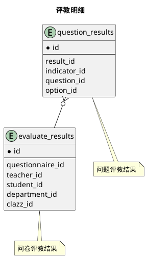


 目  录

* toc
{:toc}

### 关系图 1. 评教明细
  * 关系图

### 表格 evaluate_results 问卷评教结果

  * 表格说明

<table class="table table-bordered table-striped table-condensed">
<tr><th style="background-color:#D0D3FF">表名</th><th style="background-color:#D0D3FF">主键</th><th style="background-color:#D0D3FF">注释</th>  </tr>
<tr><td>evaluate_results</td><td>id</td><td>问卷评教结果</td>  </tr>
</table>

  * 表格中的列

<table class="table table-bordered table-striped table-condensed">
<tr><th style="background-color:#D0D3FF" class="text-center">序号</th><th style="background-color:#D0D3FF">字段名</th><th style="background-color:#D0D3FF">字段类型</th><th style="background-color:#D0D3FF" class="text-center">是否可空</th><th style="background-color:#D0D3FF">描述</th><th style="background-color:#D0D3FF">引用表</th>  </tr>
<tr><td class="text-center">1</td><td>id</td><td>bigint</td><td class="text-center">否</td><td>非业务主键:datetime</td><td></td>  </tr>
<tr><td class="text-center">2</td><td>clazz_id</td><td>bigint</td><td class="text-center">否</td><td>教学任务ID</td><td>           <a href="/model/edu/clazz/clazz.html#表格-clazzes-教学任务">edu.clazzes</a>
</td>  </tr>
<tr><td class="text-center">3</td><td>department_id</td><td>integer</td><td class="text-center">否</td><td>开课院系ID</td><td>           <a href="/model/base/common/user.html#表格-departments-部门组织机构信息">base.departments</a>
</td>  </tr>
<tr><td class="text-center">4</td><td>evaluate_at</td><td>timestamp</td><td class="text-center">否</td><td>评教时间</td><td></td>  </tr>
<tr><td class="text-center">5</td><td>questionnaire_id</td><td>bigint</td><td class="text-center">否</td><td>问卷信息ID</td><td>           <a href="/model/qos/evaluation/questionnaires.html#表格-questionnaires-评教问卷">qos.questionnaires</a>
</td>  </tr>
<tr><td class="text-center">6</td><td>remark</td><td>varchar(20)</td><td class="text-center">否</td><td>备注</td><td></td>  </tr>
<tr><td class="text-center">7</td><td>score</td><td>float4</td><td class="text-center">否</td><td>总分</td><td></td>  </tr>
<tr><td class="text-center">8</td><td>stat_type</td><td>integer</td><td class="text-center">否</td><td>1正常 2 无效 3异常(互斥)</td><td></td>  </tr>
<tr><td class="text-center">9</td><td>student_id</td><td>bigint</td><td class="text-center">否</td><td>学生ID</td><td>           <a href="/model/base/edu/core.html#表格-students-学籍信息实现">base.students</a>
</td>  </tr>
<tr><td class="text-center">10</td><td>teacher_id</td><td>bigint</td><td class="text-center">否</td><td>教师ID</td><td>           <a href="/model/base/edu/core.html#表格-teachers-教师信息">base.teachers</a>
</td>  </tr>
</table>

### 表格 question_results 问题评教结果

  * 表格说明

<table class="table table-bordered table-striped table-condensed">
<tr><th style="background-color:#D0D3FF">表名</th><th style="background-color:#D0D3FF">主键</th><th style="background-color:#D0D3FF">注释</th>  </tr>
<tr><td>question_results</td><td>id</td><td>问题评教结果</td>  </tr>
</table>

  * 表格中的列

<table class="table table-bordered table-striped table-condensed">
<tr><th style="background-color:#D0D3FF" class="text-center">序号</th><th style="background-color:#D0D3FF">字段名</th><th style="background-color:#D0D3FF">字段类型</th><th style="background-color:#D0D3FF" class="text-center">是否可空</th><th style="background-color:#D0D3FF">描述</th><th style="background-color:#D0D3FF">引用表</th>  </tr>
<tr><td class="text-center">1</td><td>id</td><td>bigint</td><td class="text-center">否</td><td>非业务主键:datetime</td><td></td>  </tr>
<tr><td class="text-center">2</td><td>option_id</td><td>bigint</td><td class="text-center">否</td><td>问题选项ID</td><td>           <a href="/model/qos/evaluation/questionnaires.html#表格-options-选项">qos.options</a>
</td>  </tr>
<tr><td class="text-center">3</td><td>question_id</td><td>bigint</td><td class="text-center">否</td><td>问题ID</td><td>           <a href="/model/qos/evaluation/questionnaires.html#表格-questions-评教问题">qos.questions</a>
</td>  </tr>
<tr><td class="text-center">4</td><td>question_type_id</td><td>bigint</td><td class="text-center">否</td><td>问题类别ID</td><td>           <a href="/model/qos/evaluation/questionnaires.html#表格-question_types-问题类型">qos.question_types</a>
</td>  </tr>
<tr><td class="text-center">5</td><td>result_id</td><td>bigint</td><td class="text-center">否</td><td>评教结果ID</td><td>           <a href="/model/qos/evaluation/detail_results.html#表格-evaluate_results-问卷评教结果">qos.evaluate_results</a>
</td>  </tr>
<tr><td class="text-center">6</td><td>score</td><td>float4</td><td class="text-center">否</td><td>得分</td><td></td>  </tr>
</table>

  * 表格的索引

<table class="table table-bordered table-striped table-condensed">
  <tr>
<th style="background-color:#D0D3FF">索引名</th><th style="background-color:#D0D3FF">索引字段</th><th style="background-color:#D0D3FF">是否唯一</th>  </tr>
<tr><td>idx_8bhmm2vgbinad1w0aylpxt4n7</td><td>result_id</td><td>否</td>  </tr>
</table>
