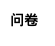
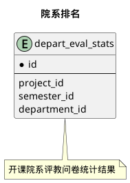
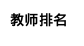



#### 目 录

##### 1. 数据库对象列表
  * [1.1 表格一览](index.html#表格一览)
  * [1.2 模块关系图](index.html#模块关系图)

##### 2. 具体模块明细

### 表格一览
Schema qos.evaluation下共计0个表，分别如下:

<table class="table table-bordered table-striped table-condensed">
  <tr>
    <th class="info_header text-center">序号</th>
    <th class="info_header">表名/描述</th>
    <th class="info_header text-center">序号</th>
    <th class="info_header">表名/描述</th>
  </tr>
</table>

### 模块关系图

#### 1. 问卷
  * 关系图

#### 2. 问卷
  * 关系图

#### 3. 评教明细
  * 关系图

#### 4. 全校排名
  * 关系图

#### 5. 院系排名
  * 关系图

#### 6. 教师排名
  * 关系图

#### 7. 教师课程排名
  * 关系图

