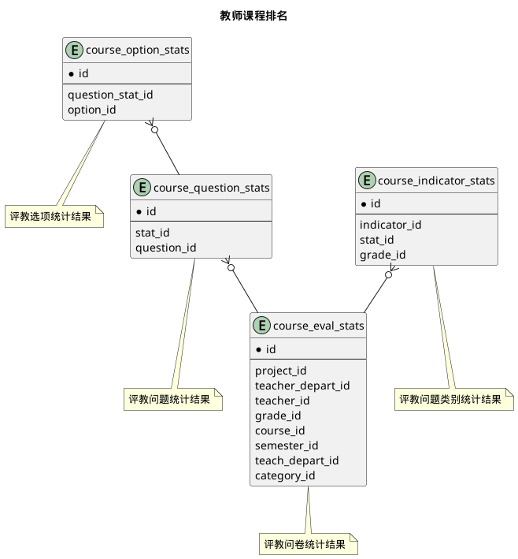



#### 目 录

##### 1. 数据库对象列表
  * [1.1 表格一览](index.html#表格一览)
  * [1.2 模块关系图](index.html#模块关系图)

##### 2. 具体模块明细
* [2.1 问卷](questionnaires.html)
* [2.2 评教明细](detail_results.html)
* [2.3 全校排名](college_results.html)
* [2.4 院系排名](depart_results.html)
* [2.5 教师排名](teacher_results.html)
* [2.6 教师课程排名](course_results.html)
* [2.7 其他](misc.html)

### 表格一览
数据库共计35个表，分别如下:

<table class="table table-bordered table-striped table-condensed">
  <tr>
    <th style="background-color:#D0D3FF">序号</th>
    <th style="background-color:#D0D3FF">表名/描述</th>
    <th style="background-color:#D0D3FF">序号</th>
    <th style="background-color:#D0D3FF">表名/描述</th>
  </tr>
  <tr>
    <td>1</td>
    <td><a href="misc.html#表格-clazz_eval_stats-任务评教问卷统计结果">clazz_eval_stats</a> 任务评教问卷统计结果</td>
    <td>19</td>
    <td><a href="detail_results.html#表格-question_results-问题评教结果">question_results</a> 问题评教结果</td>
  </tr>
  <tr>
    <td>2</td>
    <td><a href="misc.html#表格-clazz_option_stats-任务评教选项统计结果">clazz_option_stats</a> 任务评教选项统计结果</td>
    <td>20</td>
    <td><a href="questionnaires.html#表格-question_types-问题类型">question_types</a> 问题类型</td>
  </tr>
  <tr>
    <td>3</td>
    <td><a href="misc.html#表格-clazz_question_stats-任务评教问题统计结果">clazz_question_stats</a> 任务评教问题统计结果</td>
    <td>21</td>
    <td><a href="misc.html#表格-questionnaire_clazzes-教学任务问卷配置">questionnaire_clazzes</a> 教学任务问卷配置</td>
  </tr>
  <tr>
    <td>4</td>
    <td><a href="misc.html#表格-clazz_question_type_stats-任务评教问题类别统计结果">clazz_question_type_stats</a> 任务评教问题类别统计结果</td>
    <td>22</td>
    <td><a href="questionnaires.html#表格-questionnaires-评教问卷">questionnaires</a> 评教问卷</td>
  </tr>
  <tr>
    <td>5</td>
    <td><a href="course_results.html#表格-course_eval_stats-课程评教问卷统计结果">course_eval_stats</a> 课程评教问卷统计结果</td>
    <td>23</td>
    <td><a href="questionnaires.html#表格-questionnaires_questions-相关联的问题">questionnaires_questions</a> 相关联的问题</td>
  </tr>
  <tr>
    <td>6</td>
    <td><a href="course_results.html#表格-course_option_stats-课程评教选项统计结果">course_option_stats</a> 课程评教选项统计结果</td>
    <td>24</td>
    <td><a href="questionnaires.html#表格-questions-评教问题">questions</a> 评教问题</td>
  </tr>
  <tr>
    <td>7</td>
    <td><a href="course_results.html#表格-course_question_stats-课程评教问题统计结果">course_question_stats</a> 课程评教问题统计结果</td>
    <td>25</td>
    <td><a href="college_results.html#表格-school_eval_stats-学校评教问卷统计结果">school_eval_stats</a> 学校评教问卷统计结果</td>
  </tr>
  <tr>
    <td>8</td>
    <td><a href="course_results.html#表格-course_question_type_stats-课程评教问题类别统计结果">course_question_type_stats</a> 课程评教问题类别统计结果</td>
    <td>26</td>
    <td><a href="college_results.html#表格-school_option_stats-学校评教选项统计结果">school_option_stats</a> 学校评教选项统计结果</td>
  </tr>
  <tr>
    <td>9</td>
    <td><a href="depart_results.html#表格-depart_eval_stats-开课院系评教问卷统计结果">depart_eval_stats</a> 开课院系评教问卷统计结果</td>
    <td>27</td>
    <td><a href="college_results.html#表格-school_question_stats-学校评教问题统计结果">school_question_stats</a> 学校评教问题统计结果</td>
  </tr>
  <tr>
    <td>10</td>
    <td><a href="depart_results.html#表格-depart_option_stats-开课院系评教选项统计结果">depart_option_stats</a> 开课院系评教选项统计结果</td>
    <td>28</td>
    <td><a href="college_results.html#表格-school_question_type_stats-学校评教问题类别统计结果">school_question_type_stats</a> 学校评教问题类别统计结果</td>
  </tr>
  <tr>
    <td>11</td>
    <td><a href="depart_results.html#表格-depart_question_stats-开课院系评教问题统计结果">depart_question_stats</a> 开课院系评教问题统计结果</td>
    <td>29</td>
    <td><a href="teacher_results.html#表格-teacher_eval_stats-教师评教问卷统计结果">teacher_eval_stats</a> 教师评教问卷统计结果</td>
  </tr>
  <tr>
    <td>12</td>
    <td><a href="depart_results.html#表格-depart_question_type_stats-开课院系评教问题类别统计结果">depart_question_type_stats</a> 开课院系评教问题类别统计结果</td>
    <td>30</td>
    <td><a href="teacher_results.html#表格-teacher_option_stats-教师评教选项统计结果">teacher_option_stats</a> 教师评教选项统计结果</td>
  </tr>
  <tr>
    <td>13</td>
    <td><a href="detail_results.html#表格-evaluate_results-问卷评教结果">evaluate_results</a> 问卷评教结果</td>
    <td>31</td>
    <td><a href="teacher_results.html#表格-teacher_question_stats-教师评教问题统计结果">teacher_question_stats</a> 教师评教问题统计结果</td>
  </tr>
  <tr>
    <td>14</td>
    <td><a href="misc.html#表格-evaluation_criteria_items-评价名称对应项">evaluation_criteria_items</a> 评价名称对应项</td>
    <td>32</td>
    <td><a href="teacher_results.html#表格-teacher_question_type_stats-教师评教问题类别统计结果">teacher_question_type_stats</a> 教师评教问题类别统计结果</td>
  </tr>
  <tr>
    <td>15</td>
    <td><a href="misc.html#表格-evaluation_criterias-评教对照标准">evaluation_criterias</a> 评教对照标准</td>
    <td>33</td>
    <td><a href="teacher_results.html#表格-teacher_remessages-教师回复">teacher_remessages</a> 教师回复</td>
  </tr>
  <tr>
    <td>16</td>
    <td><a href="misc.html#表格-final_teacher_scores-教师评教总分">final_teacher_scores</a> 教师评教总分</td>
    <td>34</td>
    <td><a href="teacher_results.html#表格-teacher_remessages_students-学生列表">teacher_remessages_students</a> 学生列表</td>
  </tr>
  <tr>
    <td>17</td>
    <td><a href="questionnaires.html#表格-option_groups-选项组">option_groups</a> 选项组</td>
    <td>35</td>
    <td><a href="misc.html#表格-text_evaluations-开放式文字评教">text_evaluations</a> 开放式文字评教</td>
  </tr>
  <tr>
    <td>18</td>
    <td><a href="questionnaires.html#表格-options-选项">options</a> 选项</td>
    <td></td>
    <td></td>
  </tr>
</table>

### 模块关系图

#### 1. 问卷
  * 关系图

#### 2. 问卷
  * 关系图

#### 3. 评教明细
  * 关系图

#### 4. 全校排名
  * 关系图

#### 5. 院系排名
  * 关系图

#### 6. 教师排名
  * 关系图

#### 7. 教师课程排名
  * 关系图

