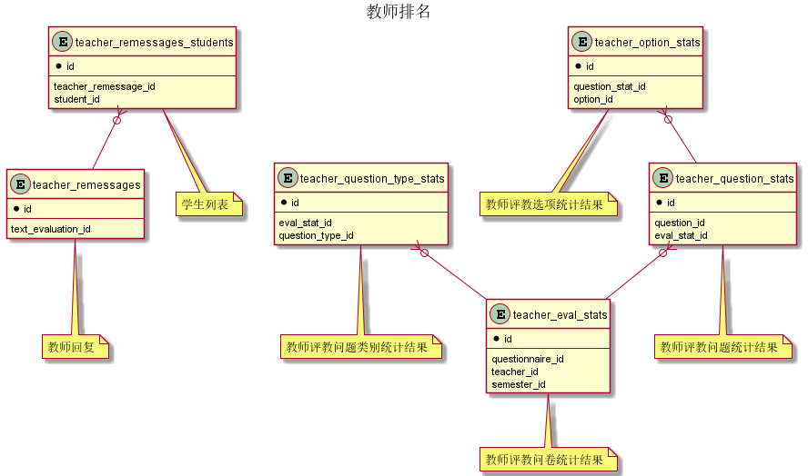


 目  录

* toc
{:toc}

### 关系图 1. 教师排名
  * 关系图

### 表格 teacher_eval_stats 教师评教问卷统计结果

  * 表格说明

<table class="table table-bordered table-striped table-condensed">
<tr><th style="background-color:#D0D3FF">表名</th><th style="background-color:#D0D3FF">主键</th><th style="background-color:#D0D3FF">注释</th>  </tr>
<tr><td>teacher_eval_stats</td><td>id</td><td>教师评教问卷统计结果</td>  </tr>
</table>

  * 表格中的列

<table class="table table-bordered table-striped table-condensed">
<tr><th style="background-color:#D0D3FF" class="text-center">序号</th><th style="background-color:#D0D3FF">字段名</th><th style="background-color:#D0D3FF">字段类型</th><th style="background-color:#D0D3FF" class="text-center">是否可空</th><th style="background-color:#D0D3FF">描述</th><th style="background-color:#D0D3FF">引用表</th>  </tr>
<tr><td class="text-center">1</td><td>id</td><td>bigint</td><td class="text-center">否</td><td>非业务主键:datetime</td><td></td>  </tr>
<tr><td class="text-center">2</td><td>add_score</td><td>float8</td><td class="text-center">否</td><td>附加题总分</td><td></td>  </tr>
<tr><td class="text-center">3</td><td>avg_score</td><td>float4</td><td class="text-center">否</td><td>平均得分</td><td></td>  </tr>
<tr><td class="text-center">4</td><td>depart_rank</td><td>integer</td><td class="text-center">否</td><td>院系排名</td><td></td>  </tr>
<tr><td class="text-center">5</td><td>published</td><td>boolean</td><td class="text-center">否</td><td>是否发布</td><td></td>  </tr>
<tr><td class="text-center">6</td><td>questionnaire_id</td><td>bigint</td><td class="text-center">否</td><td>问卷ID</td><td>           <a href="/model/qos/evaluation/questionnaires.html#表格-questionnaires-评教问卷">qos.questionnaires</a>
</td>  </tr>
<tr><td class="text-center">7</td><td>school_rank</td><td>integer</td><td class="text-center">否</td><td>全校排名</td><td></td>  </tr>
<tr><td class="text-center">8</td><td>semester_id</td><td>integer</td><td class="text-center">否</td><td>教学日历ID</td><td>           <a href="/model/base/edu/misc.html#表格-semesters-学年学期">base.semesters</a>
</td>  </tr>
<tr><td class="text-center">9</td><td>stat_at</td><td>timestamp</td><td class="text-center">否</td><td>统计时间</td><td></td>  </tr>
<tr><td class="text-center">10</td><td>teacher_id</td><td>bigint</td><td class="text-center">否</td><td>教师ID</td><td>           <a href="/model/base/edu/core.html#表格-teachers-教师信息">base.teachers</a>
</td>  </tr>
<tr><td class="text-center">11</td><td>tickets</td><td>integer</td><td class="text-center">否</td><td>有效票数</td><td></td>  </tr>
<tr><td class="text-center">12</td><td>total_score</td><td>float4</td><td class="text-center">否</td><td>总得分</td><td></td>  </tr>
<tr><td class="text-center">13</td><td>total_tickets</td><td>integer</td><td class="text-center">否</td><td>所有样本</td><td></td>  </tr>
</table>

### 表格 teacher_option_stats 教师评教选项统计结果

  * 表格说明

<table class="table table-bordered table-striped table-condensed">
<tr><th style="background-color:#D0D3FF">表名</th><th style="background-color:#D0D3FF">主键</th><th style="background-color:#D0D3FF">注释</th>  </tr>
<tr><td>teacher_option_stats</td><td>id</td><td>教师评教选项统计结果</td>  </tr>
</table>

  * 表格中的列

<table class="table table-bordered table-striped table-condensed">
<tr><th style="background-color:#D0D3FF" class="text-center">序号</th><th style="background-color:#D0D3FF">字段名</th><th style="background-color:#D0D3FF">字段类型</th><th style="background-color:#D0D3FF" class="text-center">是否可空</th><th style="background-color:#D0D3FF">描述</th><th style="background-color:#D0D3FF">引用表</th>  </tr>
<tr><td class="text-center">1</td><td>id</td><td>bigint</td><td class="text-center">否</td><td>非业务主键:datetime</td><td></td>  </tr>
<tr><td class="text-center">2</td><td>amount</td><td>integer</td><td class="text-center">否</td><td>人数</td><td></td>  </tr>
<tr><td class="text-center">3</td><td>option_id</td><td>bigint</td><td class="text-center">否</td><td>选项ID</td><td>           <a href="/model/qos/evaluation/questionnaires.html#表格-options-选项">qos.options</a>
</td>  </tr>
<tr><td class="text-center">4</td><td>question_stat_id</td><td>bigint</td><td class="text-center">否</td><td>问题统计明细ID</td><td>           <a href="/model/qos/evaluation/teacher_results.html#表格-teacher_question_stats-教师评教问题统计结果">qos.teacher_question_stats</a>
</td>  </tr>
</table>

  * 表格的索引

<table class="table table-bordered table-striped table-condensed">
  <tr>
<th style="background-color:#D0D3FF">索引名</th><th style="background-color:#D0D3FF">索引字段</th><th style="background-color:#D0D3FF">是否唯一</th>  </tr>
<tr><td>idx_ojgk4b0hl2ks2hgw2l11ktdr9</td><td>question_stat_id</td><td>否</td>  </tr>
</table>

### 表格 teacher_question_stats 教师评教问题统计结果

  * 表格说明

<table class="table table-bordered table-striped table-condensed">
<tr><th style="background-color:#D0D3FF">表名</th><th style="background-color:#D0D3FF">主键</th><th style="background-color:#D0D3FF">注释</th>  </tr>
<tr><td>teacher_question_stats</td><td>id</td><td>教师评教问题统计结果</td>  </tr>
</table>

  * 表格中的列

<table class="table table-bordered table-striped table-condensed">
<tr><th style="background-color:#D0D3FF" class="text-center">序号</th><th style="background-color:#D0D3FF">字段名</th><th style="background-color:#D0D3FF">字段类型</th><th style="background-color:#D0D3FF" class="text-center">是否可空</th><th style="background-color:#D0D3FF">描述</th><th style="background-color:#D0D3FF">引用表</th>  </tr>
<tr><td class="text-center">1</td><td>id</td><td>bigint</td><td class="text-center">否</td><td>非业务主键:datetime</td><td></td>  </tr>
<tr><td class="text-center">2</td><td>avg_score</td><td>float8</td><td class="text-center">否</td><td>平均得分</td><td></td>  </tr>
<tr><td class="text-center">3</td><td>eval_stat_id</td><td>bigint</td><td class="text-center">否</td><td>问卷统计ID</td><td>           <a href="/model/qos/evaluation/teacher_results.html#表格-teacher_eval_stats-教师评教问卷统计结果">qos.teacher_eval_stats</a>
</td>  </tr>
<tr><td class="text-center">4</td><td>question_id</td><td>bigint</td><td class="text-center">否</td><td>具体问题ID</td><td>           <a href="/model/qos/evaluation/questionnaires.html#表格-questions-评教问题">qos.questions</a>
</td>  </tr>
<tr><td class="text-center">5</td><td>stddev</td><td>float8</td><td class="text-center">否</td><td>标准差</td><td></td>  </tr>
<tr><td class="text-center">6</td><td>total_score</td><td>float8</td><td class="text-center">否</td><td>总得分</td><td></td>  </tr>
</table>

  * 表格的索引

<table class="table table-bordered table-striped table-condensed">
  <tr>
<th style="background-color:#D0D3FF">索引名</th><th style="background-color:#D0D3FF">索引字段</th><th style="background-color:#D0D3FF">是否唯一</th>  </tr>
<tr><td>idx_7lykycmfk7vttwxwqw2hpr565</td><td>eval_stat_id</td><td>否</td>  </tr>
</table>

### 表格 teacher_question_type_stats 教师评教问题类别统计结果

  * 表格说明

<table class="table table-bordered table-striped table-condensed">
<tr><th style="background-color:#D0D3FF">表名</th><th style="background-color:#D0D3FF">主键</th><th style="background-color:#D0D3FF">注释</th>  </tr>
<tr><td>teacher_question_type_stats</td><td>id</td><td>教师评教问题类别统计结果</td>  </tr>
</table>

  * 表格中的列

<table class="table table-bordered table-striped table-condensed">
<tr><th style="background-color:#D0D3FF" class="text-center">序号</th><th style="background-color:#D0D3FF">字段名</th><th style="background-color:#D0D3FF">字段类型</th><th style="background-color:#D0D3FF" class="text-center">是否可空</th><th style="background-color:#D0D3FF">描述</th><th style="background-color:#D0D3FF">引用表</th>  </tr>
<tr><td class="text-center">1</td><td>id</td><td>bigint</td><td class="text-center">否</td><td>非业务主键:datetime</td><td></td>  </tr>
<tr><td class="text-center">2</td><td>avg_score</td><td>float4</td><td class="text-center">否</td><td>问题类别统计平均分值</td><td></td>  </tr>
<tr><td class="text-center">3</td><td>eval_stat_id</td><td>bigint</td><td class="text-center">否</td><td>问卷评教结果ID</td><td>           <a href="/model/qos/evaluation/teacher_results.html#表格-teacher_eval_stats-教师评教问卷统计结果">qos.teacher_eval_stats</a>
</td>  </tr>
<tr><td class="text-center">4</td><td>question_type_id</td><td>bigint</td><td class="text-center">否</td><td>问题类别ID</td><td>           <a href="/model/qos/evaluation/questionnaires.html#表格-question_types-问题类型">qos.question_types</a>
</td>  </tr>
<tr><td class="text-center">5</td><td>total_score</td><td>float4</td><td class="text-center">否</td><td>问题类别统计总分值</td><td></td>  </tr>
</table>

  * 表格的索引

<table class="table table-bordered table-striped table-condensed">
  <tr>
<th style="background-color:#D0D3FF">索引名</th><th style="background-color:#D0D3FF">索引字段</th><th style="background-color:#D0D3FF">是否唯一</th>  </tr>
<tr><td>idx_9d7epkerdh0q4rrvvjrn7epth</td><td>eval_stat_id</td><td>否</td>  </tr>
</table>

### 表格 teacher_remessages 教师回复

  * 表格说明

<table class="table table-bordered table-striped table-condensed">
<tr><th style="background-color:#D0D3FF">表名</th><th style="background-color:#D0D3FF">主键</th><th style="background-color:#D0D3FF">注释</th>  </tr>
<tr><td>teacher_remessages</td><td>id</td><td>教师回复</td>  </tr>
</table>

  * 表格中的列

<table class="table table-bordered table-striped table-condensed">
<tr><th style="background-color:#D0D3FF" class="text-center">序号</th><th style="background-color:#D0D3FF">字段名</th><th style="background-color:#D0D3FF">字段类型</th><th style="background-color:#D0D3FF" class="text-center">是否可空</th><th style="background-color:#D0D3FF">描述</th><th style="background-color:#D0D3FF">引用表</th>  </tr>
<tr><td class="text-center">1</td><td>id</td><td>bigint</td><td class="text-center">否</td><td>非业务主键:datetime</td><td></td>  </tr>
<tr><td class="text-center">2</td><td>created_at</td><td>timestamp</td><td class="text-center">否</td><td>创建时间</td><td></td>  </tr>
<tr><td class="text-center">3</td><td>remessage</td><td>varchar(255)</td><td class="text-center">否</td><td>回复内容</td><td></td>  </tr>
<tr><td class="text-center">4</td><td>text_evaluation_id</td><td>bigint</td><td class="text-center">否</td><td>文字评教ID</td><td>           <a href="/model/qos/evaluation/misc.html#表格-text_evaluations-开放式文字评教">qos.text_evaluations</a>
</td>  </tr>
<tr><td class="text-center">5</td><td>updated_at</td><td>timestamp</td><td class="text-center">否</td><td>更新时间</td><td></td>  </tr>
<tr><td class="text-center">6</td><td>visible</td><td>boolean</td><td class="text-center">否</td><td>是否可见</td><td></td>  </tr>
</table>

  * 表格的索引

<table class="table table-bordered table-striped table-condensed">
  <tr>
<th style="background-color:#D0D3FF">索引名</th><th style="background-color:#D0D3FF">索引字段</th><th style="background-color:#D0D3FF">是否唯一</th>  </tr>
<tr><td>idx_8s9ak6mlyl39u6hp8j4ysbkel</td><td>text_evaluation_id</td><td>否</td>  </tr>
</table>

### 表格 teacher_remessages_students 学生列表

  * 表格说明

<table class="table table-bordered table-striped table-condensed">
<tr><th style="background-color:#D0D3FF">表名</th><th style="background-color:#D0D3FF">主键</th><th style="background-color:#D0D3FF">注释</th>  </tr>
<tr><td>teacher_remessages_students</td><td>teacher_remessage_id,student_id</td><td>学生列表</td>  </tr>
</table>

  * 表格中的列

<table class="table table-bordered table-striped table-condensed">
<tr><th style="background-color:#D0D3FF" class="text-center">序号</th><th style="background-color:#D0D3FF">字段名</th><th style="background-color:#D0D3FF">字段类型</th><th style="background-color:#D0D3FF" class="text-center">是否可空</th><th style="background-color:#D0D3FF">描述</th><th style="background-color:#D0D3FF">引用表</th>  </tr>
<tr><td class="text-center">1</td><td>student_id</td><td>bigint</td><td class="text-center">否</td><td>学籍信息实现ID</td><td>           <a href="/model/base/edu/core.html#表格-students-学籍信息实现">base.students</a>
</td>  </tr>
<tr><td class="text-center">2</td><td>teacher_remessage_id</td><td>bigint</td><td class="text-center">否</td><td>教师回复ID</td><td>           <a href="/model/qos/evaluation/teacher_results.html#表格-teacher_remessages-教师回复">qos.teacher_remessages</a>
</td>  </tr>
</table>

  * 表格的索引

<table class="table table-bordered table-striped table-condensed">
  <tr>
<th style="background-color:#D0D3FF">索引名</th><th style="background-color:#D0D3FF">索引字段</th><th style="background-color:#D0D3FF">是否唯一</th>  </tr>
<tr><td>idx_gavh43lg9nulgrwrywxh9o76u</td><td>teacher_remessage_id</td><td>否</td>  </tr>
</table>
