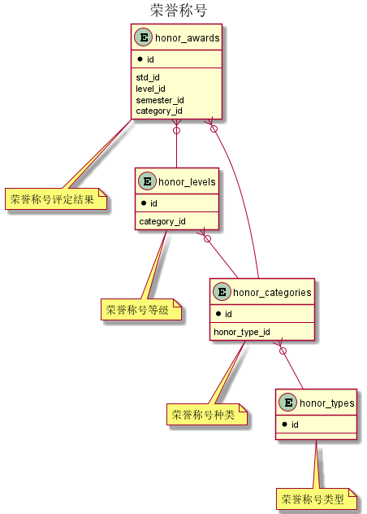


 目  录

* toc
{:toc}

### 关系图 1. 荣誉称号
  * 关系图

### 表格 honor_awards 荣誉称号评定结果

  * 表格说明

<table class="table table-bordered table-striped table-condensed">
<tr><th style="background-color:#D0D3FF">表名</th><th style="background-color:#D0D3FF">主键</th><th style="background-color:#D0D3FF">注释</th>  </tr>
<tr><td>honor_awards</td><td>id</td><td>荣誉称号评定结果</td>  </tr>
</table>

  * 表格中的列

<table class="table table-bordered table-striped table-condensed">
<tr><th style="background-color:#D0D3FF" class="text-center">序号</th><th style="background-color:#D0D3FF">字段名</th><th style="background-color:#D0D3FF">字段类型</th><th style="background-color:#D0D3FF" class="text-center">是否可空</th><th style="background-color:#D0D3FF">描述</th><th style="background-color:#D0D3FF">引用表</th>  </tr>
<tr><td class="text-center">1</td><td>id</td><td>bigint</td><td class="text-center">否</td><td>非业务主键:datetime</td><td></td>  </tr>
<tr><td class="text-center">2</td><td>amount</td><td>integer</td><td class="text-center">否</td><td>金额</td><td></td>  </tr>
<tr><td class="text-center">3</td><td>approved</td><td>boolean</td><td class="text-center">否</td><td>是否审核通过</td><td></td>  </tr>
<tr><td class="text-center">4</td><td>category_id</td><td>integer</td><td class="text-center">否</td><td>荣誉称号种类ID</td><td>std.honor_categories</td>  </tr>
<tr><td class="text-center">5</td><td>level_id</td><td>integer</td><td class="text-center">否</td><td>获奖等级ID</td><td>std.honor_levels</td>  </tr>
<tr><td class="text-center">6</td><td>semester_id</td><td>integer</td><td class="text-center">否</td><td>评定学期ID</td><td>base.semesters</td>  </tr>
<tr><td class="text-center">7</td><td>std_id</td><td>bigint</td><td class="text-center">否</td><td>学生ID</td><td>base.students</td>  </tr>
</table>

### 表格 honor_categories 荣誉称号种类

  * 表格说明

<table class="table table-bordered table-striped table-condensed">
<tr><th style="background-color:#D0D3FF">表名</th><th style="background-color:#D0D3FF">主键</th><th style="background-color:#D0D3FF">注释</th>  </tr>
<tr><td>honor_categories</td><td>id</td><td>荣誉称号种类</td>  </tr>
</table>

  * 表格中的列

<table class="table table-bordered table-striped table-condensed">
<tr><th style="background-color:#D0D3FF" class="text-center">序号</th><th style="background-color:#D0D3FF">字段名</th><th style="background-color:#D0D3FF">字段类型</th><th style="background-color:#D0D3FF" class="text-center">是否可空</th><th style="background-color:#D0D3FF">描述</th><th style="background-color:#D0D3FF">引用表</th>  </tr>
<tr><td class="text-center">1</td><td>id</td><td>integer</td><td class="text-center">否</td><td>非业务主键:auto_increment</td><td></td>  </tr>
<tr><td class="text-center">2</td><td>assess_period</td><td>varchar(255)</td><td class="text-center">否</td><td>评定周期</td><td></td>  </tr>
<tr><td class="text-center">3</td><td>award_unit</td><td>varchar(255)</td><td class="text-center">否</td><td>颁奖单位</td><td></td>  </tr>
<tr><td class="text-center">4</td><td>code</td><td>varchar(255)</td><td class="text-center">否</td><td>荣誉称号代码</td><td></td>  </tr>
<tr><td class="text-center">5</td><td>discription</td><td>varchar(255)</td><td class="text-center">是</td><td>荣誉称号描述</td><td></td>  </tr>
<tr><td class="text-center">6</td><td>enabled</td><td>boolean</td><td class="text-center">否</td><td>使用状态</td><td></td>  </tr>
<tr><td class="text-center">7</td><td>honor_type_id</td><td>integer</td><td class="text-center">否</td><td>荣誉称号类型ID</td><td>std.honor_types</td>  </tr>
<tr><td class="text-center">8</td><td>name</td><td>varchar(255)</td><td class="text-center">否</td><td>荣誉称号名称</td><td></td>  </tr>
<tr><td class="text-center">9</td><td>rated</td><td>boolean</td><td class="text-center">否</td><td>是否分等级</td><td></td>  </tr>
</table>

### 表格 honor_levels 荣誉称号等级

  * 表格说明

<table class="table table-bordered table-striped table-condensed">
<tr><th style="background-color:#D0D3FF">表名</th><th style="background-color:#D0D3FF">主键</th><th style="background-color:#D0D3FF">注释</th>  </tr>
<tr><td>honor_levels</td><td>id</td><td>荣誉称号等级</td>  </tr>
</table>

  * 表格中的列

<table class="table table-bordered table-striped table-condensed">
<tr><th style="background-color:#D0D3FF" class="text-center">序号</th><th style="background-color:#D0D3FF">字段名</th><th style="background-color:#D0D3FF">字段类型</th><th style="background-color:#D0D3FF" class="text-center">是否可空</th><th style="background-color:#D0D3FF">描述</th><th style="background-color:#D0D3FF">引用表</th>  </tr>
<tr><td class="text-center">1</td><td>id</td><td>integer</td><td class="text-center">否</td><td>非业务主键:auto_increment</td><td></td>  </tr>
<tr><td class="text-center">2</td><td>amount</td><td>integer</td><td class="text-center">否</td><td>奖励金额</td><td></td>  </tr>
<tr><td class="text-center">3</td><td>category_id</td><td>integer</td><td class="text-center">否</td><td>荣誉称号种类ID</td><td>std.honor_categories</td>  </tr>
<tr><td class="text-center">4</td><td>code</td><td>varchar(255)</td><td class="text-center">否</td><td>等级代码</td><td></td>  </tr>
<tr><td class="text-center">5</td><td>discription</td><td>varchar(255)</td><td class="text-center">是</td><td>等级描述</td><td></td>  </tr>
<tr><td class="text-center">6</td><td>enabled</td><td>boolean</td><td class="text-center">否</td><td>使用状态</td><td></td>  </tr>
<tr><td class="text-center">7</td><td>name</td><td>varchar(255)</td><td class="text-center">否</td><td>等级名称</td><td></td>  </tr>
</table>

### 表格 honor_types 荣誉称号类型

  * 表格说明

<table class="table table-bordered table-striped table-condensed">
<tr><th style="background-color:#D0D3FF">表名</th><th style="background-color:#D0D3FF">主键</th><th style="background-color:#D0D3FF">注释</th>  </tr>
<tr><td>honor_types</td><td>id</td><td>荣誉称号类型</td>  </tr>
</table>

  * 表格中的列

<table class="table table-bordered table-striped table-condensed">
<tr><th style="background-color:#D0D3FF" class="text-center">序号</th><th style="background-color:#D0D3FF">字段名</th><th style="background-color:#D0D3FF">字段类型</th><th style="background-color:#D0D3FF" class="text-center">是否可空</th><th style="background-color:#D0D3FF">描述</th><th style="background-color:#D0D3FF">引用表</th>  </tr>
<tr><td class="text-center">1</td><td>id</td><td>integer</td><td class="text-center">否</td><td>非业务主键:auto_increment</td><td></td>  </tr>
<tr><td class="text-center">2</td><td>code</td><td>varchar(255)</td><td class="text-center">否</td><td>类型代码</td><td></td>  </tr>
<tr><td class="text-center">3</td><td>enabled</td><td>boolean</td><td class="text-center">否</td><td>使用状态</td><td></td>  </tr>
<tr><td class="text-center">4</td><td>idx</td><td>varchar(255)</td><td class="text-center">否</td><td>排序序号</td><td></td>  </tr>
<tr><td class="text-center">5</td><td>name</td><td>varchar(255)</td><td class="text-center">否</td><td>类型名称</td><td></td>  </tr>
</table>

