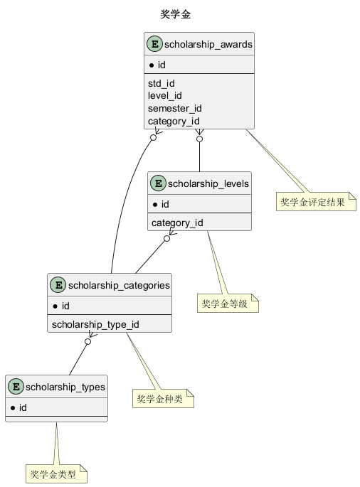
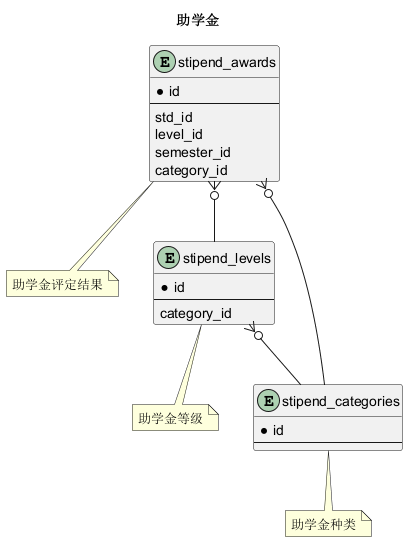
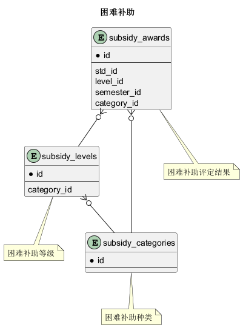
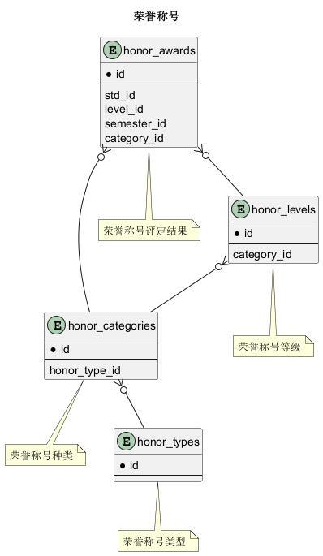

# 学籍管理 评奖评优 表结构

## 表格一览

<table class="table-mini">
  <thead>
    <tr>
      <th class="info_header text-center" width="7%">序号</th>
      <th class="info_header" width="43%">表名/描述</th>
      <th class="info_header text-center" width="7%">序号</th>
      <th class="info_header" width="43%">表名/描述</th>
    </tr>
  </thead>
  <tbody>
    <tr>
      <td class="text-center">1</td>
      <td><a href="/model/std/award.html#honor-awards">honor_awards</a> 荣誉称号评定结果</td>
      <td class="text-center">9</td>
      <td><a href="/model/std/award.html#scholarship-types">scholarship_types</a> 奖学金类型</td>
    </tr>
    <tr>
      <td class="text-center">2</td>
      <td><a href="/model/std/award.html#honor-categories">honor_categories</a> 荣誉称号种类</td>
      <td class="text-center">10</td>
      <td><a href="/model/std/award.html#stipend-awards">stipend_awards</a> 助学金评定结果</td>
    </tr>
    <tr>
      <td class="text-center">3</td>
      <td><a href="/model/std/award.html#honor-levels">honor_levels</a> 荣誉称号等级</td>
      <td class="text-center">11</td>
      <td><a href="/model/std/award.html#stipend-categories">stipend_categories</a> 助学金种类</td>
    </tr>
    <tr>
      <td class="text-center">4</td>
      <td><a href="/model/std/award.html#honor-types">honor_types</a> 荣誉称号类型</td>
      <td class="text-center">12</td>
      <td><a href="/model/std/award.html#stipend-levels">stipend_levels</a> 助学金等级</td>
    </tr>
    <tr>
      <td class="text-center">5</td>
      <td><a href="/model/std/award.html#punishments">punishments</a> 处分</td>
      <td class="text-center">13</td>
      <td><a href="/model/std/award.html#subsidy-awards">subsidy_awards</a> 困难补助评定结果</td>
    </tr>
    <tr>
      <td class="text-center">6</td>
      <td><a href="/model/std/award.html#scholarship-awards">scholarship_awards</a> 奖学金评定结果</td>
      <td class="text-center">14</td>
      <td><a href="/model/std/award.html#subsidy-categories">subsidy_categories</a> 困难补助种类</td>
    </tr>
    <tr>
      <td class="text-center">7</td>
      <td><a href="/model/std/award.html#scholarship-categories">scholarship_categories</a> 奖学金种类</td>
      <td class="text-center">15</td>
      <td><a href="/model/std/award.html#subsidy-levels">subsidy_levels</a> 困难补助等级</td>
    </tr>
    <tr>
      <td class="text-center">8</td>
      <td><a href="/model/std/award.html#scholarship-levels">scholarship_levels</a> 奖学金等级</td>
      <td></td>
      <td></td>
    </tr>
  </tbody>
</table>

## 关键关系图

### 关系图 1. 奖学金
  * 关系图

### 关系图 2. 助学金
  * 关系图

### 关系图 3. 困难补助
  * 关系图

### 关系图 4. 荣誉称号
  * 关系图

## 表格明细

## honor_awards

<table class="table-entity">
  <tbody>
    <tr>
      <td class="table-entity-title" width="15%">表名:&nbsp;</td>
      <td>std.honor_awards 荣誉称号评定结果</td>
    </tr>
    <tr>
      <td class="table-entity-title">唯一约束:&nbsp;</td>
      <td>主键🔑(id) </td>
    </tr>
  </tbody>
</table>

<table class="table-entity">
  <thead>
    <tr>
<th class="info_header text-center" width="7%">序号</th><th class="info_header" width="20%">字段名</th><th class="info_header" width="20%">字段类型</th><th class="info_header text-center" width="8%">是否可空</th><th class="info_header" width="25%">描述</th><th class="info_header" width="20%">引用表</th>    </tr>
  </thead>
  <tbody>
    <tr>
      <td class="text-center">1</td>
      <td>id</td>
      <td>bigint</td>
      <td class="text-center">否</td>
      <td>非业务主键:datetime</td>
      <td>      </td>
    </tr>
    <tr>
      <td class="text-center">2</td>
      <td>amount</td>
      <td>integer</td>
      <td class="text-center">否</td>
      <td>金额</td>
      <td>      </td>
    </tr>
    <tr>
      <td class="text-center">3</td>
      <td>approved</td>
      <td>boolean</td>
      <td class="text-center">否</td>
      <td>是否审核通过</td>
      <td>      </td>
    </tr>
    <tr>
      <td class="text-center">4</td>
      <td>category_id</td>
      <td>integer</td>
      <td class="text-center">否</td>
      <td>荣誉称号种类ID</td>
      <td><a href="/model/std/award.html#honor-categories">std.honor_categories</a>      </td>
    </tr>
    <tr>
      <td class="text-center">5</td>
      <td>level_id</td>
      <td>integer</td>
      <td class="text-center">否</td>
      <td>获奖等级ID</td>
      <td><a href="/model/std/award.html#honor-levels">std.honor_levels</a>      </td>
    </tr>
    <tr>
      <td class="text-center">6</td>
      <td>semester_id</td>
      <td>integer</td>
      <td class="text-center">否</td>
      <td>评定学期ID</td>
      <td><a href="/model/base/time.html#semesters">base.semesters</a>      </td>
    </tr>
    <tr>
      <td class="text-center">7</td>
      <td>std_id</td>
      <td>bigint</td>
      <td class="text-center">否</td>
      <td>学生ID</td>
      <td><a href="/model/base/edu.html#students">base.students</a>      </td>
    </tr>
  </tbody>
</table>

## honor_categories

<table class="table-entity">
  <tbody>
    <tr>
      <td class="table-entity-title" width="15%">表名:&nbsp;</td>
      <td>std.honor_categories 荣誉称号种类</td>
    </tr>
    <tr>
      <td class="table-entity-title">唯一约束:&nbsp;</td>
      <td>主键🔑(id) </td>
    </tr>
  </tbody>
</table>

<table class="table-entity">
  <thead>
    <tr>
<th class="info_header text-center" width="7%">序号</th><th class="info_header" width="20%">字段名</th><th class="info_header" width="20%">字段类型</th><th class="info_header text-center" width="8%">是否可空</th><th class="info_header" width="25%">描述</th><th class="info_header" width="20%">引用表</th>    </tr>
  </thead>
  <tbody>
    <tr>
      <td class="text-center">1</td>
      <td>id</td>
      <td>integer</td>
      <td class="text-center">否</td>
      <td>非业务主键:auto_increment</td>
      <td>      </td>
    </tr>
    <tr>
      <td class="text-center">2</td>
      <td>assess_period</td>
      <td>varchar(255)</td>
      <td class="text-center">否</td>
      <td>评定周期</td>
      <td>      </td>
    </tr>
    <tr>
      <td class="text-center">3</td>
      <td>award_unit</td>
      <td>varchar(255)</td>
      <td class="text-center">否</td>
      <td>颁奖单位</td>
      <td>      </td>
    </tr>
    <tr>
      <td class="text-center">4</td>
      <td>code</td>
      <td>varchar(255)</td>
      <td class="text-center">否</td>
      <td>荣誉称号代码</td>
      <td>      </td>
    </tr>
    <tr>
      <td class="text-center">5</td>
      <td>description</td>
      <td>varchar(255)</td>
      <td class="text-center">是</td>
      <td>荣誉称号描述</td>
      <td>      </td>
    </tr>
    <tr>
      <td class="text-center">6</td>
      <td>enabled</td>
      <td>boolean</td>
      <td class="text-center">否</td>
      <td>使用状态</td>
      <td>      </td>
    </tr>
    <tr>
      <td class="text-center">7</td>
      <td>honor_type_id</td>
      <td>integer</td>
      <td class="text-center">否</td>
      <td>荣誉称号类型ID</td>
      <td><a href="/model/std/award.html#honor-types">std.honor_types</a>      </td>
    </tr>
    <tr>
      <td class="text-center">8</td>
      <td>name</td>
      <td>varchar(255)</td>
      <td class="text-center">否</td>
      <td>荣誉称号名称</td>
      <td>      </td>
    </tr>
    <tr>
      <td class="text-center">9</td>
      <td>rated</td>
      <td>boolean</td>
      <td class="text-center">否</td>
      <td>是否分等级</td>
      <td>      </td>
    </tr>
  </tbody>
</table>

## honor_levels

<table class="table-entity">
  <tbody>
    <tr>
      <td class="table-entity-title" width="15%">表名:&nbsp;</td>
      <td>std.honor_levels 荣誉称号等级</td>
    </tr>
    <tr>
      <td class="table-entity-title">唯一约束:&nbsp;</td>
      <td>主键🔑(id) </td>
    </tr>
  </tbody>
</table>

<table class="table-entity">
  <thead>
    <tr>
<th class="info_header text-center" width="7%">序号</th><th class="info_header" width="20%">字段名</th><th class="info_header" width="20%">字段类型</th><th class="info_header text-center" width="8%">是否可空</th><th class="info_header" width="25%">描述</th><th class="info_header" width="20%">引用表</th>    </tr>
  </thead>
  <tbody>
    <tr>
      <td class="text-center">1</td>
      <td>id</td>
      <td>integer</td>
      <td class="text-center">否</td>
      <td>非业务主键:auto_increment</td>
      <td>      </td>
    </tr>
    <tr>
      <td class="text-center">2</td>
      <td>amount</td>
      <td>integer</td>
      <td class="text-center">否</td>
      <td>奖励金额</td>
      <td>      </td>
    </tr>
    <tr>
      <td class="text-center">3</td>
      <td>category_id</td>
      <td>integer</td>
      <td class="text-center">否</td>
      <td>荣誉称号种类ID</td>
      <td><a href="/model/std/award.html#honor-categories">std.honor_categories</a>      </td>
    </tr>
    <tr>
      <td class="text-center">4</td>
      <td>code</td>
      <td>varchar(255)</td>
      <td class="text-center">否</td>
      <td>等级代码</td>
      <td>      </td>
    </tr>
    <tr>
      <td class="text-center">5</td>
      <td>description</td>
      <td>varchar(255)</td>
      <td class="text-center">是</td>
      <td>等级描述</td>
      <td>      </td>
    </tr>
    <tr>
      <td class="text-center">6</td>
      <td>enabled</td>
      <td>boolean</td>
      <td class="text-center">否</td>
      <td>使用状态</td>
      <td>      </td>
    </tr>
    <tr>
      <td class="text-center">7</td>
      <td>name</td>
      <td>varchar(255)</td>
      <td class="text-center">否</td>
      <td>等级名称</td>
      <td>      </td>
    </tr>
  </tbody>
</table>

## honor_types

<table class="table-entity">
  <tbody>
    <tr>
      <td class="table-entity-title" width="15%">表名:&nbsp;</td>
      <td>std.honor_types 荣誉称号类型</td>
    </tr>
    <tr>
      <td class="table-entity-title">唯一约束:&nbsp;</td>
      <td>主键🔑(id) </td>
    </tr>
  </tbody>
</table>

<table class="table-entity">
  <thead>
    <tr>
<th class="info_header text-center" width="7%">序号</th><th class="info_header" width="20%">字段名</th><th class="info_header" width="20%">字段类型</th><th class="info_header text-center" width="8%">是否可空</th><th class="info_header" width="25%">描述</th><th class="info_header" width="20%">引用表</th>    </tr>
  </thead>
  <tbody>
    <tr>
      <td class="text-center">1</td>
      <td>id</td>
      <td>integer</td>
      <td class="text-center">否</td>
      <td>非业务主键:auto_increment</td>
      <td>      </td>
    </tr>
    <tr>
      <td class="text-center">2</td>
      <td>code</td>
      <td>varchar(255)</td>
      <td class="text-center">否</td>
      <td>类型代码</td>
      <td>      </td>
    </tr>
    <tr>
      <td class="text-center">3</td>
      <td>enabled</td>
      <td>boolean</td>
      <td class="text-center">否</td>
      <td>使用状态</td>
      <td>      </td>
    </tr>
    <tr>
      <td class="text-center">4</td>
      <td>idx</td>
      <td>varchar(255)</td>
      <td class="text-center">否</td>
      <td>排序序号</td>
      <td>      </td>
    </tr>
    <tr>
      <td class="text-center">5</td>
      <td>name</td>
      <td>varchar(255)</td>
      <td class="text-center">否</td>
      <td>类型名称</td>
      <td>      </td>
    </tr>
  </tbody>
</table>

## punishments

<table class="table-entity">
  <tbody>
    <tr>
      <td class="table-entity-title" width="15%">表名:&nbsp;</td>
      <td>std.punishments 处分</td>
    </tr>
    <tr>
      <td class="table-entity-title">唯一约束:&nbsp;</td>
      <td>主键🔑(id) </td>
    </tr>
  </tbody>
</table>

<table class="table-entity">
  <thead>
    <tr>
<th class="info_header text-center" width="7%">序号</th><th class="info_header" width="20%">字段名</th><th class="info_header" width="20%">字段类型</th><th class="info_header text-center" width="8%">是否可空</th><th class="info_header" width="25%">描述</th><th class="info_header" width="20%">引用表</th>    </tr>
  </thead>
  <tbody>
    <tr>
      <td class="text-center">1</td>
      <td>id</td>
      <td>bigint</td>
      <td class="text-center">否</td>
      <td>非业务主键:datetime</td>
      <td>      </td>
    </tr>
    <tr>
      <td class="text-center">2</td>
      <td>depart_id</td>
      <td>integer</td>
      <td class="text-center">否</td>
      <td>部门组织机构信息ID</td>
      <td><a href="/model/base/user.html#departments">base.departments</a>      </td>
    </tr>
    <tr>
      <td class="text-center">3</td>
      <td>doc_seq</td>
      <td>varchar(255)</td>
      <td class="text-center">否</td>
      <td>处分文号</td>
      <td>      </td>
    </tr>
    <tr>
      <td class="text-center">4</td>
      <td>issue_on</td>
      <td>date</td>
      <td class="text-center">否</td>
      <td>日期</td>
      <td>      </td>
    </tr>
    <tr>
      <td class="text-center">5</td>
      <td>name</td>
      <td>varchar(255)</td>
      <td class="text-center">否</td>
      <td>名称</td>
      <td>      </td>
    </tr>
    <tr>
      <td class="text-center">6</td>
      <td>publishment_type_id</td>
      <td>integer</td>
      <td class="text-center">否</td>
      <td>学生处分类型ID</td>
      <td><a href="/model/code/all.html#std-punishment-types">code.std_punishment_types</a>      </td>
    </tr>
    <tr>
      <td class="text-center">7</td>
      <td>reason</td>
      <td>varchar(255)</td>
      <td class="text-center">是</td>
      <td>处分原因</td>
      <td>      </td>
    </tr>
    <tr>
      <td class="text-center">8</td>
      <td>remark</td>
      <td>varchar(255)</td>
      <td class="text-center">是</td>
      <td>备注</td>
      <td>      </td>
    </tr>
    <tr>
      <td class="text-center">9</td>
      <td>semester_id</td>
      <td>integer</td>
      <td class="text-center">否</td>
      <td>学年学期ID</td>
      <td><a href="/model/base/time.html#semesters">base.semesters</a>      </td>
    </tr>
    <tr>
      <td class="text-center">10</td>
      <td>std_id</td>
      <td>bigint</td>
      <td class="text-center">否</td>
      <td>学生ID</td>
      <td><a href="/model/base/edu.html#students">base.students</a>      </td>
    </tr>
    <tr>
      <td class="text-center">11</td>
      <td>withdraw_on</td>
      <td>date</td>
      <td class="text-center">是</td>
      <td>撤销日期</td>
      <td>      </td>
    </tr>
  </tbody>
</table>

## scholarship_awards

<table class="table-entity">
  <tbody>
    <tr>
      <td class="table-entity-title" width="15%">表名:&nbsp;</td>
      <td>std.scholarship_awards 奖学金评定结果</td>
    </tr>
    <tr>
      <td class="table-entity-title">唯一约束:&nbsp;</td>
      <td>主键🔑(id) </td>
    </tr>
  </tbody>
</table>

<table class="table-entity">
  <thead>
    <tr>
<th class="info_header text-center" width="7%">序号</th><th class="info_header" width="20%">字段名</th><th class="info_header" width="20%">字段类型</th><th class="info_header text-center" width="8%">是否可空</th><th class="info_header" width="25%">描述</th><th class="info_header" width="20%">引用表</th>    </tr>
  </thead>
  <tbody>
    <tr>
      <td class="text-center">1</td>
      <td>id</td>
      <td>bigint</td>
      <td class="text-center">否</td>
      <td>非业务主键:datetime</td>
      <td>      </td>
    </tr>
    <tr>
      <td class="text-center">2</td>
      <td>amount</td>
      <td>integer</td>
      <td class="text-center">否</td>
      <td>金额</td>
      <td>      </td>
    </tr>
    <tr>
      <td class="text-center">3</td>
      <td>approved</td>
      <td>boolean</td>
      <td class="text-center">否</td>
      <td>是否审核通过</td>
      <td>      </td>
    </tr>
    <tr>
      <td class="text-center">4</td>
      <td>category_id</td>
      <td>integer</td>
      <td class="text-center">否</td>
      <td>奖学金种类ID</td>
      <td><a href="/model/std/award.html#scholarship-categories">std.scholarship_categories</a>      </td>
    </tr>
    <tr>
      <td class="text-center">5</td>
      <td>level_id</td>
      <td>integer</td>
      <td class="text-center">否</td>
      <td>获奖等级ID</td>
      <td><a href="/model/std/award.html#scholarship-levels">std.scholarship_levels</a>      </td>
    </tr>
    <tr>
      <td class="text-center">6</td>
      <td>semester_id</td>
      <td>integer</td>
      <td class="text-center">否</td>
      <td>评定学期ID</td>
      <td><a href="/model/base/time.html#semesters">base.semesters</a>      </td>
    </tr>
    <tr>
      <td class="text-center">7</td>
      <td>std_id</td>
      <td>bigint</td>
      <td class="text-center">否</td>
      <td>学生ID</td>
      <td><a href="/model/base/edu.html#students">base.students</a>      </td>
    </tr>
  </tbody>
</table>

## scholarship_categories

<table class="table-entity">
  <tbody>
    <tr>
      <td class="table-entity-title" width="15%">表名:&nbsp;</td>
      <td>std.scholarship_categories 奖学金种类</td>
    </tr>
    <tr>
      <td class="table-entity-title">唯一约束:&nbsp;</td>
      <td>主键🔑(id) </td>
    </tr>
  </tbody>
</table>

<table class="table-entity">
  <thead>
    <tr>
<th class="info_header text-center" width="7%">序号</th><th class="info_header" width="20%">字段名</th><th class="info_header" width="20%">字段类型</th><th class="info_header text-center" width="8%">是否可空</th><th class="info_header" width="25%">描述</th><th class="info_header" width="20%">引用表</th>    </tr>
  </thead>
  <tbody>
    <tr>
      <td class="text-center">1</td>
      <td>id</td>
      <td>integer</td>
      <td class="text-center">否</td>
      <td>非业务主键:auto_increment</td>
      <td>      </td>
    </tr>
    <tr>
      <td class="text-center">2</td>
      <td>assess_period</td>
      <td>varchar(255)</td>
      <td class="text-center">否</td>
      <td>评定周期</td>
      <td>      </td>
    </tr>
    <tr>
      <td class="text-center">3</td>
      <td>award_unit</td>
      <td>varchar(255)</td>
      <td class="text-center">否</td>
      <td>颁奖单位</td>
      <td>      </td>
    </tr>
    <tr>
      <td class="text-center">4</td>
      <td>begin_on</td>
      <td>date</td>
      <td class="text-center">否</td>
      <td>生效日期</td>
      <td>      </td>
    </tr>
    <tr>
      <td class="text-center">5</td>
      <td>code</td>
      <td>varchar(255)</td>
      <td class="text-center">否</td>
      <td>奖学金代码</td>
      <td>      </td>
    </tr>
    <tr>
      <td class="text-center">6</td>
      <td>description</td>
      <td>varchar(255)</td>
      <td class="text-center">是</td>
      <td>奖学金描述</td>
      <td>      </td>
    </tr>
    <tr>
      <td class="text-center">7</td>
      <td>enabled</td>
      <td>boolean</td>
      <td class="text-center">否</td>
      <td>使用状态</td>
      <td>      </td>
    </tr>
    <tr>
      <td class="text-center">8</td>
      <td>end_on</td>
      <td>date</td>
      <td class="text-center">是</td>
      <td>失效日期</td>
      <td>      </td>
    </tr>
    <tr>
      <td class="text-center">9</td>
      <td>name</td>
      <td>varchar(255)</td>
      <td class="text-center">否</td>
      <td>奖学金名称</td>
      <td>      </td>
    </tr>
    <tr>
      <td class="text-center">10</td>
      <td>rated</td>
      <td>boolean</td>
      <td class="text-center">否</td>
      <td>是否分等级</td>
      <td>      </td>
    </tr>
    <tr>
      <td class="text-center">11</td>
      <td>scholarship_type_id</td>
      <td>integer</td>
      <td class="text-center">否</td>
      <td>奖学金类型ID</td>
      <td><a href="/model/std/award.html#scholarship-types">std.scholarship_types</a>      </td>
    </tr>
  </tbody>
</table>

## scholarship_levels

<table class="table-entity">
  <tbody>
    <tr>
      <td class="table-entity-title" width="15%">表名:&nbsp;</td>
      <td>std.scholarship_levels 奖学金等级</td>
    </tr>
    <tr>
      <td class="table-entity-title">唯一约束:&nbsp;</td>
      <td>主键🔑(id) </td>
    </tr>
  </tbody>
</table>

<table class="table-entity">
  <thead>
    <tr>
<th class="info_header text-center" width="7%">序号</th><th class="info_header" width="20%">字段名</th><th class="info_header" width="20%">字段类型</th><th class="info_header text-center" width="8%">是否可空</th><th class="info_header" width="25%">描述</th><th class="info_header" width="20%">引用表</th>    </tr>
  </thead>
  <tbody>
    <tr>
      <td class="text-center">1</td>
      <td>id</td>
      <td>integer</td>
      <td class="text-center">否</td>
      <td>非业务主键:auto_increment</td>
      <td>      </td>
    </tr>
    <tr>
      <td class="text-center">2</td>
      <td>amount</td>
      <td>integer</td>
      <td class="text-center">否</td>
      <td>奖励金额</td>
      <td>      </td>
    </tr>
    <tr>
      <td class="text-center">3</td>
      <td>category_id</td>
      <td>integer</td>
      <td class="text-center">否</td>
      <td>奖学金种类ID</td>
      <td><a href="/model/std/award.html#scholarship-categories">std.scholarship_categories</a>      </td>
    </tr>
    <tr>
      <td class="text-center">4</td>
      <td>code</td>
      <td>varchar(255)</td>
      <td class="text-center">否</td>
      <td>等级代码</td>
      <td>      </td>
    </tr>
    <tr>
      <td class="text-center">5</td>
      <td>description</td>
      <td>varchar(255)</td>
      <td class="text-center">是</td>
      <td>等级描述</td>
      <td>      </td>
    </tr>
    <tr>
      <td class="text-center">6</td>
      <td>enabled</td>
      <td>boolean</td>
      <td class="text-center">否</td>
      <td>使用状态</td>
      <td>      </td>
    </tr>
    <tr>
      <td class="text-center">7</td>
      <td>name</td>
      <td>varchar(255)</td>
      <td class="text-center">否</td>
      <td>等级名称</td>
      <td>      </td>
    </tr>
  </tbody>
</table>

## scholarship_types

<table class="table-entity">
  <tbody>
    <tr>
      <td class="table-entity-title" width="15%">表名:&nbsp;</td>
      <td>std.scholarship_types 奖学金类型</td>
    </tr>
    <tr>
      <td class="table-entity-title">唯一约束:&nbsp;</td>
      <td>主键🔑(id) </td>
    </tr>
  </tbody>
</table>

<table class="table-entity">
  <thead>
    <tr>
<th class="info_header text-center" width="7%">序号</th><th class="info_header" width="20%">字段名</th><th class="info_header" width="20%">字段类型</th><th class="info_header text-center" width="8%">是否可空</th><th class="info_header" width="25%">描述</th><th class="info_header" width="20%">引用表</th>    </tr>
  </thead>
  <tbody>
    <tr>
      <td class="text-center">1</td>
      <td>id</td>
      <td>integer</td>
      <td class="text-center">否</td>
      <td>非业务主键:auto_increment</td>
      <td>      </td>
    </tr>
    <tr>
      <td class="text-center">2</td>
      <td>code</td>
      <td>varchar(255)</td>
      <td class="text-center">否</td>
      <td>类型代码</td>
      <td>      </td>
    </tr>
    <tr>
      <td class="text-center">3</td>
      <td>enabled</td>
      <td>boolean</td>
      <td class="text-center">否</td>
      <td>使用状态</td>
      <td>      </td>
    </tr>
    <tr>
      <td class="text-center">4</td>
      <td>idx</td>
      <td>varchar(255)</td>
      <td class="text-center">否</td>
      <td>排序序号</td>
      <td>      </td>
    </tr>
    <tr>
      <td class="text-center">5</td>
      <td>name</td>
      <td>varchar(255)</td>
      <td class="text-center">否</td>
      <td>类型名称</td>
      <td>      </td>
    </tr>
  </tbody>
</table>

## stipend_awards

<table class="table-entity">
  <tbody>
    <tr>
      <td class="table-entity-title" width="15%">表名:&nbsp;</td>
      <td>std.stipend_awards 助学金评定结果</td>
    </tr>
    <tr>
      <td class="table-entity-title">唯一约束:&nbsp;</td>
      <td>主键🔑(id) </td>
    </tr>
  </tbody>
</table>

<table class="table-entity">
  <thead>
    <tr>
<th class="info_header text-center" width="7%">序号</th><th class="info_header" width="20%">字段名</th><th class="info_header" width="20%">字段类型</th><th class="info_header text-center" width="8%">是否可空</th><th class="info_header" width="25%">描述</th><th class="info_header" width="20%">引用表</th>    </tr>
  </thead>
  <tbody>
    <tr>
      <td class="text-center">1</td>
      <td>id</td>
      <td>bigint</td>
      <td class="text-center">否</td>
      <td>非业务主键:datetime</td>
      <td>      </td>
    </tr>
    <tr>
      <td class="text-center">2</td>
      <td>amount</td>
      <td>integer</td>
      <td class="text-center">否</td>
      <td>金额</td>
      <td>      </td>
    </tr>
    <tr>
      <td class="text-center">3</td>
      <td>approved</td>
      <td>boolean</td>
      <td class="text-center">否</td>
      <td>是否审核通过</td>
      <td>      </td>
    </tr>
    <tr>
      <td class="text-center">4</td>
      <td>category_id</td>
      <td>integer</td>
      <td class="text-center">否</td>
      <td>助学金种类ID</td>
      <td><a href="/model/std/award.html#stipend-categories">std.stipend_categories</a>      </td>
    </tr>
    <tr>
      <td class="text-center">5</td>
      <td>level_id</td>
      <td>integer</td>
      <td class="text-center">否</td>
      <td>获奖等级ID</td>
      <td><a href="/model/std/award.html#stipend-levels">std.stipend_levels</a>      </td>
    </tr>
    <tr>
      <td class="text-center">6</td>
      <td>semester_id</td>
      <td>integer</td>
      <td class="text-center">否</td>
      <td>评定学期ID</td>
      <td><a href="/model/base/time.html#semesters">base.semesters</a>      </td>
    </tr>
    <tr>
      <td class="text-center">7</td>
      <td>std_id</td>
      <td>bigint</td>
      <td class="text-center">否</td>
      <td>学生ID</td>
      <td><a href="/model/base/edu.html#students">base.students</a>      </td>
    </tr>
  </tbody>
</table>

## stipend_categories

<table class="table-entity">
  <tbody>
    <tr>
      <td class="table-entity-title" width="15%">表名:&nbsp;</td>
      <td>std.stipend_categories 助学金种类</td>
    </tr>
    <tr>
      <td class="table-entity-title">唯一约束:&nbsp;</td>
      <td>主键🔑(id) </td>
    </tr>
  </tbody>
</table>

<table class="table-entity">
  <thead>
    <tr>
<th class="info_header text-center" width="7%">序号</th><th class="info_header" width="20%">字段名</th><th class="info_header" width="20%">字段类型</th><th class="info_header text-center" width="8%">是否可空</th><th class="info_header" width="25%">描述</th><th class="info_header" width="20%">引用表</th>    </tr>
  </thead>
  <tbody>
    <tr>
      <td class="text-center">1</td>
      <td>id</td>
      <td>integer</td>
      <td class="text-center">否</td>
      <td>非业务主键:auto_increment</td>
      <td>      </td>
    </tr>
    <tr>
      <td class="text-center">2</td>
      <td>assess_period</td>
      <td>varchar(255)</td>
      <td class="text-center">否</td>
      <td>评定周期</td>
      <td>      </td>
    </tr>
    <tr>
      <td class="text-center">3</td>
      <td>award_unit</td>
      <td>varchar(255)</td>
      <td class="text-center">否</td>
      <td>颁奖单位</td>
      <td>      </td>
    </tr>
    <tr>
      <td class="text-center">4</td>
      <td>begin_on</td>
      <td>date</td>
      <td class="text-center">否</td>
      <td>生效日期</td>
      <td>      </td>
    </tr>
    <tr>
      <td class="text-center">5</td>
      <td>code</td>
      <td>varchar(255)</td>
      <td class="text-center">否</td>
      <td>助学金代码</td>
      <td>      </td>
    </tr>
    <tr>
      <td class="text-center">6</td>
      <td>description</td>
      <td>varchar(255)</td>
      <td class="text-center">是</td>
      <td>助学金描述</td>
      <td>      </td>
    </tr>
    <tr>
      <td class="text-center">7</td>
      <td>enabled</td>
      <td>boolean</td>
      <td class="text-center">否</td>
      <td>使用状态</td>
      <td>      </td>
    </tr>
    <tr>
      <td class="text-center">8</td>
      <td>end_on</td>
      <td>date</td>
      <td class="text-center">是</td>
      <td>失效日期</td>
      <td>      </td>
    </tr>
    <tr>
      <td class="text-center">9</td>
      <td>name</td>
      <td>varchar(255)</td>
      <td class="text-center">否</td>
      <td>助学金名称</td>
      <td>      </td>
    </tr>
    <tr>
      <td class="text-center">10</td>
      <td>rated</td>
      <td>boolean</td>
      <td class="text-center">否</td>
      <td>是否分等级</td>
      <td>      </td>
    </tr>
  </tbody>
</table>

## stipend_levels

<table class="table-entity">
  <tbody>
    <tr>
      <td class="table-entity-title" width="15%">表名:&nbsp;</td>
      <td>std.stipend_levels 助学金等级</td>
    </tr>
    <tr>
      <td class="table-entity-title">唯一约束:&nbsp;</td>
      <td>主键🔑(id) </td>
    </tr>
  </tbody>
</table>

<table class="table-entity">
  <thead>
    <tr>
<th class="info_header text-center" width="7%">序号</th><th class="info_header" width="20%">字段名</th><th class="info_header" width="20%">字段类型</th><th class="info_header text-center" width="8%">是否可空</th><th class="info_header" width="25%">描述</th><th class="info_header" width="20%">引用表</th>    </tr>
  </thead>
  <tbody>
    <tr>
      <td class="text-center">1</td>
      <td>id</td>
      <td>integer</td>
      <td class="text-center">否</td>
      <td>非业务主键:auto_increment</td>
      <td>      </td>
    </tr>
    <tr>
      <td class="text-center">2</td>
      <td>amount</td>
      <td>integer</td>
      <td class="text-center">否</td>
      <td>奖励金额</td>
      <td>      </td>
    </tr>
    <tr>
      <td class="text-center">3</td>
      <td>category_id</td>
      <td>integer</td>
      <td class="text-center">否</td>
      <td>助学金种类ID</td>
      <td><a href="/model/std/award.html#stipend-categories">std.stipend_categories</a>      </td>
    </tr>
    <tr>
      <td class="text-center">4</td>
      <td>code</td>
      <td>varchar(255)</td>
      <td class="text-center">否</td>
      <td>等级代码</td>
      <td>      </td>
    </tr>
    <tr>
      <td class="text-center">5</td>
      <td>description</td>
      <td>varchar(255)</td>
      <td class="text-center">是</td>
      <td>等级描述</td>
      <td>      </td>
    </tr>
    <tr>
      <td class="text-center">6</td>
      <td>enabled</td>
      <td>boolean</td>
      <td class="text-center">否</td>
      <td>使用状态</td>
      <td>      </td>
    </tr>
    <tr>
      <td class="text-center">7</td>
      <td>name</td>
      <td>varchar(255)</td>
      <td class="text-center">否</td>
      <td>等级名称</td>
      <td>      </td>
    </tr>
  </tbody>
</table>

## subsidy_awards

<table class="table-entity">
  <tbody>
    <tr>
      <td class="table-entity-title" width="15%">表名:&nbsp;</td>
      <td>std.subsidy_awards 困难补助评定结果</td>
    </tr>
    <tr>
      <td class="table-entity-title">唯一约束:&nbsp;</td>
      <td>主键🔑(id) </td>
    </tr>
  </tbody>
</table>

<table class="table-entity">
  <thead>
    <tr>
<th class="info_header text-center" width="7%">序号</th><th class="info_header" width="20%">字段名</th><th class="info_header" width="20%">字段类型</th><th class="info_header text-center" width="8%">是否可空</th><th class="info_header" width="25%">描述</th><th class="info_header" width="20%">引用表</th>    </tr>
  </thead>
  <tbody>
    <tr>
      <td class="text-center">1</td>
      <td>id</td>
      <td>bigint</td>
      <td class="text-center">否</td>
      <td>非业务主键:datetime</td>
      <td>      </td>
    </tr>
    <tr>
      <td class="text-center">2</td>
      <td>amount</td>
      <td>integer</td>
      <td class="text-center">否</td>
      <td>金额</td>
      <td>      </td>
    </tr>
    <tr>
      <td class="text-center">3</td>
      <td>approved</td>
      <td>boolean</td>
      <td class="text-center">否</td>
      <td>是否审核通过</td>
      <td>      </td>
    </tr>
    <tr>
      <td class="text-center">4</td>
      <td>category_id</td>
      <td>integer</td>
      <td class="text-center">否</td>
      <td>困难补助种类ID</td>
      <td><a href="/model/std/award.html#subsidy-categories">std.subsidy_categories</a>      </td>
    </tr>
    <tr>
      <td class="text-center">5</td>
      <td>level_id</td>
      <td>integer</td>
      <td class="text-center">否</td>
      <td>获奖等级ID</td>
      <td><a href="/model/std/award.html#subsidy-levels">std.subsidy_levels</a>      </td>
    </tr>
    <tr>
      <td class="text-center">6</td>
      <td>semester_id</td>
      <td>integer</td>
      <td class="text-center">否</td>
      <td>评定学期ID</td>
      <td><a href="/model/base/time.html#semesters">base.semesters</a>      </td>
    </tr>
    <tr>
      <td class="text-center">7</td>
      <td>std_id</td>
      <td>bigint</td>
      <td class="text-center">否</td>
      <td>学生ID</td>
      <td><a href="/model/base/edu.html#students">base.students</a>      </td>
    </tr>
  </tbody>
</table>

## subsidy_categories

<table class="table-entity">
  <tbody>
    <tr>
      <td class="table-entity-title" width="15%">表名:&nbsp;</td>
      <td>std.subsidy_categories 困难补助种类</td>
    </tr>
    <tr>
      <td class="table-entity-title">唯一约束:&nbsp;</td>
      <td>主键🔑(id) </td>
    </tr>
  </tbody>
</table>

<table class="table-entity">
  <thead>
    <tr>
<th class="info_header text-center" width="7%">序号</th><th class="info_header" width="20%">字段名</th><th class="info_header" width="20%">字段类型</th><th class="info_header text-center" width="8%">是否可空</th><th class="info_header" width="25%">描述</th><th class="info_header" width="20%">引用表</th>    </tr>
  </thead>
  <tbody>
    <tr>
      <td class="text-center">1</td>
      <td>id</td>
      <td>integer</td>
      <td class="text-center">否</td>
      <td>非业务主键:auto_increment</td>
      <td>      </td>
    </tr>
    <tr>
      <td class="text-center">2</td>
      <td>assess_period</td>
      <td>varchar(255)</td>
      <td class="text-center">否</td>
      <td>评定周期</td>
      <td>      </td>
    </tr>
    <tr>
      <td class="text-center">3</td>
      <td>award_unit</td>
      <td>varchar(255)</td>
      <td class="text-center">否</td>
      <td>颁奖单位</td>
      <td>      </td>
    </tr>
    <tr>
      <td class="text-center">4</td>
      <td>code</td>
      <td>varchar(255)</td>
      <td class="text-center">否</td>
      <td>困难补助代码</td>
      <td>      </td>
    </tr>
    <tr>
      <td class="text-center">5</td>
      <td>description</td>
      <td>varchar(255)</td>
      <td class="text-center">是</td>
      <td>困难补助描述</td>
      <td>      </td>
    </tr>
    <tr>
      <td class="text-center">6</td>
      <td>enabled</td>
      <td>boolean</td>
      <td class="text-center">否</td>
      <td>使用状态</td>
      <td>      </td>
    </tr>
    <tr>
      <td class="text-center">7</td>
      <td>name</td>
      <td>varchar(255)</td>
      <td class="text-center">否</td>
      <td>困难补助名称</td>
      <td>      </td>
    </tr>
    <tr>
      <td class="text-center">8</td>
      <td>rated</td>
      <td>boolean</td>
      <td class="text-center">否</td>
      <td>是否分等级</td>
      <td>      </td>
    </tr>
  </tbody>
</table>

## subsidy_levels

<table class="table-entity">
  <tbody>
    <tr>
      <td class="table-entity-title" width="15%">表名:&nbsp;</td>
      <td>std.subsidy_levels 困难补助等级</td>
    </tr>
    <tr>
      <td class="table-entity-title">唯一约束:&nbsp;</td>
      <td>主键🔑(id) </td>
    </tr>
  </tbody>
</table>

<table class="table-entity">
  <thead>
    <tr>
<th class="info_header text-center" width="7%">序号</th><th class="info_header" width="20%">字段名</th><th class="info_header" width="20%">字段类型</th><th class="info_header text-center" width="8%">是否可空</th><th class="info_header" width="25%">描述</th><th class="info_header" width="20%">引用表</th>    </tr>
  </thead>
  <tbody>
    <tr>
      <td class="text-center">1</td>
      <td>id</td>
      <td>integer</td>
      <td class="text-center">否</td>
      <td>非业务主键:auto_increment</td>
      <td>      </td>
    </tr>
    <tr>
      <td class="text-center">2</td>
      <td>amount</td>
      <td>integer</td>
      <td class="text-center">否</td>
      <td>奖励金额</td>
      <td>      </td>
    </tr>
    <tr>
      <td class="text-center">3</td>
      <td>category_id</td>
      <td>integer</td>
      <td class="text-center">否</td>
      <td>困难补助种类ID</td>
      <td><a href="/model/std/award.html#subsidy-categories">std.subsidy_categories</a>      </td>
    </tr>
    <tr>
      <td class="text-center">4</td>
      <td>code</td>
      <td>varchar(255)</td>
      <td class="text-center">否</td>
      <td>等级代码</td>
      <td>      </td>
    </tr>
    <tr>
      <td class="text-center">5</td>
      <td>description</td>
      <td>varchar(255)</td>
      <td class="text-center">是</td>
      <td>等级描述</td>
      <td>      </td>
    </tr>
    <tr>
      <td class="text-center">6</td>
      <td>enabled</td>
      <td>boolean</td>
      <td class="text-center">否</td>
      <td>使用状态</td>
      <td>      </td>
    </tr>
    <tr>
      <td class="text-center">7</td>
      <td>name</td>
      <td>varchar(255)</td>
      <td class="text-center">否</td>
      <td>等级名称</td>
      <td>      </td>
    </tr>
  </tbody>
</table>
