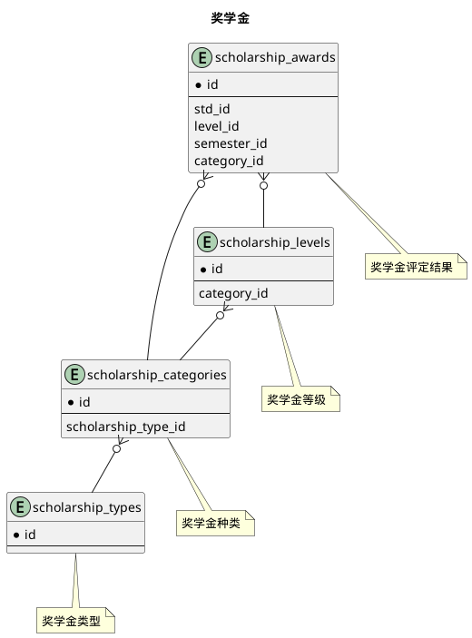
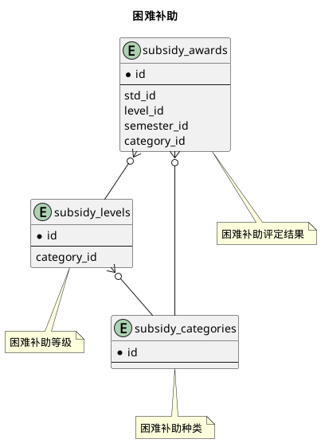



#### 目 录

##### 1. 数据库对象列表
  * [1.1 表格一览](index.html#表格一览)
  * [1.2 模块关系图](index.html#模块关系图)

##### 2. 具体模块明细
* [2.1 奖学金](/model/std/award/scholarship.html)
* [2.2 助学金](/model/std/award/stipend.html)
* [2.3 困难补助](/model/std/award/subsidy.html)
* [2.4 荣誉称号](/model/std/award/honor.html)
* [2.5 其他](/model/std/award/misc.html)

### 表格一览
Schema std.award下共计15个表，分别如下:

<table class="table table-bordered table-striped table-condensed">
  <tr>
    <th class="info_header text-center">序号</th>
    <th class="info_header">表名/描述</th>
    <th class="info_header text-center">序号</th>
    <th class="info_header">表名/描述</th>
  </tr>
  <tr>
    <td>1</td>
    <td><a href="/model/std/award/honor.html#表格-honor_awards-荣誉称号评定结果">honor_awards</a> 荣誉称号评定结果</td>
    <td>9</td>
    <td><a href="/model/std/award/scholarship.html#表格-scholarship_types-奖学金类型">scholarship_types</a> 奖学金类型</td>
  </tr>
  <tr>
    <td>2</td>
    <td><a href="/model/std/award/honor.html#表格-honor_categories-荣誉称号种类">honor_categories</a> 荣誉称号种类</td>
    <td>10</td>
    <td><a href="/model/std/award/stipend.html#表格-stipend_awards-助学金评定结果">stipend_awards</a> 助学金评定结果</td>
  </tr>
  <tr>
    <td>3</td>
    <td><a href="/model/std/award/honor.html#表格-honor_levels-荣誉称号等级">honor_levels</a> 荣誉称号等级</td>
    <td>11</td>
    <td><a href="/model/std/award/stipend.html#表格-stipend_categories-助学金种类">stipend_categories</a> 助学金种类</td>
  </tr>
  <tr>
    <td>4</td>
    <td><a href="/model/std/award/honor.html#表格-honor_types-荣誉称号类型">honor_types</a> 荣誉称号类型</td>
    <td>12</td>
    <td><a href="/model/std/award/stipend.html#表格-stipend_levels-助学金等级">stipend_levels</a> 助学金等级</td>
  </tr>
  <tr>
    <td>5</td>
    <td><a href="/model/std/award/misc.html#表格-punishments-处分">punishments</a> 处分</td>
    <td>13</td>
    <td><a href="/model/std/award/subsidy.html#表格-subsidy_awards-困难补助评定结果">subsidy_awards</a> 困难补助评定结果</td>
  </tr>
  <tr>
    <td>6</td>
    <td><a href="/model/std/award/scholarship.html#表格-scholarship_awards-奖学金评定结果">scholarship_awards</a> 奖学金评定结果</td>
    <td>14</td>
    <td><a href="/model/std/award/subsidy.html#表格-subsidy_categories-困难补助种类">subsidy_categories</a> 困难补助种类</td>
  </tr>
  <tr>
    <td>7</td>
    <td><a href="/model/std/award/scholarship.html#表格-scholarship_categories-奖学金种类">scholarship_categories</a> 奖学金种类</td>
    <td>15</td>
    <td><a href="/model/std/award/subsidy.html#表格-subsidy_levels-困难补助等级">subsidy_levels</a> 困难补助等级</td>
  </tr>
  <tr>
    <td>8</td>
    <td><a href="/model/std/award/scholarship.html#表格-scholarship_levels-奖学金等级">scholarship_levels</a> 奖学金等级</td>
    <td></td>
    <td></td>
  </tr>
</table>

### 模块关系图

#### 1. 奖学金
  * 关系图

#### 2. 助学金
  * 关系图

#### 3. 困难补助
  * 关系图

#### 4. 荣誉称号
  * 关系图

