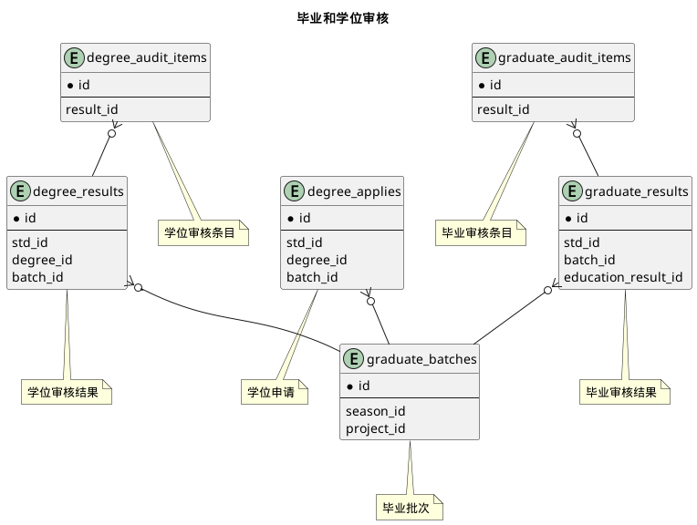



#### 目 录

##### 1. 数据库对象列表
  * [1.1 表格一览](index.html#表格一览)
  * [1.2 模块关系图](index.html#模块关系图)

##### 2. 具体模块明细
* [2.1 核心部分](/model/std/graduation/core.html)

### 表格一览
Schema std.graduation下共计6个表，分别如下:

<table class="table table-bordered table-striped table-condensed">
  <tr>
    <th class="info_header text-center">序号</th>
    <th class="info_header">表名/描述</th>
    <th class="info_header text-center">序号</th>
    <th class="info_header">表名/描述</th>
  </tr>
  <tr>
    <td>1</td>
    <td><a href="/model/std/graduation/core.html#表格-degree_applies-学位申请">degree_applies</a> 学位申请</td>
    <td>4</td>
    <td><a href="/model/std/graduation/core.html#表格-graduate_audit_items-毕业审核条目">graduate_audit_items</a> 毕业审核条目</td>
  </tr>
  <tr>
    <td>2</td>
    <td><a href="/model/std/graduation/core.html#表格-degree_audit_items-学位审核条目">degree_audit_items</a> 学位审核条目</td>
    <td>5</td>
    <td><a href="/model/std/graduation/core.html#表格-graduate_batches-毕业批次">graduate_batches</a> 毕业批次</td>
  </tr>
  <tr>
    <td>3</td>
    <td><a href="/model/std/graduation/core.html#表格-degree_results-学位审核结果">degree_results</a> 学位审核结果</td>
    <td>6</td>
    <td><a href="/model/std/graduation/core.html#表格-graduate_results-毕业审核结果">graduate_results</a> 毕业审核结果</td>
  </tr>
</table>

### 模块关系图

#### 1. 毕业和学位审核
  * 关系图

