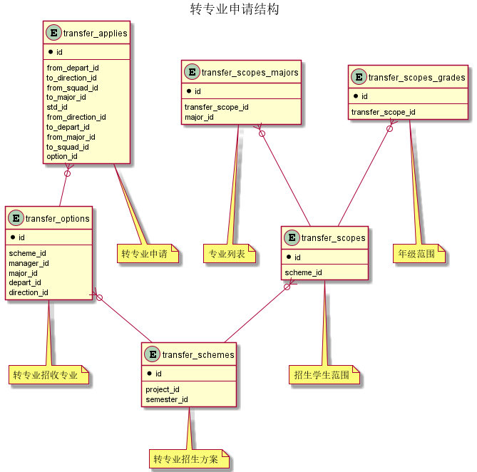



#### 目 录

##### 1. 数据库对象列表
  * [1.1 表格一览](index.html#表格一览)
  * [1.2 模块关系图](index.html#模块关系图)

##### 2. 具体模块明细
* [2.1 转专业](/model/std/transfer/misc.html)

### 表格一览
Schema std.transfer下共计1个表，分别如下:

<table class="table table-bordered table-striped table-condensed">
  <tr>
    <th class="info_header text-center">序号</th>
    <th class="info_header">表名/描述</th>
    <th class="info_header text-center">序号</th>
    <th class="info_header">表名/描述</th>
  </tr>
  <tr>
    <td>1</td>
    <td><a href="/model/std/transfer/misc.html#表格-transfer_applies-转专业申请">transfer_applies</a> 转专业申请</td>
    <td></td>
    <td></td>
  </tr>
</table>

### 模块关系图

#### 1. 转专业申请结构
  * 关系图

