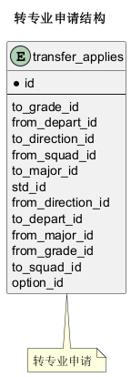

# 学籍管理 转专业 表结构

## 表格一览

<table class="table-mini">
  <thead>
    <tr>
      <th class="info_header text-center" width="7%">序号</th>
      <th class="info_header" width="43%">表名/描述</th>
      <th class="info_header text-center" width="7%">序号</th>
      <th class="info_header" width="43%">表名/描述</th>
    </tr>
  </thead>
  <tbody>
    <tr>
      <td class="text-center">1</td>
      <td><a href="/model/std/transfer.html#transfer-applies">transfer_applies</a> 转专业申请</td>
      <td></td>
      <td></td>
    </tr>
  </tbody>
</table>

## 关键关系图

### 关系图 1. 转专业申请结构
  * 关系图

## 表格明细

## transfer_applies

<table class="table-entity">
  <tbody>
    <tr>
      <td class="table-entity-title" width="15%">表名:&nbsp;</td>
      <td>std.transfer_applies 转专业申请</td>
    </tr>
    <tr>
      <td class="table-entity-title">唯一约束:&nbsp;</td>
      <td>主键🔑(id) </td>
    </tr>
  </tbody>
</table>

<table class="table-entity">
  <thead>
    <tr>
<th class="info_header text-center" width="7%">序号</th><th class="info_header" width="20%">字段名</th><th class="info_header" width="20%">字段类型</th><th class="info_header text-center" width="8%">是否可空</th><th class="info_header" width="25%">描述</th><th class="info_header" width="20%">引用表</th>    </tr>
  </thead>
  <tbody>
    <tr>
      <td class="text-center">1</td>
      <td>id</td>
      <td>bigint</td>
      <td class="text-center">否</td>
      <td>非业务主键:datetime</td>
      <td>      </td>
    </tr>
    <tr>
      <td class="text-center">2</td>
      <td>adjustable</td>
      <td>boolean</td>
      <td class="text-center">否</td>
      <td>是否服从调剂</td>
      <td>      </td>
    </tr>
    <tr>
      <td class="text-center">3</td>
      <td>audition_score</td>
      <td>float4</td>
      <td class="text-center">是</td>
      <td>面试分数</td>
      <td>      </td>
    </tr>
    <tr>
      <td class="text-center">4</td>
      <td>depart_opinion</td>
      <td>varchar(255)</td>
      <td class="text-center">是</td>
      <td>院系面试意见</td>
      <td>      </td>
    </tr>
    <tr>
      <td class="text-center">5</td>
      <td>email</td>
      <td>varchar(255)</td>
      <td class="text-center">否</td>
      <td>联系邮箱</td>
      <td>      </td>
    </tr>
    <tr>
      <td class="text-center">6</td>
      <td>from_depart_id</td>
      <td>integer</td>
      <td class="text-center">否</td>
      <td>转出院系ID</td>
      <td><a href="/model/base/user.html#departments">base.departments</a>      </td>
    </tr>
    <tr>
      <td class="text-center">7</td>
      <td>from_direction_id</td>
      <td>bigint</td>
      <td class="text-center">是</td>
      <td>转出专业方向ID</td>
      <td><a href="/model/base/edu.html#major-directions">base.major_directions</a>      </td>
    </tr>
    <tr>
      <td class="text-center">8</td>
      <td>from_grade_id</td>
      <td>bigint</td>
      <td class="text-center">否</td>
      <td>转出年级ID</td>
      <td><a href="/model/base/edu.html#grades">base.grades</a>      </td>
    </tr>
    <tr>
      <td class="text-center">9</td>
      <td>from_major_id</td>
      <td>bigint</td>
      <td class="text-center">否</td>
      <td>转出专业ID</td>
      <td><a href="/model/base/edu.html#majors">base.majors</a>      </td>
    </tr>
    <tr>
      <td class="text-center">10</td>
      <td>from_squad_id</td>
      <td>bigint</td>
      <td class="text-center">是</td>
      <td>转出班级ID</td>
      <td><a href="/model/base/edu.html#squads">base.squads</a>      </td>
    </tr>
    <tr>
      <td class="text-center">11</td>
      <td>gpa</td>
      <td>float4</td>
      <td class="text-center">否</td>
      <td>平均绩点</td>
      <td>      </td>
    </tr>
    <tr>
      <td class="text-center">12</td>
      <td>has_fail</td>
      <td>boolean</td>
      <td class="text-center">否</td>
      <td>是否有不及格课程</td>
      <td>      </td>
    </tr>
    <tr>
      <td class="text-center">13</td>
      <td>major_gpa</td>
      <td>float4</td>
      <td class="text-center">否</td>
      <td>专业课GPA</td>
      <td>      </td>
    </tr>
    <tr>
      <td class="text-center">14</td>
      <td>mobile</td>
      <td>varchar(255)</td>
      <td class="text-center">否</td>
      <td>联系电话</td>
      <td>      </td>
    </tr>
    <tr>
      <td class="text-center">15</td>
      <td>option_id</td>
      <td>bigint</td>
      <td class="text-center">否</td>
      <td>选择的招生专业ID</td>
      <td><a href="/model/cfg/all.html#std-transfer-options">cfg.std_transfer_options</a>      </td>
    </tr>
    <tr>
      <td class="text-center">16</td>
      <td>other_gpa</td>
      <td>float4</td>
      <td class="text-center">否</td>
      <td>专业课外GPA</td>
      <td>      </td>
    </tr>
    <tr>
      <td class="text-center">17</td>
      <td>passed</td>
      <td>boolean</td>
      <td class="text-center">是</td>
      <td>是否通过</td>
      <td>      </td>
    </tr>
    <tr>
      <td class="text-center">18</td>
      <td>reason</td>
      <td>varchar(255)</td>
      <td class="text-center">否</td>
      <td>申请理由</td>
      <td>      </td>
    </tr>
    <tr>
      <td class="text-center">19</td>
      <td>score</td>
      <td>float4</td>
      <td class="text-center">是</td>
      <td>考核分数</td>
      <td>      </td>
    </tr>
    <tr>
      <td class="text-center">20</td>
      <td>status</td>
      <td>integer</td>
      <td class="text-center">否</td>
      <td>状态</td>
      <td>      </td>
    </tr>
    <tr>
      <td class="text-center">21</td>
      <td>std_id</td>
      <td>bigint</td>
      <td class="text-center">否</td>
      <td>学生ID</td>
      <td><a href="/model/base/edu.html#students">base.students</a>      </td>
    </tr>
    <tr>
      <td class="text-center">22</td>
      <td>to_depart_id</td>
      <td>integer</td>
      <td class="text-center">否</td>
      <td>转入院系ID</td>
      <td><a href="/model/base/user.html#departments">base.departments</a>      </td>
    </tr>
    <tr>
      <td class="text-center">23</td>
      <td>to_direction_id</td>
      <td>bigint</td>
      <td class="text-center">是</td>
      <td>转入方向ID</td>
      <td><a href="/model/base/edu.html#major-directions">base.major_directions</a>      </td>
    </tr>
    <tr>
      <td class="text-center">24</td>
      <td>to_grade_id</td>
      <td>bigint</td>
      <td class="text-center">否</td>
      <td>转入年级ID</td>
      <td><a href="/model/base/edu.html#grades">base.grades</a>      </td>
    </tr>
    <tr>
      <td class="text-center">25</td>
      <td>to_major_id</td>
      <td>bigint</td>
      <td class="text-center">否</td>
      <td>转入专业ID</td>
      <td><a href="/model/base/edu.html#majors">base.majors</a>      </td>
    </tr>
    <tr>
      <td class="text-center">26</td>
      <td>to_squad_id</td>
      <td>bigint</td>
      <td class="text-center">是</td>
      <td>转入班级ID</td>
      <td><a href="/model/base/edu.html#squads">base.squads</a>      </td>
    </tr>
    <tr>
      <td class="text-center">27</td>
      <td>transfer_gpa</td>
      <td>float4</td>
      <td class="text-center">否</td>
      <td>转专业GPA</td>
      <td>      </td>
    </tr>
    <tr>
      <td class="text-center">28</td>
      <td>updated_at</td>
      <td>timestamptz</td>
      <td class="text-center">否</td>
      <td>更新时间</td>
      <td>      </td>
    </tr>
    <tr>
      <td class="text-center">29</td>
      <td>written_score</td>
      <td>float4</td>
      <td class="text-center">是</td>
      <td>笔试分数</td>
      <td>      </td>
    </tr>
  </tbody>
</table>
