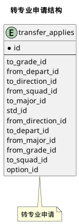


 目  录

* toc
{:toc}

### 关系图 1. 转专业申请结构
  * 关系图

### 表格 transfer_applies 转专业申请

  
<h5 id="table_std.transfer_applies">表格std.transfer_applies</h5>

  

<ul>
  <li>表格说明</li>
</ul>

<table class="table table-bordered table-striped table-condensed ">
<tr><th class="info_header">表名</th><th class="info_header">主键</th><th class="info_header" style="width:40%">注释</th>  </tr>
<tr><td>std.transfer_applies</td><td>id</td><td>转专业申请</td>  </tr>
</table>
<ul>
  <li>表格中的列</li>
</ul>
<table class="table table-bordered table-striped table-condensed">
<tr><th class="info_header text-center">序号</th><th class="info_header">字段名</th><th class="info_header">字段类型</th><th class="info_header text-center">是否可空</th><th class="info_header">描述</th><th class="info_header">引用表</th>  </tr>
<tr><td class="text-center">1</td><td>id</td><td>bigint</td><td class="text-center">否</td><td>非业务主键:datetime</td><td></td>  </tr>
<tr><td class="text-center">2</td><td>adjustable</td><td>boolean</td><td class="text-center">否</td><td>是否服从调剂</td><td></td>  </tr>
<tr><td class="text-center">3</td><td>audition_score</td><td>float4</td><td class="text-center">是</td><td>面试分数</td><td></td>  </tr>
<tr><td class="text-center">4</td><td>depart_opinion</td><td>varchar(255)</td><td class="text-center">是</td><td>院系面试意见</td><td></td>  </tr>
<tr><td class="text-center">5</td><td>email</td><td>varchar(255)</td><td class="text-center">否</td><td>联系邮箱</td><td></td>  </tr>
<tr><td class="text-center">6</td><td>from_depart_id</td><td>integer</td><td class="text-center">否</td><td>转出院系ID</td><td>            <a href="/model/base/common/user.html#表格-departments-部门组织机构信息">base.departments</a>
</td>  </tr>
<tr><td class="text-center">7</td><td>from_direction_id</td><td>bigint</td><td class="text-center">是</td><td>转出专业方向ID</td><td>            <a href="/model/base/edu/core.html#表格-directions-方向信息 专业领域">base.directions</a>
</td>  </tr>
<tr><td class="text-center">8</td><td>from_grade_id</td><td>bigint</td><td class="text-center">否</td><td>转出年级ID</td><td>            <a href="/model/base/std/core.html#表格-grades-年级">base.grades</a>
</td>  </tr>
<tr><td class="text-center">9</td><td>from_major_id</td><td>bigint</td><td class="text-center">否</td><td>转出专业ID</td><td>            <a href="/model/base/edu/core.html#表格-majors-专业">base.majors</a>
</td>  </tr>
<tr><td class="text-center">10</td><td>from_squad_id</td><td>bigint</td><td class="text-center">是</td><td>转出班级ID</td><td>            <a href="/model/base/std/core.html#表格-squads-学生行政班级信息">base.squads</a>
</td>  </tr>
<tr><td class="text-center">11</td><td>gpa</td><td>float4</td><td class="text-center">否</td><td>平均绩点</td><td></td>  </tr>
<tr><td class="text-center">12</td><td>has_fail</td><td>boolean</td><td class="text-center">否</td><td>是否有不及格课程</td><td></td>  </tr>
<tr><td class="text-center">13</td><td>major_gpa</td><td>float4</td><td class="text-center">否</td><td>专业课GPA</td><td></td>  </tr>
<tr><td class="text-center">14</td><td>mobile</td><td>varchar(255)</td><td class="text-center">否</td><td>联系电话</td><td></td>  </tr>
<tr><td class="text-center">15</td><td>option_id</td><td>bigint</td><td class="text-center">否</td><td>选择的招生专业ID</td><td>            <a href="/model/cfg/transfer.config/all.html#表格-std_transfer_options-转专业招收专业">cfg.std_transfer_options</a>
</td>  </tr>
<tr><td class="text-center">16</td><td>other_gpa</td><td>float4</td><td class="text-center">否</td><td>专业课外GPA</td><td></td>  </tr>
<tr><td class="text-center">17</td><td>passed</td><td>boolean</td><td class="text-center">是</td><td>是否通过</td><td></td>  </tr>
<tr><td class="text-center">18</td><td>reason</td><td>varchar(255)</td><td class="text-center">否</td><td>申请理由</td><td></td>  </tr>
<tr><td class="text-center">19</td><td>score</td><td>float4</td><td class="text-center">是</td><td>考核分数</td><td></td>  </tr>
<tr><td class="text-center">20</td><td>status</td><td>integer</td><td class="text-center">否</td><td>状态</td><td></td>  </tr>
<tr><td class="text-center">21</td><td>std_id</td><td>bigint</td><td class="text-center">否</td><td>学籍信息实现ID</td><td>            <a href="/model/base/std/core.html#表格-students-学籍信息实现">base.students</a>
</td>  </tr>
<tr><td class="text-center">22</td><td>to_depart_id</td><td>integer</td><td class="text-center">否</td><td>转入院系ID</td><td>            <a href="/model/base/common/user.html#表格-departments-部门组织机构信息">base.departments</a>
</td>  </tr>
<tr><td class="text-center">23</td><td>to_direction_id</td><td>bigint</td><td class="text-center">是</td><td>转入方向ID</td><td>            <a href="/model/base/edu/core.html#表格-directions-方向信息 专业领域">base.directions</a>
</td>  </tr>
<tr><td class="text-center">24</td><td>to_grade_id</td><td>bigint</td><td class="text-center">否</td><td>转入年级ID</td><td>            <a href="/model/base/std/core.html#表格-grades-年级">base.grades</a>
</td>  </tr>
<tr><td class="text-center">25</td><td>to_major_id</td><td>bigint</td><td class="text-center">否</td><td>转入专业ID</td><td>            <a href="/model/base/edu/core.html#表格-majors-专业">base.majors</a>
</td>  </tr>
<tr><td class="text-center">26</td><td>to_squad_id</td><td>bigint</td><td class="text-center">是</td><td>转入班级ID</td><td>            <a href="/model/base/std/core.html#表格-squads-学生行政班级信息">base.squads</a>
</td>  </tr>
<tr><td class="text-center">27</td><td>transfer_gpa</td><td>float4</td><td class="text-center">否</td><td>转专业GPA</td><td></td>  </tr>
<tr><td class="text-center">28</td><td>updated_at</td><td>timestamptz</td><td class="text-center">否</td><td>更新时间</td><td></td>  </tr>
<tr><td class="text-center">29</td><td>written_score</td><td>float4</td><td class="text-center">是</td><td>笔试分数</td><td></td>  </tr>
</table>

  

