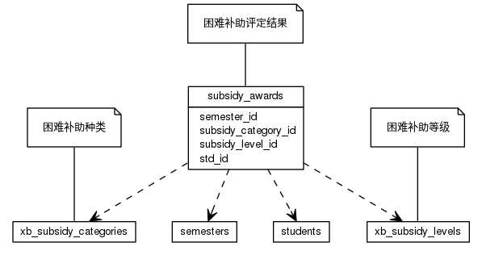


 目  录

* toc
{:toc}

### 关系图 1. 困难补助
  * 关系图

### 表格 subsidy_awards 困难补助评定结果

  * 表格说明

<table class="table table-bordered table-striped table-condensed">
<tr><th style="background-color:#D0D3FF">表名</th><th style="background-color:#D0D3FF">主键</th><th style="background-color:#D0D3FF">注释</th>  </tr>
<tr><td>subsidy_awards</td><td>id</td><td>困难补助评定结果</td>  </tr>
</table>

  * 表格中的列

<table class="table table-bordered table-striped table-condensed">
<tr><th style="background-color:#D0D3FF" class="text-center">序号</th><th style="background-color:#D0D3FF">字段名</th><th style="background-color:#D0D3FF">字段类型</th><th style="background-color:#D0D3FF" class="text-center">是否可空</th><th style="background-color:#D0D3FF">描述</th><th style="background-color:#D0D3FF">引用表</th>  </tr>
<tr><td class="text-center">1</td><td>id</td><td>bigint</td><td class="text-center">否</td><td>非业务主键:datetime</td><td></td>  </tr>
<tr><td class="text-center">2</td><td>award_amount</td><td>float4</td><td class="text-center">否</td><td>金额</td><td></td>  </tr>
<tr><td class="text-center">3</td><td>be_approved</td><td>boolean</td><td class="text-center">否</td><td>是否审核通过</td><td></td>  </tr>
<tr><td class="text-center">4</td><td>semester_id</td><td>integer</td><td class="text-center">否</td><td>评定学期ID</td><td>edu_base.semesters</td>  </tr>
<tr><td class="text-center">5</td><td>std_id</td><td>bigint</td><td class="text-center">否</td><td>学生ID</td><td>edu_base.students</td>  </tr>
<tr><td class="text-center">6</td><td>subsidy_category_id</td><td>integer</td><td class="text-center">否</td><td>困难补助种类ID</td><td>stu_award.subsidy_categories</td>  </tr>
<tr><td class="text-center">7</td><td>subsidy_level_id</td><td>integer</td><td class="text-center">否</td><td>获奖等级ID</td><td>stu_award.subsidy_levels</td>  </tr>
</table>

### 表格 subsidy_categories 困难补助种类

  * 表格说明

<table class="table table-bordered table-striped table-condensed">
<tr><th style="background-color:#D0D3FF">表名</th><th style="background-color:#D0D3FF">主键</th><th style="background-color:#D0D3FF">注释</th>  </tr>
<tr><td>subsidy_categories</td><td>id</td><td>困难补助种类</td>  </tr>
</table>

  * 表格中的列

<table class="table table-bordered table-striped table-condensed">
<tr><th style="background-color:#D0D3FF" class="text-center">序号</th><th style="background-color:#D0D3FF">字段名</th><th style="background-color:#D0D3FF">字段类型</th><th style="background-color:#D0D3FF" class="text-center">是否可空</th><th style="background-color:#D0D3FF">描述</th><th style="background-color:#D0D3FF">引用表</th>  </tr>
<tr><td class="text-center">1</td><td>id</td><td>integer</td><td class="text-center">否</td><td>非业务主键:auto_increment</td><td></td>  </tr>
<tr><td class="text-center">2</td><td>assess_period</td><td>varchar(255)</td><td class="text-center">否</td><td>评定周期</td><td></td>  </tr>
<tr><td class="text-center">3</td><td>award_unit</td><td>varchar(255)</td><td class="text-center">否</td><td>颁奖单位</td><td></td>  </tr>
<tr><td class="text-center">4</td><td>be_rated</td><td>boolean</td><td class="text-center">否</td><td>是否分等级</td><td></td>  </tr>
<tr><td class="text-center">5</td><td>code</td><td>varchar(255)</td><td class="text-center">否</td><td>困难补助代码</td><td></td>  </tr>
<tr><td class="text-center">6</td><td>discription</td><td>varchar(255)</td><td class="text-center">是</td><td>困难补助描述</td><td></td>  </tr>
<tr><td class="text-center">7</td><td>enabled</td><td>boolean</td><td class="text-center">否</td><td>使用状态</td><td></td>  </tr>
<tr><td class="text-center">8</td><td>name</td><td>varchar(255)</td><td class="text-center">否</td><td>困难补助名称</td><td></td>  </tr>
</table>

### 表格 subsidy_levels 困难补助等级

  * 表格说明

<table class="table table-bordered table-striped table-condensed">
<tr><th style="background-color:#D0D3FF">表名</th><th style="background-color:#D0D3FF">主键</th><th style="background-color:#D0D3FF">注释</th>  </tr>
<tr><td>subsidy_levels</td><td>id</td><td>困难补助等级</td>  </tr>
</table>

  * 表格中的列

<table class="table table-bordered table-striped table-condensed">
<tr><th style="background-color:#D0D3FF" class="text-center">序号</th><th style="background-color:#D0D3FF">字段名</th><th style="background-color:#D0D3FF">字段类型</th><th style="background-color:#D0D3FF" class="text-center">是否可空</th><th style="background-color:#D0D3FF">描述</th><th style="background-color:#D0D3FF">引用表</th>  </tr>
<tr><td class="text-center">1</td><td>id</td><td>integer</td><td class="text-center">否</td><td>非业务主键:auto_increment</td><td></td>  </tr>
<tr><td class="text-center">2</td><td>award_amount</td><td>float4</td><td class="text-center">否</td><td>奖励金额</td><td></td>  </tr>
<tr><td class="text-center">3</td><td>code</td><td>varchar(255)</td><td class="text-center">否</td><td>等级代码</td><td></td>  </tr>
<tr><td class="text-center">4</td><td>discription</td><td>varchar(255)</td><td class="text-center">是</td><td>等级描述</td><td></td>  </tr>
<tr><td class="text-center">5</td><td>enabled</td><td>boolean</td><td class="text-center">否</td><td>使用状态</td><td></td>  </tr>
<tr><td class="text-center">6</td><td>name</td><td>varchar(255)</td><td class="text-center">否</td><td>等级名称</td><td></td>  </tr>
<tr><td class="text-center">7</td><td>subsidy_category_id</td><td>integer</td><td class="text-center">否</td><td>困难补助种类ID</td><td>stu_award.subsidy_categories</td>  </tr>
</table>

